# Orange Pi AI Pro 20T用户手册

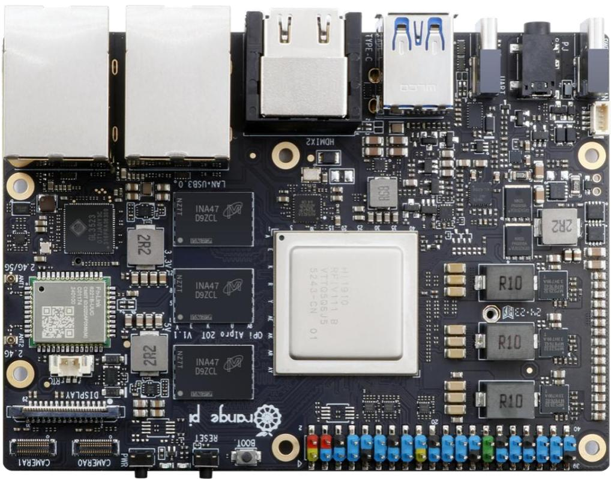


# 目录

# 1. 开发板参数介绍.

1.1. 开发板简介..

1.2. 开发板的硬件规格.

1.3. 开发板的顶层视图和底层视图. 3

1.4. 开发板的接口详情图. 4

# 2. 开发板使用介绍.

2.1. 准备需要的配件.

2.2. 下载开发板的镜像和相关的资料. 10

2.3. 控制启动设备的3 个拨码开关的使用说明. 10

2.4. 烧写 Linux 镜像到 TF 卡中的方法. 11

2.4.1. 基于 Windows PC 将 Linux 镜像烧写到 TF 卡的方法.

2.4.2. 基于 Ubuntu PC 将 Linux 镜像烧写到 TF 卡的方法. ..18

2.5. 烧写 Linux 镜像到 eMMC 中的方法.. .21

2.6. 烧写 Linux 镜像到 NVMe SSD 中的方法. . 26

2.7. 烧写 Linux 镜像到 SATA SSD 中的方法. 32

2.8. 烧写 OpenHarmony 镜像到 TF 中的方法. .38

2.8.1. 基于 Windows PC 将 OpenHarmony 镜像烧写到 TF 卡的方法 ........ 38

2.8.2. 基于 Ubuntu PC 将 OpneHarmony 镜像烧写到 TF 卡的方法 ........... 42

# 2.9. 启动开发板的步骤. . 46

2.9.1. 开发板更新 Firmware 步骤 . ..46

2.9.2. LINUX 系统开发板启动步骤. ..48

2.9.3. OpenHarmony 系统开发板启动步骤. ..49

# 2.10. 调试串口的使用方法. . 51

2.10.1. 通过 Type-C USB 接口来使用调试串口的连接说明. ..52

2.10.2. 通过 40 pin 接口中的 uart0 来使用调试串口的连接说明 ............... 52

2.10.3. Ubuntu 平台调试串口的使用方法. .. 54

2.10.4. Windows 平台调试串口的使用方法. .. 57

2.11. WIFI 蓝牙天线使用注意事项. .60

3. Ubuntu Xfce 桌面系统使用说明. .62

3.1. 已支持的Ubuntu镜像类型和内核版本. .62

3.2. Linux 系统功能适配情况. .62

3.3. Linux 系统登录说明. .64

3.3.1. 登录 Linux 系统桌面的方法 . ..64

3.3.2. Linux 系统默认登录账号和密码. ..64

3.4. 板载 LED 灯测试说明. .65

3.5. 网络连接测试.. 65

3.5.1. 以太网口测试. .. 65

3.5.2. WIFI 连接测试. ...66

3.5.3. 设置静态 IP 地址的方法. ..73

3.6. SSH 远程登录开发板.. .80

3.6.1. Ubuntu 下 SSH 远程登录开发板 . . 80

3.6.2. Windows 下 SSH 远程登录开发板 .. .. 80

3.7. HDMI 接口的使用说明. .82

3.7.1. HDMI 显示 Linux 桌面的说明 .. . 82

3.8. 蓝牙使用方法.. 82

3.9. USB 接口测试.. ..85

3.9.1. Type-C USB3.0 接口 Host 模式使用说明 . . 85

3.9.2. Type-C USB3.0 接口 Device 模式使用说明. . 85

3.9.3. 连接 USB 鼠标或键盘测试. ..87

3.9.4. USB 摄像头测试. ..88

3.10. 音频测试.. 89

3.10.1. ALSA 声卡设备测试. ..89

3.10.2. 耳机接口播放音频测试. .. 90

3.10.3. HDMI 音频播放测试. ..90

3.10.4. 耳机 MIC 录音测试 . ..91

3.11. 40 Pin 接口引脚功能说明. . 91

3.12. 40 pin 接口 GPIO、I2C、UART、SPI、PWM 和 CAN 测试.. ..93

3.12.1. 40 pin GPIO 口的测试方法. ..93

3.12.2. 40 pin SPI 回环测试. .. 96

3.12.3. 40 pin I2C 测试 . .. 98

3.12.4. 40 pin UART 测试 . ..99

3.12.5. 40 pin PWM 测试 . ..101

3.12.6. 40 pin CAN 的测试方法 . ..103

3.13. wiringOP 的安装使用方法. 109

3.13.1. 安装 wiringOP 的方法 . ..109

3.13.2. 使用 wiringOP 控制 40pin GPIO 的方法. .110

3.14. wiringOP 硬件 PWM 的使用方法.. 112

3.14.1. 使用 wiringOP 的 gpio 命令设置 PWM 的方法 .113

3.14.2. PWM测试程序的使用方法 .117

3.15. wiringOP-Python 的安装使用方法. .118

3.15.1. wiringOP-Python 的安装方法 . . 119

3.15.2. 40pin GPIO 口测试. ..121

3.15.3. 40pin SPI 测试. . 123

3.15.4. 40pin I2C 测试 .. .. 124

3.15.5. 40pin 的 UART 测试 . ..127

3.16. 上传文件到开发板Linux 系统中的方法.. .129

3.16.1. 在 Ubuntu PC 中上传文件到开发板 Linux 系统中的方法............ 129

3.16.2. 在 Windows PC 中上传文件到开发板 Linux 系统中的方法 .........132

3.17. 散热风扇的使用方法.. 136

3.18. AI CPU 和 control CPU 的设置方法.. .138

3.19. 设置 Swap 内存的方法. 139

3.20. 测试 MindSpore 的方法. . 140

3.21. 使用 ascend 硬件加速的 ffmpeg... . 140

3.21.1. 使用编译好的 deb 软件包. ..141

3.21.2. 从源代码构建 .. 142

3.21.3. 应用场景. .. 145

3.22. 安装内核头文件的方法. . 152

3.23. GPU 的测试方法. .154

3.24. 关机和重启开发板的方法.. . 154

4. 体验 AI 应用样例. .156

4.1. 登录 juypter lab.. .156

4.2. 释放内存的方法.. . 159

4.3. 运行在线推理案例的方法. .. 160

4.3.1. 运行一个简单的深度学习模型 .. 160

4.3.2. 运行 ResNet50 图像分类样例. ..163

4.3.3. 运行 Vision Transformer 图像分类样例. .. 165

4.3.4. 运行 FCN图像语义分割样例. ..168

4.3.5. 运行 ShuffleNet 图像分类样例 .. ..171

4.3.6. 运行 SSD 目标检测样例. ..173

4.3.7. 运行 RNN实现情感分类样例. ..175

4.3.8. 运行 LSTM+CRF 序列标注样例. ..177

4.3.9. 运行 GAN 图像生成样例. ..179

4.3.10. 运行 DCGAN 生成漫画头像样例. .. 182

4.3.11. 运行 Pix2Pix 实现图像转换样例 . ..184

4.3.12. 运行 Diffusion 扩散模型样例. .. 186

4.3.13. 运行 ResNet50 迁移学习样例. ..188

4.4. 运行llm 大语言模型的方法. . 191

4.4.1. qwen1.5-0.5b ... .. 192 

4.4.2. Tinyllama.. ..194 

4.4.3. DeepSeek-R1-Distill-Qwen-1.5B . ..195 

4.5. 运行离线推理案例的方法. . 197

5. AI 应用环境安装(OpenHarmony) .. .198

5.1. 推理环境安装. . 198

5.2. Python 环境安装.. ..201

5.3. 安装 toolkit 包. ..202

5.4. Kernels 环境安装. . 206

6. MindSDK 使用指南. .207

6.1. Vision SDK 视觉分析.. .207

6.1.1. 安装部署.. .. 207

6.1.2. 使用方法.. .. 207

7.Linux内核源码包的使用说明. ..212

7.1. 编译主机系统的需求. 212

7.2. 下载解压 Linux 内核源码包. ..213

7.3. 安装交叉编译工具链和依赖包. .. 214

7.4. 编译并生效内核Image 文件的方法. . 216

7.5. 编译并生效内核DTB文件的方法. ..218

8.Linux镜像编译脚本的使用说明 ..220

8.1. 编译主机系统的需求. 220

8.2. 制作Linux 镜像需要准备的东西. .221

8.3. 下载Linux 镜像编译脚本的源码压缩包.. ..222

8.4. 制作最小镜像的方法. . 223

8.5. 制作完整镜像的方法. . 226

8.6. 制作压缩扩容镜像的方法. . 227

9. 附录 .. . 231

9.1. 用户手册更新历史. 231

9.2. 镜像更新历史. . 231

# 1. 开发板参数介绍

# 1.1. 开发板简介

Orange PiAI Pro 20T开发板是香橙派联合华为精心打造的高性能 AI开发板，其搭载了昇腾 AI处理器，可提供 20TOPS INT8的计算能力，内存提供了 12GB和24GB两种版本。可以实现图像、视频等多种数据分析与推理计算，可广泛用于教育、机器人、无人机等场景。

# 1.2. 开发板的硬件规格

<table><tr><td colspan="2">Orange Pi AI Pro 20T 开发板硬件规格</td></tr><tr><td>昇腾 AI 处理器</td><td>4 核 64 位 Arm 处理器 + AI 处理器</td></tr><tr><td>AI 算力</td><td>半精度(FP16):10 TFLOPS整数精度(INT8):20 TOPS</td></tr><tr><td>内存</td><td>类型:LPDDR4X容量:12GB 或 24GB</td></tr><tr><td>存储</td><td>板载 32MB 的 SPI FlashMicro SD 卡插槽eMMC 插座:可外接 eMMC 模块M.2 M-Key 接口:可接 2280 规格的 NVMe SSD 或 SATA SSD</td></tr><tr><td>以太网</td><td>2 个 PCIe 2.5G 网口(RTL8125BG)</td></tr><tr><td>Wi-Fi+蓝牙</td><td>支持 2.4G 和 5G 双频 WIFIBT4.2模组:欧智通 6221BUUC</td></tr><tr><td>USB</td><td>3 个 USB3.0 Host 接口1 个 Type-C USB3.0 OTG 接口</td></tr><tr><td>摄像头</td><td>2 个 MIPI CSI 4 Lane 接口</td></tr><tr><td>显示</td><td>2 个 HDMI 接口1 个 MIPI DSI 4 Lane 接口</td></tr><tr><td>音频</td><td>1 个 3.5mm 耳机孔,支持音频输入输出• 2个HDMI音频输出</td></tr><tr><td>40 pin扩展口</td><td>用于扩展UART、I2C、SPI、PWM和GPIO等接口</td></tr><tr><td>按键</td><td>1个复位键,1个关机键,1个升级按键</td></tr><tr><td>拨码开关</td><td>用于控制SD卡、eMMC和SSD启动选项</td></tr><tr><td>电源</td><td>支持Type-C供电,20V PD-65W适配器</td></tr><tr><td>LED灯</td><td>1个电源指示灯和1个软件可控指示灯</td></tr><tr><td>风扇接口</td><td>4pin,1.0mm间距,用于接12V风扇,支持PWM控制</td></tr><tr><td>电池接口</td><td>2pin,2.54mm间距,用于接3串电池,支持快充</td></tr><tr><td>RTC</td><td>2pin,1.25mm间距,用于接RTC电池</td></tr><tr><td>调试串口</td><td>Type-C USB接口的调试串口</td></tr><tr><td>支持的操作系统</td><td>Ubuntu 22.04和openEuler 22.03</td></tr><tr><td colspan="2">外观规格介绍</td></tr><tr><td>产品尺寸</td><td>115*83mm</td></tr><tr><td>重量</td><td>120g</td></tr><tr><td colspan="2">rangePiTM是深圳市迅龙软件有限公司的注册商标</td></tr></table>

# 1.3. 开发板的顶层视图和底层视图


顶层视图：


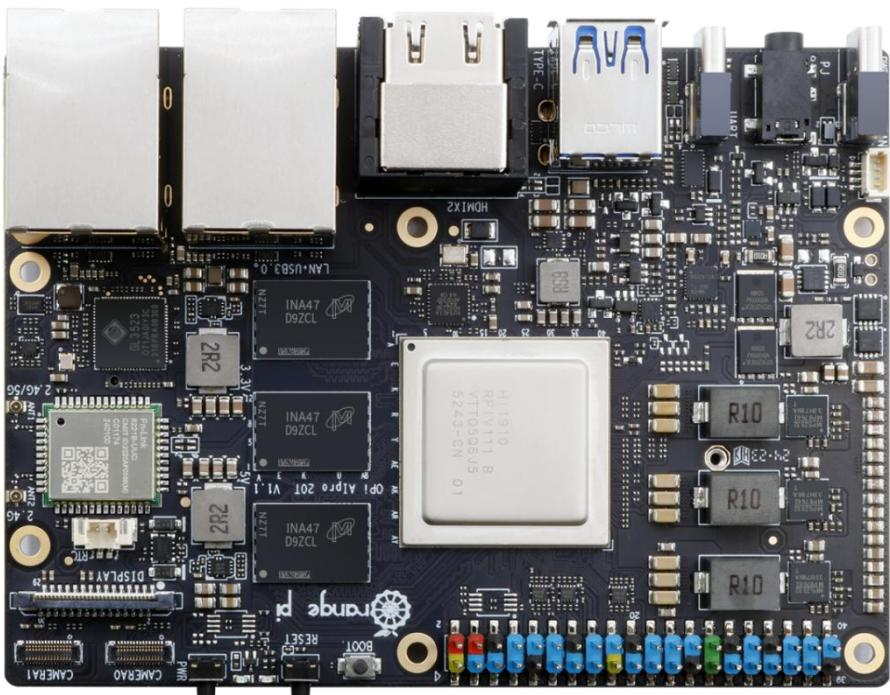


底层视图：


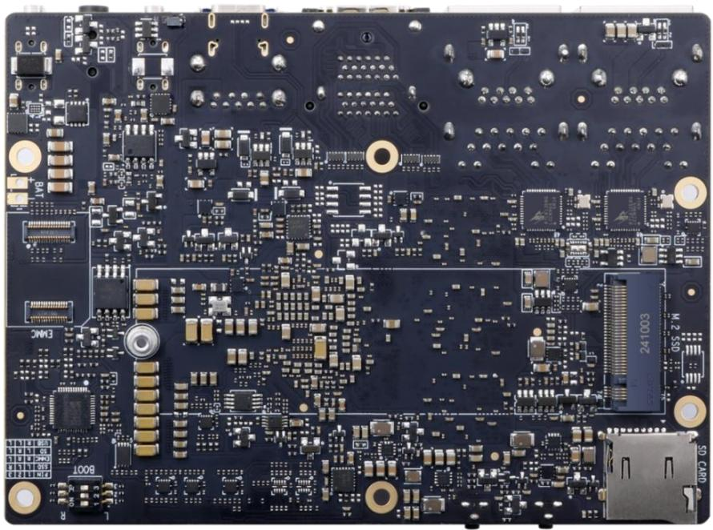


# 1.4. 开发板的接口详情图


顶层视图


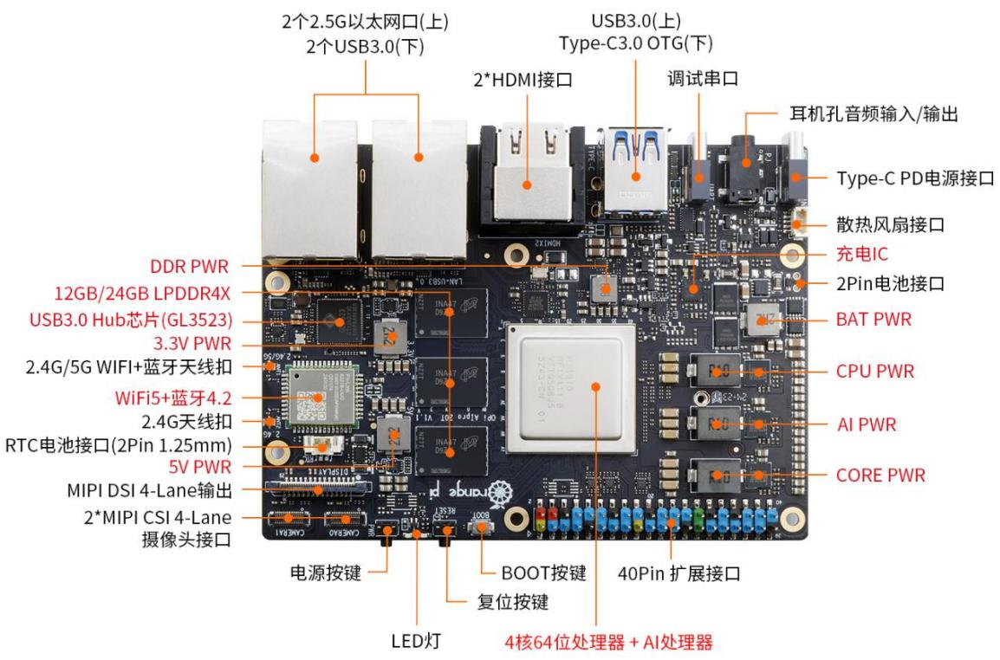


底层视图


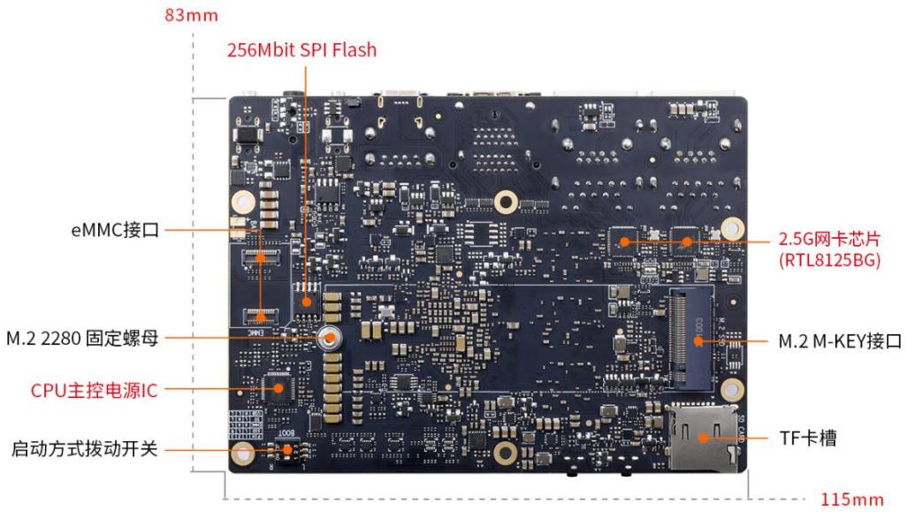


# 2. 开发板使用介绍

# 2.1. 准备需要的配件

1) TF 卡，最小 32GB 容量的 class10 级或以上的高速闪迪卡。强烈推荐使用 64GB或以上容量的TF卡。


2)TF卡读卡器，用于读写 TF卡。


3) HDMI 转 HDMI 连接线，用于将开发板连接到 HDMI 显示器或者电视进行显示。


4) Type-C转USB3.0 转接线，用于Type-C接口连接USB3.0 的存储设备。


5) Type-C接口的数据线，用于调试串口、Type-C USB接口的Device等功能


6) 10.1 寸MIPI屏幕（和RK3588 系列开发板使用的 10.1 寸LCD屏幕一样）


7) HDMI接口的显示器


8) 电源，Type-C 接口的 20V PD-65W 适配器。


开发板上有三个Type-C接口，其中靠近PWM风扇接口的那个才是PD电源接口，另外两个Type-C接口是不能给开发板供电的，请别接错了。

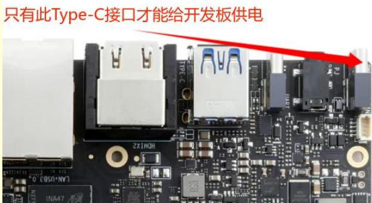


9) M.2 M-Key 2280 规格PCIe NVMe SSD。


10) M.2 M-Key 2280 规格的SATA SSD。


11) eMMC模块


12) USB接口的鼠标和键盘。


13) USB摄像头。


14)配套金属外壳。

15)网线，用于将开发板连接到因特网。


16) 12V的 PWM散热风扇。

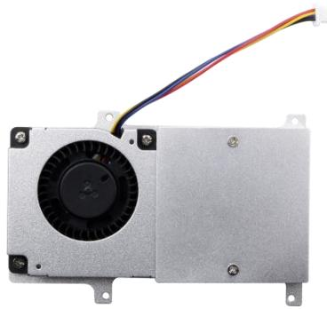


开发板上PWM风扇接口位置如下图所示：

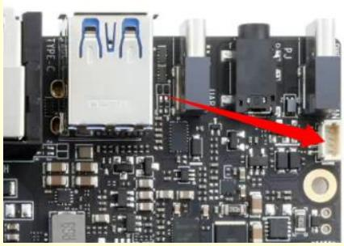


17) RTC 电池，接口为 2pin，1.25mm 间距。


开发板上RTC电池接口的位置如下图所示：

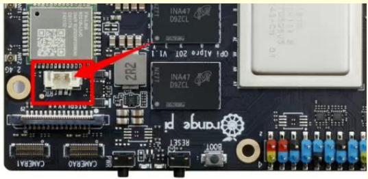


18) 安装有 Ubuntu 22.04 和 Windows 操作系统的 X64 电脑。

<table><tr><td>1</td><td>Ubuntu22.04 PC</td><td>可选,用于编译 Linux 源码</td></tr><tr><td>2</td><td>Windows PC</td><td>用于烧录 Ubuntu 和 openEuler 镜像</td></tr></table>

# 2.2. 下载开发板的镜像和相关的资料

开发板资料下载页面的链接如下所示：

```txt
http://www.orangepi.cn/html/hardWare/computerAndMicrocontrollers/service-and-support/Orange-Pi-AIpro(20T).html 
```


官方资料


官方镜像


ubuntu镜像


openEuler


openeuler镜像


# 2.3. 控制启动设备的 3 个拨码开关的使用说明

开发板的 Linux 系统支持从 TF 卡、eMMC 和 SSD（支持 NVMe SSD 和 SATASSD）启动，USB启动不支持。具体从哪个设备启动是由开发板背面的 3个拨码开关来控制的。

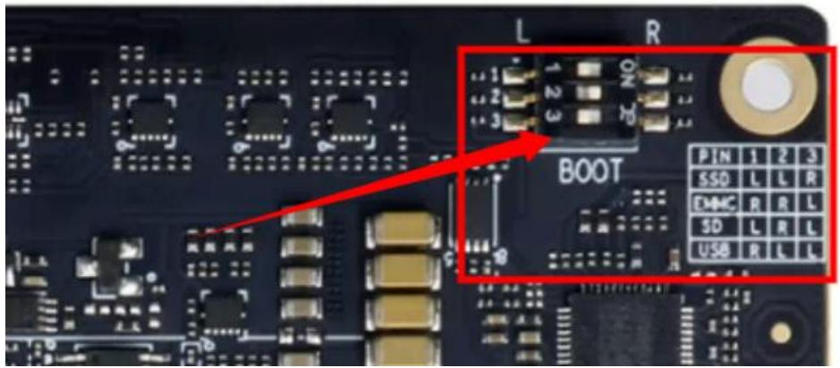


3个拨码开关都支持左右 2种设置状态，所以总共有 8种设置状态，目前开发板只使用了其中的3种。不同的设置状态对应的启动设备如下表所示：

<table><tr><td>拨码开关1</td><td>拨码开关2</td><td>拨码开关3</td><td>对应的启动设备</td></tr><tr><td>左</td><td>左</td><td>右</td><td>SATA SSD 和 NVMe SSD</td></tr><tr><td>右</td><td>右</td><td>左</td><td>eMMC</td></tr><tr><td>左</td><td>右</td><td>左</td><td>TF 卡</td></tr></table>

注意，SATA SSD和NVMe SSD的启动方式对应的拨码开关的设置状态是一样的。这两种启动方式是通过M2_TYPE引脚的电平来自动区分的。

另外请注意，切换拨码开关后必须重新拔插电源上下电才能让新的启动设备选项生效。通过开发板的复位按键来复位系统是不会让拨码开关新设置的配置生效的。

# 2.4. 烧写 Linux 镜像到 TF 卡中的方法

# 2.4.1. 基于 Windows PC 将 Linux 镜像烧写到 TF 卡的方法

注意，这里说的Linux镜像具体指的是从开发板的资料下载页面下载的Ubuntu或者openEuler镜像。

# 2.4.1.1. 使用 Win32Diskimager 烧录 Linux 镜像的方法

1)首先准备一张 32GB 或更大容量的 TF 卡（推荐使用 64GB 或以上容量的 TF卡），TF卡的传输速度必须为 class10级或 class10级以上，建议使用闪迪等品牌的TF卡。

2) 然后把TF 卡插入读卡器，再把读卡器插入电脑。

3) 接着格式化 TF卡。

a. 可以使用 SD Card Formatter 这个软件格式化 TF 卡，其下载地址为

```txt
https://www.sdcard.org/downloads/formatter/eula_windows/SDCardFormatterv5_WinEN.zip 
```

b. 下载完后直接解压安装即可，然后打开软件。

c. 如果电脑只插入了 TF卡，则“Select card”一栏中会显示 TF卡的盘符，如果电脑插入了多个 USB存储设备，可以通过下拉框选择 TF卡对应的盘符。

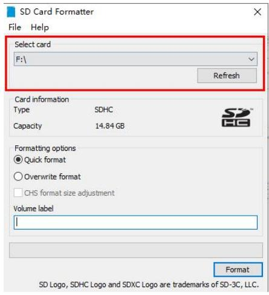


d. 然后点击“Format”，格式化前会弹出一个警告框，选择“是(Y)”后就会开始格式化。

SD Card Formatter 


Formatting willeraseall dataon thiscard Doyou wantto continue? 

Note:Asformatting cantake some time(especiallywhen overwrite option isselected),pleasemake sure that your computer isconnected toapower supply and that sleep mode isdisabled. 

是

否（N）

e. 格式化完 TF 卡后会弹出下图所示的信息，点击确定即可。


4) 从开发板的资料下载页面下载想要烧录的Linux操作系统镜像文件压缩包，然后使用解压软件解压，解压后的文件中，以“.img”结尾的文件就是操作系统的镜像文件。

5) 使用 Win32Diskimager 烧录 Linux 镜像到 TF 卡。

a. Win32Diskimager 的下载页面为

http://sourceforge.net/projects/win32diskimager/files/Archive/ 

b. 下载完后直接安装即可，Win32Diskimager 界面如下所示。

a) 首先选择镜像文件的路径。

b) 然后确认下TF 卡的盘符和“设备”一栏中显示的一致。

c) 最后点击“写入”即可开始烧录。

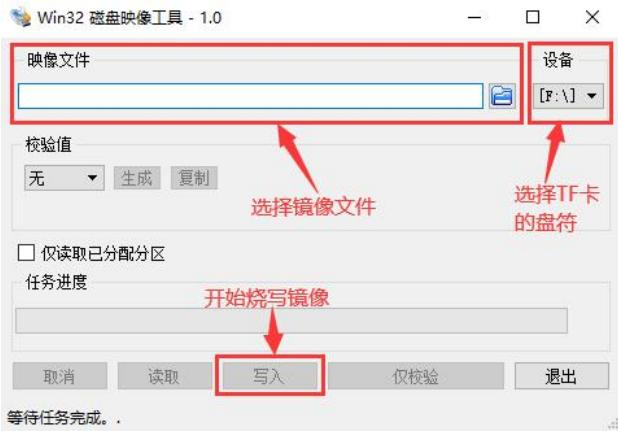


c. 镜像写入完成后，点击“退出”按钮退出即可，然后就可以拔出TF卡插到开发板中启动。

烧录完成后，如果系统弹出Windows提示窗口，这是正常现象，并非烧录出错。此时请选择“取消”，不要选择“格式化磁盘”，否则会将已烧录的镜像格式化。


注意，启动系统前请确保拨码开关拨到了TF卡启动的位置了。拨码开关的使用说明请参考控制启动设备的两个拨码开关的使用说明一小节的说明。

# 2.4.1.2. 使用 balenaEtcher 烧录 Linux 镜像的方法

1)首先准备一张 32GB 或更大容量的 TF 卡（推荐使用 64GB 或以上容量的 TF卡），TF 卡的传输速度必须为 class10 级或 class10 级以上，建议使用闪迪等品牌的TF卡。

2) 然后把TF 卡插入读卡器，再把读卡器插入电脑。

3) 从开发板的资料下载页面下载想要烧录的Linux镜像压缩包。

4) 然后下载用于烧录 Linux 镜像的软件——balenaEtcher，下载地址为：

https://www.balena.io/etcher/ 

5) 进入 balenaEtcher 下载页面后，点击绿色的下载按钮会跳到软件下载的地方。


6) 然后可以选择下载 Portable 版本的 balenaEtcher，Portable 版本无需安装，双击打开就可以使用。

# Download Etcher

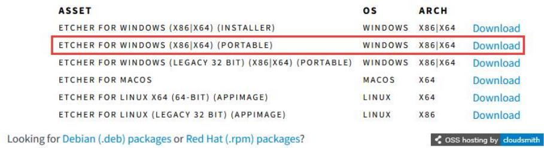


7) 打开后的 balenaEtcher 界面如下图所示：


打开balenaEtcher时如果提示下面的错误：


请选择 balenaEtcher 后点击右键，然后选择以管理员身份运行。


8) 使用 balenaEtcher 烧录 Linux 镜像的具体步骤如下所示：

a. 首先选择要烧录的Linux镜像文件的路径。

b. 然后选择TF卡的盘符。

c. 最后点击 Flash 就会开始烧录 Linux 镜像到 TF 卡中。

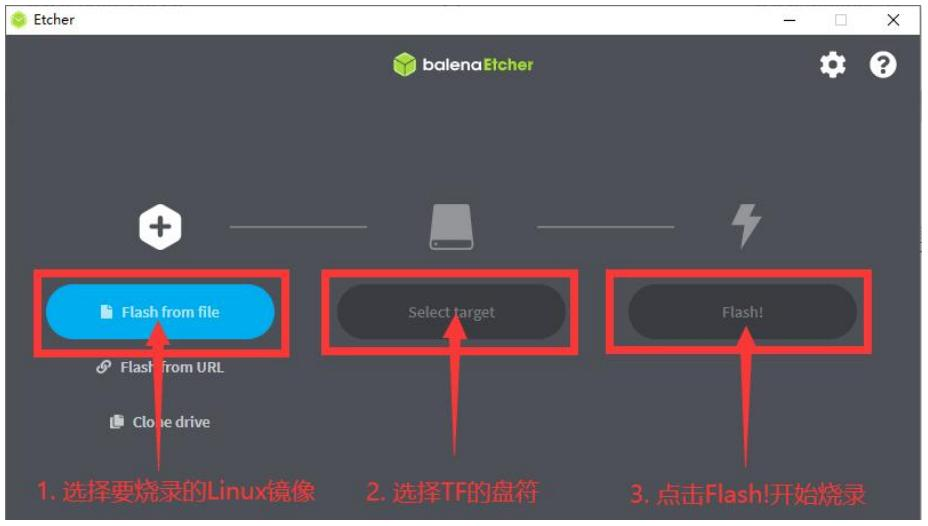


9) balenaEtcher 烧录 Linux 镜像的过程显示的界面如下图所示，另外进度条显示紫色表示正在烧录Linux镜像到TF卡中。

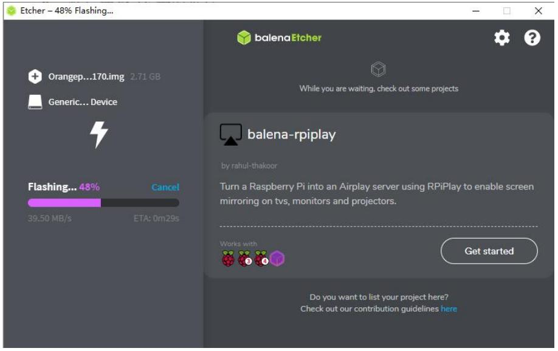


10) Linux 镜像烧录完后，balenaEtcher 默认还会对烧录到 TF 卡中的镜像进行校验，确保烧录过程没有出问题。如下图所示，显示绿色的进度条就表示镜像已经烧录完成，balenaEtcher正在对烧录完成的镜像进行校验。

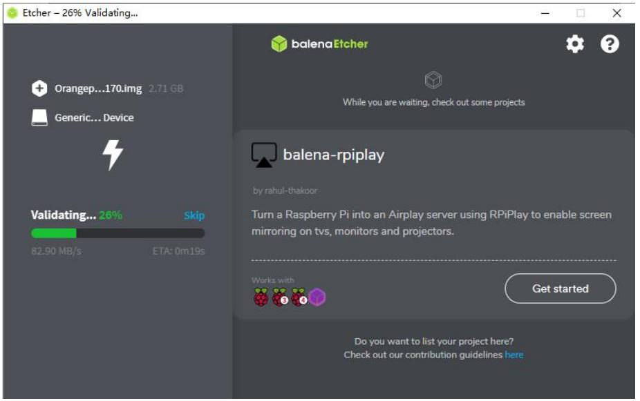


11)成功烧录完成后 balenaEtcher的显示界面如下图所示，如果显示绿色的指示图标说明镜像烧录成功，此时就可以退出 balenaEtcher，然后拔出 TF卡插入到开发板的TF卡槽中使用了。


烧录完成后，如果系统弹出Windows提示窗口，这是正常现象，并非烧录出错。此时请选择“取消”，不要选择“格式化磁盘”，否则会将已烧录的镜像格式化。


注意，启动系统前请确保拨码开关拨到了TF卡启动的位置了。拨码开关的使用说明请参考控制启动设备的 3 个拨码开关的使用说明一小节的说明。

# 2.4.2. 基于 Ubuntu PC 将 Linux 镜像烧写到 TF 卡的方法

注意，这里说的Linux镜像具体指的是从开发板的资料下载页面下载的Ubuntu或者openEuler镜像。

1) 首先准备一张 32GB 或更大容量的 TF 卡（推荐使用 64GB 或以上容量的 TF卡），TF 卡的传输速度必须为 class10 级或 class10 级以上，建议使用闪迪等品牌的TF卡。

2) 然后把TF 卡插入读卡器，再把读卡器插入电脑。

3) 下载 balenaEtcher 软件，下载地址为：

https://www.balena.io/etcher/ 

4) 进入 balenaEtcher 下载页面后，点击绿色的下载按钮会跳到软件下载的地方。


balena 

More Products 

Sign Up 


5)然后选择下载Linux版本的软件即可。


Download Etcher


<table><tr><td>ASSET</td><td>OS</td><td>ARCH</td><td></td></tr><tr><td>ETCHER FOR WINDOWS (X86|X64) (INSTALLER)</td><td>WINDOWS</td><td>X86|X64</td><td>Download</td></tr><tr><td>ETCHER FOR WINDOWS (X86|X64) (PORTABLE)</td><td>WINDOWS</td><td>X86|X64</td><td>Download</td></tr><tr><td>ETCHER FOR WINDOWS (LEGACY 32 BIT) (X86|X64) (PORTABLE)</td><td>WINDOWS</td><td>X86|X64</td><td>Download</td></tr><tr><td>ETCHER FOR MACOS</td><td>MACOS</td><td>X64</td><td>Download</td></tr><tr><td>ETCHER FOR LINUX X64 (64-BIT) (APPIMAGE)</td><td>LINUX</td><td>X64</td><td>Download</td></tr><tr><td>ETCHER FOR LINUX (LEGACY 32 BIT) (APPIMAGE)</td><td>LINUX</td><td>X86</td><td>Download</td></tr></table>

6)从开发板的资料下载页面下载想要烧录的 Linux镜像文件压缩包。

7) 然后在 Ubuntu PC 的图形界面双击 balenaEtcher-x.x.x-x64.AppImage 即可打开balenaEtcher，balenaEtcher 打开后的界面显示如下图所示：

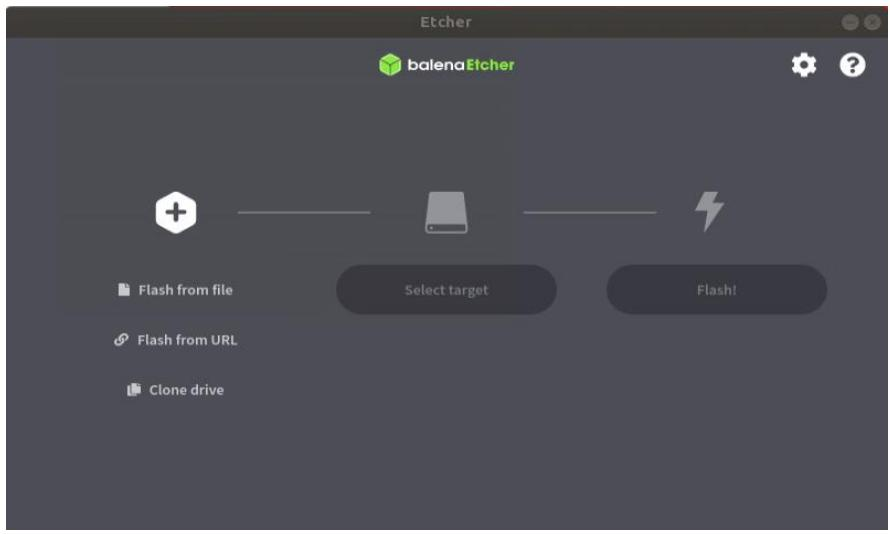


8) 使用 balenaEtcher 烧录 Linux 镜像的具体步骤如下所示：

a. 首先选择要烧录的Linux镜像文件的路径。

b. 然后选择TF卡的盘符。

c. 最后点击 Flash 就会开始烧录 Linux 镜像到 TF 卡中。

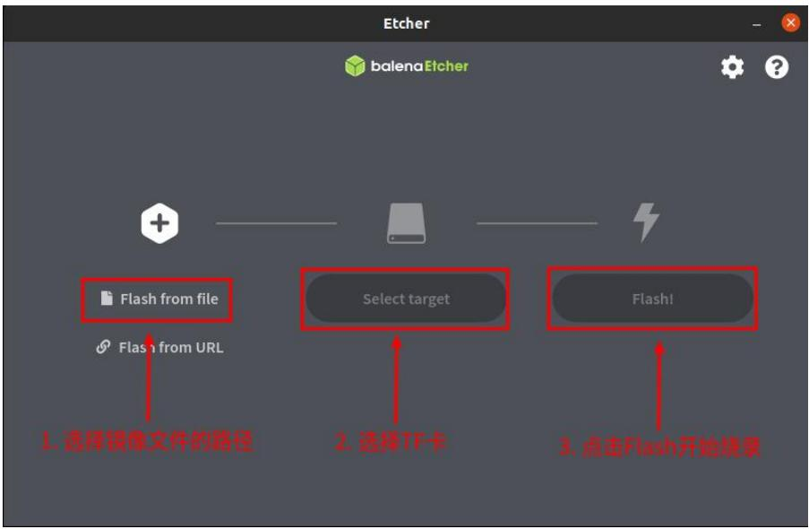


9) balenaEtcher 烧录 Linux 镜像的过程显示的界面如下图所示，另外进度条显示紫色表示正在烧录Linux镜像到TF卡中。

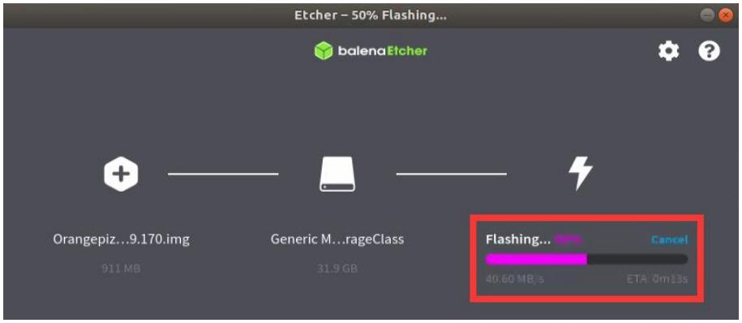


10) Linux 镜像烧录完后，balenaEtcher 默认还会对烧录到 TF 卡中的镜像进行校验，确保烧录过程没有出问题。如下图所示，显示绿色的进度条就表示镜像已经烧录完成，balenaEtcher正在对烧录完成的镜像进行校验。

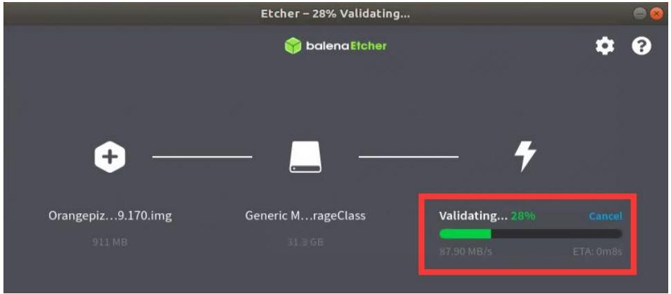


11) 成功烧录完成后 balenaEtcher 的显示界面如下图所示，如果显示绿色的指示图标说明镜像烧录成功，此时就可以退出 balenaEtcher，然后拔出 TF卡插入到开发板的TF卡槽中使用了。

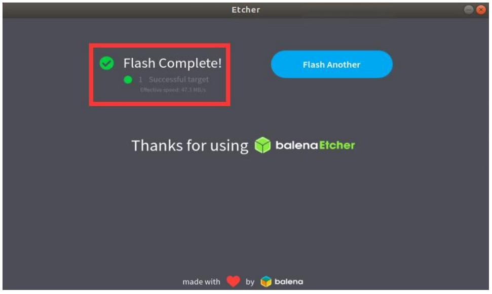


注意，启动系统前请确保拨码开关拨到了TF卡启动的位置了。拨码开关的使用说明请参考控制启动设备的 3 个拨码开关的使用说明一小节的说明。

# 2.5. 烧写 Linux 镜像到 eMMC 中的方法

注意，这里说的Linux镜像具体指的是从开发板的资料下载页面下载的Ubuntu或者openEuler镜像。

1)开发板预留了 eMMC模块的扩展接口，烧录系统到 eMMC前，需要先购买一个与开发板 eMMC 接口相匹配的 eMMC 模块。然后将eMMC模块安装到开发板上。配套的eMMC 模块和插入开发板的方法如下所示：


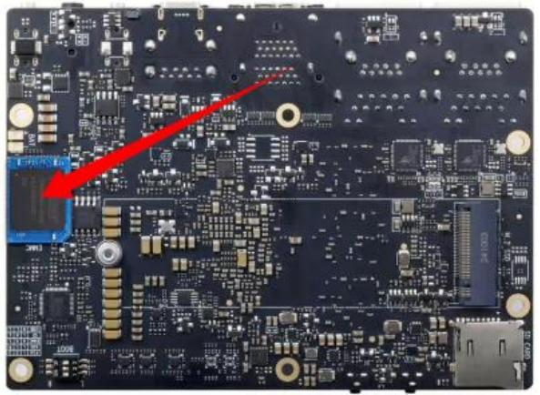


2) 烧录 Linux 镜像到 eMMC 中需要借助 TF 卡来完成，所以首先需要将 Linux镜像烧录到 TF卡上，然后使用 TF卡启动开发板进入 Linux 系统。烧录 Linux镜像到TF卡的方法请见烧写 Linux镜像到 TF卡中的方法一小节的说明。

3) 启动进入 TF 卡的 Linux 系统后，请先确认下 eMMC模块已经被开发板的 Linux系统正常识别了。如果 eMMC模块正常识别了的话，在 root用户下使用 fdisk -l命令就能看到eMMC模块的容量信息。

(base) root@orangepiaipro-20t:~# fdisk -l 

Disk /dev/mmcblk0: 28.91 GiB, 31037849600 bytes, 60620800 sectors 

...... 

4) 然后将要烧录的 Linux 镜像文件压缩包上传到TF卡的Linux系统中。

注意，使用xz格式压缩的Linux镜像压缩包不需要解压，balenaEtcher烧录时会自动解压。

5) 然后就可以开始使用 balenaEtcher 软件烧录镜像到 eMMC中了。Linux系统中已经预装了balenaEtcher，打开方法如下所示：


6) balenaEtcher 打开后的界面如下所示：


7)然后点击Flash fromfile选择前面上传的想要烧录的镜像文件。

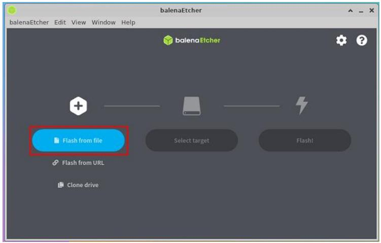


如果打开Linux镜像文件时提示没有权限，请使用sudo chmod 777 镜像文件名这条命令来给镜像文件添加权限。

8) 然后点击 Select target。

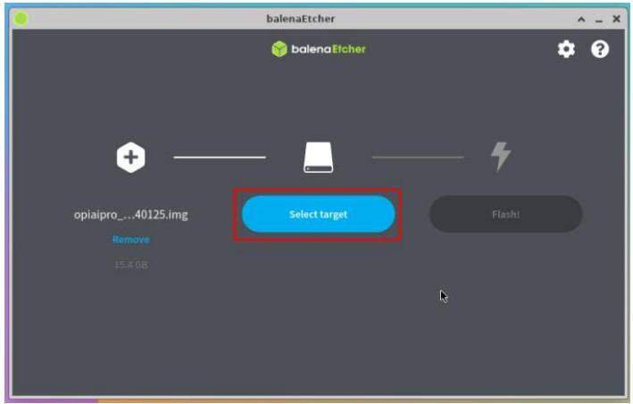


9) 然后选择 eMMC 对应的/dev/mmcblk0 选项，再点击 Select 即可。

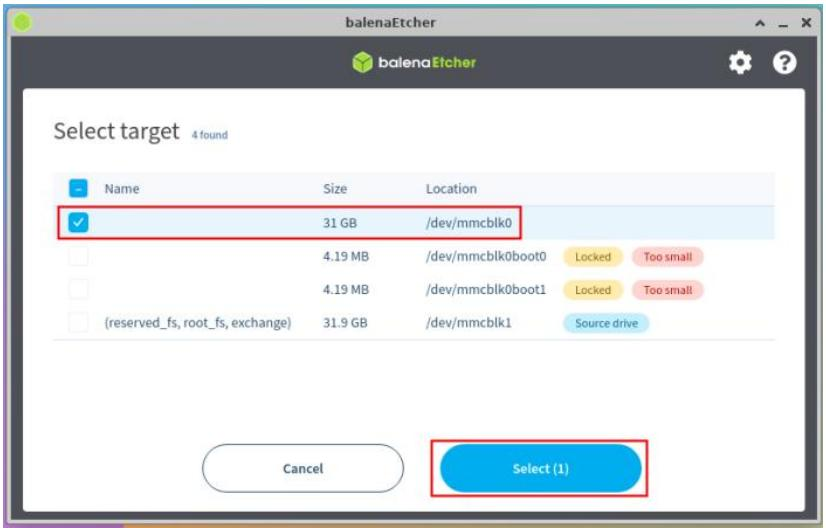


10) 然后点击 Flash!开始烧录。

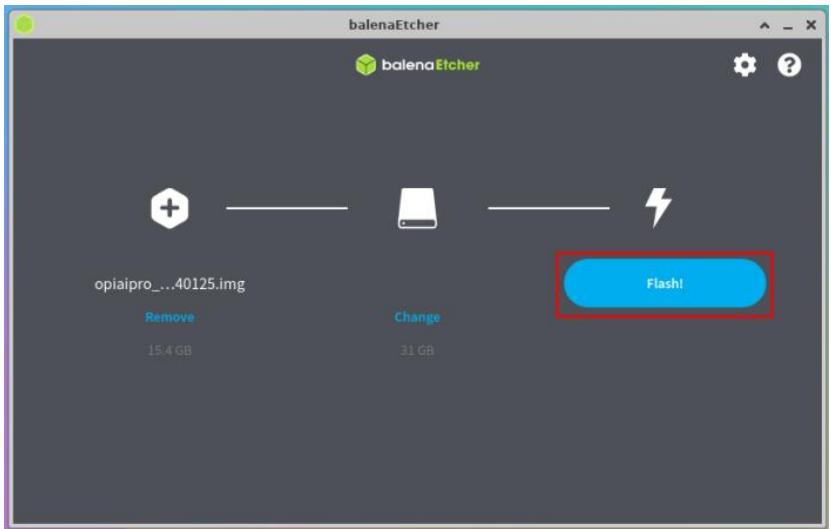


11) 然后输入 Linux 系统的密码：Mind@123。

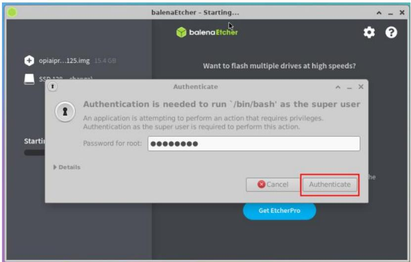


12) 然后就会真正开始烧录Linux镜像到eMMC中了。


13) Linux 镜像烧录完后的显示如下所示：

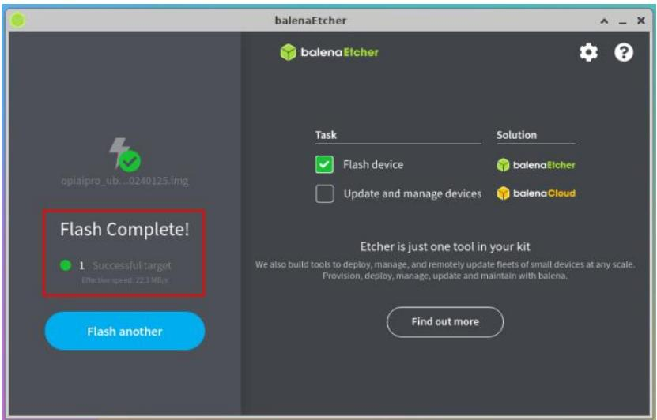


14) 此时就可以关闭掉 Linux 系统，然后拔出 TF 卡，并断开 Type-C电源。再将 3个拨码开关拨到 eMMC启动对应的位置，然后重新插入 Type-C 电源就可以启动eMMC中的 Linux系统了。

注意，启动系统前请确保拨码开关拨到eMMC启动的位置了。拨码开关的使用说明请参考控制启动设备的 3个拨码开关的使用说明一小节的说明。

# 2.6. 烧写 Linux 镜像到 NVMe SSD 中的方法

注意，这里说的Linux镜像具体指的是从开发板的资料下载页面下载的Ubuntu

# 或者openEuler镜像。

1)首先需要准备一个 2280规格 NVMe SSD，开发板 M.2插槽支持的 PCIe规格为PCIe3.0x4。PCIe3.0 和 PCIe4.0 的 NVMe SSD 都是可以用的，只是 PCIe4.0 SSD 速度最高只有 PCIe3.0x4的速度。2242等其他规格的 SSD也都是可以使用的，只是没法固定。


2) 然后把 NVMe SSD 插入开发板的 M.2接口中，并固定好。

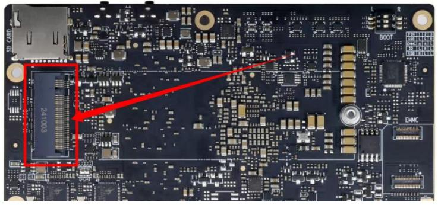


3) 烧录 Linux 镜像到 NVMe SSD 中需要借助 TF 卡来完成，所以首先需要将 Linux镜像烧录到 TF卡上，然后使用TF卡启动开发板进入 Linux系统。烧录Linux镜像到 TF 卡的方法请见烧写 Linux 镜像到 TF 卡中的方法一小节的说明。

4)启动进入 TF卡的 Linux系统后，请先确认下 NVMe SSD已经被开发板的 Linux系统正常识别了。如果 NVMeSSD正常识别了的话，使用 sudo fdisk-l命令就能看到nvme相关的信息。

```txt
(base) HwHiAiUser@orangepiaipro-20t:~$ sudo fdisk -l | grep "nvme0n1" Disk /dev/nvme0n1: 238.47 GiB, 256060514304 bytes, 500118192 sectors .... 
```

5) 然后将要烧录的 Linux 镜像文件压缩包上传到TF卡的Linux系统中。

注意，使用xz格式压缩的Linux镜像压缩包不需要解压，balenaEtcher烧录时会自动解压。

6)然后就可以开始使用 balenaEtcher软件烧录镜像到 SSD中了。Linux系统中已经预装了balenaEtcher，打开方法如下所示：


7) balenaEtcher 打开后的界面如下所示：

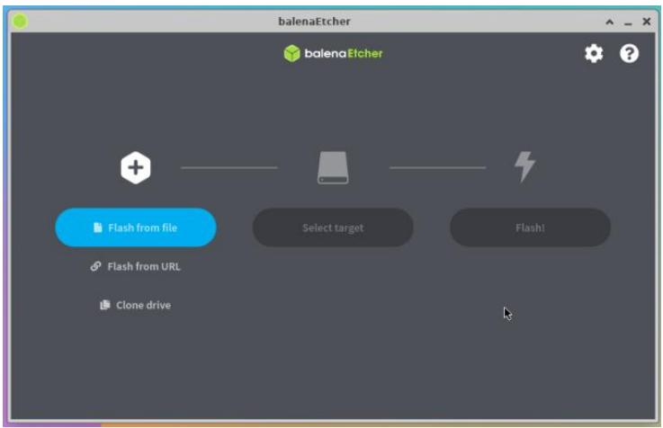


如果打开Linux镜像文件时提示没有权限，请使用sudo chmod 777 镜像文件名这条命令来给镜像文件添加权限。

8) 然后点击 Flash from file 选择前面上传的想要烧录的镜像文件。

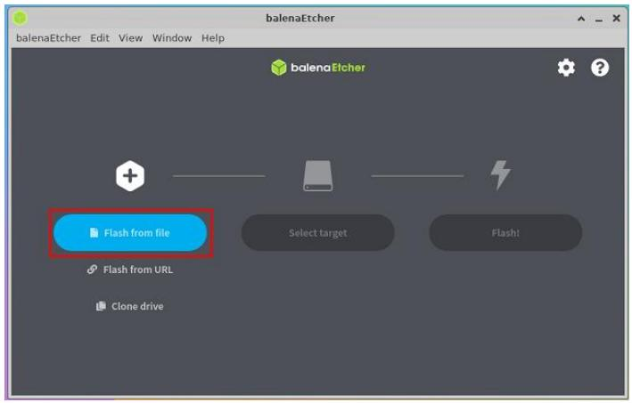


9) 然后点击 Select target。


10) 然后点击 Show 1 hidden。

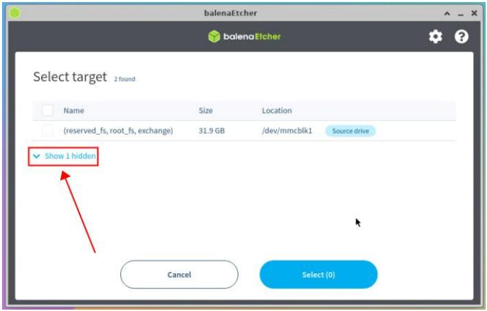


11) 然后选择SSD 对应的选项，再点击Select即可。

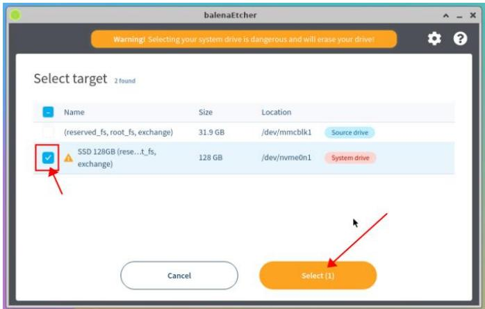


12) 然后点击 Flash!开始烧录。

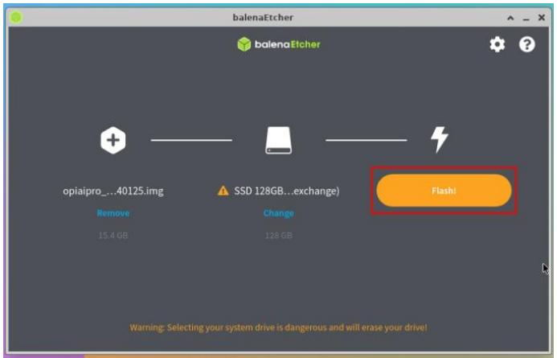


13) 然后选择 Yes, I’m sure。


14) 然后输入 Linux 系统的密码：Mind@123。

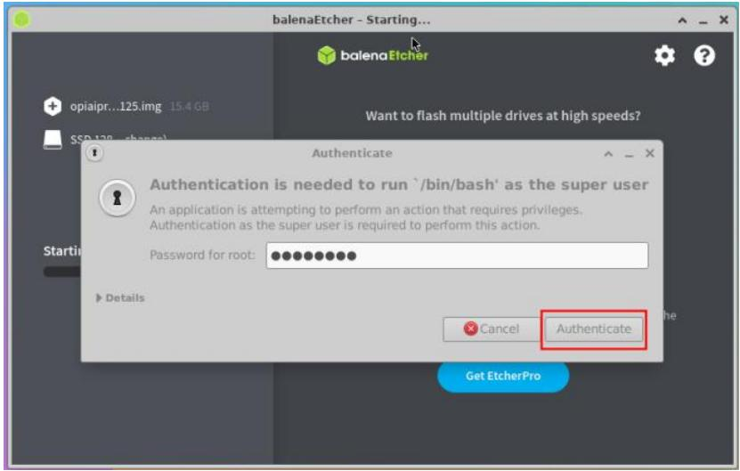


15) 然后就会真正开始烧录Linux镜像到SSD中了。

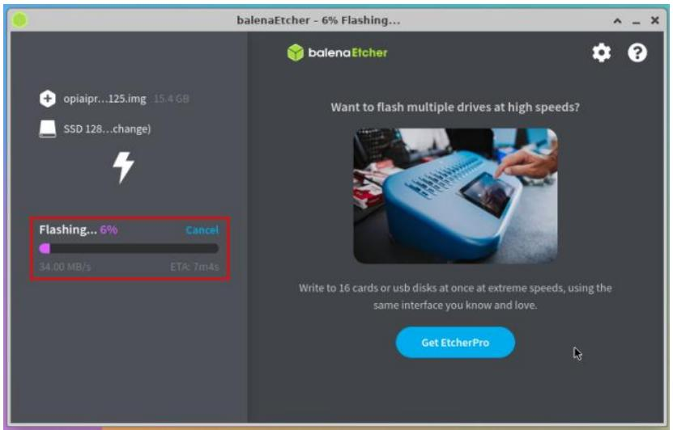


16) Linux 镜像烧录完后的显示如下所示：

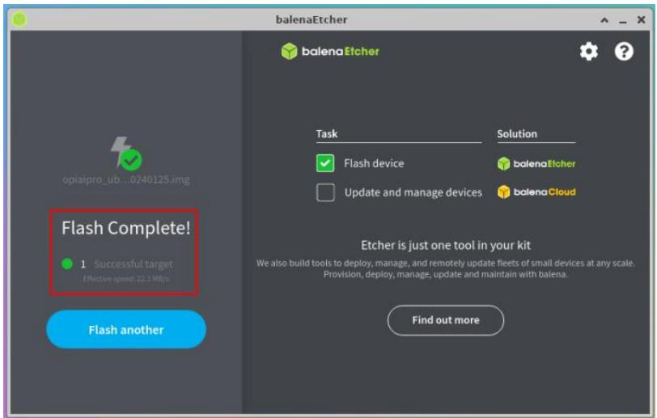


17) 此时就可以关闭掉 Linux 系统，然后拔出 TF 卡，并断开 Type-C电源。再将拨码开关拨到 SSD 启动对应的位置，然后重新插入Type-C电源就可以启动SSD中的Linux 系统了。

注意，启动系统前请确保拨码开关拨到了SSD启动的位置了。拨码开关的使用说明请参考控制启动设备的 3 个拨码开关的使用说明一小节的说明。

# 2.7. 烧写 Linux 镜像到 SATA SSD 中的方法

注意，这里说的Linux镜像具体指的是从开发板的资料下载页面下载的Ubuntu或者openEuler镜像。

1) 首先需要准备一个 M.2 2280 规格的 SATASSD。2242 等其他规格的 SSD 也都是可以使用的，只是没法固定。


2) 然后把 SATA SSD 插入开发板的 M.2接口中，并固定好。

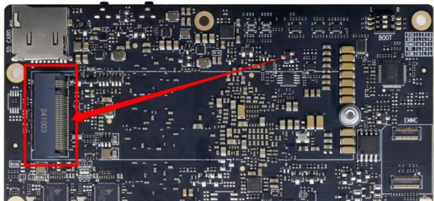


3) 烧录 Linux 镜像到 SATA SSD 中需要借助 TF 卡来完成，所以首先需要将 Linux镜像烧录到 TF 卡上，然后使用 TF 卡启动开发板进入 Linux 系统。烧录Linux镜像到 TF 卡的方法请见烧写 Linux 镜像到 TF 卡中的方法一小节的说明。

4) 启动进入 TF 卡的 Linux 系统后，首先需要更新下 SATA对应的 dt.img文件。步骤如下所示：

注意，20250922 或者之后的镜像不需要执行下面的步骤。

a. 首先进入/opt/opi_test/sata 文件夹。

```txt
(base) HwHiAiUser@orangepiaipro-20t:~$ cd /opt/opi_test/sata 
```

b. 然后运行下 update.sh 脚本来更新 SATA 对应的 dt.img。

```txt
(base) HwHiAiUser@orangepiaipro-20t:/opt/opi_test/sata$ sudo ./update.sh 
```

c. 运行完 update.sh 脚本后会自动重启 Linux 系统让配置生效。

d. 一切顺利的话，重新进入 TF 卡的Linux 系统后就能识别到SATASSD了。

```shell
(base) HwHiAiUser@orangepiaipro-20t:~$ sudo fdisk -l | grep "/dev/sd" 
```

```txt
Disk /dev/sda: 238.47 GiB, 256060514304 bytes, 500118192 sectors 
```

5)然后将要烧录的Linux镜像文件压缩包上传到TF卡的Linux系统中。

注意，使用xz格式压缩的Linux镜像压缩包不需要解压，balenaEtcher烧录时会自动解压。

6) 然后就可以开始使用 balenaEtcher 软件烧录镜像到 SSD 中了。Linux 系统中已经预装了balenaEtcher，打开方法如下所示：


7) balenaEtcher 打开后的界面如下所示：


8) 然后点击 Flash from file 选择前面上传的想要烧录的镜像文件。


如果打开Linux镜像文件时提示没有权限，请使用sudo chmod 777 镜像文件名这条命令来给镜像文件添加权限。

9) 然后点击 Select target。

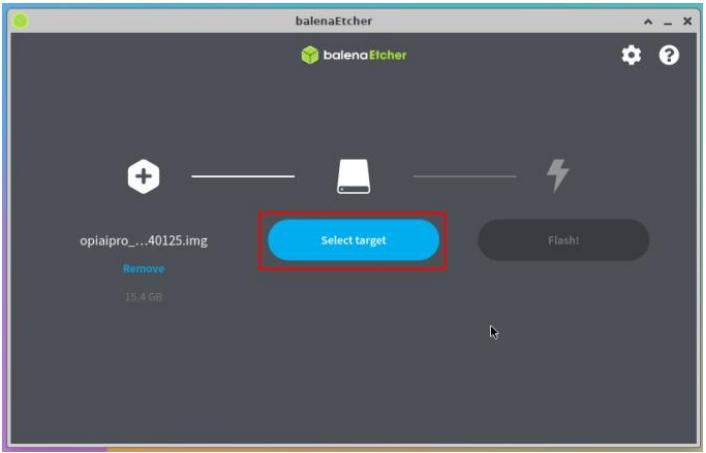


10) 然后点击 Show 1 hidden。


11) 然后选择SSD 对应的选项，再点击Select即可。

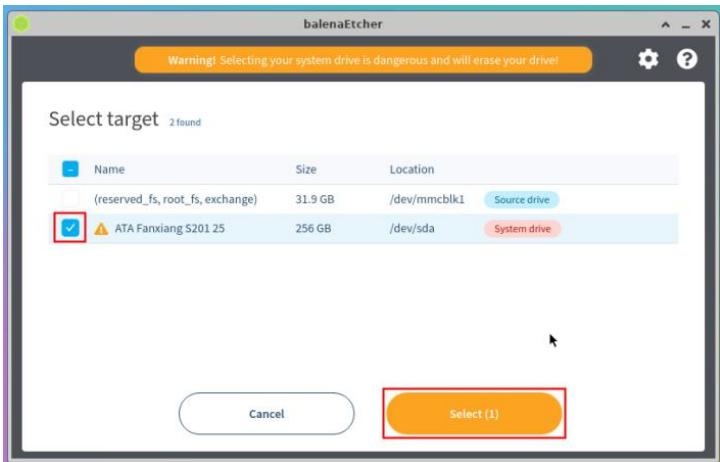


12) 然后点击 Flash!开始烧录。

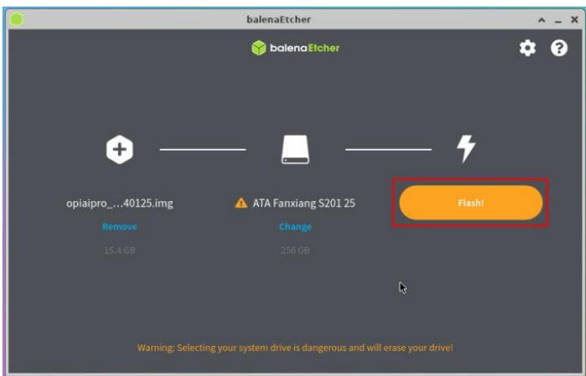


13) 然后选择 Yes, I’m sure。


14) 然后输入 Linux 系统的密码：Mind@123。

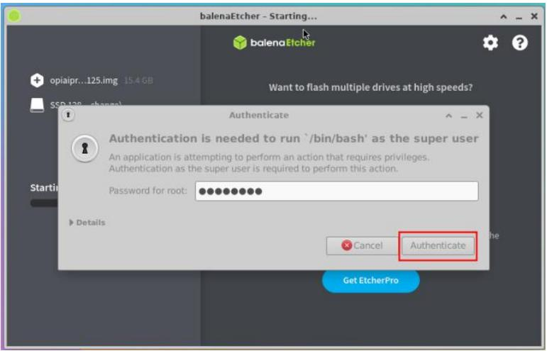


15) 然后就会真正开始烧录Linux镜像到SSD中了。


16) Linux 镜像烧录完后的显示如下所示：

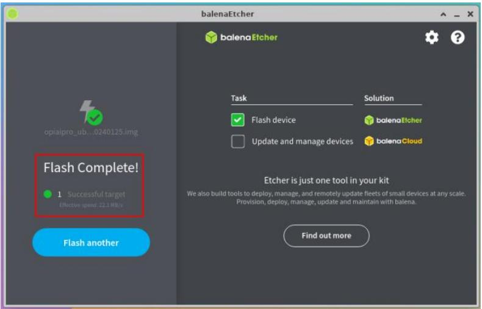


17)烧录完成后，还需要将 SATA版本的 dt.img烧录到 SATASSD中，因为提供的镜像默认打开的都是PCIe 的配置。具体命令如下所示：

注意，20250922 或者之后的镜像不需要执行下面的步骤。

```shell
sudo dd if=/opt/opi_test/dt_img/dt_drm_sata.img of=/dev/sda count=4096 seek=114688 bs=512 
```

注意，上面的命令中，“of=”参数后面的/dev/sda为SSD对应的设备节点名。请根据实际情况进行修改。

18) 此时就可以关闭掉 Linux 系统，然后拔出 TF 卡，并断开 Type-C电源。再将拨码开关拨到 SSD 启动对应的位置，然后重新插入Type-C电源就可以启动SSD中的Linux 系统了。

注意，启动系统前请确保拨码开关拨到了SSD启动的位置了。拨码开关的使用说明请参考控制启动设备的 3 个拨码开关的使用说明一小节的说明。

# 2.8. 烧写 OpenHarmony 镜像到 TF 中的方法

# 2.8.1. 基于 Windows PC 将 OpenHarmony 镜像烧写到 TF 卡的方法

1) 首先准备一张 64GB 或更大容量的 TF 卡，TF 卡的传输速度必须为 class10级或class10级以上，建议使用闪迪等品牌的 TF卡。

2) 然后把TF 卡插入读卡器，再把读卡器插入电脑。

3) 从开发板的资料下载页面下载想要烧录的OpenHarmony镜像压缩包。

4) 然后下载用于烧录 OpenHarmony 镜像的软件——balenaEtcher，下载地址为：

```txt
https://www.balena.io/etcher/ 
```

5)进入balenaEtcher下载页面后，点击绿色的下载按钮会跳到软件下载的地方。


6) 然后可以选择下载 Portable 版本的 balenaEtcher，Portable 版本无需安装，双击打开就可以使用。


Download Etcher


<table><tr><td>ASSET</td><td>OS</td><td>ARCH</td><td></td></tr><tr><td>ETCHER FOR WINDOWS (X86|X64) (INSTALLER)</td><td>WINDOWS</td><td>X86|X64</td><td>Download</td></tr><tr><td>ETCHER FOR WINDOWS (X86|X64) (PORTABLE)</td><td>WINDOWS</td><td>X86|X64</td><td>Download</td></tr><tr><td>ETCHER FOR WINDOWS (LEGACY 32 BIT) (X86|X64) (PORTABLE)</td><td>WINDOWS</td><td>X86|X64</td><td>Download</td></tr><tr><td>ETCHER FOR MACOS</td><td>MACOS</td><td>X64</td><td>Download</td></tr><tr><td>ETCHER FOR LINUX X64 (64-BIT) (APPIMAGE)</td><td>LINUX</td><td>X64</td><td>Download</td></tr><tr><td>ETCHER FOR LINUX (LEGACY 32 BIT) (APPIMAGE)</td><td>LINUX</td><td>X86</td><td>Download</td></tr></table>

7) 打开后的 balenaEtcher 界面如下图所示：


打开 balenaEtcher 时如果提示下面的错误：


请选择 balenaEtcher 后点击右键，然后选择以管理员身份运行。


8) 使用 balenaEtcher 烧录 OpenHarmony 镜像的具体步骤如下所示：

a. 首先选择要烧录的OpenHarmony镜像文件的路径。

b. 然后选择TF卡的盘符。

c. 最后点击 Flash 就会开始烧录 OpenHarmony 镜像到 TF 卡中。

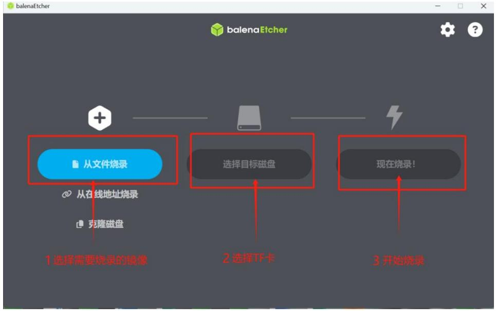


9) balenaEtcher 烧录 OpenHarmony 镜像的过程显示的界面如下图所示，另外进度条显示紫色表示正在烧录OpenHarmony镜像到TF卡中。

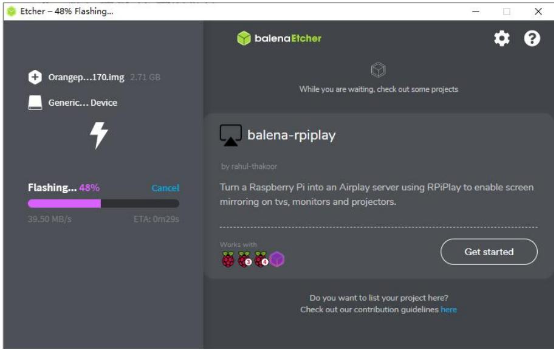


10) OpenHarmony 镜像烧录完后，balenaEtcher 默认还会对烧录到 TF 卡中的镜像进行校验，确保烧录过程没有出问题。如下图所示，显示绿色的进度条就表示镜像已经烧录完成，balenaEtcher正在对烧录完成的镜像进行校验。

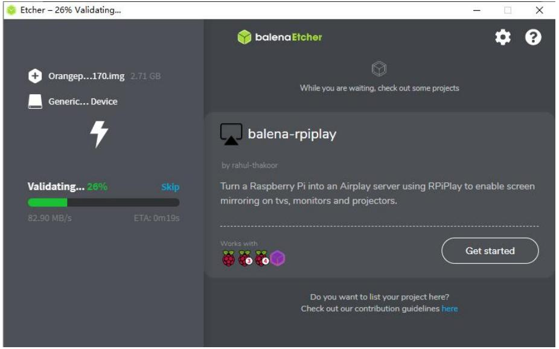


11)成功烧录完成后 balenaEtcher的显示界面如下图所示，如果显示绿色的指示图标说明镜像烧录成功，此时就可以退出 balenaEtcher，然后拔出 TF卡插入到开发板的TF卡槽中使用了。


烧录完成后，如果系统弹出Windows提示窗口，这是正常现象，并非烧录出错。此时请选择“取消”，不要选择“格式化磁盘”，否则会将已烧录的镜像格式化。

Microsoft Windows 

使用驱动器G:中的光盘之前需要将其格式化。

是否要将其格式化？

格式化磁盘

取消

注意，启动系统前请确保拨码开关拨到了TF卡启动的位置了。拨码开关的使用说明请参考控制启动设备的 3 个拨码开关的使用说明一小节的说明。

# 2.8.2. 基于 Ubuntu PC 将 OpneHarmony 镜像烧写到 TF 卡的方法

1)首先准备一张 64GB或更大容量的 TF卡，TF卡的传输速度必须为 class10级或class10级以上，建议使用闪迪等品牌的 TF卡。

2) 然后把TF 卡插入读卡器，再把读卡器插入电脑。

3) 下载 balenaEtcher 软件，下载地址为：

https://www.balena.io/etcher/ 

4)进入balenaEtcher下载页面后，点击绿色的下载按钮会跳到软件下载的地方。


balena 

ETCHER 

# Flash.Flawless.

FlashOSimagestoSDcards&USBdrives,safelyandeasily. 


Select image 


5)然后选择下载Linux版本的软件即可。

# Download Etcher

<table><tr><td>ASSET</td><td>OS</td><td>ARCH</td><td></td></tr><tr><td>ETCHER FOR WINDOWS (X86|X64) (INSTALLER)</td><td>WINDOWS</td><td>X86|X64</td><td>Download</td></tr><tr><td>ETCHER FOR WINDOWS (X86|X64) (PORTABLE)</td><td>WINDOWS</td><td>X86|X64</td><td>Download</td></tr><tr><td>ETCHER FOR WINDOWS (LEGACY 32 BIT) (X86|X64) (PORTABLE)</td><td>WINDOWS</td><td>X86|X64</td><td>Download</td></tr><tr><td>ETCHER FOR MACOS</td><td>MACOS</td><td>X64</td><td>Download</td></tr><tr><td>ETCHER FOR LINUX X64 (64-BIT) (APPIMAGE)</td><td>LINUX</td><td>X64</td><td>Download</td></tr><tr><td>ETCHER FOR LINUX (LEGACY 32 BIT) (APPIMAGE)</td><td>LINUX</td><td>X86</td><td>Download</td></tr></table>

6) 从开发板的资料下载页面下载想要烧录的 OpenHarmony镜像文件压缩包。

7) 然后在 Ubuntu PC 的图形界面双击 balenaEtcher-x.x.x-x64.AppImage 即可打开balenaEtcher，balenaEtcher 打开后的界面显示如下图所示：


8) 使用 balenaEtcher 烧录 OpenHarmony 镜像的具体步骤如下所示：

a. 首先选择要烧录的OpenHarmony镜像文件的路径。

b. 然后选择TF卡的盘符。

c. 最后点击 Flash 就会开始烧录 OpenHarmony 镜像到 TF 卡中。

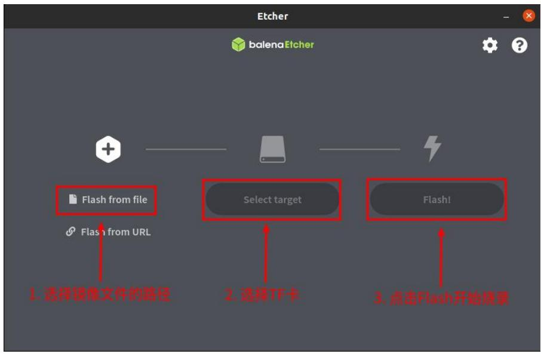


9) balenaEtcher 烧录 OpenHarmony 镜像的过程显示的界面如下图所示，另外进度条显示紫色表示正在烧录OpenHarmony镜像到TF卡中。

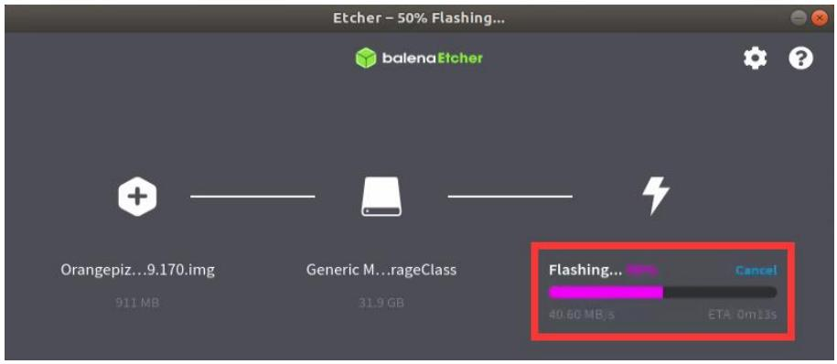


10) OpenHarmony 镜像烧录完后，balenaEtcher 默认还会对烧录到 TF 卡中的镜像进行校验，确保烧录过程没有出问题。如下图所示，显示绿色的进度条就表示镜像已经烧录完成，balenaEtcher正在对烧录完成的镜像进行校验。

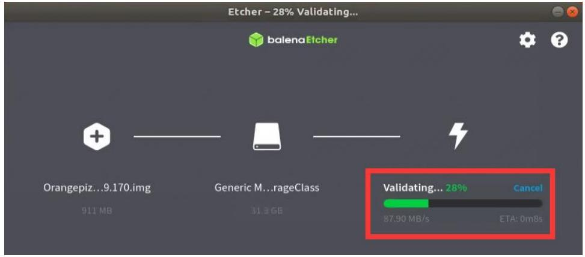


11)成功烧录完成后 balenaEtcher的显示界面如下图所示，如果显示绿色的指示图标说明镜像烧录成功，此时就可以退出 balenaEtcher，然后拔出 TF卡插入到开发板的TF卡槽中使用了。


注意，启动系统前请确保拨码开关拨到了TF卡启动的位置了。拨码开关的使用说明请参考控制启动设备的 3 个拨码开关的使用说明一小节的说明。

# 2.9. 启动开发板的步骤

# 2.9.1. 开发板更新 Firmware 步骤

注意，AI PRO 20T默认Firmware不支持OpenHarmony启动，需要更新Ascend-hdk-310b-npu-firmware-soc_7.6.t7.0.b053_20T.run支持OpenHarmony系统。更新此Firmware后会导致Linux 使用NVME启动异常，如果需要使用linux系统，请还原linux对应的Firmware: Ascend310B-firmware-7.3.t7.0.b507-rc-signed-20t-1.6ghz-20240910.run。上述的两个Firmware均支持TF卡启动Linux。Firmware请前往OPIAI PRO 20T资料下载页面-官方工具-Ascend310B-firmware固件包内下载。

Firmware 不支持当前启动方式，使用串口可以看到类似下图的打印，需要更新Firmware才可以正常启动：

```txt
boot2 reset count:0x1
firmware boot1 reset count:0x1
firmware update flag(main):D6C55BC1 C11CB55B
firmware update flag(back):D6C55BC1 C11CB55B
Current start mode :0x100 not support.
boot: main.
load image 0 body fail, real size out of max, size[0x2340C00], ret = 0
LoadOsImgEntry: Read OS image from boot area 0xAA, Status = Load Error
boot os image fail, Status = Load Error!
Normal boot fail, Status = Load Error. start to b . 
```

1) 使 用 TF 卡 启 动 Linux 系 统 ， 然 后 将 Ascend-hdk-310b-npu-firmware-soc_7.6.t7.0.b053_20T.run 或 Ascend310B-firmware-7.3.t7.0.b507-rc-signed-20t-1.6ghz-20240910.run 上传到 Linux 系统内。

2) 根据要启动的系统，更新对应的Firmware。

a. 更新 OpenHarmony Firmware

```shell
cd /home #切换到 Ascend-hdk-310b-npu-firmware-soc_7.6.t7.0.b053_20T.run 所在的目录
chmod 777 Ascend-hdk-310b-npu-firmware-soc_7.6.t7.0.b053_20T.run
./Ascend-hdk-310b-npu-firmware-soc_7.6.t7.0.b053_20T.run --upgrade
```

```txt
(base) root@orangepiaipro-20t:/home# chmod 777 *
(base) root@orangepiaipro-20t:/home# ./Ascend-hdk-310b-npu-firmware-soc_7.6.t7.0.b053_20T.run --upgrade
Verifying archive integrity... 100% SHA256 checksums are OK. All good.
Uncompressing ASCEND310B FIRMWARE RUN PACKAGE 100%
[Firmware] [2025-08-20 17:19:29] [INFO]Start time: 2025-08-20 17:19:29
[Firmware] [2025-08-20 17:19:29] [INFO]LogFile: /var/log/ascend_seclog/ascend_install.log
[Firmware] [2025-08-20 17:19:29] [INFO]OperationLogFile: /var/log/ascend_seclog/operation.log
[Firmware] [2025-08-20 17:19:29] [INFO]base version is 7.6.T8.0.B059.
[Firmware] [2025-08-20 17:19:29] [WARNING]Do not power off or restart the system during the installation/upgrade
[Firmware] [2025-08-20 17:19:34] [INFO]upgradePercentage: 1%
[Firmware] [2025-08-20 17:19:42] [INFO]upgradePercentage: 4%
[Firmware] [2025-08-20 17:19:51] [INFO]upgradePercentage: 87%
[Firmware] [2025-08-20 17:19:59] [INFO]upgradePercentage: 99%
[Firmware] [2025-08-20 17:20:01] [INFO]upgradePercentage: 100%
[Firmware] [2025-08-20 17:20:01] [INFO]Firmware package upgraded successfully! Reboot now or after driver installation for the installation/upgrade to take effect.
[Firmware] [2025-08-20 17:20:01] [INFO]End time: 2025-08-20 17:20:01 
```

# b. 更新 Linux Firmware

```shell
cd /home #切换到 Ascend310B-firmware-7.3.t7.0.b507-rc-signed-20t-1.6ghz-20240910.run 所在的目录
chmod 777 Ascend310B-firmware-7.3.t7.0.b507-rc-signed-20t-1.6ghz-20240910.run
./Ascend310B-firmware-7.3.t7.0.b507-rc-signed-20t-1.6ghz-20240910.run --upgrade
```

```txt
(base) root@orangepiaipro-20t:/home# ./Ascend310B-firmware-7.3.t7.0.b507-rc-signed-20t-1.6ghz-20240910.run --upgrade
Verifying archive integrity... 100% SHA256 checksums are OK. All good.
Uncompressing ASCEND310B FIRMWARE RUN PACKAGE 100%
[Firmware] [2025-08-20 17:21:03] [INFO]Start time: 2025-08-20 17:21:03
[Firmware] [2025-08-20 17:21:03] [INFO]LogFile: /var/log/ascend_seclog/ascend_install.log
[Firmware] [2025-08-20 17:21:03] [INFO]OperationLogFile: /var/log/ascend_seclog/operation.log
[Firmware] [2025-08-20 17:21:03] [INFO]base version is 7.6.t7.0.b053.
[Firmware] [2025-08-20 17:21:03] [WARNING]Do not power off or restart the system during the installation/upgrade
[Firmware] [2025-08-20 17:21:07] [INFO]upgradePercentage: 1%
[Firmware] [2025-08-20 17:21:16] [INFO]upgradePercentage: 4%
[Firmware] [2025-08-20 17:21:24] [INFO]upgradePercentage: 87%
[Firmware] [2025-08-20 17:21:33] [INFO]upgradePercentage: 99%
[Firmware] [2025-08-20 17:21:34] [INFO]upgradePercentage: 100%
[Firmware] [2025-08-20 17:21:34] [INFO]Firmware package upgraded successfully! Reboot now or after driver installation for the installation/upgrade to take effect.
[Firmware] [2025-08-20 17:21:34] [INFO]End time: 2025-08-20 17:21:34 
```

# 3) 更新 userBaseConfig.bin，

```shell
cd /home #切换到 update_userbaseconfig.sh 和 userBaseConfig.bin 所在的目录
chmod 777 update_userbaseconfig.sh
./update_userbaseconfig.sh
```

```jsonl
(base) root@orangepiaipro-20t:/opt/opi_test/userBaseConfig# ./update_userbaseconfig.sh
{"device_id": 0, "schedule": 0%, "status": upgrading}
{"device_id": 0, "schedule": 0%, "status": upgrading}
{"device": 0, "succeed"}
(base) root@orangepiaipro-20t:/opt/opi_test/userBaseConfig# 
```

# 4) 然后重启，确保在启动阶段看到的PCIE配置如下所示：

```txt
use macro setting from syscfg
macro[0] protocols:
ds[0] : PCIE
ds[1] : PCIE
ds[2] : PCIE
ds[3] : PCIE
macro[1] protocols:
ds[0] : PCIE
ds[1] : USB
ds[2] : PCIE
ds[3] : USB
Macro[0] power up (time 795ms)
dfs done 
```

# 2.9.2. LINUX 系统开发板启动步骤

1)将烧录好镜像的TF卡或者eMMC模块或者SSD插入开发板对应的插槽中。

2)然后将拨码开关拨到正确的位置。

3)开发板有两个 HDMI接口，HDMI0接口默认显示为主屏，如果想显示 Linux系统的桌面，可以将开发板的 HDMI0 接口连接到HDMI显示器。

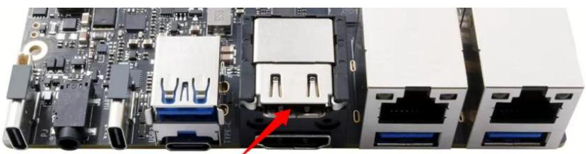


HDMI0接口所在位置


4) 开发板有 USB 接口，可以接上USB 鼠标和键盘，来控制开发板。

5) 开发板有两个2.5G 以太网口，可以插入网线用来上网。

6) 然后需要连接一个 20V PD-65W 的 Type C 接口的电源，电源接口的位置如下图所示：


只有此Type-C接口才能给开发板供电


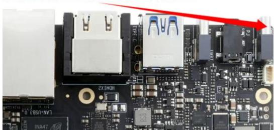


7)然后打开电源适配器的开关，如果一切正常，等待一段时间后，HDMI显示器就能看到Linux系统的登录界面了。

8)如果想通过调试串口查看系统的输出信息，请使用串口线将开发板连接到电脑，串口的连接方法请参看调试串口的使用方法一节。

9) 如果出现下图错误，请刷入 Linux 系统对应的 Firmware，参见开发板更新


Firmware 步骤。


```txt
boot2 reset count:0x1
firmware boot1 reset count:0x1
firmware update flag(main):D6C55BC1 C11CB55B
firmware update flag(back):D6C55BC1 C11CB55B
Current start mode :0x100 not support.
boot: main.
load image 0 body fail, real size out of max, size[0x2340C00], ret = 0
LoadOsImgEntry: Read OS image from boot area 0xAA, Status = Load Error
boot os image fail, Status = Load Error!
Normal boot fail, Status = Load Error. start to b . 
```

# 2.9.3. OpenHarmony 系统开发板启动步骤

注意，AI PRO 20T默认Firmware不支持OpenHarmony启动，需要更新Ascend-hdk-310b-npu-firmware-soc_7.6.t7.0.b053_20T支持OpenHarmony系统。更新后此操作与板卡绑定，每块板卡支持操作一次，不需要每次烧录OpenHarmony都更新。Firmware更新方法请参看开发板更新Firmware步骤。

1) 将烧录好镜像的 TF 卡（目前 OpenHarmony 仅支持 TF 卡启动）插入开发板对应的插槽中。

2)然后将拨码开关拨到正确的位置。

3) 开发板有两个 HDMI 接口（目前只有 HDMI0 支持显示 OpenHarmony 系统的桌面，HDMI1 显示 OpenHarmony 系统桌面的功能还需等软件更新），如果想显示OpenHarmony 系统的桌面，可以将开发板的 HDMI0 接口连接到 HDMI显示器。

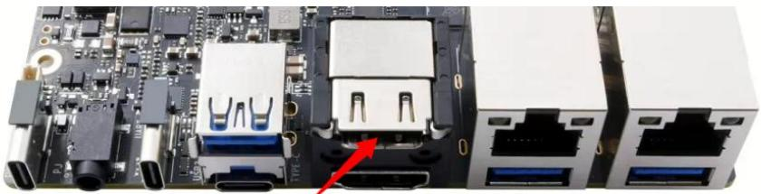


HDMI0接口所在位置


4) 开发板有 USB 接口，可以接上USB 鼠标和键盘，来控制开发板。

5) 开发板有两个2.5G 以太网口，可以插入网线用来上网。

6) 然后需要连接一个 20V PD-65W 的 Type C 接口的电源，电源接口的位置如下图

所示：


只有此Type-C接口才能给开发板供电


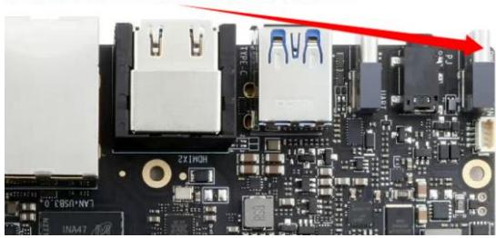


7)然后打开电源适配器的开关，首次启动 HDMI没有显示需要安装 GPU驱动，使用串口将开发板与电脑连接，串口的连接方法请参看调试串口的使用方法一节。

8) 如果出现下图错误，请刷入 OpenHarmony 系统对应的 Firmware，参见开发板更新 Firmware 步骤

```txt
boot2 reset count:0x1
firmware boot1 reset count:0x1
firmware update flag(main):D6C55BC1 C11CB55B
firmware update flag(back):D6C55BC1 C11CB55B
Current start mode :0x100 not support.
boot: main.
load image 0 body fail, real size out of max, size[0x2340C00], ret = 0
LoadOsImgEntry: Read OS image from boot area 0xAA, Status = Load Error
boot os image fail, Status = Load Error!
Normal boot fail, Status = Load Error. start to b . 
```

9) 进入系统后，在串口输入以下命令，init.sh 时间比较久，耐心等待。

```shell
# mount -o rw,remount /
# cd /system/var/
# chmod 777 *
# ./init.sh 
```

```txt
libaarch64/aarch64-linux-gnu/libunwind.so.8.0.1
libaarch64/aarch64-linux-gnu/libabsl_status.so.20210324
libaarch64/aarch64-linux-gnu/libwebpmux.so.3.0.8
libaarch64/aarch64-linux-gnu/libfreerdp-server2.so.2.6.1
libaarch64/aarch64-linux-gnu/libvtkIOInfovis-9.1.so.9.1.0
[ 339.578122] binder: release 5404:5404 transaction 40762 out, still active
[ 339.584912] binder: undelivered TRANSACTION_COMPLETE
libaarch64/aarch64-linux-gnu/libabsl_spinlock_wait.so.20210324.0.0
libaarch64/aarch64-linux-gnu/libwavpack.so.1
libaarch64/aarch64-linux-gnu/libvtkRenderingAnnotation-9.1.so.9.1.0
[ 340.006043] binder: release 4768:4768 transaction 40743 out, still active
libaarch64/aarch64-linux-gnu/libopencv_ccalib.a
libaarch64/aarch64-linux-gnu/libtbbmalloc_proxy.so
libaarch64/aarch64-linux-gnu/libnetsnmp.so.40.1.0
libaarch64/aarch64-linux-gnu/libepoxy.so.0
libaarch64/aarch64-linux-gnu/libica[ 342.318597] [pid=1][Init][WARNING][init_signal_handler.c:46]Child process Unknown()
l-glib.so.3
libaarch64/aarch64-linux-gnu/libeatmydata.so
libaarch64/aarch64-linux-gnu/libkrb5support.so.0
libaarch64/aarch64-linux-gnu/libvtkImagingMorphological-9.1.so.1
libaarch64/aarch64-linux-gnu/libGLX_indirect.so.0
libaarch64/aarch64-linux-gnu/libvtkpugixml-9.1.so.1
libaarch64/aarch64-linux-gnu/gstreamer1.0/
libaarch64/aarch64-linux-gnu/gstreamer1.0/gstreamer-1.0/
libaarch64/aarch64-linux-gnu/gstreamer1.0/gstreamer-1.0/gst-ptp-helper
libaarch64/aarch64-linux-gnu/gstreamer1.0/gstreamer-1.0/gst-plugin-scanner
libaarch64/aarch64-linux-gnu/libaec.so.0
libaarch64/aarch64-linux-gnu/librdmacm.so.1
[ 342.318608] [pid=1][Init][WARNING][init_signal_handler.c:54]Service warning Unknown, SIGCHLD received, pid:4622 uid:0
[ 342.776090] binder: 542:542 transaction failed 29189/0, size 2712-0 line 3260
[ 342.794700] binder: send failed reply for transaction 40743, target dead
# 
```

10) Init.sh 执行完成后，输入 reboot 重启，等待一段时间后 HDMI 显示器就能看到OpenHarmony 的系统界面了。

11) 若重启后 HDMI 依然没有画面输出，请重新执行 init.sh。

# 2.10. 调试串口的使用方法

开发板默认使用 uart0做为调试串口。需要注意的是，uart0的 tx和 rx引脚同时接到了两个地方，所以有两种使用调试串口的方法：

1)uart0的tx和rx引脚接到了40pin扩展接口中的8号和10号引脚，此种方式需要准备一个3.3v的USB转TTL模块和相应的杜邦线，然后才能正常使用开发板的调试串口功能。

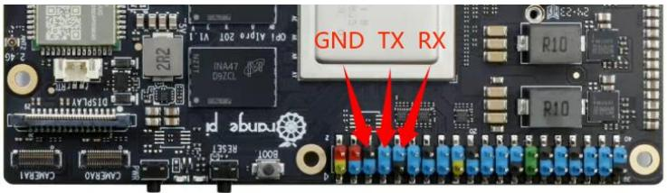


2) uart0 的 tx 和 rx 引脚还接到了开发板的 CH343P 芯片上，再通过 CH343P 芯片引出到 Type-C USB 接口上。此种方式只需要一根 Type-C USB接口的数据线将开发板连接到电脑的 USB 接口就可以开始使用开发板的调试串口功能了，无需购买USB 转TTL 模块。这种方法是推荐的方法。

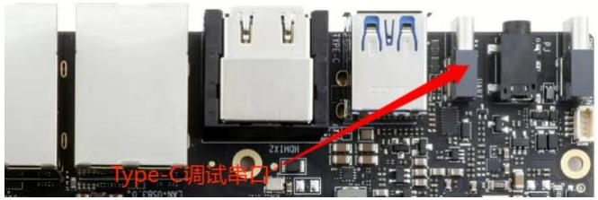


3)另外请注意，上面的两种方法只能二选一，请不要同时使用。

# 2.10.1. 通过 Type-C USB 接口来使用调试串口的连接说明

1) 首先需要准备一根 Type-C USB接口的数据线


2) 然后将 Type-C USB 接口一端插入开发板的 Type-C USB 接口中。


3) 再将数据线的另一端插入电脑的USB接口中即可。

# 2.10.2. 通过 40 pin 接口中的 uart0 来使用调试串口的连接说明

1) 首先需要准备一个 3.3v 的 USB 转 TTL 模块，然后将 USB 转 TTL 模块的 USB接口一端插入到电脑的USB接口中。


2) 开发板的调试串口 GND、TX 和RX引脚的对应关系如下图所示：

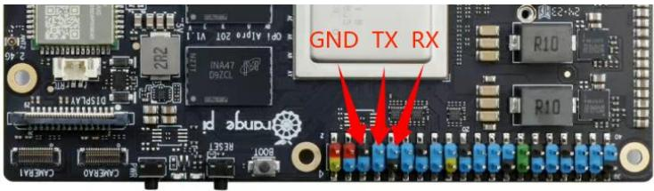


3) USB 转 TTL 模块 GND、TX 和 RX 引脚需要通过杜邦线连接到开发板的调试串口上。

a. USB 转 TTL 模块的 GND 接到开发板的 GND 上。

b. USB转 TTL模块的 RX 接到开发板的 TX上。

c. USB 转 TTL 模块的 TX 接到开发板的 RX 上。

4) USB 转 TTL 模块连接电脑和开发板的示意图如下所示：


USB转TTL模块连接电脑和OrangePi开发板的示意图


串口的 TX和 RX是需要交叉连接的，如果不想仔细区分 TX和 RX的顺序，可以把串口的 TX和 RX先随便接上，如果测试串口没有输出再交换下 TX和 RX的顺序，这样就总有一种顺序是对的。

# 2.10.3. Ubuntu 平台调试串口的使用方法

Linux 下可以使用的串口调试软件有很多，如 putty、minicom等，下面演示下putty的使用方法。

1) 首先请按照通过 40 pin 接口中的 uart0 来使用调试串口的连接说明或通过 Type-C USB 接口来使用调试串口的连接说明一小节的说明（两种方法请根据自己的情况二选一）将开发板和电脑连接起来，如果串口模块识别正常的话，在 Ubuntu PC的/dev下就可以看到对应的设备名，请记住这个设备名，后面设置串口软件时会用到。

a. 如果使用 40 pin 接口中的 uart0 显示的设备名一般为/dev/ttyUSB0。

```txt
test@test:~$ ls /dev/ttyUSB*
/dev/ttyUSB0 
```

b. 如果使用 Type-C USB 接口显示的设备名一般为/dev/ttyACM0。

```txt
test@test:~$ ls /dev/ttyACM*
/dev/ttyACM0 
```

2) 然后使用下面的命令在 Ubuntu PC 上安装下 putty。

```shell
test@test:~$ sudo apt-get update
test@test:~$ sudo apt-get install -y putty 
```

3) 然后运行 putty，记得加 sudo 权限。

```txt
test@test:~$ sudo putty 
```

4) 执行putty 命令后会弹出下面的界面。

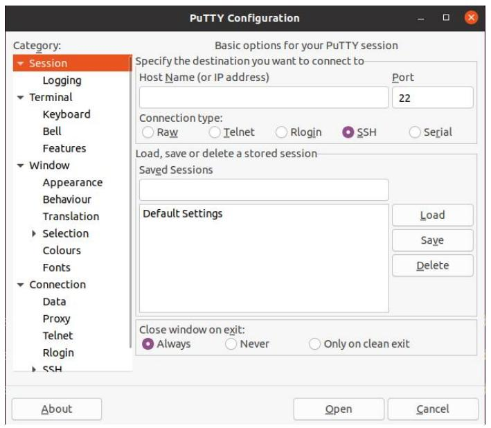


5)首先选择串口的设置界面。

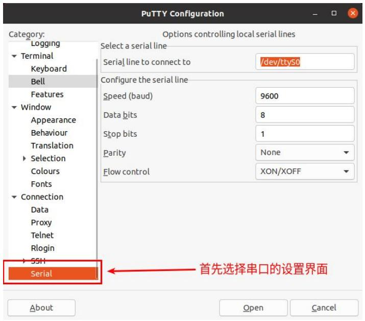


6)然后设置串口的参数。

a. 设置 Serial line to connect to 为/dev/ttyUSB0 或者/dev/ttyACM0（请根据实际情况进行修改）。

b. 设置 Speed(baud)为 115200（串口的波特率）。

c. 设置 Flow control 为 None。

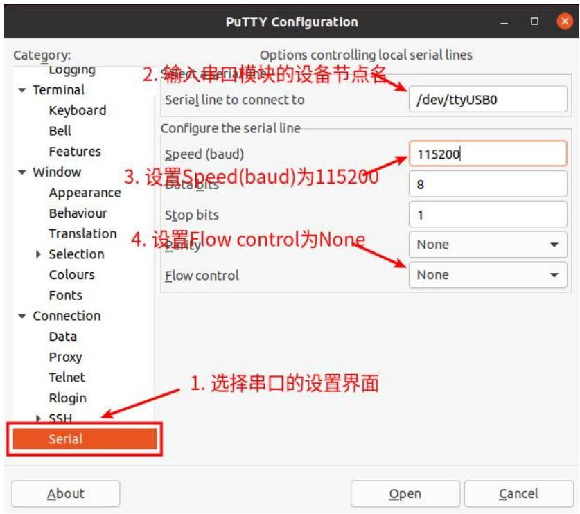


7) 在串口的设置界面设置完后，再回到Session界面。

a. 首先选择 Connection type 为 Serial。

b. 然后点击Open按钮连接串口。

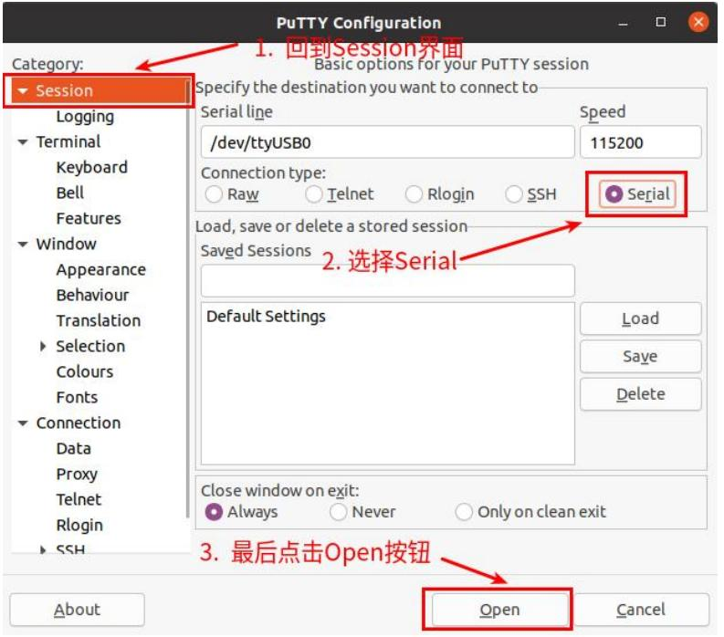


8) 然后启动开发板，就能从打开的串口终端中看到系统输出的 Log信息了。

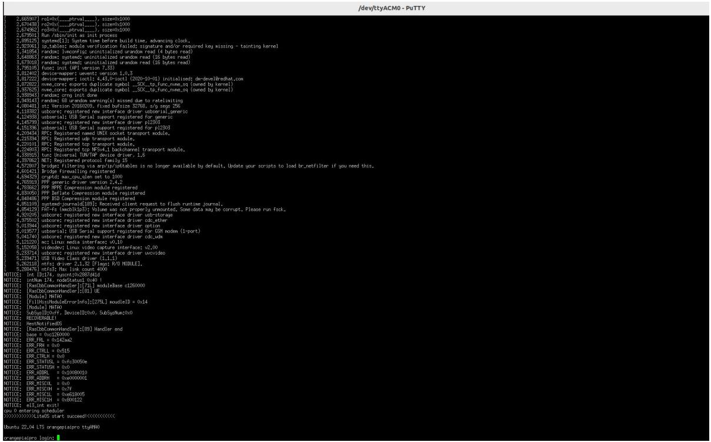


9) 当看到登录界面时，就可以使用下面的账号和密码来登录 Linux系统了。

<table><tr><td>账号</td><td>密码</td></tr><tr><td>root</td><td>Mind@123</td></tr><tr><td>HwHiAiUser</td><td>Mind@123</td></tr></table>

# 2.10.4. Windows 平台调试串口的使用方法

Windows下可以使用的串口调试软件有很多，如 SecureCRT、MobaXterm 等，下面演示 MobaXterm的使用方法，这款软件有免费版本，无需购买序列号即可使用。

1) 首先下载 MobaXterm。

a. 下载 MobaXterm 网址如下：

https://mobaxterm.mobatek.net/ 

b. 进入 MobaXterm 下载网页后点击 GET XOBATERM NOW!。

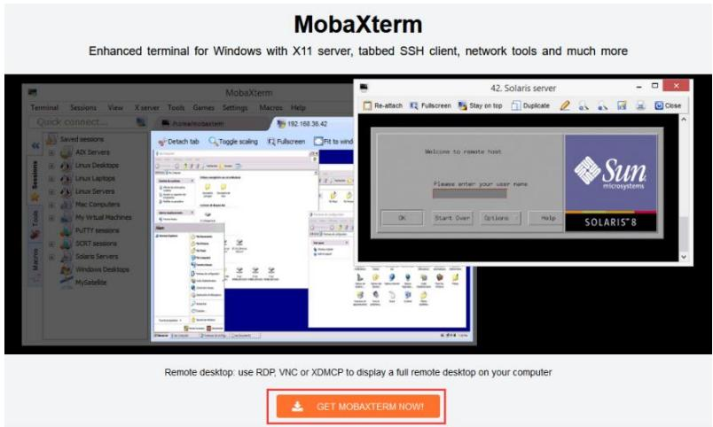


c. 然后选择下载 Home版本。


d. 然后选择Portable便携式版本，下载完后无需安装，直接打开就可以使用。


2)下载完后使用解压缩软件解压下载的压缩包，即可得到 MobaXterm的可执软件，然后双击打开。

<table><tr><td>MobaXterm_Personal_23.6.exe</td><td>2023/12/21 6:15</td><td>应用程序</td><td>16,556 KB</td></tr><tr><td>CygUtils.plugin</td><td>2023/12/21 5:08</td><td>PLUGIN 文件</td><td>17,748 KB</td></tr><tr><td>CygUtils64.plugin</td><td>2023/12/21 5:08</td><td>PLUGIN 文件</td><td>11,723 KB</td></tr></table>

3) 打开软件后，设置串口连接的步骤如下：

a. 打开会话的设置界面。

b. 选择串口类型。

c. 选择串口的端口号（根据实际的情况选择对应的端口号），如果看不到端口号，请使用360 驱动大师扫描安装USB转TTL串口芯片的驱动。

d. 选择串口的波特率为115200。

e. 最后点击“OK”按钮完成设置。

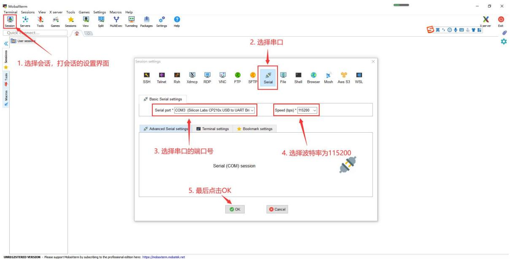


4) 点击“OK”按钮后会进入下面的界面，此时启动开发板就能看到串口的输出信息了。

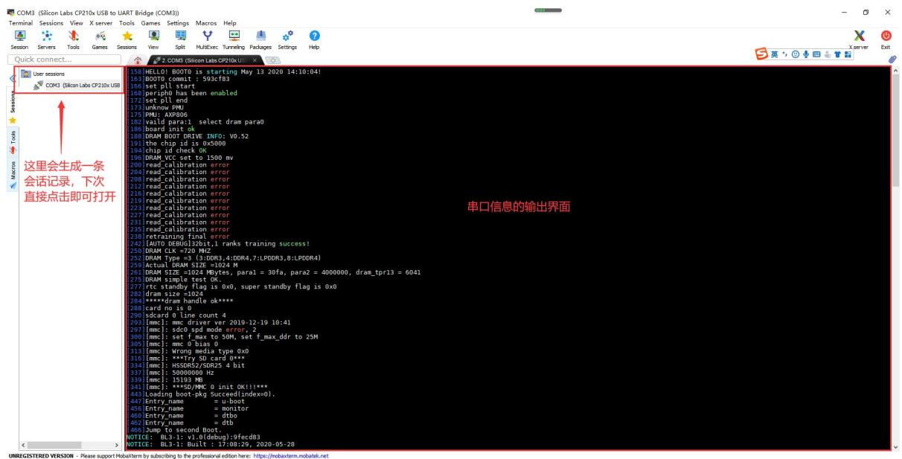


5) 当看到登录界面时，就可以使用下面的账号和密码来登录 Linux系统了。

<table><tr><td>账号</td><td>密码</td></tr><tr><td>root</td><td>Mind@123</td></tr><tr><td>HwHiAiUser</td><td>Mind@123</td></tr></table>

# 2.11. WIFI 蓝牙天线使用注意事项

开发板的WIFI蓝牙天线如下图左边所示：

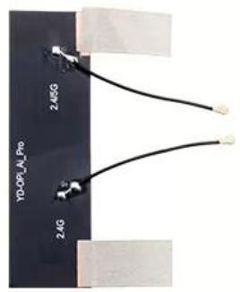


天线*1


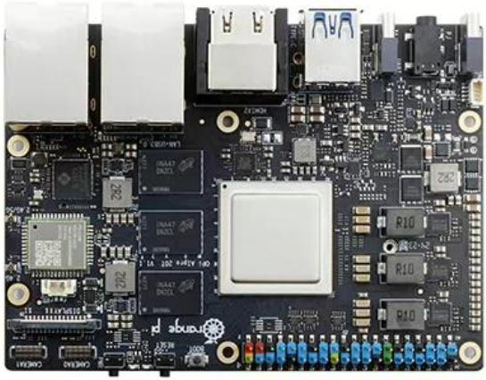


开发板*1


WIFI 蓝牙天线的正确安装方法如下图所示：

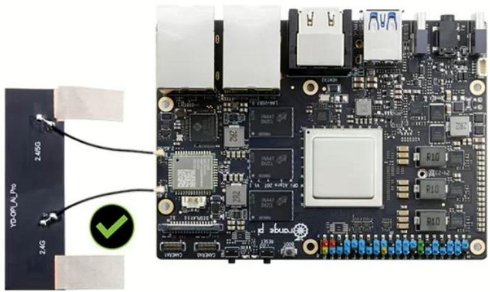


※天线正确安装和使用放置示意图。


安装好天线后，请不要像下图所示的一样将天线贴到开发板的背面，同时天线上的导电布也不能挨着开发板，否则可能会烧坏开发板。

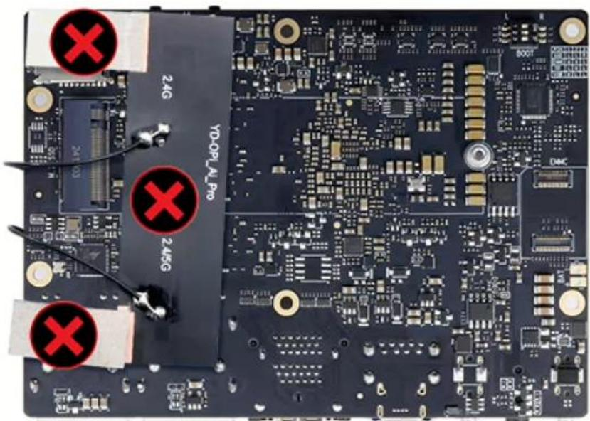


# 3. Ubuntu Xfce 桌面系统使用说明

进入 Ubuntu镜像的下载链接后可以看到下图所示的两个 ubuntu镜像，他们的区别是：

1) minimal 镜像是一个只有最基础功能的镜像，像 Linux 桌面、CANN 和AI示例代码等都没有预装。此镜像只建议想自己从头定制安装 Linux桌面和 AI相关软件的开发者使用。

2) desktop 镜像预装了 Linux 桌面、CANN、AI 示例代码和一系列测试程序。如果想正常使用开发板的功能，请使用这个镜像。本章的内容都是基于 desktop镜像编写的。

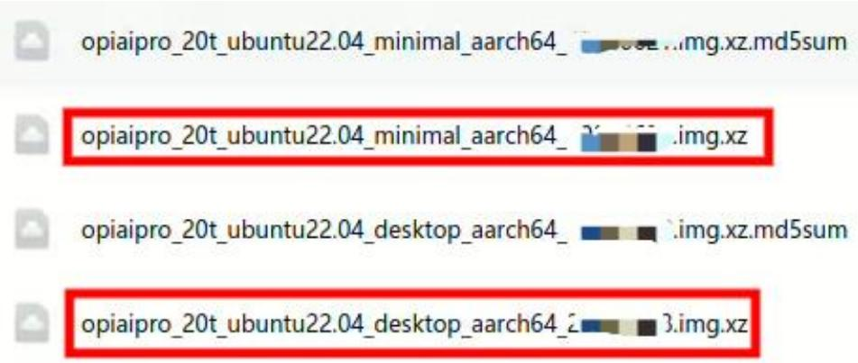


# 3.1. 已支持的 Ubuntu镜像类型和内核版本

<table><tr><td>Linux 镜像类型</td><td>内核版本</td><td>桌面版</td></tr><tr><td>Ubuntu 22.04 - Jammy</td><td>Linux5.10</td><td>支持</td></tr></table>

# 3.2. Linux 系统功能适配情况

<table><tr><td>功能</td><td>是否能测试</td><td>Linux 内核驱动</td></tr><tr><td>HDMI0 1080p 显示</td><td>OK</td><td>OK</td></tr><tr><td>HDMI0 4K 显示</td><td>OK</td><td>OK</td></tr><tr><td>HDMI0 音频</td><td>OK</td><td>OK</td></tr><tr><td>HDMI1 显示</td><td>OK</td><td>OK</td></tr><tr><td>HDMI1 音频</td><td>OK</td><td>OK</td></tr><tr><td>GPU</td><td>OK</td><td>OK</td></tr><tr><td>耳机播放</td><td>OK</td><td>OK</td></tr><tr><td>耳机 MIC 录音</td><td>OK</td><td>OK</td></tr><tr><td>TypeC USB3.0 Host</td><td>OK</td><td>OK</td></tr><tr><td>TypeC USB3.0 Device</td><td>OK</td><td>OK</td></tr><tr><td>USB3.0 Host x 3</td><td>OK</td><td>OK</td></tr><tr><td>2.5G 网口 x 2</td><td>OK</td><td>OK</td></tr><tr><td>2.5G 网口灯</td><td>OK</td><td>OK</td></tr><tr><td>WIFI</td><td>OK</td><td>OK</td></tr><tr><td>蓝牙</td><td>OK</td><td>OK</td></tr><tr><td>Type-C USB 调试串口</td><td>OK</td><td>OK</td></tr><tr><td>复位按键</td><td>OK</td><td>OK</td></tr><tr><td>开关机按键</td><td>OK</td><td>OK</td></tr><tr><td>BOOT 烧录按键</td><td>OK</td><td>OK</td></tr><tr><td>MIPI 摄像头 0</td><td>NO</td><td>NO</td></tr><tr><td>MIPI 摄像头 1</td><td>NO</td><td>NO</td></tr><tr><td>MIPI LCD 显示</td><td>NO</td><td>NO</td></tr><tr><td>电源指示灯</td><td>OK</td><td>OK</td></tr><tr><td>软件可控的 LED 灯</td><td>OK</td><td>OK</td></tr><tr><td>风扇接口</td><td>OK</td><td>OK</td></tr><tr><td>电池接口</td><td>OK</td><td>OK</td></tr><tr><td>RTC 接口</td><td>OK</td><td>OK</td></tr><tr><td>TF 卡启动</td><td>OK</td><td>OK</td></tr><tr><td>TF 卡启动识别 eMMC</td><td>OK</td><td>OK</td></tr><tr><td>TF 卡启动识别 NVMe SSD</td><td>OK</td><td>OK</td></tr><tr><td>TF 卡启动识别 SATA SSD</td><td>OK</td><td>OK</td></tr><tr><td>eMMC 启动</td><td>OK</td><td>OK</td></tr><tr><td>SATA SSD 启动</td><td>OK</td><td>OK</td></tr><tr><td>NVMe SSD 启动</td><td>OK</td><td>OK</td></tr><tr><td>3 个拨码开关</td><td>OK</td><td>OK</td></tr><tr><td>40 pin-调试串口</td><td>OK</td><td>OK</td></tr><tr><td>40 pin-GPIO</td><td>OK</td><td>OK</td></tr><tr><td>40 pin-UART</td><td>OK</td><td>OK</td></tr><tr><td>40 pin-SPI</td><td>OK</td><td>OK</td></tr><tr><td>40 pin-I2C</td><td>OK</td><td>OK</td></tr><tr><td>40 pin-PWM</td><td>OK</td><td>NO</td></tr></table>

# 3.3. Linux 系统登录说明

# 3.3.1. 登录 Linux 系统桌面的方法

开发板有两个 HDMI接口，最新镜像中两个 HDMI都支持显示 Linux系统的桌面。默认是异显模式，HDMI0默认显示为主屏。

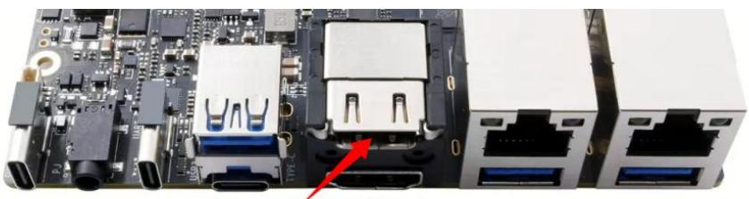


HDMI0接口所在位置


开发板上电开机后，需要等待一段时间，HDMI显示器才会显示Linux系统的桌面，桌面显示如下图所示，会自动登录，无需输入账号和密码。

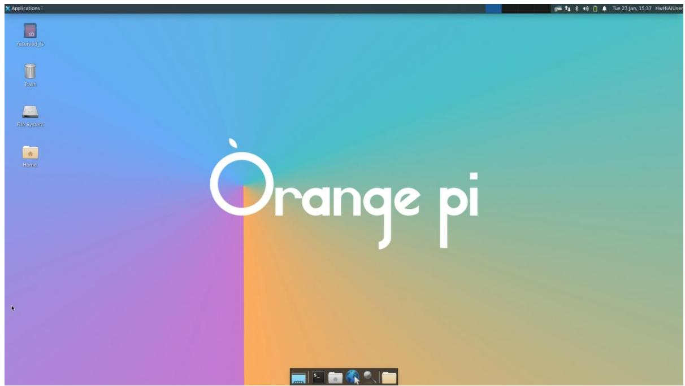


# 3.3.2. Linux 系统默认登录账号和密码

<table><tr><td>账号</td><td>密码</td></tr><tr><td>root</td><td>Mind@123</td></tr></table>

HwHiAiUser 

Mind@123 

# 3.4. 板载 LED 灯测试说明

开发板上有两个绿色的LED灯，作用如下所示：

1) 靠近复位按键的绿灯：此绿灯为电源指示灯，由硬件控制其亮灭，软件无法控制。只要开发板接入了Type-C 电源并上电了，此绿灯就会点亮。

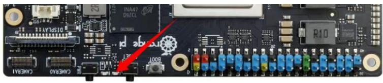


2) 靠近开关机按键的绿灯：此绿灯由 GPIO4_19 控制其亮灭，可以作为SATA硬盘的指示灯或者其他需要的用途。目前发布的 Linux系统默认将其点亮。当看到此灯点亮后，至少可以说明Linux内核已经启动了。

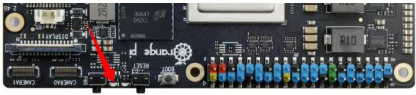


# 3.5. 网络连接测试

# 3.5.1. 以太网口测试

1) 开发板有两个 2.5G 的以太网接口，两个网口的测试方法是一样的。首先将网线的一端插入开发板的以太网接口，网线的另一端接入路由器，并确保网络是畅通的。

2) 系统启动后会通过DHCP 自动给以太网口分配IP地址。

3) 在开发板的Linux 系统中查看IP地址的命令如下所示：

```txt
(base) HwHiAiUser@orangepiaipro-20t:~$ ip addr show
......
2: eth0: <BROADCAST,MULTICAST,UP,LOWER_UP> mtu 1500 qdisc fq_codel state UP group default qlen 1000 
```

```txt
link/ether c0:74:2b:fe:3b:5a brd ff:ff:ff:ff:ff
inet 10.31.3.195/16 brd 10.31.255.255 scope global dynamic noprefixroute eth0
valid_lft 43171sec preferred_lft 43171sec
inet6 fe80::12fd:9a09:ed32:75d3/64 scope link noprefixroute
valid_lft forever preferred_lft forever
3: eth1: <BROADCAST,MULTICAST,UP,LOWER_UP> mtu 1500 qdisc fq_codel state
UP group default qlen 1000
link/ether c0:74:2b:fe:3b:5b brd ff:ff:ff:ff:ff
inet 10.31.3.192/16 brd 10.31.255.255 scope global dynamic noprefixroute eth1
valid_lft 43167sec preferred_lft 43167sec
inet6 fe80::c274:2bff:fefe:3b5b/64 scope link
valid_lft forever preferred_lft forever
...... 
```

4) 测试网络连通性的命令如下所示，如果能 ping 通百度或者其他网址说明开发板的网络连接正常，ping 命令可以通过Ctrl+C快捷键来中断运行。

注意，欧拉系统请使用 root 用户执行或通过 sudo 提权，HwHiAiUser会提示没有权限。

```txt
(base) HwHiAiUser@orangepiaipro-20t:~$ ping www.baidu.com -I eth0 #其中一个网口
(base) HwHiAiUser@orangepiaipro-20t:~$ ping www.baidu.com -I eth1 #另一个网口
PING www.a.shifen.com (183.2.172.185) from 192.168.2.100 eth0: 56(84) bytes of data.
64 bytes from 183.2.172.185 (183.2.172.185): icmp_seq=1 ttl=52 time=10.0 ms
64 bytes from 183.2.172.185 (183.2.172.185): icmp_seq=2 ttl=52 time=9.77 ms
64 bytes from 183.2.172.185 (183.2.172.185): icmp_seq=3 ttl=52 time=9.94 ms
64 bytes from 183.2.172.185 (183.2.172.185): icmp_seq=4 ttl=52 time=9.94 ms
^C
--- www.a.shifen.com ping statistics ---
4 packets transmitted, 4 received, 0% packet loss, time 3004ms
rtt min/avg/max/mdev = 9.770/9.931/10.065/0.105 ms
```

# 3.5.2. WIFI 连接测试

请不要通过修改/etc/network/interfaces 配置文件的方式来连接 WIFI，通过这种方式连接WIFI 网络使用会有问题。

# 3.5.2.1. 通过 nmcli 命令连接 WIFI 的方法

1)先登录Linux系统，有下面三种方式：

a. 如果开发板连接了网线，可以通过ssh远程登录 Linux系统。

a. 如果开发板连接好了调试串口，可以使用串口终端登录Linux系统。

b. 如果连接了开发板到 HDMI 显示器，可以通过 HDMI显示的终端登录到Linux 系统。

2) 然后使用 nmcli dev wifi 命令扫描周围的 WIFI 热点。

```txt
(base) HwHiAiUser@orangepiaipro-20t:~$ nmcli dev wifi 
```

3)然后使用nmcli 命令连接扫描到的WIFI热点，其中：

a. wifi_name 需要换成想连接的 WIFI热点的名字。

b. wifi_passwd 需要换成想连接的 WIFI 热点的密码。

```txt
(base) HwHiAiUser@orangepiaipro-20t:~$ sudo nmcli dev wifi connect wifi_name password wifi_passwd
Device 'wlan0' successfully activated with 'cf937f88-ca1e-4411-bb50-61f402eef293'. 
```

4) 通过 ip addr show wlan0 命令可以查看 wifi 的 IP 地址。

```csv
(base) HwHiAiUser@orangepiaipro-20t:~$ ip a s wlan0
4: wlan0: <BROADCAST,MULTICAST,UP,LOWER_UP> mtu 1500 qdisc mq state UP
group default qlen 1000
link/ether 54:f2:9f:7b:ba:36 brd ff:ff:ff:ff:ff:
inet 10.31.2.93/16 brd 10.31.255.255 scope global dynamic noprefixroute wlan0
valid_lft 43191sec preferred_lft 43191sec
inet6 fe80::5297:7036:a33c:bb93/64 scope link noprefixroute
valid_lft forever preferred_lft forever 
```

5) 使用 ping 命令可以测试 wifi 网络的连通性，ping 命令可以通过 Ctrl+C 快捷键来中断运行。

```python
(base) HwHiAiUser@orangepiaipro-20t:~$ ping www.orangepi.org -I wlan0
PING www.orangepi.org (123.57.147.237) from 10.31.2.93 wlan0: 56(84) bytes of data.
64 bytes from 123.57.147.237 (123.57.147.237): icmp_seq=1 ttl=53 time=47.1 ms
64 bytes from 123.57.147.237 (123.57.147.237): icmp_seq=2 ttl=53 time=44.3 ms
64 bytes from 123.57.147.237 (123.57.147.237): icmp_seq=3 ttl=53 time=45.0 ms 
```

```txt
64 bytes from 123.57.147.237 (123.57.147.237): icmp_seq=4 ttl=53 time=71.0 ms
^C
--- www.orangepi.org ping statistics ---
4 packets transmitted, 4 received, 0% packet loss, time 3002ms
rtt min/avg/max/mdev = 44.377/51.902/71.082/11.119 ms 
```

# 3.5.2.2. 通过 nmtui 图形化方式连接 WIFI 的方法

1)先登录Linux系统，有下面三种方式：

a. 如果开发板连接了网线，可以通过ssh远程登录 Linux系统。

b. 如果开发板连接好了调试串口，可以使用串口终端登录Linux系统。

c. 如果连接了开发板到 HDMI 显示器，可以通过 HDMI显示的终端登录到Linux 系统。

2) 然后在命令行中输入nmtui 命令打开 wifi 连接的界面。

```txt
(base) HwHiAiUser@orangepiaipro-20t:~$ sudo nmtui 
```

3) 输入nmtui 命令打开的界面如下所示：

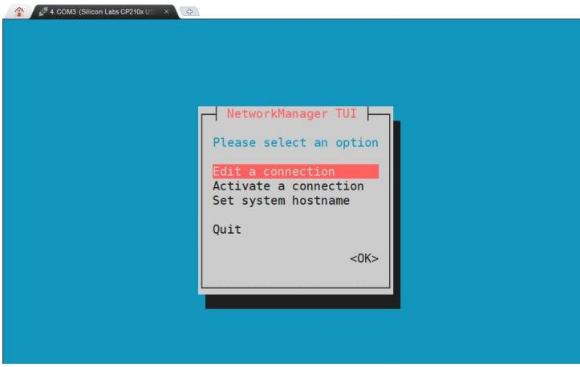


4) 选择 Activate a connect 后回车。

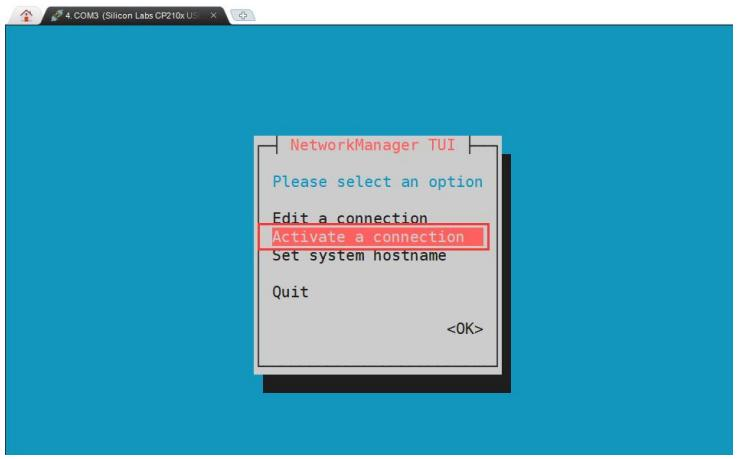


5) 然后就能看到所有搜索到的WIFI热点。

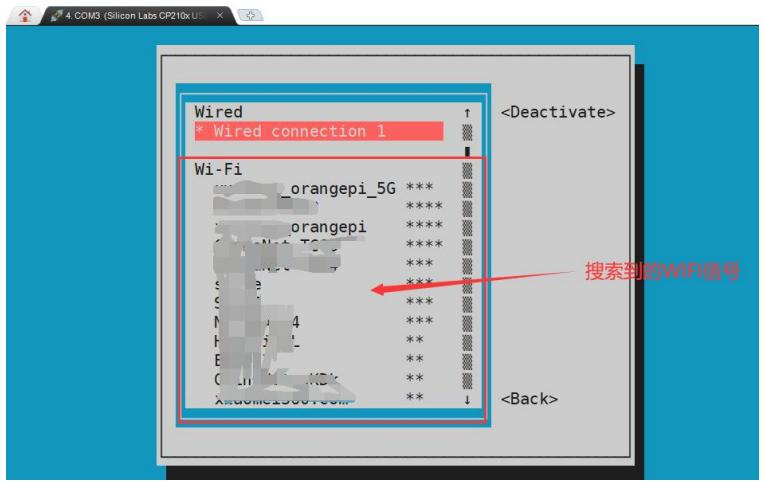


6) 选择想要连接的 WIFI 热点后再使用 Tab 键将光标定位到 Activate后回车。

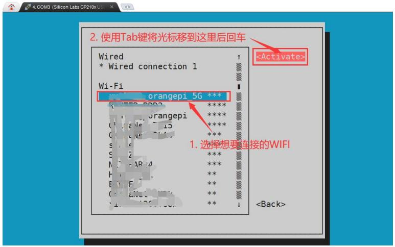


7) 然后会弹出输入密码的对话框，在 Pssword 内输入对应的密码然后回车就会开

始连接 WIFI。

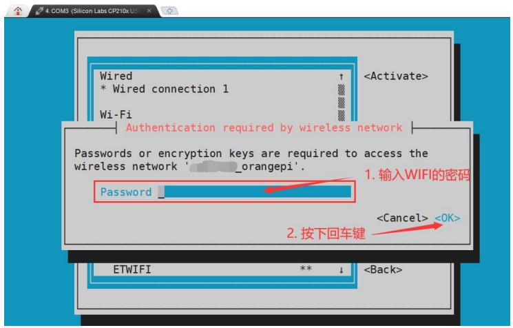


8) WIFI 连接成功后会在已连接的WIFI 名称前显示一个“*”。

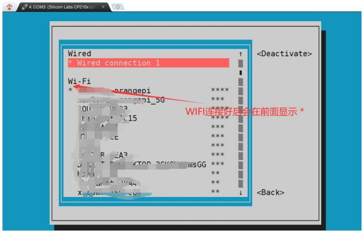


9) 通过 ip a s wlan0 命令可以查看 wifi 的 IP 地址。

```csv
(base) HwHiAiUser@orangepiaipro-20t:~$ ip a s wlan0
4: wlan0: <BROADCAST,MULTICAST,UP,LOWER_UP> mtu 1500 qdisc mq state UP
group default qlen 1000
link/ether 54:f2:9f:7b:ba:36 brd ff:ff:ff:ff:ff:
inet 10.31.2.93/16 brd 10.31.255.255 scope global dynamic noprefixroute wlan0
valid_lft 43003sec preferred_lft 43003sec
inet6 fe80::5297:7036:a33c:bb93/64 scope link noprefixroute
valid_lft forever preferred_lft forever 
```

10) 使用 ping 命令可以测试 wifi 网络的连通性，ping 命令可以通过 Ctrl+C 快捷键来中断运行。

```txt
(base) HwHiAiUser@orangepiaipro-20t:~$ ping www.orangepi.org -I wlan0
PING www.orangepi.org (123.57.147.237) from 10.31.2.93 wlan0: 56(84) bytes of data.
64 bytes from 123.57.147.237 (123.57.147.237): icmp_seq=1 ttl=53 time=47.1 ms
64 bytes from 123.57.147.237 (123.57.147.237): icmp_seq=2 ttl=53 time=44.3 ms
64 bytes from 123.57.147.237 (123.57.147.237): icmp_seq=3 ttl=53 time=45.0 ms
64 bytes from 123.57.147.237 (123.57.147.237): icmp_seq=4 ttl=53 time=71.0 ms
^C
--- www.orangepi.org ping statistics ---
4 packets transmitted, 4 received, 0% packet loss, time 3002ms
rtt min/avg/max/mdev = 44.377/51.902/71.082/11.119 ms 
```

# 3.5.2.3. 桌面版镜像的测试方法

1)首先点击桌面右上角的网络配置图标。


2) 在弹出的下拉框中点击 More networks 可以看到所有扫描到的 WIFI热点，然后选择想要连接的WIFI热点。

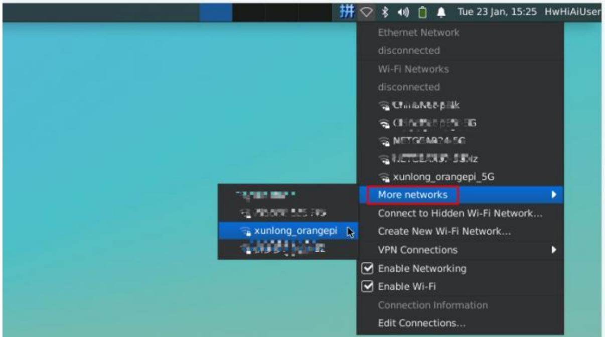


3) 然后输入 WIFI 热点的密码，再点击 Connect 就会开始连接 WIFI。


4) 连接好 WIFI 后，可以打开浏览器查看是否能上网，浏览器的入口如下图所示：


5) 打开浏览器后如果能打开其他网页说明WIFI连接正常。

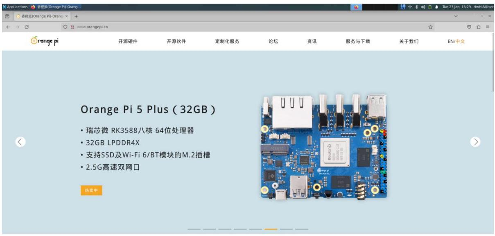


# 3.5.3. 设置静态IP 地址的方法

# 3.5.3.1. 使用 nmtui 命令来设置静态 IP 地址

1) 首先运行 nmtui命令。

```txt
(base) HwHiAiUser@orangepiaipro-20t:~$ sudo nmtui 
```

2) 然后选择 Edit a connection 并按下回车键。

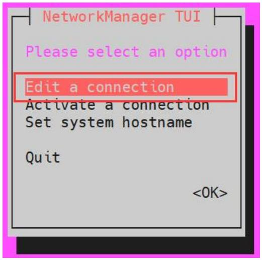


3)然后选择需要设置静态IP地址的网络接口，比如设置 2.5G以太网接口的静态IP地址选择 Wired connection 1 或者 Wired connection 2，Type-C 接口虚拟的 usb0 网口选择 usb0-static。

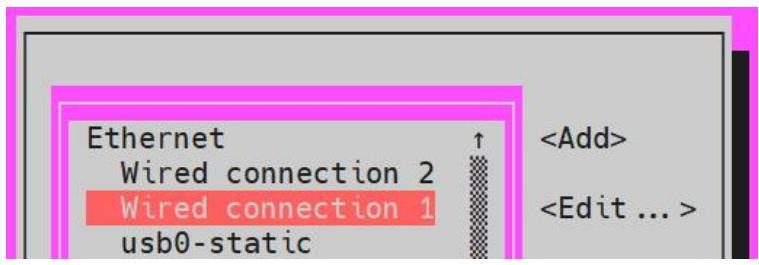


4) 然后选择好想要设置的网口后，再通过Tab 键选择Edit 并按下回车键。

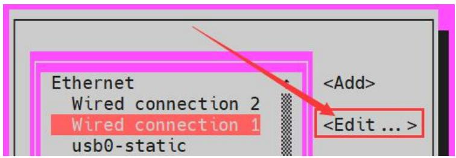


5) 然后通过Tab 键将光标移动到下图所示的 $< _ { \mathbf { A u t o m a t i c } > }$ 位置进行IPv4的配置。

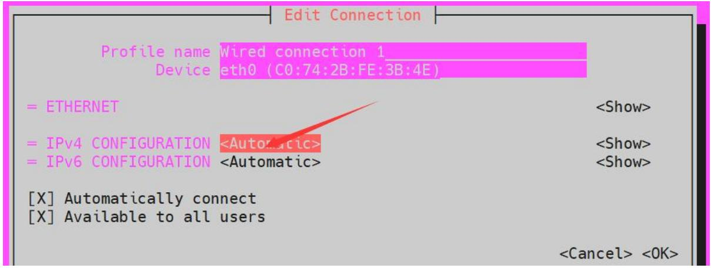


6) 然后回车，通过上下方向键选择Manual，然后回车确定。

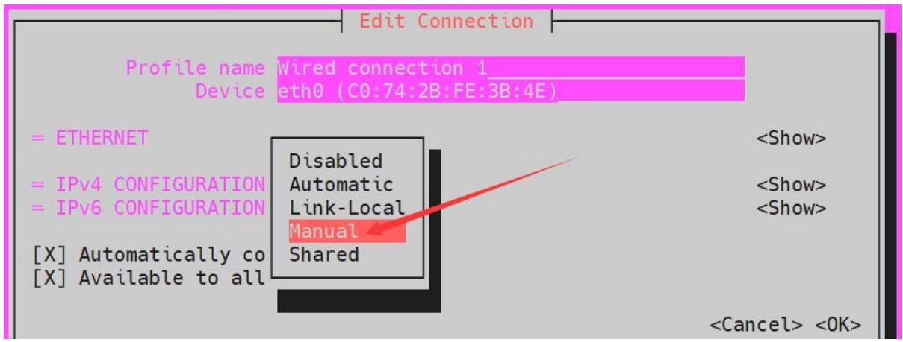


7)选择完后的显示如下图所示：

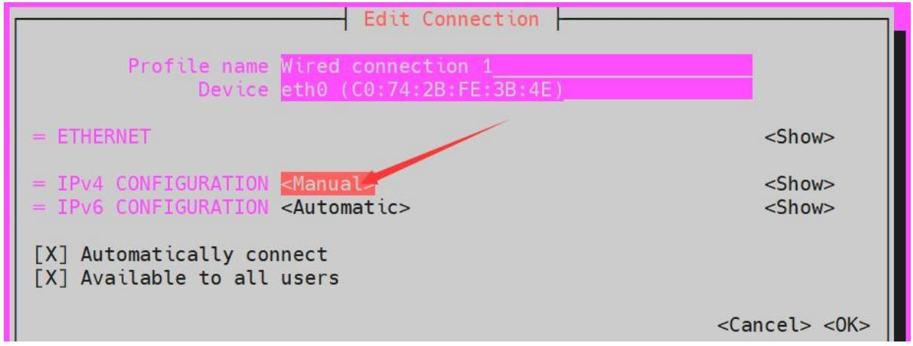


8) 然后通过 Tab 键将光标移动到<Show>。

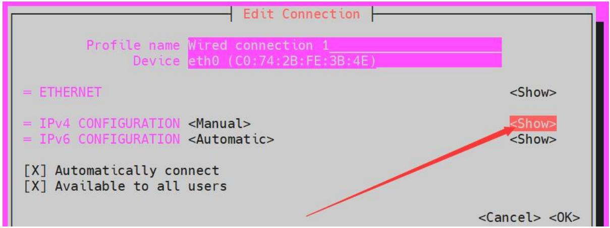


9) 然后回车，回车后会弹出下面的设置界面。

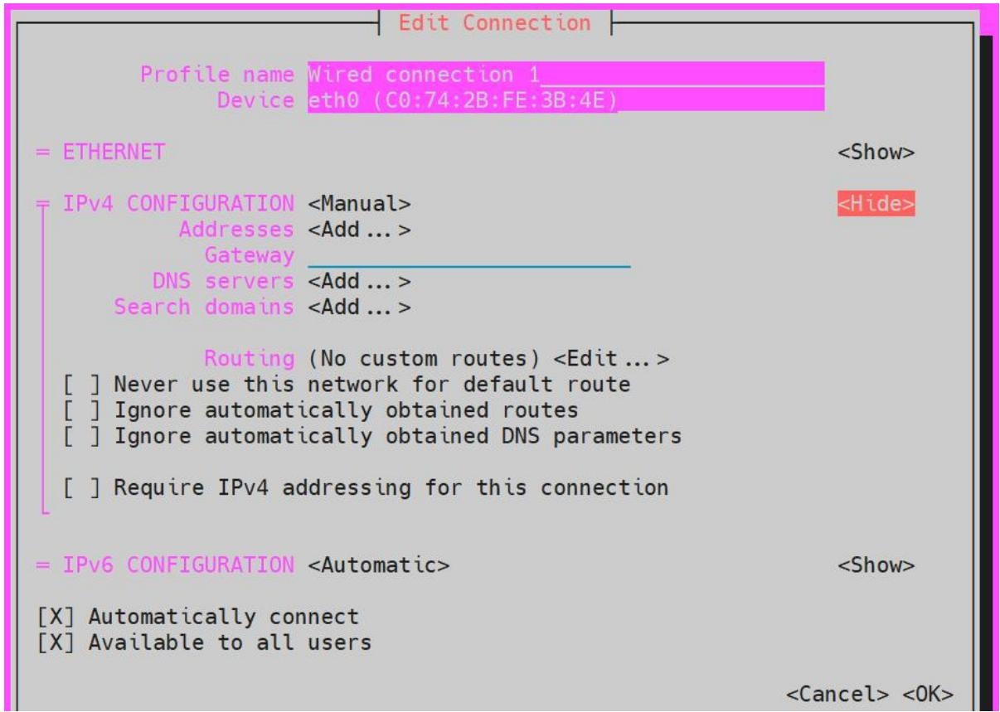


10) 然后就可以在下图所示的位置设置 IP 地址(Addresses)、网关(Gateway)和 DNS服务器的地址（里面还有很多其他设置选项，请自行探索），请根据自己的具体需求来设置，下图中设置的值只是一个示例。

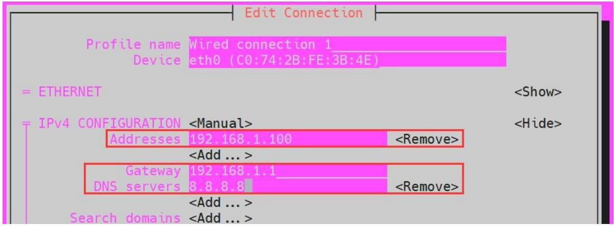


11) 设置完后将光标移动到右下角的<OK>，然后回车确认。


12)然后点击<Back>回退到上一级选择界面。

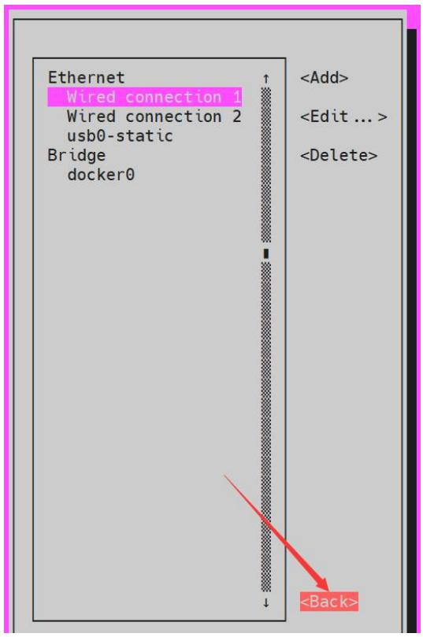


13) 然后选择 Activate a connection，再将光标移动到<OK>，最后点击回车。

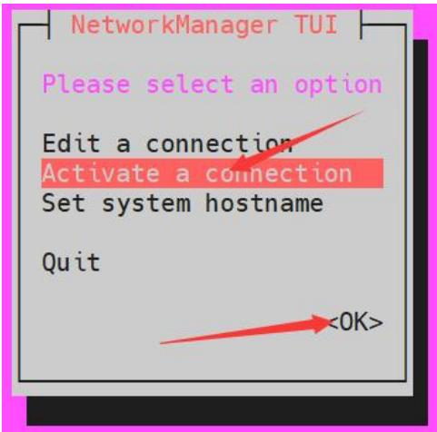


14)然后选择需要设置的网络接口，比如 Wired connection 1，然后将光标移动到<Deactivate>，再按下回车键禁用 Wired connection 1。

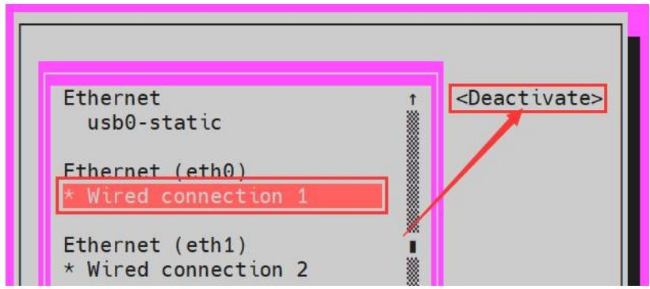


15) 然重新选择并使能 Wired connection 1，这样前面设置的静态 IP就会生效了。

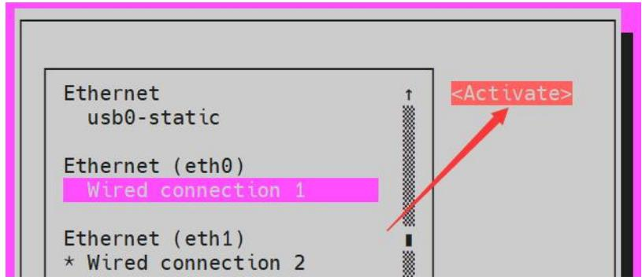


16) 然后通过<Back>和 Quit 按钮就可以退出 nmtui。

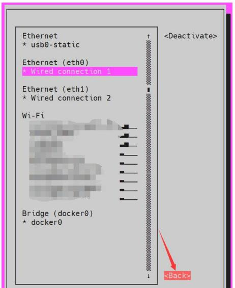


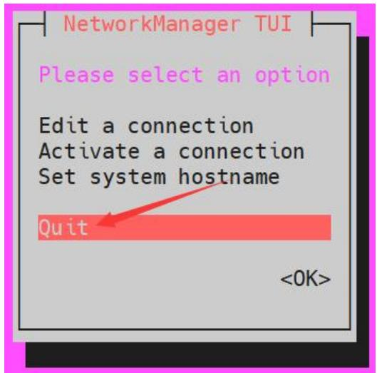


17) 然后确保网线已连接，再通过 ip addr show 就能看到对应网口的 IP地址已经变成设置的静态IP地址了。

```txt
(base) HwHiAiUser@orangepiaipro-20t:~$ ip a s eth0
2: eth0: <BROADCAST,MULTICAST,UP,LOWER_UP> mtu 1500 qdisc fq_codel state
UP group default qlen 1000
link/ether c0:74:2b:fe:3b:4e brd ff:ff:ff:ff:ff:
inet 192.168.1.100/24 brd 192.168.1.255 scope global noprefixroute eth0
valid_lft forever preferred_lft forever
inet6 fe80::70f3:e511:7706:7aa5/64 scope link noprefixroute
valid_lft forever preferred_lft forever 
```

# 3.5.3.2. 使用 nmcli 命令来设置静态 IP 地址

1) 使用 nmcli 命令设置静态 IP 地址为 192.168.1.100，网关为 192.168.1.1 的命令为：

a. 设置 2.5G 网口 eth0 的静态 IP 地址

```txt
(base) HwHiAiUser@orangepiaipro-20t:~$ sudo nmcli con add type ethernet ifname eth0 con-name eth0-static ip4 192.168.1.100/24 gw4 192.168.1.1 
```

b. 设置 2.5G 网口 eth1 的静态 IP 地址

```txt
(base) HwHiAiUser@orangepiaipro-20t:~$ sudo nmcli con add type ethernet ifname eth1 con-name eth1-static ip4 192.168.1.100/24 gw4 192.168.1.1 
```

c. 设置 Type-C 的 usb0 网口的静态 IP 地址

```txt
(base) HwHiAiUser@orangepiaipro-20t:~$ sudo nmcli con add type ethernet ifname usb0 con-name usb0-static ip4 192.168.1.100/24 gw4 192.168.1.1 
```

2) 重启一下系统， 确保网线已连接，然后使用 ip addr show eth0命令就可以看到IP地址已经设置为想要的值了。（eth1和usb0等请修改为对应的命令）

```csv
(base) HwHiAiUser@orangepiaipro-20t:~$ ip addr show eth0
2: eth0: <BROADCAST,MULTICAST,UP,LOWER_UP> mtu 1500 qdisc fq_codel state UP
group default qlen 1000
link/ether c0:74:2b:fe:3b:4e brd ff:ff:ff:ff:ff:ff
inet 192.168.1.100/24 brd 192.168.1.255 scope global noprefixroute eth0
valid_lft forever preferred_lft forever
inet6 fe80::d626:a148:dda0:8a9c/64 scope link noprefixroute
valid_lft forever preferred_lft forever 
```

# 3.6. SSH 远程登录开发板

Linux系统默认都开启了 ssh远程登录，并且允许 root用户登录系统。ssh登录前首先需要确保以太网或者 wifi网络已连接，然后使用 ip addr命令或者通过查看路由器的方式获取开发板的 IP地址。

# 3.6.1. Ubuntu 下 SSH 远程登录开发板

1)获取开发板的IP地址。

2) 然后就可以通过 ssh 命令远程登录 Linux系统。

test@test:~$ ssh root@192.168.2.xxx 

(需要替换为开发板的IP地址，不要照抄)

root@192.168.2.xx's password: 

（在这里输入密码，默认密码为Mind@123）

注意，输入密码的时候，屏幕上是不会显示输入的密码的具体内容的，请不要以为是有什么故障，输入完后直接回车即可。

3) 成功登录系统后的显示如下图所示：

orangepi@orangepi-M600:~$ ssh root@192.168.2.100 root@192.168.2.100's password 


ThteUtu2Ln5) 

This system is only applicable to individual developers and cannot beused for commercial purposes. 

Byusing this system，you haveagreed to the Huawei Software License Agreement. Pleaserefertotheagreement for detailson https://www.hiascend.com/software/protocol 

Last login:Fri Jan2616:55:152024 from 192.168.2.220 -bash:warning:setlocale:LC_ALL:cannot change locale (en_US.UTF-8) (base)root@orangepiaipro:~# 

# 3.6.2. Windows 下 SSH 远程登录开发板

1)首先获取开发板的IP地址。

2) 在 Windows 下可以使用 MobaXterm 远程登录开发板，首先新建一个 ssh会话。

a. 打开 Session。

b. 然后在 Session Setting 中选择 SSH。

c. 然后在 Remote host 中输入开发板的 IP 地址。

d. 然后在 Specify username 中输入 Linux 系统的用户名 root 或 HwHiAiUser。

e. 最后点击OK即可。

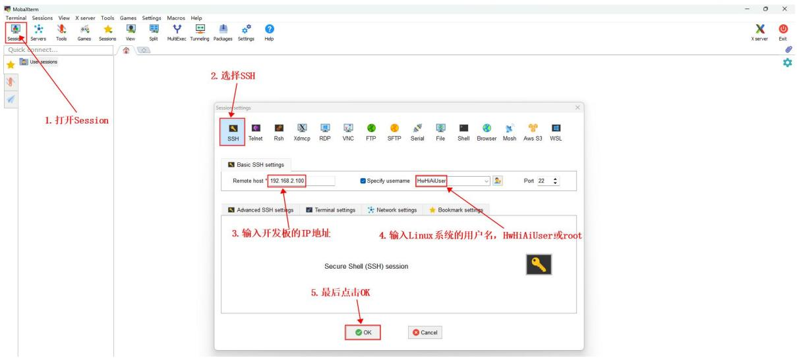


3) 然后会提示输入密码，默认 root 和 HwHiAiUser 用户的密码都为 Mind@123。

注意，输入密码的时候，屏幕上是不会显示输入的密码的具体内容的，请不要以为是有什么故障，输入完后直接回车即可。

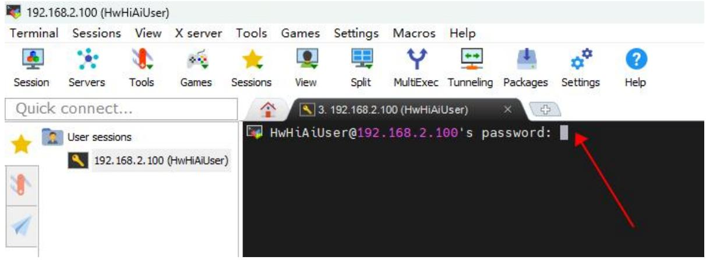


4) 成功登录系统后的显示如下图所示

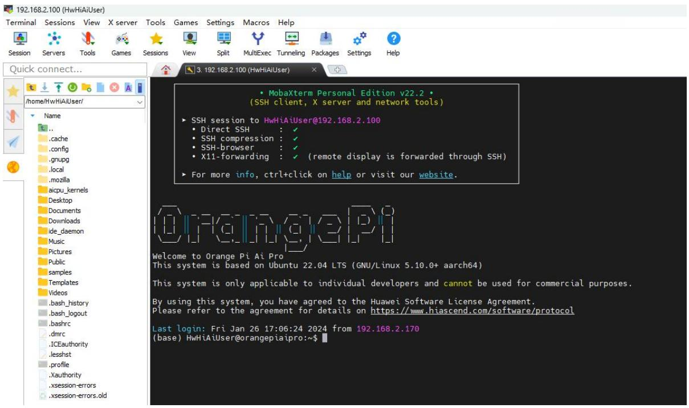


# 3.7. HDMI 接口的使用说明

# 3.7.1. HDMI 显示 Linux 桌面的说明

开发板有两个 HDMI2.0接口，在最新的镜像中两个 HDMI都支持显示 Linux系统的桌面，HDMI显示 Linux系统桌面的详细说明请查看登录 Linux系统桌面的方法一小节的说明。

# 3.8. 蓝牙使用方法

1)点击桌面右上角的蓝牙图标


2)然后打开蓝牙设备的配置界面


# 3) 然后在下面的界面中选择Yes

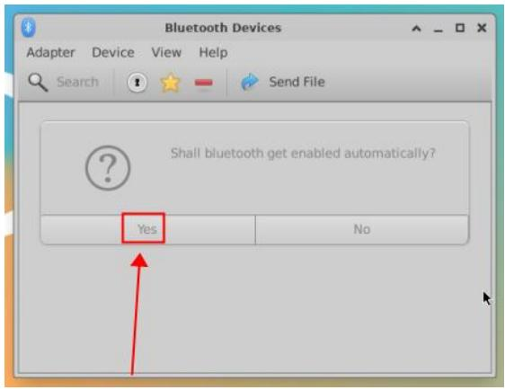


# 4) 点击Search 即可开始扫描周围的蓝牙设备

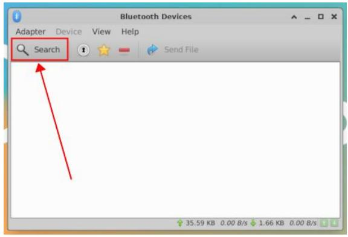


5)然后选择想要连接的蓝牙设备，再点击鼠标右键就会弹出对此蓝牙设备的操作界面，选择Pair即可开始配对，这里演示的是和Android手机配对。

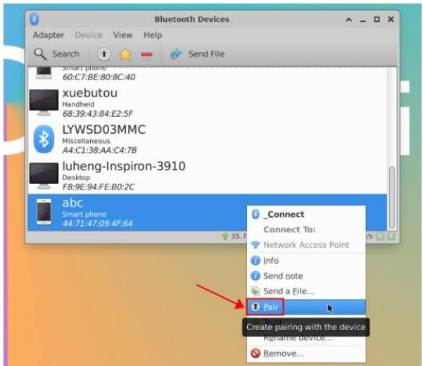


6) 配对时，桌面的右上角会弹出配对确认框，选择 Confirm确认即可，此时手机上也同样需要进行确认。

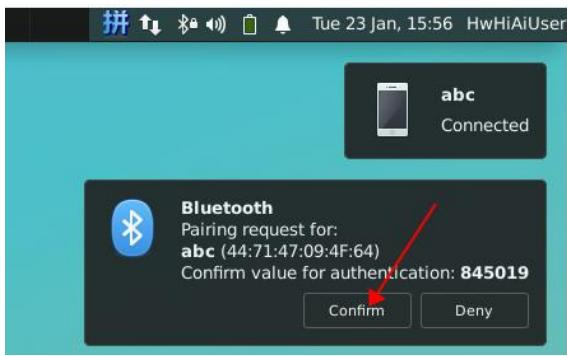


7) 和手机配对完后，可以选择已配对的蓝牙设备，然后选择 Send a File即可开始给手机发送一张图片。

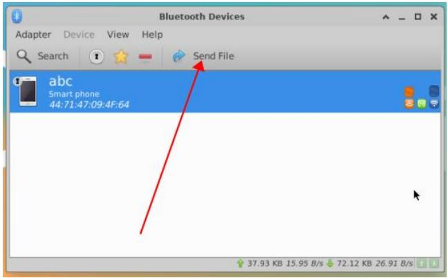


8) 发送图片的界面如下所示：

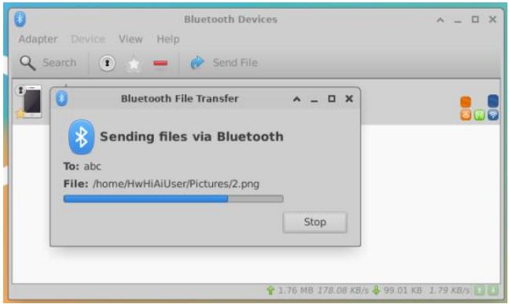


# 3.9. USB 接口测试

# 3.9.1. Type-C USB3.0 接口 Host 模式使用说明

开发板有一个 Type-C USB3.0 OTG 接口，其所在位置如下图所示。此接口既支持 Host 模式，也支持Device 模式，并且支持两种模式自动切换。

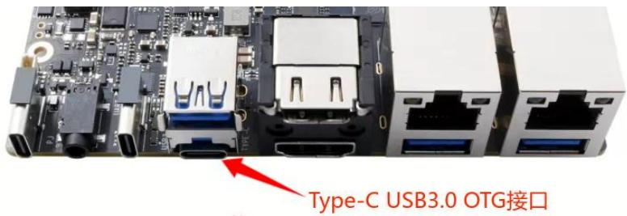


测试 Type-C 接口的 Host功能时，可以使用下图所示的 Type-C转 USB转接线来连接一个USB 存储设备或者鼠标键盘等USB设备。


# 3.9.2. Type-C USB3.0 接口 Device 模式使用说明

开发板有一个 Type-C USB3.0 OTG 接口，其所在位置如下图所示。此接口既支持 Host 模式，也支持Device 模式，并且支持两种模式自动切换。

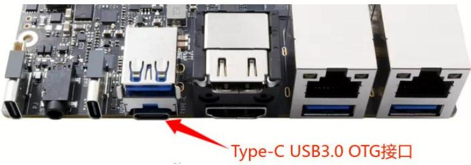


Linux 系统默认将 Type-C Device 设置为虚拟网口的功能，测试 Device 网口功能的步骤如下所示：

1) 使用下图所示的 Type-C 线，将开发板连接到 Ubuntu22.04 的电脑上。


2) Type-C 虚拟出的网口为 usb0，Linux 系统默认为其设置了 192.168.0.2 的静态 IP地址，通过 ifconfig usb0命令可以查看目前设置的 IP地址。修改 usb0静态 IP地址的方法请查看设置静态 IP 地址的方法一小节的说明。

```txt
(base) root@orangepiaipro-20t:~# ifconfig usb0
usb0: flags=4099<UP,BROADCAST,MULTICAST> mtu 1500
inet 192.168.0.2 netmask 255.255.255.0 broadcast 192.168.0.255
inet6 fe80::9391:bd5c:450a:857e prefixlen 64 scopeid 0x20<link>
ether 36:2c:1f:7c:03:f1 txqueuelen 1000 (Ethernet)
RX packets 0 bytes 0 (0.0 B)
RX errors 0 dropped 0 overruns 0 frame 0
TX packets 0 bytes 0 (0.0 B)
TX errors 0 dropped 0 overruns 0 carrier 0 collisions 0 
```

3) 将开发板的 Type-C 接口用 Type-C 线连接到 Ubuntu 电脑后，如果使用 lsusb命令能看到下面的设备信息说明连接正常。

```txt
orangepi@orangepi:~$ lsusb | grep Huawei 
```

```txt
Bus 001 Device 022: ID 12d1:107e Huawei Technologies Co., Ltd. P10 smartphone 
```


4) 在ubuntu 电脑中会看到多出了一个网口设备。


```txt
orangepi@orangepi:~$ ifconfig
......
enx1e71ffffb0420: flags=4163<UP,BROADCAST,RUNNING,MULTICAST> mtu 1500
ether 1e:71:ff:fb:04:20 txqueuelen 1000 (Ethernet)
RX packets 38 bytes 3910 (3.9 KB)
RX errors 0 dropped 0 overruns 0 frame 0
TX packets 95 bytes 22687 (22.6 KB)
TX errors 0 dropped 0 overruns 0 carrier 0 collisions 0
...... 
```

5) 然后可以在 Ubuntu 电脑中给这个网口设置静态 IP 地址。可以用 nmtui/nmcli命令来设置，可以用 ifconfig 命令临时设置下 IP 地址。（下面命令中的网口名请根据实际情况修改）

```txt
orangepi@orangepi:~$ sudo ifconfig enx1e71fffb0420 192.168.0.3 
```


6) 然后可以用ping 命令测试下能否ping通开发板。


```txt
orangepi@orangepi:~$ ping 192.168.0.2
PING 192.168.0.2 (192.168.0.2) 56(84) bytes of data.
64 bytes from 192.168.0.2: icmp_seq=1 ttl=64 time=1.14 ms
64 bytes from 192.168.0.2: icmp_seq=2 ttl=64 time=0.148 ms
64 bytes from 192.168.0.2: icmp_seq=3 ttl=64 time=0.170 ms 
```

# 3.9.3. 连接 USB 鼠标或键盘测试

开发板有三个 USB3.0 HOST 接口可以接鼠标和键盘，将 USB接口的鼠标和键盘插入开发板的 USB 3.0接口中，然后连接开发板到的 HDMI0接口到 HDMI显示器，等 HDMI显示器显示 Linux系统的桌面后就可以使用鼠标键盘来操作 Linux系统了。

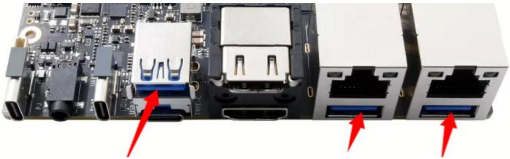


# 3.9.4. USB 摄像头测试

1) 首先将 USB 摄像头插入到开发板的 USB3.0 HOST 接口中。


2) 然后通过 v4l2-ctl 命令就可以看到 USB 摄像头的设备节点信息为/dev/video0

```txt
(base) HwHiAiUser@orangepiaipro-20t:~$ sudo apt-get update
(base) HwHiAiUser@orangepiaipro-20t:~$ sudo apt-get install -y v4l-utils
(base) HwHiAiUser@orangepiaipro-20t:~$ sudo v4l2-ctl --list-devices
Q8 HD Webcam: Q8 HD Webcam (usb-xhci-hcd.3.auto-1):
/dev/video0
/dev/video1 #这个是用来采集 metadata 的，先忽略。
/dev/media0
```

注意v4l2 中的 l 是小写字母 l，不是数字 1。

另外 video 的序号不一定都是 video0，请以实际看到的为准。

3) 使用 fswebcam 测试 USB 摄像头。欧拉系统不支持这种方式测试 USB摄像头。

a. 安装 fswebcam

```shell
(base) HwHiAiUser@orangepiaipro-20t:~$ sudo apt-get update
(base) HwHiAiUser@orangepiaipro-20t:~$ sudo apt-get install -y fswebcam 
```

b. 安装完fswebcam后可以使用下面的命令来拍照

a) -d 选项用于指定USB摄像头的设备节点

b) --no-banner 用于去除照片的水印

c) -r选项用于指定照片的分辨率

d) -S选项用设置于跳过前面的帧数

e) ./image.jpg 用于设置生成的照片的名字和路径

```txt
(base) HwHiAiUser@orangepiaipro-20t:~$ sudo fswebcam -d /dev/video0 --no-banner -r 1280x720 -S 5 ./image.jpg 
```

c. 然后就可以通过 HDMI 显示器在 Linux 桌面直接打开查看拍摄的图片。

4) 使用内置的 USBCamera 样例代码测试 USB 摄像头。

a. 首先进入 USBCamera样例代码的路径。

```txt
(base) HwHiAiUser@orangepiaipro-20t:~$ sudo -i
(base) root@orangepiaipro-20t:~# cd /opt/opi_test/USBCamera
(base) root@orangepiaipro-20t:/opt/opi_test/USBCamera# ls
main main.cpp readme.md 
```

b. 然后运行下面的命令就可以使用USB摄像头拍一张照片：

```txt
(base) root@orangepiaipro-20t:/opt/opi_test/USBCamera# ./main /dev/video0 
```

c. 运行成功后，在 USBCamera 样例目录下会生成一个 yuyv422 格式、1280*720 分辨率的 out.yuv 文件。

```txt
(base) root@orangepiaipro-20t:/opt/opi_test/USBCamera# ls main main.cpp out.yuv readme.md 
```

d. 然后在 Linux 桌面中使用下面的命令可以查看 out.yuv文件的内容。

```txt
(base) root@orangepiaipro-20t:/opt/opi_test/USBCamera# ffplay -pix_fmt yuyv422 -video_size 1280*720 out.yuv 
```

# 3.10. 音频测试

# 3.10.1. ALSA 声卡设备测试

1)执行下面的命令，如果有如下的输出，就代表识别到了支持 alsa驱动的声卡设备。

```txt
(base) root@orangepiaipro-20t:~# aplay -l
**** List of PLAYBACK Hardware Devices ****
card 0: ascend310b [ascend310b], device 0: ascend310b-playback ascend310b-hifi-0 []
Subdevices: 0/1
Subdevice #0: subdevice #0 
```

# 3.10.2. 耳机接口播放音频测试

1) 首先将耳机插入开发板的3.5mm耳机接口中。

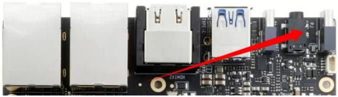


2) 然后进入音频测试程序所在的目录中。

```txt
(base) HwHiAiUser@orangepiaipro-20t:~$ sudo -i
(base) root@orangepiaipro-20t:~# cd /opt/opi_test/audio
(base) root@orangepiaipro-20t:/opt/opi_test/audio# ls
play_hdmi0.sh play_hdmi1.sh play_headset.sh record.sh tianlu.pcm tianlu.wav 
```

3) 然后使用下的命令就可以播放测试音频到耳机了。

```txt
(base) root@orangepiaipro-20t:/opt/opi_test/audio# ./play_headset.sh 
```

# 3.10.3. HDMI 音频播放测试

1) 开发板有两个HDMI 接口，所在位置如下图所示：

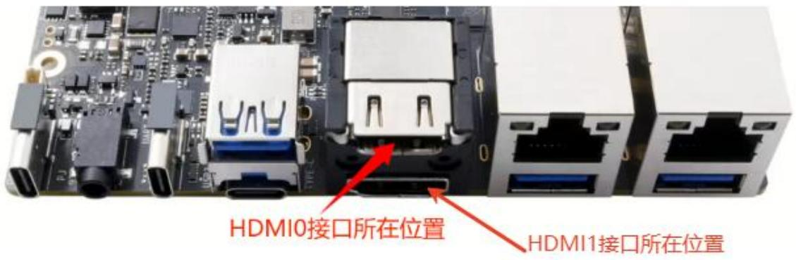


2)使用 HDMI转 HDMI线连接开发板和 HDMI显示器，并确保 HDMI显示器显示桌面正常。


4)然后进入音频测试程序所在的目录中。

```txt
(base) HwHiAiUser@orangepiaipro-20t:~$ sudo -i
(base) root@orangepiaipro-20t:~# cd /opt/opi_test/audio
(base) root@orangepiaipro-20t:/opt/opi_test/audio# ls
play_hdmi0.sh play_hdmi1.sh play_headset.sh record.sh tianlu.pcm tianlu.wav 
```

5) 然后使用下的命令就可以播放测试音频到HDMI了。

a. HDMI0 的播放命令如下所示：

```txt
(base) root@orangepiaipro-20t:/opt/opi_test/audio# ./play_hdmi0.sh 
```

b. HDMI1的播放命令如下所示：

```txt
(base) root@orangepiaipro-20t:/opt/opi_test/audio# ./play_hdmi1.sh 
```

# 3.10.4. 耳机 MIC 录音测试

1) 首先将带 MIC 功能的耳机插入开发板的3.5mm耳机接口中。

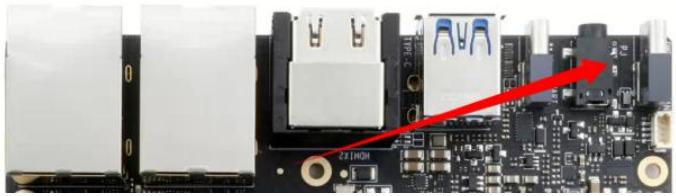


2)然后进入音频测试程序所在的目录中。

```txt
(base) HwHiAiUser@orangepiaipro-20t:~$ sudo -i
(base) root@orangepiaipro-20t:~# cd /opt/opi_test/audio
(base) root@orangepiaipro-20t:/opt/opi_test/audio# ls
play_hdmi0.sh play_hdmi1.sh play_headset.sh record.sh tianlu.pcm tianlu.wav 
```

3)然后使用下面的命令会录制一段 5秒钟的音频，然后会将录制好的音频文件播放到耳机。如果耳机能听到录制的声音，说明测试成功。

```txt
(base) root@orangepiaipro-20t:/opt/opi_test/audio# ./record.sh 
```

# 3.11. 40 Pin 接口引脚功能说明

开发板的40 pin 接口引脚的顺序如下图所示：

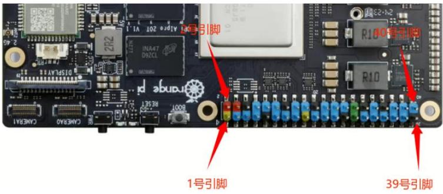


开发板40 pin 接口引脚的功能如下表所示：


<table><tr><td>GPIO序号</td><td>GPIO</td><td>功能</td><td>引脚</td></tr><tr><td></td><td></td><td>3.3V</td><td>1</td></tr><tr><td>76</td><td>GPIO2_12</td><td>SDA7</td><td>3</td></tr><tr><td>75</td><td>GPIO2_11</td><td>SCL7</td><td>5</td></tr><tr><td>226</td><td>GPIO7_02</td><td>UTXD7</td><td>7</td></tr><tr><td></td><td></td><td>GND</td><td>9</td></tr><tr><td>82</td><td>GPIO2_18</td><td>URXD2</td><td>11</td></tr><tr><td>38</td><td>GPIO1_06</td><td></td><td>13</td></tr><tr><td>79</td><td>GPIO2_15</td><td></td><td>15</td></tr><tr><td></td><td></td><td>3.3V</td><td>17</td></tr><tr><td>91</td><td>GPIO2_27</td><td>SPI0_SDO</td><td>19</td></tr><tr><td>92</td><td>GPIO2_28</td><td>SPI0_SDI</td><td>21</td></tr><tr><td>89</td><td>GPIO2_25</td><td>SPI0_SCLK</td><td>23</td></tr><tr><td></td><td></td><td>GND</td><td>25</td></tr><tr><td></td><td></td><td>SDA6</td><td>27</td></tr><tr><td>231</td><td>GPIO7_07</td><td>URXD7</td><td>29</td></tr><tr><td>84</td><td>GPIO2_20</td><td></td><td>31</td></tr><tr><td>128</td><td>GPIO4_00</td><td></td><td>33</td></tr><tr><td>228</td><td>GPIO7_04</td><td></td><td>35</td></tr><tr><td>3</td><td>GPIO0_03</td><td></td><td>37</td></tr><tr><td></td><td></td><td>GND</td><td>39</td></tr></table>

<table><tr><td>引脚</td><td>功能</td><td>GPIO</td><td>GPIO序号</td></tr><tr><td>2</td><td>5V</td><td></td><td></td></tr><tr><td>4</td><td>5V</td><td></td><td></td></tr><tr><td>6</td><td>GND</td><td></td><td></td></tr><tr><td>8</td><td>UTXD0</td><td>GPIO0_14</td><td>14</td></tr><tr><td>10</td><td>URXD0</td><td>GPIO0_15</td><td>15</td></tr><tr><td>12</td><td></td><td>GPIO7_03</td><td>227</td></tr><tr><td>14</td><td>GND</td><td></td><td></td></tr><tr><td>16</td><td></td><td>GPIO2_16</td><td>80</td></tr><tr><td>18</td><td></td><td>GPIO0_25</td><td>25</td></tr><tr><td>20</td><td>GND</td><td></td><td></td></tr><tr><td>22</td><td></td><td>GPIO0_02</td><td>2</td></tr><tr><td>24</td><td>SPI0_CS</td><td>GPIO2_26</td><td>90</td></tr><tr><td>26</td><td></td><td>GPIO2_19</td><td>83</td></tr><tr><td>28</td><td>SCL6</td><td></td><td></td></tr><tr><td>30</td><td>GND</td><td></td><td></td></tr><tr><td>32</td><td>PWM3</td><td>GPIO1_01</td><td>33</td></tr><tr><td>34</td><td>GND</td><td></td><td></td></tr><tr><td>36</td><td>UTXD2</td><td>GPIO2_17</td><td>81</td></tr><tr><td>38</td><td></td><td>GPIO7_06</td><td>230</td></tr><tr><td>40</td><td></td><td>GPIO7_05</td><td>229</td></tr></table>

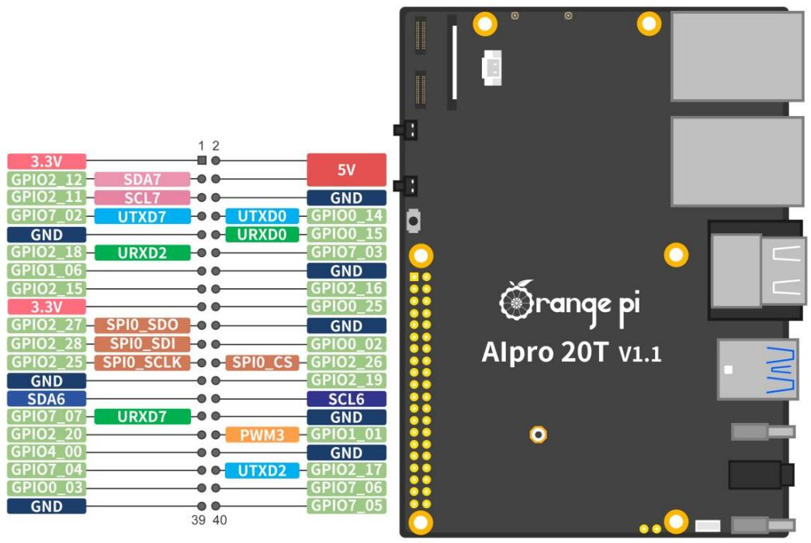


40 pin 接口使用注意事项如下所示：

1)40 pin接口中总共有 26个 GPIO口，但 8号和 10号引脚默认是用于调试串口功能的，并且这两个引脚和 Type-C USB 调试串口是连接在一起的，所以这两个引脚请不要设置为GPIO等功能。

2) 所有的 GPIO 口的电压都是 3.3v。

3) 40 pin 接口中 27 号和 28 号引脚只有 I2C 的功能，没有 GPIO 等其他复用功能，另外这两个引脚的电压默认都为1.8v。

# 3.12. 40 pin 接口 GPIO、I2C、UART、SPI、PWM 和 CAN 测试

# 3.12.1. 40 pin GPIO 口的测试方法

开发板 40 pin接口引脚的功能如下表所示，其中标红部分的引脚默认配置为GPIO功能，可以直接使用，其他具有 GPIO复用功能的引脚需要修改 DTS配置才能正常使用GPIO的功能。

<table><tr><td>GPIO序号</td><td>GPIO</td><td>功能</td><td>引脚</td></tr><tr><td></td><td></td><td>3.3V</td><td>1</td></tr></table>

<table><tr><td>引脚</td><td>功能</td><td>GPIO</td><td>GPIO序号</td></tr><tr><td>2</td><td>5V</td><td></td><td></td></tr><tr><td>76</td><td>GPIO2_12</td><td>SDA7</td><td>3</td></tr><tr><td>75</td><td>GPIO2_11</td><td>SCL7</td><td>5</td></tr><tr><td>226</td><td>GPIO7_02</td><td>UTXD7</td><td>7</td></tr><tr><td></td><td></td><td>GND</td><td>9</td></tr><tr><td>82</td><td>GPIO2_18</td><td>URXD2</td><td>11</td></tr><tr><td>38</td><td>GPIO1_06</td><td></td><td>13</td></tr><tr><td>79</td><td>GPIO2_15</td><td></td><td>15</td></tr><tr><td></td><td></td><td>3.3V</td><td>17</td></tr><tr><td>91</td><td>GPIO2_27</td><td>SPI0_SDO</td><td>19</td></tr><tr><td>92</td><td>GPIO2_28</td><td>SPI0_SDI</td><td>21</td></tr><tr><td>89</td><td>GPIO2_25</td><td>SPI0_SCLK</td><td>23</td></tr><tr><td></td><td></td><td>GND</td><td>25</td></tr><tr><td></td><td></td><td>SDA6</td><td>27</td></tr><tr><td>231</td><td>GPIO7_07</td><td>URXD7</td><td>29</td></tr><tr><td>84</td><td>GPIO2_20</td><td>CAN_TX2</td><td>31</td></tr><tr><td>128</td><td>GPIO4_00</td><td></td><td>33</td></tr><tr><td>228</td><td>GPIO7_04</td><td></td><td>35</td></tr><tr><td>3</td><td>GPIO0_03</td><td></td><td>37</td></tr><tr><td></td><td></td><td>GND</td><td>39</td></tr></table>

<table><tr><td>4</td><td>5V</td><td></td><td></td></tr><tr><td>6</td><td>GND</td><td></td><td></td></tr><tr><td>8</td><td>UTXDO</td><td>GPIO0_14</td><td>14</td></tr><tr><td>10</td><td>URXDO</td><td>GPIO0_15</td><td>15</td></tr><tr><td>12</td><td></td><td>GPIO7_03</td><td>227</td></tr><tr><td>14</td><td>GND</td><td></td><td></td></tr><tr><td>16</td><td></td><td>GPIO2_16</td><td>80</td></tr><tr><td>18</td><td></td><td>GPIO0_25</td><td>25</td></tr><tr><td>20</td><td>GND</td><td></td><td></td></tr><tr><td>22</td><td></td><td>GPIO0_02</td><td>2</td></tr><tr><td>24</td><td>SPI0_CS</td><td>GPIO2_26</td><td>90</td></tr><tr><td>26</td><td>CAN_RX2</td><td>GPIO2_19</td><td>83</td></tr><tr><td>28</td><td>SCL6</td><td></td><td></td></tr><tr><td>30</td><td>GND</td><td></td><td></td></tr><tr><td>32</td><td>PWM3</td><td>GPIO1_01</td><td>33</td></tr><tr><td>34</td><td>GND</td><td></td><td></td></tr><tr><td>36</td><td>UTXD2</td><td>GPIO2_17</td><td>81</td></tr><tr><td>38</td><td></td><td>GPIO7_06</td><td>230</td></tr><tr><td>40</td><td></td><td>GPIO7_05</td><td>229</td></tr></table>

Linux 镜像中预装了 gpio_operate 工具用于设置 GPIO 管脚的输入与输出方向，也可将每个 GPIO 管脚独立的设为 0 或 1。gpio_operate 工具的详细使用方法如下所示：

1) gpio_operate 工具必须使用 root 帐号执行。

2) gpio_operate -h 命令可以获取 gpio_operate 工具的帮助信息：

```txt
(base) root@orangepiaipro-20t:~# gpio_operate -h 
```

```elixir
Usage: gpio_operate <Command|-h> [Options...] 
```

```txt
gpio_operate Command: 
```

```txt
-h : This command's help information.
set_value : Set gpio pin value.
get_value : Get gpio pin value.
set_direction : Set gpio pin direction value.
get_direction : Get gpio pin direction value. 
```

3) gpio_operate get_direction gpio_group gpio_pin 用于查询 GPIO 管脚方向。

a. gpio_group 和 gpio_pin 参数说明如下所示：

<table><tr><td>类型</td><td>描述</td></tr><tr><td>gpio_group</td><td>GPIO 组号,取值为[0,8]</td></tr><tr><td>gpio_pin</td><td>GPIO 管脚号,取值为[0,31]</td></tr></table>

b. 比如 40 pin 中的第 31 号引脚对应的 GPIO 为 GPIO2_20，那么其 GPIO组号为 2，GPIO 管脚号为20，获取其方向的命令为：

```txt
(base) root@orangepiaipro-20t:~# gpio_operate get_direction 2 20
Get gpio pin direction value succeeded, value is 0. 
```

c.输出的打印信息说明

<table><tr><td>字段</td><td>说明</td></tr><tr><td>direction</td><td>GPIO 管脚方向,取值为[0,1]• 0:输入方向• 1:输出方向</td></tr></table>

4) gpio_operate set_direction gpio_group gpio_pin direction 用于设置 GPIO 管脚方向。

a. gpio_group、gpio_pin 和 direction 参数说明如下所示：

<table><tr><td>类型</td><td>描述</td></tr><tr><td>gpio_group</td><td>GPIO 组号,取值为[0,8]</td></tr><tr><td>gpio_pin</td><td>GPIO 管脚号,取值为[0,31]</td></tr><tr><td>direction</td><td>GPIO 管脚方向,取值为[0,1]• 0:输入方向• 1:输出方向</td></tr></table>

b. 比如 40 pin 中的第 31 号引脚对应的 GPIO 为 GPIO2_20，那么其 GPIO组号为 2，GPIO 管脚号为20，设置其方向为输出的命令为：

```txt
(base) root@orangepiaipro-20t:~# gpio_operate set_direction 2 20 1
Set gpio pin direction value succeeded. 
```

5) gpio_operate get_value gpio_group gpio_pin 命令用于查询 GPIO 管脚值。

a. gpio_group 和 gpio_pin 参数说明如下所示：

<table><tr><td>类型</td><td>描述</td></tr><tr><td>gpio_group</td><td>GPIO 组号,取值为[0,8]</td></tr><tr><td>gpio_pin</td><td>GPIO 管脚号,取值为[0,31]</td></tr></table>

b. 比如 40 pin 中的第 31 号引脚对应的 GPIO 为 GPIO2_20，那么其 GPIO组号为 2，GPIO 管脚号为20，查询其管脚值的命令如下所示：

```txt
(base) root@orangepiaipro-20t:~# gpio_operate get_value 2 20
Get gpio_pin value succeeded, value is 0. #这里查询到的值为 0，也就是低电平
```

6) gpio_operate set_value gpio_group gpio_pin value 命令用于设置 GPIO 管脚值为高电平或者低电平，注意设置管脚值前，请确保已将 GPIO 管脚的方向设置为输出了。

a. gpio_group、gpio_pin 和 value 参数说明如下所示：

<table><tr><td>类型</td><td>描述</td></tr><tr><td>gpio_group</td><td>GPIO 组号,取值为[0,8]</td></tr><tr><td>gpio_pin</td><td>GPIO 管脚号,取值为[0,31]</td></tr><tr><td>value</td><td>GPIO 管脚值,取值为[0,1]当 GPIO 管脚方向为输入方向时,不允许设置 GPIO 管脚值。</td></tr></table>

b. 比如 40 pin 中的第 31 号引脚对应的 GPIO 为 GPIO2_20，那么其 GPIO组号为 2，GPIO 管脚号为20，设置其输出为高电平的命令为：

```txt
(base) root@orangepiaipro-20t:~# gpio_operate set_value 2 20 1 
```

# 3.12.2. 40 pin SPI 回环测试

开发板40pin接口引脚的功能如下表所示，其中标红部分的引脚具有 SPI功能，并且 Linux 系统默认配置为了SPI 功能，可以直接使用。

<table><tr><td>GPIO序号</td><td>GPIO</td><td>功能</td><td>引脚</td></tr><tr><td></td><td></td><td>3.3V</td><td>1</td></tr><tr><td>76</td><td>GPIO2_12</td><td>SDA7</td><td>3</td></tr><tr><td>75</td><td>GPIO2_11</td><td>SCL7</td><td>5</td></tr><tr><td>226</td><td>GPIO7_02</td><td>UTXD7</td><td>7</td></tr></table>

<table><tr><td>引脚</td><td>功能</td><td>GPIO</td><td>GPIO序号</td></tr><tr><td>2</td><td>5V</td><td></td><td></td></tr><tr><td>4</td><td>5V</td><td></td><td></td></tr><tr><td>6</td><td>GND</td><td></td><td></td></tr><tr><td>8</td><td>UTXDO</td><td>GPIO0_14GND</td><td>149</td></tr><tr><td>82</td><td>GPIO2_18</td><td>URXD2</td><td>11</td></tr><tr><td>38</td><td>GPIO1_06</td><td></td><td>13</td></tr><tr><td>79</td><td>GPIO2_15</td><td></td><td>15</td></tr><tr><td></td><td></td><td>3.3V</td><td>17</td></tr><tr><td>91</td><td>GPIO2_27</td><td>SPI0_SDO</td><td>19</td></tr><tr><td>92</td><td>GPIO2_28</td><td>SPI0_SDI</td><td>21</td></tr><tr><td>89</td><td>GPIO2_25</td><td>SPI0_SCLK</td><td>23</td></tr><tr><td></td><td></td><td>GND</td><td>25</td></tr><tr><td></td><td></td><td>SDA6</td><td>27</td></tr><tr><td>231</td><td>GPIO7_07</td><td>URXD7</td><td>29</td></tr><tr><td>84</td><td>GPIO2_20</td><td>CAN_TX2</td><td>31</td></tr><tr><td>128</td><td>GPIO4_00</td><td></td><td>33</td></tr><tr><td>228</td><td>GPIO7_04</td><td></td><td>35</td></tr><tr><td>3</td><td>GPIO0_03</td><td></td><td>37</td></tr><tr><td></td><td></td><td>GND</td><td>39</td></tr></table>

<table><tr><td>10</td><td>URXDO</td><td>GPIO0_15</td><td>15</td></tr><tr><td>12</td><td></td><td>GPIO7_03</td><td>227</td></tr><tr><td>14</td><td>GND</td><td></td><td></td></tr><tr><td>16</td><td></td><td>GPIO2_16</td><td>80</td></tr><tr><td>18</td><td></td><td>GPIO0_25</td><td>25</td></tr><tr><td>20</td><td>GND</td><td></td><td></td></tr><tr><td>22</td><td></td><td>GPIO0_02</td><td>2</td></tr><tr><td>24</td><td>SPI0_CS</td><td>GPIO2_26</td><td>90</td></tr><tr><td>26</td><td>CAN_RX2</td><td>GPIO2_19</td><td>83</td></tr><tr><td>28</td><td>SCL6</td><td></td><td></td></tr><tr><td>30</td><td>GND</td><td></td><td></td></tr><tr><td>32</td><td>PWM3</td><td>GPIO1_01</td><td>33</td></tr><tr><td>34</td><td>GND</td><td></td><td></td></tr><tr><td>36</td><td>UTXD2</td><td>GPIO2_17</td><td>81</td></tr><tr><td>38</td><td></td><td>GPIO7_06</td><td>230</td></tr><tr><td>40</td><td></td><td>GPIO7_05</td><td>229</td></tr></table>

40 pin 接口中的 SPI 总线为 SPI0，测试前请先确保/dev 下存在 spidev0.0 设备节点。

```txt
(base) HwHiAiUser@orangepiaipro-20t:~$ ls /dev/spidev0.0 /dev/spidev0.0 
```

然后先不短接 SPI0 的 mosi 和 miso 两个引脚，运行 spidev_test 的输出结果如下所示，可以看到TX和RX的数据不一致。

```txt
(base) HwHiAiUser@orangepiaipro-20t:~$ sudo spidev_test -v -D /dev/spidev0.0
spi mode: 0x0
bits per word: 8
max speed: 500000 Hz (500 KHz)
TX | FF FF FF FF FF FF 40 00 00 00 00 95 FF FF FF FF FF FF FF FF FF FF FF FF FF FF FF FF FF F0 0D |......@............|
RX | 00 00 00 00 00 00 00 00 00 00 00 00 00 00 00 00 00 00 00 00 00 00 00 00 00 00 00 00 00 00 00 00 00 00
00 00 00 00 00 |......| 
```

然后用杜邦线短接 SPI1 的 mosi（40 pin 接口中的第 19 号引脚）和 miso（40pin 接口中的第 21 号引脚）两个引脚再运行 spidev_test 的输出如下，可以看到发送

和接收的数据一样，说明回环测试成功。

```txt
(base) HwHiAiUser@orangepiaipro-20t:~$ sudo spidev_test -v -D /dev/spidev0.0
spi mode: 0x0
bits per word: 8
max speed: 500000 Hz (500 KHz)
TX | FF FF FF FF FF FF 40 00 00 00 00 95 FF FF FF FF FF FF FF FF FF FF FF FF FF FF FF FF F0 0D | .....@.......
RX | FF FF FF FF FF FF 40 00 00 00 00 95 FF FF FF FF FF FF FF FF FF FF FF FF FF FF FF FF FF F0 0D | .....@....... 
```

# 3.12.3. 40 pin I2C 测试

开发板40pin接口引脚的功能如下表所示，其中标红部分的引脚具有 I2C功能，并且Linux系统默认配置为了I2C功能，可以直接使用。

<table><tr><td>GPIO序号</td><td>GPIO</td><td>功能</td><td>引脚</td></tr><tr><td></td><td></td><td>3.3V</td><td>1</td></tr><tr><td>76</td><td>GPIO2_12</td><td>SDA7</td><td>3</td></tr><tr><td>75</td><td>GPIO2_11</td><td>SCL7</td><td>5</td></tr><tr><td>226</td><td>GPIO7_02</td><td>UTXD7</td><td>7</td></tr><tr><td></td><td></td><td>GND</td><td>9</td></tr><tr><td>82</td><td>GPIO2_18</td><td>URXD2</td><td>11</td></tr><tr><td>38</td><td>GPIO1_06</td><td></td><td>13</td></tr><tr><td>79</td><td>GPIO2_15</td><td></td><td>15</td></tr><tr><td></td><td></td><td>3.3V</td><td>17</td></tr><tr><td>91</td><td>GPIO2_27</td><td>SPI0_SDO</td><td>19</td></tr><tr><td>92</td><td>GPIO2_28</td><td>SPI0_SDI</td><td>21</td></tr><tr><td>89</td><td>GPIO2_25</td><td>SPI0_SCLK</td><td>23</td></tr><tr><td></td><td></td><td>GND</td><td>25</td></tr><tr><td></td><td></td><td>SDA6</td><td>27</td></tr><tr><td>231</td><td>GPIO7_07</td><td>URXD7</td><td>29</td></tr><tr><td>84</td><td>GPIO2_20</td><td>CAN_TX2</td><td>31</td></tr><tr><td>128</td><td>GPIO4_00</td><td></td><td>33</td></tr><tr><td>228</td><td>GPIO7_04</td><td></td><td>35</td></tr><tr><td>3</td><td>GPIO0_03</td><td></td><td>37</td></tr><tr><td></td><td></td><td>GND</td><td>39</td></tr></table>

<table><tr><td>引脚</td><td>功能</td><td>GPIO</td><td>GPIO序号</td></tr><tr><td>2</td><td>5V</td><td></td><td></td></tr><tr><td>4</td><td>5V</td><td></td><td></td></tr><tr><td>6</td><td>GND</td><td></td><td></td></tr><tr><td>8</td><td>UTXD0</td><td>GPIO0_14</td><td>14</td></tr><tr><td>10</td><td>URXD0</td><td>GPIO0_15</td><td>15</td></tr><tr><td>12</td><td></td><td>GPIO7_03</td><td>227</td></tr><tr><td>14</td><td>GND</td><td></td><td></td></tr><tr><td>16</td><td></td><td>GPIO2_16</td><td>80</td></tr><tr><td>18</td><td></td><td>GPIO0_25</td><td>25</td></tr><tr><td>20</td><td>GND</td><td></td><td></td></tr><tr><td>22</td><td></td><td>GPIO0_02</td><td>2</td></tr><tr><td>24</td><td>SPI0_CS</td><td>GPIO2_26</td><td>90</td></tr><tr><td>26</td><td>CAN_RX2</td><td>GPIO2_19</td><td>83</td></tr><tr><td>28</td><td>SCL6</td><td></td><td></td></tr><tr><td>30</td><td>GND</td><td></td><td></td></tr><tr><td>32</td><td>PWM3</td><td>GPIO1_01</td><td>33</td></tr><tr><td>34</td><td>GND</td><td></td><td></td></tr><tr><td>36</td><td>UTXD2</td><td>GPIO2_17</td><td>81</td></tr><tr><td>38</td><td></td><td>GPIO7_06</td><td>230</td></tr><tr><td>40</td><td></td><td>GPIO7_05</td><td>229</td></tr></table>

启动 Linux 系统后，先确认下/dev 下存在 i2c6和 i2c7的设备节点。

```txt
(base) HwHiAiUser@orangepiaipro-20t:~$ ls /dev/i2c-6 /dev/i2c-6
(base) HwHiAiUser@orangepiaipro-20t:~$ ls /dev/i2c-7 /dev/i2c-7 
```

然后在 40 pin 接口的 i2c6 或者 i2c7 引脚上接一个 i2c 设备。

<table><tr><td></td><td>i2c6</td><td>i2c7</td></tr><tr><td>sda 引脚</td><td>对应 40 pin 中 27 号引脚</td><td>对应 40 pin 中 3 号引脚</td></tr><tr><td>scl 引脚</td><td>对应 40 pin 中 28 号引脚</td><td>对应 40 pin 中 5 号引脚</td></tr><tr><td>3.3v 引脚</td><td>对应 40 pin 中 1 号引脚</td><td>对应 40 pin 中 1 号引脚</td></tr><tr><td>gnd 引脚</td><td>对应 40 pin 中 6 号引脚</td><td>对应 40 pin 中 6 号引脚</td></tr></table>

然后使用 i2cdetect 命令如果能检测到连接的 i2c 设备的地址，就说明 i2c能正常使用。

1) i2c6 使用的命令如下所示：

```txt
(base) HwHiAiUser@orangepiaipro-20t:~$ sudo i2cdetect -y -r 6 
```

2) i2c7 使用的命令如下所示：

```txt
(base) HwHiAiUser@orangepiaipro-20t:~$ sudo i2cdetect -y -r 7 
```

不同的 i2c 设备地址是不同的，下图 0x38 地址只是一个示例。请以实际看到的为准。

```txt
(base) HwHiAiUser@orangepiaipro:~$ sudo i2cdetect -y -r 7
00: -- -- -- -- -- -- -- -- -- -- -- -- -- -- -- -- -- -- -- -- -- -- -- -- -- -- -- -- -- -- -- -- -- -- -- -- -- -- -- -- -- -- -- -- -- -- -- -- -- -- -- -- -- -- -- -- -- -- -- -- -- -- -- -- -- -- -- -- -- -- -- -- -- -- -- -- -- -- -- -- -- -- -- -- -- -- -- -- -- -- -- -- -- -- -- -- -- -- -- -- -38
10: -- -- -- -- -- -- -- -- -- -- -- -- -- -- -- -- -- -- -- -- -- -- -- -- -- -- -- -- -- -- -- -- -- -- -- -- -- -- -- -- -- -38
20: -- -- -- -- -- -- -- -- -- -- -- -- -- -- -- -- -- -- -- -- -- -- -- -- -- -38
30: -- -- -- -- -- -- -- -- -- -- -38
40: -- -- -- -38
50: -38
60: -38
70: -38
(base) HwHiAiUser@orangepiaipro:~$ 
```

# 3.12.4. 40 pin UART 测试

开发板 40 pin 接口引脚的功能如下表所示，其中标红部分的引脚具有 uart功能，并且 Linux系统默认配置为了 uart功能，可以直接使用。另外请注意 uart0默认设置为调试串口功能，请不要将其当成普通串口使用。

<table><tr><td>GPIO序号</td><td>GPIO</td><td>功能</td><td>引脚</td></tr><tr><td></td><td></td><td>3.3V</td><td>1</td></tr><tr><td>76</td><td>GPIO2_12</td><td>SDA7</td><td>3</td></tr><tr><td>75</td><td>GPIO2_11</td><td>SCL7</td><td>5</td></tr><tr><td>226</td><td>GPIO7_02</td><td>UTXD7</td><td>7</td></tr><tr><td></td><td></td><td>GND</td><td>9</td></tr><tr><td>82</td><td>GPIO2_18</td><td>URXD2</td><td>11</td></tr><tr><td>38</td><td>GPIO1_06</td><td></td><td>13</td></tr><tr><td>79</td><td>GPIO2_15</td><td></td><td>15</td></tr><tr><td></td><td></td><td>3.3V</td><td>17</td></tr><tr><td>91</td><td>GPIO2_27</td><td>SPI0_SDO</td><td>19</td></tr><tr><td>92</td><td>GPIO2_28</td><td>SPI0_SDI</td><td>21</td></tr><tr><td>89</td><td>GPIO2_25</td><td>SPI0_SCLK</td><td>23</td></tr><tr><td></td><td></td><td>GND</td><td>25</td></tr><tr><td></td><td></td><td>SDA6</td><td>27</td></tr><tr><td>231</td><td>GPIO7_07</td><td>URXD7</td><td>29</td></tr><tr><td>84</td><td>GPIO2_20</td><td>CAN_TX2</td><td>31</td></tr><tr><td>128</td><td>GPIO4_00</td><td></td><td>33</td></tr><tr><td>228</td><td>GPIO7_04</td><td></td><td>35</td></tr><tr><td>3</td><td>GPIO0_03</td><td></td><td>37</td></tr><tr><td></td><td></td><td>GND</td><td>39</td></tr></table>

<table><tr><td>引脚</td><td>功能</td><td>GPIO</td><td>GPIO序号</td></tr><tr><td>2</td><td>5V</td><td></td><td></td></tr><tr><td>4</td><td>5V</td><td></td><td></td></tr><tr><td>6</td><td>GND</td><td></td><td></td></tr><tr><td>8</td><td>UTXD0</td><td>GPIO0_14</td><td>14</td></tr><tr><td>10</td><td>URXD0</td><td>GPIO0_15</td><td>15</td></tr><tr><td>12</td><td></td><td>GPIO7_03</td><td>227</td></tr><tr><td>14</td><td>GND</td><td></td><td></td></tr><tr><td>16</td><td></td><td>GPIO2_16</td><td>80</td></tr><tr><td>18</td><td></td><td>GPIO0_25</td><td>25</td></tr><tr><td>20</td><td>GND</td><td></td><td></td></tr><tr><td>22</td><td></td><td>GPIO0_02</td><td>2</td></tr><tr><td>24</td><td>SPI0_CS</td><td>GPIO2_26</td><td>90</td></tr><tr><td>26</td><td>CAN_RX2</td><td>GPIO2_19</td><td>83</td></tr><tr><td>28</td><td>SCL6</td><td></td><td></td></tr><tr><td>30</td><td>GND</td><td></td><td></td></tr><tr><td>32</td><td>PWM3</td><td>GPIO1_01</td><td>33</td></tr><tr><td>34</td><td>GND</td><td></td><td></td></tr><tr><td>36</td><td>UTXD2</td><td>GPIO2_17</td><td>81</td></tr><tr><td>38</td><td></td><td>GPIO7_06</td><td>230</td></tr><tr><td>40</td><td></td><td>GPIO7_05</td><td>229</td></tr></table>

启动 Linux 系统后，先确认下/dev 下存在uart 的设备节点。

```txt
(base) HwHiAiUser@orangepiaipro-20t:~$ ls /dev/ttyAMA* /dev/ttyAMA0 /dev/ttyAMA1 /dev/ttyAMA2 
```

uart设备节点和uart对应关系如下所示：

<table><tr><td>uart 设备节点</td><td>uart 接口</td></tr><tr><td>/dev/ttyAMA1</td><td>uart2</td></tr><tr><td>/dev/ttyAMA2</td><td>uart7</td></tr></table>

然后开始测试uart接口，先使用杜邦线短接要测试的uart接口的rx和tx引脚。不同的uart的rx和tx引脚对应的40pin接口中的引脚如下所示：

<table><tr><td>uart 接口</td><td>rx 引脚</td><td>tx 引脚</td></tr><tr><td>uart2</td><td>40pin 的 11 号引脚</td><td>40pin 的 36 号引脚</td></tr><tr><td>uart7</td><td>40pin 的 29 号引脚</td><td>40pin 的 7 号引脚</td></tr></table>

然后进入串口测试程序的路径。

```shell
(base) HwHiAiUser@orangepiaipro-20t:~$ sudo -i
(base) root@orangepiaipro-20t:~# cd /opt/opi_test/uart
(base) root@orangepiaipro-20t:/opt/opi_test/uart# ls
serial serial.c 
```

串口测试程序serial的使用方法如下所示：

```xml
(base) root@orangepiaipro-20t:/opt/opi_test/uart# ./serial
Usage: ./serial <serialport> 
```

使用serial测试程序可以测试下串口的自收自发。serial程序会打开对应的串口然后循环不停的：发送一个字符串—— Hello, Serial Port!，然后打印接收到的字符串。如果自发自收的字符串相同，说明测试成功。

1) uart2测试命令如下所示：

```txt
(base) root@orangepiaipro-20t:/opt/opi_test/uart# ./serial /dev/ttyAMA1
W: Hello, Serial Port!
R: Hello, Serial Port!
...... 
```

2) uart7测试命令如下所示：

```txt
(base) root@orangepiaipro-20t:/opt/opi_test/uart# ./serial /dev/ttyAMA2
W: Hello, Serial Port!
R: Hello, Serial Port!
...... 
```

# 3.12.5. 40 pin PWM 测试

开发板 40 pin 接口引脚的功能如下表所示，其中标红部分的引脚具有 pwm功能。

<table><tr><td>GPIO序号</td><td>GPIO</td><td>功能</td><td>引脚</td></tr><tr><td></td><td></td><td>3.3V</td><td>1</td></tr><tr><td>76</td><td>GPIO2_12</td><td>SDA7</td><td>3</td></tr><tr><td>75</td><td>GPIO2_11</td><td>SCL7</td><td>5</td></tr></table>

<table><tr><td>引脚</td><td>功能</td><td>GPIO</td><td>GPIO序号</td></tr><tr><td>2</td><td>5V</td><td></td><td></td></tr><tr><td>4</td><td>5V</td><td></td><td></td></tr><tr><td>6</td><td>GND</td><td></td><td></td></tr><tr><td>226</td><td>GPI07_02</td><td>UTXD7</td><td>7</td></tr><tr><td></td><td></td><td>GND</td><td>9</td></tr><tr><td>82</td><td>GPI02_18</td><td>URXD2</td><td>11</td></tr><tr><td>38</td><td>GPI01_06</td><td></td><td>13</td></tr><tr><td>79</td><td>GPI02_15</td><td></td><td>15</td></tr><tr><td></td><td></td><td>3.3V</td><td>17</td></tr><tr><td>91</td><td>GPI02_27</td><td>SPI0_SDO</td><td>19</td></tr><tr><td>92</td><td>GPI02_28</td><td>SPI0_SDI</td><td>21</td></tr><tr><td>89</td><td>GPI02_25</td><td>SPI0_SCLK</td><td>23</td></tr><tr><td></td><td></td><td>GND</td><td>25</td></tr><tr><td></td><td></td><td>SDA6</td><td>27</td></tr><tr><td>231</td><td>GPI07_07</td><td>URXD7</td><td>29</td></tr><tr><td>84</td><td>GPI02_20</td><td>CAN_TX2</td><td>31</td></tr><tr><td>128</td><td>GPI04_00</td><td></td><td>33</td></tr><tr><td>228</td><td>GPI07_04</td><td></td><td>35</td></tr><tr><td>3</td><td>GPI00_03</td><td></td><td>37</td></tr><tr><td></td><td></td><td>GND</td><td>39</td></tr></table>

<table><tr><td>8</td><td>UTXD0</td><td>GPIO0_14</td><td>14</td></tr><tr><td>10</td><td>URXD0</td><td>GPIO0_15</td><td>15</td></tr><tr><td>12</td><td></td><td>GPIO7_03</td><td>227</td></tr><tr><td>14</td><td>GND</td><td></td><td></td></tr><tr><td>16</td><td></td><td>GPIO2_16</td><td>80</td></tr><tr><td>18</td><td></td><td>GPIO0_25</td><td>25</td></tr><tr><td>20</td><td>GND</td><td></td><td></td></tr><tr><td>22</td><td></td><td>GPIO0_02</td><td>2</td></tr><tr><td>24</td><td>SPI0_CS</td><td>GPIO2_26</td><td>90</td></tr><tr><td>26</td><td>CAN_RX2</td><td>GPIO2_19</td><td>83</td></tr><tr><td>28</td><td>SCL6</td><td></td><td></td></tr><tr><td>30</td><td>GND</td><td></td><td></td></tr><tr><td>32</td><td>PWM3</td><td>GPIO1_01</td><td>33</td></tr><tr><td>34</td><td>GND</td><td></td><td></td></tr><tr><td>36</td><td>UTXD2</td><td>GPIO2_17</td><td>81</td></tr><tr><td>38</td><td></td><td>GPIO7_06</td><td>230</td></tr><tr><td>40</td><td></td><td>GPIO7_05</td><td>229</td></tr></table>

目前只能通过操作寄存器的方式来测试 PWM3 引脚输出一个波形。测试步骤如下所示：

1) 首先进入pwm的测试代码的路径。

```shell
(base) HwHiAiUser@orangepiaipro-20t:~$ sudo -i
[sudo] password for HwHiAiUser:
(base) root@orangepiaipro-20t:~# cd /opt/opi_test/pwm
(base) root@orangepiaipro-20t:/opt/opi_test/pwm# ls
test.sh 
```

2) 然后运行 test.sh 脚本即可输出一个 50%占空比的方波。

```txt
(base) root@orangepiaipro-20t:/opt/opi_test/pwm# ./test.sh 
```

3)然后用示波器测量 40 pin中的第 32号引脚就可以查看 PWM的输出波形，如下所示：

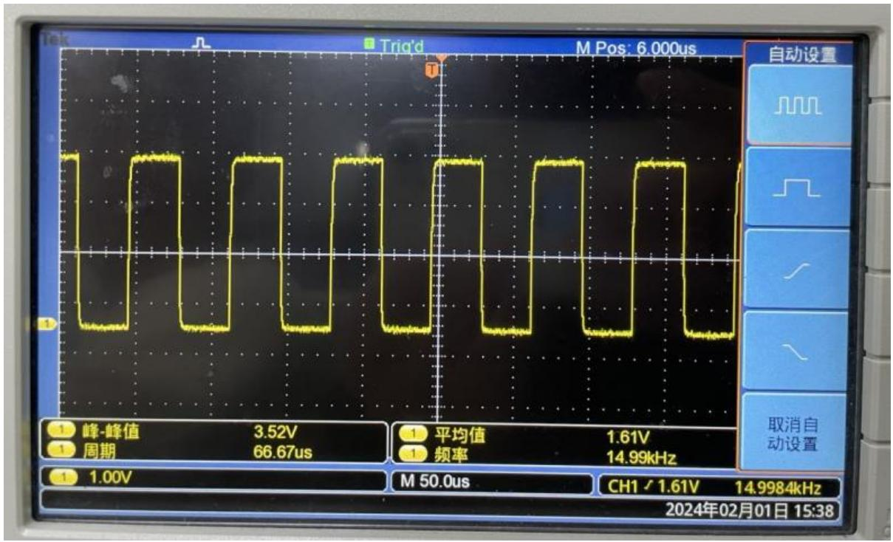


# 3.12.6. 40 pin CAN 的测试方法

# 3.12.6.1. CAN 引脚的说明

1) 开发板 40 pin 接口引脚的功能如下表所示，其中标红部分的引脚具有CAN功能。

<table><tr><td>GPIO序号</td><td>GPIO</td><td>功能</td><td>引脚</td></tr><tr><td></td><td></td><td>3.3V</td><td>1</td></tr><tr><td>76</td><td>GPIO2_12</td><td>SDA7</td><td>3</td></tr><tr><td>75</td><td>GPIO2_11</td><td>SCL7</td><td>5</td></tr><tr><td>226</td><td>GPIO7_02</td><td>UTXD7</td><td>7</td></tr><tr><td></td><td></td><td>GND</td><td>9</td></tr><tr><td>82</td><td>GPIO2_18</td><td></td><td>11</td></tr><tr><td>38</td><td>GPIO1_06</td><td></td><td>13</td></tr><tr><td>79</td><td>GPIO2_15</td><td></td><td>15</td></tr><tr><td></td><td></td><td>3.3V</td><td>17</td></tr><tr><td>91</td><td>GPIO2_27</td><td>SPI0_SDO</td><td>19</td></tr><tr><td>92</td><td>GPIO2_28</td><td>SPI0_SDI</td><td>21</td></tr><tr><td>89</td><td>GPIO2_25</td><td>SPI0_SCLK</td><td>23</td></tr></table>

<table><tr><td>引脚</td><td>功能</td><td>GPIO</td><td>GPIO序号</td></tr><tr><td>2</td><td>5V</td><td></td><td></td></tr><tr><td>4</td><td>5V</td><td></td><td></td></tr><tr><td>6</td><td>GND</td><td></td><td></td></tr><tr><td>8</td><td>UTXDO</td><td>GPIO0_14</td><td>14</td></tr><tr><td>10</td><td>URXDO</td><td>GPIO0_15</td><td>15</td></tr><tr><td>12</td><td></td><td>GPIO7_03</td><td>227</td></tr><tr><td>14</td><td>GND</td><td></td><td></td></tr><tr><td>16</td><td></td><td>GPIO2_16</td><td>80</td></tr><tr><td>18</td><td></td><td>GPIO0_25</td><td>25</td></tr><tr><td>20</td><td>GND</td><td></td><td></td></tr><tr><td>22</td><td></td><td>GPIO0_02</td><td>2</td></tr><tr><td>24</td><td>SPIO_CS</td><td>GPIO2_26GND</td><td>9025</td></tr><tr><td></td><td></td><td>SDA6</td><td>27</td></tr><tr><td>231</td><td>GPIO7_07</td><td>URXD7</td><td>29</td></tr><tr><td>84</td><td>GPIO2_20</td><td>CAN_TX2</td><td>31</td></tr><tr><td>128</td><td>GPIO4_00</td><td></td><td>33</td></tr><tr><td>228</td><td>GPIO7_04</td><td></td><td>35</td></tr><tr><td>3</td><td>GPIO0_03</td><td></td><td>37</td></tr><tr><td></td><td></td><td>GND</td><td>39</td></tr></table>

<table><tr><td>26</td><td>CAN_RX2</td><td>GPIO2_19</td><td>83</td></tr><tr><td>28</td><td>SCL6</td><td></td><td></td></tr><tr><td>30</td><td>GND</td><td></td><td></td></tr><tr><td>32</td><td>PWM3</td><td>GPIO1_01</td><td>33</td></tr><tr><td>34</td><td>GND</td><td></td><td></td></tr><tr><td>36</td><td></td><td>GPIO2_17</td><td>81</td></tr><tr><td>38</td><td></td><td>GPIO7_06</td><td>230</td></tr><tr><td>40</td><td></td><td>GPIO7_05</td><td>229</td></tr></table>

2) CAN2对应的引脚为：

<table><tr><td></td><td>CAN2</td></tr><tr><td>RX 引脚</td><td>对应 40pin 的 26 号引脚</td></tr><tr><td>TX 引脚</td><td>对应 40pin 的 31 号引脚</td></tr></table>

3) 进入 Linux 系统后，使用 sudo ifconfig -a 命令如果能看到 CAN2 的设备节点，就说明CAN2已正确打开了。

```txt
(base) HwHiAiUser@orangepiaipro:~$ sudo ifconfig -a
can2: flags=128<NOARP> mtu 16
unspec 00-00-00-00-00-00-00-00-00-00-00-00-00-00-00 txqueuelen 10 (UNSPEC)
RX packets 0 bytes 0 (0.0 B)
RX errors 0 dropped 0 overruns 0 frame 0
TX packets 0 bytes 0 (0.0 B)
TX errors 0 dropped 0 overruns 0 carrier 0 collisions 0 
```

# 3.12.6.2. 使用 CANalyst-II 分析仪测试 CAN 总线收发消息

1)测试使用的 CANalyst-II分析仪如下图所示：


2) CANalyst-II 分析仪资料下载链接。

https://www.zhcxgd.com/3.html 

3) 首先要安装 USB_CAN ToolSetup 这个软件。


4) USB_CAN ToolSetup 安装后的快捷方式为：


5) 另外还需要安装一下USB驱动程序。


6) CANalyst-II 分析仪的 USB 接口那端需要接到电脑的 USB 接口中。


7) 测试 CAN 功能还需要准备一个下图所示的 CAN 收发器，CAN收发器主要功能是将CAN控制器的TTL信号转换成CAN总线的差分信号。

a. CAN 收发器的 3.3V 引脚需要接开发板 40 pin 中的 3.3V 引脚。

b. CAN 收发器的 GND 引脚需要接开发板 40 pin 中的 GND 引脚。

c. CAN 收发器的 CAN TX 引脚需要接开发板 40 pin 中 CAN 总线的 TX 引脚。

d. CAN 收发器的 CAN RX 引脚需要接开发板 40 pin 中 CAN 总线的 RX 引脚。

e. CAN 收发器的CANH引脚需要接分析仪的H接口。

f. CAN 收发器的CANL 引脚需要接分析仪的 L接口。


# 8) 然后可以打开 USB-CAN 软件。

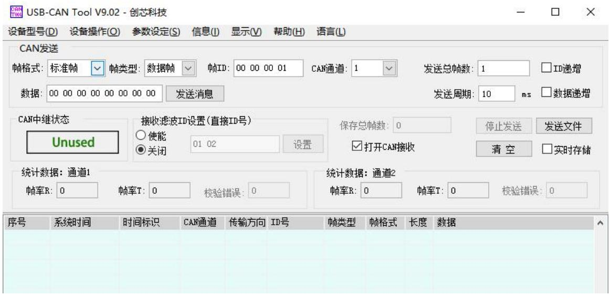


# 9) 然后点击启动设备。

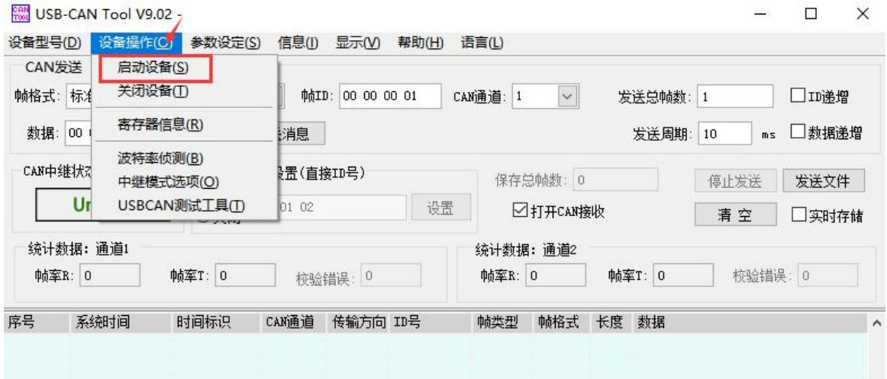


# 10) 然后点击确定。

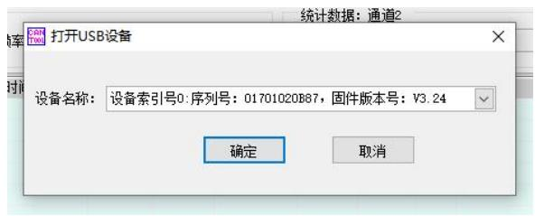


11) 再设置波特率为 1000k bps。

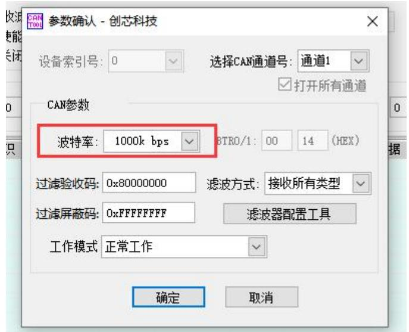


12) 成功打开后USB-CAN软件会显示序列号等信息。

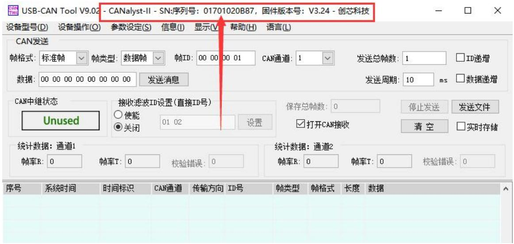


13) 然后安装下 can-utils 软件包。

(base) HwHiAiUser@orangepi:~$ sudo apt-get install -y can-utils 

如果Linux系统中无法使用包管理器来安装can-utils，那就只能通过源码来安装can-utils了。can-utils的源码链接如下所示：

```txt
https://github.com/linux-can/can-utils 
```

源码下载完后使用make && make install命令即可编译安装can-utils。

14)开发板接收 CAN消息测试。

a. 首先在开发板的 Linux 系统中设置下 CAN总线的波特率为 1000kbps。

```txt
(base) HwHiAiUser@orangepi:~$ sudo ip link set can2 down
(base) HwHiAiUser@orangepi:~$ sudo ip link set can2 type can bitrate 1000000
(base) HwHiAiUser@orangepi:~$ sudo ip link set can2 up 
```

b. 然后运行 candump can2 命令准备接收消息。

```txt
(base) HwHiAiUser@orangepi:~$ sudo candump can2 
```

c. 然后在USB-CAN软件中发送一个消息给开发板。

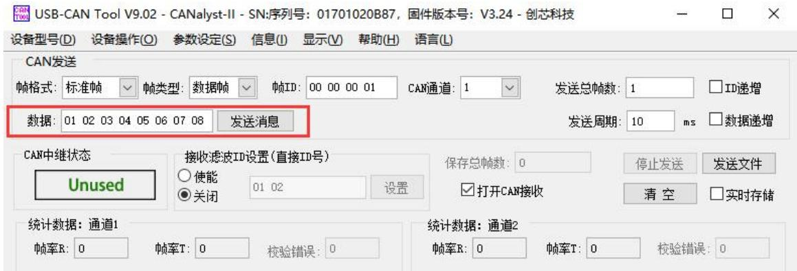


d. 如果开发板中可以接收到分析仪发送的消息说明CAN总线能正常使用。

```txt
(base) HwHiAiUser@orangepi:~$ sudo candump can2 can2 001 [8] 01 02 03 04 05 06 07 08 
```

15) 开发板发送 CAN消息测试。

a. 首先在 Linux 系统中设置下 CAN 的波特率为 1000kbps。

```txt
(base) HwHiAiUser@orangepi:~$ sudo ip link set can2 down
(base) HwHiAiUser@orangepi:~$ sudo ip link set can2 type can bitrate 1000000
(base) HwHiAiUser@orangepi:~$ sudo ip link set can2 up 
```

b. 再在开发板中执行cansend命令，发送一个消息。

```txt
(base) HwHiAiUser@orangepi:~$ sudo cansend can2 123#1122334455667788 
```

c. 如果 USB-CAN 软件可以接收到开发板发过来的消息说明通信成功。

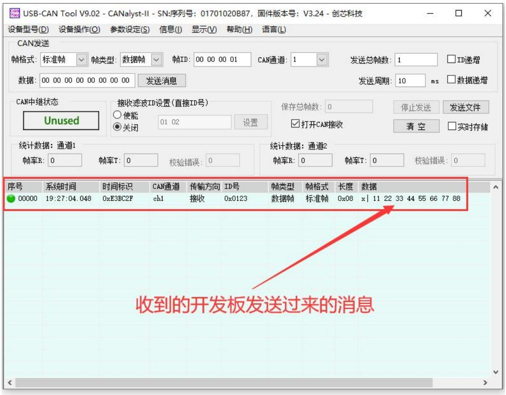


# 3.13. wiringOP 的安装使用方法

# 3.13.1. 安装 wiringOP 的方法

1) 安装 wiringOP 前，请先确保 Linux 系统中存在/etc/orangepi-release 这个配置文件，里面的内容为：BOARD=orangepiaipro-20t。

```txt
(base) HwHiAiUser@orangepi:~$ cat /etc/orangepi-release
BOARD=orangepiaipro-20t 
```

2) 如果 Linux 中没有/etc/orangepi-release 这个配置文件，可以使用下面的命令创建一个。

```shell
(base) HwHiAiUser@orangepi:~$ echo "BOARD=orangepiaipro-20t" | sudo tee /etc/orangepi-release 
```

3) 下载 wiringOP 的代码。

```shell
(base) HwHiAiUser@orangepi:~$ sudo apt-get update
(base) HwHiAiUser@orangepi:~$ sudo apt-get install -y git
(base) HwHiAiUser@orangepi:~$ git clone https://github.com/orangepi-xunlong/wiringOP.git -b next 
```

注意，源码需要下载 wiringOP next 分支的代码，请别漏了-b next这个参数。

4) 然后编译安装 wiringOP。

```txt
(base) HwHiAiUser@orangepi:~$ sudo apt-get install -y gcc make build-essential
(base) HwHiAiUser@orangepi:~$ cd wiringOP
(base) HwHiAiUser@orangepi:~/wiringOP$ sudo ./build clean
(base) HwHiAiUser@orangepi:~/wiringOP$ sudo ./build 
```

5) 测试 gpio readall 命令的输出如下：

<table><tr><td colspan="13">(base) HwHiAiUser@orangepi: $ gpio readall</td></tr><tr><td colspan="13">+----+----+----+----+----+----+----+----+----+----+----+----+----+----+----+----+----+----+----+----+----+----+----+----+----+----+----+----+----+----+----+----+----+----+----+----+----+----+----+----+----+----+----+----+----+----+----+----+----+----+</td></tr><tr><td colspan="13">| GPIO | wPi | Name | Mode | V | Physical | V | Mode | Name | wPi | GPIO |</td></tr><tr><td></td><td></td><td></td><td>3.3V</td><td></td><td></td><td>1 | 2</td><td></td><td></td><td>5V</td><td></td><td></td><td></td></tr><tr><td>76</td><td>0</td><td>SDA7</td><td>OFF</td><td>0</td><td>3 | 4</td><td></td><td></td><td></td><td>5V</td><td></td><td></td><td></td></tr><tr><td>75</td><td>1</td><td>SCL7</td><td>OFF</td><td>0</td><td>5 | 6</td><td></td><td></td><td></td><td>GND</td><td></td><td></td><td></td></tr><tr><td>226</td><td>2</td><td>GPIO7_02</td><td>OFF</td><td>0</td><td>7 | 8</td><td>0 | OFF</td><td></td><td></td><td>UTXD0</td><td>3</td><td>14</td><td></td></tr><tr><td></td><td></td><td>GND</td><td></td><td></td><td>9 | 10</td><td>0 | OFF</td><td></td><td></td><td>URXD0</td><td>4</td><td>15</td><td></td></tr><tr><td>82</td><td>5</td><td>GPIO2_18</td><td>OFF</td><td>0</td><td>11 | 12</td><td>0 | OFF</td><td></td><td></td><td>GPIO7_03</td><td>6</td><td>227</td><td></td></tr><tr><td>38</td><td>7</td><td>GPIO1_06</td><td>IN</td><td>1</td><td>13 | 14</td><td></td><td></td><td></td><td>GND</td><td></td><td></td><td></td></tr><tr><td>79</td><td>8</td><td>GPIO2_15</td><td>IN</td><td>1</td><td>15 | 16</td><td>1 | IN</td><td></td><td></td><td>GPIO2_16</td><td>9</td><td>80</td><td></td></tr><tr><td></td><td></td><td>3.3V</td><td></td><td></td><td>17 | 18</td><td>1 | IN</td><td></td><td></td><td>GPIO0_25</td><td>10</td><td>25</td><td></td></tr><tr><td>91</td><td>11</td><td>SPI0_SD0</td><td>OFF</td><td>0</td><td>19 | 20</td><td></td><td></td><td></td><td>GND</td><td></td><td></td><td></td></tr><tr><td>92</td><td>12</td><td>SPI0_SDI</td><td>OFF</td><td>0</td><td>21 | 22</td><td>1 | IN</td><td></td><td></td><td>GPIO0_02</td><td>13</td><td>2</td><td></td></tr><tr><td>89</td><td>14</td><td>SPI0_CLK</td><td>OFF</td><td>0</td><td>23 | 24</td><td>0 | OFF</td><td></td><td></td><td>SPI0_CS</td><td>15</td><td>90</td><td></td></tr><tr><td></td><td></td><td>GND</td><td></td><td></td><td>25 | 26</td><td>1 | IN</td><td></td><td></td><td>GPIO2_19</td><td>16</td><td>83</td><td></td></tr><tr><td></td><td></td><td>SDA6</td><td></td><td></td><td>27 | 28</td><td></td><td></td><td></td><td>SCL6</td><td></td><td></td><td></td></tr><tr><td>231</td><td>17</td><td>URXD7</td><td>OFF</td><td>0</td><td>29 | 30</td><td></td><td></td><td></td><td>GND</td><td></td><td></td><td></td></tr><tr><td>84</td><td>18</td><td>GPIO2_20</td><td>IN</td><td>1</td><td>31 | 32</td><td>1 | IN</td><td></td><td></td><td>PWM3</td><td>19</td><td>33</td><td></td></tr><tr><td>128</td><td>20</td><td>GPIO4_00</td><td>IN</td><td>1</td><td>33 | 34</td><td></td><td></td><td></td><td>GND</td><td></td><td></td><td></td></tr><tr><td>228</td><td>21</td><td>GPIO7_04</td><td>OFF</td><td>0</td><td>35 | 36</td><td>0 | OFF</td><td></td><td></td><td>GPIO2_17</td><td>22</td><td>81</td><td></td></tr><tr><td>3</td><td>23</td><td>GPIO0_03</td><td>IN</td><td>1</td><td>37 | 38</td><td>1 | IN</td><td></td><td></td><td>GPIO7_06</td><td>24</td><td>230</td><td></td></tr><tr><td></td><td></td><td>GND</td><td></td><td></td><td>39 | 40</td><td>0 | OFF</td><td></td><td></td><td>GPIO7_05</td><td>25</td><td>229</td><td></td></tr><tr><td>+----+----+----+----+----+----+----+----+----+----+----+----+----+----+----+----+----+----+----+----+----+----+----+----+----+----+----+----+----+----+----+----+----+----+----+----+----+----+----+----+----+----+----+----+----+----+----+---- +----+----+----+----+----+----+----+----+----+----+----+----+----+----+----+----+----+----+----+----+----+----+----+----+----+----+----+----+----+----+----+----+----+----+----+----+----+----+----+----+----+----+----+----+----+----+----+----+----+---- +----+ --+-+-+-+-+-+-+-+-+-+-+-+-+-+-+-+-+-+-+-+-+-+-+-+-+-+-+-+-+-+-+-+-+-+-+-+-+-+-+-+-+-+-+-+-+-+-+-+-+-+-+-+-+-+-+-+-+-+-+-+-+-+-+-+-+-+-+-+-+-+-+-+-+-+-+-+-+-+-+-+-+-+-+-+-+-+-+-+-+-+-+-+-+-+-+-+-+-+-+-+---+-+-+-+-+-+-+-+-+-+-+-+-+-+-+-+-+-+-+-+-+-+-+-+-+-+-+-+-+-+-+-+-+-+-+-+-+-+-+-+-+-+-+-+-+-+-+-+-+-+-+-+-+-+-+-+-+-+-+-+-+-+-+-+-+-+-+-+-+-+-+-+-+-+-+-+-+-+-+-+-+-+-+-+-+-+-+-+-+-+-+-+-+-+-+-+-+-+-+-++ --+-+-+-+-+-+-+-+-+-+-+-+-+-+-+-+-+-+-+-+-+-+-+-+-+-+-+-+-+-+-+-+-+-+-+-+-+-+-+-+-+-+-+-+-+-+-+-+-+-+-+-+-+-+-+-+-+-+-+-+-+-+-+-+-+-+-+-+-+-+-+-+-+-+-+-+-+-+-+-+-+-+-+-+-+-+-+-+-+-+-+-+-+-+-+-+-+-+---++ --+-+-+-+-+-+-+-+-+-+-+-+-+-+-+-+-+-+-+-+-+-+-+-+-+-+-+-+-+-+-+-+-+-+-+-+-+-+-+-+-+-+-+-+-+-+-+-+-+-+-+-+-+-+-+-+-+-+-+-+-+-+-+-+-+-+-+-+-+-+-+-+-+-+-+-+-+-+-+-+-+-+-+-+-+-+-+-+-+-+-+-+-+-+-+-+-+---++ +----+----+----+----+----+----+----+----+----+----+----+----+----+----+----+----+----+----+----+----+----+----+----+----+----+----+----+----+----+----+----+----+----+----+----+----+----+----+----+----+----+----+----+----+----+----+----+----+----+--- +---- +---- +---- +---- +---- +---- +---- +---- +---- +---- +---- +---- +---- +---- +---- +---- +---- +---- +---- +---- +---- +---- +---- +---- +---- +---- +---- +---- +---- +---- +---- +---- +---- +---- +---- +---- +---- +---- +---- +---- +---- +---- +---- +---- +---- +---- +---- +---- +---- +---- + -- -- +---- +---- +---- +---- +---- +---- +---- +---- +---- +---- +---- +---- +---- +---- +---- +---- +---- +---- +---- +---- +---- +---- +---- +---- +---- +---- +---- +---- +---- +---- +---- +---- +---- +---- +---- +---- +---- +---- +---- +---- +---- +---- +---- +---- +---- +---- +---- +---- +---- +-- -- +---- +---- +---- +---- +---- +---- +---- +---- +---- +---- +---- +---- +---- +---- +---- +---- +---- +---- +---- +---- +---- +---- +---- +---- +---- +---- +---- +---- +---- +---- +---- +---- +---- +---- +---- +---- +---- +---- +---- +---- +---- +---- +---- +---- +---- +---- +---- +---- +----</td><td></td><td></td><td></td><td></td><td></td><td></td><td></td><td></td><td></td><td></td><td></td><td></td></tr></table>

# 3.13.2. 使用 wiringOP 控制 40pin GPIO 的方法

1) 下面以 7 号引脚——对应 GPIO 为 GPIO7_02——对应 wPi 序号为 2——为例演示如何设置GPIO口的方向和高低电平。

<table><tr><td colspan="12">(base) HwHiAiUser@orangepi:~/wiringOF$ gpio readall</td></tr><tr><td colspan="12">+----+----+----+----+----+----+----+----+----+----+----+----+----+----+----+----+----+----+----+----+----+----+----+----+----+----+----+----+----+----+----+----+----+----+----+----+----+----+----+----+----+----+----+----+----+----+----+----+----+----+</td></tr><tr><td>GPIO</td><td>wPi</td><td>Name</td><td>Mode</td><td>V</td><td>Physical</td><td>V</td><td>Mode</td><td>Name</td><td>wPi</td><td>GPIO</td><td></td></tr><tr><td></td><td></td><td>3.3V</td><td></td><td></td><td>1</td><td>2</td><td></td><td>5V</td><td></td><td></td><td></td></tr><tr><td>76</td><td>0</td><td>SDA7</td><td>OFF</td><td>0</td><td>3</td><td>4</td><td></td><td>5V</td><td></td><td></td><td></td></tr><tr><td>75</td><td>1</td><td>SCL7</td><td>OFF</td><td>0</td><td>5</td><td>6</td><td></td><td>GND</td><td></td><td></td><td></td></tr><tr><td>226</td><td>2</td><td>GPIO7_02</td><td>OFF</td><td>0</td><td>7</td><td>8</td><td>0</td><td>OFF</td><td>UTXD0</td><td>3</td><td>14</td></tr><tr><td></td><td></td><td>GND</td><td></td><td></td><td>9</td><td>10</td><td>0</td><td>OFF</td><td>URXD0</td><td>4</td><td>15</td></tr><tr><td>82</td><td>5</td><td>GPIO2_18</td><td>OFF</td><td>0</td><td>11</td><td>12</td><td>0</td><td>OFF</td><td>GPIO7_03</td><td>6</td><td>227</td></tr><tr><td>38</td><td>7</td><td>GPIO1_06</td><td>IN</td><td>1</td><td>13</td><td>14</td><td></td><td></td><td>GND</td><td></td><td></td></tr><tr><td>79</td><td>8</td><td>GPIO2_15</td><td>IN</td><td>1</td><td>15</td><td>16</td><td>1</td><td>IN</td><td>GPIO2_16</td><td>9</td><td>80</td></tr></table>

2) 首先设置 GPIO 口为输出模式，其中第三个参数需要输入引脚对应的 wPi的序号。

```txt
(base) HwHiAiUser@orangepi:~$ gpio mode 2 out 
```

3)然后使用下面的命令可以查看下 GPIO当前的模式，可以看到当前的模式为输出— OUT。命令中第二个参数需要输入引脚对应的wPi的序号。

```txt
(base) HwHiAiUser@orangepi:~$ gpio qmode 2
OUT 
```

4) 然后就可以开始设置引脚输出高低电平了。比如使用下面的命令可以设置 GPIO口输出低电平，设置完后可以使用万用表测量下引脚的电压的数值，如果为 0v，说明设置低电平成功。

```txt
(base) HwHiAiUser@orangepi:~$ gpio write 2 0 
```

5) 除了使用万用表测量引脚的电压外，还可以使用 gpio read 命令查看引脚的高低电平状态。当前命令输出为 0，说明引脚目前为低电平。

```txt
(base) HwHiAiUser@orangepi:~$ gpio read 2
0 
```

6) 然后可以设置 GPIO 口输出高电平，设置完后可以使用万用表测量引脚的电压的数值，如果为3.3v，说明设置高电平成功。

```txt
(base) HwHiAiUser@orangepi:~$ gpio write 2 1 
```

7) 除了使用万用表测量引脚的电压外，还可以使用 gpio read 命令查看引脚的高低电平状态。当前命令输出为 1，说明引脚目前为高电平。

```txt
(base) HwHiAiUser@orangepi:~$ gpio read 2
1 
```

8) 另外使用 gpio readall 命令也可以查看 GPIO 当前的设置情况。

<table><tr><td colspan="15">+----+----+----+----+----+----+----+----+----+----+----+----+----+----+----+----+----+----+----+----+----+----+----+----+----+----+----+----+----+----+----+----+----+----+----+----+----+----+----+----+----+----+----+----+----+----+----+----+----+----+</td></tr><tr><td>GPIO</td><td>wPi</td><td>Name</td><td>Mode</td><td>V</td><td colspan="3">AI PRO Physical</td><td>V</td><td>Mode</td><td>Name</td><td>wPi</td><td>GPIO</td><td></td><td></td></tr><tr><td></td><td></td><td>3.3V</td><td></td><td></td><td>1</td><td>2</td><td></td><td></td><td></td><td>5V</td><td></td><td></td><td></td><td></td></tr><tr><td>76</td><td>0</td><td>SDA7</td><td>OFF</td><td>0</td><td>3</td><td>4</td><td></td><td></td><td></td><td>5V</td><td></td><td></td><td></td><td></td></tr><tr><td>75</td><td>1</td><td>SCL7</td><td>OFF</td><td>0</td><td>5</td><td>6</td><td></td><td></td><td></td><td>GND</td><td></td><td></td><td></td><td></td></tr><tr><td>226</td><td>2</td><td>GPIO7_02</td><td>OUT</td><td>1</td><td>7</td><td>8</td><td>0</td><td>OFF</td><td></td><td>UTXD0</td><td>3</td><td>14</td><td></td><td></td></tr><tr><td></td><td></td><td>GND</td><td></td><td></td><td>9</td><td>10</td><td>0</td><td>OFF</td><td></td><td>URXD0</td><td>4</td><td>15</td><td></td><td></td></tr><tr><td>82</td><td>5</td><td>GPIO2_18</td><td>OFF</td><td>0</td><td>11</td><td>12</td><td>0</td><td>OFF</td><td></td><td>GPIO7_03</td><td>6</td><td>227</td><td></td><td></td></tr><tr><td>38</td><td>7</td><td>GPIO1_06</td><td>IN</td><td>1</td><td>13</td><td>14</td><td></td><td></td><td></td><td>GND</td><td></td><td></td><td></td><td></td></tr><tr><td>79</td><td>8</td><td>GPIO2_15</td><td>IN</td><td>1</td><td>15</td><td>16</td><td>1</td><td>IN</td><td></td><td>GPIO2_16</td><td>9</td><td>80</td><td></td><td></td></tr></table>

9)使用下面的命令可以将 GPIO口设置为输入模式，其中第三个参数需要输入引脚对应的wPi的序号。

```txt
(base) HwHiAiUser@orangepi:~$ gpio mode 2 in 
```

10) 将 GPIO 口设置为输入模式后，当将 GPIO 口用杜邦线连接到 GND引脚后，使用 gpio read 命令可以看到 GPIO 口的输入值会为 0。

```txt
(base) HwHiAiUser@orangepi:~$ gpio read 2
0 
```

11) 将 GPIO 口设置为输入模式后，当将 GPIO 口用杜邦线连接到 3.3v引脚后，使用gpioread 命令可以看到GPIO口的输入值会为1。

```txt
(base) HwHiAiUser@orangepi:~$ gpio read 2
1 
```

12)其他引脚的设置方法类似，只需修改wPi的序号为引脚对应的序号即可。

# 3.14. wiringOP 硬件 PWM 的使用方法

使用 wiringOP 操作 PWM 前，请确保 Linux 系统已经安装了 wiringOP。如果gpioreadall命令能正常使用，说明 wiringOP已经安装了。如果提示找不到命令，请参考 wiringOP 的安装使用方法一小节的说明先安装下 wiringOP。

开发板 40pin 接口中可以使用 PWM3 这路PWM，引脚的位置如下图所示：

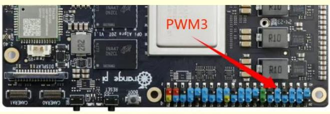


# 3.14.1. 使用 wiringOP 的 gpio 命令设置 PWM 的方法

# 3.14.1.1. 设置对应引脚为 PWM模式的方法

1) 开发板 40 pin 接口引脚的功能如下表所示，其中标红部分的引脚具有pwm功能。

<table><tr><td>GPIO序号</td><td>GPIO</td><td>功能</td><td>引脚</td></tr><tr><td></td><td></td><td>3.3V</td><td>1</td></tr><tr><td>76</td><td>GPIO2_12</td><td>SDA7</td><td>3</td></tr><tr><td>75</td><td>GPIO2_11</td><td>SCL7</td><td>5</td></tr><tr><td>226</td><td>GPIO7_02</td><td>UTXD7</td><td>7</td></tr><tr><td></td><td></td><td>GND</td><td>9</td></tr><tr><td>82</td><td>GPIO2_18</td><td>URXD2</td><td>11</td></tr><tr><td>38</td><td>GPIO1_06</td><td></td><td>13</td></tr><tr><td>79</td><td>GPIO2_15</td><td></td><td>15</td></tr><tr><td></td><td></td><td>3.3V</td><td>17</td></tr><tr><td>91</td><td>GPIO2_27</td><td>SPI0_SDO</td><td>19</td></tr><tr><td>92</td><td>GPIO2_28</td><td>SPI0_SDI</td><td>21</td></tr><tr><td>89</td><td>GPIO2_25</td><td>SPI0_SCLK</td><td>23</td></tr><tr><td></td><td></td><td>GND</td><td>25</td></tr><tr><td></td><td></td><td>SDA6</td><td>27</td></tr><tr><td>231</td><td>GPIO7_07</td><td>URXD7</td><td>29</td></tr><tr><td>84</td><td>GPIO2_20</td><td>CAN_TX2</td><td>31</td></tr><tr><td>128</td><td>GPIO4_00</td><td></td><td>33</td></tr><tr><td>228</td><td>GPIO7_04</td><td></td><td>35</td></tr><tr><td>3</td><td>GPIO0_03</td><td></td><td>37</td></tr><tr><td></td><td></td><td>GND</td><td>39</td></tr></table>

<table><tr><td>引脚</td><td>功能</td><td>GPIO</td><td>GPIO序号</td></tr><tr><td>2</td><td>5V</td><td></td><td></td></tr><tr><td>4</td><td>5V</td><td></td><td></td></tr><tr><td>6</td><td>GND</td><td></td><td></td></tr><tr><td>8</td><td>UTXD0</td><td>GPIO0_14</td><td>14</td></tr><tr><td>10</td><td>URXD0</td><td>GPIO0_15</td><td>15</td></tr><tr><td>12</td><td></td><td>GPIO7_03</td><td>227</td></tr><tr><td>14</td><td>GND</td><td></td><td></td></tr><tr><td>16</td><td></td><td>GPIO2_16</td><td>80</td></tr><tr><td>18</td><td></td><td>GPIO0_25</td><td>25</td></tr><tr><td>20</td><td>GND</td><td></td><td></td></tr><tr><td>22</td><td></td><td>GPIO0_02</td><td>2</td></tr><tr><td>24</td><td>SPI0_CS</td><td>GPIO2_26</td><td>90</td></tr><tr><td>26</td><td>CAN_RX2</td><td>GPIO2_19</td><td>83</td></tr><tr><td>28</td><td>SCL6</td><td></td><td></td></tr><tr><td>30</td><td>GND</td><td></td><td></td></tr><tr><td>32</td><td>PWM3</td><td>GPIO1_01</td><td>33</td></tr><tr><td>34</td><td>GND</td><td></td><td></td></tr><tr><td>36</td><td>UTXD2</td><td>GPIO2_17</td><td>81</td></tr><tr><td>38</td><td></td><td>GPIO7_06</td><td>230</td></tr><tr><td>40</td><td></td><td>GPIO7_05</td><td>229</td></tr></table>

2) 开发板 40Pin 中 PWM引脚与 wPi 序号对应关系如下表所示：

<table><tr><td>PWM 引脚</td><td>wPi 序号</td></tr><tr><td>PWM3</td><td>19</td></tr></table>

3)设置引脚为 PWM模式的命令如下，其中第三个参数需要输入 PWM引脚对应的wPi的序号。

```txt
(base) HwHiAiUser@orangepi:~$ gpio mode 19 pwm 
```

4) 引脚设置为 PWM 模式后，默认会输出一个频率为 1kHz，周期为 1ms，占空比为50%的方波，此时，我们使用示波器测量PWM3引脚，就可以看到下面的波形。

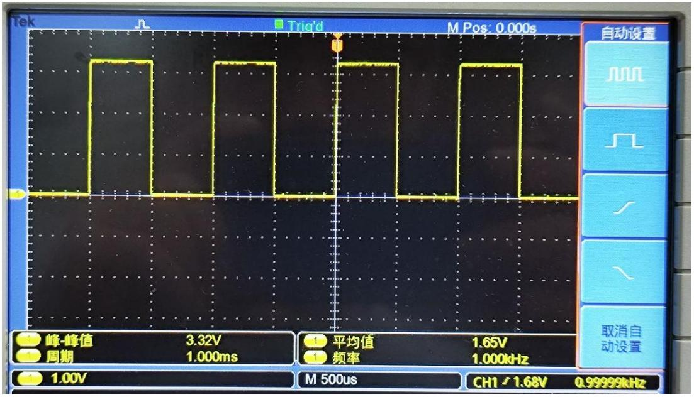


5) 然后使用 gpio qmode 19 命令可以看到 PWM3 引脚的模式设置为了 PWM。

```txt
(base) HwHiAiUser@orangepi:~$ gpio qmode 19 PWM 
```

# 3.14.1.2. 直接设置 PWM 频率的方法

# 设置 PWM 的频率前，请先确保对应的引脚已设置为了 PWM模式。

1)我们可以使用 gpio pwmTone命令来设置 PWM引脚的频率，比如使用下面的命令可以设置 PWM 的频率为 5000Hz。设置频率的同时，gpio pwmTone命令还会将占空比设置为 50%。另外需要注意的是，PWM 频率可以设置的范围为：1 ~32000hz，不在这个范围内的频率值会报错。

```txt
(base) HwHiAiUser@orangepi:~$ gpio pwmTone 19 5000 
```

2) 然后通过示波器可以观察到 PWM 频率变为5000Hz，并且占空比为50%。

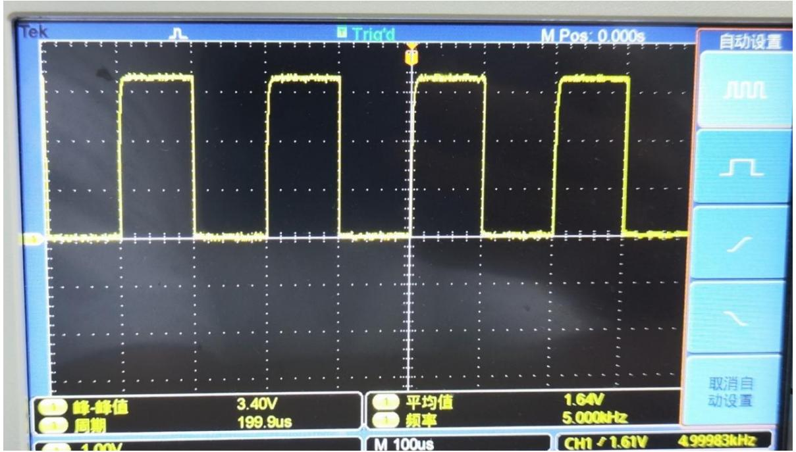


# 3.14.1.3. 通过脉冲周期寄存器设置 PWM周期的方法

1)PWM3脉冲周期寄存器— —PWM_PRD3的说明如下所示：

<table><tr><td rowspan="2">PWM_PRD3</td><td rowspan="2">3通道脉冲周期寄存器</td><td rowspan="2">0x2C</td><td rowspan="2">32</td><td rowspan="2">0x0FFFFFFF</td><td>reserved</td><td>31:28</td><td>-</td><td>0x0</td><td>保留</td></tr><tr><td>pwm_prd3</td><td>27:0</td><td>RW</td><td>0xFFFFFFF</td><td>通道3输出PWM信号的周期</td></tr></table>

2)PWM使用的APB 总线时钟为 150MHz，并且此时钟不能分频（所以不支持通过pwmc 命令来修改时钟频率）。PWM输出波形周期的计算公式如下所示：

$\mathbf { P W M } \mathbf { \# } \mathbf { \# } \mathbf { \# } \mathbf { \# } \mathbf { \# } \mathbf { \# } = \mathbf { P W M } \mathbf { \# } \mathbf { P R D 3 } \mathbf { \# } \mathbf { \# } \mathbf { \# } \mathbf { \# } \mathbf { \# } \mathbf { \# } \mathbf { \# } \mathbf { \# } \mathbf { \# } \mathbf { \# } \mathbf { \# } \mathbf { \# } \mathbf { \# } \mathbf { \# } \mathbf { \# } \mathbf { \# } \mathbf { \# } \mathbf { \# } \mathbf { \# } \mathbf { \# } \mathbf { \# } \mathbf { \# } \mathbf { \# } \mathbf { \# } \mathbf { \# } \mathbf { \# } \mathbf { \# } \mathbf { \# } \mathbf { \# } \mathbf { \# } \mathbf { \# } \mathbf { \# } \mathbf { \# } \mathbf { \# } \mathbf { \# } \mathbf { \# } \mathbf { \# } \mathbf { \# } \mathbf { \# } \mathbf { \# } \mathbf { \# } \mathbf { \# } \mathbf { \# } \mathbf { \# } \mathbf { \# } \mathbf { \# } \mathbf { \# } \mathbf { \# } \mathbf { \# } \mathbf { \# } \mathbf { \# } \mathbf { \# } \mathbf { \# } \mathbf { \# } \mathbf { \# } \mathbf { \# } \mathbf { \# } \mathbf { \# } \mathbf { \# } \mathbf { \# } \mathbf { \# } \mathbf { \# } \mathbf { \# } \mathbf { \# } \mathbf { \# } \mathbf { \# } \mathbf { \# } \mathbf { \# } \mathbf { \# } \mathbf { \# } \mathbf { \# } \mathbf { \# } \mathbf { \# } \mathbf { \# } \mathbf { \# } \mathbf { \# } \mathbf { \# } \mathbf { \# } \mathbf { \# } \mathbf { \# } \mathbf { \# } \mathbf { \# } \mathbf { \# } \mathbf { \# } \mathbf { \# } \mathbf { \# } \mathbf { \# } \mathbf { \# } \mathbf { \# } \mathbf { \# } \mathbf { \# } \mathbf { \# } \mathbf { \# } \mathbf { \# } \mathbf { \# } \mathbf { \# } \mathbf { \# } \mathbf { \# } \mathbf { \# } \mathbf { \# } \mathbf { \# } \mathbf { \# } \mathbf { \# } \mathbf { \# } \mathbf  \#$ 

$\mathbf { P W M \_ P R D 3 } \not \exists \not \exists \not \exists \not \exists \not \exists \not \exists \not \in \mathbb { H } \not \exists \not \exists \not \exists \not \exists \ X \ 1 5 0 \ : \ ( \mathbf { P W M \ E q } ) \not \exists \not \exists \not \exists \not \exists \ X \ 2 \not \in \not \exists \not \exists \ X \ 2 \not \in \not \exists \ X \ \mathrm { u s } )$ 

3) gpio pwmr 命令可以用来设置脉冲周期寄存器的值，比如要设置 PWM输出波形的周期为 1000us，通过上面的公式可以知道 PWM_PRD3寄存器的值需要设置为150000。

(base) HwHiAiUser@orangepi:~$ gpio pwmr 19 150000 

由于 PWM 频率的值建议在 1 ~ 32000hz 之间，所以 PWM_PRD3 寄存器的取值范围为：4688 ~ 150000000。

4) 设置完后可以通过示波器看到 PWM 的波形如下所示，显示周期为 1ms，也就是1000us。

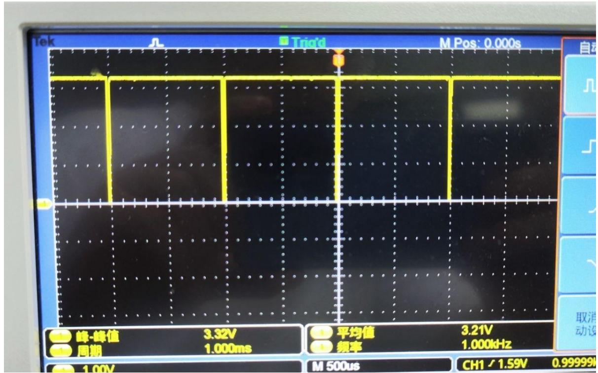


5)已知周期就可以算出频率，所以此命令也可以用来设置 PWM输出波形的频率。但此命令只会修改脉冲周期寄存器，不会将占空比设置为50%。

# 3.14.1.4. 调节 PWM 占空比的方法

1) gpio pwm 命令可以设置 PWM 的占空比。gpio pwm命令的使用方法如下所示：

a. pin 需要填写 pwm 引脚对应的 wPi 序号。

b. value需要填写高电平占用的周期值。占空比 = value / 脉冲周期寄存器的值。比如脉冲周期寄存器设置为 150000，如果需要设置占空比为 50%，则value 需要设置为 75000。另外请注意，value 值最大为：脉冲周期寄存器的值 - 1。

```txt
Usage: gpio pwm <pin> <value> 
```

2) 设置PWM占空比的示例。

a. 首先设置脉冲周期寄存器，比如先使用下面的命令将其设置为150000。

```txt
(base) HwHiAiUser@orangepi:~$ gpio pwmr 19 150000 
```

b. 然后使用下面的命令可以将占空比设置为25%。

```txt
(base) HwHiAiUser@orangepi:~$ gpio pwm 19 37500 
```

3) 运行上面的命令后，通过示波器可以观察到PWM占空比会变为25%。

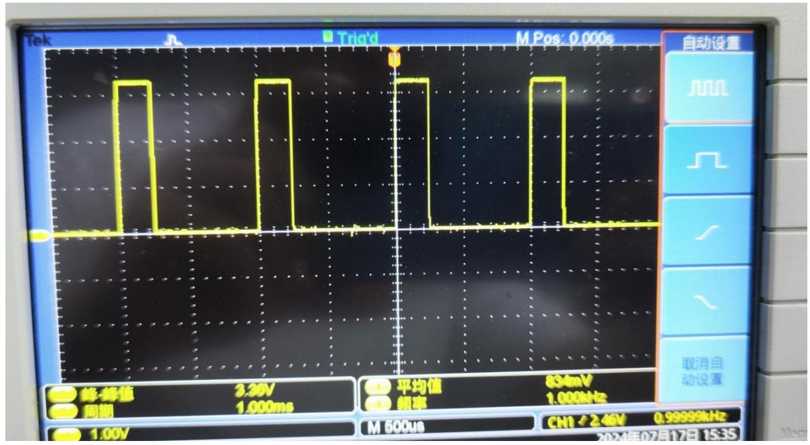


# 3.14.2. PWM 测试程序的使用方法

1) 除了使用gpio 命令来控制PWM 外，还可以在C 语言程序中调用PWM相关的API 来控制 PWM 的波形。在 wiringOP 的 example 目录下，有一个名为 pwm.c 的程序，此程序演示了使用 wiringOP 中PWM相关的API 来操作PWM的方法。

```txt
(base) HwHiAiUser@orangepi:~$ cd wiringOP
(base) HwHiAiUser@orangepi:~/wiringOP$ cd examples
(base) HwHiAiUser@orangepi:~/wiringOP/examples$ ls pwm.c
pwm.c 
```

2) 编译pwm.c 为可执行程序的命令如下所示：

```txt
(base) HwHiAiUser@orangepi:~/wiringOP/examples$ gcc -o pwm pwm.c -lwiringPi 
```

3)然后就可以执行PWM测试程序了，在执行PWM测试程序时，需要指定PWM引脚对应的wPi序号，比如可以使用下面的命令对PWM3引脚进行测试：

sorangepi@orangepi:/usr/src/wiringOP/examples$ sudo ./pwm 19 

4) pwm 程序执行后会对以下内容依次进行测试：

a. 通过设置 ARR，即脉冲周期寄存器，来调节PWM占空比。

b. 通过设置 CCR，即高电平占用的周期数，来调节PWM占空比。

c. 直接设置PWM频率。

5) 每完成一项测试后，pwm 测试程序会保持最后的 pwm波形5秒钟，在完成所有测试内容后，会重新开始新一轮测试。

6) PWM测试程序的详细执行过程如下所示：

a. 通过设置 ARR 调节 PWM 占空比：通过示波器可以观察到 PWM波形每隔0.5秒产生变化，在变化了 8次后，PWM占空比从 50%变为 75%，保持 5秒，然后 PWM波形每隔 0.5秒产生变化，在变化了 8次后，PWM占空比从75%变为50%，保持5秒。

b. 通过设置 CCR 调节 PWM 占空比：通过示波器可以观察到 PWM波形每隔0.5秒产生变化，在变化了 8次后，PWM占空比从 50%变为 100%，保持 5秒，然后 PWM 波形每隔 0.5 秒产生变化，在变化了 8次后，PWM占空比从 100%变为 50%，保持 5秒。

c. 直接设置 PWM 频率：通过示波器可以观察到 PWM频率首先变为2000Hz，然后每隔两秒 PWM频率增加 2000Hz，在变化了 9次后，PWM频率变为20000Hz，保持 5 秒。

# 3.15. wiringOP-Python 的安装使用方法

wiringOP-Python 是 wiringOP 的 Python 语言版本的库，用于在 Python 程序中操作开发板的 GPIO、I2C、SPI 和UART等硬件资源。

另外请注意下面命令是在 root 用户下操作的。

在安装 wiringOP-Python 前，请确保 Linux 系统已经安装了 wiringOP。如果gpio readall 命令能正常使用，说明 wiringOP 已经安装了。如果提示找不到命令，请参考 wiringOP 的安装使用方法一小节的说明先安装下 wiringOP。

# 3.15.1. wiringOP-Python 的安装方法

1)首先安装依赖包。

```lisp
(base) root@orangepi:~# apt-get update
(base) root@orangepi:~# apt-get -y install git swig python3-dev python3-setuptools 
```

```txt
注意，如果使用的是 openEuler 系统，请使用以下命令安装依赖包。
-sh-5.1# dnf update
-sh-5.1# dnf install -y git swig python3-devel python3-setuptools
```

2) 然后使用下面的命令下载 wiringOP-Python 的源码。

注意，下面的 git clone--recursive 命令会自动下载 wiringOP 的源码，因为wiringOP-Python 是依赖 wiringOP 的。请确保下载过程没有因为网络问题而报错。

```txt
(base) root@orangepi:~# git clone --recursive https://github.com/orangepi-xunlong/wiringOP-Python -b next
(base) root@orangepi:~# cd wiringOP-Python
(base) root@orangepi:~/wiringOP-Python# git submodule update --init --remote 
```

3) 然后使用下面的命令编译 wiringOP-Python 并将其安装到开发板的 Linux系统中。

```txt
(base) root@orangepi:~/wiringOP-Python# python3 generate-bindings.py > bindings.i
(base) root@orangepi:~/wiringOP-Python# python3 setup.py install 
```

4)然后输入下面的命令，如果有帮助信息输出，说明 wiringOP-Python安装成功，按下q键可以退出帮助信息的界面。

```txt
(base) root@orangepi:~/wiringOP-Python# python3 -c "import wiringpi; help(wiringpi)"
Help on module wiringpi: 
```

```txt
NAME
wiringpi 
```


DESCRIPTION


```txt
# This file was automatically generated by SWIG (http://www.swig.org).
# Version 4.0.2
#
# Do not make changes to this file unless you know what you are doing--modify
# the SWIG interface file instead. 
```

5) 在 python 命令行下测试 wiringOP-Python 是否安装成功的步骤如下所示：

a. 首先使用 python3 命令进入 python3 的命令行模式。

```objectivec
(base) root@orangepi:~# python3 
```

b. 然后导入 wiringpi 的 python 模块。

```txt
>>> import wiringpi; 
```

c. 最后输入下面的命令可以查看下 wiringOP-Python 的帮助信息，按下 q 键可以退出帮助信息的界面。

```txt
>>> help(wiringpi) 
```

Help on module wiringpi: 

```txt
NAME 
```

```txt
wiringpi 
```

```txt
DESCRIPTION 
```

```txt
# This file was automatically generated by SWIG (http://www.swig.org).
# Version 4.0.2
#
# Do not make changes to this file unless you know what you are doing--modify
# the SWIG interface file instead. 
```

```txt
CLASSES 
```

```txt
builtins.object
    GPIO
    I2C
    Serial
    nes

class GPIO(builtins.object)
| GPIO(pinmode=0)
| 
```

# 3.15.2. 40pin GPIO 口测试

wiringOP-Python 跟 wiringOP 一样，也是可以通过指定 wPi 号来确定操作哪一个 GPIO 引脚，因为 wiringOP-Python 中没有查看 wPi 号的命令，所以只能通过 wiringOP 中的 gpio 命令来查看板子 wPi 号与物理引脚的对应关系。

<table><tr><td colspan="13">(base) HwHiAiUser@orangepi: $ gpio readall</td></tr><tr><td colspan="13">+----+----+----+----+----+----+----+----+----+----+----+----+----+----+----+----+----+----+----+----+----+----+----+----+----+----+----+----+----+----+----+----+----+----+----+----+----+----+----+----+----+----+----+----+----+----+----+----+----+----+</td></tr><tr><td colspan="13">| GPIO | wPi | Name | Mode | V | Physical | V | Mode | Name | wPi | GPIO |</td></tr><tr><td>|</td><td>|</td><td>3.3V |</td><td></td><td></td><td>1 | 2 |</td><td></td><td></td><td>5V</td><td></td><td></td><td></td><td></td></tr><tr><td>76 | 0 | SDA7 | OFF | 0 | 3 | 4 |</td><td></td><td></td><td></td><td></td><td></td><td></td><td></td><td>5V</td><td></td><td></td><td></td><td></td></tr><tr><td>75 | 1 | SCL7 | OFF | 0 | 5 | 6 |</td><td></td><td></td><td></td><td></td><td></td><td></td><td></td><td>GND</td><td></td><td></td><td></td><td></td></tr><tr><td>226 | 2 | GPIO7_02 | OFF | 0 | 7 | 8 | 0 | OFF</td><td>UTXD0 | 3 | 14</td><td></td><td></td><td></td><td></td><td></td><td></td><td></td><td></td><td></td><td></td><td></td></tr><tr><td></td><td></td><td>GND |</td><td></td><td></td><td>9 | 10 | 0 | OFF</td><td>URXD0 | 4 | 15</td><td></td><td></td><td></td><td></td><td></td><td></td></tr><tr><td>82 | 5 | GPIO2_18 | OFF | 0 | 11 | 12 | 0 | OFF</td><td>GPIO7_03 | 6 | 227</td><td></td><td></td><td></td><td></td><td></td><td></td><td></td><td></td><td></td><td></td><td></td></tr><tr><td>38 | 7 | GPIO1_06 | IN | 1 | 13 | 14 |</td><td></td><td></td><td></td><td></td><td></td><td></td><td></td><td>GND</td><td></td><td></td><td></td><td></td></tr><tr><td>79 | 8 | GPIO2_15 | IN | 1 | 15 | 16 | 1 | IN</td><td>GPIO2_16 | 9 | 80</td><td></td><td></td><td></td><td></td><td></td><td></td><td></td><td></td><td></td><td></td><td></td></tr><tr><td></td><td></td><td>3.3V |</td><td></td><td></td><td>17 | 18 | 1 | IN</td><td>GPIO0_25 | 10 | 25</td><td></td><td></td><td></td><td></td><td></td><td></td></tr><tr><td>91 | 11 | SPI0_SD0 | OFF | 0 | 19 | 20 |</td><td></td><td></td><td></td><td></td><td></td><td></td><td></td><td>GND</td><td></td><td></td><td></td><td></td></tr><tr><td>92 | 12 | SPI0_SDI | OFF | 0 | 21 | 22 | 1 | IN</td><td>GPIO0_02 | 13 | 2</td><td></td><td></td><td></td><td></td><td></td><td></td><td></td><td></td><td></td><td></td><td></td></tr><tr><td>89 | 14 | SPI0_CLK | OFF | 0 | 23 | 24 | 0 | OFF</td><td>SPI0_CS | 15 | 90</td><td></td><td></td><td></td><td></td><td></td><td></td><td></td><td></td><td></td><td></td><td></td></tr><tr><td></td><td></td><td>GND |</td><td></td><td></td><td>25 | 26 | 1 | IN</td><td>GPIO2_19 | 16 | 83</td><td></td><td></td><td></td><td></td><td></td><td></td></tr><tr><td></td><td></td><td>SDA6 |</td><td></td><td></td><td>27 | 28 |</td><td></td><td></td><td>SCL6</td><td></td><td></td><td></td><td></td></tr><tr><td>231 | 17 | URXD7 | OFF | 0 | 29 | 30 |</td><td></td><td></td><td></td><td></td><td></td><td></td><td></td><td>GND</td><td></td><td></td><td></td><td></td></tr><tr><td>84 | 18 | GPIO2_20 | IN | 1 | 31 | 32 | 1 | IN</td><td>PWM3 | 19 | 33</td><td></td><td></td><td></td><td></td><td></td><td></td><td></td><td></td><td></td><td></td><td></td></tr><tr><td>128 | 20 | GPIO4_00 | IN | 1 | 33 | 34 |</td><td></td><td></td><td></td><td></td><td></td><td></td><td></td><td>GND</td><td></td><td></td><td></td><td></td></tr><tr><td>228 | 21 | GPIO7_04 | OFF | 0 | 35 | 36 | 0 | OFF</td><td>GPIO2_17 | 22 | 81</td><td></td><td></td><td></td><td></td><td></td><td></td><td></td><td></td><td></td><td></td><td></td></tr><tr><td>3 | 23 | GPIO0_03 | IN | 1 | 37 | 38 | 1 | IN</td><td>GPIO7_06 | 24 | 230</td><td></td><td></td><td></td><td></td><td></td><td></td><td></td><td></td><td></td><td></td><td></td></tr><tr><td></td><td></td><td>GND |</td><td></td><td></td><td>39 | 40 | 0 | OFF</td><td>GPIO7_05 | 25 | 229</td><td></td><td></td><td></td><td></td><td></td><td></td></tr><tr><td colspan="13">+----+----+----+----+----+----+----+----+----+----+----+----+----+----+----+----+----+----+----+----+----+----+----+----+----+----+----+----+----+----+----+----+----+----+----+----+----+----+----+----+----+----+----+----+----+----+----+---- +----+----+----+----+----+----+----+----+----+----+----+----+----+----+----+----+----+----+----+----+----+----+----+----+----+----+----+----+----+----+----+----+----+----+----+----+----+----+----+----+----+----+----+----+----+----+----+----+----+---- +----+ --</td></tr><tr><td colspan="13">| GPIO | wPi | Name | Mode | V | Physical | V | Mode | Name | wPi | GPIO |</td></tr><tr><td colspan="13">+----+----+----+----+----+----+----+----+----+----+----+----+----+----+----+----+----+----+----+----+----+----+----+----+----+----+----+----+----+----+----+----+----+----+----+----+----+----+----+----+----+---- +----+----+----+----+----+----+----+ ----</td></tr></table>

1) 下面以 7 号引脚——对应 GPIO 为 GPIO7_02 ——对应 wPi 序号为 2——为例演示如何设置GPIO口的高低电平。

<table><tr><td colspan="12">(base) HwHiAiUser@orangepi:~/wiringOP$ gpio readall</td></tr><tr><td colspan="12">+----+----+----+----+----+----+----+----+----+----+----+----+----+----+----+----+----+----+----+----+----+----+----+----+----+----+----+----+----+----+----+----+----+----+----+----+----+----+----+----+----+----+----+----+----+----+----+----+----+----+</td></tr><tr><td>GPIO</td><td>wPi</td><td>Name</td><td>Mode</td><td>V</td><td>Physical</td><td>V</td><td>Mode</td><td>Name</td><td>wPi</td><td>GPIO</td><td></td></tr><tr><td></td><td></td><td>3.3V</td><td></td><td></td><td>1</td><td>2</td><td></td><td>5V</td><td></td><td></td><td></td></tr><tr><td>76</td><td>0</td><td>SDA7</td><td>OFF</td><td>0</td><td>3</td><td>4</td><td></td><td>5V</td><td></td><td></td><td></td></tr><tr><td>75</td><td>1</td><td>SCL7</td><td>OFF</td><td>0</td><td>5</td><td>6</td><td></td><td>GND</td><td></td><td></td><td></td></tr><tr><td>226</td><td>2</td><td>GPIO7_02</td><td>OFF</td><td>0</td><td>7</td><td>8</td><td>0</td><td>OFF</td><td>UTXD0</td><td>3</td><td>14</td></tr><tr><td></td><td></td><td>GND</td><td></td><td></td><td>9</td><td>10</td><td>0</td><td>OFF</td><td>URXD0</td><td>4</td><td>15</td></tr><tr><td>82</td><td>5</td><td>GPIO2_18</td><td>OFF</td><td>0</td><td>11</td><td>12</td><td>0</td><td>OFF</td><td>GPIO7_03</td><td>6</td><td>227</td></tr><tr><td>38</td><td>7</td><td>GPIO1_06</td><td>IN</td><td>1</td><td>13</td><td>14</td><td></td><td></td><td>GND</td><td></td><td></td></tr><tr><td>79</td><td>8</td><td>GPIO2_15</td><td>IN</td><td>1</td><td>15</td><td>16</td><td>1</td><td>IN</td><td>GPIO2_16</td><td>9</td><td>80</td></tr></table>

2)直接用命令测试的步骤如下所示：

a. 首先设置 GPIO 口为输出模式，其中 pinMode 函数的第一个参数是引脚对应的wPi 的序号，第二个参数是GPIO的模式。

```txt
(base) root@orangepi:~/wiringOP-Python# python3 -c "import wiringpi; \
from wiringpi import GPIO; wiringpi.wiringPiSetup(); \
wiringpi.pinMode(2, GPIO.OUTPUT); " 
```

b. 然后设置 GPIO 口输出低电平，设置完后可以使用万用表测量引脚的电压的数值，如果为0v，说明设置低电平成功。

```txt
(base) root@orangepi:~/wiringOP-Python# python3 -c "import wiringpi; \
from wiringpi import GPIO; wiringpi.wiringPiSetup() ;\
wiringpi.digitalWrite(2, GPIO.LOW)" 
```

c. 然后设置 GPIO 口输出高电平，设置完后可以使用万用表测量引脚的电压的数值，如果为3.3v，说明设置高电平成功。

```txt
(base) root@orangepi:~/wiringOP-Python# python3 -c "import wiringpi; \
from wiringpi import GPIO; wiringpi.wiringPiSetup() ;\
wiringpi.digitalWrite(2, GPIO.HIGH)" 
```

3) 在python3 的命令行中测试的步骤如下所示：

a. 首先使用 python3 命令进入 python3 的命令行模式。

```objectivec
(base) root@orangepi:~# python3 
```

b. 然后导入 wiringpi 的 python 模块。

```python
>>> import wiringpi
>>> from wiringpi import GPIO 
```

c. 然后设置 GPIO 口为输出模式，其中 pinMode 函数的第一个参数是引脚对应的wPi的序号，第二个参数是GPIO的模式。

```python
>>> wiringpi.wiringPiSetup()
0
>>> wiringpi.pinMode(2, GPIO.OUTPUT) 
```

d. 然后设置 GPIO 口输出低电平，设置完后可以使用万用表测量引脚的电压的数值，如果为0v，说明设置低电平成功。

```txt
>>> wiringpi.digitalWrite(2, GPIO.LOW) 
```

e. 然后设置 GPIO口输出高电平，设置完后可以使用万用表测量引脚的电压的数值，如果为3.3v，说明设置高电平成功。

```txt
>>> wiringpi.digitalWrite(2, GPIO.HIGH) 
```

4) wiringOP-Python 在 python 代 码 中 设 置 GPIO 高 低 电 平 的 方 法 可 以 参 考 下examples 中的 blink.py 测试程序，blink.py 测试程序会设置开发板 40 pin 中所有的GPIO口的电压不断的高低变化。

```txt
(base) root@orangepi:~/wiringOP-Python# cd examples
(base) root@orangepi:~/wiringOP-Python/examples# ls blink.py
blink.py
(base) root@orangepi:~/wiringOP-Python/examples# python3 blink.py 
```

# 3.15.3. 40pin SPI 测试

开发板40pin接口引脚的功能如下表所示，其中标红部分的引脚具有 SPI功能，并且 Linux 系统默认配置为了SPI 功能，可以直接使用。

<table><tr><td>GPIO序号</td><td>GPIO</td><td>功能</td><td>引脚</td></tr><tr><td></td><td></td><td>3.3V</td><td>1</td></tr><tr><td>76</td><td>GPIO2_12</td><td>SDA7</td><td>3</td></tr><tr><td>75</td><td>GPIO2_11</td><td>SCL7</td><td>5</td></tr><tr><td>226</td><td>GPIO7_02</td><td>UTXD7</td><td>7</td></tr><tr><td></td><td></td><td>GND</td><td>9</td></tr><tr><td>82</td><td>GPIO2_18</td><td>URXD2</td><td>11</td></tr><tr><td>38</td><td>GPIO1_06</td><td></td><td>13</td></tr><tr><td>79</td><td>GPIO2_15</td><td></td><td>15</td></tr><tr><td></td><td></td><td>3.3V</td><td>17</td></tr><tr><td>91</td><td>GPIO2_27</td><td>SPI0_SDO</td><td>19</td></tr><tr><td>92</td><td>GPIO2_28</td><td>SPI0_SDI</td><td>21</td></tr><tr><td>89</td><td>GPIO2_25</td><td>SPI0_SCLK</td><td>23</td></tr><tr><td></td><td></td><td>GND</td><td>25</td></tr><tr><td></td><td></td><td>SDA6</td><td>27</td></tr><tr><td>231</td><td>GPIO7_07</td><td>URXD7</td><td>29</td></tr><tr><td>84</td><td>GPIO2_20</td><td>CAN_TX2</td><td>31</td></tr><tr><td>128</td><td>GPIO4_00</td><td></td><td>33</td></tr><tr><td>228</td><td>GPIO7_04</td><td></td><td>35</td></tr><tr><td>3</td><td>GPIO0_03</td><td></td><td>37</td></tr><tr><td></td><td></td><td>GND</td><td>39</td></tr></table>

<table><tr><td>引脚</td><td>功能</td><td>GPIO</td><td>GPIO序号</td></tr><tr><td>2</td><td>5V</td><td></td><td></td></tr><tr><td>4</td><td>5V</td><td></td><td></td></tr><tr><td>6</td><td>GND</td><td></td><td></td></tr><tr><td>8</td><td>UTXDO</td><td>GPIO0_14</td><td>14</td></tr><tr><td>10</td><td>URXDO</td><td>GPIO0_15</td><td>15</td></tr><tr><td>12</td><td></td><td>GPIO7_03</td><td>227</td></tr><tr><td>14</td><td>GND</td><td></td><td></td></tr><tr><td>16</td><td></td><td>GPIO2_16</td><td>80</td></tr><tr><td>18</td><td></td><td>GPIO0_25</td><td>25</td></tr><tr><td>20</td><td>GND</td><td></td><td></td></tr><tr><td>22</td><td></td><td>GPIO0_02</td><td>2</td></tr><tr><td>24</td><td>SPI0_CS</td><td>GPIO2_26</td><td>90</td></tr><tr><td>26</td><td>CAN_RX2</td><td>GPIO2_19</td><td>83</td></tr><tr><td>28</td><td>SCL6</td><td></td><td></td></tr><tr><td>30</td><td>GND</td><td></td><td></td></tr><tr><td>32</td><td>PWM3</td><td>GPIO1_01</td><td>33</td></tr><tr><td>34</td><td>GND</td><td></td><td></td></tr><tr><td>36</td><td>UTXD2</td><td>GPIO2_17</td><td>81</td></tr><tr><td>38</td><td></td><td>GPIO7_06</td><td>230</td></tr><tr><td>40</td><td></td><td>GPIO7_05</td><td>229</td></tr></table>

40 pin 接口中的 SPI 总线为 SPI0，测试前请先确保/dev 下存在 spidev0.0 设备节点。

```txt
(base) root@orangepi:~# ls /dev/spidev0.0 
```

```txt
/dev/spidev0.0 
```

然后可以使用 examples 中的 spidev_test.py 程序测试下 SPI 的回环功能，spidev_test.py 程序需要指定下面的两个参数：

1) --channel：指定 SPI 的通道号。

2) --port：指定 SPI 的端口号。

先不短接 SPI 的 mosi 和 miso 两个引脚，运行 spidev_test.py 的输出结果如下所示，可以看到TX和RX的数据不一致。

```txt
(base) root@orangepi:~/wiringOP-Python# cd examples
(base) root@orangepi:~/wiringOP-Python/examples# python3 spidev_test.py --channel 0 --port 0
spi mode: 0x0
max speed: 500000 Hz (500 KHz)
Opening device /dev/spidev0.0
TX | FF FF FF FF FF FF 40 00 00 00 00 95 FF FF FF FF FF FF FF FF FF FF FF FF FF FF FF FF FF FF F0 0D |......@......|
RX | FF FF FF FF FF FF FF FF FF FF FF FF FF FF FF FF FF FF FF FF FF FF FF FF FF FF FF FF FF FF FF FF FF FF FF FF FF FF FF FF FF FF 
```

然后使用杜邦线短接 SPI 的 txd 和 rxd 两个引脚再运行 spidev_test.py 的输出如下，可以看到发送和接收的数据一样，说明SPI回环测试正常。

```txt
(base) root@orangepi:~/wiringOP-Python# cd examples
(base) root@orangepi:~/wiringOP-Python/examples# python3 spidev_test.py --channel 0 --port 0
spi mode: 0x0
max speed: 500000 Hz (500 KHz)
Opening device /dev/spidev0.0
TX | FF FF FF FF FF FF 40 00 00 00 00 95 FF FF FF FF FF FF FF FF FF FF FF FF FF FF FF FF FF F0 0D |......@......|
RX | FF FF FF FF FF FF 40 00 00 00 00 95 FF FF FF FF FF FF FF FF FF FF FF FF FF FF FF FF FF F0 0D |......@......| 
```

# 3.15.4. 40pin I2C 测试

开发板40pin接口引脚的功能如下表所示，其中标红部分的引脚具有 I2C功能，并且 Linux 系统默认配置为了I2C功能，可以直接使用。

<table><tr><td>GPIO序号</td><td>GPIO</td><td>功能</td><td>引脚</td></tr></table>

<table><tr><td>引脚</td><td>功能</td><td>GPIO3.3V</td><td>GPIO序号1</td></tr><tr><td>76</td><td>GPIO2_12</td><td>SDA7</td><td>3</td></tr><tr><td>75</td><td>GPIO2_11</td><td>SCL7</td><td>5</td></tr><tr><td>226</td><td>GPIO7_02</td><td>UTXD7</td><td>7</td></tr><tr><td></td><td></td><td>GND</td><td>9</td></tr><tr><td>82</td><td>GPIO2_18</td><td>URXD2</td><td>11</td></tr><tr><td>38</td><td>GPIO1_06</td><td></td><td>13</td></tr><tr><td>79</td><td>GPIO2_15</td><td></td><td>15</td></tr><tr><td></td><td></td><td>3.3V</td><td>17</td></tr><tr><td>91</td><td>GPIO2_27</td><td>SPI0_SDO</td><td>19</td></tr><tr><td>92</td><td>GPIO2_28</td><td>SPI0_SDI</td><td>21</td></tr><tr><td>89</td><td>GPIO2_25</td><td>SPI0_SCLK</td><td>23</td></tr><tr><td></td><td></td><td>GND</td><td>25</td></tr><tr><td></td><td></td><td>SDA6</td><td>27</td></tr><tr><td>231</td><td>GPIO7_07</td><td>URXD7</td><td>29</td></tr><tr><td>84</td><td>GPIO2_20</td><td>CAN_TX2</td><td>31</td></tr><tr><td>128</td><td>GPIO4_00</td><td></td><td>33</td></tr><tr><td>228</td><td>GPIO7_04</td><td></td><td>35</td></tr><tr><td>3</td><td>GPIO0_03</td><td></td><td>37</td></tr><tr><td></td><td></td><td>GND</td><td>39</td></tr></table>

<table><tr><td>2</td><td>5V</td><td></td><td></td></tr><tr><td>4</td><td>5V</td><td></td><td></td></tr><tr><td>6</td><td>GND</td><td></td><td></td></tr><tr><td>8</td><td>UTXDO</td><td>GPIO0_14</td><td>14</td></tr><tr><td>10</td><td>URXDO</td><td>GPIO0_15</td><td>15</td></tr><tr><td>12</td><td></td><td>GPIO7_03</td><td>227</td></tr><tr><td>14</td><td>GND</td><td></td><td></td></tr><tr><td>16</td><td></td><td>GPIO2_16</td><td>80</td></tr><tr><td>18</td><td></td><td>GPIO0_25</td><td>25</td></tr><tr><td>20</td><td>GND</td><td></td><td></td></tr><tr><td>22</td><td></td><td>GPIO0_02</td><td>2</td></tr><tr><td>24</td><td>SPI0_CS</td><td>GPIO2_26</td><td>90</td></tr><tr><td>26</td><td>CAN_RX2</td><td>GPIO2_19</td><td>83</td></tr><tr><td>28</td><td>SCL6</td><td></td><td></td></tr><tr><td>30</td><td>GND</td><td></td><td></td></tr><tr><td>32</td><td>PWM3</td><td>GPIO1_01</td><td>33</td></tr><tr><td>34</td><td>GND</td><td></td><td></td></tr><tr><td>36</td><td>UTXD2</td><td>GPIO2_17</td><td>81</td></tr><tr><td>38</td><td></td><td>GPIO7_06</td><td>230</td></tr><tr><td>40</td><td></td><td>GPIO7_05</td><td>229</td></tr></table>

启动 Linux 系统后，先确认下/dev 下存在 i2c6和 i2c7的设备节点。

```lisp
(base) root@orangepi:~# ls /dev/i2c-6
/dev/i2c-6
(base) root@orangepi:~# ls /dev/i2c-7
/dev/i2c-7 
```

然后在 40 pin 接口的 i2c6 或者 i2c7 引脚上接一个 i2c 设备，这里以 DS1307RTC模块为例。

<table><tr><td></td><td>i2c6</td><td>i2c7</td></tr><tr><td>sda 引脚</td><td>对应 40 pin 中 27 号引脚</td><td>对应 40 pin 中 3 号引脚</td></tr><tr><td>scl 引脚</td><td>对应 40 pin 中 28 号引脚</td><td>对应 40 pin 中 5 号引脚</td></tr><tr><td>3.3v 引脚</td><td>对应 40 pin 中 1 号引脚</td><td>对应 40 pin 中 1 号引脚</td></tr><tr><td>gnd 引脚</td><td>对应 40 pin 中 6 号引脚</td><td>对应 40 pin 中 6 号引脚</td></tr></table>


然后使用 i2cdetect 命令如果能检测到连接的 i2c 设备的地址，就说明 i2c能正常使用。

1) i2c6 使用的命令如下所示：

```txt
(base) root@orangepi:~# i2cdetect -y -r 6 
```

2) i2c7 使用的命令如下所示：

```txt
(base) root@orangepi:~# i2cdetect -y -r 7 
```

```txt
(base) root@orangepi:~# i2cdetect -y -r 7
00:    0 1 2 3 4 5 6 7 8 9 a b c d e f
10: -- -- -- -- -- -- -- -- -- -- -- -- -- -- -- -- -- -- -- -- -- -- -- -- -- -- -- -- -- -- -- -- -- -- -- -- -- -- -- -- -- -- -- -- -- -- -- -- -- -- -- -- -- -- -- -- -- -- -- -- -- -- -- -- -- -- -- -- -- -- -- -- -- -- -- -- -- -- -- -- -- -- -- -- -- -- -- -- -- -- -- -- -- -- -- -- -- -- -- -- 68
20: -- -- -- -- -- -- -- -- -- -- -- -- -- -- -- -- -- -- -- -- -- -- -- -- -- -- -- -- -- -- -- -- -- -- -- -- -- -- -- -- -- 68
30: -- -- -- -- -- -- -- -- -- -- -- -- -- -- -- -- -- -- -- -- -- -- 68
40: -- -- -- -- -- -- -- -- -- -- -- 68
50: -- -- -- -- -- -- 68
60: -- -- 68
70: --
(base) root@orangepi:~# 
```

然后可以运行 examples 中的 ds1307.py 测试程序读取 RTC 的时间。

1)i2c6测试命令如下所示：

```shell
(base) root@orangepi:~/wiringOP-Python# cd examples
(base) root@orangepi:~/wiringOP-Python/examples# python3 ds1307.py --device /dev/i2c-6
Wed 2025-02-19 10:31:33
Wed 2025-02-19 10:31:34
Wed 2025-02-19 10:31:35
^C
exit 
```

2)i2c7测试命令如下所示：

```txt
(base) root@orangepi:~/wiringOP-Python# cd examples
(base) root@orangepi:~/wiringOP-Python/examples# python3 ds1307.py --device /dev/i2c-7 Wed 2025-02-19 11:56:00 
```

```csv
Wed 2025-02-19 11:56:01
Wed 2025-02-19 11:56:02
^C
exit 
```

# 3.15.5. 40pin 的 UART 测试

开发板 40 pin 接口引脚的功能如下表所示，其中标红部分的引脚具有 uart功能，并且 Linux系统默认配置为了 uart功能，可以直接使用。另外请注意 uart0默认设置为调试串口功能，请不要将其当成普通串口使用。

<table><tr><td>GPIO序号</td><td>GPIO</td><td>功能</td><td>引脚</td></tr><tr><td></td><td></td><td>3.3V</td><td>1</td></tr><tr><td>76</td><td>GPIO2_12</td><td>SDA7</td><td>3</td></tr><tr><td>75</td><td>GPIO2_11</td><td>SCL7</td><td>5</td></tr><tr><td>226</td><td>GPIO7_02</td><td>UTXD7</td><td>7</td></tr><tr><td></td><td></td><td>GND</td><td>9</td></tr><tr><td>82</td><td>GPIO2_18</td><td>URXD2</td><td>11</td></tr><tr><td>38</td><td>GPIO1_06</td><td></td><td>13</td></tr><tr><td>79</td><td>GPIO2_15</td><td></td><td>15</td></tr><tr><td></td><td></td><td>3.3V</td><td>17</td></tr><tr><td>91</td><td>GPIO2_27</td><td>SPI0_SDO</td><td>19</td></tr><tr><td>92</td><td>GPIO2_28</td><td>SPI0_SDI</td><td>21</td></tr><tr><td>89</td><td>GPIO2_25</td><td>SPI0_SCLK</td><td>23</td></tr><tr><td></td><td></td><td>GND</td><td>25</td></tr><tr><td></td><td></td><td>SDA6</td><td>27</td></tr><tr><td>231</td><td>GPIO7_07</td><td>URXD7</td><td>29</td></tr><tr><td>84</td><td>GPIO2_20</td><td>CAN_TX2</td><td>31</td></tr><tr><td>128</td><td>GPIO4_00</td><td></td><td>33</td></tr><tr><td>228</td><td>GPIO7_04</td><td></td><td>35</td></tr><tr><td>3</td><td>GPIO0_03</td><td></td><td>37</td></tr><tr><td></td><td></td><td>GND</td><td>39</td></tr></table>

<table><tr><td>引脚</td><td>功能</td><td>GPIO</td><td>GPIO序号</td></tr><tr><td>2</td><td>5V</td><td></td><td></td></tr><tr><td>4</td><td>5V</td><td></td><td></td></tr><tr><td>6</td><td>GND</td><td></td><td></td></tr><tr><td>8</td><td>UTXD0</td><td>GPIO0_14</td><td>14</td></tr><tr><td>10</td><td>URXDO</td><td>GPIO0_15</td><td>15</td></tr><tr><td>12</td><td></td><td>GPIO7_03</td><td>227</td></tr><tr><td>14</td><td>GND</td><td></td><td></td></tr><tr><td>16</td><td></td><td>GPIO2_16</td><td>80</td></tr><tr><td>18</td><td></td><td>GPIO0_25</td><td>25</td></tr><tr><td>20</td><td>GND</td><td></td><td></td></tr><tr><td>22</td><td></td><td>GPIO0_02</td><td>2</td></tr><tr><td>24</td><td>SPI0_CS</td><td>GPIO2_26</td><td>90</td></tr><tr><td>26</td><td>CAN_RX2</td><td>GPIO2_19</td><td>83</td></tr><tr><td>28</td><td>SCL6</td><td></td><td></td></tr><tr><td>30</td><td>GND</td><td></td><td></td></tr><tr><td>32</td><td>PWM3</td><td>GPIO1_01</td><td>33</td></tr><tr><td>34</td><td>GND</td><td></td><td></td></tr><tr><td>36</td><td>UTXD2</td><td>GPIO2_17</td><td>81</td></tr><tr><td>38</td><td></td><td>GPIO7_06</td><td>230</td></tr><tr><td>40</td><td></td><td>GPIO7_05</td><td>229</td></tr></table>

启动Linux系统后，先确认下/dev下存在uart的设备节点。

```txt
(base) root@orangepi:~# ls /dev/ttyAMA* /dev/ttyAMA0 /dev/ttyAMA1 /dev/ttyAMA2 
```

uart 设备节点和uart 对应关系如下所示：

<table><tr><td>uart 设备节点</td><td>uart 接口</td></tr><tr><td>/dev/ttyAMA1</td><td>uart2</td></tr><tr><td>/dev/ttyAMA2</td><td>uart7</td></tr></table>

然后开始测试uart接口，先使用杜邦线短接要测试的uart接口的rx和tx引脚。不同的uart的rx和tx引脚对应的40pin接口中的引脚如下所示：

<table><tr><td>uart 接口</td><td>rx 引脚</td><td>tx 引脚</td></tr><tr><td>uart2</td><td>40pin 的 11 号引脚</td><td>40pin 的 36 号引脚</td></tr><tr><td>uart7</td><td>40pin 的 29 号引脚</td><td>40pin 的 7 号引脚</td></tr></table>

使用 examples 中的 serialTest.py 程序测试串口的回环功能如下所示，如果能看到下面的打印，说明串口通信正常。

1) uart2测试命令如下所示：

```snap
(base) root@orangepi:~/wiringOP-Python# cd examples
(base) root@orangepi:~/wiringOP-Python/examples# python3 serialTest.py --device /dev/ttyAMA1
Out: 0: -> 0
Out: 1: -> 1
Out: 2:^C
exit 
```

2) uart7测试命令如下所示：

```snap
(base) root@orangepi:~/wiringOP-Python# cd examples
(base) root@orangepi:~/wiringOP-Python/examples# python3 serialTest.py --device /dev/ttyAMA2
Out: 0: -> 0
Out: 1: -> 1
Out: 2:^C
exit 
```

# 3.16. 上传文件到开发板 Linux 系统中的方法

# 3.16.1. 在 Ubuntu PC 中上传文件到开发板 Linux 系统中的方法

# 3.16.1.1. 使用 scp 命令上传文件的方法

1) 使用 scp 命令可以在 Ubuntu PC 中上传文件到开发板的 Linux系统中，具体命令如下所示：

a. file_path：需要替换为要上传文件的路径。

b. root：为开发板 Linux 系统的用户名，也可以替换成其他的，比如HwHiAiUser。

c. 192.168.xx.xx: 为开发板的 IP 地址，请根据实际情况进行修改。

d. /root: 开发板 Linux 系统中的路径，也可以修改为其他的路径。

```makefile
test@test:~$ scp file_path root@192.168.xx.xx:/root/ 
```

2)如果要上传文件夹，需要加上-r参数。

```batch
test@test:~$ scp -r dir_path root@192.168.xx.xx:/root/ 
```

3) scp 还有更多的用法，请使用下面的命令查看 man手册。

```txt
test@test:~$ man scp 
```

# 3.16.1.2. 使用 filezilla 上传文件的方法

1) 首先在 Ubuntu PC 中安装 filezilla。

```txt
test@test:~$ sudo apt-get install -y filezilla 
```

2) 然后使用下面的命令打开 filezilla。

```txt
test@test:~$ filezilla 
```

3) filezilla 打开后的界面如下所示，此时右边远程站点下面显示的是空的。

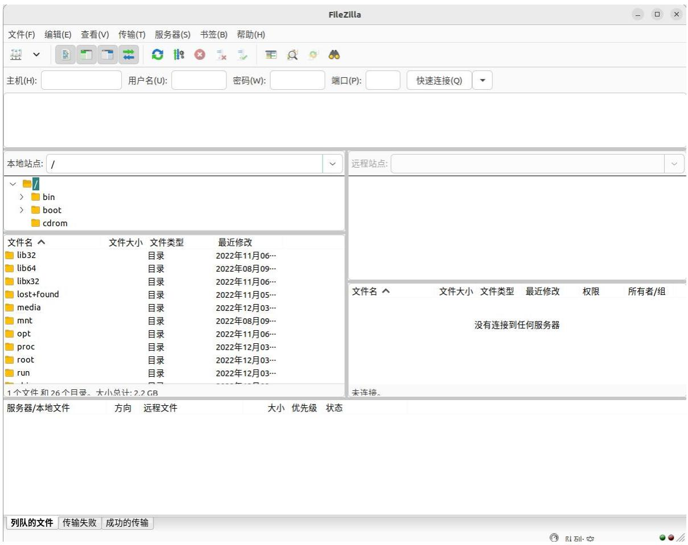


4)连接开发板的方法如下图所示：


5) 然后选择保存密码，再点击确定。

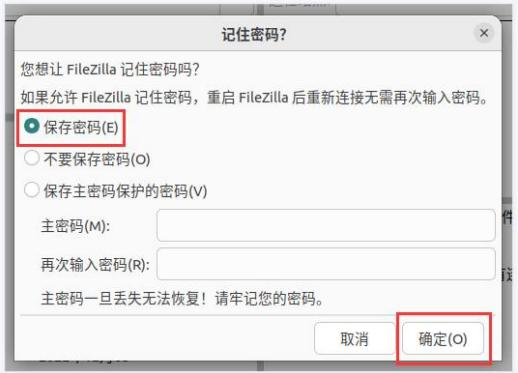


6) 然后选择总是信任该主机，再点击确定。


7)连接成功后在 filezilla软件的右边就可以看到开发板 linux文件系统的目录结构了。

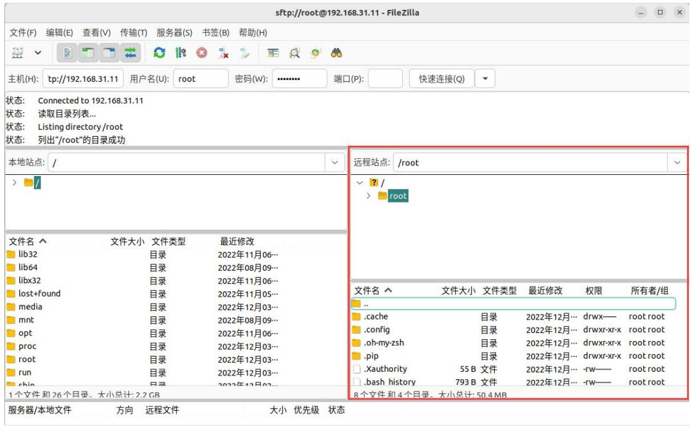


8)然后在 filezilla软件的右边选择要上传到开发板中的路径，再在 filezilla软件的左边选中 Ubuntu PC中要上传的文件，再点击鼠标右键，再点击上传选项就会开始上传文件到开发板中了。


9) 上传完成后就可以去开发板 Linux 系统中的对应路径中查看上传的文件了。

10) 上传文件夹的方法和上传文件的方法是一样的，这里就不再赘述了。

3.16.2. 在 Windows PC 中上传文件到开发板 Linux 系统中的方法

3.16.2.1. 使用 filezilla 上传文件的方法

1) 首先下载 filezilla 软件 Windows 版本的安装文件，下载链接如下所示：

```txt
https://filezilla-project.org/download.php?type=client 
```


2) 下载的安装包如下所示，然后双击直接安装即可。

FileZilla_Server_x.x.x_win64-setup.exe 

安装过程中，下面的安装界面请选择Decline，然后再选择Next>。


3) filezilla 打开后的界面如下所示，此时右边远程站点下面显示的是空的。

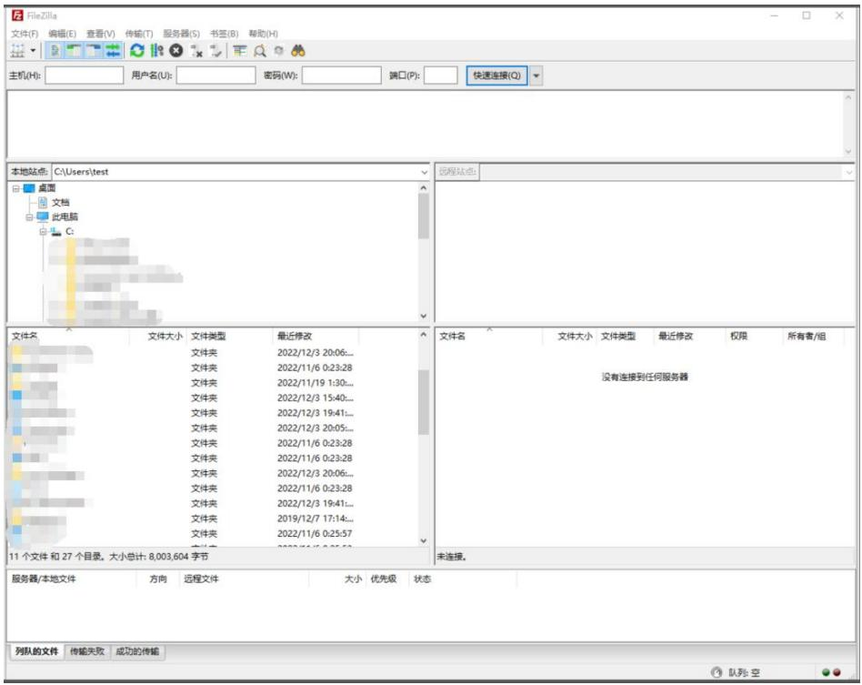


4) 连接开发板的方法如下图所示：

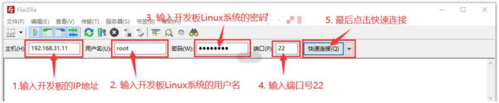


5) 然后选择保存密码，再点击确定。

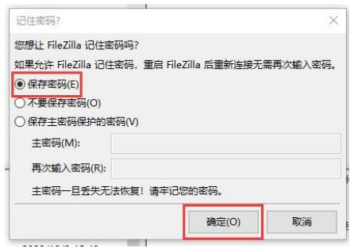


6) 然后选择总是信任该主机，再点击确定。

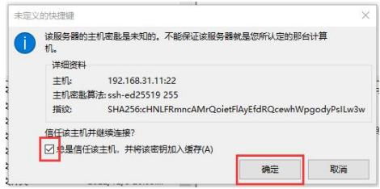


7)连接成功后在 filezilla软件的右边就可以看到开发板 linux文件系统的目录结构了。

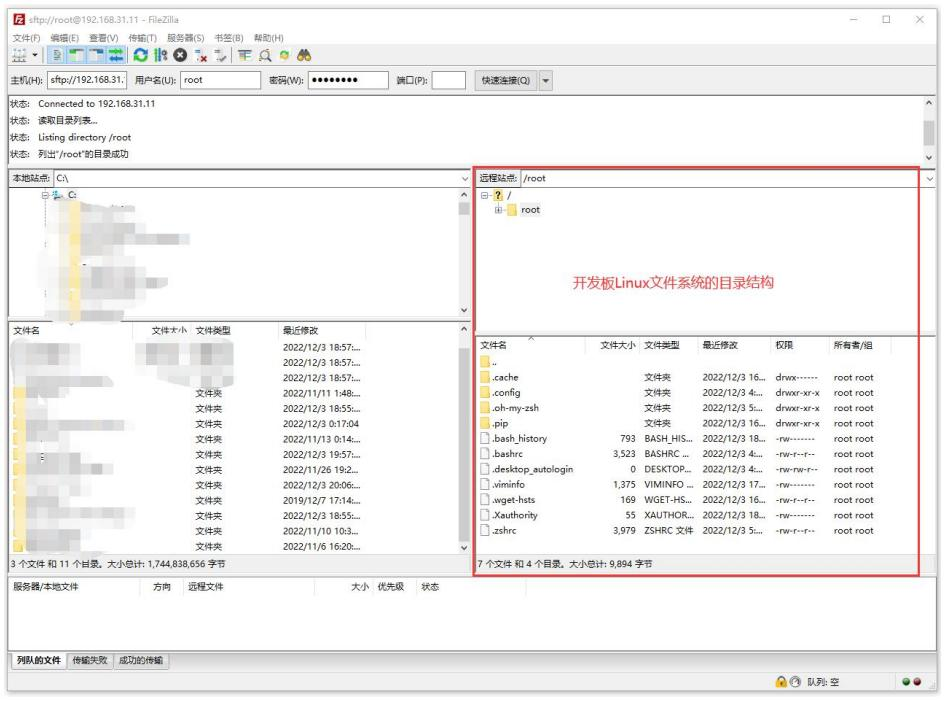


8) 然后在 filezilla 软件的右边选择要上传到开发板中的路径，再在 filezilla软件的左边选中 Windows PC 中要上传的文件，再点击鼠标右键，再点击上传选项就会开

始上传文件到开发板中了。

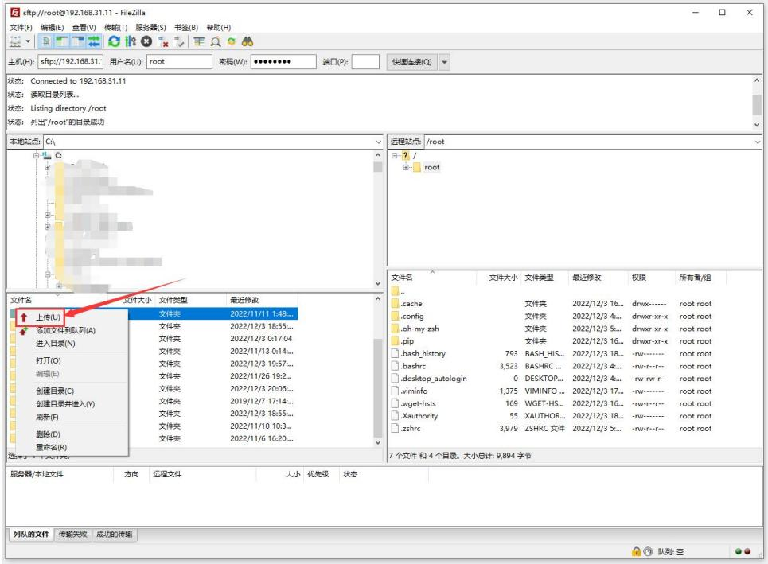


9)上传完成后就可以去开发板Linux系统中的对应路径中查看上传的文件了。

10) 上传文件夹的方法和上传文件的方法是一样的，这里就不再赘述了。

# 3.17. 散热风扇的使用方法

开发板散热风扇的接口所在的位置如下所示：

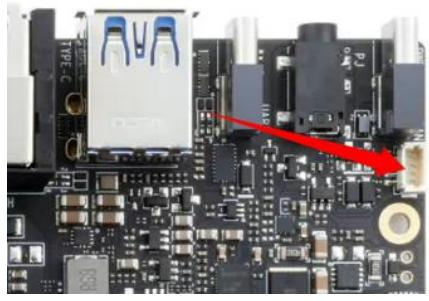


开发板使用的散热风扇为 12V 的，接口为 4pin，1.0mm间距规格。可以通过PWM来控制风扇的转速。

使用 npu-smi 命令可以查询和控制PWM风扇，详细用法如下所示：

1) 查询风扇模式的命令如下所示：

```txt
(base) HwHiAiUser@orangepiaipro-20t:~$ sudo npu-smi info -t pwm-mode
pwm-mode : auto 
```

<table><tr><td>字段</td><td>说明</td></tr><tr><td>pwm-mode</td><td>风扇模式。有如下两种模式:• manual: 手动模式• auto: 自动模式默认为自动模式。</td></tr></table>

2)查询风扇调速比的命令如下所示：

```txt
(base) HwHiAiUser@orangepiaipro-20t:~$ sudo npu-smi info -t pwm-duty-ratio
pwm-duty-ratio(%) : 15 
```

3) 设置风扇模式为手动模式的命令如下所示：

```txt
(base) HwHiAiUser@orangepiaipro-20t:~$ sudo npu-smi set -t pwm-mode -d 0 
```

# 描述

风扇使能模式。分为手动模式、自动模式。默认为自动模式。

 0：手动模式

 1：自动模式

4)将风扇设置为手动模式后就可以通过下面的命令来设置风扇的调速比了。比如下面的命令会将风扇调速比设置为100，设置完后风扇会用最大的转速运行。

```txt
(base) HwHiAiUser@orangepiaipro-20t:~$ sudo npu-smi set -t pwm-duty-ratio -d 100 
```

# 描述

风扇调速比

取值范围：[0-100]

# 3.18. AI CPU 和 control CPU 的设置方法

开发板使用的昇腾 SOC 总共有 4 个 CPU，这 4 个 CPU 既可以设置为 controlCPU，也可以设置为 AI CPU。默认情况下，control CPU 和 AI CPU 的分配数量为3:1。使用 npu-smi info 命令可以查看下 control CPU 和 AI CPU 的分配数量。

```txt
(base) HwHiAiUser@orangepiaipro-20t:~$ npu-smi info -t cpu-num-cfg -i 0 -c 0
Current AI CPU number : 1
Current control CPU number : 3
Current data CPU number : 0
(base) HwHiAiUser@orangepiaipro-20t:~$ 
```

当 Linux 系统跑满后，使用 htop 命令会看到有一个CPU的占用率始终接近0，请注意，这是正常的。因为这个CPU默认用于AI CPU。

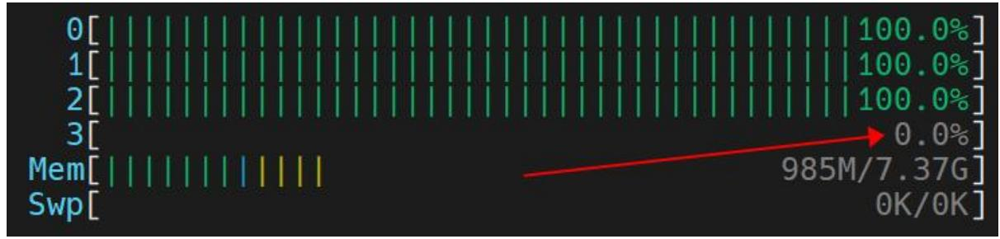


如果当前环境模型中无 AI CPU 算子，且运行业务时查询 AI CPU占用率持续为0，则可以将AICPU的数量配置为0。查询AICPU占用率的命令如下所示：

```txt
(base) HwHiAiUser@orangepiaipro-20t:~$ npu-smi info -t usages -i 0 -c 0
Memory Capacity(MB) : 7545
Memory Usage Rate(%) : 20
Hugepages Total(page) : 15
Hugepages Usage Rate(%) : 100
Aicore Usage Rate(%) : 0
Aicpu Usage Rate(%) : 0
Ctrlcpu Usage Rate(%) : 1
Memory Bandwidth Usage Rate(%) : 1 
```

如果不需要使用 AI CPU，使用下面的命令可以将 4 个 CPU都设置为 controlCPU。设置完后需要重启系统让配置生效。

```batch
(base) HwHiAiUser@orangepiaipro-20t:~$ sudo npu-smi set -t cpu-num-cfg -i 0 -c 0 -v 0:4:0 
```

Status : OK 

Message : The cpu-num-cfg of the chip is set successfully. Reset system for the configuration to take effect. 

当 4 个 CPU 都设置为 control CPU 后，再运行任务让所有 CPU 跑满，使用htop 命令就能看到 4 个CPU的占用率都能达到100%了。

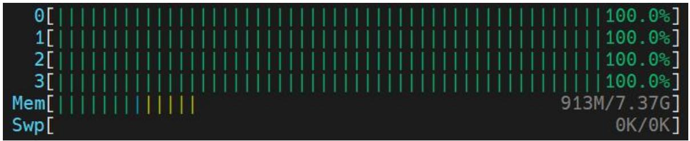


# 3.19. 设置 Swap 内存的方法

虽然开发板有 12GB或 24GB的大内存，但有些应用需要的内存大于 12GB或24GB，此时我们可以通过 Swap内存来扩展系统能使用的最大内存容量。方法如下所示：

1) 首先创建一个 swap 文件，下面的命令会创建一个 16GB大小的 swap文件，容量大小请根据自己的需求进行修改。

(base) HwHiAiUser@orangepiaipro-20t:~$ sudo fallocate -l 16G /swapfile 

如果已经启用了Swap分区再运行fallocate 命令会报下面的错误：

fallocate: fallocate failed: Text file busy 

需要先运行sudo swapoff /swapfile命令关闭系统上的swap分区才行。

注意，添加Swap内存前，请确保TF卡、eMMC或者SSD的剩余空间大于需要添加的Swap内存容量。

2)然后修改文件权限，确保只有root用户可以读写。

(base) HwHiAiUser@orangepiaipro-20t:~$ sudo chmod 600 /swapfile 

3) 然后把这个文件设置成swap空间。

(base) HwHiAiUser@orangepiaipro-20t:~$ sudo mkswap /swapfile 

4) 然后启用 swap。

(base) HwHiAiUser@orangepiaipro-20t:~$ sudo swapon /swapfile 

5) 完成以上步骤后，通过下面的命令可以检查swap 内存是否已经添加成功。

(base) HwHiAiUser@orangepiaipro-20t:~$ free -h 

```txt
total used free shared buff/cache available
Mem: 11Gi 802Mi 9.8Gi 48Mi 723Mi 10Gi
Swap: 15Gi 0B 15Gi 
```

6) 如果需要 swap 设置在重启之后依然有效，请运行下面命令将对应的配置添加到/etc/fstab 文件中。

```shell
(base) HwHiAiUser@orangepiaipro-20t:~$ echo '/swapfile none swap sw 0 0' | sudo tee -a /etc/fstab 
```

# 3.20. 测试 MindSpore 的方法

开发板的 Ubuntu 系统中已经预装了 MindSpore，使用下面的方法可以测试下MindSpore是否能正常使用。

1)首先请根据设置 Swap 内存的方法一小节的说明给系统额外添加 16GB 的Swap 内存。

2)然后在 HwHiAiUser用户中执行下面的命令：

```txt
(base) HwHiAiUser@orangepiaipro-20t:~$ python -c \
"import mindspore;mindspore.set_context(device_target='Ascend');mindspore.run_check() " 
```

3) 等待一段时间后，如果能看到下面的输出就说明MindSpore能正常使用。

```txt
MindSpore version: 2.x.xx
The result of multiplication calculation is correct, MindSpore has been installed on platform [Ascend] successfully! 
```

4) 更新 MindSpore 版本的命令如下所示：

```txt
(base) HwHiAiUser@orangepiaipro-20t:~$ pip install --upgrade mindspore 
```

# 3.21. 使用 ascend 硬件加速的 ffmpeg

FFmpeg 是一个开源项目，它提供了一套用于处理音频和视频内容的库和程序，可以实现音视频的录制、转换、流处理等功能。FFmpeg 支持多种媒体格式，几乎可以处理所有常见的音视频数据。

我们通过使用由 DVPP 接口实现的 FFmpeg 硬件编解码器可以大幅提高视频编码和解码的速度。通过将视频处理任务卸载到 Ascend芯片上的专用硬件，可以显著减少CPU的负载，加速视频、图片数据的处理过程。

注意，当前添加了ascend硬件加速的ffmpeg仅支持CANN版本为 7.0 的ubuntu系统。

# 3.21.1. 使用编译好的 deb 软件包

1) 支持 Ascend 硬件编解码器的 deb 格式的软件包可以从开发板的资料下载页面下载到。步骤为：

a. 打开下面的链接：

```txt
http://www.orangepi.cn/html/hardWare/computerAndMicrocontrollers/service-and-support/Orange-Pi-AIpro(20T).html 
```

b. 然后选择官方工具。

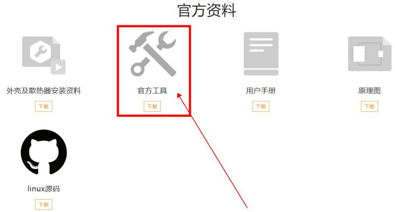


c. 然后下载 FFmpeg_ascend 文件夹中的 ffmpeg_4.4.2-1_arm64.deb 软件包和测试视频。


2)然后参考手册上传文件到开发板 Linux系统中的方法将其上传到开发板的以下目录。

```txt
/home/HwHiAiUser/ 
```

3) 首先在”/home/HwHiAiUser/.bashrc”文件的最后添加下面两个环境变量，并使其生效。

```txt
HwHiAiUser@orangepi:~$ vim .bashrc 
```

```shell
source /usr/local/Ascend/ascend-toolkit/set_env.sh
export LD_LIBRARY_PATH=/usr/lib:/usr/local/Ascend/ascend-toolkit/latest/acllib/lib64:$LD_LIBRARY_PATH
HwHiAiUser@orangepi:~$ source .bashrc 
```

4)在开发板上执行以下命令安装软件包。

```txt
HwHiAiUser@orangepi:~$ ls
ffmpeg_4.4.2-1_arm64.deb
HwHiAiUser@orangepi:~$ sudo dpkg -i ffmpeg_4.4.2-1_arm64.deb
(Reading database ... 129897 files and directories currently installed.)
Preparing to unpack ffmpeg_4.4.2-1_arm64.deb ...
Unpacking ffmpeg (4.4.2-1) over (4.4.2-1) ...
Setting up ffmpeg (4.4.2-1) ...
Processing triggers for man-db (2.10.2-1) ... 
```

5) 验证安装。依次输入以下 3 条命令，如果在输出的最后存在下面列出的内容，则说明编解码器安装成功。

```txt
HwHiAiUser@orangepi:~$ ffmpeg -hwaccels | grep ascend
ascend
HwHiAiUser@orangepi:~$ ffmpeg -encoders | grep ascend
V..... h264_ascend Ascend HiMpi H264 encoder (codec h264)
V..... h265_ascend Ascend HiMpi H265 encoder (codec hevc)
HwHiAiUser@orangepi:~$ ffmpeg -decoders | grep ascend
V..... h264_ascend Ascend HiMpi H264 decoder (codec h264)
V..... h265_ascend Ascend HiMpi H265 decoder (codec hevc) 
```

# 3.21.2. 从源代码构建

1) 编解码器补丁包可以从开发板的资料下载页面下载到。步骤为：

a. 打开下面的链接：

```txt
http://www.orangepi.cn/html/hardWare/computerAndMicrocontrollers/service-and-support/Orange-Pi-AIpro(20T).html 
```

b. 然后选择官方工具。


官方资料


c. 然后下载 FFmpeg_ascend 文件夹中的 addfile.tar.gz 和测试视频。


testvideo.mp4


addfile.tar.gz


2) 然后参考手册上传文件到开发板 Linux 系统中的方法将其上传到开发板的以下目录。

```txt
/home/HwHiAiUser/ 
```

3) 接下来下载 ffmpeg 源码。首先打开/etc/apt/sources.list 配置文件，然后取消掉deb-src 前面的注释，再使用 apt update 命令更新软件包列表的缓存，再使用 aptsource ffmpeg 命令下载 ffmpeg 的源码。

```txt
HwHiAiUser@orangepi:~$ sudo vim /etc/apt/sources.list
deb http://repo.huaweicloud.com/ubuntu-ports/ jammy main restricted universe multiverse
deb http://repo.huaweicloud.com/ubuntu-ports/ jammy-security main restricted universe multiverse
deb http://repo.huaweicloud.com/ubuntu-ports/ jammy-updates main restricted universe multiverse
deb http://repo.huaweicloud.com/ubuntu-ports/ jammy-proposed main restricted universe multiverse
deb-src http://repo.huaweicloud.com/ubuntu-ports/ jammy main restricted universe multiverse
deb-src http://repo.huaweicloud.com/ubuntu-ports/ jammy-security main restricted universe multiverse 
```

```shell
deb-src http://repo.huaweicloud.com/ubuntu-ports/ jammy-updates main restricted universe multiverse
deb-src http://repo.huaweicloud.com/ubuntu-ports/ jammy-proposed main restricted universe multiverse
HwHiAiUser@orangepi:~$ sudo apt update
HwHiAiUser@orangepi:~$ sudo apt-get install dpkg-dev
HwHiAiUser@orangepi:~$ apt source ffmpeg 
```

4) 运行 apt source ffmpeg 命令后，当前目录会多出下面所示的文件和文件夹，其中ffmpeg-4.4.2 文件夹为 ffmpeg 源码的目录。

```shell
HwHiAiUser@orangepi:~$ ls | grep ffmpeg-4.4.2
ffmpeg_4.4.2-0ubuntu0.22.04.1.debian.tar.xz
ffmpeg_4.4.2-0ubuntu0.22.04.1.dsc
ffmpeg_4.4.2.ascend-1_arm64.deb
ffmpeg_4.4.2.orig.tar.xz
ffmpeg_4.4.2.orig.tar.xz.asc 
```

5) 然后将 ffmpeg dvpp 的补丁文件解压并复制到 ffmpeg源码的文件夹中。

```shell
HwHiAiUser@orangepi:~$ tar zxf addfile.tar.gz
HwHiAiUser@orangepi:~$ cp -r addfile/* ./ffmpeg-4.4.2 
```

6) 然后在”/home/HwHiAiUser/.bashrc”文件的最后添加下面两个环境变量，并使其生效。

```shell
HwHiAiUser@orangepi:~$ vim .bashrc
source /usr/local/Ascend/ascend-toolkit/set_env.sh
export LD_LIBRARY_PATH=/usr/lib:/usr/local/Ascend/ascend-toolkit/latest/acllib/lib64:$LD_LIBRARY_PATH
HwHiAiUser@orangepi:~$ source .bashrc 
```

7) 然后就可以开始编译安装带有 dvpp 功能的ffmpeg 包。具体命令如下所示：

```perl
HwHiAiUser@orangepi:~$ cd ffmpeg-4.4.2
HwHiAiUser@orangepi:~/ffmpeg-4.4.2$ ./configure \
--prefix=/usr \
--enable-shared \ 
```

```shell
--extra-cflags="-I${ASCEND_HOME_PATH}/acllib/include" \
--extra-ldflags="-L${ASCEND_HOME_PATH}/aarch64-linux/lib64" \
--extra-libs="-lacl_dvpp_mpi -lascendcl" \
--enable-ascend
HwHiAiUser@orangepi:~/ffmpeg-4.4.2$ make -j4
HwHiAiUser@orangepi:~/ffmpeg-4.4.2$ sudo make install 
```

注意，这里./configure后所列出的配置是最简必要配置，如果需要添加其他配置，请自行按照格式添加，如--enable-libx264。

6) 验证安装。依次输入以下 3 条命令，如果在输出的最后几行存在下面列出的内容，则说明编解码器安装成功。

```txt
HwHiAiUser@orangepi:~$ ffmpeg -hwaccels | grep ascend
ascend
HwHiAiUser@orangepi:~$ ffmpeg -encoders | grep ascend
V..... h264_ascend Ascend HiMpi H264 encoder (codec h264)
V..... h265_ascend Ascend HiMpi H265 encoder (codec hevc)
HwHiAiUser@orangepi:~$ ffmpeg -decoders | grep ascend
V..... h264_ascend Ascend HiMpi H264 decoder (codec h264)
V..... h265_ascend Ascend HiMpi H265 decoder (codec hevc) 
```

# 3.21.3. 应用场景

# 3.21.3.1. 视频编解码

这里我们以提供的 H264 格式的测试视频为例，运行下面的命令可以使用ffmpeg 来 调 用 h264_ascend 解 码 器 来 解 码 测 试 视 频 （ h265_ascend 使 用 方 法 同h264_ascend，只需将以下命令中两个 h264 改为 h265）：

```batch
HwHiAiUser@orangepi:~$ ffmpeg -i testvideo.mp4 -vcodec h264_ascend test.264 
```

ffmpeg 运行时的输出如下所示，跑完整个转码过程大约耗时 205s。

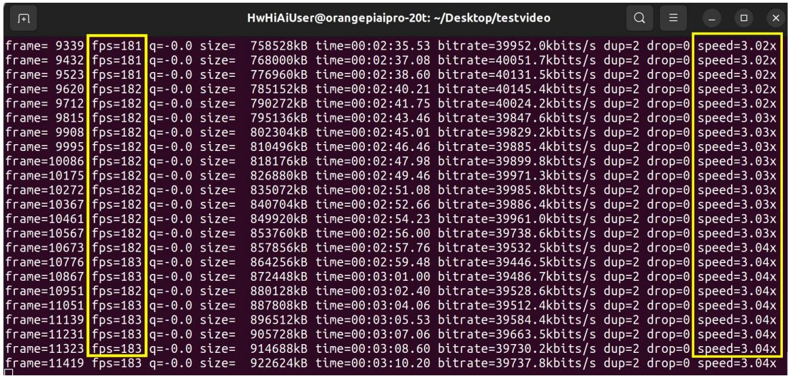


由上图我们可以看出，在转码过程中，平均 fps 在 180 多，speed在 3倍左右。作为对比，以下为 libx264 转码结果，平均fps 只有20多，耗时1700多秒。

```batch
HwHiAiUser@orangepi:~$ ffmpeg -i testvideo.mp4 -vcodec libx264 test.264 
```

注意，如果是编译安装的，上面给出的配置是最简必要配置，是没有开启libx264 编码器的，运行会提示“Unknown encoder ‘ libx264‘”。请先执行“sudoapt install libx264-dev”命令安装libx264 软件包，然后按照上面的说明添加配置“--enable-libx264”和“--enable-gpl”后重新编译安装。

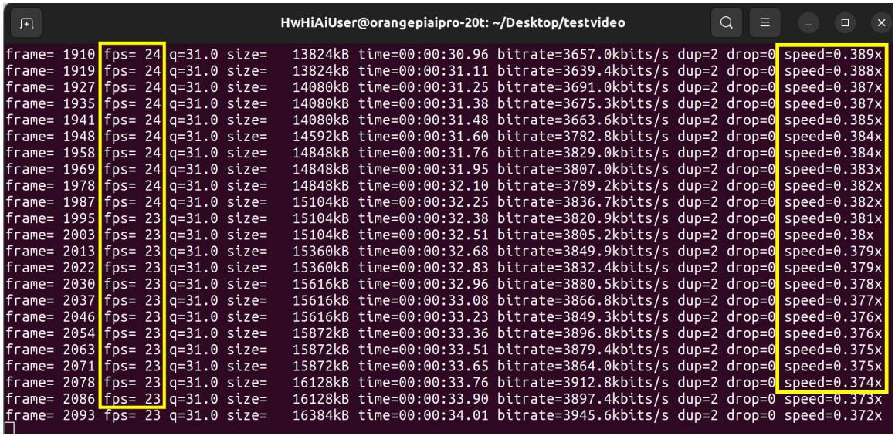


<table><tr><td>编解码器</td><td>平均 fps</td><td>耗时</td></tr><tr><td>libx264</td><td>22</td><td>1702s</td></tr><tr><td>h264_ascend</td><td>186</td><td>205s</td></tr></table>

由此我们可以发现，调用 ascend编解码器后，对比 libx264能够提升 9倍左右的性能，能够有效的提升编解码性能。对于需要实时处理的视频流，硬件解码可以确保视频数据快速地被处理，从而维持或提高如目标检测等场景下的实时性能。硬件解码使得模型可以更快地接收大量数据，从而可以增加批量处理的规模，这有助于提高模型推理的吞吐量。

# 3.21.3.2. 直播推流

整个过程我们大致可以分为 3部分。首先使用摄像头或视频源采集视频数据，通过推流软件将采集到的数据推送到服务器上。用户通过客户端软件从服务器上拉取视频流，在经过解码和渲染后呈现出来。


# 3.21.3.2.1. 搭建服务端

这里使用一个名为 mediamtx 的开源项目(项目地址：https://github.com/bluenviron/mediamtx)作为服务端。我们可以直接从开发板的资料下载页面下载编译好的独立二进制文件。当然，你也可以参考项目文档将其安装在其他平台上，或者使用其他的服务端。

a. 打开下面的链接：

```txt
http://www.orangepi.cn/html/hardWare/computerAndMicrocontrollers/service-and-support/Orange-Pi-AIpro(20T).html 
```

b. 然后选择官方工具。


官方资料


c. 然后下载 FFmpeg_ascend 文件夹中的 mediamtx_v1.8.4_linux_arm64v8.tar.gz压缩包。


mediamtx_v1.8.4_.. 

d. 然后参考手册上传文件到开发板 Linux系统中的方法将其上传到开发板的以下目录。

```txt
/home/HwHiAiUser/ 
```

e. 然后使用以下命令将软件解压到“~/mediamtx”目录。

```txt
HwHiAiUser@orangepi:~$ mkdir mediamtx
HwHiAiUser@orangepi:~$ tar -zxf mediamtx_v1.8.4_linux_arm64v8.tar.gz -C media
mtx
HwHiAiUser@orangepi:~$ cp mediamtx/mediamtx.yml ./ 
```

f. 查询服务器 IP，比如下面的 10.31.3.120 就是服务器 IP。IP 请不要照抄，以实际看到的为准。

```csv
HwHiAiUser@orangepi:~$ ifconfig
eth1: flags=4163<UP,BROADCAST,RUNNING,MULTICAST> mtu 1500
inet 10.31.3.120 netmask 255.255.0.0 broadcast 10.31.255.255
inet6 fe80::6532:3661:21ab:ebf1 prefixlen 64 scopeid 0x20<link>
ether c0:74:2b:fd:f0:f7 txqueuelen 1000 (Ethernet) 
```

g. 启动服务。如果有特殊需求，请先修改配置文件。

```txt
HwHiAiUser@orangepi:~$ vim ./mediamtx.yml #修改配置
HwHiAiUser@orangepi:~$ sudo mediamtx/mediamtx #启动服务
```

```txt
2024/07/18 20:21:40 INF MediaMTX v1.8.4
2024/07/18 20:21:40 INF configuration loaded from /home/HwHiAiUser/mediamtx.yml
2024/07/18 20:21:40 INF [RTSP] listener opened on :8554 (TCP), :8000 (UDP/RTP), :8001 (UDP/RTCP)
2024/07/18 20:21:40 INF [RTMP] listener opened on :1935
2024/07/18 20:21:40 INF [HLS] listener opened on :8888
2024/07/18 20:21:40 INF [WebRTC] listener opened on :8889 (HTTP), :8189 (ICE/UDP)
2024/07/18 20:21:40 INF [SRT] listener opened on :8890 (UDP) 
```

# 3.21.3.2.2. 推流

这里介绍两种推流的视频输入方式：摄像头画面输入和离线视频输入。

1) 将摄像头画面输入推流出去的方法如下所示：

a) 首先将 USB 摄像头连接到开发板的 USB 接口中。接好摄像头后，可以先参考USB摄像头测试小节的说明测试下USB摄像头，确保能正常使用。

注意，当前版本如需同时使用 2个USB摄像头，请将其中一个使用Type-C接口连接到开发板，另外一个通过USB3.0HOST接口连接到开发板。如果将两个USB摄像头都连接到USB3.0 HOST接口的话会出现带宽不足的问题。

目前最多可以连接 2个USB2.0摄像头。

b) 然后执行以下命令开始将USB 摄像头采集的视频推流出去。

```shell
root@orangepi:~# export LD_LIBRARY_PATH=/usr/lib:/usr/local/Ascend/ascend-to
olkit/latest/acllib/lib64:$LD_LIBRARY_PATH
root@orangepi:~# ffmpeg -f v4l2 -input_format mjpeg -video_size 1920x1080 -framer
ate 30 -i /dev/video0 -c:v h264_ascend -b:v 1000k -maxrate 5000k -bufsize 256k -g 5
-keyint_min 5 -rtsp_transport udp -f rtsp rtsp://10.31.3.120:8554/mystream1 
```

命令中的/dev/video0请根据实际情况填写，最后的rtsp视频流的IP地址请换成上面服务器的ip，如果推流设备和服务器是同一个设备的话，请使用rtsp://localhost:8554/mystream1，否则推流会失败。

c) ffmpeg 推流命令相关参数说明如下：

<table><tr><td>-f v4l2</td><td>指定使用 V4L2(Video4Linux2)驱动接口来读取视频设备</td></tr><tr><td>-input_format mjpeg</td><td>指定输入视频的格式为 MJPEG(yuv 格式会被限制到 5fps)</td></tr><tr><td>-video_size1920x1080</td><td>设置视频的分辨率,这里为 1920x1080(1080p)</td></tr><tr><td>-framerate 30</td><td>设置视频的帧率为每秒 30 帧</td></tr><tr><td>-i /dev/video0</td><td>指定输入设备为 video0</td></tr><tr><td>-c:v h264_ascend</td><td>指定视频编码器为 h264_ascend</td></tr><tr><td>-b:v 1000k</td><td>设置视频的比特率为 1000 kbit/s</td></tr><tr><td>-maxrate 5000k</td><td>设置视频的最大比特率</td></tr><tr><td>-bufsize 256k</td><td>设置编码器的缓冲区大小</td></tr><tr><td>-g 5</td><td>设置 GOP 大小为 5 帧(减小 GOP 大小有助于减少延时)</td></tr><tr><td>-keyint_min 5</td><td>设置最小关键帧间隔为 5 帧(需要和-g 参数对应)</td></tr><tr><td>-rtsp_transport udp</td><td>使用 UDP 协议来传输 RTSP 流(对画质有要求的建议使用 tcp)</td></tr><tr><td>-f rtsp</td><td>指定输出格式为 RTSP</td></tr><tr><td>rtsp://10.31.3.120:8554/mystream1</td><td>指定 RTSP 服务器的地址和流名称,10.31.3.120 上的端口 8554,流名称为 mystream1</td></tr></table>

d) 推流端日志如下，打印出了推流时的相关配置信息以及状态：

```ini
[swscaler @ 0xaaaaed198130] deprecated pixel format used, make sure you did set range correctly
[h264_ascend_enc @ 0xaaaaed16ebc0] Device id is: 0.
[AVHwDeviceContext @ 0xaaaaed1f62f0] device id is: 0.
[h264_ascend_enc @ 0xaaaaed16ebc0] Create venc channels success. Channel id is 0
Encode thread start.
Output #0, rtsp, to 'rtsp://10.31.3.120:8554/mystream1':
    Metadata:
    encoder : Lavf58.76.100
    Stream #0:0: Video: h264, nv12(tv, bt470bg/unknown/unknown, progressive), 1920 x1080, q=2-31, 1000 kb/s, 30 fps, 90k tbn
    Metadata:
    encoder : Lavc58.134.100 h264_ascend
[rtsp @ 0xaaaaed169a50] Timestamps are unset in a packet for stream 0. This is deprecated and will stop working in the future. Fix your code to set the timestamps properly
[rtsp @ 0xaaaaed169a50] Encoder did not produce proper pts, making some up.
frame= 15 fps= 13 q=-0.0 size=N/A time=00:00:00.23 bitrate=N/A dup=13 drop=0 s
frame= 29 fps= 17 q=-0.0 size=N/A time=00:00:00.70 bitrate=N/A dup=18 drop=0 s
frame= 45 fps= 21 q=-0.0 size=N/A time=00:00:01.23 bitrate=N/A dup=24 drop=0 s
frame= 62 fps= 23 q=-0.0 size=N/A time=00:00:01.80 bitrate=N/A dup=30 drop=0 s
frame= 78 fps= 24 q=-0.0 size=N/A time=00:00:02.33 bitrate=N/A dup=36 drop=0 s
frame= 94 fps= 25 q=-0.0 size=N/A time=00:00:02.86 bitrate=N/A dup=42 drop=0 s 
```

e) 在服务端会有如下日志，代表服务器已经收到了来自 IP为“10.31.1.109”推送的 RTSP 格式的视频流“mystream1”：

```txt
2024/07/18 14:09:34 INF [RTSP] [conn 10.31.1.109:45706] opened
2024/07/18 14:09:34 INF [RTSP] [session 5116116d] created by 10.31.1.109:45706 
```

2024/07/18 14:09:34 INF [RTSP] [session 5116116d] is publishing to path 'mystream1', 1 track (H264) 

2) 将离线视频推流出去的方法如下所示：

a) 推流命令如下：

HwHiAiUser@orangepi:~$ ffmpeg -re -i testvideo.mp4 -c:a aac -b:a 128k -ac 2 -ar 44 100 -c:v h264_ascend -b:v 2000k -maxrate 5000k -bufsize 256k -rtsp_transport udp -f rtsp rtsp://10.31.3.120:8554/mystream2 

b) 在参数上和上面的摄像头不同的是使用了“-re”参数，这样就可以循环推送当前的视频了。

注意，在推流时务必加上此参数“-c:a aac -b:a 128k -ac 2 -ar 44100”。否则会报以下错误：

```txt
Encode thread start.
[aac @ 0xaaaaadb75bfa0] Using a PCE to encode channel layout "5.1(side)"
Could not write header for output file #0 (incorrect codec parameters?): Server returned 400 Bad Request
Error initializing output stream 0:1 --
[h264_ascend_enc @ 0xaaaaadb638840] Enc sem_timewait = -1, time out, semvalue = 0
...
[h264_ascend_enc @ 0xaaaaadb638840] Call hi_mpi_venc_query_status failed, ret is -1610055675.
[h264_ascend_enc @ 0xaaaaadb638840] Call get_stream_loop failed, ret is -1.
[aac @ 0xaaaaadb75bfa0] Qavg: nan
Conversion failed!
(base) HwHiAiUser@orangepiaipro-20t:~/Desktop/testvideo$ 
```

如果推流设备和服务器是同一个设备的话，请使用rtsp://localhost:8554/mystream2，否则推流会失败。

# 3.21.3.2.3. 拉流

这里我们可以使用 ffplay工具直接播放我们推送到服务器的视频流。使用以下命令播放，记得把ip换成服务器ip：

HwHiAiUser@orangepi:~$ ffplay rtsp://10.31.3.120:8554/mystream1 

如果推流设备和服务器是同一个设备的话，也请使用服务器的ip，使用localhost替代ip会报错。运行前请核对流地址是否正确，尤其是最后的流名称“mystream”


# 3.22. 安装内核头文件的方法

注意，当前仅支持ubuntu系统。

1)开发板的 Linux系统不能直接使用 apt命令来安装内核头文件，需要使用专门制作的deb包。制作好的deb包可以从开发板资料下载页面的官方工具中下载到。


官方资料


2) 下载完后，请将 linux-header-deb 文件夹上传到开发板的 Linux 系统中，上传文件到开发板 Linux系统中的方法请参考上传文件到开发板 Linux系统中的方法一小节的说明。然后使用下面的命令就可以安装内核头文件的deb包了。

```txt
root@orangepi:~# cd linux-header-deb
root@orangepi:~/linux-header-deb# sudo apt update 
```

```batch
root@orangepi:~/linux-header-deb# sudo apt install -y ./linux-headers-linux-5.10.0_1.0_arm64.deb 
```

3) 安装完后在/usr/src 下就能看到内核头文件所在的文件夹。

```txt
root@orangepi:~/linux-header-deb# ls /usr/src linux-headers-5.10.0+ 
```

4) 然后可以测试下 linux-header-deb 文件夹中的 helle_test 内核模块是否能正常编译运行：

a. 首先使用 make 命令编译 hello 内核模块，编译过程的输出如下所示：

```shell
root@orangepi:~/linux-header-deb# cd helle_test
root@orangepi:~/linux-header-deb/helle_test# make
make -C /lib/modules/5.10.0+/build M=/root/linux-header-deb/helle_test modules
make[1]: Entering directory '/usr/src/linux-headers-5.10.0+'
CC [M] /root/linux-header-deb/helle_test/hello.o
MODPOST /root/linux-header-deb/helle_test/Module.symvers
CC [M] /root/linux-header-deb/helle_test/hello.mod.o
LD [M] /root/linux-header-deb/helle_test/hello.ko
make[1]: Leaving directory '/usr/src/linux-headers-5.10.0+' 
```

b. 编译完后会生成hello.ko内核模块。

```txt
root@orangepi:~/linux-header-deb# ls *.ko
hello.ko 
```

c. 使用 insmod 命令可以将 hello.ko 内核模块插入内核中。

```txt
root@orangepi:~/linux-header-deb# sudo insmod hello.ko 
```

d. 然后使用 demsg命令可以查看下 hello.ko内核模块的输出，如果能看到下面的输出说明hello.ko内核模块加载正确。

```txt
root@orangepi:~/linux-header-deb# dmesg | grep "Hello" [2871.893988] Hello Orange Pi -- init 
```

e. 使用 rmmod 命令可以卸载 hello.ko 内核模块。

```shell
root@orangepi:~/linux-header-deb# sudo rmmod hello
root@orangepi:~/linux-header-deb# dmesg | grep "Hello"
[2871.893988] Hello Orange Pi -- init
[3173.800892] Hello Orange Pi -- exit 
```

# 3.23. GPU 的测试方法

1) Ubuntu Desktop 镜像使用“glmark2-es2”命令，如果能够像下图一样识别到 GPU型号就代表GPU能够被正常调用。


(base) root@orangepiaipro-20t:~# glmark2-es2


```txt
(base) HwHiAiUser@orangepiaipro-20t:~$ glmark2-es2
-------->
    glmark2 2021.02
-------->
    OpenGL Information
    GL_VENDOR: Mesa
    GL_RENDERER: Mali-G52 r1 (Panfrost)
    GL_VERSION: OpenGL ES 3.1 Mesa 23.2.1-lubuntu3.1~22.04.3
-------->
[build] use-vbo=false: FPS: 134 FrameTime: 7.463 ms
[build] use-vbo=true: FPS: 139 FrameTime: 7.194 ms
[texture] texture-filter=nearest: FPS: 208 FrameTime: 4.808 ms
[texture] texture-filter=linear: FPS: 200 FrameTime: 5.000 ms
[texture] texture-filter=mipmap: 
```

2) openEuler 系统使用“glxinfo -B”命令，如果 Device 中显示的是 Mali-G52 就代表GPU工作正常。


[HwHiAiUser@orangepiaipro-20t ~] $ glxinfo -B


```txt
[HwHiAiUser@orangepiaipro-20t ~]$ glxinfo -B
name of display: :0.0
display: :0 screen: 0
direct rendering: Yes
Extended renderer info (GLX_MESA_query_renderer):
Vendor: Panfrost (0xffffff)
Device: Mali-G52 r1 (Panfrost) (0xffffff)
Version: 22.2.4
Accelerated: yes
Video memory: 11577MB
Unified memory: yes
Preferred profile: core (0x1)
Max core profile version: 3.1
Max compat profile version: 3.1
Max GLES1 profile version: 1.1
Max GLES[23] profile version: 3.1
OpenGL vendor string: Panfrost
OpenGL renderer string: Mali-G52 r1 (Panfrost)
OpenGL core profile version string: 3.1 Mesa 22.2.4
OpenGL core profile shading language version string: 1.40
OpenGL core profile context flags: (none) 
```

# 3.24. 关机和重启开发板的方法

1) 在 Linux 系统运行的过程中，如果直接拔掉电源断电，可能会导致文件系统丢失某些数据，建议断电前先使用 poweroff 命令关闭开发板的 Linux系统，然后再拔掉电源。

```txt
(base) HwHiAiUser@orangepiaipro-20t:~$ sudo poweroff 
```

2) 除了 poweroff 命令可以关闭 Linux 系统外，还可以使用开发板上的开关机按键来关闭开发板的Linux系统，然后再拔掉电源。

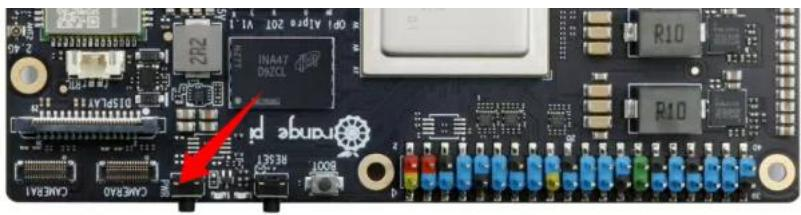


3)关机后再短按开发板上的开关机按键即可开机。

4) 使用 reboot 命令即可重启开发板中的 Linux系统。

```txt
(base) HwHiAiUser@orangepiaipro-20t:~$ sudo reboot 
```

# 4. 体验AI应用样例

我们在镜像中预装了 Jupyter Lab 软件和昇思 MindSpore 框架的 2.5 版本。Jupyter Lab软件是一个基于 web的交互式开发环境，集成了代码编辑器、终端、文件管理器等功能，使得开发者可以在一个界面中完成各种任务。并且我们在镜像中也预置了一些可以在 Jupyter Lab 软件中运行的基于昇思 MindSpore 框架开发的 AI应用样例。这些样例都是使用 Python 编写的，并调用了 Python 版本的 AscendCL编程接口。本章节介绍如何登录 jupyter lab 并在 jupyter lab 中运行这些预置的 AI 应用样例。

# 4.1. 登录 juypter lab

1)首先登录Linux系统桌面，然后打开终端，再切换到保存MindSporeAI应用样例的目录下。

```txt
(base) HwHiAiUser@orangepiaipro-20t:~$ cd orange-pi-mindspore 
```

2)在当前目录下有2个文件夹、1个shell文件、一个说明文档以及一个许可证文件。其中，7个离线om模型的案例存放在“Offline”文件夹中，15个在线推理案例存放在“Online”文件夹中。目录下有一个 Jupyter Lab 启动脚本 start_notebook.sh。

```txt
(base) HwHiAiUser@orangepiaipro-20t:~/orange-pi-mindspore$ tree -L 2
| — LICENSE
| — Offline
| | — 01-CNNCTC
| | — 02-ResNet50
| | — 03-HDR
| | — 04-CycleGAN
| | — 05-Shufflenet
| | — 06-FCN
| | — 07-Pix2Pix
| | — README.md
| | — __init__.py
| — 基于昇思 MindSpore+Orangepi AIpro 的训推全流程指导书(离线推理)
| — Online
```

```txt
| — 01-quick start
| — 02-ResNet50
| — 03-ViT
| — 04-FCN
| — 05-ShuffleNet
| — 06-SSD
| — 07-RNN
| — 08-LSTM+CRF
| — 09-GAN
| — 10-DCGAN
| — 11-Pix2Pix
| — 12-Diffusion
| — 13-ResNet50_transfer
| — 14-qwen1.5-0.5b
| — 15-tinyllama
| — README.md
| — __init__.py
| — images
| — README.md
| — start_notebook.sh 
```

3) 然后执行 start_notebook.sh 脚本启动 Jupyter Lab。如果需要使用电脑的浏览器进行体验，请在脚本后面加上开发板的 ip，如“ ./start_notebook.sh 192.168.1.2”。

```txt
(base) HwHiAiUser@orangepiaipro-20t:~/~/orange-pi-mindspore$ ./start_notebook.sh 
```

4) 在执行该脚本后，终端会出现如下打印信息，在打印信息中会有登录 JupyterLab的网址链接。

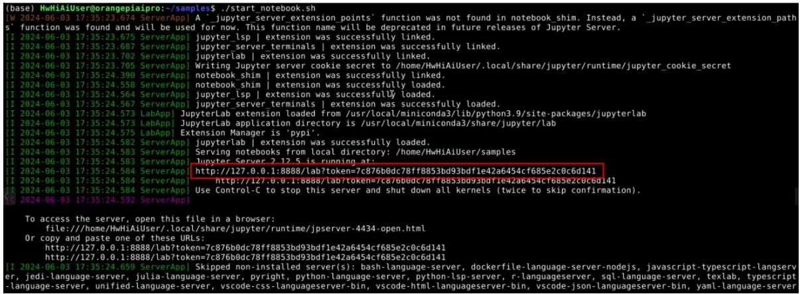


5)然后打开火狐浏览器。

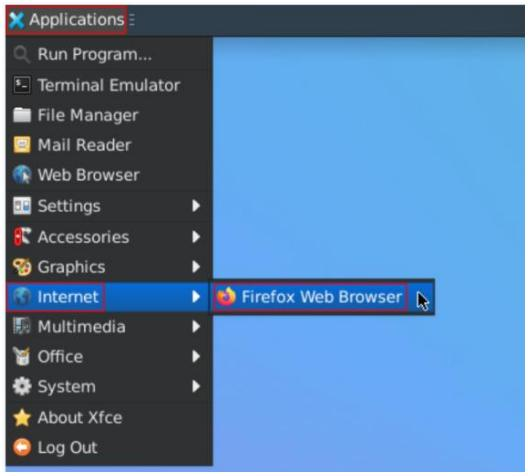


6) 再在浏览器中输入上面看到的网址链接，就可以登录 Jupyter Lab软件了。


7) 登录 Jupyter Lab 后的界面如下所示，左侧文件管理器中是2种运行模式的AI应用样例文件夹和Jupyter Lab启动脚本以及一些说明文件。


# 4.2. 释放内存的方法

Jupyter Lab 运行某个样例后，将样例的标签页关了是不会释放对应样例占用的内存的。我们可以通过将Kernel关闭的方式来回收内存，步骤如下所示：

1) 首先选择 Kernel。


2) 然后选择 Shut Down All Kernels...。


3)然后选择ShutDownAll即可释放样例占用的内存。


每测试完一个样例后建议释放下内存，然后再去运行下一个样例，以免由于内存不够导致样例运行失败。

# 4.3. 运行在线推理案例的方法

注意，如果需要运行这些样例请尽量在 24GB内存的开发板上运行。12GB内存的开发板想要顺利运行此样例，还需要设置至少 12GB的Swap内存，否则会出现因内存不足，系统自动杀死进程的问题，可以参考设置Swap内存的方法请参考设置Swap内存的方法一小节的说明。

# 4.3.1. 运行一个简单的深度学习模型

本案例通过MindSpore的API来快速实现一个简单的深度学习模型。可以按照以下流程在 Jupyter Lab中运行该样例。

1) 首先在 Jupyter Lab 界面双击下图所示的 01-quick start，进入到该样例的目录中。


2) 在该目录下有运行该示例的所有资源，其中 mindspore_quick_start.ipynb 是在 Jupyter Lab 中运行该样例的文件，双击打开 mindspore_quick_start.ipynb，在右侧窗口中会显示文件中的内容，如下图所示：

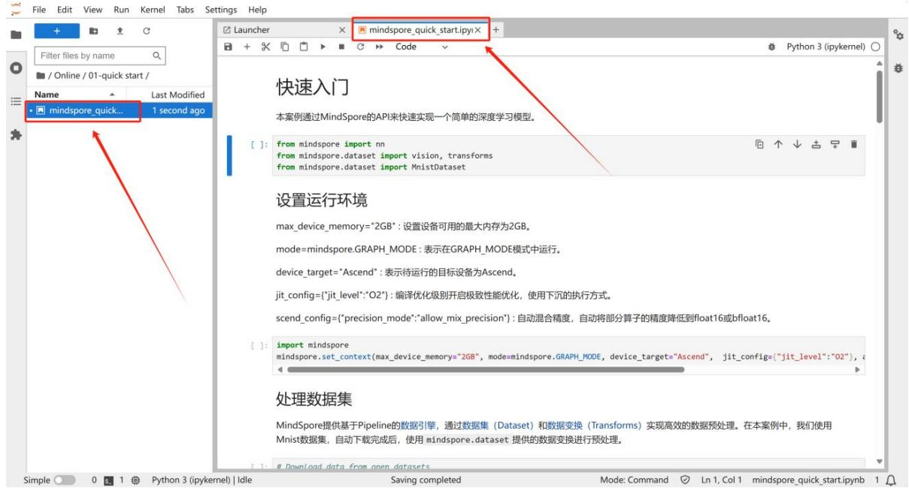


3) 单击按钮可以运行该样例，然后在弹出的对话框中再单击 Restart按钮。

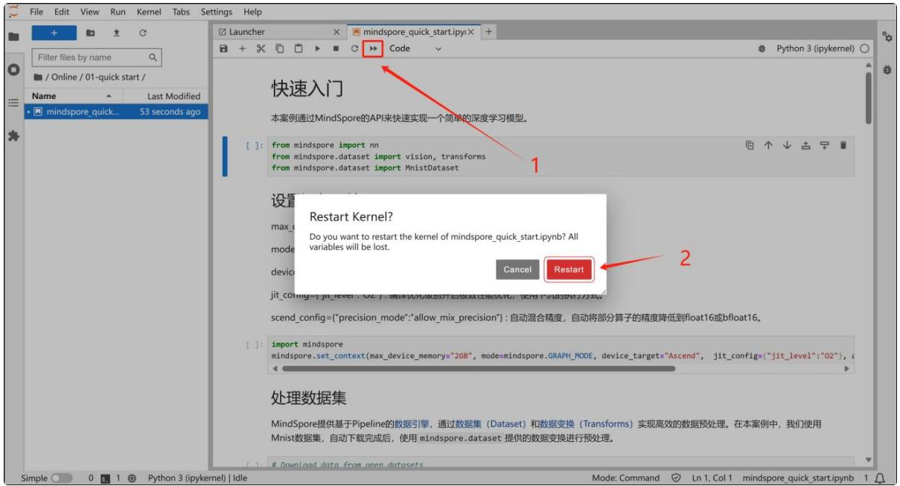


4) 在模型训练时，会打印每一轮的 loss 值和预测准确率（Accuracy），可以看到loss 在不断下降，Accuracy 在不断提高。训练完成后我们可以保存模型，如下图所示：

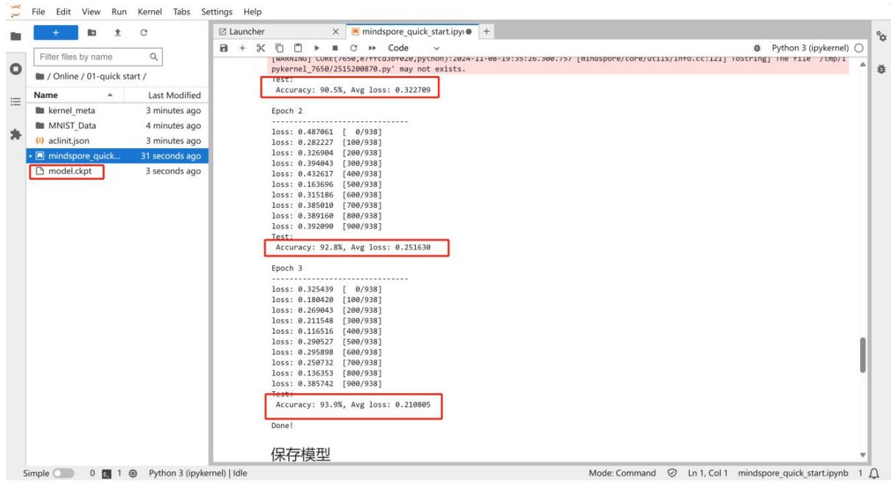


5) 然后我们可以加载刚刚训练的模型，进行预测，预测结果如下：

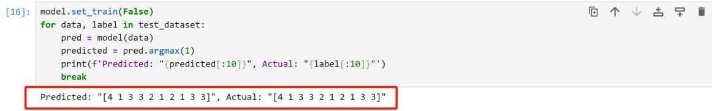


# 4.3.2. 运行 ResNet50 图像分类样例

图像分类是最基础的计算机视觉应用，属于有监督学习类别，如给定一张图像（猫、狗、飞机、汽车等），判断图像所属的类别。 ResNet网络提出了残差网络结构（Residual Network）来减轻退化问题，使用 ResNet网络可以实现搭建较深的网络结构（突破 1000层）。本样例使用 ResNet50网络对 CIFAR-10数据集进行离线推理分类。可以通过以下步骤完成样例的运行：

1) 首先在 Jupyter Lab 界面双击下图所示的 02-ResNet50，进入到该样例的目录中。


2) 在该目录下有运行该示例的所有资源，其中 mindspore_resnet50.ipynb 是在 Jupyter Lab 中运行该样例的文件，双击打开 mindspore_resnet50.ipynb，在右侧窗口中会显示此文件中的内容，如下图所示：

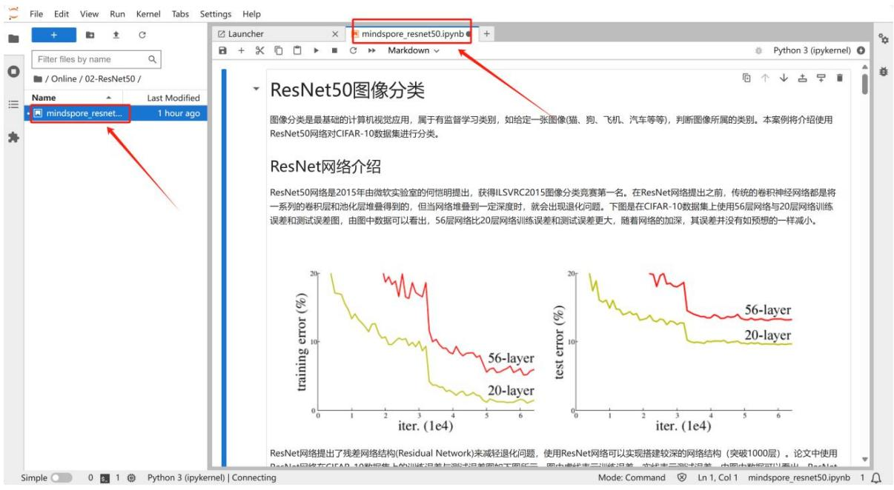


3) 单击 按钮可以运行样例，然后在弹出的对话框中再单击Restart按钮。

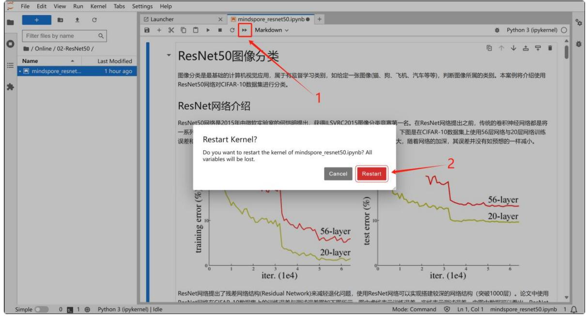


4)待程序执行完成后，在notebook文档中可以成功得到图像分类的结果。若预测字体颜色为蓝色表示为预测正确，预测字体颜色为红色则表示预测错误。如下图所示：


# 5)测试数据的保存路径如下所示：

/home/HwHiAiUser/orange-pi-mindspore/Online/02-ResNet50/datasets-cifar10-bin/cifar-10-batchesbin/ 


/./datasets-cifar10-bin/cifar-10- batches-bin / 

<table><tr><td>Name</td><td>Last Modified</td></tr><tr><td>batches.meta.txt</td><td>15 years ago</td></tr><tr><td>data_batch_1.bin</td><td>15 years ago</td></tr><tr><td>data_batch_2.bin</td><td>15 years ago</td></tr><tr><td>data_batch_3.bin</td><td>15 years ago</td></tr><tr><td>data_batch_4.bin</td><td>15 years ago</td></tr><tr><td>data_batch_5.bin</td><td>15 years ago</td></tr><tr><td>readme.html</td><td>15 years ago</td></tr><tr><td>test_batch.bin</td><td>15 years ago</td></tr></table>

# 4.3.3. 运行 Vision Transformer 图像分类样例

近些年，随着基于自注意（Self-Attention）结构的模型的发展，特别是 Transformer模型的提出，极大地促进了自然语言处理模型的发展。ViT则是自然语言处理和计算机视觉两个领域的融合结晶。在不依赖卷积操作的情况下，依然可以在图

像分类任务上达到很好的效果。

ViT模型的主体结构是基于Transformer模型的Encoder部分（部分结构顺序有调整，如：Normalization的位置与标准 Transformer 不同），其结构图如下：


ViT 模型主要应用于图像分类领域。因此，其模型结构相较于传统的Transformer有以下几个特点：

1. 数据集的原图像被划分为多个 patch（图像块）后，将二维 patch（不考虑 channel）转换为一维向量，再加上类别向量与位置向量作为模型输入。

2. 模型主体的 Block 结构是基于 Transformer 的 Encoder 结构，但是调整了 Normalization 的位置，其中，最主要的结构依然是 Multi-head Attention 结构。

3. 模型在 Blocks 堆叠后接全连接层，接受类别向量的输出作为输入并用于分类。通常情况下，我们将最后的全连接层称为 Head，Transformer Encoder 部分为 backbone。

下面将通过代码实例来详细解释基于ViT实现ImageNet分类任务。

1) 首先在 Jupyter Lab 界面双击下图所示的 03-ViT，进入到该样例的目录中。


2) 在该目录下有运行该示例的所有资源，其中 mindspore_vit.ipynb 是在 JupyterLab 中运行该样例的文件，双击打开mindspore_vit.ipynb，在右侧窗口中会显示此文件中的内容，如下图所示：

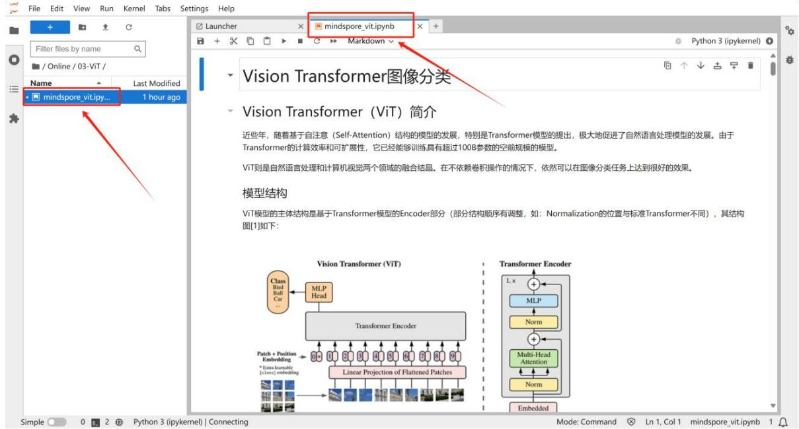


3) 单击 按钮可以运行此样例，然后在弹出的对话框中再单击 Restart按钮。

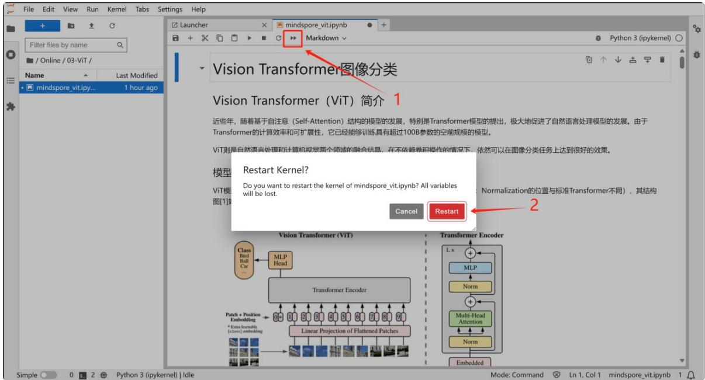


4) 待程序执行完成后，在推理文件夹（dataset/infer）下可以找到图片的推理结果（ILSVRC2012_test_00000279.JPEG），可以看出预测结果是 Doberman，与期望结果相同，验证了模型的准确性。如下图所示：

```txt
Downloading data from https://mindspore-courses.obs.cn-north-4.myhuaweicloud.com/orange-pi-online-infer/03-ViT/vit_b_16_224.ckt (330.2 MB) 
```

```txt
file_sizes: 100%| 346M/346M [01:53<00:00, 3.05MB/s]
Successfully downloaded file to ./vit_b_16_224.ckpt 
```

```txt
[ERROR] CORE(4893,e7ffee5f7020,python):2024-09-10-17:48:21.896.210 [mindspore/core/utils/file_utils.cc:253] GetRealPath] Get realpath failed, path[/tmp/ipykernel_4893/3144920803.py]
[WARNING] CORE(4893,e7ffee5f7020,python):2024-09-10-17:48:21.896.333 [mindspore/core/utils/info.cc:120] ToString] The file '/tmp/ipykernel_4893/3144920803.py' may not exists.
[ERROR] CORE(4893,e7ffee5f7020,python):2024-09-10-17:48:21.904.338 [mindspore/core/utils/file_utils.cc:253] GetRealPath] Get realpath failed, path[/tmp/ipykernel_4893/3144920803.py]
[WARNING] CORE(4893,e7ffee5f7020,python):2024-09-10-17:48:21.904.377 [mindspore/core/utils/info.cc:120] ToString] The file '/tmp/ipykernel_4893/3144920803.py' may not exists.
{236: 'Doberman'} 
```

```txt
推理过程完成后，在推理文件夹下可以找到图片的推理结果，可以看出预测结果是Doberman，与期望结果相同，验证了模型的准确性。
```


# 4.3.4. 运行 FCN 图像语义分割样例

图像语义分割（semantic segmentation）是图像处理和机器视觉技术中关于图像理解的重要一环，AI领域中一个重要分支，常被应用于人脸识别、物体检测、医学影像、卫星图像分析、自动驾驶感知等领域。语义分割的目的是对图像中每个像素点进行分类。与普通的分类任务只输出某个类别不同，语义分割任务输出与输入大小相同的图像，输出图像的每个像素对应了输入图像每个像素的类别。语义在图像领域指的是图像的内容，对图片意思的理解。

FCN（Fully Convolutional Networks）全卷积网络是首个端到端（end to end）进行像素级（pixel level）预测的全卷积网络。通过进行像素级的预测直接得出与原图大小相等的 label map。因 FCN 丢弃全连接层替换为全卷积层，网络所有层均为卷积层，故称为全卷积网络。

# FCN网络特点：

1.不含全连接层(fc)的全卷积(fully conv)网络，可适应任意尺寸输入。

2.增大数据尺寸的反卷积(deconv)层，能够输出精细的结果。

3.结合不同深度层结果的跳级(skip)结构，同时确保鲁棒性和精确性。

该样例可以对图像中的人和马进行分割。可以按照以下流程在 Jupyter Lab中运行该样例。

1) 首先在 Jupyter Lab 界面双击下图所示的 04-FCN，进入到该样例的目录中。


2) 在该目录下有运行该示例的所有资源，其中 mindspore_fcn8s.ipynb 是在 JupyterLab 中运行该样例的文件，双击打开 mindspore_fcn8s.ipynb，在右侧窗口中会显示此文件中的内容，如下图所示：

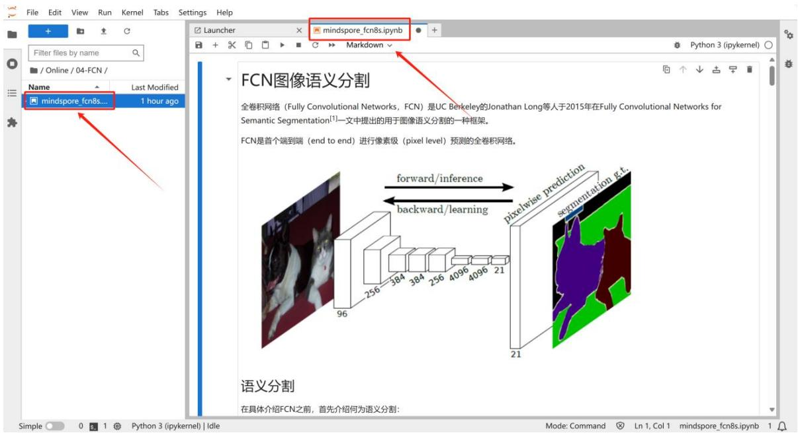


3) 单击 按钮可以运行此样例，然后在弹出的对话框中再单击 Restart按钮。

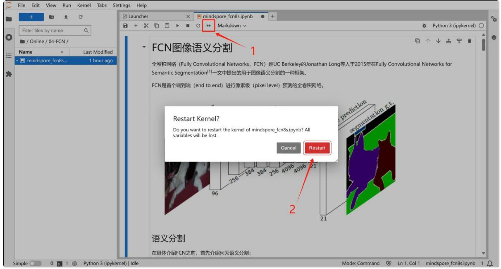


4)待程序执行完成后，在notebook文档中可以成功显示图像转换的结果。如下图所示：

```python
file_sizes: 100%| [REDACTED] | 1.08G/1.08G [01:21<00:00, 13.3MB/s]
Successfully downloaded file to FCN8s.ckpt
/home/ma-user/anaconda3/envs/MindSpore/lib/python3.9/site-packages/numpy/core/getlimits.py:549: UserWarning: The value of the smallest subnormal for <class 'numpy.float64'> type is zero.
    setattr(self, word, getattr(machar, word).flat[0])
/home/ma-user/anaconda3/envs/MindSpore/lib/python3.9/site-packages/numpy/core/getlimits.py:549: UserWarning: The value of the smallest subnormal for <class 'numpy.float32'> type is zero.
    setattr(self, word, getattr(machar, word).flat[0])
[ERROR] CORE(10263,ffffa13c9010,python):2024-09-06-09:47:55.932.574 [mindspore/core/utils/file_utils.cc:253] GetRealPath] Get realpath failed, path[/tmp/ipykernel_10263/2908278656.py]
[ERROR] CORE(10263,ffffa13c9010,python):2024-09-06-09:47:55.932.675 [mindspore/core/utils/file_utils.cc:253] GetRealPath] Get realpath failed, path[/tmp/ipykernel_10263/2908278656.py] 
```


# 4.3.5. 运行 ShuffleNet 图像分类样例

ShuffleNetV1 是旷视科技提出的一种计算高效的 CNN 模型，和 MobileNet, SqueezeNet等一样主要应用在移动端，所以模型的设计目标就是利用有限的计算资源来达到最好的模型精度。ShuffleNetV1的设计核心是引入了两种操作：Pointwise Group Convolution 和 Channel Shuffle，这在保持精度的同时大大降低了模型的计算量。因此，ShuffleNetV1和 MobileNet类似，都是通过设计更高效的网络结构来实现模型的压缩和加速。

可以按照以下流程在Jupyter Lab中运行该样例。

1) 首先在 Jupyter Lab 界面双击下图所示的 05-ShuffleNet，进入到该样例的目录中。


2) 在该目录下有运行该示例的所有资源，其中 mindspore_shufflenet.ipynb 是在Jupyter Lab 中运行该样例的文件，双击打开 mindspore_shufflenet.ipynb，在右侧窗口中会显示此文件中的内容，如下图所示：


3) 单击 按钮可以运行此样例，然后在弹出的对话框中再单击 Restart按钮。

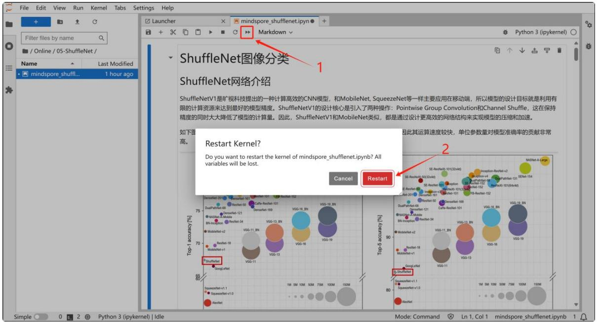


4) 待程序执行完成后，在 notebook 文档中可以成功显示图像分类的结果。如下图所示：


# 4.3.6. 运行 SSD 目标检测样例

SSD是单阶段的目标检测算法，它通过卷积神经网络进行特征提取。SSD会取出不同的特征层进行检测输出，所以 SSD是一种多尺度的检测方法。本样例所使用的数据集为 COCO 2017，为了更加方便地保存和加载数据，本样例中在数据读取前首先将 COCO数据集转换成 MindRecord格式。

我们可以按照以下流程在Jupyter Lab中运行该样例。

1) 首先在 Jupyter Lab 界面双击下图所示的 06-SSD，进入到该样例的目录中。

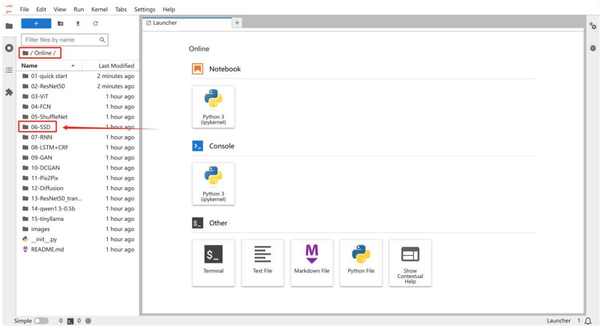


2) 在该目录下有运行该示例的所有资源，其中 mindspore_ssd.ipynb 是在 JupyterLab 中运行该样例的文件，双击打开mindspore_ssd.ipynb，在右侧窗口中会显示文件中的内容，如下图所示：

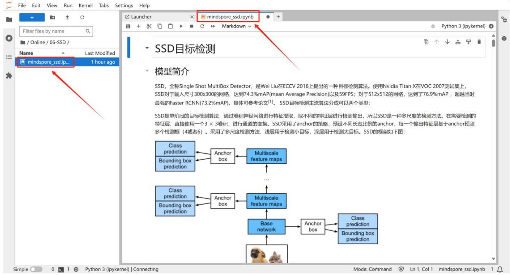


3) 单击 按钮可以运行该样例，然后在弹出的对话框中再单击Restart按钮。

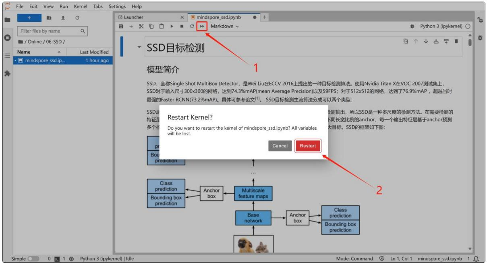


4) 待程序执行完成后，在 notebook 文档中会显示目标检测的结果。如下图所示：

```txt
creating index...
index created!
Running per image evaluation...
Evaluate annotation type *bbox*
DONE (t=4.92s).
Accumulating evaluation results...
DONE (t=1.10s).
Average Precision (AP) @[ IoU=0.50:0.95 | area= all | maxDets=100 ] = 0.001
Average Precision (AP) @[ IoU=0.50 | area= all | maxDets=100 ] = 0.002
Average Precision (AP) @[ IoU=0.75 | area= all | maxDets=100 ] = 0.000
Average Precision (AP) @[ IoU=0.50:0.95 | area= small | maxDets=100 ] = 0.000
Average Precision (AP) @[ IoU=0.50:0.95 | area= medium | maxDets=100 ] = 0.039
Average Precision (AP) @[ IoU=0.50:0.95 | area= large | maxDets=100 ] = 0.004
Average Recall (AR) @[ IoU=0.50:0.95 | area= all | maxDets= 1 ] = 0.001
Average Recall (AR) @[ IoU=0.50:0.95 | area= all | maxDets= 10 ] = 0.020
Average Recall (AR) @[ IoU=0.50:0.95 | area= all | maxDets=100 ] = 0.054
Average Recall (AR) @[ IoU=0.50:0.95 | area= small | maxDets=100 ] = 0.000
Average Recall (AR) @[ IoU=0.50:0.95 | area= medium | maxDets=100 ] = 0.057
Average Recall (AR) @[ IoU=0.50:0.95 | area= large | maxDets=100 ] = 0.283

====================

mAP: 0.0006232523571113707 
```

# 4.3.7. 运行 RNN 实现情感分类样例

情感分类是自然语言处理中的经典任务，是典型的分类问题。本案例使用 MindSpore实现一个基于RNN网络的情感分类模型，实现如下的效果：

<table><tr><td>输入: This film is terrible</td><td>输入: This film is great</td></tr><tr><td>正确标签: Negative</td><td>正确标签: Positive</td></tr><tr><td>预测标签: Negative</td><td>预测标签: Positive</td></tr></table>

我们可以按照以下流程在Jupyter Lab中运行该样例。

1) 首先在Jupyter Lab界面双击下图所示的07-RNN，进入到该样例的目录中。


2) 在该目录下有运行该示例的所有资源，其中 mindspore_sentiment_analysis.ipynb 是在 Jupyter Lab 中运行该样例的文件，双击打开 mindspore_sentiment_analysis.ipynb，在右侧窗口中会显示文件中的内容，如下图所示：

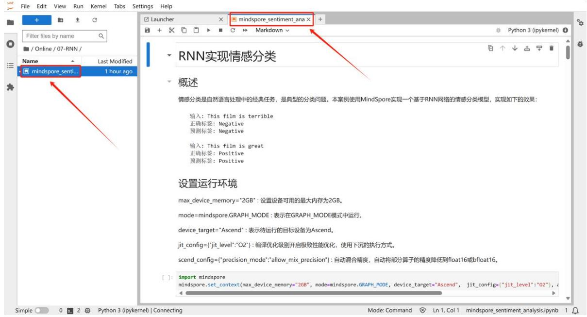


3) 单击 按钮可以运行该样例，然后在弹出的对话框中再单击Restart按钮。

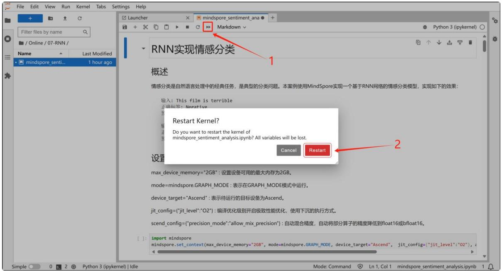


4) 待程序执行完成后，在 notebook 文档中会显示情感分类的结果。如下图所示：

[28]:'Negative' 

[29]:predict_sentiment(model, vocab, "This film is great") 

[29]:'Positive' 

# 4.3.8. 运行 LSTM+CRF 序列标注样例

序列标注指给定输入序列，给序列中每个 Token 进行标注标签的过程。序列标注问题通常用于从文本中进行信息抽取，包括分词(Word Segmentation)、词性标注(Position Tagging)、命名实体识别(Named Entity Recognition, NER)等。以命名实体识别为例：

# 输入序列清华大学座落于首都北京

输出标注Bーーー○○○○○B

如上表所示，清华大学和北京是地名，需要将其识别，我们对每个输入的单词预测其标签，最后根据标签来识别实体。

这里使用了一种常见的命名实体识别的标注方法——“BIOE”标注，将一个实体(Entity)的开头标注为B，其他部分标注为I，非实体标注为O。

我们可以按照以下流程在Jupyter Lab中运行该样例。

1) 首先在 Jupyter Lab 界面双击下图所示的 08-LSTM+CRF，进入到该样例的目录中。


2) 在该目录下有运行该示例的所有资源，其中 mindspore_sequence_labeling.ipynb是在 Jupyter Lab 中运行该样例的文件，双击打开 mindspore_sequence_labeling.ipynb，在右侧窗口中会显示文件中的内容，如下图所示：

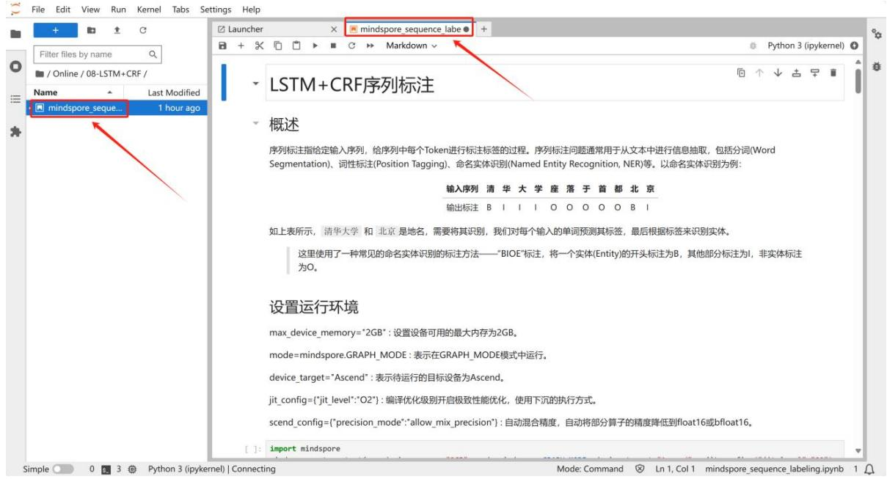


3) 单击 按钮可以运行此样例，然后在弹出的对话框中再单击Restart按钮。

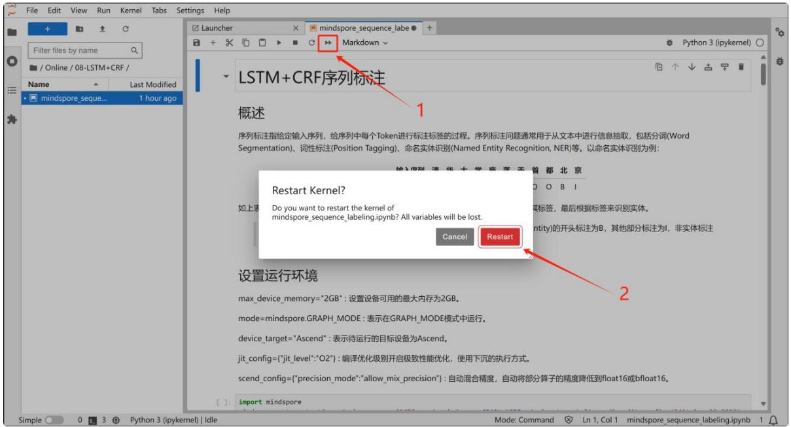


4) 待程序执行完成后，在 notebook 文档中会显示序列标注的结果。如下图所示：

```python
[21]: idx_to_tag = {idx: tag for tag, idx in tag_to_idx.items()}

def sequence_to_tag photograph(sequences, idx_to_tag):
    outputs = []
    for seq in sequences:
    outputs.append([idx_to_tag[i] for i in seq])
    return outputs 
```

```txt
[22]: sequence_to_tag(predict, idx_to_tag) 
```

```txt
[22]: [['B', 'I', 'I', 'I', 'O', 'O', 'O', 'O', 'O', 'B', 'I'], ['B', 'I', 'O', 'O', 'O', 'O', 'O', 'O'] 
```

# 4.3.9. 运行 GAN 图像生成样例

生成式对抗网络(Generative Adversarial Networks，GAN)是一种生成式机器学习模型，是近年来复杂分布上无监督学习最具前景的方法之一。其主要由两个不同的模型共同组成——生成器(Generative Model)和判别器(Discriminative Model)。

生成器的任务是生成看起来像训练图像的“假”图像；

判别器需要判断从生成器输出的图像是真实的训练图像还是虚假的图像。

GAN通过设计生成模型和判别模型这两个模块，使其互相博弈学习产生了相当好的输出。GAN模型的核心在于提出了通过对抗过程来估计生成模型这一全新框架。在这个框架中，将会同时训练两个模型——捕捉数据分布的生成模型 G和估计样本是否来自训练数据的判别模型D

在训练过程中，生成器会不断尝试通过生成更好的假图像来骗过判别器，而判别器在这过程中也会逐步提升判别能力。这种博弈的平衡点是，当生成器生成的假图像和训练数据图像的分布完全一致时，判别器拥有50%的真假判断置信度。

下面我们简要说明生成器和判别器的博弈过程：

1. 在训练刚开始的时候，生成器和判别器的质量都比较差，生成器会随机生成一个数据分布。

2. 判别器通过求取梯度和损失函数对网络进行优化，将靠近真实数据分布的数据判定为 1，将靠近生成器生成出来数据分布的数据判定为0。

3. 生成器通过优化，生成出更加贴近真实数据分布的数据。

4. 生成器所生成的数据和真实数据达到相同的分布，此时判别器的输出为 1/2。


(a)


(b)


（c）


(d)


在上图中，蓝色虚线表示判别器，黑色虚线表示真实数据分布，绿色实线表示生成器生成的虚假数据分布，z 表示隐码，x 表示生成的虚假图像G(z)。

我们可以按照以下流程在Jupyter Lab中运行该样例。

1)首先在Jupyter Lab界面双击下图所示的09-GAN，进入到该样例的目录中。


2) 在该目录下有运行该示例的所有资源，其中 mindspore_gan.ipynb 是在 JupyterLab 中运行该样例的文件，双击打开mindspore_gan.ipynb，在右侧窗口中会显示此文件中的内容，如下图所示：

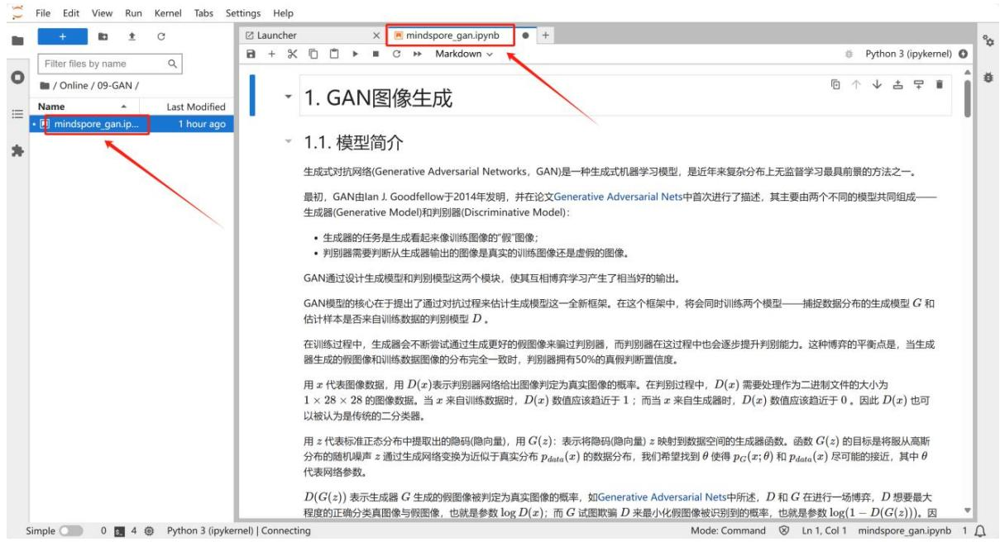


3) 单击 按钮可以运行该样例，然后在弹出的对话框中再单击Restart按钮。

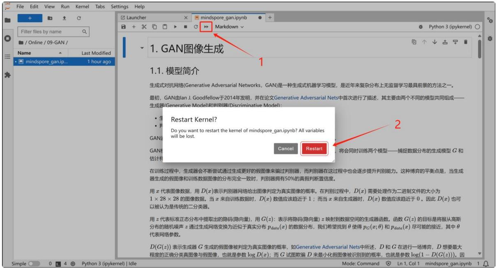


4)如下图所示，待程序执行完成后，在 notebook文档中可以成功显示通过加载生成器网络模型参数文件来生成的图像：

```txt
Downloading data from https://clouddrive-kwe.huawei.com/kwe7/api/7606233104CC74CA2FA4D9FD2E46A535214755A9ABD9DF77F8BD3E79/476dac3cb5e0711ce51fead5004be1d4/Generator199.ckpt (5.8 MB) 
```

```txt
file_sizes: 100% | 6.06M/6.06M [00:00<00:00, 32.7MB/s]
[WARNING] ME(17688:281473359740944,MainProcess):2024-09-04-15:30:44.963.035 [mindspore/train/serialization.py:1469] For 'load_param_into_net', remove parameter prefix name: optim_g, continue to load.
Successfully downloaded file to ./Generator199.ckpt
[ERROR] CORE(17688,ffff9f9f0010,python):2024-09-04-15:30:45.207.436 [mindspore/core/utils/file_utils.cc:253] GetRealPath]
Get realpath failed, path[/tmp/ipykernel_17688/3799052259.py]
[ERROR] CORE(17688,ffff9f9f0010,python):2024-09-04-15:30:45.207.521 [mindspore/core/utils/file_utils.cc:253] GetRealPath]
Get realpath failed, path[/tmp/ipykernel_17688/3799052259.py] 
```


# 4.3.10. 运行 DCGAN 生成漫画头像样例

DCGAN（深度卷积对抗生成网络，Deep Convolutional Generative AdversarialNetworks）是 GAN的直接扩展。不同之处在于，DCGAN会分别在判别器和生成器中使用卷积和转置卷积层。

本案例将使用动漫头像数据集来训练一个生成式对抗网络，接着使用该网络生

成动漫头像图片。

我们可以按照以下流程在Jupyter Lab中运行该样例。

1) 首先在 Jupyter Lab 界面双击下图所示的 10-DCGAN，进入到该样例的目录中。


2) 在该目录下有运行该示例的所有资源，其中 mindspore_dcgan.ipynb 是在 Jupyter Lab 中运行该样例的文件，双击打开 mindspore_dcgan.ipynb，在右侧窗口中会显示此文件中的内容，如下图所示：

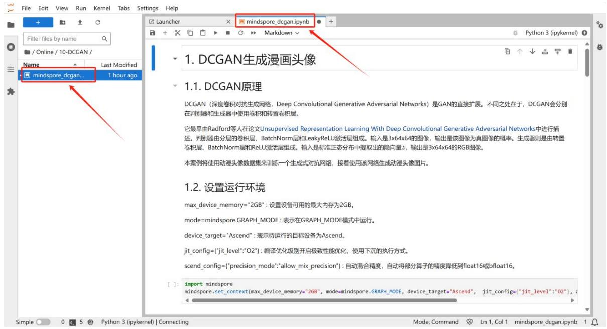


3) 单击 按钮可以运行此样例，然后在弹出的对话框中再单击 Restart按钮。

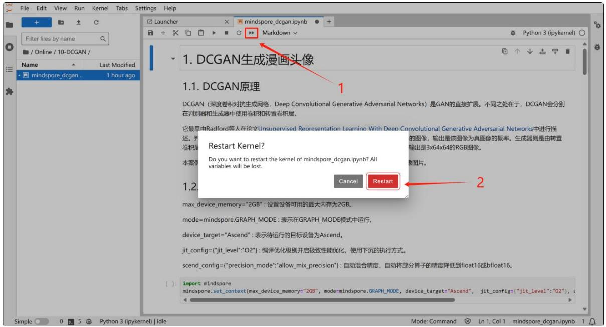


4)如下图所示，待程序执行完成后，在 notebook文档中可以成功显示生成的动漫头像图片：


# 4.3.11. 运行 Pix2Pix 实现图像转换样例

Pix2Pix 是基于条件生成对抗网络（cGAN, Condition Generative AdversarialNetworks ）实现的一种深度学习图像转换模型，该模型是由 Phillip Isola等作者在2017年 CVPR上提出的，可以实现语义/标签到真实图片、灰度图到彩色图、航空图到地图、白天到黑夜、线稿图到实物图的转换。Pix2Pix是将 cGAN应用于有监督的图像到图像翻译的经典之作，其包括两个模型：生成器和判别器。

传统上，尽管此类任务的目标都是相同的从像素预测像素，但每项都是用单独的专用机器来处理的。而 Pix2Pix使用的网络作为一个通用框架，使用相同的架构和目标，只在不同的数据上进行训练，即可得到令人满意的结果，鉴于此许多人已经使用此网络发布了他们自己的艺术作品。

我们可以按照以下流程在Jupyter Lab中运行该样例。

1) 首先在 Jupyter Lab 界面双击下图所示的 11-Pix2Pix，进入到该样例的目录中。

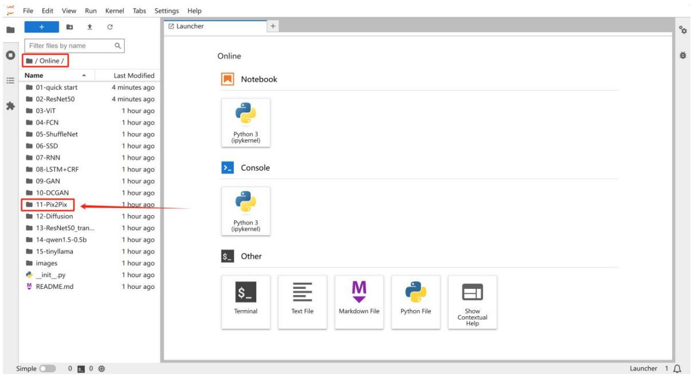


2) 在该目录下有运行该示例的所有资源，其中 mindspore_pix2pix.ipynb 是在 Jupyter Lab 中运行该样例的文件，双击打开 mindspore_pix2pix.ipynb，在右侧窗口中会显示此文件中的内容，如下图所示：

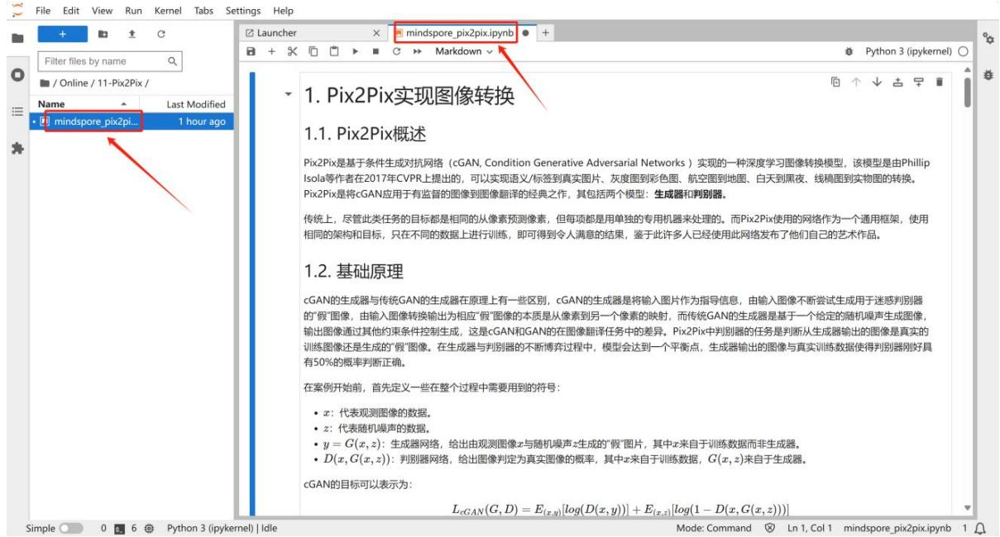


3) 单击 按钮可以运行该样例，然后在弹出的对话框中再单击Restart按钮。

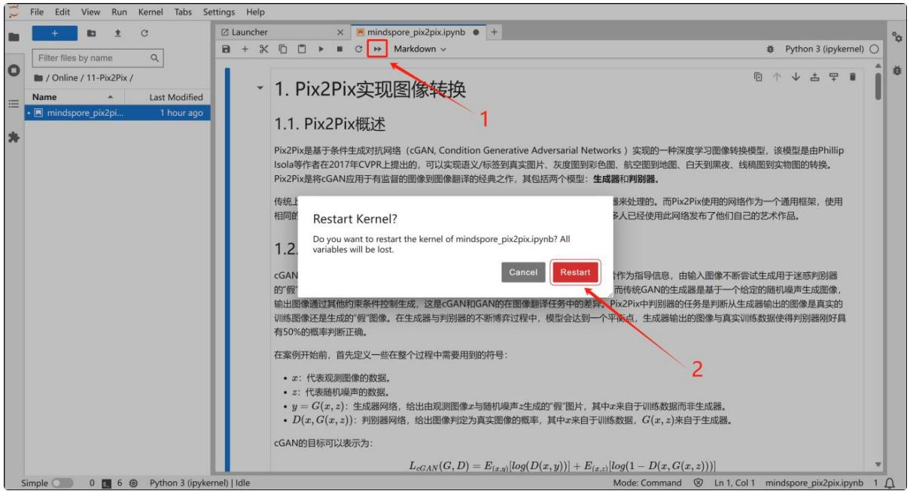


4)待程序执行完成后，在notebook文档中可以成功显示图像转换的结果。如下图所示：


time: 280.9498896598816


各数据集分别推理的效果如下


ndui


# 4.3.12. 运行 Diffusion 扩散模型样例

本案例的介绍是基于 denoising diffusion probabilistic model （DDPM），DDPM已经在（无）条件图像/音频/视频生成领域取得了较多显著的成果。本案例是在 Phil Wang 基于 PyTorch 框架的复现的基础上（而它本身又是基于 TensorFlow 实现），迁移到 MindSporeAI 框架上实现的。

我们可以按照以下流程在Jupyter Lab中运行该样例。

1) 首先在 Jupyter Lab 界面双击下图所示的 12-Diffusion，进入到该样例的目录中。


2) 在该目录下有运行该示例的所有资源，其中 mindspore_diffusion.ipynb 是在Jupyter Lab 中运行该样例的文件，双击打开 mindspore_diffusion.ipynb，在右侧窗口中会显示此文件中的内容，如下图所示：

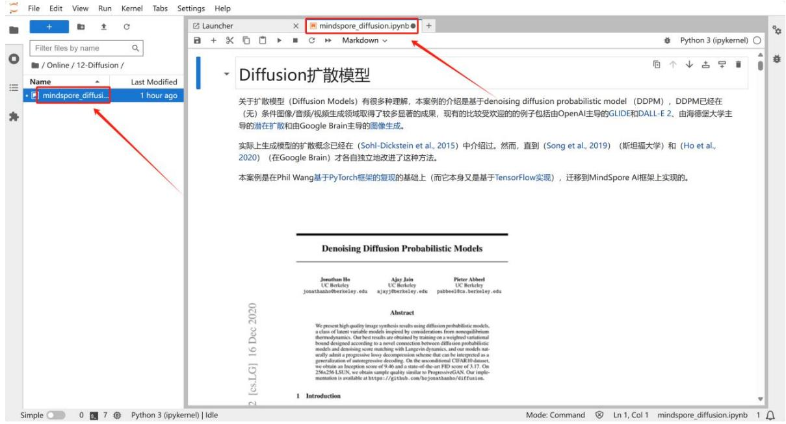


3) 单击 按钮可以运行该样例，然后在弹出的对话框中再单击Restart按钮。

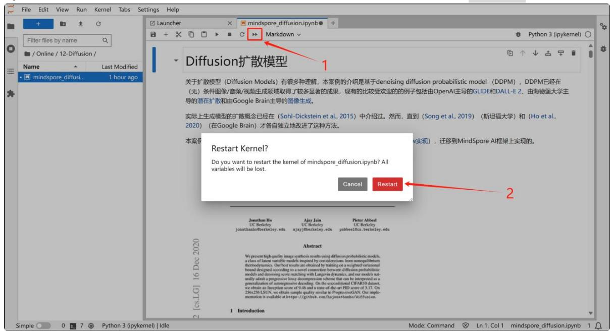


4)如下图所示，待程序执行完成后，在 notebook文档中可以看到这个模型能产生一件衣服！：

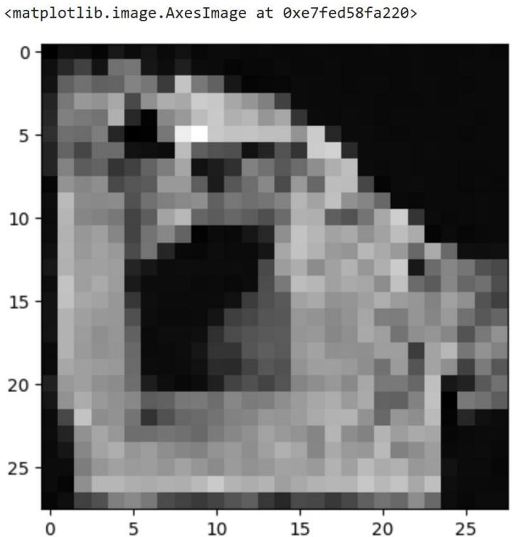


# 4.3.13. 运行 ResNet50 迁移学习样例

在实际应用场景中，由于训练数据集不足，所以很少有人会从头开始训练整个网络。普遍的做法是，在一个非常大的基础数据集上训练得到一个预训练模型，然后使用该模型来初始化网络的权重参数或作为固定特征提取器应用于特定的任务中。本案例将使用迁移学习的方法对ImageNet 数据集中的狼和狗图像进行分类。

我们可以按照以下流程在Jupyter Lab中运行该样例。

1) 首先在 Jupyter Lab 界面双击下图所示的 13-ResNet50_transfer，进入到该样例的目录中。


2) 在该目录下有运行该示例的所有资源，其中 mindspore_transfer_learning.ipynb是在 Jupyter Lab 中运行该样例的文件，双击打开 mindspore_transfer_learning.ipynb，在右侧窗口中会显示此文件中的内容，如下图所示：

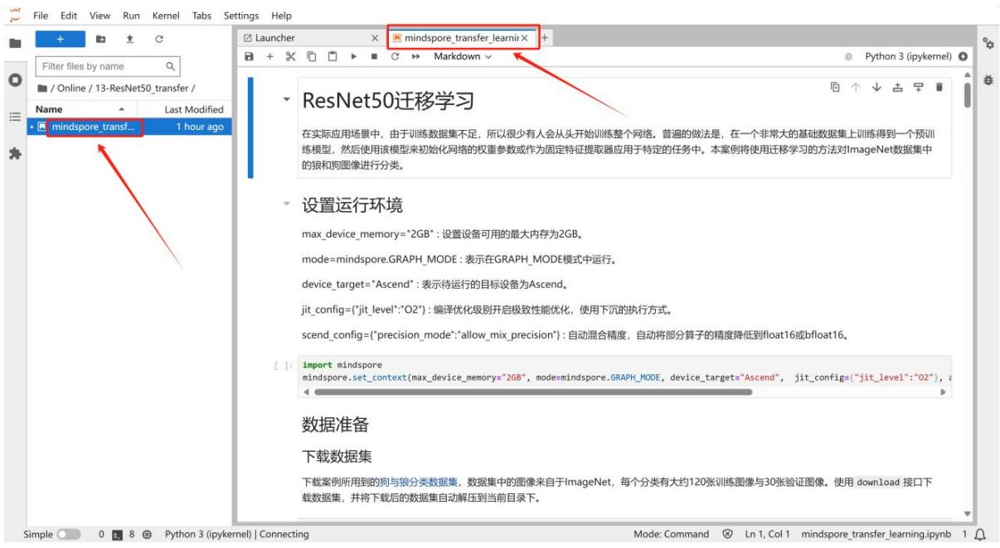


3) 单击 按钮可以运行此样例，然后在弹出的对话框中再单击 Restart按钮。

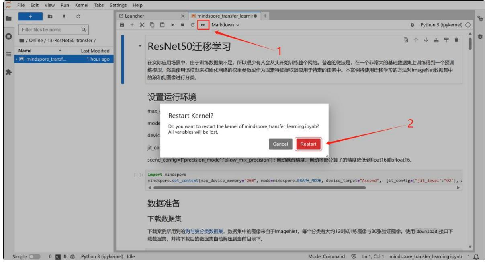


4)待程序执行完成后，在notebook文档中可以成功显示ResNet50迁移学习的结果。如下图所示：


# 4.4. 运行 llm 大语言模型的方法

注意：我们目前测试发现，必须同时满足以下依赖条件，才能正常的运行大模型的推理程序。只支持在ubuntu系统上运行，欧拉系统上有不兼容的问题。推荐直接使用最新发布的镜像，我们都已经配置好了。如果不想重刷镜像，可以按照“orange-pi-mindspore/Online/14-qwen1.5-0.5b/昇思MindSpore香橙派qwen聊天机器人指导手册.md”中写的方法进行环境配置。

1. ubuntu系统

2. Ascend-cann-toolkit_8.0.0 

3. Ascend-cann-kernels-310b_8.0.0 

4. mindspore 2.5.0 

5. mindnlp 0.4.1 

6. gradio 4.44.0 

两个大模型案例分别是“orange-pi-mindspore/Online”目录下的 14 和 15 号案例。

注意，当前两个llm案例的模型只能在 24GB内存的开发板上运行。12GB内存的开发板会由于内存的原因而报错。

运行模型的时候，请务必关闭swap，否则会出现线程同步失败导致无法运行的问题。运行sudo swapoff /swapfile命令即可关闭系统上的swap分区。

# 4.4.1. qwen1.5-0.5b

1) 执行以下命令启动推理。

```txt
(base) HwHiAiUser@orangepiaipro-20t:~/orange-pi-mindspore/Online/14-qwen1.5-0.5b
$ python qwen1.5-0.5b.py 
```

2) 第一次启动会自动下载模型，具体时间视网络环境而定，模型会被下载到“~/orange-pi-mindspore/Online/14-qwen1.5-0.5b/.mindnlp/model/Qwen/Qwen1.5-0.5B-Chat/”文件夹内。

3) 推理代码默认在启动的时候会检查相关的依赖，此时如果网络环境不好，会导致无法启动。如果不是第一次启动，且模型已经下载完成，可以按照下面的说明修改启动代码，将路径改成本地绝对路径，这样就可以离线启动了。

```txt
(base) HwHiAiUser@orangepiaipro-20t:~/orange-pi-mindspore/Online/14-qwen1.5-0.5b
$ vim qwen1.5-0.5b.py 
```

将代码中 8，9 两行修改成下面的样子，也就是把“Qwen/Qwen1.5-0.5B-Chat”改成“/home/HwHiAiUser/orange-pi-mindspore/Online/14-qwen1.5-0.5b/.mindnlp/model/Qwen/Qwen1.5-0.5B-Chat”：

```python
\import gradio as gr
import mindspore
from mindnlp.transformers import AutoModelForCausalLM, AutoTokenizer
from mindnlp.transformers import TextIteratorStreamer
from threading import Thread

# Loading the tokenizer and model from Hugging Face's model hub.
tokenizer = AutoTokenizer.from_pretrained("/home/HwHiAiUser/orange-pi-mindspore/Online/14-qwen1.5-0.5b/.mindnlp/model/Qwen/Qwen1.5-0.5B-Chat", ms_dtype=mindspore.float16)
model = AutoModelForCausalLM.from_pretrained("/home/HwHiAiUser/orange-pi-mindspore/Online/14-qwen1.5-0.5b/.mindnlp/model/Qwen/Qwen1.5-0.5B-Chat", ms_dtype=mindspore.float16) 
```

4) 等待一会，会出现一个 ip，复制到开发板上的浏览器的地址栏访问。

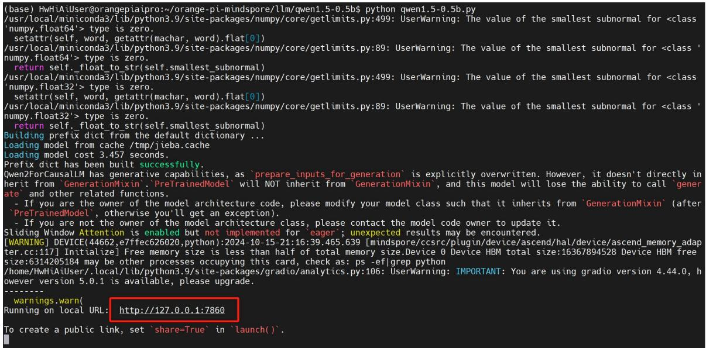


5) 启动后，可在页面下方消息输入框“Type a message…”中输入任何问题，或者点击下方 Examples 中设置好的问题，然后点击右侧的“Submit”按钮，Qwen 模型将对此进行回答。


6) 第一次回答需要较长时间加载，大约需要 1分钟，请耐心等待。回答将显示在上方聊天框中。

7) 如果出现 Error，可以点击“retry”按钮重新发送上一条消息，并让模型重新回答；点击“undo”按钮可撤回上一条消息；点击“clear”按钮将清空聊天框中的对话。


8) 输出结果如下图所示：


# 4.4.2. Tinyllama

注意，目前12GB内存的开发板是无法运行这个案例的。

运行模型的时候，请务必关闭swap，否则会出现线程同步失败导致无法运行的问题。运行sudo swapoff /swapfile命令即可关闭系统上的swap分区。

1) 执行以下命令启动推理。

(base) HwHiAiUser@orangepiaipro-20t:~/orange-pi-mindspore/Online/15-tinyllama$ py thon app.py 

2) 第一次启动会自动下载模型，具体时间视网络环境而定，模型会被下载到“~/orange-pi-mindspore/Online/15-tinyllama/.mindnlp/model/TinyLlama/TinyLlama-1.1B-Chat-v1.0/”文件夹内。3) 推理代码默认在启动的时候会检查相关的依赖，此时如果网络环境不好，会导致无法启动。如果不是第一次启动，且模型已经下载完成，可以按照下面的说明修改启动代码，将路径改成本地绝对路径，这样就可以离线启动了。

(base) HwHiAiUser@orangepiaipro-20t:~/orange-pi-mindspore/Online/15-tinyllama$ vim ap.py 

将代码中 8，9 两行修改成下面的样子，也就是把“TinyLlama/TinyLlama-1.1

B-Chat-v1.0”改成“/home/HwHiAiUser/orange-pi-mindspore/Online/15-tinyllama/.mindnlp/model/TinyLlama/TinyLlama-1.1B-Chat-v1.0”：

```python
import gradio as gr
import mindspore
from mindnlp.transformers import AutoModelForCausalLM, AutoTokenizer
from mindnlp.transformers import StoppingCriteria, StoppingCriteriaList, TextIteratorStreamer
from threading import Thread

# Loading the tokenizer and model from Hugging Face's model hub.
tokenizer = AutoTokenizer.from_pretrained("/home/HwHiAiUser/orange-pi-mindspore/Online/15-tinyllama/.mindnlp/model/TinyLlama/TinyLlama-1.1B-Chat-v1.0")
model = AutoModelForCausalLM.from_pretrained("/home/HwHiAiUser/orange-pi-mindspore/Online/15-tinyllama/.mindnlp/model/TinyLlama/TinyLlama-1.1B-Chat-v1.0", ms_dtype=mindspore.float16)
print(model.dtype) 
```

4) 等待一会，会出现一个 ip，复制到开发板上的浏览器的地址栏访问。

```python
(base) HwHiAiUser@orangepiaipro:~/orange-pi-mindspore/llm/tinyllama$ python app.py
/usr/local/miniconda3/lib/python3.9/site-packages/numpy/core/getlimits.py:499: UserWarning: The value of the smallest subnormal for <class 'numpy.float64'> type is zero.
    setattr(self, word, getattr(machar, word).flat[0])
/usr/local/miniconda3/lib/python3.9/site-packages/numpy/core/getlimits.py:89: UserWarning: The value of the smallest subnormal for <class 'numpy.float64'> type is zero.
    return self._float_to_str(self.smallest_subnormal)
/usr/local/miniconda3/lib/python3.9/site-packages/numpy/core/getlimits.py:499: UserWarning: The value of the smallest subnormal for <class 'numpy.float32'> type is zero.
    setattr(self, word, getattr(machar, word).flat[0])
/usr/local/miniconda3/lib/python3.9/site-packages/numpy/core/getlimits.py:89: UserWarning: The value of the smallest subnormal for <class 'numpy.float32'> type is zero.
    return self._float_to_str(self.smallest_subnormal)
Building prefix dict from the default dictionary ...
Loading model from cache /tmp/jieba.cache
Loading model cost 3.461 seconds.
Prefix dict has been built successfully.
LlamaForCausalLM has generative capabilities, as 'prepare_inputs_for_generation' is explicitly overwritten. However, it doesn't directly in herit from 'GenerationMixin'. 'PreTrainedModel' will NOT inherit from 'GenerationMixin', and this model will lose the ability to call 'generate' and other related functions.
- If you are the owner of the model architecture code, please modify your model class such that it inherits from 'GenerationMixin' (after 'PreTrainedModel', otherwise you'll get an exception).
- If you are not the owner of the model architecture class, please contact the model code owner to update it.
[WARNING] DEVICE(59752.e7ffe4046020.python):2024-10-15-21:39:15.726.028 [mindspore/ccsrc/plugin/device/ascend/hal/device/ascend_memory_adapter.cc:117] Initialize] Free memory size is less than half of total memory size.Device 0 Device HBM total size:16367894528 Device HBM free size:5305196544 may be other processes occupying this card, check as: ps -ef|grep python
Float16
Running on local URL: http://127.0.0.1:7860
To create a public link, set 'share=True' in 'launch()'.
/home/HwHiAiUser/.local/lib/python3.9/site-packages/gradio/analytics.py:106: UserWarning: IMPORTANT: You are using gradio version 4.44.0, however version 5.0.1 is available, please upgrade.
----------------艱 warnings.warn
```

5) 启动后，可在页面下方消息输入框“Type a message…”中输入任何问题，或者点击下方 Examples 中设置好的问题，然后点击右侧的“Submit”按钮，Tinyllama模型将对此进行回答。


# 4.4.3. DeepSeek-R1-Distill-Qwen-1.5B

注意，目前12GB内存的开发板是无法运行这个案例的。

运行模型的时候，请务必关闭swap，否则会出现线程同步失败导致无法运行的问题。运行sudo swapoff /swapfile命令即可关闭系统上的swap分区。

6) 执行以下命令启动推理。

```txt
(base) HwHiAiUser@orangepiaipro-20t:~/orange-pi-mindspore/Online/17-DeepSeek-R1-Distill-Qwen-1.5B$ python deepseek-r1-distill-qwen-1.5b.py 
```

7) 第一次启动会自动下载模型，具体时间视网络环境而定，模型会被下载到“~/orange-pi-mindspore/Online/17-DeepSeek-R1-Distill-Qwen-1.5B/.mindnlp/model/deepseek-ai/DeepSeek-R1-Distill-Qwen-1.5B”文件夹内。

8) 推理代码默认在启动的时候会检查相关的依赖，此时如果网络环境不好，会导致无法启动。如果不是第一次启动，且模型已经下载完成，可以按照下面的说明修改启动代码，将路径改成本地绝对路径，这样就可以离线启动了。

```powershell
(base) HwHiAiUser@orangepiaipro-20t:~/orange-pi-mindspore/Online/17-DeepSeek-R1-Distill-Qwen-1.5B$ vim deepseek-r1-distill-qwen-1.5b.py 
```

将代码中 8，9 两行修改成下面的样子，也就是把“deepseek-ai/DeepSeek-R1-Distill-Qwen-1.5B”改成“/home/HwHiAiUser/orange-pi-mindspore/Online/17-DeepSeek-R1-Distill-Qwen-1.5B/.mindnlp/model/deepseek-ai/DeepSeek-R1-Distill-Qwen-1.5B”：

```python
import gradio as gr
import mindspore
from mindnlp.transformers import AutoModelForCausalLM, AutoTokenizer
from mindnlp.transformers import TextIteratorStreamer
from threading import Thread

# Load the tokenizer and model from MindNLP.
# Note: To use MindNLP, you need to install it first. Ensure you are using the master branch of MindNLP,
# which supports downloading the MindNLP-specific weights from Modelers.
tokenizer = AutoTokenizer.from_pretrained("/home/HwHiAiUser/orange-pi-mindspore/Online/17-DeepSeek-R1-Distill-Qwen-1.5B/.mindnlp/model/deepseek-ai/DeepSeek-R1-Distill-Qwen-1.5B", mirror="modelers", ms_dtype=mindspore.float16)
model = AutoModelForCausalLM.from_pretrained("/home/HwHiAiUser/orange-pi-mindspore/Online/17-DeepSeek-R1-Distill-Qwen-1.5B/.mindnlp/model/deepseek-ai/DeepSeek-R1-Distill-Qwen-1.5B", mirror="modelers", ms_dtype=mindspore.float16) 
```

9) 等待一会，会出现一个 ip，复制到开发板上的浏览器的地址栏访问。

```txt
- If you are the owner of the model architecture code, please modify your model class such that it inherits from `GenerationMixin` (after `PreTrainedModel`, otherwise you'll get an exception).
- If you are not the owner of the model architecture class, please contact the model code owner to update it. Sliding Window Attention is enabled but not implemented for `eager`, unexpected results may be encountered. [WARNING] DEVICE(17752,e7ffde089020,python3):2025-02-10-20:13:29.684.892 [mindspore/ccsrc/plugin/device/ascend/hal/device/ascend_memory_adapter.cc:117] Initialize] Free memory size is less than half of total memory size.Device 0 Device HBM total size:24823529472 Device HBM free size:12277534720 may be other processes occupying this card, check as: ps -ef|grep python /home/HwHiAiUser/.local/lib/python3.9/site-packages/gradio/analytics.py:106: UserWarning: IMPORTANT: You are using gradio version 4.44.0, however version 4.44.1 is available, please upgrade.
----------------
    warnings.warn(
    Running on local URL: http://127.0.0.1:7860
To create a public link, set `share=True` in `launch()`. 
```

10) 启动后，可在页面下方消息输入框“Type a message…”中输入任何问题，或者点击下方 Examples 中设置好的问题，然后点击右侧的“Submit”按钮，DeepSeek-R1-Distill-Qwen-1.5B 模型将对此进行回答。


# 11) 输出结果如下所示：


# 4.5. 运行离线推理案例的方法

详见开发板内置案例的Offline 文件夹或Github的如下链接：

https://github.com/mindspore-courses/orange-pi-mindspore/tree/master/Offline 

# 5. AI 应用环境安装(OpenHarmony)

# 5.1. 推理环境安装

1) 从开发板的资料下载页面下载想要 Ascend310B-OpenHarmony-CANN.zip 压缩包

2) 将装有 OpenHarmony 系统的 TF 卡通过读卡器连接到 Linux PC

3) 使用 lsblk可以看到各个分区及大小

```txt
(base) root@orangepiaipro-20t:~# lsblk
NAME MAJ:MIN RM SIZE RO TYPE MOUNTPOINTS
sdx 8:0 1 59.5G 0 disk
|—sdx1 8:1 1 100M 0 part
|—sdx2 8:2 1 39.7G 0 part
|—sdx3 8:3 1 100M 0 part
|—sdx4 8:4 1 3G 0 part
|—sdx5 8:5 1 9.8G 0 part
|—sdx6 8:6 1 512M 0 part
|—sdx7 8:7 1 512M 0 part 
```

4) 挂载目录，如果 linux 已自动挂载sdx2可跳过此步骤

```batch
mount -o rw /dev/sdx2 /home/test 
```

5) 解压文件，解压后 data1文件夹大小为 12GB左右，等待同步完成后解除挂载。

```txt
unzip Ascend310B-OpenHarmony-CANN.zip -d /home/test/. sync 
```

6) 解挂载

```txt
umount /dev/sdx2 
```

7) 使用 TF 卡启动 AI PRO 20T OpenHarmony 系统,参考 OpenHarmony 系统开发板启动步骤，等待init.sh执行完成重启后再进行下面的步骤。

8) OpenHarmony 启动后，输入以下命令初始化环境

```shell
cd /data1/
mount -o rw, remount /
chmod 777 *.sh
bash initmodel.sh 
```

如果 initmodel.sh 执行失败，屏蔽第一行 devmem 0xc42e0000 8 0x0 后重试


9) 安装 runtime


```batch
cd /data1/nnrt/run_package/runtime
./runtime/scripts/install.sh -- -- --full 
```

```ini
# ./run_runtime_upgrade.sh
./data1/nnrt/run_package//runtime/runtime/scripts/install.sh --- -- -full
/system/btn/sh: ./data1/nnrt/run_package//runtime/runtime/scripts/install.sh: inaccessible or not found
kage runtime/runtime/scripts/install.sh --- -- -full
[Runtime] [1970-01-01 08:22:50] [INFO]: Start time:1970-01-01 08:22:50
[Runtime] [1970-01-01 08:22:50] [INFO]: LogFile:/var/log/ascend_seclog/ascend_install.log
[Runtime] [1970-01-01 08:22:50] [INFO]: InputParams---full
[Runtime] [1970-01-01 08:22:50] [INFO]: OperationLogFile:/var/log/ascend_seclog/operation.log
[Runtime] [1970-01-01 08:22:50] [INFO]: Check version matched!
[Runtime] [1970-01-01 08:22:50] [INFO]: base version is none.
[Runtime] [1970-01-01 08:22:50] [INFO]: parent_dir value is [/usr/local] and children_dir value is [Ascend]
[Runtime] [1970-01-01 08:22:50] [INFO]: [Ascend] belongs to root.
[Runtime] [1970-01-01 08:22:50] [INFO]: [Ascend] permission is ok.
[Runtime] [1970-01-01 08:22:51] [INFO]: parent_dir value is [/usr] and children_dir value is [local]
[Runtime] [1970-01-01 08:22:51] [INFO]: [local] belongs to root.
[Runtime] [1970-01-01 08:22:51] [INFO]: [local] permission is ok.
[Runtime] [1970-01-01 08:22:51] [INFO]: parent_dir value is [/] and children_dir value is [usr]
[Runtime] [1970-01-01 08:22:51] [INFO]: [usr] belongs to root.
[Runtime] [1970-01-01 08:22:51] [INFO]: user permission is ok.
[Runtime] [1970-01-01 08:22:51] [INFO]: parent_dir value is [/] and children_dir value is [/]
[Runtime] [1970-01-01 08:22:51] [INFO]: parent_dirs_permission_check succeeded
[Runtime] [1970-01-01 08:22:51] [INFO]: Runtime package has been installed on the path /usr/local/Ascend, the version is none, and the version of this package is 7. 1.0.3.220, do you want to continue? [y/n]
y
[Runtime] [1970-01-01 08:22:54] [WARNING]: run_runtime_uninstall.sh not found.
[Runtime] [1970-01-01 08:22:54] [INFO]: Some files generated by user are not cleared, if necessary, manually clear them, get details in /var/log/ascend_seclog/ascend_install.log
[Runtime] [1970-01-01 08:22:55] [INFO]: install /usr/local/Ascend full
[Runtime] [1970-01-01 08:22:55] [INFO]: step into run_runtime_install.sh ......
[Runtime] [1970-01-01 08:22:55] [INFO]: install target dir /usr/local/Ascend/7.0.0, type full.
[Runtime] [1970-01-01 08:22:55] [INFO]: no need to install runtime files.
[Runtime] [1970-01-01 08:22:55] [INFO]: runtime install upgradePercentage:100%
[Runtime] [1970-01-01 08:22:55] [INFO]: Base version set successfully!
[Runtime] [1970-01-01 08:22:55] [INFO]: Runtime package installed successfully! The new version takes effect immediately.
Please make sure that
-LD_LIBRARY_PATH includes /usr/local/Ascend/7.0.0/runtime/lib64
[Runtime] [1970-01-01 08:22:55] [INFO]: End time:1970-01-01 08:22:55 
```


10) 安装 pyacl；


```batch
cd /data1/nnrt/run_package/pyacl
./script/install.sh -- -- --full 
```

```shell
# cd pyacl/
# ls
python script
# ./script/install.sh -- -- --full
# ./script/install.sh
[pyACL] [1970-01-01 08:04:13] [INFO] install start
[pyACL] [1970-01-01 08:04:13] [INFO] delete file /usr/local/Ascend/latest/pyACL successfully
[pyACL] [1970-01-01 08:04:13] [INFO] delete file /usr/local/Ascend/latest/python/site-packages/acl.so successfully
[pyACL] [1970-01-01 08:04:13] [INFO] delete file /usr/local/Ascend/latest/python/site-packages/acl.acl.so successfully
Please make sure that
- PYTHONPATH includes /usr/local/Ascend/7.0.0/python
[pyACL] [1970-01-01 08:04:13] [INFO] Ascend-pyACL-7.0.0 install success 
```


11) 安装 test；


```shell
cd /data1/nnrt/run_package/test
./script/install.sh -- -- --full --install-path=/usr/local/Ascend/ 
```

```shell
#
# cd /data1/nnrt/run_package/test
# ./script/install.sh -- -- --full --install-path=/usr/local/Ascend/
--install-path=/usr/local/Ascend/
[test-ops] [1970-01-01 08:02:52] [INFO]: new_version_info 7.0.0
[test-ops] [1970-01-01 08:02:53] [INFO]: your install path is /usr/local/Ascend//7.0.0/opp/test-ops
[test-ops] [1970-01-01 08:02:53] [INFO]: install is success
[test-ops] [1970-01-01 08:02:53] [INFO]: re-install successfully
# 
```

# 12) 安装 aicpu

```shell
cd /data1/nnrt/run_package/aicpu
./aicpu/script/install.sh -- -- --full 
```

```ini
# ./aicpu/script/install.sh -- -- --full
[Aicpu] [1970-01-01 10:21:38] [INFO]: Start time: 1970-01-01 10:21:38
[Aicpu] [1970-01-01 10:21:38] [INFO]: LogFile: /var/log/ascend_seclog/ascend_install.log
[Aicpu] [1970-01-01 10:21:38] [INFO]: OperationLogFile: /var/log/ascend_seclog/operation.log
[Aicpu] [1970-01-01 10:21:38] [WARNING]: ascend_install.info not exist
[Aicpu] [1970-01-01 10:21:38] [INFO]: do you want to continue installing? [y/n]
y
[Aicpu] [1970-01-01 10:21:46] [INFO]: Some files generated by user are not cleared, if necessary, manually clear them, get details in /var/log/ascend log/ascend_install.log
[Aicpu] [1970-01-01 10:21:46] [INFO]: upgradePercentage: 20%
[Aicpu] [1970-01-01 10:21:54] [INFO]: upgradePercentage: 50%
[Aicpu] [1970-01-01 10:21:55] [INFO]: upgradePercentage: 100%
[Aicpu] [1970-01-01 10:21:55] [INFO]: Aicpu_kernels package installed successfully! The new version takes effect immediately.
[Aicpu] [1970-01-01 10:21:55] [INFO]: Using requirements: when aicpu module install finished or before you run the aicpu module, execute the comma from ASCEND_AICPU_PATH=/usr/local/Ascend/7.0.0 ] to set the environment path.
[ export ASCEND_OPP_PATH=/usr/local/Ascend/7.0.0/opp ] to set the environment path.
[Aicpu] [1970-01-01 10:21:55] [INFO]: End time: 1970-01-01 10:21:55 
```

# 13) 安装 aicpu310

```shell
cd /data1/nnrt/run_package/aicpu310
./aicpu/script/install.sh -- -- --full 
```

```txt
atcpu310 atcpu310wch/ atcpu310p/
# cd aicpu310
# ./aicpu/script/install.sh -- -- -full
[Aicpu] [1970-01-01 09:40:20] [INFO]: Start time: 1970-01-01 09:40:20
[Aicpu] [1970-01-01 09:40:20] [INFO]: LogFiles /var/log/ascend_seclog/ascend_install.log
[Aicpu] [1970-01-01 09:40:20] [INFO]: OperationLogFile: /var/log/ascend_seclog/operation.log
[Aicpu] [1970-01-01 09:40:21] [WARNING]: driver version.info not exist
[Aicpu] [1970-01-01 09:40:21] [INFO]: do you want to continue installing? [y/n]
y
[Aicpu] [1970-01-01 09:40:22] [INFO]: Some files generated by user are not cleared, if necessary, manually clear them, get details in /var/log/ascend_seclog/ascend_install.log
[Aicpu] [1970-01-01 09:40:23] [INFO]: upgradePercentage: 20%
[Aicpu] [1970-01-01 09:40:29] [INFO]: upgradePercentage: 50%
[Aicpu] [1970-01-01 09:40:31] [INFO]: upgradePercentage: 100%
[Aicpu] [1970-01-01 09:40:31] [INFO]: aicpu_sekcals package installed successfully! The new version takes effect immediately.
[Aicpu] [1970-01-01 09:40:31] [INFO]: Using requirements: when aicpu module install finished or before you run the aicpu module, execute the command
[ export ASCEND_AICPU_PATH=/usr/local/Ascend/7.0.0 ] to set the environment path.
[ export ASCEND_OPP_PATH=/usr/local/Ascend/7.0.0/opp ] to set the environment path.
[Aicpu] [1970-01-01 09:40:31] [INFO]: End time: 1970-01-01 09:40:31 
```

# 14) 安装 aicpu310mini

```shell
cd /data1/nnrt/run_package/aicpu310mini
./aicpu/script/install.sh -- -- --full 
```

```ini
# cd aicpu310mini/
# ./aicpu/script/install.sh -- -- --full
[Aicpu] [1970-01-01 08:01:05] [INFO]: Start time: 1970-01-01 08:01:05
[Aicpu] [1970-01-01 08:01:05] [INFO]: LogFile: /var/log/ascend_seclog/ascend_install.log
[Aicpu] [1970-01-01 08:01:05] [INFO]: OperationLogFile: /var/log/ascend_seclog/operation.log
[Aicpu] [1970-01-01 08:01:06] [WARNING]: driver version.info not exist
[Aicpu] [1970-01-01 08:01:06] [INFO]: do you want to continue installing? [y/n]
Aicpu] [1970-01-01 08:01:07] [INFO]: Some files generated by user are not cleared, if necessary, manually clear them, get details in /var/log/ascend_seclog/ascend_install.log
[Aicpu] [1970-01-01 08:01:08] [INFO]: upgradePercentage: 20%
[Aicpu] [1970-01-01 08:01:14] [INFO]: upgradePercentage: 50%
[Aicpu] [1970-01-01 08:01:16] [INFO]: upgradePercentage: 100%
[Aicpu] [1970-01-01 08:01:16] [INFO]: Aicpu_kernels package installed successfully! The new version takes effect immediately.
[Aicpu] [1970-01-01 08:01:16] [INFO]: Using requirements: when aicpu module install finished or before you run the aicpu module, execute the command
[ export ASCEND_AICPU_PATH=/usr/local/Ascend/7.0.0 ] to set the environment path.
[ export ASCEND_OPP_PATH=/usr/local/Ascend/7.0.0/opp ] to set the environment path.
[Aicpu] [1970-01-01 08:01:16] [INFO]: End time: 1970-01-01 08:01:16 
```

# 15) 安装 aicpu310p

```shell
cd /data1/nnrt/run_package/aicpu310p
./aicpu/script/install.sh -- -- --full 
```

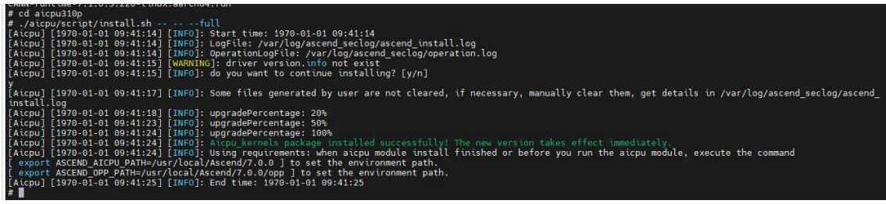


# 16) 查看 NPU 状态

```shell
export LD_LIBRARY_PATH=/usr/local/Ascend/latest/aarch64-linux/lib64/:/libaarch64/aarch64-linux-gnu/:/usr/local/Ascend/driver/lib64/:/usr/lib64/var/dmp_daemon -I -M -U 8087 & 
```


/usr/local/sbin/npu-smi info


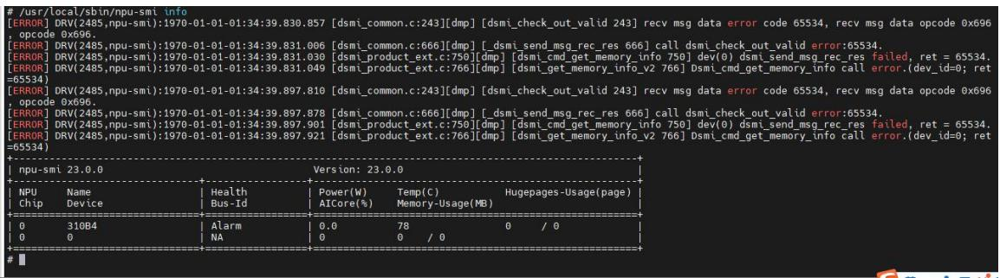


# 17) 运行推理 demo

```shell
cd /data1/
bash runmodel.sh 
```

执行结果如下：

可以看出推理分类为 beagle 的概率为 0.905956。

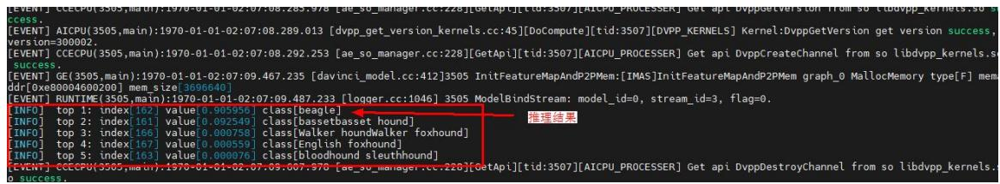


# 5.2. Python 环境安装

# 1) 安装 python 包

```batch
cp -r /data1/Python /usr/local/ 
```

```batch
source /usr/local/Python/set_python_env.sh
cd /usr/local/Python/bin
python3.10 -m ensurepip --upgrade
pip3 --version 
```

2) 安装在线 python库，此步骤需要联网下操作。

以 mindspore 为例。

```shell
source /usr/local/Python/set_python_env.sh
pip3 install mindspore 
```

```txt
# pip3 install mindspore
Collecting mindspore
Using cached mindspore-2.5.0-cp310-none-any.whl (345.0 MB)
Requirement already satisfied: psutil>=5.6.1 in /usr/local/Python/lib/python3.10/site-packages (from mindspore) (6.1.0)
Requirement already satisfied: protobuf>=3.13.0 in /usr/local/Python/lib/python3.10/site-packages (from mindspore) (6.31.0)
Requirement already satisfied: numpy<2.0.0,>=1.20.0 in /usr/local/Python/lib/python3.10/site-packages (from mindspore) (1.26.4)
Requirement already satisfied: astunparse>=1.6.3 in /usr/local/Python/lib/python3.10/site-packages (from mindspore) (1.6.3)
Requirement already satisfied: dill>=0.3.7 in /usr/local/Python/lib/python3.10/site-packages (from mindspore) (0.4.0)
Requirement already satisfied: packaging>=20.0 in /usr/local/Python/lib/python3.10/site-packages (from mindspore) (25.0)
Requirement already satisfied: pillow>=6.2.0 in /usr/local/Python/lib/python3.10/site-packages (from mindspore) (11.2.1)
Requirement already satisfied: safetensors>=0.4.0 in /usr/local/Python/lib/python3.10/site-packages (from mindspore) (0.5.3)
Requirement already satisfied: asttokens>=2.0.4 in /usr/local/Python/lib/python3.10/site-packages (from mindspore) (3.0.0)
Requirement already satisfied: scipy>=1.5.4 in /usr/local/Python/lib/python3.10/site-packages (from mindspore) (1.15.3)
Requirement already satisfied: six<2.0,>=1.6.1 in /usr/local/Python/lib/python3.10/site-packages (from astunparse>=1.6.3->mindspore) (1.16.0)
Requirement already satisfied: wheel<1.0,>=0.23.0 in /usr/local/Python/lib/python3.10/site-packages (from astunparse>=1.6.3->mindspore) (0.45.1)
Installing collected packages: mindspore
Successfully installed mindspore-2.5.0
WARNING: Running pip as the 'root' user can result in broken permissions and conflicting behaviour with the system package manager. It is recommended
ntead: https://pip.pypa.io/warnings/venv 
```

# 5.3. 安装 toolkit 包

1) 安装 toolkit

```shell
source /usr/local/Python/set_python_env.sh
cd /data1/toolkit/run_package/toolkit
./toolkit/scripts/install.sh -- -- --full 
```

```ini
# cd toolkit/
# ls
toolkit tools version.info
# pwd
/data1/toolkit/run_package/toolkit
# /data1/toolkit/run_package/toolkit^C
# ls
toolkit tools version.info
# ./to
toolkit/ tools/
# ./toolkit/scripts/in
install.sh install_msprof_fitter.sh
install_common_parser.sh install_profiling_msprof.sh
# ./toolkit/scripts/install.sh -- -- --full
[Toolkit] [1970-01-01 13:40:53] [INFO]: Start Time: 1970-01-01 13:40:53
[Toolkit] [1970-01-01 13:40:53] [INFO]: LogFile: /var/log/ascend_seclog/ascend_install.log
[Toolkit] [1970-01-01 13:40:53] [INFO]: OperationLogfile: /var/log/ascend_seclog/operation.log
[Toolkit] [1970-01-01 13:40:53] [INFO]: InputParams: --full
[Toolkit] [1970-01-01 13:40:54] [INFO]: version compatibility check successfully!
[Toolkit] [1970-01-01 13:40:54] [INFO]: base version is 7.1.0.3.220.
[Toolkit] [1970-01-01 13:40:54] [INFO]: Toolkit package has been installed on the path /usr/local/Ascend/7.0.0, the version is 7.1.0.3.220, and the version of this package is 7.1.0.3.220, do you want to continue? [y/n]
y
[Toolkit] [1970-01-01 13:40:57] [INFO] [Profiler]: Uninstall profiling successfully.
[Toolkit] [1970-01-01 13:46:35] [INFO]: Toolkit package uninstalled successfully! Uninstallation takes effect immediately.
[Toolkit] [1970-01-01 13:54:36] [INFO] [Profiler]: Install profiling successfully.
[Toolkit] [1970-01-01 13:54:36] [INFO]: upgradePercentage: 100%
[Toolkit] [1970-01-01 13:54:36] [INFO]: InstallPath: /usr/local/Ascend/7.0.0
[Toolkit] [1970-01-01 13:54:36] [INFO]: Toolkit package installed successfully! The new version takes effect immediately.
Please make sure that
- TOOLCHAIN_HOME set with /usr/local/Ascend/7.0.0/toolkit
[Toolkit] [1970-01-01 13:54:36] [INFO]: End Time: 1970-01-01 13:54:36 
```

2) 安装 runtime

```shell
cd /data1/toolkit/run_package/runtime
./runtime/scripts/install.sh -- -- --full 
```

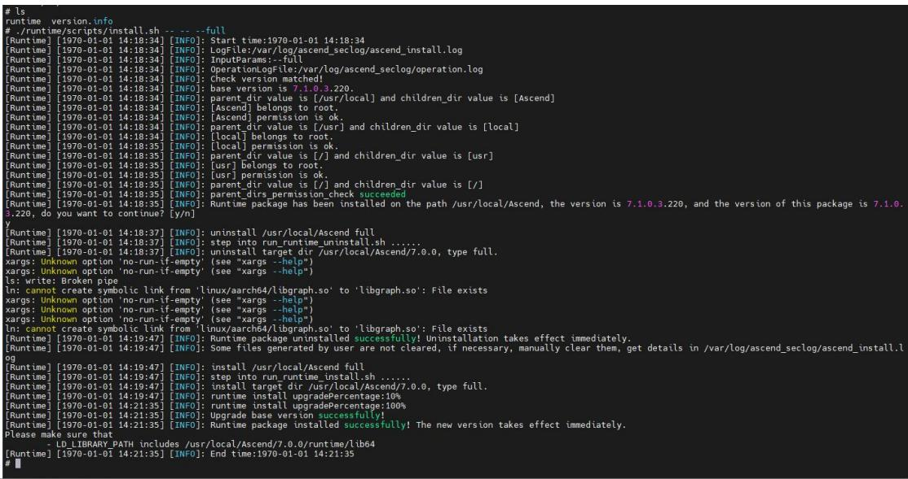


# 3) 安装 opp


cd /data1/toolkit/run_package/opp


./opp/script/install.sh -- -- --full


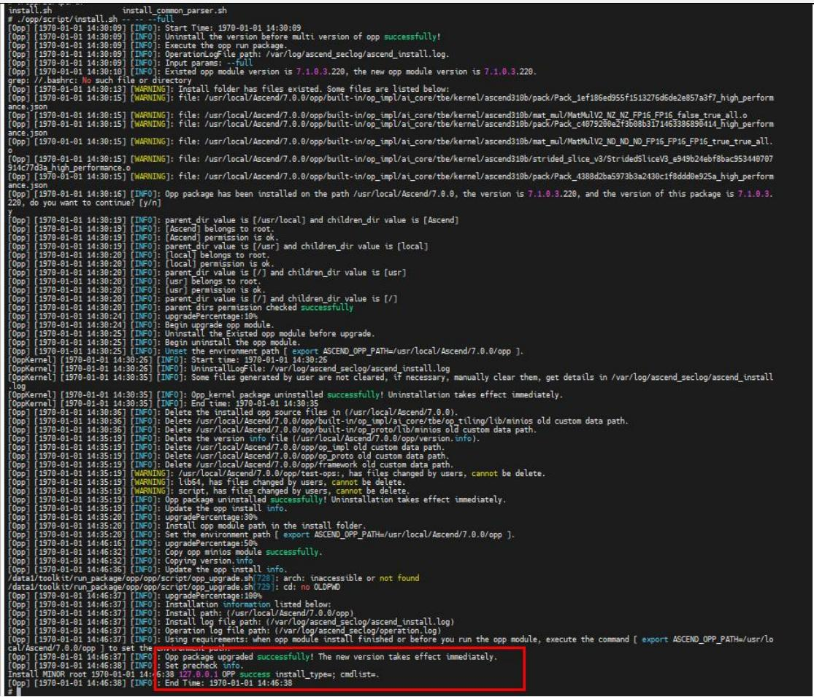


# 4) 安装 ncs


cd /data1/toolkit/run_package/ncs


./ncs/script/install.sh -- -- --full


```txt
# ./ncs/sc
scene.info script/
# ./ncs/script/ins
install.sh install_common_parser.sh
# ./ncs/script/install.sh -- -- --full
[Ncs] [1970-01-01 15:19:06] [INFO]: Start time:1970-01-01 15:19:06
[Ncs] [1970-01-01 15:19:06] [INFO]: LogFile::var/log/ascend_seclog/ascend_install.log
[Ncs] [1970-01-01 15:19:06] [INFO]: InputParams:--full
[Ncs] [1970-01-01 15:19:06] [INFO]: OperationLogFile::var/log/ascend_seclog/operation.log
[Ncs] [1970-01-01 15:19:06] [WARNING]: base version was destroyed or not exist.
[Ncs] [1970-01-01 15:19:06] [INFO]: parent_dir value is [/usr/local] and children_dir value is [Ascend]
[Ncs] [1970-01-01 15:19:06] [INFO]: [Ascend] belongs to root.
[Ncs] [1970-01-01 15:19:06] [INFO]: [Ascend] permission is ok.
[Ncs] [1970-01-01 15:19:06] [INFO]: parent_dir value is [/usr] and children_dir value is [local]
[Ncs] [1970-01-01 15:19:06] [INFO]: [local] belongs to root.
[Ncs] [1970-01-01 15:19:06] [INFO]: [local] permission is ok.
[Ncs] [1970-01-01 15:19:06] [INFO]: parent_dir value is [/] and children_dir value is [usr]
[Ncs] [1970-01-01 15:19:07] [INFO]: [usr] belongs to root.
[Ncs] [1970-01-01 15:19:07] [INFO]: [usr] permission is ok.
[Ncs] [1970-01-01 15:19:07] [INFO]: parent_dir value is [/] and children_dir value is [/]
[Ncs] [1970-01-01 15:19:07] [INFO]: parent_dirs permission check success
[Ncs] [1970-01-01 15:19:07] [INFO]: Ncs package has been installed on the path /usr/local/Ascend, the version is 7.1.0.3.220, and the version of this package is 7.1.0.3.220, do you want to continue? [y/n]
Y
[Ncs] [1970-01-01 15:19:09] [INFO]: uninstall /usr/local/Ascend/7.0.0/tools/ncs full
[Ncs] [1970-01-01 15:19:09] [INFO]: step into run_ncs_uninstall.sh ......
[Ncs] [1970-01-01 15:19:09] [INFO]: uninstall targetedir /usr/local/Ascend/7.0.0 , type full.
./ncs/script/install.sh -- -- --full[Ncs] [1970-01-01 15:19:31] [INFO]: Ncs package uninstalled successfully! Uninstallation takes effect immediately.
[Ncs] [1970-01-01 15:19:31] [INFO]: install /usr/local/Ascend/7.0.0/tools/ncs full
[Ncs] [1970-01-01 15:19:31] [INFO]: step into run_ncs_install.sh ......
[Ncs] [1970-01-01 15:19:31] [INFO]: install targetedir /usr/local/Ascend/7.0.0 , type full.
[Ncs] [1970-01-01 15:19:31] [INFO]: ncs install upgradePercentage: 10%
[Ncs] [1970-01-01 15:19:49] [INFO]: ncs install upgradePercentage: 100%
[Ncs] [1970-01-01 15:19:50] [INFO]: Upgrade base version success.
[Ncs] [1970-01-01 15:19:50] [INFO]: Ncs package installed successfully! The new version takes effect immediately.
Please make sure that
    - LD_LIBRARY_PATH includes /usr/local/Ascend/7.0.0/tools/ncs/lib64
[Ncs] [1970-01-01 15:19:50] [INFO]: End time: 1970-01-01 15:19:50 
```

# 5) 安装 compiler


cd /data1/toolkit/run_package/compiler


./compiler/scripts/install.sh -- -- --full


```ini
[Compiler] [1970-01-01 15:26:04] [INFO]: /data1/toolkit/run_package/compiler/compiler/lib64/te-0.4.0-py3-none-any.whl installed successfully!
[Compiler] [1970-01-01 15:26:04] [INFO]: the compiler tool installed successfully!
[Compiler] [1970-01-01 15:26:04] [INFO]: install hccl extension module begin...
[Compiler] [1970-01-01 15:26:04] [INFO]: install python module package in /data1/toolkit/run_package/compiler/compiler/lib64/hccl-0.1.0-py3-none-any.whl
WARNING: Running pip as the 'root' user can result in broken permissions and conflicting behaviour with the system package manager. It is recommended to use a virtual environment instead: https://pip.pypa.io/warnings/venv
[Compiler] [1970-01-01 15:26:09] [INFO]: install /data1/toolkit/run_package/compiler/compiler/lib64/hccl-0.1.0-py3-none-any.whl successfully!
[Compiler] [1970-01-01 15:26:09] [INFO]: the hccl extension module installed successfully!
[Compiler] [1970-01-01 15:26:09] [INFO]: start install python module package auto_tune.
WARNING: Running pip as the 'root' user can result in broken permissions and conflicting behaviour with the system package manager. It is recommended to use a virtual environment instead: https://pip.pypa.io/warnings/venv
[Compiler] [1970-01-01 15:26:17] [INFO]: auto_tune installed successfully!
[Compiler] [1970-01-01 15:26:17] [INFO]: start install python module package auto_deploy_utils.
WARNING: Running pip as the 'root' user can result in broken permissions and conflicting behaviour with the system package manager. It is recommended to use a virtual environment instead: https://pip.pypa.io/warnings/venv
[Compiler] [1970-01-01 15:26:22] [INFO]: auto_deploy_utils installed successfully!
[Compiler] [1970-01-01 15:26:22] [INFO]: start install python module package schedule_search.
WARNING: Running pip as the 'root' user can result in broken permissions and conflicting behaviour with the system package manager. It is recommended to use a virtual environment instead: https://pip.pypa.io/warnings/venv
[Compiler] [1970-01-01 15:26:35] [INFO]: schedule_search installed successfully!
[Compiler] [1970-01-01 15:26:35] [INFO]: start install python module package opc_tool.
WARNING: Running pip as the 'root' user can result in broken permissions and conflicting behaviour with the system package manager. It is recommended to use a virtual environment instead: https://pip.pypa.io/warnings/venv
[Compiler] [1970-01-01 15:26:40] [INFO]: opc_tool installed successfully!
[Compiler] [1970-01-01 15:26:40] [INFO]: start install python module package op_compile_tool.
WARNING: Running pip as the 'root' user can result in broken permissions and conflicting behaviour with the system package manager. It is recommended to use a virtual environment instead: https://pip.pypa.io/warnings/venv
[Compiler] [1970-01-01 15:26:46] [INFO]: op_compile_tool installed successfully!
[Compiler] [1970-01-01 15:26:46] [INFO]: start install python module package dataflow.
WARNING: Running pip as the 'root' user can result in broken permissions and conflicting behaviour with the system package manager. It is recommended to use a virtual environment instead: https://pip.pypa.io/warnings/venv
[Compiler] [1970-01-01 15:26:51] [INFO]: dataflow installed successfully!
[Compiler] [1970-01-01 15:26:52] [INFO]: The package te is already installed in python default path. It is recommended to install it using the '--pylocal'
parameter, install the package te in the /usr/local/Ascend/7.0.0/python/site-packages.
[Compiler] [1970-01-01 15:26:52] [INFO]: Compiler do migrate user assets.
[Compiler] [1970-01-01 15:28:02] [INFO]: install upgradePercentage:100%
[Compiler] [1970-01-01 15:28:02] [INFO]: Upgrade base version successfully!
[Compiler] [1970-01-01 15:28:04] [INFO]: Compiler package installed successfully! The new version takes effect immediately.
Please make sure that
    - PATH includes /usr/local/Ascend/7.0.0/compiler/ccec_compiler/bin:/usr/local/Ascend/7.0.0/compiler/bin
    - LD LIBRARY PATH includes /usr/local/Ascend/7.0.0/compiler/lib64:/usr/local/Ascend/7.0.0/compiler/lib64/plugin/opskernel:/usr/local/Ascend/7.0
.0/compiler/lib64/plugin/nmengine
    - PYTHONPATH includes /usr/local/Ascend/7.0.0/compiler/python/site-packages
[Compiler] [1970-01-01 15:28:06] [INFO]: End time: 1970-01-01 15:28:06 
```

# 6) 安装 aoe

cd /data1/toolkit/run_package/aoe 

./aoe/script/install.sh -- -- --full 

```txt
scene.info script/
# ./aoe/script/^C
# cd /data1/toolkit/run_package/aoe
# ./aoe/script/install.sh --- -- --full
[Aoe] [1970-01-01 15:31:56] [INFO]: Start time:1970-01-01 15:31:56
[Aoe] [1970-01-01 15:31:56] [INFO]: LogFile:/var/log/ascend_seclog/ascend_install.log
[Aoe] [1970-01-01 15:31:56] [INFO]: InputParams:--full
[Aoe] [1970-01-01 15:31:56] [INFO]: OperationLogFile:/var/log/ascend_seclog/operation.log
[Aoe] [1970-01-01 15:31:56] [INFO]: base version is 7.1.0.3.220.
[Aoe] [1970-01-01 15:31:56] [INFO]: [Ascend] permission is ok.
[Aoe] [1970-01-01 15:31:56] [INFO]: [local] permission is ok.
[Aoe] [1970-01-01 15:31:56] [INFO]: [usr] permission is ok.
[Aoe] [1970-01-01 15:31:56] [INFO]: parent_dirs_permission_check success
[Aoe] [1970-01-01 15:31:56] [INFO]: Aoe package has been installed on the path /usr/local/Ascend, the version is 7.1.0.3.ge is 7.1.0.3.220, do you want to continue? [y/n]
y
[Aoe] [1970-01-01 15:31:58] [INFO]: uninstall /usr/local/Ascend/7.0.0/tools/aoe full
[Aoe] [1970-01-01 15:31:58] [INFO]: step into run_aoe_uninstall.sh ......
[Aoe] [1970-01-01 15:31:58] [INFO]: uninstall targetdir /usr/local/Ascend/7.0.0, type full.
[Common] [1970-01-01 15:32:15] [WARNING]: /usr/local/Ascend/7.0.0/aarch64-linux/conf/aoe.ini user configuration file has
[Aoe] [1970-01-01 15:32:20] [INFO]: Aoe package uninstalled successfully! Uninstallation takes effect immediately.
[Aoe] [1970-01-01 15:32:21] [INFO]: install /usr/local/Ascend/7.0.0/tools/aoe full
[Aoe] [1970-01-01 15:32:21] [INFO]: aoe install for all y
[Aoe] [1970-01-01 15:32:21] [INFO]: aoe enable install for all
[Aoe] [1970-01-01 15:32:21] [INFO]: step into run_aoe_install.sh ......
[Aoe] [1970-01-01 15:32:21] [INFO]: install target dir /usr/local/Ascend/7.0.0, type full.
[Aoe] [1970-01-01 15:32:21] [INFO]: aoe install upgradePercentage: 10%
[Aoe] [1970-01-01 15:32:29] [INFO]: merge /usr/local/Ascend/7.0.0/tools/aoe/conf/aoe.ini, /data1/toolkit/run_package/aoe/
realpath: Unknown option 'q' (see "realpath --help")
realpath: Unknown option 'q' (see "realpath --help")
[Aoe] [1970-01-01 15:32:46] [INFO]: aoe install upgradePercentage: 100%
[Aoe] [1970-01-01 15:32:46] [INFO]: Upgrade base version success.
[Aoe] [1970-01-01 15:32:46] [INFO]: Aoe package installed successfully! The new version takes effect immediately.
Please make sure that
    - LD_LIBRARY_PATH includes /usr/local/Ascend/7.0.0/tools/aoe/lib64
[Aoe] [1970-01-01 15:32:46] [INFO]: End time: 1970-01-01 15:32:46 
```

# 7) 安装 pyacl


cd /data1/toolkit/run_package/pyacl


./script/install.sh -- -- --full


```shell
# ^C
# ^C
# cd /data1/toolkit/run_package/pyacl
# ./script/install.sh -- -- --full
./script/install.sh: line 5; arch: command not found
[pyACL] [1970-01-01 15:34:43] [INFO] install start
[pyACL] [1970-01-01 15:34:43] [INFO] delete file /usr/local/Ascend/latest/pyACL successfully
[pyACL] [1970-01-01 15:34:43] [INFO] delete file /usr/local/Ascend/latest/python/site-packages/acl.so successfully
[pyACL] [1970-01-01 15:34:43] [INFO] delete file /usr/local/Ascend/latest/python/site-packages/acl.so successfully
Please make sure that
- PYTHONPATH includes /usr/local/Ascend/7.0.0/python
[pyACL] [1970-01-01 15:34:44] [INFO] Ascend-pyACL-7.0.0 install success 
```

# 8) 安装 test


cd /data1/toolkit/run_package/test ./script/install.sh -- -- --full --install-path=/usr/local/Ascend/


```ini
[pyACL] [1970-01-01 15:34:44] [INFO] Ascend-pyACL-7.0.0 install success
# cd /data1/toolkit/run_package/test
# ./script/install.sh -- -- --full --install-path=/usr/local/Ascend/
./script/install.sh: line 7: arch: command not found
--install-path=/usr/local/Ascend/
[test-ops] [1970-01-01 15:35:18] [INFO]: new_version_info 7.0.0
./script/install.sh: line 140: arch: command not found
[test-ops] [1970-01-01 15:35:19] [INFO]: your install path is /usr/local/Ascend//7.0.0/opp/test-ops
[test-ops] [1970-01-01 15:35:19] [INFO]: install is success
[test-ops] [1970-01-01 15:35:21] [INFO]: re-install successfully
# 
```

# 5.4. Kernels 环境安装

```shell
source /usr/local/Python/set_python_env.sh
cd /data1/kernels/run_package/opp_kernel
./scripts/install.sh -- -- --full 
```

```ini
# pwd
/data1/kernels/run_package/opp_kernel
# /data1/kernels/run_package/opp_kernel^C
# ./sc
scene.info scripts/
# ./scripts/in
install.sh install_common_parser.sh
# ./scripts/install.sh -- -- --full ./scripts/install.sh -- -- --full^C
# ./scripts/install.sh -- -- --full
[Opp_Kernel] [1970-01-01 15:37:32] [INFO]: Start time: 1970-01-01 15:37:32
[Opp_Kernel] [1970-01-01 15:37:32] [INFO]: LogFile: /var/log/ascend_seclog/ascend_install.log
[Opp_Kernel] [1970-01-01 15:37:32] [INFO]: OperationLogFile: /var/log/ascend_seclog/operation.log
[Oppkernel] [1970-01-01 15:37:34] [INFO]: Start to install opp kernel
[Oppkernel] [1970-01-01 15:38:54] [INFO]: installPercentage: 100%
[Opp_Kernel] [1970-01-01 15:38:54] [INFO]: Opp_kernels package installed successfully! The new version takes effect immediately.
[Opp_Kernel] [1970-01-01 15:38:54] [INFO]: Using requirements: when opp kernel module install finished or before you run the opp kernel module, execute the command
[ export ASCEND_OPP_KERNEL_PATH=/usr/local/Ascend/7.0.0 ] to set the environment path.
[Opp_Kernel] [1970-01-01 15:38:54] [INFO]: End time: 1970-01-01 15:38:54 
```

aleditionhere:htps://mobaxterm.mobatek.net 

# 6. MindSDK 使用指南

# 6.1. Vision SDK 视觉分析

计算机视觉（Computer Vision，以下简称“CV”）发展历程是一个不断探索和发展的过程。CV最初是为了实现计算机对数字图片的简单处理而产生的，研究内容主要包括图像处理、模式识别、机器学习、深度学习等方面。在智能视频分析（Intelligent Video Analytics，以下简称“IVA”）行业中，传统计算常见算法的应用领域有很多，例如目标识别、视频结构化、动作行为识别等。

随着硬件技术和算法的不断进步，视频与图像已逐渐成为全球互联网流量的主要组成部分。随着媒体服务的快速增长，AI图像算法基础的视频图像处理，逐渐成为计算流程中的成本壁垒和性能瓶颈。在此背景上，Vision SDK致力于视频图像处理算法加速，提升视频图像处理性能，降低 CV应用的开发复杂度，加速 CV应用开发部署。

# 6.1.1. 安装部署

1)请从开发板的资料下载页面下载 2025年 3月及之后的 ubuntu操作系统镜像文件压缩包，然后使用解压软件解压，解压后的文件中，以“.img”结尾的文件就是操作系统的镜像文件。

2) 参考本手册第二章中烧录系统的方法，烧录对应的镜像至 tf 卡、eMMC或硬盘。

# 6.1.2. 使用方法

# 6.1.2.1. API 接口开发方式（C++）

下面以使用 Vision SDK C++接口开发图像目标检测应用进行演示，图像目标检测模型推理流程图如下图所示。样例取用TensorFlow框架YoloV3模型。


1) 切换到 root 用户，执行下面的命令，进入案例代码目录：

```txt
$ sudo -i 
```

```txt
# cd /home/HwHiAiUser/mxvision-samples/YoloV3Infer 
```

1) 下载模型文件。

```txt
# cd model
# wget https://obs-9be7.obs.cn-east-2.myhuaweicloud.com/003_Atc_Models/modelzoo/yolov3_tf.pb 
```

2)使用下面的命令使能CANN环境变量。

```shell
# source /usr/local/Ascend/ascend-toolkit/set_env.sh
# source /usr/local/Ascend/mxVision-6.0.0.SPC2/set_env.sh 
```

3)运行案例。

```shell
# cd /home/HwHiAiUser/mxvision-samples/YoloV3Infer
# bash run.sh 
```

4) 运行成功后会有如下输出：

```txt
yoloV3Outputs len=3
*****YoloV3PostProcess*****
Size of objectInfos is 1
objectInfo-0, Size:1
*****objectInfo-0:0
x0 is 412.861
y0 is 30.7561
x1 is 947.893
y1 is 644.556
confidence is 0.936385
classId is 16
className is dog
*****YoloV3PostProcess end***** 
```

5) 运行结果保存在案例目录的 result.jpg 图片里，打开后可以看到如下所示的图片。框出了一个名为dog的物体。

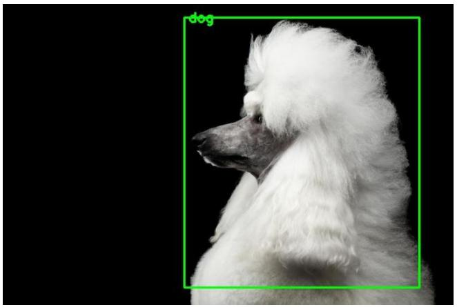


# 6.1.2.2. API 接口开发方式（Python）

下面以使用使用 Vision SDK Python 接口开发图像分类应用进行演示，图像分类模型推理流程图如下图所示。样例取用Caffe框架ResNet-50模型。


2)切换到root用户，执行下面的命令，进入案例代码目录：

```shell
$ sudo -i
# cd /home/HwHiAiUser/mxvision-samples/resnet50_sdk_python_sample 
```

1)使用下面的命令使能CANN环境变量。

```shell
# source /usr/local/Ascend/ascend-toolkit/set_env.sh
# source /usr/local/Ascend/mxVision-6.0.0.SPC2/set_env.sh 
```

2)运行案例。

```shell
# cd /home/HwHiAiUser/mxvision-samples/resnet50_sdk_python_sample
# bash run.sh 
```

3) 运行成功后会有如下输出：

```txt
Standard Poodle: 0.98583984375
save infer result success 
```

4)运行结果保存在案例目录的 result.png图片里，打开后可以看到如下所示的图片。其左上角标注了 Standard Poodle 为 0.99。


# 6.1.2.3. 流程编排开发方式

下面以通过 Vision SDK图像分类案例，介绍如何使用 Vision SDK流程编排方式开发推理应用。案例使用 YoloV3模型对图片进行分类并最后输出分类结果。样例取用 TensorFlow 框架 YoloV3 模型。

3)切换到root用户，执行下面的命令，进入案例代码目录：

```shell
$ sudo -i
# cd /home/HwHiAiUser/mxvision-samples/pipelineSample 
```

4)下载模型文件。

```shell
# cd models
# wget https://obs-9be7.obs.cn-east-2.myhuaweicloud.com/003_Atc_Models/modelzoo/yolov3_tf.
pb --no-check-certificate 
```

5)使用下面的命令使能CANN环境变量。

```shell
# source /usr/local/Ascend/ascend-toolkit/set_env.sh
# source /usr/local/Ascend/mxVision-6.0.0.SPC2/set_env.sh 
```

6)运行案例。

```shell
# cd /home/HwHiAiUser/mxvision-samples/pipelineSample
# dos2unix run.sh
# bash run.sh 
```

7) 运行成功后会有如下输出：

a. “classId”表示类别号，这里是第 16 类。

b. “className”表示类名称，这里的类名称是“dog”。

c. “confidence”表示该分类的最大置信度，这里的最大置信度为 99.5%。

d. “headerVec”表示四个顶点坐标。

```json
Results: {"MxpiObject":[{"classVec":[{"classId":16,"className":"dog","confidence":0.995259583,"h eaderVec":[]}],"x0":113.482422,"x1":883.72522,"y0":127.949326,"y1":595.702576}] 
```

# 7. Linux 内核源码包的使用说明

# 7.1. 编译主机系统的需求

目前的 Linux内核源码包只在 Ubuntu 22.04 的 X64电脑上测试过，所以首先请确保自己电脑安装的 Ubuntu 版本是 Ubuntu 22.04。查看电脑已安装的 Ubuntu版本的命令如下所示，如果 Release字段显示的不是 22.04，说明当前使用的 Ubuntu版本不符合要求，请更换系统后再进行下面的操作。

```yaml
test@test:~$ lsb_release -a
No LSB modules are available.
Distributor ID: Ubuntu
Description: Ubuntu 22.04 LTS
Release: 22.04
Codename: jammy 
```

如果电脑安装的是 Windows系统，没有安装有 Ubuntu 22.04的电脑，可以考虑使用 VirtualBox 或者 VMware 来在 Windows 系统中安装一个 Ubuntu 22.04 虚拟机。但是请注意，Linux内核源码包没有在 WSL虚拟机中测试过，所以无法确保能在WSL中正常运行。Ubuntu 22.04 amd64版本的安装镜像下载地址为：

```txt
https://mirrors.tuna.tsinghua.edu.cn/ubuntu-releases/22.04/ubuntu-22.04-desktop-amd64.iso 
```

在电脑中或者虚拟机中安装完 Ubuntu 22.04后，请先设置 Ubuntu 22.04的软件源为清华源（或者其他速度快的国内源），不然后面安装软件的时候很容易由于网络原因而出错。替换清华源的步骤如下所示：

1)替换清华源的方法参考这个网页的说明即可。

```txt
https://mirrors.tuna.tsinghua.edu.cn/help/ubuntu/ 
```

2) 注意 Ubuntu 版本需要切换到 22.04。

# Ubuntu镜像使用帮助

Ubuntu的软件源配置文件是/etc/apt/sources.1ist。将系统自带的该文件做个备份，将该文件替换为下面内容，即可使用TUNA的软件源镜像。

选择你的ubuntu版本：

22.04 LTS 

#默认注释了源码镜像以提高aptupdate速度，如有需要可自行取消注释

debhttps://mirrors.tuna.tsinghua.edu.cn/ubuntu/jammy main restricted universe multiverse 

#deb-src https://mirrors.tuna.tsinghua.edu.cn/ubuntu/ jammy main restricted universe multiverse 

debhttps://mirrors.tuna.tsinghua.edu.cn/ubuntu/jammy-updates main restricted universe multiverse 

#deb-src https://mirrors.tuna.tsinghua.edu.cn/ubuntu/jammy-updatesmain restricted universemultiverse 

debhttps://mirrors.tuna.tsinghua.edu.cn/ubuntu/ jammy-backports main restricted universe multiverse 

#deb-src https://mirrors.tuna.tsinghua.edu.cn/ubuntu/ jammy-backportsmainrestricted universemultiverse 

debhttps://mirrors.tuna.tsinghua.edu.cn/ubuntu/jammy-security mainrestricted universe multiverse 

#deb-rc https://mirrors.tuna.tsinghua.edu.cn/ubuntu/jammy-security mainrestricted universe multiverse 

#预发布软件源，不建议启用

# 3) 需要替换的/etc/apt/sources.list 文件的内容为：

test@test:~$ sudo mv /etc/apt/sources.list cat /etc/apt/sources.list.bak test@test:~$ sudo vim /etc/apt/sources.list 

# 默认注释了源码镜像以提高 apt update 速度，如有需要可自行取消注释

deb https://mirrors.tuna.tsinghua.edu.cn/ubuntu/ jammy main restricted universe multiverse 

# deb-src https://mirrors.tuna.tsinghua.edu.cn/ubuntu/ jammy main restricted universe multiverse 

deb https://mirrors.tuna.tsinghua.edu.cn/ubuntu/ jammy-updates main restricted universe multiverse 

# deb-src https://mirrors.tuna.tsinghua.edu.cn/ubuntu/ jammy-updates main restricted universe multiverse 

deb https://mirrors.tuna.tsinghua.edu.cn/ubuntu/ jammy-backports main restricted universe multiverse 

# deb-src https://mirrors.tuna.tsinghua.edu.cn/ubuntu/ jammy-backports main restricted universe multiverse 

deb https://mirrors.tuna.tsinghua.edu.cn/ubuntu/ jammy-security main restricted universe multiverse 

# deb-src https://mirrors.tuna.tsinghua.edu.cn/ubuntu/ jammy-security main restricted universe multiverse 

#预发布软件源，不建议启用

# deb https://mirrors.tuna.tsinghua.edu.cn/ubuntu/ jammy-proposed main restricted universe multiverse 

# deb-src https://mirrors.tuna.tsinghua.edu.cn/ubuntu/ jammy-proposed main restricted universe multiverse 

# 4) 替换完后需要更新下软件包列表，并确保没有报错。

test@test:~$ sudo apt-get update 

# 7.2. 下载解压 Linux 内核源码包

1) Linux 内核源码压缩包可以从开发板的资料下载页面下载到。步骤为：

a. 打开下面的链接：

http://www.orangepi.cn/html/hardWare/computerAndMicrocontrollers/service-and-

support/Orange-Pi-AIpro(20T).html 

b. 然后选择 Linux源码。


官方资料


c. 然后下载 Linux 内核源码压缩包 Ascend310B-source-opi.tar.gz。


2) 然后在 Ubuntu 22.04 电脑中，然后执行如下命令，切换至 root用户。

test@test:~$ sudo -i 

3) 然后将下载好的 Linux 内核源码压缩包 Ascend310B-source-opi.tar.gz 拷贝到Ubuntu 22.04电脑的/opt目录下，然后使用下面的命令解压 Linux内核源码压缩包。

root@test:/opt # tar zxf Ascend310B-source-opi.tar.gz 

4)解压后的Linux内核源码包的内容如下所示：

```txt
root@test:/opt # cd Ascend310B-source-opi
root@test:/opt/Ascend310B-source-opi# ls
abl build.sh config driver dtb kernel scripts tools 
```

# 7.3. 安装交叉编译工具链和依赖包

7) 交叉编译工具链的压缩包可以从开发板的资料下载页面下载到。步骤为：

a. 打开下面的链接：

http://www.orangepi.cn/html/hardWare/computerAndMicrocontrollers/service-and-

support/Orange-Pi-AIpro(20T).html 

b. 然后选择官方工具。


官方资料


c. 然后下载交叉编译工具链文件夹中的toolchain.tar.gz压缩包。


8) 然后在 Ubuntu 22.04 电脑中执行如下命令，切换至 root 用户。

```makefile
test@test:~$ sudo -i 
```

9)然后安装下面的依赖包

```batch
root@test:~# apt install -y python3 make gcc unzip pigz bison flex libncurses-dev cmake
root@test:~# apt install -y squashfs-tools bc device-tree-compiler libssl-dev rpm2cpio g++ 
```

10) 然后执行如下命令，创建/opt/compiler 目录，并进入到/opt/compiler 目录。

```makefile
root@test:~# mkdir /opt/compiler
root@test:~# cd /opt/compiler 
```

11) 然后将下载的 toolchain.tar.gz 复制到/opt/compiler 中，再使用下面的命令将toolchain.tar.gz 解压到 /opt/compiler 中。

```txt
root@test:/opt/compiler# tar -xvf toolchain.tar.gz 
```

12)解压后的交叉编译工具链如下所示：

```txt
root@test:/opt/compiler# ls toolchain 
```

```txt
aarch64-target-linux-gnu bin include lib lib64 libexec sysroot 
```

13) 然后在配置文件中增加交叉编译工具链路径。

```makefile
root@test:~# echo "export PATH=/opt/compiler/toolchain/bin:\$PATH: " >> /etc/profile 
```

14)然后执行如下命令，使环境变量生效。

```txt
root@test:~# source /etc/profile 
```

15) 然后可以执行如下命令，查看交叉编译工具链版本。如果显示有版本信息，则表明安装工具链成功。

```makefile
root@test:~# aarch64-target-linux-gnu-gcc -v
Using built-in specs.
COLLECT_GCC=aarch64-target-linux-gnu-gcc
COLLECT_LTO_WRAPPER=/opt/compiler/toolchain/bin/../libexec/gcc/aarch64-target-linux-gnu/7.3.0/lto-wrapper
Target: aarch64-target-linux-gnu
......
Thread model: posix
gcc version 7.3.0 (Do-Compiler V100R001C13B001) 
```

# 7.4. 编译并生效内核 Image 文件的方法

1) 首先进入 Ubuntu 22.04 电脑中，然后执行如下命令，切换至 root用户。

```makefile
test@test:~$ sudo -i 
```

2) 然后执行如下命令，进入“Ascend310B-source-opi”目录。

```txt
root@test:~# cd /opt/Ascend310B-source-opi 
```

3)然后执行如下命令，即可开始编译内核。

```batch
root@test:/opt/Ascend310B-source-opi# bash build.sh kernel 
```

4) 执行过程会弹出内核配置选项的图形界面，如果不需要修改，直接选择 Exit退出即可。

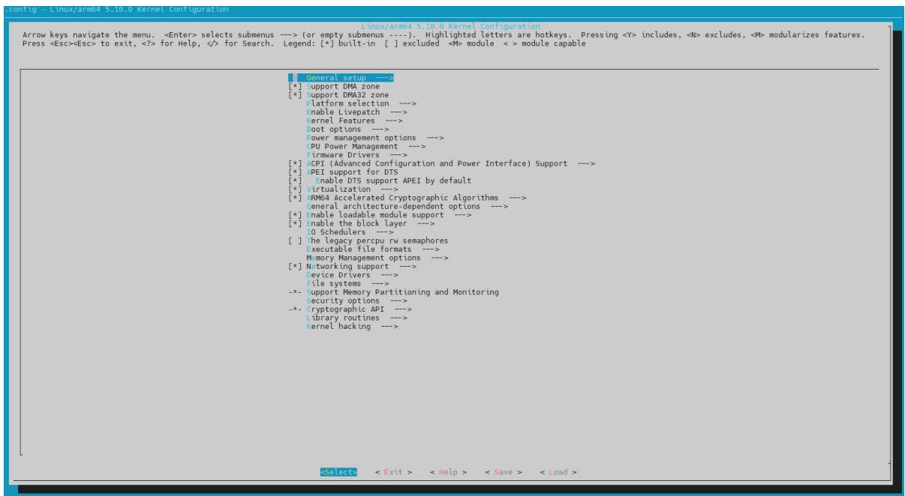


5)编译完成后会打印下面的信息：

```shell
generate /opt/Ascend310B-source-opi/output/kernel_modules success!
generate /opt/Ascend310B-source-opi/output/Image success!
sign /opt/Ascend310B-source-opi/output/Image success! 
```

6) 编译后的 Image 文件会存放于 Ascend310B-source/output 目录下。

```txt
root@test:/opt/Ascend310B-source-opi# ls output/Image output/Image 
```

7)编译后更新内核Image文件的方法如下所示：

a. 首先登录开发板的Linux系统。

b. 然后将编译好的 Image文件上传至开发板 Linux系统的任意目录下，例如/root 目录下。

c. 然后进入/root 目录。

d. 然后执行如下命令，更新Image文件。

a) NVMe SSD 启动：

```txt
dd if=Image of=/dev/nvme0n1 count=61440 seek=32768 bs=512 
```

b) SATA SSD 启动：

```txt
dd if=Image of=/dev/sda count=61440 seek=32768 bs=512 
```

c) eMMC启动：

```txt
dd if=Image of=/dev/mmcblk0 count=61440 seek=32768 bs=512 
```

d) TF卡启动：

```txt
dd if=Image of=/dev/mmcblk1 count=61440 seek=32768 bs=512 
```

# 7.5. 编译并生效内核 DTB 文件的方法

1) 首先进入 Ubuntu 22.04 电脑中，然后执行如下命令，切换至 root用户。

```makefile
test@test:~$ sudo -i 
```

2) 然后执行如下命令，进入 Ascend310B-source-opi 目录。

```txt
root@test:~# cd /opt/Ascend310B-source-opi 
```

3) 开发板使用的DTS文件如下所示，

```txt
Ascend310B-source-opi/dtb/dts/hi1910b/hi1910BL/hi1910B-default.dts 
```

4) 然后执行如下命令，即可开始编译DTB。

```txt
root@test:/opt/Ascend310B-source-opi# bash build.sh dtb 
```

5) 如果最后打印如下信息表示编译内核DTB文件成功。

```txt
generate /opt/Ascend310B-source-opi/output/dt.img success!
sign /opt/Ascend310B-source-opi/output/dt.img success! 
```

6) 生成的 DTB 文件为 dt.img，存放在 output 目录下：

```batch
root@orangepi-M600:/opt/Ascend310B-source-opi# ls output/dt.img
output/dt.img 
```

7) 编译后更新内核DTB文件的方法如下所示：

a. 首先登录开发板的Linux系统。

b. 然后将编译好的 dt.img 文件上传至开发板 Linux 系统的任意目录下，例如/root 目录下。

c. 然后进入/root 目录。

d. 然后执行如下命令，更新 dt.img文件。DTB文件有主备两份，下面的两条命令中第一条是更新主区的 DTB文件，第二条是更新备区的 DTB文件。测试时，一般只需更新主区的 DTB文件，等测试没问题后再更新备区的DTB文件。

a) NVMe SSD 启动：

```txt
dd if=dt.img of=/dev/nvme0n1 count=4096 seek=114688 bs=512
dd if=dt.img of=/dev/nvme0n1 count=4096 seek=376832 bs=512 
```

b) SATA SSD 启动：

```txt
dd if=dt.img of=/dev/sda count=4096 seek=114688 bs=512
dd if=dt.img of=/dev/sda count=4096 seek=376832 bs=512 
```

c) eMMC启动：

```txt
dd if=dt.img of=/dev/mmcblk0 count=4096 seek=114688 bs=512
dd if=dt.img of=/dev/mmcblk0 count=4096 seek=376832 bs=512 
```

d) TF卡启动：

```txt
dd if=dt.img of=/dev/mmcblk1 count=4096 seek=114688 bs=512
dd if=dt.img of=/dev/mmcblk1 count=4096 seek=376832 bs=512 
```

# 8. Linux 镜像编译脚本的使用说明

# 8.1. 编译主机系统的需求

目前的 Linux镜像编译脚本只在 Ubuntu 22.04的 X64电脑上测试过，所以首先请确保自己电脑安装的 Ubuntu 版本是 Ubuntu 22.04。查看电脑已安装的 Ubuntu版本的命令如下所示，如果 Release 字段显示的不是 22.04，说明当前使用的Ubuntu版本不符合要求，请更换系统后再进行下面的操作。

```yaml
test@test:~$ lsb_release -a
No LSB modules are available.
Distributor ID: Ubuntu
Description: Ubuntu 22.04 LTS
Release: 22.04
Codename: jammy 
```

如果电脑安装的是 Windows系统，没有安装有 Ubuntu 22.04的电脑，可以考虑使用 VirtualBox 或者 VMware 来在 Windows 系统中安装一个 Ubuntu 22.04 虚拟机。但是请注意，Linux镜像编译脚本没有在 WSL虚拟机中测试过，所以无法确保能在WSL中正常运行。Ubuntu 22.04amd64版本的安装镜像下载地址为：

```txt
https://mirrors.tuna.tsinghua.edu.cn/ubuntu-releases/22.04/ubuntu-22.04-desktop-amd64.iso 
```

在电脑中或者虚拟机中安装完 Ubuntu 22.04后，请先设置 Ubuntu 22.04的软件源为清华源（或者其他速度快的国内源），不然后面安装软件的时候很容易由于网络原因而出错。替换清华源的步骤如下所示：

1)替换清华源的方法参考这个网页的说明即可。

```txt
https://mirrors.tuna.tsinghua.edu.cn/help/ubuntu/ 
```

2) 注意 Ubuntu 版本需要切换到 22.04。

# Ubuntu镜像使用帮助

Ubuntu的软件源配置文件是/etc/apt/sources.1ist。将系统自带的该文件做个备份，将该文件替换为下面内容，即可使用TUNA的软件源镜像。

选择你的ubuntu版本：

22.04 LTS 

#默认注释了源码镜像以提高aptupdate速度，如有需要可自行取消注释

debhttps://mirrors.tuna.tsinghua.edu.cn/ubuntu/jammy main restricted universe multiverse 

#deb-src https://mirrors.tuna.tsinghua.edu.cn/ubuntu/ jammy main restricted universe multiverse 

debhttps://mirrors.tuna.tsinghua.edu.cn/ubuntu/jammy-updates main restricted universe multiverse 

#deb-src https://mirrors.tuna.tsinghua.edu.cn/ubuntu/jammy-updatesmain restricted universemultiverse 

debhttps://mirrors.tuna.tsinghua.edu.cn/ubuntu/ jammy-backports main restricted universe multiverse 

#deb-src https://mirrors.tuna.tsinghua.edu.cn/ubuntu/ jammy-backportsmainrestricted universemultiverse 

debhttps://mirrors.tuna.tsinghua.edu.cn/ubuntu/jammy-security mainrestricted universe multiverse 

#deb-rc https://mirrors.tuna.tsinghua.edu.cn/ubuntu/jammy-security mainrestricted universe multiverse 

#预发布软件源，不建议启用

# 3) 需要替换的/etc/apt/sources.list 文件的内容为：

test@test:~$ sudo mv /etc/apt/sources.list cat /etc/apt/sources.list.bak test@test:~$ sudo vim /etc/apt/sources.list 

# 默认注释了源码镜像以提高 apt update 速度，如有需要可自行取消注释

deb https://mirrors.tuna.tsinghua.edu.cn/ubuntu/ jammy main restricted universe multiverse 

# deb-src https://mirrors.tuna.tsinghua.edu.cn/ubuntu/ jammy main restricted universe multiverse 

deb https://mirrors.tuna.tsinghua.edu.cn/ubuntu/ jammy-updates main restricted universe multiverse 

# deb-src https://mirrors.tuna.tsinghua.edu.cn/ubuntu/ jammy-updates main restricted universe multiverse 

deb https://mirrors.tuna.tsinghua.edu.cn/ubuntu/ jammy-backports main restricted universe multiverse 

# deb-src https://mirrors.tuna.tsinghua.edu.cn/ubuntu/ jammy-backports main restricted universe multiverse 

deb https://mirrors.tuna.tsinghua.edu.cn/ubuntu/ jammy-security main restricted universe multiverse 

# deb-src https://mirrors.tuna.tsinghua.edu.cn/ubuntu/ jammy-security main restricted universe multiverse 

#预发布软件源，不建议启用

# deb https://mirrors.tuna.tsinghua.edu.cn/ubuntu/ jammy-proposed main restricted universe multiverse 

# deb-src https://mirrors.tuna.tsinghua.edu.cn/ubuntu/ jammy-proposed main restricted universe multiverse 

# 4) 替换完后需要更新下软件包列表，并确保没有报错。

test@test:~$ sudo apt-get update 

# 8.2. 制作 Linux 镜像需要准备的东西

制作Linux 镜像所需软硬件条件如下：

1) 一台带有 USB 接口、系统为 Ubuntu 22.04 的 X64 电脑。

2)一个TF卡读卡器。

3) 一张容量至少为 32GB的TF卡。

4)请确保电脑的网络畅通。

# 8.3. 下载 Linux 镜像编译脚本的源码压缩包

1)编译Linux镜像需要用到的脚本、驱动包、CANN包、基础 rootfs等软件全部都打包成了一个压缩包放在了百度网盘上。下载步骤如下所示：

a. 首先打开开发板的资料下载页面：

```txt
http://www.orangepi.cn/html/hardWare/computerAndMicrocontrollers/service-and-support/Orange-Pi-AIpro(20T).html 
```

b. 然后选择 Linux源码。


官方资料


c. 然后下载 image-builder.tar.gz 压缩包。

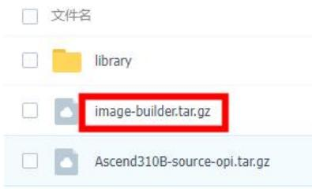


2) 然后在 Ubuntu 22.04 电脑中执行如下命令，切换至 root 用户。

```makefile
test@test:~$ sudo -i 
```

3) 然后将下载的 image-builder.tar.gz 拷贝到/opt 目录下，再使用下面的命令将其解压。

```txt
root@test:/opt# tar zxf image-builder.tar.gz
root@test:/opt# cd image-builder/src 
```

```txt
root@test:/opt/image-builder/src# ls
complete compress minimal 
```

4) 解压后的 image-builder/src 目录中包含最小镜像(minimal)、完整镜像(complete)、压缩扩容镜像(compress) 三个模块，他们对应制作镜像的三个步骤。

<table><tr><td>模块名称</td><td>模块名称</td><td>功能简介</td></tr><tr><td>最小镜像</td><td>src/minimal</td><td>可以在开发板上启动但缺少部分依赖的镜像</td></tr><tr><td>最小镜像</td><td>src/complete</td><td>完整依赖镜像</td></tr><tr><td>压缩扩容镜像</td><td>src/compress</td><td>带有压缩扩容功能的完整依赖镜像</td></tr></table>

# 8.4. 制作最小镜像的方法

1)首先请确保 Ubuntu22.04系统没有设置为中文环境，如果有的话，请改回英文环境，不然制作最小镜像时会失败。

2) 然后将 TF 卡插入读卡器，然后将读卡器插入电脑的USB接口中。

3) 然后在 Ubuntu 22.04 电脑中执行如下命令，切换至 root 用户。

```makefile
test@test:~$ sudo -i 
```

4)然后安装下面的依赖包

```txt
root@test:~# apt-get install -y qemu qemu-user qemu-user-static binfmt-support
expect dump 
```

5) 然后将 emmc-head 命令依赖的两个库文件拷贝到/usr/lib64 下面，步骤如下所示：

a. 首先打开开发板的资料下载页面：

```txt
http://www.orangepi.cn/html/hardWare/computerAndMicrocontrollers/service-and-support/Orange-Pi-AIpro(20T).html 
```

b. 然后选择 Linux源码。

# 官方资料


外壳及散热器安装资料


官方工具


用户手册


原理图


机械图


c. 然后下载依赖的库文件。


d. 再将下载好的库文件拷贝到 Ubuntu 22.04 系统的/usr/lib64 目录下。

root@test:~# cp library/* /usr/lib64/ 

e. 然后运行下 emmc-head 命令，如果输出和下面一样，说明库文件安装正确。

root@test:~# cd /opt/image-builder/src/minimal 

root@test:/opt/image-builder/src/minimal# ./ubuntu/22.04/download/emmc-head --help 

Usages: emmc-head firmware_path boot_a_devname boot_b_devname [force_recover] 

The following files must be contained in firmware_path: 

Image, itrustee.img, dt.img, initrd. 

boot_a_devname: A Partition boot device name, for example, eMMC:mmcblk0p2, SD:mmcblk1p2 

boot_b_devname: B Partition boot device name, for example, eMMC:mmcblk0p3, SD:mmcblk1p3 

force_recover: force recover flag. 

Example: /var/davinci/driver/emmc-head ./firmware /dev/mmcblk0p2 /dev/mmcblk0p3 

6) 然后进入 image-builder 源码所在的目录，然后再进入 src/minimal 目录。

root@test:~# cd /opt/image-builder 

root@test:/opt/image-builder# cd src/minimal 

root@test:/opt/image-builder/src/minimal# ls 

base.sh openEuler ubuntu 

7) 镜像制作过程中需要用到的，已预先下载好的软件存放的路径为：

a. openEuler 对应的 download 文件夹的路径：

```txt
openEuler/22.03/download 
```

b. ubuntu 对应的 download 文件夹的路径：

```txt
ubuntu/22.04/download 
```

8) 然后使用 fdisk -l 命令查看下 TF 卡的磁盘编号，如/dev/sdb。

```batch
root@test:~# fdisk -l
......
Disk /dev/sdb: 29.72 GiB, 31914983424 bytes, 62333952 sectors
Disk model: MassStorageClass
...... 
```

9) 然后开始制作最小镜像到TF卡中，命令如下所示：

a. Ubuntu 22.04 镜像的命令如下所示：

```txt
root@test:/opt/image-builder/src/minimal# bash base.sh ubuntu/22.04/ /dev/sdX ubuntu/22.04/download/ 
```

b. openEuler 22.03 镜像的命令如下所示：

```txt
root@test:/opt/image-builder/src/minimal# bash base.sh openEuler/22.03/ /dev/sdX openEuler/22.03/download/ 
```

注意，上面的命令中的/dev/sdX需要换成TF卡对应的磁盘编号，请不要照抄。

10)正常运行完后会打印如下的信息，然后就可以退出 TF卡，然后将 TF卡插入开发板中启动运行了（注意 ubuntu/22.04/download 或 openEuler/22.03/download/文件夹的内容请不要删除，目前脚本还无法通过网络来自动下载制作最小镜像需要的部分软件包，只能用已经缓存好的）。

```txt
[2024-02-03 15:49:41] [MINIMAL] Minimal image build successful! 
```

11) 注意，制作好的最小镜像第一次启动时会自动重启一次。请等待自动重启完成后，再使用串口登录系统进行其他操作。

12) Ubuntu 和 openEuler 中都有一个 cfg.json 文件来控制脚本运行哪些步骤。默认是所以步骤都运行的（如下所示，都为 y）。在制作最小镜像的过程中，每运行完一个步骤，就会将对应步骤后面的 y修改为 n。等所有步骤都运行完成后，再将所有的 n 重新修改为 y。当中间的某步出错退出后，再次执行脚本时，会从前面中断的那步继续运行。

```txt
root@test:/opt/image-builder/src# cat minimal/ubuntu/22.04/cfg.json 
```

```json
{
......
    "function": {
    "get_base_image": "y",
    "get_npu_driver": "y",
    "get_hdk": "y",
    "get_file_system": "y",
    "write_to_device": "y",
    "post_process": "y",
    "opi_func": "y"
    }
} 
```

# 8.5. 制作完整镜像的方法

1)首先请按照制作最小镜像的方法一小节的说明制作好最小镜像，然后启动最小镜像并使用 root用户登录串口命令行。如果没有环境自己制作最小镜像，可以直接下载 Orange Pi 提供的最小镜像（即 minimal 版本的镜像）文件，然后烧录到32GB或 32GB以上容量的 TF卡中使用。

2)然后请确保开发板能正常上网。

3)最小镜像（即 minimal 版本的镜像）中已经包含了制作完整镜像需要的脚本和部分软件包了，他们存放的路径如下所示：

```ignorefile
/opt/complete/ 
```

4) 然后在 Ubuntu 22.04 电脑中执行如下命令，切换至 root 用户。

```makefile
test@test:~$ sudo -i 
```

5) 然后进入 complete 中。

```txt
root@orangepiaipro-20t:~# cd /opt/complete
root@orangepiaipro-20t:/opt/complete# ls
base.sh download openEuler ubuntu 
```

6)然后使用如下命令进行完整镜像的制作。

a. Ubuntu 镜像的命令如下所示：

```batch
root@orangepiaipro-20t:/opt/complete# bash base.sh -v ubuntu/22.04/ download/ 
```

b. OpenEuler 镜像的命令如下所示：

```batch
root@orangepiaipro-20t:/opt/complete# bash base.sh -v openEuler/22.03/ download/ 
```

7) Ubuntu 和 openEuler 中都有一个 cfg.json 文件来控制脚本运行哪些步骤。默认是所以步骤都运行的（如下所示，都为 y）。在制作完整镜像的过程中，每运行完一个步骤，就会将对应步骤后面的 y修改为 n。等所有步骤都运行完成后，再将所有的 n 重新修改为 y。当中间的某步出错退出后，再次执行脚本时，会从前面中断的那步继续运行。

```txt
root@test:/opt/image-builder/src/complete# cat ubuntu/22.04/cfg.json
{
......
    "function": {
    "pre_process": "y",
    "apt_install": "y",
    "install_miniconda": "y",
    "python_pip_install": "y",
    "install_cann": "y",
    "install_mxvision": "y",
    "install_acllite": "y",
    "add_local_desktop": "y",
    "add_remote_desktop": "y",
    "opi_func": "y",
    "post_process": "y"
},
......
} 
```

# 8.6. 制作压缩扩容镜像的方法

1)首先将制作好的完整镜像的 TF卡插入读卡器，然后将读卡器插入电脑的 USB

接口中。

2) 然后在 Ubuntu 22.04 电脑中执行如下命令，切换至 root 用户。

```makefile
test@test:~$ sudo -i 
```

3) 然后将 emmc-head 命令依赖的两个库文件拷贝到/usr/lib64下面（如果前面已经做了这步操作，可以跳过），步骤如下所示：

a. 首先打开开发板的资料下载页面：

```txt
http://www.orangepi.cn/html/hardWare/computerAndMicrocontrollers/service-and-support/Orange-Pi-AIpro(20T).html 
```

b. 然后选择 Linux源码。


官方资料


c. 然后下载依赖的库文件。


d. 再将下载好的库文件拷贝到 Ubuntu 22.04 系统的/usr/lib64 目录下。

```txt
root@test:~# cp library/* /usr/lib64/ 
```

e. 然后运行下emmc-head 命令，如果输出和下面一样，说明库文件安装正确。

```txt
root@test:~# cd /opt/image-builder/src/compress
root@test:/opt/image-builder/src/compress# ./download/emmc-head --help
Usages: emmc-head firmware_path boot_a_devname boot_b_devname [force_recover]
The following files must be contained in firmware_path:
Image,itrust.e.img,dt.img,initrd.
boot_a_devname: A Partition boot device name, for example, eMMC:mmcblk0p2, SD:mmcblk1p2 
```

```txt
boot_b_devname: B Partition boot device name, for example, eMMC:mmcblk0p3, SD:mmcblk1p3
force_recover: force recover flag. 
```

```txt
Example: /var/davinci/driver/emmc-head ./firmware /dev/mmcblk0p2 /dev/mmcblk0p3 
```

4) 然后进入 image-builder 的 compress 目录中。

```makefile
root@test:~# cd /opt/image-builder/src/compress/
root@test:/opt/image-builder/src/compress# ls
base.sh config.ini download E2E_samples_download_tool.sh openEuler ubuntu 
```

5) 然后使用 fdisk -l 命令查看下 TF 卡的磁盘编号，如/dev/sdb。

```txt
root@test:/opt/image-builder/src/compress# fdisk -l
......
Disk /dev/sdb: 29.72 GiB, 31914983424 bytes, 62333952 sectors
Disk model: MassStorageClass
...... 
```

6) 然后就可以开始导出TF 卡中的镜像，命令如下所示：

a. 导出 Ubuntu 22.04 镜像的命令如下所示：

```txt
root@test:/opt/image-builder/src/compress# bash base.sh -c ubuntu/22.04 /dev/sdX linux.img 
```

b. 导出 openEuler 22.03 镜像的命令如下所示：

```batch
root@test:/opt/image-builder/src/compress# bash base.sh -c openEuler/22.03/ /dev/sdX linux.img 
```

注意，上面的命令中的/dev/sdX需要换成TF卡对应的磁盘编号，请不要照抄。

7) 当看到下面的输出时，说明镜像导出并压缩完成。

```txt
[2024-02-03 16:28:57] [COMPRESS] sd card compress success! 
```

8) 导出的Linux镜像文件如下所示：

a. linux.img：Linux 镜像文件

b. linux.img.xz：压缩后的 Linux 镜像文件

```txt
root@test:/opt/image-builder/src/compress# ls linux.img*
linux.img linux.img.xz 
```

9) 如果不需要压缩 Linux 镜像文件，可以将命令中的-c选项去掉。

a. 导出 Ubuntu 22.04 镜像的命令如下所示：

root@test:/opt/image-builder/src/compress# bash base.sh ubuntu/22.04 /dev/sdX linux.img 

b. 导出 openEuler 22.03 镜像的命令如下所示：

root@test:/opt/image-builder/src/compress# bash base.sh openEuler/22.03/ /dev/sdX linux.img 

# 9. 附录

# 9.1. 用户手册更新历史

<table><tr><td>版本</td><td>日期</td><td>更新说明</td></tr><tr><td>v0.1</td><td>2024-06-25</td><td>初始版本</td></tr><tr><td>v0.2</td><td>2024-07-02</td><td>1.安装 wiringOP 的方法2.使用 wiringOP 控制 40pin GPIO 的方法3.40 pin CAN 的测试方法</td></tr><tr><td>v0.3</td><td>2024-07-17</td><td>1. wiringOP 硬件 PWM 的使用方法</td></tr><tr><td>v0.4</td><td>2024-07-19</td><td>1. 使用 ascend 硬件加速的 ffmpeg</td></tr><tr><td>v0.5</td><td>2024-09-04</td><td>1. 安装内核头文件的方法2. 安装 ZFS 的方法</td></tr><tr><td>v0.6</td><td>2025-02-18</td><td>1. 更新 Ubuntu desktop 镜像预置案例的使用说明</td></tr><tr><td>v0.7</td><td>2025-03-17</td><td>1. 使用 Win32Diskimager 烧录 Linux 镜像的方法2. wiringOP-Python 的安装使用方法</td></tr><tr><td>v0.8</td><td>2025-09-09</td><td>1. 增加 MindSDK-Vision 视觉分析套件的使用方法</td></tr><tr><td>v0.9</td><td>2025-08-19</td><td>1. 增加 OpenHarmony 安装方法和 OpenHarmony AI 应用环境安装方法</td></tr><tr><td>v1.0</td><td>2025-09-09</td><td>1. 增加 GPU 和多屏显示的使用说明2. 修改音频测试方法</td></tr><tr><td>v1.1</td><td>2025-09-26</td><td>1. 添加 CAN2 的使用方法</td></tr></table>

# 9.2. 镜像更新历史

<table><tr><td>日期</td><td>更新说明</td></tr><tr><td>2024-06-25</td><td>opiaipro_20t_ubuntu22.04_minimal_aarch64_20240621.img.xzopiaipro_20t_ubuntu22.04_desktop_aarch64_20240618.img.xzopiaipro_20t_openEuler22.03_desktop_aarch64_20240620.img.xz*初始版本</td></tr><tr><td>2024-09-24</td><td>opiaipro_20t_ubuntu22.04_minimal_aarch64_20240924.img.xzopiaipro_20t_ubuntu22.04_desktop_aarch64_20240924.img.xzopiaipro_20t_openEuler22.03_desktop_aarch64_20240924.img.xz*优化 PWM风扇的自动温控机制</td></tr><tr><td>2025-02-11</td><td>opiaipro_20t_ubuntu22.04_desktop_aarch64_20250211.img.xz*更新MindSpore AI应用样例,支持DeepSeek-R1-Distill-Qwen-1.5B模型推理*更新CANN版本到8.0.0*更新MindSpore版本到v2.4.10*预装MindNLP v0.4.1</td></tr><tr><td>2025-08-19</td><td>Opiapro-20t_ohos_v5.0.3_aarch64_20250730.zipAscend310B-OpenHarmony-CANN.zipAscend310B-boot-firmware-40M-for-Openharmony.run</td></tr><tr><td>2025-09-09</td><td>opiaipro_20t_ubuntu22.04_desktop_aarch64_20250909.img.xzopiaipro_20t_ubuntu22.04_minimal_aarch64_20250805.img.xzopiaipro_20t_openEuler22.03_desktop_aarch64_20250909.img.xz*预装MindSDK-Vision视觉分析套件*更新预装的MindSpore AI应用样例*支持GPU,alsa音频驱动,多屏显示*欧拉系统更新CANN版本到8.0.0*欧拉系统更新MindSpore版本到v2.5.0*欧拉系统预装MindNLP v0.4.1</td></tr><tr><td>2025-09-22</td><td>opiaipro_20t_ubuntu22.04_minimal_aarch64_20250922.img.xzopiaipro_20t_ubuntu22.04_desktop_aarch64_20250922.img.xz*更新NPU驱动包到25.2.0版本*默认在40pin中打开CAN2</td></tr></table>