# Orange Pi 5

# 用户手册

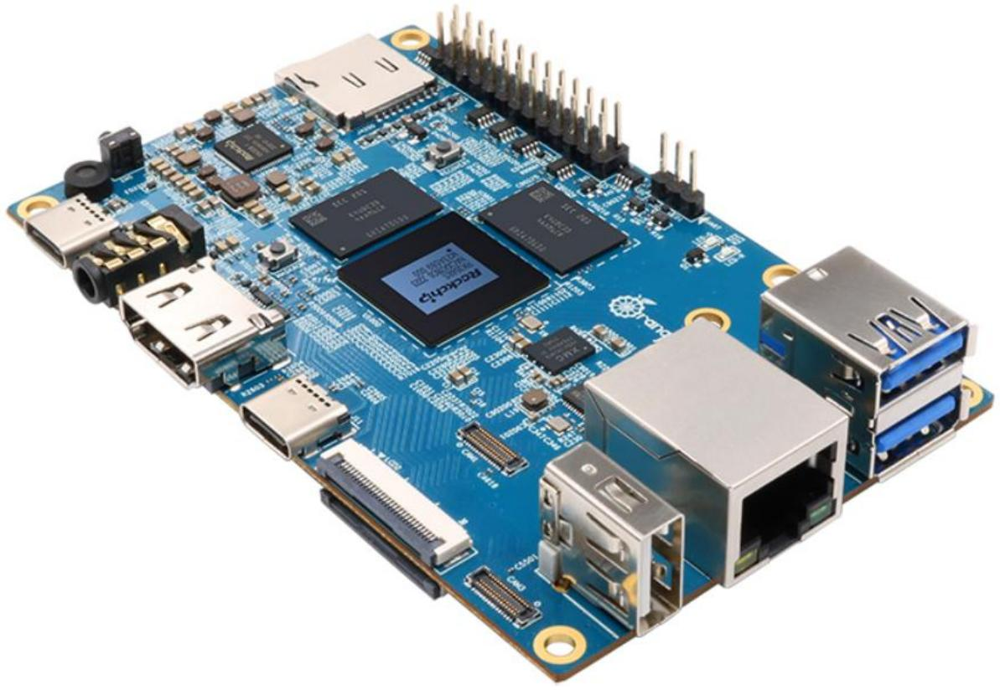


# 目录

# 1. Orange Pi 5 的基本特性 . . 11

1.1. 什么是 Orange Pi 5.. .11

1.2. Orange Pi 5 的用途. 11

1.3. Orange Pi 5 的硬件特性. .12

1.4. Orange Pi 5 的顶层视图和底层视图. .14

1.5. Orange Pi 5 的接口详情图. .15

# 2. 开发板使用介绍. . 17

2.1. 准备需要的配件.. 17

2.2. 下载开发板的镜像和相关的资料. 22

2.3. 基于 Windows PC 将 Linux 镜像烧写到 TF 卡的方法.. .25

2.3.1. 使用 balenaEtcher 烧录 Linux 镜像的方法 .25

2.3.2. 使用 RKDevTool 烧录 Linux 镜像到 TF 卡中的方法. . 28

2.3.3. 使用 Win32Diskimager 烧录 Linux 镜像的方法 . .. 36

2.4. 基于 Ubuntu PC 将 Linux 镜像烧写到 TF 卡的方法. . 38

2.5. 烧写 Linux 镜像到 SPIFlash+NVMe SSD 中的方法.. . 43

2.5.1. 使用 RKDevTool 烧录的方法. .43

2.5.2. 使用 dd 命令烧录的方法. . 52

2.5.3. 使用 balenaEtcher 软件烧录的方法 .. 58

2.6. 烧写 Linux 镜像到 SPIFlash+SATA SSD 中的方法.. .73

2.6.1. 使用 dd 命令烧录的方法. . 73

2.6.2. 使用 balenaEtcher 软件烧录的方法 .. 78

2.7. 烧写 Linux 镜像到 SPIFlash+USB 存储设备中的方法.. .93

2.8. 烧写 OpenWRT 镜像到 SPI FLASH 中的方法. .96

2.8.1. 使用 RKDevTool 烧录的方法. ..96

2.8.2. 使用 dd 命令烧录的方法. . 104

2.9. 烧录 Android 镜像到 TF 卡中的方法.. . 105

2.10. 烧录 Android 镜像到 SPIFlash+NVMe SSD 中的方法. .108

2.11. 烧录 Android 镜像到 SPIFlash+SATA SSD 中的方法. . 113

2.12. 烧录 Orange Pi OS (Droid)镜像到 TF 卡中的方法.. .118

2.13. 烧录 Orange Pi OS (Droid)镜像到 SPIFlash+NVMe SSD 中. 121

2.14. 烧录 Orange Pi OS (Droid)镜像到 SPIFlash+SATA SSD 中.. .126

2.15. 烧录 Orange Pi OS (OH)镜像到 TF 卡中的方法. .131

2.16. 使用 RKDevTool 清空 SPIFlash 的方法. .134

2.17. 启动香橙派开发板. . 141

2.18. 调试串口的使用方法. 142

2.18.1. 调试串口的连接说明. . 142

2.18.2. Ubuntu 平台调试串口的使用方法. . 143

2.18.3. Windows 平台调试串口的使用方法. ..146

2.19. 使用开发板26pin接口中的5v引脚供电说明.. 150

3. Ubuntu/Debian Server 和 Xfce 桌面系统使用说明 . . 151

3.1. 已支持的Linux镜像类型和内核版本. .151

3.2. linux 系统适配情况 . 151

3.2.1. Linux5.10 系统适配情况 .151

3.2.2. Linux6.1 系统适配情况 ..152

3.3. 本手册 linux 命令格式说明.. 154

3.4. linux 系统登录说明 . 155

3.4.1. linux 系统默认登录账号和密码 .155

3.4.2. 设置 linux系统终端自动登录的方法 .155

3.4.3. linux 桌面版系统自动登录说明 ..156

3.4.4. Linux 桌面版系统 root 用户自动登录的设置方法. . 157

3.4.5. Linux 桌面版系统禁用桌面的方法 ..158

3.5. 板载 LED 灯测试说明. 158

3.6. 网络连接测试.. . 160

3.6.1. 以太网口测试. .. 160

3.6.2. WIFI 连接测试. . 162

3.6.3. 设置静态 IP 地址的方法 ..169

3.6.4. AP6275P PCIe 网卡的使用方法 . .177

3.6.5. AP6275P PCIe 网卡通过 create_ap 创建 WIFI 热点的方法............181

3.7. SSH 远程登录开发板. .187

3.7.1. Ubuntu 下 SSH 远程登录开发板. ..187

3.7.2. Windows 下 SSH 远程登录开发板. ..188

3.8. ADB 的使用方法.. . 190

3.8.1. 网络 adb 的使用方法 . 190

3.8.2. 使用 type-c 数据线连接 adb . .. 192

3.9. 上传文件到开发板Linux系统中的方法.. .194

3.9.1. 在 Ubuntu PC 中上传文件到开发板 Linux 系统中的方法.. ...194

3.9.2. 在 Windows PC 中上传文件到开发板 Linux 系统中的方法 .......... 198

3.10. HDMI 测试.. .202

3.10.1. HDMI 显示测试. . 202

3.10.2. HDMI 转 VGA 显示测试. .203

3.10.3. HDMI 分辨率设置方法. .. 204

3.11. 蓝牙使用方法 .. .. 207

3.11.1. 桌面版镜像的测试方法. . 207

3.12. USB 接口测试.. ..210

3.12.1. 连接 USB 鼠标或键盘测试 . 210

3.12.2. 连接 USB 存储设备测试. . 211

3.12.3. USB 无线网卡测试. .. 211

3.12.4. USB 摄像头测试. .. 219

3.13. 音频测试.. . 221

3.13.1. 在桌面系统中测试音频方法. . 221

3.13.2. 使用命令播放音频的方法 . 223

3.13.3. 使用命令测试录音的方法 . 224

3.14. 使用 SATA SSD 的方法. . 225

3.15. 温度传感器 .. 230

3.16. 26 Pin 接口引脚说明 .. . 232

3.17. 安装 wiringOP 的方法 . .. 233

3.18. 26pin 接口 GPIO、I2C、UART、SPI、CAN 和 PWM 测试.. .235

3.18.1. 26pin GPIO 口测试. ..235

3.18.2. 26pin GPIO 口上下拉电阻的设置方法. ..237

3.18.3. 26pin SPI 测试. .. 238

3.18.4. 26pin I2C 测试 .. ..239

3.18.5. 26pin 的 UART 测试 .. . 241

3.18.6. 使用/sys/class/pwm 测试 PWM 的方法. .. 243

3.18.7. CAN 的测试方法. ..246

3.19. wiringOP 硬件 PWM 的使用方法.. 252

3.19.1. 使用 wiringOP 的 gpio 命令设置 PWM 的方法 . .253

3.19.2. PWM 测试程序的使用方法 ..258

3.20. wiringOP-Python 的安装使用方法. .259

3.20.1. wiringOP-Python 的安装方法 .259

3.20.2. 26pin GPIO 口测试. ..261

3.20.3. 26pin SPI 测试. .. 263

3.20.4. 26pin I2C 测试 .. ..265

3.20.5. 26pin 的 UART 测试 . .. 267

3.21. 硬件看门狗测试.. 269

3.22. 查看 RK3588S 芯片的序列号. .270

3.23. 安装 Docker 的方法. .270

3.24. 下载安装 arm64 版本 balenaEtcher 的方法 .. . 271

3.25. 宝塔 Linux 面板的安装方法.. .273

3.26. 设置中文环境以及安装中文输入法.. . 278

3.26.1. Debian 系统的安装方法 ..278

3.26.2. Ubuntu 20.04 系统的安装方法 .. 284

3.26.3. Ubuntu 22.04 系统的安装方法 .. 289

3.27. 远程登录 Linux 系统桌面的方法. .295

3.27.1. 使用 NoMachine 远程登录 . .. 295

3.27.2. 使用 VNC 远程登录. ..298

3.28. Linux 系统支持的部分编程语言测试. .301

3.28.1. Debian Bullseye 系统 . ..301

3.28.2. Debian Bookworm 系统 . ..303

3.28.3. Ubuntu Focal 系统. . 304

3.28.4. Ubuntu Jammy 系统 . ..306

3.29. QT 的安装方法. ..308

3.30. ROS 安装方法.. ..316

3.30.1. Ubuntu20.04 安装 ROS 1 Noetic 的方法. ..316

3.30.2. Ubuntu20.04 安装 ROS 2 Galactic 的方法 . ..320

3.30.3. Ubuntu22.04 安装 ROS 2 Humble 的方法 . . 323

3.31. 安装内核头文件的方法. . 325

3.32. 10.1 寸 MIPI LCD 屏幕的使用方法. . 327

3.32.1. 10.1 寸 MIPI 屏幕的组装方法 ..327

3.32.2. 打开 10.1 寸 MIPI LCD 屏幕配置的方法. ..329

3.32.3. 服务器版镜像旋转显示方向的方法. .. 332

3.32.4. 桌面版镜像旋转显示和触摸方向的方法 . 333

3.33. 开关机 logo 使用说明. . 335

3.34. OV13850 和 OV13855 MIPI 摄像头的测试方法 ..336

3.35. 通过 OpenCV 打开 MIPI 摄像头的方法.. . 340

3.36. ZFS 文件系统的使用方法. .343

3.36.1. 安装 ZFS 的方法. . 343

3.36.2. 创建 ZFS 池的方法. .. 345

3.36.3. 测试 ZFS 的数据去重功能. .. 346

3.36.4. 测试 ZFS 的数据压缩功能 . 347

3.37. CasaOS 安装和使用方法.. .. 348

3.37.1. CasaOS 的安装方法. . 348

3.37.2. CasaOS 的使用方法. . 348

3.38. 使用 NPU 的方法.. .357

3.38.1. 准备工具. . 357

3.38.2. 在 Ubuntu PC 端安装 RKNN-Toolkit2 . 357

3.38.3. 使用 RKNN-Toolkit2 进行模型转换和模型推理 .358

3.38.4. 调用 C 接口部署 RKNN 模型到开发板上运行. . 363

3.39. RK3588 使用百度飞浆的方法. .366

3.39.1. Ubuntu PC 端环境搭建 ..366

3.39.2. 板端环境搭建 . 369

3.39.3. 使用 FastDeploy 部署模型示例. ..373

3.40. RK3588 运行 RKLLM 大模型的方法 .. .376

3.40.1. RKLLM 介绍. .. 377

3.40.2. 准备工具. .. 379

3.40.3. Ubuntu PC端进行模型转换和编译源码的详细步骤 .. 379

3.40.4. 开发板端部署运行的详细步骤. . 391

3.40.5. 开发板端 Server 的部署运行的详细步骤. ..402

3.40.6. RK3588 运行 RKLLM 大模型的性能测试结果. ..414

3.41. 系统备份脚本 opi-bkimg 的使用方法.. .417

3.42. Linux Overlayroot 的使用方法. . 418

3.42.1. 配置 Overlayroot 为 tmpfs 模式. . 419

3.42.2. 配置 Overlayroot 为块设备存储模式 ..420

3.42.3. 禁用 Overlayroot 的方法. ..423

3.43. 关机和重启开发板的方法.. . 424

4. Ubuntu22.04 Gnome Wayland 桌面系统使用说明 . . 426

4.1. Ubuntu22.04 Gnome 桌面系统适配情况. ..426

4.2. 确认系统当前使用的窗口系统为wayland的方法. .427

4.3. 切换默认音频设备的方法. . 429

4.4. GPU 的测试方法.. ..430

4.5. Chromium浏览器硬解播放视频的测试方法. .. 431

4.6. Kodi硬解播放视频的测试方法. .. 433

4.7. Ubuntu22.04 Gnome 安装 ROS 2 Humble 的方法. ..443

4.8. 设置中文环境以及安装中文输入法的方法. .. 444

5. Orange Pi OS Arch 系统使用说明 . . 451

5.1. Orange Pi OS Arch 系统适配情况. ...451

5.2. AP6275P PCIe WIFI6+蓝牙模块的使用方法. . 452

5.3. OPi OS Arch 系统使用 SATA SSD 的方法. ..459

5.4. 10.1 寸 MIPI LCD 屏幕的使用方法. . 461

5.4.1. 10.1 寸 MIPI 屏幕的组装方法. ..461

5.4.2. 打开 10.1 寸 MIPI LCD 屏幕配置的方法. ..463

5.4.3. 旋转显示和触摸方向的方法. .. 465

5.5. OV13850 和 OV13855 MIPI 摄像头的测试方法. ..467

5.6. 设置中文环境以及安装中文输入法的方法.. .. 470

5.7. 安装 wiringOP 的方法 . . 477

5.8. 26pin 接口 GPIO、I2C、UART、SPI、CAN 和 PWM 测试. ..479

5.8.1. 26pin GPIO 口测试. ...479

5.8.2. 26pin GPIO 口上下拉电阻的设置方法. ...480

5.8.3. 26pin SPI 测试.. .. 482

5.8.4. 26pin I2C 测试 . ..483

5.8.5. 26pin 的 UART 测试 . .. 485

5.8.6. PWM 的测试方法 ...487

5.8.7. CAN 的测试方法. ..489

6. Linux SDK— orangepi-build 使用说明 . .492

6.1. 编译系统需求. .. 492

6.1.1. 使用开发板的 Ubuntu22.04 系统编译 . 492

6.1.2. 使用 x64 的 Ubuntu22.04 电脑编译. . 492

6.2. 获取 linux sdk 的源码. .494

6.2.1. 从 github 下载 orangepi-build. . 494

6.2.2. 下载交叉编译工具链. .. 496

6.2.3. orangepi-build 完整目录结构说明 ...497

6.3. 编译 u-boot.. .. 498

6.4. 编译 linux 内核.. . 502

6.5. 编译 rootfs. ..507

6.6. 编译 linux 镜像.. . 510

7. Linux 开发手册 . ..514

7.1. 在开发板的linux 系统中单独编译内核源码的方法 . 514

8. Android 12 系统的使用说明 . ..517

8.1. 已支持的 Android 版本. . 517

8.2. Android 功能适配情况. . 517

8.3. USB 无线网卡的使用方法.. ..518

8.4. AP6275P PCIe 网卡的使用方法.. . 519

8.5. WIFI 的连接测试方法. .520

8.6. Wi-Fi hotspot 的使用方法. . 522

8.7. 蓝牙的测试方法.. . 524

8.8. 10.1 寸 MIPI 屏幕的使用方法. ..527

8.9. OV13850 和 OV13855 MIPI 摄像头的测试方法. .528

8.10. 26pin 接口 GPIO、UART、SPI 和 PWM 测试.. ..536

8.10.1. 26pin GPIO 口测试. ..536

8.10.2. 26pin 的 UART 测试 . . 540

8.10.3. 26pin 的 SPI 测试. . 542

8.10.4. 26pin 的 PWM 测试 . . 545

8.11. ADB 的使用方法. . 547

8.11.1. 使用数据线连接 adb 调试. . 547

8.11.2. 使用网络连接 adb 调试. . 548

8.12. Android Box 测试过的 2.4G USB 遥控器. . 549

8.13. Android Box 系统 HDMI CEC 功能的使用方法.. .550

9. Android 12 源码的编译方法 . .552

9.1. 下载 Android 12 的源码.. . 552

9.2. 编译 Android 12 的源码.. . 553

10. OpenWRT 系统使用说明. .555

10.1. OpenWRT 版本. .555

10.2. OpenWRT 适配情况. .555

10.3. 第一次启动前扩容 TF 卡中的 rootfs. .555

10.4. 登录系统的方法. . 556

10.4.1. 通过串口登录. . 556

10.4.2. 通过 SSH 登录系统. ..556

10.4.3. 登录 LuCI 管理界面. ..557

10.4.4. 通过 LuCI 管理界面登录终端. ..558

10.4.5. 使用IP 地址+端口号方式登录终端. . 561

10.5. 通过命令行修改LAN口IP地址的方法. 561

10.6. 修改 root 密码的方法. . 563

10.6.1. 通过命令行修改. . 563

10.6.2. 通过 LuCI 管理界面修改. ..563

10.7. USB 接口测试.. ..565

10.7.1. 在命令行下挂载 USB 存储设备. . 565

10.7.2. 在 LuCI 管理界面挂载 USB 存储设备 .566

10.8. USB 转网口测试.. ..568

10.9. USB 无线网卡测试.. .570

10.9.1. 使用 USB 无线网卡连接 WIFI 热点的方法. ..570

10.10. 通过命令行安装软件包. . 573

10.10.1. 在终端通过 opkg 安装. .. 573

10.11. OpenWRT 管理界面安装软件包. .573

10.11.1. 查看系统可用软件包列表. . 574

10.11.2. 安装软件包示例. .. 574

10.11.3. 移除软件包示例. .. 577

10.12. 使用 Samba 网络共享. . 578

10.13. zerotier 使用说明. .582

11. OpenWRT 源码的编译方法. .585

11.1. 下载 OpenWRT 源码.. .585

11.2. 编译 OpenWRT 源码.. .585

12. 附录. . 587

12.1. 用户手册更新历史. 587

12.2. 镜像更新历史. . 589

# 1. Orange Pi 5 的基本特性

# 1.1. 什么是 Orange Pi 5

Orange Pi 5 采用了瑞芯微 RK3588S 新一代八核 64 位 ARM 处理器，具体为四核A76 和四核 A55，采用的三星8nm LP 制程工艺，大核主频最高可达2.4GHz，集成ARM Mali-G610 MP4 GPU，内嵌高性能 3D 和 2D 图像加速模块，内置高达 6 Tops算力的 AI 加速器 NPU，拥有 4GB/8GB/16GB/32GB（LPDDR4/4x）内存，具有高达8K显示处理能力。

Orange Pi 5 引出了相当丰富的接口，包括 HDMI 输出、Type-C、M.2PCIe2.0x1、千兆网口、USB2.0、USB3.0 接口和 26pin 扩展排针等。可广泛适用于高端平板、边缘计算、人工智能、云计算、AR/VR、智能安防、智能家居等领域，覆盖 AIoT 各个行业。

Orange Pi 5 支持 Orange Pi 官方研发的操作系统 Orange Pi OS，同时，支持Android 12.1、Debian11、Debian12、Ubuntu20.04 和 Ubuntu22.04 等操作系统。

# 1.2. Orange Pi 5 的用途

我们可以用它实现：

一台Linux 桌面计算机

一台Linux 网络服务器

Android 平板

Android 游戏机等

当然还有其他更多的功能，依托强大的生态系统以及各式各样的扩展配件，Orange Pi 可以帮助用户轻松实现从创意到原型再到批量生产的交付，是创客、梦想家、业余爱好者的理想创意平台。

# 1.3. Orange Pi 5 的硬件特性

<table><tr><td colspan="2">硬件特性介绍</td></tr><tr><td>CPU</td><td>Rockchip RK3588S (8nm LP 制程)8 核 64 位处理器4 核 Cortex-A76 和 4 核 Cortex-A55 大小核架构大核主频最高 2.4GHz,小核主频最高 1.8GHz</td></tr><tr><td>GPU</td><td>集成 ARM Mali-G610OpenGL ES1.1/2.0/3.2、OpenCL 2.2 和 Vulkan 1.2</td></tr><tr><td>NPU</td><td>内置高达 6 Tops 算力的 AI 加速器 NPU支持 INT4/INT8/INT16 混合运算</td></tr><tr><td>视频输出</td><td>HDMI 2.1,最大支持 8K @60HzDP1.4(DisplayPort)2 * MIPI D-PHY TX 4Lane</td></tr><tr><td>内存</td><td>4GB/8GB/16GB/32GB(LPDDR4/4x)</td></tr><tr><td>摄像头</td><td>1 * MIPI CSI 4Lane2 * MIPI D-PHY RX 4Lane</td></tr><tr><td>PMU</td><td>RK806-1</td></tr><tr><td>板载存储</td><td>16MB QSPI Nor FLASHMicroSD (TF) Card 插槽PCIe2.0x1 M.2 M-KEY (SSD) 插槽</td></tr><tr><td>以太网</td><td>10/100/1000Mbps 以太网 (YT8531C)</td></tr><tr><td>音频</td><td>3.5mm 耳机孔音频输入/输出板载 MIC 输入HDMI 输出</td></tr><tr><td>PCIe M.2 M-KEY</td><td>支持 PCIe WIFI6+BT5.0+BLE支持 SSD</td></tr><tr><td>USB 接口</td><td>1 * USB3.0 接口2 * USB2.0 接口(其中一个和 Type-C 接口共用)1 * USB3.0 Type-C 接口</td></tr><tr><td>26pin 扩展排针</td><td>用于扩展 UART、PWM、I2C、SPI、CAN 和 GPIO 接口</td></tr><tr><td>调试串口</td><td>3pin 调试串口</td></tr><tr><td>LED灯</td><td>电源指示灯和状态指示灯</td></tr><tr><td>按键</td><td>1*MaskROM键,1*RECOVERY,1*开关机键</td></tr><tr><td>供电</td><td>Type-C接口供电5V/4A;</td></tr><tr><td>支持的操作系统</td><td>Orange Pi OS(Droid)、Orange Pi OS(Arch)、Android12.1、Debian11、Debian12、Ubuntu20.04和Ubuntu22.04等操作系统</td></tr><tr><td colspan="2">外观规格介绍</td></tr><tr><td>产品尺寸</td><td>100mm*62mm</td></tr><tr><td>重量</td><td>46g</td></tr><tr><td colspan="2"><eq>^{[86x3]}</eq>range <eq>Pi^{TM}</eq>是深圳市迅龙软件有限公司的注册商标</td></tr></table>

# 1.4. Orange Pi 5 的顶层视图和底层视图


顶层视图：


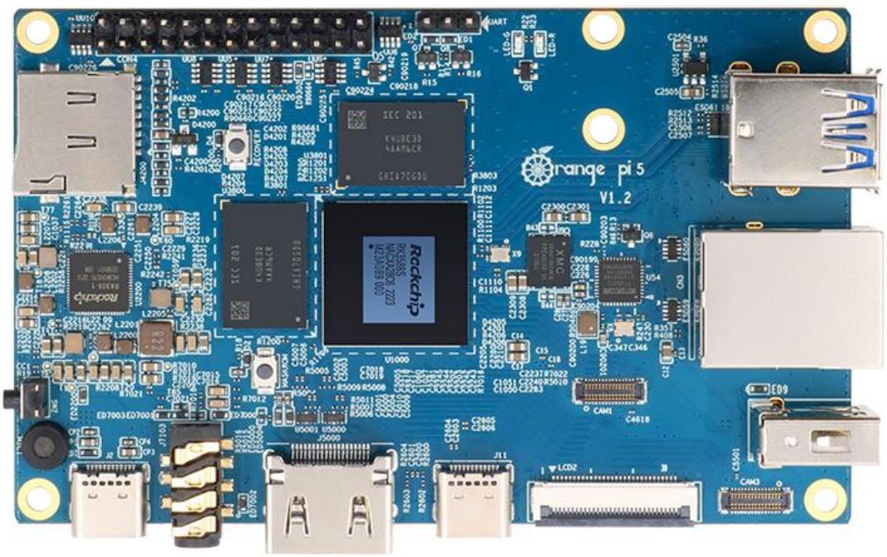


底层视图：


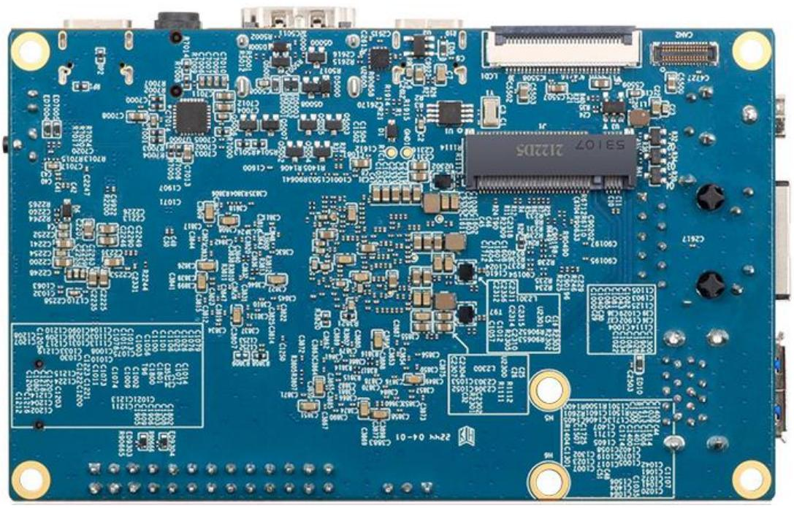


# 1.5. Orange Pi 5 的接口详情图


顶层视图


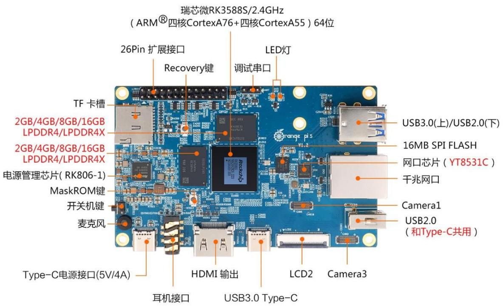


底层视图


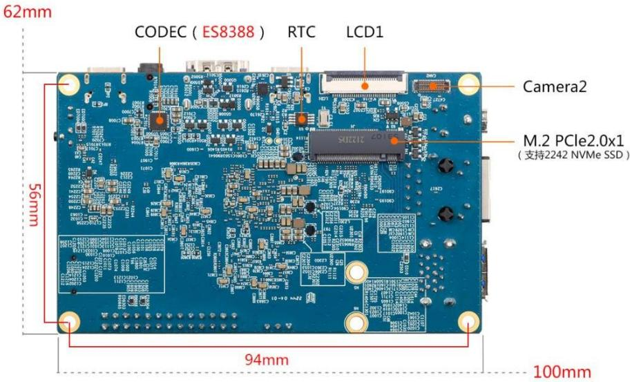


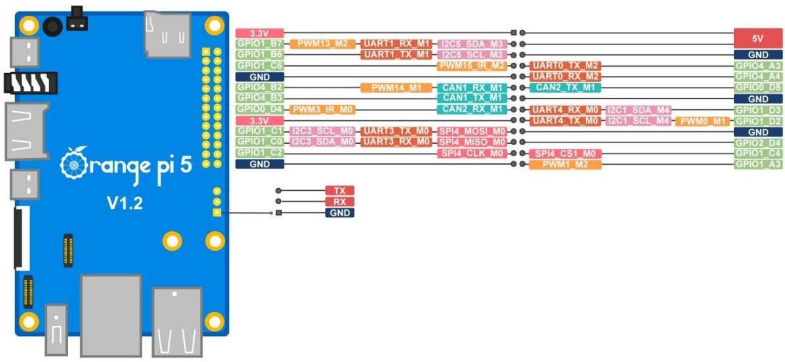


四个定位孔的直径都是 3.0mm，两个M.2 PICE设备固定孔直径为 3.5mm。

# 2. 开发板使用介绍

# 2.1. 准备需要的配件

1) TF 卡，最小 16GB 容量（推荐 32GB 或以上）的 class10 级或以上的高速闪迪卡

SanDisk闪迪


2) TF卡读卡器，用于将镜像烧录到 TF 卡中


3) HDMI 接口的显示器


4) HDMI转HDMI 连接线，用于将开发板连接到HDMI显示器或者电视进行显示


注意，如果想接 4K或者 8K显示器，请确保HDMI线支持4K或者 8K视频输出。

5) Type-C转HDMI线，通过Type-C接口将开发板连接到HDMI显示器或者电视进行显示


6) Type-C转USB转接头，用于连接USB存储设备或者鼠标键盘等USB设备


7) 10.1寸MIPI屏幕，用于显示开发板的系统界面（此屏幕包括转接板和OPi5Plus/OPi5B通用）


8) 电源适配器，Orange Pi 5 建议使用 5V/4A 的 Type-C 电源供电


开发板上有两个长得一样的Type-C接口，其中右边那个才是电源接口，中间那个是没有供电功能的，请别接错了。

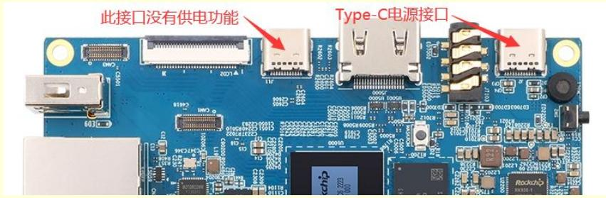


开发板的Type-C电源接口不支持PD协商功能，只支持固定的 5V电压输入。

9) USB接口的鼠标和键盘，只要是标准USB接口的鼠标和键盘都可以，鼠标和键盘可以用来控制Orange Pi开发板


10) USB摄像头


11) 5V的散热风扇。如下图所示，开发板的26pin接口上有5V和GND引脚可以接散热风扇，26pin排针的间距为 2.54mm，散热风扇的电源接口参照这个规格去淘宝购买即可。

注意，开发板插上Type-C接口的电源后26pin排针上的5V引脚就可以直接使用，无需其他设置，另外 26pin排针上的 5V引脚输出的电压是无法通过软件调节和关闭的（没有PWM的功能）。

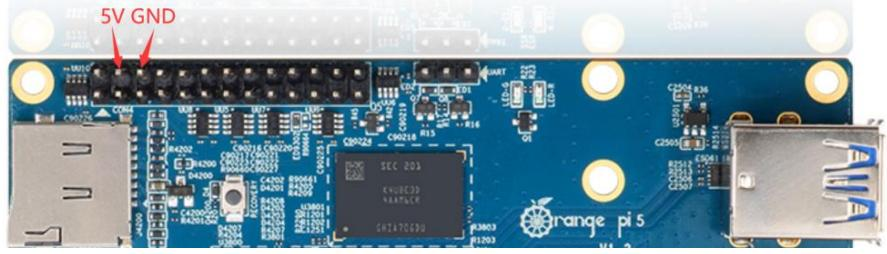


12) 百兆或者千兆网线，用于将开发板连接到因特网


13) Type-C接口的数据线，用于烧录镜像到NVMe SSD、使用ADB等功能


14) AP6275P PCIe WIFI6+蓝牙 5.0 二合一模块


range pi Orange Pi 5


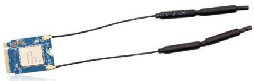


Wi-Fi6 + BT5.0模块


15) 1300 万MIPI接口的OV13850 摄像头

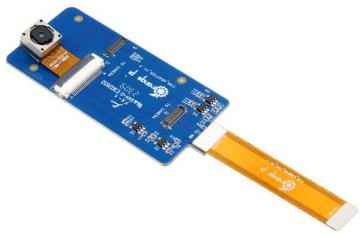


16) 1300 万MIPI接口的OV13855 摄像头

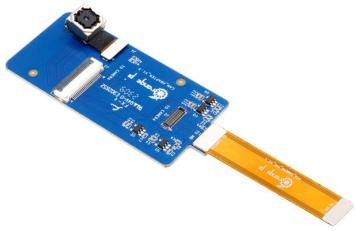


17) 配套外壳

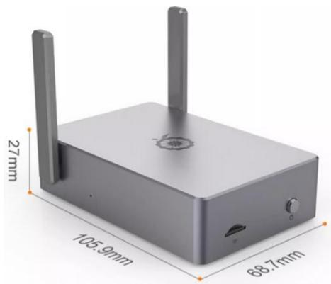


18) 3.3V 的 USB 转 TTL 模块和杜邦线，使用串口调试功能时，需要 USB 转 TTL模块和杜邦线来连接开发板和电脑


19) 安装有 Ubuntu 和 Windows 操作系统的个人电脑

<table><tr><td>1</td><td>Ubuntu22.04 PC</td><td>可选,用于编译 Linux 源码</td></tr><tr><td>2</td><td>Windows PC</td><td>用于烧录 Android 和 Linux 镜像</td></tr></table>

# 2.2. 下载开发板的镜像和相关的资料

1) 中文版资料的下载网址为：

```html
http://www.orangepi.cn/html/hardWare/computerAndMicrocontrollers/service-and-support/Orange-pi-5.html 
```

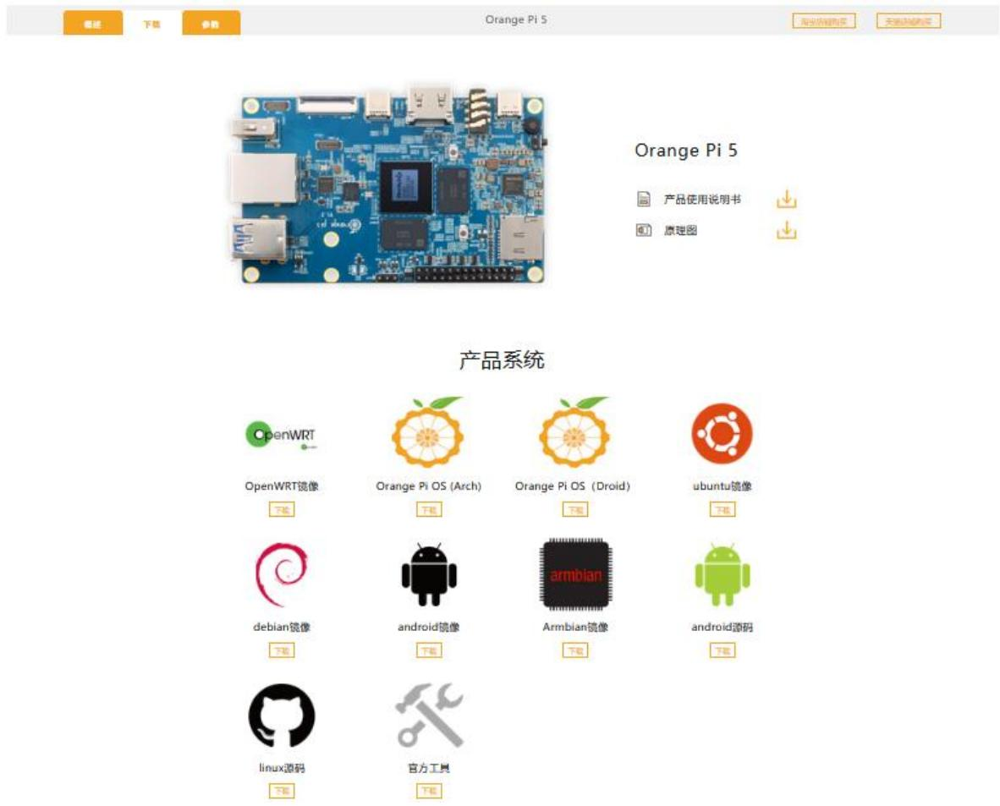


2) 英文版资料的下载网址为：

http://www.orangepi.org/html/hardWare/computerAndMicrocontrollers/service-and -support/Orange-pi-5.html 


Downloads


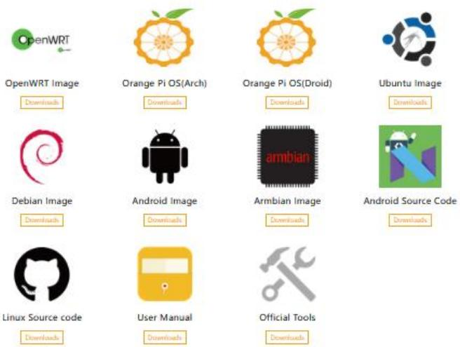


3) 资料主要包含

a. Android 源码：保存在百度云盘和谷歌网盘上

b. Linux 源码：保存在 Github 上

c. 用户手册和原理图：保存在百度云盘和谷歌网盘上

d. 官方工具：主要包括开发板使用过程中需要用到的软件

e. Android 镜像：保存在百度云盘和谷歌网盘上

f. Ubuntu 镜像：保存在百度云盘和谷歌网盘上

g. Debian 镜像：保存在百度云盘和谷歌网盘上

h. Orange Pi OS 镜像：保存在百度云盘和谷歌网盘上

i. OpenWRT 镜像：保存在百度云盘和谷歌网盘上

# 2.3. 基于 Windows PC 将 Linux 镜像烧写到 TF 卡的方法

注意，这里说的Linux镜像具体指的是从Orange Pi资料下载页面下载的Debian、Ubuntu、OpenWRT或者OPi OS Arch这样的Linux发行版镜像。

# 2.3.1. 使用 balenaEtcher 烧录 Linux 镜像的方法

1) 首先准备一张16GB或更大容量的TF 卡，TF 卡的传输速度必须为class10 级或class10 级以上，建议使用闪迪等品牌的TF卡

2) 然后使用读卡器把TF卡插入电脑

3) 从 Orange Pi 的资料下载页面下载想要烧录的Linux 操作系统镜像文件压缩包，然后使用解压软件解压，解压后的文件中，以“.img”结尾的文件就是操作系统的镜像文件，大小一般都在2GB以上。

注意，如果下载的是OpenWRT镜像，在OpenWRT镜像的下载链接中会看到下面三种类型的镜像，请选择“TF卡启动镜像”文件夹中的镜像文件。

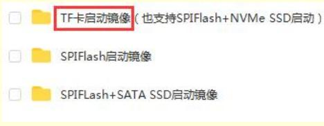


4) 然后下载 Linux 镜像的烧录软件——balenaEtcher，下载地址为：

https://www.balena.io/etcher/ 

5) 进入 balenaEtcher 下载页面后，点击绿色的下载按钮会跳到软件下载的地方


6) 然后可以选择下载 balenaEtcher 的 Portable 版本的软件，Portable 版本无需安装，双击打开就可以使用


Download Etcher


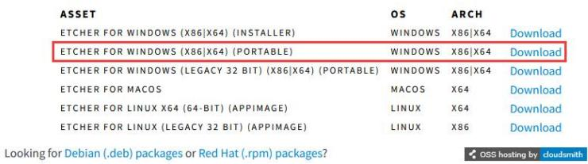


7) 如果下载的是需要安装版本的 balenaEtcher，请先安装再使用。如果下载的Portable 版本 balenaEtcher，直接双击打开即可，打开后的 balenaEtcher 界面如下图所示：


打开 balenaEtcher 时如果提示下面的错误：


请选择 balenaEtcher 后点击右键，然后选择以管理员身份运行。


8) 使用 balenaEtcher 烧录 Linux 镜像的具体步骤如下所示

a. 首先选择要烧录的Linux 镜像文件的路径

b. 然后选择TF卡的盘符

c. 最后点击 Flash 就会开始烧录 Linux 镜像到 TF 卡中

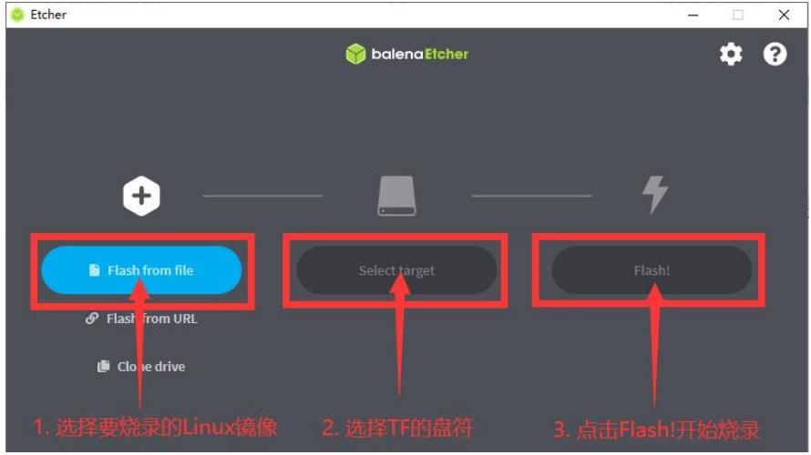


9) balenaEtcher 烧录 Linux 镜像的过程显示的界面如下图所示，另外进度条显示紫色表示正在烧录Linux 镜像到TF 卡中

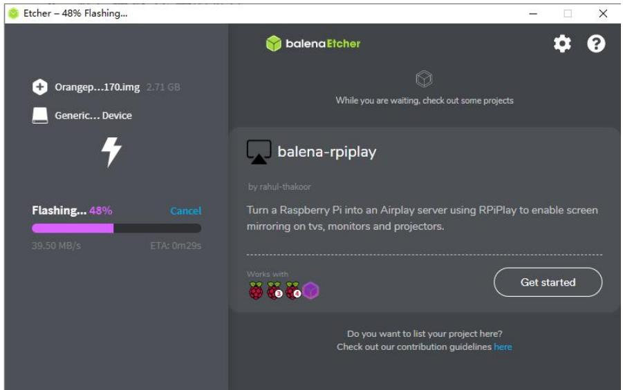


10) Linux 镜像烧录完后，balenaEtcher 默认还会对烧录到 TF 卡中的镜像进行校验，确保烧录过程没有出问题。如下图所示，显示绿色的进度条就表示镜像已经烧录完成，balenaEtcher正在对烧录完成的镜像进行校验

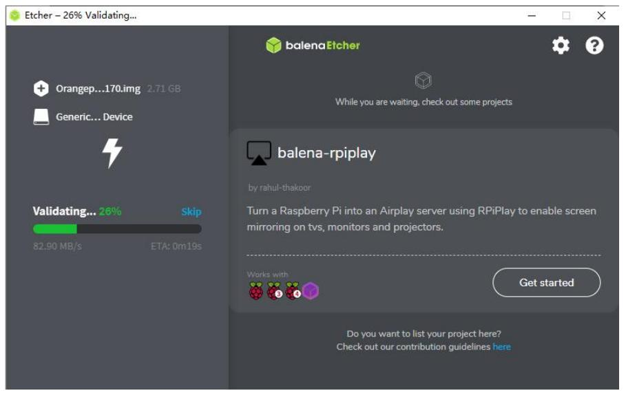


11) 成功烧录完成后balenaEtcher 的显示界面如下图所示，如果显示绿色的指示图标说明镜像烧录成功，此时就可以退出balenaEtcher，然后拔出TF 卡插入到开发板的TF卡槽中使用了


# 2.3.2. 使用 RKDevTool 烧录 Linux 镜像到 TF 卡中的方法

1) 首先需要准备一根品质良好的Type-C 接口的数据线


2) 还需要准备一张 16GB 或更大容量的 TF 卡，TF 卡的传输速度必须为 class10 级或class10 级以上，建议使用闪迪等品牌的TF卡

3) 然后将TF卡插入开发板的卡槽中

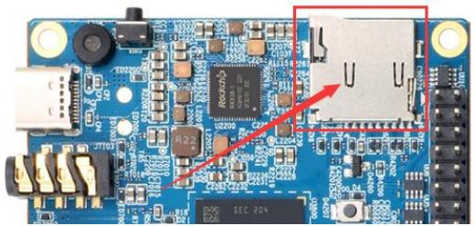


4) 然后从 Orange Pi 的资料下载页面下载瑞芯微驱动 DriverAssitant_v5.12.zip 和MiniLoader 以及烧录工具 RKDevTool_Release_v3.15.zip

a. 在 Orange Pi 的资料下载页面首先选择官方工具，然后进入下面的文件夹中


b. 然后下载下面的所有文件


注意，“MiniLoader-烧录Linux镜像才需要用到的东西”文件夹下文简称为MiniLoader文件夹。

5) 然后从 Orange Pi 的资料下载页面下载想要烧录的 Linux 操作系统镜像文件压缩包，然后使用解压软件解压，解压后的文件中，以“.img”结尾的文件就是操作系统的镜像文件，大小一般都在2GB以上

注意，如果下载的是OpenWRT镜像，在OpenWRT镜像的下载链接中会看到下面三种类型的镜像，请选择“TF卡启动镜像”文件夹中的镜像文件。

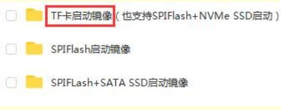


6) 然后用解压软件解压 DriverAssitant_v5.12.zip，再在解压后的文件夹中找到DriverInstall.exe 可执行文件并打开即可


7) 打开 DriverInstall.exe 后安装瑞芯微驱动的步骤如下所示

a. 点击“驱动安装”按钮

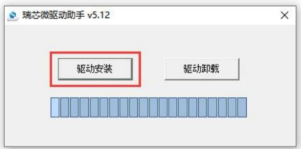


b. 等待一段时间后，会弹出窗口提示“安装驱动成功”，然后点击“确定”按钮即可

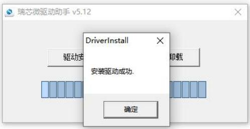


8) 然后解压 RKDevTool_Release_v3.15.zip，此软件无需安装，在解压后的文件夹中找到 RKDevTool 打开即可


9) 打开 RKDevTool 烧录工具后，因为电脑此时还没有通过 Type-C 线连接上开发板，所以左下角会提示“没有发现设备”


10) 然后开始烧录 Linux 镜像到 TF 卡中

a. 首先通过 Type-C 数据线连接好开发板与 Windows 电脑，开发板 Type-C 接口的位置如下图所示

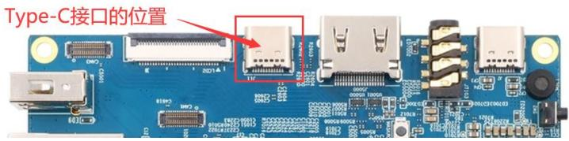


b. 确保开发板没有连接电源

c. 还需确保下图位置的白色USB2.0 接口没有插入USB设备

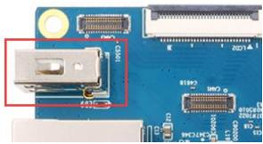


d. 然后按住开发板的MaskROM 按键不放，MaskROM 按键在开发板的位置如下图所示：


e. 然后给开发板接上 Type-C 接口的电源，并上电，然后就可以松开MaskROM按键了

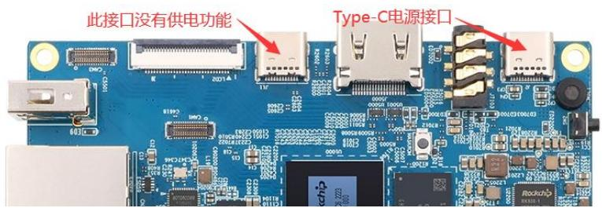


f. 如果前面的步骤顺利，此时开发板会进入MASKROM 模式，在烧录工具的界面上会提示“发现一个 MASKROM 设备”


g. 然后将鼠标光标放在下面的这片区域中


h. 然后点击鼠标右键会弹出下图所示的选择界面


# i. 然后选择导入配置选项


# j. 然后选择前面下载的 MiniLoader 文件夹中的 rk3588_linux_tfcard.cfg 配置文件，再点击打开

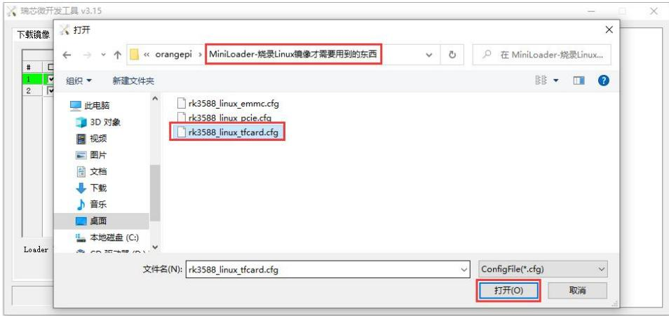


# k. 然后点击确定

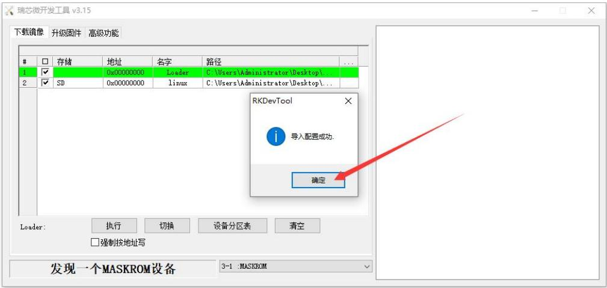


# l. 然后点击下图所示的位置

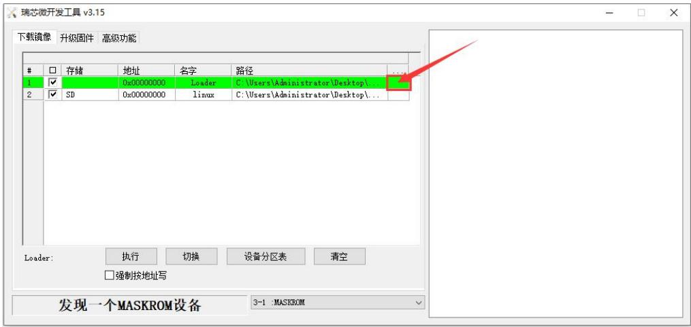


# m. 再选择前面下载的 MiniLoader 文件夹中 MiniLoaderAll.bin，再点击打开

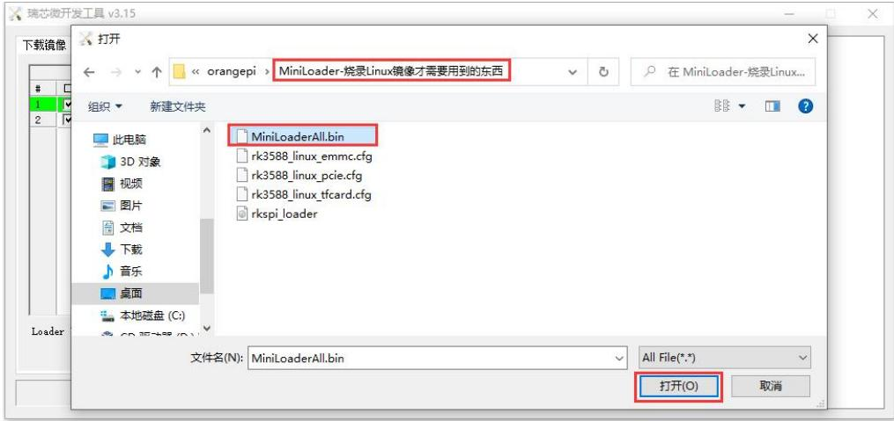


# n. 然后点击下图所示的位置

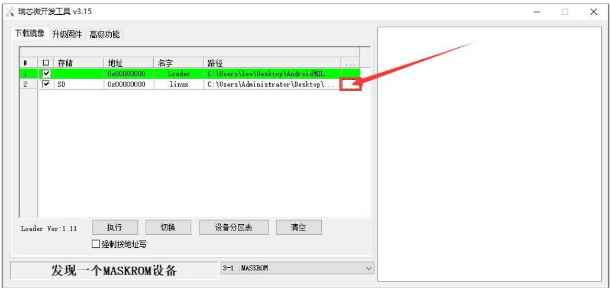


# o. 然后选择想要烧录的linux 镜像的路径，再点击打开

在烧录镜像前，建议将要烧录的linux镜像重命名为orangepi.img或者其它比较短的名字，这样在烧录镜像的时候就能看到烧录进度的百分比数值。

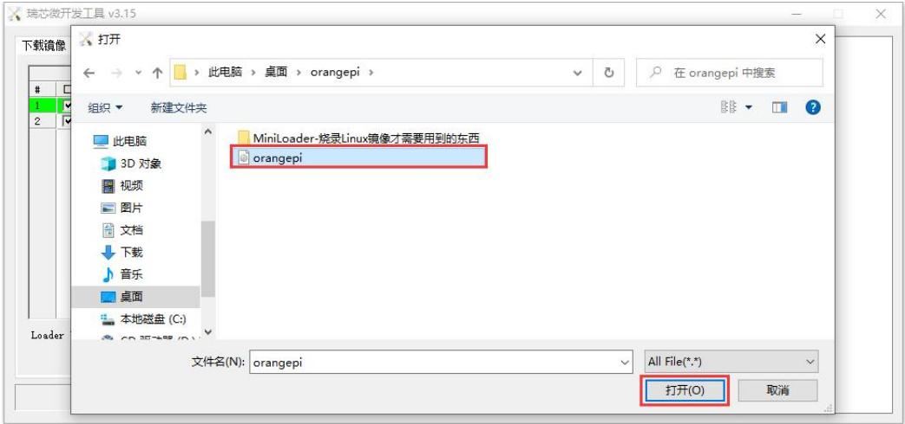


# p. 然后请勾选上强制按地址写选项

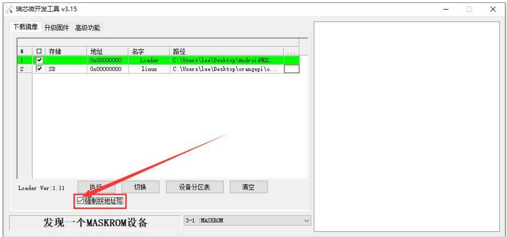


# q. 再点击执行按钮就会开始烧录linux 镜像到开发板的tf卡中

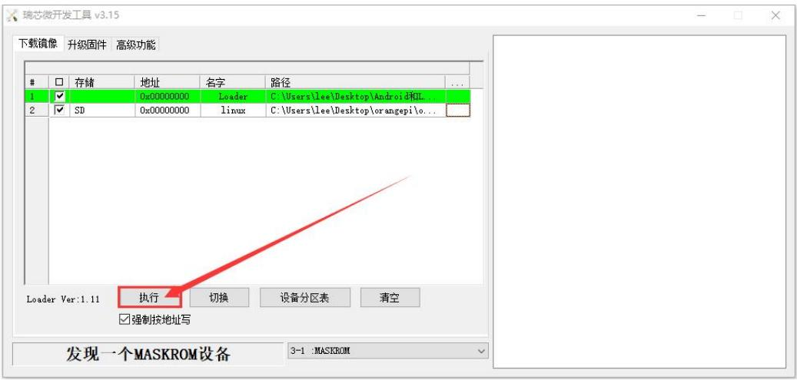


# r. linux 镜像烧录完后的显示log 如下图所示

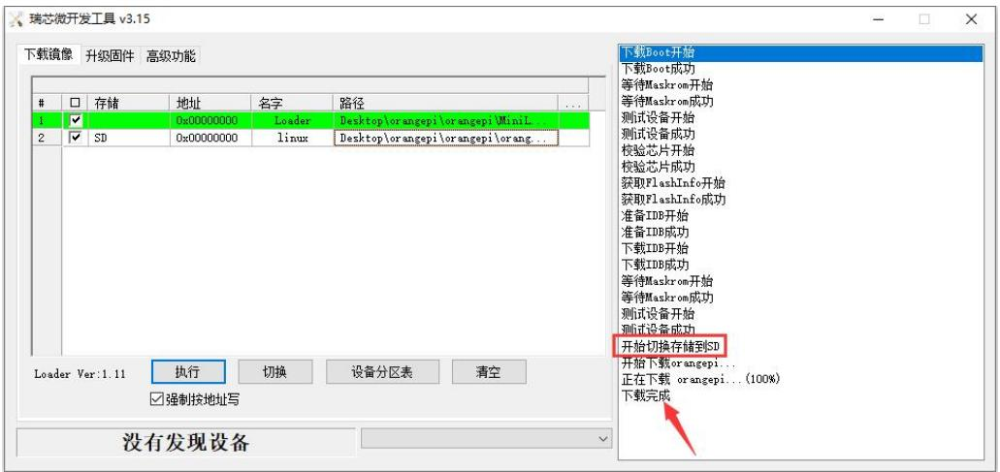


s. 烧录完 linux 镜像到 tf 卡中后，linux 系统会自动启动。

# 2.3.3. 使用 Win32Diskimager 烧录 Linux 镜像的方法

1) 首先准备一张 16GB 或更大容量的 TF 卡，TF 卡的传输速度必须为 class10 级或class10 级以上，建议使用闪迪等品牌的TF卡

2) 然后使用读卡器把TF卡插入电脑

3) 接着格式化 TF卡

a. 可以使用 SD Card Formatter 这个软件格式化 TF 卡，其下载地址为

```txt
https://www.sdcard.org/downloads/formatter/eula_windows/SDCardFormatterv5_WinEN.zip 
```

b. 下载完后直接解压安装即可，然后打开软件

c. 如果电脑只插入了 TF 卡，则“Select card”一栏中会显示TF 卡的盘符，如

果电脑插入了多个USB存储设备，可以通过下拉框选择TF 卡对应的盘符

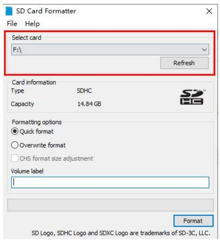


d. 然后点击“Format”，格式化前会弹出一个警告框，选择“是(Y)”后就会开始格式化

SD Card Formatter 


Formatting will erase all data on this card. Doyou want to continue? 

Note:As formatting can take some time(especially when overwrite option is selected),pleasemake sure that yourcomputer isconnected toapower supplyand that sleepmodeisdisabled. 

是（

否（N）

e. 格式化完 TF 卡后会弹出下图所示的信息，点击确定即可

SD Card Formatter 


Formating wassuccesfullycompleted. 

Volumeinformation: 

Filesystem:FAT32 

Capacity:1483GB(15,923,150848byes) 

Freespace:14.83GB（15,923,118,080 bytes) 

Cluster size:32kilobytes 

Volumelabel: 

确定

4) 从Orange Pi的资料下载页面下载想要烧录的Linux操作系统镜像文件压缩包，然后使用解压软件解压，解压后的文件中，以“.img”结尾的文件就是操作系统的镜像文件，大小一般都在2GB以上

注意，如果下载的是OpenWRT镜像，在OpenWRT镜像的下载链接中会看到下面三种类型的镜像，请选择“TF卡启动镜像”文件夹中的镜像文件。

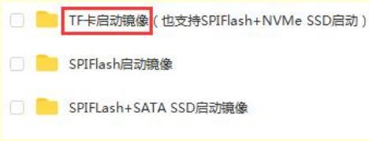


5) 使用 Win32Diskimager 烧录 Linux 镜像到 TF 卡

a. Win32Diskimager 的下载页面为

```txt
http://sourceforge.net/projects/win32diskimager/files/Archive/ 
```

b. 下载完后直接安装即可，Win32Diskimager 界面如下所示

a) 首先选择镜像文件的路径

b) 然后确认下TF 卡的盘符和“设备”一栏中显示的一致

c) 最后点击“写入”即可开始烧录

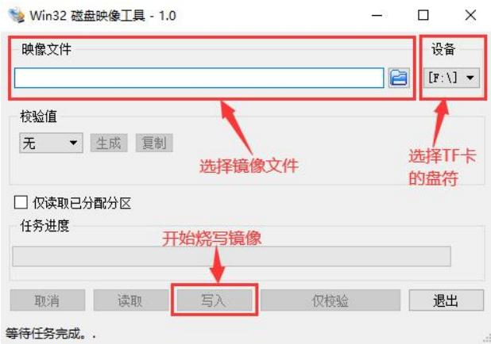


c. 镜像写入完成后，点击“退出”按钮退出即可，然后就可以拔出TF 卡插到开发板中启动

# 2.4. 基于 Ubuntu PC 将 Linux 镜像烧写到 TF 卡的方法

注意，这里说的Linux镜像具体指的是从Orange Pi资料下载页面下载的Debian、Ubuntu、OpenWRT或者OPi OS Arch这样的Linux发行版镜像，Ubuntu PC指的是安装了Ubuntu系统的个人电脑。

1) 首先准备一张 16GB 或更大容量的 TF 卡，TF 卡的传输速度必须为 class10 级或

class10 级以上，建议使用闪迪等品牌的TF卡

2) 然后使用读卡器把TF卡插入电脑

3) 下载 balenaEtcher 软件，下载地址为

https://www.balena.io/etcher/ 

4) 进入balenaEtcher下载页面后，点击绿色的下载按钮会跳到软件下载的地方


5) 然后选择下载Linux 版本的软件即可

# Download Etcher

<table><tr><td>ASSET</td><td>OS</td><td>ARCH</td><td></td></tr><tr><td>ETCHER FOR WINDOWS (X86|X64) (INSTALLER)</td><td>WINDOWS</td><td>X86|X64</td><td>Download</td></tr><tr><td>ETCHER FOR WINDOWS (X86|X64) (PORTABLE)</td><td>WINDOWS</td><td>X86|X64</td><td>Download</td></tr><tr><td>ETCHER FOR WINDOWS (LEGACY 32 BIT) (X86|X64) (PORTABLE)</td><td>WINDOWS</td><td>X86|X64</td><td>Download</td></tr><tr><td>ETCHER FOR MACOS</td><td>MACOS</td><td>X64</td><td>Download</td></tr><tr><td>ETCHER FOR LINUX X64 (64-BIT) (APPIMAGE)</td><td>LINUX</td><td>X64</td><td>Download</td></tr><tr><td>ETCHER FOR LINUX (LEGACY 32 BIT) (APPIMAGE)</td><td>LINUX</td><td>X86</td><td>Download</td></tr></table>


oss hosting by doudsmith 


6) 从 Orange Pi 的资料下载页面下载想要烧录的Linux 操作系统镜像文件压缩包，然后使用解压软件解压，解压后的文件中，以“.img”结尾的文件就是操作系统的镜像文件，大小一般都在2GB以上

注意，如果下载的是OpenWRT镜像，在OpenWRT镜像的下载链接中会看到下面三种类型的镜像，请选择“TF卡启动镜像”文件夹中的镜像文件。

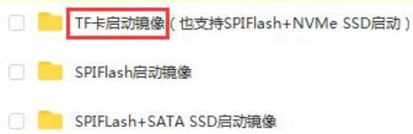


7z 结尾的压缩包的解压命令如下所示


```txt
test@test:~$ 7z x Orangepi5_1.0.0_debian_bullseye_desktop_xfce_linux5.10.160.7z
test@test:~$ ls Orangepi5_1.0.0_debian_bullseye_desktop_xfce_linux5.10.160.*
Orangepi5_1.0.0_debian_bullseye_desktop_xfce_linux5.10.160.7z
Orangepi5_1.0.0_debian_bullseye_desktop_xfce_linux5.10.160.sha #校验和文件
Orangepi5_1.0.0_debian_bullseye_desktop_xfce_linux5.10.160.img #镜像文件
```


如果下载的是 OpenWRT 镜像，压缩包是以gz 结尾的，解压命令如下所示


```txt
test@test:~$ gunzip openwrt-aarch64-opi5-23.04-linux-5.10.110-ext4.img.gz
test@test:~$ ls openwrt-aarch64-opi5-23.04-linux-5.10.110-ext4.img
openwrt-aarch64-opi5-23.04-linux-5.10.110-ext4.img #镜像文件
```

7) 解压镜像后可以先用sha256sum-c *.sha命令计算下校验和是否正确，如果提示成功说明下载的镜像没有错，可以放心的烧录到 TF 卡，如果提示校验和不匹配说明下载的镜像有问题，请尝试重新下载

```batch
test@test:~$ sha256sum -c *.sha
Orangepi5_1.0.0_debian_bullseye_desktop_xfce_linux5.10.160.img: OK 
```


如果下载的是 OpenWRT 镜像，要对压缩包进行校验，不要解压后再校验


```txt
test@test:~$ sha256sum -c openwrt-aarch64-opi5-23.04-linux-5.10.110-ext4.img.gz.sha
openwrt-aarch64-opi5-23.04-linux-5.10.110-ext4.img.gz: OK 
```

8) 然后在 Ubuntu PC 的图形界面双击 balenaEtcher-1.5.109-x64.AppImage 即可打开balenaEtcher（无需安装），balenaEtcher 打开后的界面显示如下图所示

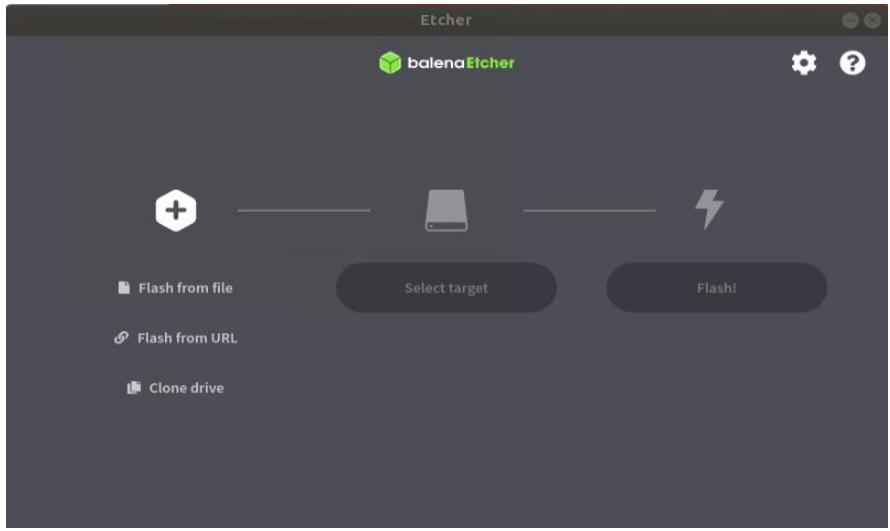


9) 使用 balenaEtcher 烧录 Linux 镜像的具体步骤如下所示

a. 首先选择要烧录的Linux 镜像文件的路径

b. 然后选择TF卡的盘符

c. 最后点击 Flash 就会开始烧录 Linux 镜像到 TF 卡中

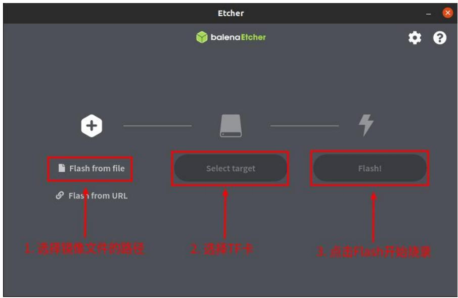


10) balenaEtcher烧录Linux 镜像的过程显示的界面如下图所示，另外进度条显示紫色表示正在烧录Linux 镜像到TF 卡中

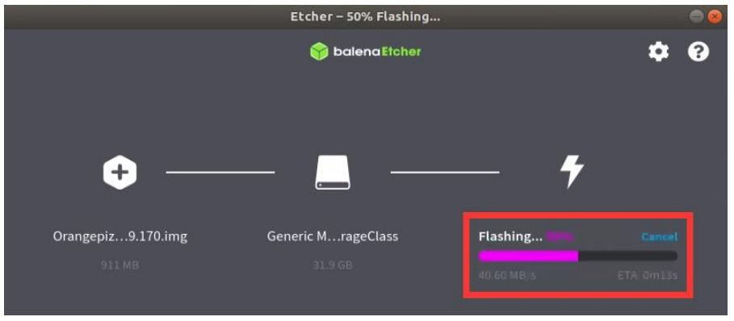


12) Linux 镜像烧录完后，balenaEtcher 默认还会对烧录到 TF 卡中的镜像进行校验，确保烧录过程没有出问题。如下图所示，显示绿色的进度条就表示镜像已经烧录完成，balenaEtcher正在对烧录完成的镜像进行校验

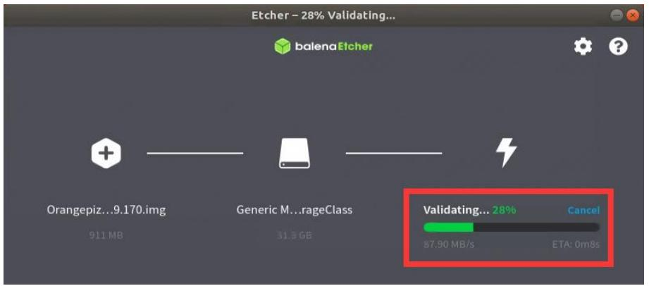


13) 成功烧录完成后 balenaEtcher 的显示界面如下图所示，如果显示绿色的指示图标说明镜像烧录成功，此时就可以退出balenaEtcher，然后拔出TF 卡插入到开发板的TF卡槽中使用了

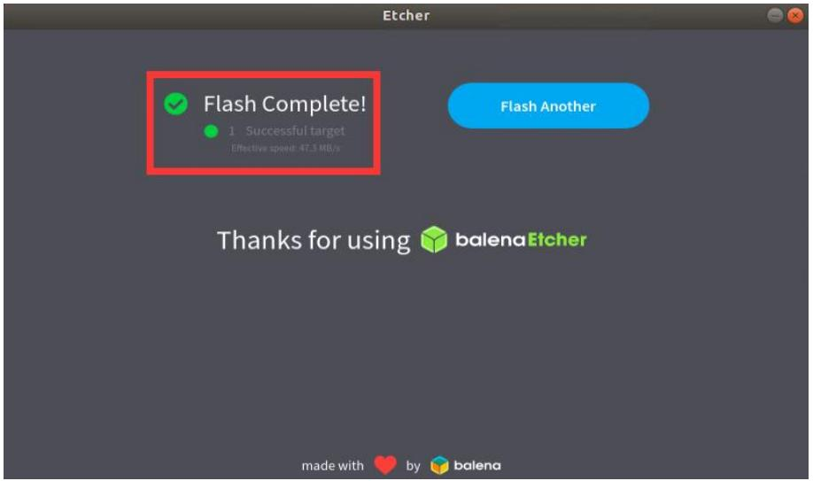


# 2.5. 烧写 Linux 镜像到 SPIFlash+NVMe SSD 中的方法

注意，这里说的Linux镜像具体指的是从Orange Pi资料下载页面下载的Debian、Ubuntu、OpenWRT或者OPi OS Arch这样的Linux发行版镜像。

注意，下面所有的操作都是在 Windows电脑中进行的。

# 2.5.1. 使用 RKDevTool 烧录的方法

1) 首先需要准备一个 NVMe SSD 固态硬盘，开发板 M.2 插槽支持的 PCIe 为PCIe2.0x1，理论最高速度为 500MB/s。PCIe3.0 和 PCIe4.0 的 NVMe SSD 也是可以用的，只是速度最高只有PCIe2.0x1 的速度。

a. M.2 2230 规格的 SSD 如下所示


b. M.2 2242 规格的 SSD 如下所示


2) 然后把 NVMe SSD 插入开发板的 M.2 PCIe 接口，并固定好

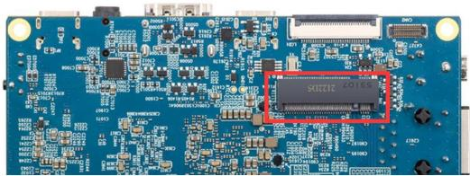


3) SPI Flash 在开发板上的位置如下图所示，开始烧录前无需其他设置


4) 然后需要准备一根品质良好的Type-C 接口的数据线


5) 然后从 Orange Pi 的资料下载页面下载瑞芯微驱动 DriverAssitant_v5.12.zip 和MiniLoader 以及烧录工具 RKDevTool_Release_v3.15.zip

a. 在 Orange Pi 的资料下载页面首先选择官方工具，然后进入下面的文件夹中


b. 然后下载下面的所有文件


注意，“MiniLoader-烧录Linux镜像才需要用到的东西”文件夹下文简称为MiniLoader文件夹。

6) 然后从 Orange Pi 的资料下载页面下载想要烧录的 Linux 操作系统镜像文件压缩包，然后使用解压软件解压，解压后的文件中，以“.img”结尾的文件就是操作系统的镜像文件，大小一般都在2GB以上

注意，如果下载的是OpenWRT镜像，在OpenWRT镜像的下载链接中会看到下面三种类型的镜像，请选择“TF卡启动镜像”文件夹中的镜像文件。


7) 然后用解压软件解压 DriverAssitant_v5.12.zip，再在解压后的文件夹中找到DriverInstall.exe 可执行文件并打开即可


8) 打开 DriverInstall.exe 后安装瑞芯微驱动的步骤如下所示

a. 点击“驱动安装”按钮

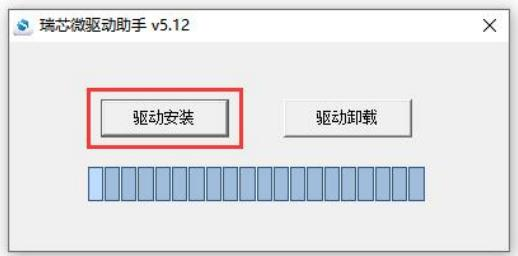


b. 等待一段时间后，会弹出窗口提示“安装驱动成功”，然后点击“确定”按钮即可

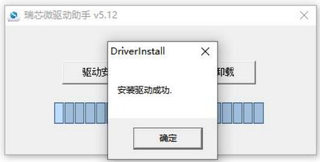


9) 然后解压 RKDevTool_Release_v3.15.zip，此软件无需安装，在解压后的文件夹中找到 RKDevTool 打开即可

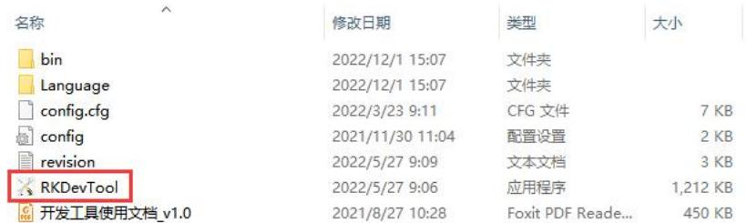


10) 打开 RKDevTool 烧录工具后，因为电脑此时还没有通过 Type-C 线连接上开发板，所以左下角会提示“没有发现设备”


11) 然后开始烧录 Linux 镜像到 SSD 中

a. 首先通过 Type-C 数据线连接好开发板与 Windows 电脑，开发板 Type-C 接口的位置如下图所示

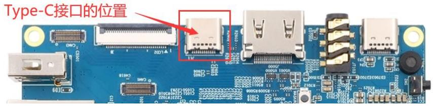


b. 确保开发板没有连接电源和插入TF卡

c. 还需确保下图位置的白色USB2.0 接口没有插入USB设备


d. 然后按住开发板的 MaskROM 按键不放，MaskROM 按键在开发板的位置如下图所示：

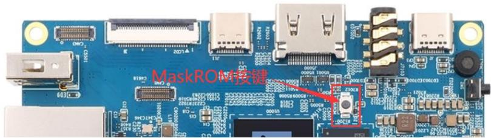


e. 然后给开发板接上 Type-C 接口的电源，并上电，然后就可以松开MaskROM按键了


f. 如果前面的步骤顺利，此时开发板会进入MASKROM 模式，在烧录工具的界面上会提示“发现一个 MASKROM 设备”


g. 然后将鼠标光标放在下面的这片区域中


h. 然后点击鼠标右键会弹出下图所示的选择界面


# i. 然后选择导入配置选项


# j. 然后进入前面下载的 MiniLoader 文件夹中，然后选择 rk3588_linux_pcie.cfg配置文件，再点击打开


# k. 然后点击确定


# l. 然后点击下图所示的位置


# m. 再选择前面下载的 MiniLoader 文件夹中 MiniLoaderAll.bin，再点击打开


# n. 然后点击下图所示的位置


o. 然后进入前面下载的 MiniLoader 文件夹中，再选择 rkspi_loader.img，再点击打开


p. 然后点击下图所示的位置


q. 然后选择想要烧录的linux 镜像的路径，再点击打开

在烧录镜像前，建议将要烧录的linux镜像重命名为orangepi.img或者其它比较

短的名字，这样在烧录镜像的时候就能看到烧录进度的百分比数值。


r. 然后请勾选上强制按地址写选项


s. 再点击执行按钮就会开始烧录linux镜像到SSD中


t. linux 镜像烧录完后的显示log 如下图所示


如果烧录有问题，请先清空下 SPIFlash 然后再烧录试下。清空 SPIFlash的方法请参考下使用 RKDevTool 清空 SPIFlash 的方法一小节的说明。

u. 镜像烧录完后会自动启动 SPIFlash+PCIe SSD 中的 linux 系统，如果没有正常启动，请重新上电试下。

# 2.5.2. 使用dd命令烧录的方法

1) 首先需要准备一个 NVMe SSD 固态硬盘，开发板 M.2 插槽支持的 PCIe 为PCIe2.0x1，理论最高速度为 500MB/s。PCIe3.0 和 PCIe4.0 的 NVMe SSD 也是可以用的，只是速度最高只有PCIe2.0x1 的速度。

a. M.2 2230 规格的 SSD 如下所示


b. M.2 2242 规格的 SSD 如下所示


2) 然后把 NVMe SSD 插入开发板的 M.2 PCIe 接口，并固定好


3) SPI Flash 在开发板上的位置如下图所示，开始烧录前无需其他设置


4) 烧录 linux 镜像到 SPIFlash+NVMe SSD 中需要借助 TF 卡来完成，所以首先需要将 linux 镜像烧录到 TF 卡上，然后使用 TF 卡启动开发板进入linux 系统。烧录Linux镜像到 TF 卡的方法请见基于 Windows PC 将 Linux 镜像烧写到 TF 卡的方法和基于 Ubuntu PC 将 Linux 镜像烧写到 TF 卡的方法两小节的说明。

5) 使用 TF 卡启动 linux 系统后，我们首先烧录 u-boot 镜像到 SPI Flash 中

a. 先运行下 nand-sata-install，普通用户记得加 sudo 权限

```txt
orangepi@orangepi:~$ sudo nand-sata-install 
```

b. 然后选择 7 Install/Update ther bootloader on SPI Flash


c. 然后选择<Yes>


d. 然后请耐心等待烧录完成，烧录完成后显示如下所示（左下角会显示一个Done）：


OPi OS Arch 系统中没有 nand-sata-install 这个脚本，请使用下面的命令将u-boot 镜像到 SPI Flash 中：

[orangepi@orangepi ~]$ sudo dd if=/boot/rkspi_loader.img of=/dev/mtdblock0 

如果需要启动 OpenWRT 镜像，需要到官网下载最新版本的 u-boot镜像，然后烧录到 SPI Flash 中，下载步骤如下所示：

a. 首先进入开发板的资料下载页面，然后在资料下载页面选择官方工具，然后进入下面的文件夹中


b. 然后选择进入下面的目录


c. 然后下载 rkspi_loader.img


d. 然后把 rkspi_loader.img 上传到开发板的 Ubuntu 或者 Debian 或者 OPi OS Arch系统中，上传的方法请参考上传文件到开发板 Linux 系统中的方法小节的说明。

最后执行下面的命令烧录 u-boot 镜像到 SPI Flash 中（注意此命令是在 Ubuntu或者 Debian 或者 OPi OS Arch 中执行的）：

```txt
orangepi@orangepi:~$ sudo dd if=rkspi_loader.img of=/dev/mtdblock0 
```

6) 然后将 linux 镜像文件（从官网下载的 Debian、Ubuntu 或者 OpenWRT 镜像）上传到TF卡中。上传linux镜像文件到开发板中的方法请参考上传文件到开发板Linux系统中的方法小节的说明。

注意，如果下载的是OpenWRT镜像，在OpenWRT镜像的下载链接中会看到下面三种类型的镜像，请选择“TF卡启动镜像”文件夹中的镜像文件。


7) 上传完镜像到开发板的linux系统中后，我们再在开发板linux 系统的命令行中进入 镜 像 文 件 的 存 放 路 径 ， 比 如 ， 我 将 开 发 板 的 linux 镜 像 存 放 在/home/orangepi/Desktop 目录下了，然后进入/home/orangepi/Desktop 目录就能看到上传的镜像文件了。

```txt
orangepi@orangepi:~$ cd /home/orangepi/Desktop
orangepi@orangepi:~/Desktop$ ls
Orangepi5_x.x.x_debian_bullseye_desktop_xfce_linux5.10.160.img 
```

怎么进入开发板linux系统的命令行？

1. 使用串口登录终端的方法请参考调试串口的使用方法一小节的说明。

2. 使用ssh远程登录linux系统请参考SSH远程登录开发板一小节的说明。

3. 如果接了HDMI、LCD等显示屏幕，可以在桌面中打开一个命令行终端。

4) 接下来，我们先确认下NVMeSSD已经被开发板的linux正常识别了。如果NVMeSSD正常识别了的话，使用sudofdisk-l 命令就能看到nvme 相关的信息

```txt
orangepi@orangepi:~/Desktop$ sudo fdisk -l | grep "nvme0n1" Disk /dev/nvme0n1: 1.86 TiB, 2048408248320 bytes, 4000797360 sectors 
```


使用 lspci 命令可以看到一个NVMe 相关的PCI设备


```txt
orangepi@orangepi:~/Desktop$ lspci
0004:40:00.0 PCI bridge: Fuzhou Rockchip Electronics Co., Ltd Device 3588 (rev 01)
0004:41:00.0 Non-Volatile memory controller: MAXIO Technology (Hangzhou) Ltd.
NVMe SSD Controller MAP1202 (rev 01) 
```


9) 然后我们可以使用dd 命令清空下NVMeSSD（可选）


```txt
orangepi@orangepi5:~/Desktop$ sudo dd bs=1M if=/dev/zero of=/dev/nvme0n1 count=2000 status=progress
orangepi@orangepi5:~/Desktop$ sudo sync 
```


10) 然后就可以使用 dd 命令烧录开发板的 linux 镜像到 NVMe SSD 中


```txt
a. 下面的命令中 if= 参数后面是要填写 linux 镜像存放的完整路径+Linux 镜像的名字（比如/home/orangepi/Desktop/Linux 镜像的名字）。因为上面我们已经进入 linux 镜像的路径下了，所以只需要填写 Linux 镜像的名字的即可。
b. 下面命令中的 linux 镜像名请不要照抄，要替换为实际的镜像名（因为镜像的版本号可能会更新）。
```

```batch
sudo dd bs=1M if=Orangepi5_x.x.x_debian_bullseye_desktop_xfce_linux5.10.160.img of=/dev/nvme0n1 status=progress
sudo sync 
```

注意，如果上传的是 .7z或者.xz 或者.gz结尾linux镜像压缩文件，使用dd命令烧录前请记得先解压。

dd命令的所有参数的详细说明和更多用法可以在linux系统中执行man dd命令来查看。

11) 当成功烧录开发板的 linux 镜像到 NVMe SSD 后，此时就可以使用 poweroff 命令关机了。然后请拔出 TF 卡，再短按电源按键开机，此时就会启动SPIFlash+NVMeSSD 中的 linux 系统了。

12) 启动NVMeSSD中的系统后，使用 df -h命令可以看到实际的硬盘容量

a. 128GB NVMe SSD 

```txt
orangepi@orangepi:~$ df -h
Filesystem Size Used Avail Use% Mounted on 
```

<table><tr><td>udev</td><td>3.8G</td><td>8.0K</td><td>3.8G</td><td>1% /dev</td></tr><tr><td>tmpfs</td><td>769M</td><td>1.4M</td><td>768M</td><td>1% /run</td></tr><tr><td>/dev/nvme0n1p2</td><td>118G</td><td>5.8G</td><td>111G</td><td>5% /</td></tr><tr><td>tmpfs</td><td>3.8G</td><td>0</td><td>3.8G</td><td>0% /dev/shm</td></tr><tr><td>tmpfs</td><td>5.0M</td><td>4.0K</td><td>5.0M</td><td>1% /run/lock</td></tr><tr><td>tmpfs</td><td>3.8G</td><td>16K</td><td>3.8G</td><td>1% /tmp</td></tr><tr><td>/dev/nvme0n1p1</td><td>256M</td><td>90M</td><td>166M</td><td>36% /boot</td></tr><tr><td>/dev/zram1</td><td>194M</td><td>9.9M</td><td>170M</td><td>6% /var/log</td></tr><tr><td>tmpfs</td><td>769M</td><td>60K</td><td>769M</td><td>1% /run/user/1000</td></tr><tr><td>tmpfs</td><td>769M</td><td>48K</td><td>769M</td><td>1% /run/user/0</td></tr></table>


b. 2TB NVMe SSD


<table><tr><td colspan="5">orangepi@orangepi:~$ df -h</td></tr><tr><td>Filesystem</td><td>Size</td><td colspan="2">Used Avail Use%</td><td>Mounted on</td></tr><tr><td>udev</td><td>3.8G</td><td>8.0K</td><td>3.8G</td><td>1%/dev</td></tr><tr><td>tmpfs</td><td>769M</td><td>1.4M</td><td>768M</td><td>1%/run</td></tr><tr><td>/dev/nvme0n1p2</td><td>1.9T</td><td>4.1G</td><td>1.8T</td><td>1%/</td></tr><tr><td>tmpfs</td><td>3.8G</td><td>0</td><td>3.8G</td><td>0%/dev/shm</td></tr><tr><td>tmpfs</td><td>5.0M</td><td>4.0K</td><td>5.0M</td><td>1%/run/lock</td></tr><tr><td>/dev/zram2</td><td>3.7G</td><td>76K</td><td>3.5G</td><td>1%/tmp</td></tr><tr><td>/dev/nvme0n1p1</td><td>256M</td><td>90M</td><td>166M</td><td>36%/boot</td></tr><tr><td>/dev/zram1</td><td>194M</td><td>15M</td><td>165M</td><td>9%/var/log</td></tr><tr><td>tmpfs</td><td>769M</td><td>60K</td><td>769M</td><td>1%/run/user/1000</td></tr><tr><td>tmpfs</td><td>769M</td><td>48K</td><td>769M</td><td>1%/run/user/0</td></tr></table>

13) 当 TF 卡和 NVMe SSD 中烧录了一模一样的系统，如果 TF 卡和 NVMe SSD 都插在了开发板中，此时上电启动开发板，u-boot 会优先启动 TF 卡中的系统。但由于TF卡和NVMe SSD中的系统一模一样，所以两个存储设备中的/boot分区和rootfs分区的UUID 也一样，这样会导致TF 卡启动的时候有可能会加载了NVMeSSD中的分区。运行下面的脚本可以解决这个问题。

orangepi@orangepi:~$ sudo fix_mmc_ssd.sh 

一模一样的系统是指镜像名一字不差的意思。就算都是Debian11系统，版本不同也是不同的。

OPi OS Arch 系统中没有 fix_mmc_ssd.sh 这个脚本。

# 2.5.3. 使用 balenaEtcher 软件烧录的方法

# OPi OS Arch 系统和 OpenWRT 系统请不要使用这种方法。

1) 首先需要准备一个 NVMe SSD 固态硬盘，开发板 M.2 插槽支持的 PCIe 为PCIe2.0x1，理论最高速度为 500MB/s。PCIe3.0 和 PCIe4.0 的 NVMe SSD 也是可以用的，只是速度最高只有 $\mathrm { P C I e } 2 . 0 \mathrm { x } 1$ 的速度。

a. M.2 2230 规格的 SSD 如下所示


b. M.2 2242 规格的 SSD 如下所示


2) 然后把 NVMe SSD 插入开发板的 M.2 PCIe 接口，并固定好


3) SPI Flash 在开发板上的位置如下图所示，开始烧录前无需其他设置


4) 烧录 linux 镜像到 SPIFlash+NVMe SSD 中需要借助 TF 卡来完成，所以首先需要将linux镜像烧录到TF卡上，然后使用TF卡启动开发板进入linux系统。烧录Linux镜像到 TF 卡的方法请见基于 Windows PC 将 Linux 镜像烧写到 TF 卡的方法和基于Ubuntu PC将Linux 镜像烧写到TF 卡的方法两小节的说明。

5) 启动进入 TF卡中的 linux 系统后，请先确认下 NVMe SSD已经被开发板的 linux正常识别了。如果 NVMe SSD 正常识别了的话，使用 sudo fdisk -l 命令就能看到nvme 相关的信息

```txt
orangepi@orangepi:~/Desktop$ sudo fdisk -l | grep "nvme0n1" Disk /dev/nvme0n1: 1.86 TiB, 2048408248320 bytes, 4000797360 sectors 
```

使用 lspci 命令可以看到一个NVMe 相关的PCI设备

```txt
orangepi@orangepi:~/Desktop$ lspci
0004:40:00.0 PCI bridge: Fuzhou Rockchip Electronics Co., Ltd Device 3588 (rev 01)
0004:41:00.0 Non-Volatile memory controller: MAXIO Technology (Hangzhou) Ltd.
NVMe SSD Controller MAP1202 (rev 01) 
```

6) linux 镜像中已经预装了 balenaEtcher，打开方法如下所示：


如果没有预装，balenaEtcher arm64 版本的下载安装方法请参考下载安装arm64版本balenaEtcher的方法小节的说明。

7) balenaEtcher 打开后的界面如下所示：


8) 使用 balenaEtcher 烧录 u-boot 到开发板 SPI Flash 中的方法如下所示：

a. 首先点击 Flash from file


b. 然后进入/usr/lib/linux-u-boot-legacy-orangepi5_1.x.x_arm64 目录，再选择rkspi_loader.img，再点击 Open 打开


c. 打开 rkspi_loader.img 后的界面如下所示：


d. 然后点击 Select target


e. 然后点击 Show 2 hidden 打开更多存储设备的选项


f. 然后选择 SPI Flash 的设备名/dev/mtdblock0,然后点击 Select


g. 然后点击 Flash


h. 然后点击 Yes, I’m sure


i. 然后输入开发板 linux 系统的密码 orangepi，就会开始烧录 u-boot 镜像到 SPIFlash 中


j. 烧 录 过 程 的 显 示 如 下 所 示 ：


k. 烧录完成后的显示如下所示：

9) 烧录 TF 卡中的 linux 系统到 NVMe SSD 中的方法（此方法相当于将 TF 卡中的系统克隆到 NVMe SSD）

a. 首先点击 Clone drive


b. 然后选择 TF 卡的设备名/dev/mmcblk1


c. 打开TF卡后的界面如下所示：


d. 然后点击 Select target


e. 然后点击 Show 2 hidden 打开更多存储设备的选项


f. 然后选择 NVMe SSD 的设备名/dev/nvme0n1,然后点击 Select


g. 然后点击 Flash


h. 然后点击 Yes, I’m sure


i. 然后输入开发板 linux 系统的密码 orangepi，就会开始烧录 linux 镜像到 SSD中


j. 烧录过程的显示如下所示：


k. 烧录完成后的显示如下所示：


l. 然后需要扩容下 NVMe SSD 中rootfs 分区的容量，步骤如下所示：

a) 首先打开 GParted，如果系统没有预装 Gparted，请使用 apt 命令安装下


b) 然后输入 linux 系统的密码 orangepi，再点击 Authenticate


c) 然后点击 Fix


d) 然后选择 NVMe SSD


e) 选择NVMe SSD后的显示界面如下所所示：


f) 然后选择/dev/nvme0n1p2 分区，再击点击右键，再选择 Resize/Move


g) 然后在下图所示的位置将容量拖动到最大


h) 然后点击 Resize/Move


i) 然后点击下图位置绿色的√


# j) 再点击 Apply


# k) 然后点击 Close 关闭即可


m. 此时就可以使用 sudo poweroff 命令关机了。然后请拔出 TF 卡，再短按电源按键开机，此时就会启动 SPIFlash+NVMe SSD 中的 linux 系统了。

10) 第 9) 步是克隆 TF 卡中的系统到 NMVe SSD 中，我们还可以直接烧录 linux 镜像文件到NVMe SSD中，这里大概说下步骤：

a. 上传 linux 镜像文件到开发板的 linux 系统中

b. 然后使用 balenaEtcher 烧录即可


c. 使用这种方法烧录镜像后无需手动扩容，第一次启动会自动扩容。

# 2.6. 烧写 Linux 镜像到 SPIFlash+SATA SSD 中的方法

注意，这里说的Linux镜像具体指的是从Orange Pi资料下载页面下载的Debian、Ubuntu、OpenWRT或者OPi OS Arch这样的Linux发行版镜像。

# 2.6.1. 使用dd命令烧录的方法

1) 首先需要准备一个SATASSD固态硬盘

a. M.2 2242 规格的 SSD 如下所示


b. M.2 2280 规格的 SSD 如下所示（2280 规格的 SATASSD 也是可以使用的，只是SSD插入开发板后会超出开发板）


2) 然后把SSD 插入开发板的M.2 接口，并固定好


3) SPI Flash 在开发板上的位置如下图所示，开始烧录前无需其他设置


4) 烧录 linux 镜像到 SPIFlash+SSD 中需要借助 TF 卡来完成，所以首先需要将 linux镜像烧录到 TF 卡上，然后使用 TF 卡启动开发板进入 linux 系统。烧录 Linux 镜像到 TF 卡的方法请见基于 Windows PC 将 Linux 镜像烧写到 TF 卡的方法和基于Ubuntu PC 将Linux 镜像烧写到TF 卡的方法两小节的说明。

5) 使用 TF 卡启动 linux 系统后，我们首先烧录 sata ssd 专用的 u-boot 镜像到 SPI Flash中

a. sata ssd 启动专用的 u-boot 镜像存放路径为：

```txt
/usr/share/orangepi5/rkspi_loader_sata.img 
```

b. 确保 rkspi_loader_sata.img 在 linux 系统中存在后，然后使用下面命令就可以烧录其到开发板的SPIFlash 中

```perl
orangepi@orangepi:~$ cd /usr/share/orangepi5/
orangepi@orangepi:~$ sudo dd if=rkspi_loader_sata.img of=/dev/mtdblock0 
```

orangepi@orangepi:~$ sudo sync 

OPi OS Arch 系统 u-boot 镜像的存放路径有些不同，如下所示：

a. OPi OS Arch 系统 sata ssd 启动专用的 u-boot 镜像存放路径为：

/boot/rkspi_loader_sata.img 

b. 确保 rkspi_loader_sata.img 在 OPi OS Arch 系统中存在后，然后使用下面命令就可以烧录其到开发板的 SPIFlash 中：

[orangepi@orangepi boot]$ cd /boot/ 

[orangepi@orangepi boot]$ sudo dd if=rkspi_loader_sata.img of=/dev/mtdblock0 

[orangepi@orangepi boot]$ sudo sync 

如果需要启动 OpenWRT 镜像，需要到官网下载最新版本的 u-boot镜像，然后烧录到 SPI Flash 中，下载步骤如下所示：

a. 首先进入开发板的资料下载页面，然后在资料下载页面选择官方工具，然后进入下面的文件夹中


b. 然后选择进入下面的目录


c. 然后下载 rkspi_loader_sata.img


d. 然后把 rkspi_loader_sata.img 上传到开发板的 Ubuntu 或者 Debian 或者 OPi OSArch系统中，上传的方法请参考上传文件到开发板 Linux 系统中的方法小节的说明。

最后执行下面的命令烧录 u-boot 镜像到 SPI Flash 中（注意此命令是在 Ubuntu或者 Debian 或者 OPi OS Arch 中执行的）：

orangepi@orangepi:~$ sudo dd if=rkspi_loader_sata.img of=/dev/mtdblock0 

6) 然后将 linux 镜像文件（从官网下载的 Debian 或者 Ubuntu 镜像或者 OPi OS Arch镜像或者 OpenWRT 镜像）上传到 TF 卡中。上传linux 镜像文件到开发板中的方法请参考上传文件到开发板 Linux系统中的方法小节的说明。

注意，如果下载的是OpenWRT镜像，在OpenWRT镜像的下载链接中会看到下面三种类型的镜像，请选择“SPIFlash+SATA SSD启动镜像”文件夹中的镜像文件。


7) 上传完镜像到开发板的linux系统中后，我们再在开发板linux 系统的命令行中进入 镜 像 文 件 的 存 放 路 径 ， 比 如 ， 我 将 开 发 板 的 linux 镜 像 存 放 在/home/orangepi/Desktop 目录下了，然后进入/home/orangepi/Desktop 目录就能看到上传的镜像文件了。

```txt
orangepi@orangepi:~$ cd /home/orangepi/Desktop
orangepi@orangepi:~/Desktop$ ls
Orangepi5_x.x.x_debian_bullseye_desktop_xfce_linux5.10.160.img 
```

怎么进入开发板linux系统的命令行？

1. 使用串口登录终端的方法请参考调试串口的使用方法一小节的说明。

2. 使用ssh远程登录linux系统请参考SSH远程登录开发板一小节的说明。

3. 如果接了HDMI、LCD等显示屏幕，可以在桌面中打开一个命令行终端。

4) 然后请参考使用SATASSD的方法一小节的说明打开sata ssd 的配置，确保系统能正常识别到ssd

OPi OS Arch系统打开sata ssd配置的方法请参考：OPi OS Arch系统使用SATASSD的方法一小节的说明。

9) 然后我们可以使用dd命令清空SSD（可选）

```shell
sudo dd bs=1M if=/dev/zero of=/dev/sda count=2000 status=progress
sudo sync 
```

10) 然后就可以使用dd 命令烧录开发板的linux镜像到SSD中

a. 下面的命令中 if= 参数后面是要填写 linux 镜像存放的完整路径+Linux 镜像的名字（比如/home/orangepi/Desktop/Linux 镜像的名字）。因为上面我们已经进入 linux 镜像的路径下了，所以只需要填写 Linux 镜像的名字的即可。

b. 下面命令中的 linux 镜像名请不要照抄，要替换为实际的镜像名（因为镜像的版本号可能会更新）。

```batch
sudo dd bs=1M if=Orangepi5_x.x.x_debian_bullseye_desktop_xfce_linux5.10.160.img of=/dev/sda status=progress
sudo sync 
```

注意，如果上传的是 .7z或者xz或者.gz结尾linux镜像压缩文件，使用dd命令烧录前请记得先解压。

dd命令的所有参数的详细说明和更多用法可以在linux系统中执行man dd命令来查看。

11) 当成功烧录开发板的linux镜像到SATA SSD后，此时还不能直接使用。因为linux镜像默认设置是只能识别 NVMe SSD，无法识别 SATASSD，需要做下面的设置才行：

注意，如果是烧录的OpenWRT镜像，可以忽略下面的步骤，因为OpenWRT的SATA镜像默认打开了SATA SSD的配置。

a. 首先挂载 SATA SSD 的 boot 分区到 TF 卡 linux 系统的/mnt 目录下

```txt
orangepi@orangepi:~/Desktop$ sudo mount /dev/sda1 /mnt/ 
```

b. 然后在 SATA SSD 的 boot 分区中的 orangepiEnv.txt 文件中打开 SATA SSD的配置（请注意，不是 TF 卡中的/boot/orangepiEnv.txt）

```shell
orangepi@orangepi:~/Desktop$ sudo vim /mnt/orangepiEnv.txt
overlays=ssd-sata0 
```

注意，OPi OS Arch系统这一步有些区别，请在/boot/extlinux/extlinux.conf中加入下面的配置：

```txt
[orangepi@orangepi ~]$ sudo vim /boot/extlinux/extlinux.conf
FDTOVERLAYS /dtbs/rockchip/overlay/rk3588-ssd-sata0.dtbo 
```

c. 然后卸载 SATA SSD 的 boot 分区

```txt
orangepi@orangepi:~/Desktop$ sudo umount /mnt/ 
```

12) 此时就可以使用 poweroff 命令关机了。然后请拔出 TF 卡，再短按电源按键开机，此时就会启动 SPIFlash+SATA SSD 中的 linux 系统了

13) 启动 SATA SSD 中的系统后，使用 df -h 命令可以看到实际的硬盘容量

<table><tr><td colspan="5">orangepi@orangepi:~$ df -h</td></tr><tr><td>Filesystem</td><td>Size</td><td colspan="2">Used Avail Use%</td><td>Mounted on</td></tr><tr><td>udev</td><td>3.8G</td><td>8.0K</td><td>3.8G</td><td>1%/dev</td></tr><tr><td>tmpfs</td><td>769M</td><td>1.4M</td><td>768M</td><td>1%/run</td></tr><tr><td>/dev/sda2</td><td>233G</td><td>4.3G</td><td>226G</td><td>2%/</td></tr><tr><td>tmpfs</td><td>3.8G</td><td>0</td><td>3.8G</td><td>0%/dev/shm</td></tr><tr><td>tmpfs</td><td>5.0M</td><td>4.0K</td><td>5.0M</td><td>1%/run/lock</td></tr><tr><td>/dev/zram2</td><td>3.7G</td><td>76K</td><td>3.5G</td><td>1%/tmp</td></tr><tr><td>/dev/sda1</td><td>256M</td><td>90M</td><td>166M</td><td>36%/boot</td></tr><tr><td>/dev/zram1</td><td>194M</td><td>10M</td><td>170M</td><td>6%/var/log</td></tr><tr><td>tmpfs</td><td>769M</td><td>60K</td><td>769M</td><td>1%/run/user/1000</td></tr></table>

14) 当TF卡和 SSD中烧录了一模一样的系统，如果 TF卡和 SSD都插在了开发板中，此时上电启动开发板，u-boot会优先启动 TF 卡中的系统。但由于TF卡和SSD中的系统一模一样，所以两个存储设备中的/boot分区和rootfs分区的UUID也一样，这样会导致 TF 卡启动的时候有可能会加载了 SSD 中的分区。运行下面的脚本可以解决这个问题。

orangepi@orangepi:~$ sudo fix_mmc_ssd.sh 

一模一样的系统是指镜像名一字不差的意思。就算都是Debian11系统，版本不同也是不同的。

OPi OS Arch 系统中没有 fix_mmc_ssd.sh 这个脚本。

# 2.6.2. 使用 balenaEtcher 软件烧录的方法

OPi OS Arch 系统和 OpenWRT 系统请不要使用这种方法。

1) 首先需要准备一个SATASSD固态硬盘

a. M.2 2242 规格的 SSD 如下所示


b. M.2 2280 规格的 SSD 如下所示（2280 规格的 SATA SSD 也是可以使用的，只是SSD插入开发板后会超出开发板）


2) 然后把SSD 插入开发板的M.2 接口，并固定好


3) SPI Flash 在开发板上的位置如下图所示，开始烧录前无需其他设置


4) 烧录 linux 镜像到 SPIFlash+SSD 中需要借助 TF 卡来完成，所以首先需要将 linux镜像烧录到TF卡上，然后使用TF 卡启动开发板进入linux 系统。烧录linux 镜像到TF卡的方法请见基于Windows PC将Linux镜像烧写到TF卡的方法和基于UbuntuPC 将Linux 镜像烧写到 TF卡的方法两小节的说明。

5) 然后请参考使用 SATA SSD 的方法一小节的说明打开sata ssd 的配置，确保系统能正常识别到ssd。

6) linux 镜像中已经预装了 balenaEtcher，打开方法如下所示：


如果没有预装，balenaEtcherarm64版本的下载安装方法请参考下载安装arm64版本balenaEtcher的方法小节的说明。

7) balenaEtcher 打开后的界面如下所示：


8) 使用 balenaEtcher 烧录 u-boot 到开发板 SPI Flash 中的方法如下所示：

a. 首先点击 Flash from file


b. 然后进入/usr/share/orangepi5/目录，再选择 rkspi_loader_sata.img，再点击Open 打开


c. 打开 rkspi_loader.img 后的界面如下所示：


d. 然后点击 Select target


e. 然后点击 Show 2 hidden 打开更多存储设备的选项


f. 然后选择 SPI Flash 的设备名/dev/mtdblock0,然后点击 Select


g. 然后点击 Flash


h. 然后点击 Yes, I’m sure


i. 然后输入开发板 linux 系统的密码 orangepi，就会开始烧录 u-boot 镜像到 SPIFlash 中


j. 烧录过程的显示如下所示：


k. 烧录完成后的显示如下所示：


9) 烧录 TF 卡中的 linux 系统到 SSD 中的方法（此方法相当于将 TF 卡中的系统克隆到 SSD）

a. 首先点击 Clone drive


# b. 然后选择 TF 卡的设备名/dev/mmcblk1


# c. 打开TF卡后的界面如下所示：


# d. 然后点击 Select target


# e. 然后点击 Show 2 hidden 打开更多存储设备的选项


f. 然后选择 SSD 的设备名/dev/sda,然后点击 Select


g. 然后点击 Flash


h. 然后点击 Yes, I’m sure


i. 然后输入开发板 linux 系统的密码 orangepi，就会开始烧录 linux 镜像到 SSD中


j. 烧录过程的显示如下所示：


k. 烧录完成后的显示如下所示：


l. 然后需要扩容下SSD 中rootfs 分区的容量，步骤如下所示：

a) 首先打开 GParted，如果系统没有预装 Gparted，请使用 apt 命令安装下

orangepi@orangepi:~$ sudo apt-get install -y gparted 


b) 然后输入 linux 系统的密码 orangepi，再点击 Authenticate


c) 然后点击 Fix


d) 然后选择 SSD


e) 选择SSD后的显示界面如下所所示：


f) 然后选择/dev/sda2 分区，再击点击右键，再选择 Resize/Move


g) 然后在下图所示的位置将容量拖动到最大


h) 然后点击 Resize/Move


# i) 然后点击下图位置绿色的√


# j) 再点击 Apply


# k) 然后点击 Close 关闭即可


m. 此时就可以使用 sudo poweroff 命令关机了。然后请拔出 TF 卡，再短按电源按键开机，此时就会启动 SPIFlash+STAT SSD 中的 linux 系统了。

10) 第 9) 步是克隆 TF 卡中的系统到 SSD 中，我们还可以直接烧录 linux镜像文件到SSD中，这里大概说下步骤：

a. 上传 linux 镜像文件到开发板的 linux 系统中

b. 然后使用 balenaEtcher 烧录即可


c. 使用这种方法烧录镜像后无需手动扩容，第一次启动会自动扩容。

d. 当成功烧录开发板的 linux 镜像到SATA SSD后，此时还不能直接使用。因为 linux 镜像默认设置是只能识别 NVMe SSD，无法识别 SATASSD，需要做下面的设置才行：

a) 首先挂载 SATA SSD 的 boot 分区到 TF 卡 linux 系统的/mnt 目录下

```txt
orangepi@orangepi:~/Desktop$ sudo mount /dev/sda1 /mnt/ 
```

b) 然后在 SATA SSD 的 boot 分区中的 orangepiEnv.txt 文件中打开 SATASSD 的配置（请注意，不是 TF 卡中的/boot/orangepiEnv.txt）

```shell
orangepi@orangepi:~/Desktop$ sudo vim /mnt/orangepiEnv.txt
overlays=ssd-sata0 
```

c) 然后卸载 SATA SSD 的 boot 分区

```txt
orangepi@orangepi:~/Desktop$ sudo umount /mnt/ 
```

e. 此时就可以使用 sudo poweroff 命令关机了。然后请拔出 TF 卡，再短按电源按键开机，此时就会启动 SPIFlash+STAT SSD 中的 linux 系统了。

# 2.7. 烧写 Linux 镜像到 SPIFlash+USB 存储设备中的方法

注意，这里说的Linux镜像具体指的是从Orange Pi资料下载页面下载的Debian、Ubuntu、OpenWRT或者OPi OS Arch这样的Linux发行版镜像。

1) 首先需要准备一个USB存储设备，比如一个U盘

2) 然后请参考基于 Windows PC 将 Linux 镜像烧写到 TF 卡的方法和基于 UbuntuPC 将 Linux 镜像烧写到 TF 卡的方法两小节的说明将 Linux 镜像烧录到 USB 存储设备中。烧录 Linux 镜像到 USB 存储设备中和烧录 Linux 镜像到 TF 卡的方法是没有任何区别的（当TF卡插入读卡器后，其实此时的读卡器就相当于一个U盘了）

3) 然后把烧录好Linux 系统的USB 存储设备插入开发板的USB 接口中，注意，只有下图所示的 USB3.0 接口和蓝色的 USB2.0 接口才支持启动 Linux 系统


4) SPIFlash 在开发板上的位置如下图所示，开始烧录前无需其他设置


5) 烧录 u-boot 镜像到 SPIFlash 中需要借助 TF 卡来完成，所以首先需要将 linux 镜像烧录到TF卡上，然后使用TF 卡启动开发板进入linux系统。烧录Linux 镜像到TF卡的方法请见基于Windows PC将Linux镜像烧写到TF卡的方法和基于UbuntuPC 将 Linux 镜像烧写到 TF卡的方法两小节的说明。

6) 使用 TF 卡启动 linux 系统后，就可以烧录 u-boot 镜像到 SPI Flash 中了

a. 先运行下 nand-sata-install，普通用户记得加 sudo 权限

```txt
orangepi@orangepi:~$ sudo nand-sata-install 
```

b. 然后选择 7 Install/Update ther bootloader on SPI Flash


c. 然后选择<Yes>


d. 然后请耐心等待烧录完成，烧录完成后显示如下所示（左下角会显示一个

Done）： 


OPi OS Arch 系统中没有 nand-sata-install 这个脚本，请使用下面的命令将u-boot 镜像到 SPI Flash 中：

[orangepi@orangepi ~]$ sudo dd if=/boot/rkspi_loader.img of=/dev/mtdblock0 

如果需要启动 OpenWRT 镜像，需要到官网下载最新版本的 u-boot镜像，然后烧录到 SPI Flash 中，下载步骤如下所示：

a. 首先进入开发板的资料下载页面，然后在资料下载页面选择官方工具，然后进入下面的文件夹中


Android和Linux镜像烧录工具-RKDevTool和驱动程序

b. 然后选择进入下面的目录


MiniLoader-烧录Linux镜像才需要用到的东西

c. 然后下载 rkspi_loader.img


rkspi_loader.img 

d. 然后把 rkspi_loader.img 上传到开发板的 Ubuntu 或者 Debian 或者 OPi OS Arch系统中，上传的方法请参考上传文件到开发板 Linux 系统中的方法小节的说明。

最后执行下面的命令烧录 u-boot 镜像到 SPI Flash 中（注意此命令是在 Ubuntu或者 Debian 或者 OPi OS Arch 中执行的）：

orangepi@orangepi:~$ sudo dd if=rkspi_loader.img of=/dev/mtdblock0 

7) 此时就可以使用poweroff命令关机了。然后请拔出TF卡，再短按电源按键开机，此时就会启动 SPIFlash+USB 存储设备中的 linux 系统了

8) 启动 USB 存储设备中的系统后，使用 df -h 命令可以看到 USB 存储设备实际的容量大小

<table><tr><td colspan="5">orangepi@orangepi:~$ df -h</td></tr><tr><td>Filesystem</td><td>Size</td><td colspan="2">Used Avail Use%</td><td>Mounted on</td></tr><tr><td>udev</td><td>3.8G</td><td>8.0K</td><td>3.8G</td><td>1%/dev</td></tr><tr><td>tmpfs</td><td>769M</td><td>588K</td><td>769M</td><td>1%/run</td></tr><tr><td>/dev/sda2</td><td>15G</td><td>1.6G</td><td>13G</td><td>11%/</td></tr><tr><td>tmpfs</td><td>3.8G</td><td>0</td><td>3.8G</td><td>0%/dev/shm</td></tr><tr><td>tmpfs</td><td>5.0M</td><td>4.0K</td><td>5.0M</td><td>1%/run/lock</td></tr><tr><td>/dev/zram2</td><td>3.7G</td><td>60K</td><td>3.5G</td><td>1%/tmp</td></tr><tr><td>/dev/sda1</td><td>256M</td><td>111M</td><td>146M</td><td>44%/boot</td></tr><tr><td>/dev/zram1</td><td>194M</td><td>9.0M</td><td>171M</td><td>5%/var/log</td></tr><tr><td>tmpfs</td><td>769M</td><td>0</td><td>769M</td><td>0%/run/user/1000</td></tr></table>

# 2.8. 烧写 OpenWRT 镜像到 SPI FLASH 中的方法

此小节介绍的方法是烧录整个OpenWRT镜像到SPI Flash中，不需要SSD或者U盘了。也就是说，u-boot、内核和rootfs都是存放在SPI Flash中的。

由于开发板上的SPI Flash只有 16MB，所以此系统基本无法安装多少软件，目前只能实现一些基础功能。

# 2.8.1. 使用 RKDevTool 烧录的方法

1) SPI Flash 在开发板上的位置如下图所示，开始烧录前无需其他设置


2) 然后需要准备一根品质良好的Type-C 接口的数据线


3) 然后从 Orange Pi 的资料下载页面下载瑞芯微驱动 DriverAssitant_v5.12.zip 和MiniLoader 以及烧录工具 RKDevTool_Release_v3.15.zip

a. 在 Orange Pi 的资料下载页面首先选择官方工具，然后进入下面的文件夹中


b. 然后下载下面的所有文件


注意，“MiniLoader-烧录Linux镜像才需要用到的东西”文件夹下文简称为MiniLoader文件夹。

4) 然后从 Orange Pi 的资料下载页面下载能够从 SPIFlash 启动的 OpenWRT 镜像，受限于SPIFlash 的容量，镜像是小于16MB 的。打开下载链接后可以看到下面三种类型的 OpenWRT 镜像，请选择SPIFlash 启动镜像文件夹中的镜像


5) 然后用解压软件解压 DriverAssitant_v5.12.zip，再在解压后的文件夹中找到DriverInstall.exe 可执行文件并打开即可


6) 打开 DriverInstall.exe 后安装瑞芯微驱动的步骤如下所示

a. 点击“驱动安装”按钮


b. 等待一段时间后，会弹出窗口提示“安装驱动成功”，然后点击“确定”按钮即可


7) 然后解压 RKDevTool_Release_v3.15.zip，此软件无需安装，在解压后的文件夹中找到 RKDevTool 打开即可


8) 打开 RKDevTool 烧录工具后，因为电脑此时还没有通过 Type-C 线连接上开发板，所以左下角会提示“没有发现设备”


9) 然后开始烧录 OpenWRT 镜像到 SPI FLASH 中

a. 首先通过 Type-C 数据线连接好开发板与 Windows 电脑，开发板 Type-C 接口的位置如下图所示


b. 确保开发板没有连接电源和插入TF卡

c. 还需确保下图位置的白色USB2.0 接口没有插入USB设备


d. 然后按住开发板的MaskROM 按键不放，MaskROM 按键在开发板的位置如下图所示：


e. 然后给开发板接上 Type-C 接口的电源，并上电，然后就可以松开MaskROM按键了


f. 如果前面的步骤顺利，此时开发板会进入MASKROM 模式，在烧录工具的界面上会提示“发现一个 MASKROM 设备”


g. 然后将鼠标光标放在下面的这片区域中


h. 然后点击鼠标右键会弹出下图所示的选择界面


# i. 然后选择导入配置选项


# j. 然后选择前面下载的 MiniLoader 文件夹中的 rk3588_linux_spiflash.cfg 配置文件，再点击打开


# k. 然后点击确定


# l. 然后点击下图所示的位置


# m. 再选择前面下载的 MiniLoader 文件夹中 MiniLoaderAll.bin，再点击打开


# n. 然后点击下图所示的位置


o. 再选择想要烧录的OpenWRT镜像的路径，再点击打开

在烧录镜像前，建议将要烧录的OpenWRT镜像重命名为orangepi.img或者其它比较短的名字，这样在烧录镜像的时候就能看到烧录进度的百分比数值。


p. 然后请确保强制按地址写选项已勾上


q. 再点击执行按钮就会开始烧录 OpenWRT 镜像到 SPIFlash 中


# r. OpenWRT 镜像烧录完后的显示 log 如下图所示


如果烧录有问题，请先清空下 SPIFlash 然后再烧录试下。清空 SPIFlash的方法请参考下使用 RKDevTool 清空 SPIFlash 的方法一小节的说明。

s. OpenWRT 镜像烧录完后会自动启动，如果没有正常启动，请重新上电试下。

# 2.8.2. 使用dd命令烧录的方法

1) 烧录OpenWRT镜像到SPIFlash 中需要借助TF 卡来完成，所以首先需要将支持TF 卡启动的 OpenWRT 镜像烧录到 TF 卡上，然后使用 TF 卡启动开发板进入OpenWRT 系统。烧录 OpenWRT 镜像到 TF 卡的方法请见基于 Windows PC 将 Linux镜像烧写到TF卡的方法和基于UbuntuPC将Linux镜像烧写到TF卡的方法两小节的说明。

2) 然后从 Orange Pi 的资料下载页面下载能够从 SPIFlash 启动的 OpenWRT 镜像。打开下载链接后可以看到下面三种类型的 OpenWRT 镜像，请选择 SPIFlash 启动镜像文件夹中的镜像


3) 然后把从官网下载的镜像上传到TF卡中。

4) 然后再执行下面的命令即可将 OpenWRT镜像烧写到 SPIFlash 中。注意 if=后面需要指定镜像存放的实际路径

```txt
root@OpenWrt:~# dd if=openwrt-rockchip-armv8-xunlong_orangepi-5-spi-squashfs-sysupgrade.bin of=/dev/mtdblock0 
```

5) 然后就可以使用 poweroff 命令关机了。然后请拔出TF 卡，再短按电源按键开机，此时就会启动 SPIFlash 中的 OpenWRT 系统了

# 2.9. 烧录 Android 镜像到 TF 卡中的方法

1) 首先准备一张8GB或更大容量的TF卡，TF卡的传输速度必须为class10或以上，建议使用闪迪等品牌的TF卡

2) 然后使用读卡器把TF卡插入电脑

3) 然后从 Orange Pi 的资料下载页面下载 SDDiskTool 烧写工具，请确保 SDDiskTool工具的版本为最新的 v1.72

4) 然后从 Orange Pi 的资料下载页面下载 Android12 的镜像

a. 打开安卓镜像的下载链接后可以看到下面三种类型的安卓镜像，请选择 TF卡镜像文件夹中的镜像进行下载


a. 进入TF卡镜像文件夹后可以看到下面两个镜像，它们的区别是：

a) 不带 lcd 的镜像是专门用于HDMI 显示的，支持8K 显示，如果不使用LCD屏幕，请下载不带lcd的镜像

b) 如果要使用LCD 屏幕，请选择带lcd的镜像


5) 然后使用解压软件解压下载的 Android 镜像的压缩包，解压后的文件中，以“.img”结尾的文件就是Android 镜像文件，大小在1GB 以上

6) 然后使用解压软件解压 SDDiskTool_v1.72.zip，此软件无需安装，在解压后的文件夹中找到 SD_Firmware_Tool.exe 打开即可


7) 打开SDDiskTool后，如果TF卡识别正常，会在“选择可移动磁盘设备”一栏中显示插入的磁盘设备，请务必确认显示的磁盘设备和你想烧录的TF 卡的盘符是 一致的，如果没有显示可以尝试拔插下TF卡


8) 确认完盘符后，可以先格式化下TF卡，点击SDDiskTool 中的恢复磁盘按钮即可，也可使用前面提到的 SD Card Formatter 进行 TF 卡的格式化


9) 然后开始将 Android 镜像写入 TF 卡

a. 首先在“选择功能模式”中勾选“SD 启动”

b. 然后在“选择升级固件”一栏中选择Android镜像的路径

c. 最后点击“开始创建”按钮就会开始烧录Android镜像到TF卡中


10) 烧录完后即可退出SDDiskTool软件，然后就可以把TF 卡从电脑中拔出来插到开发板中启动了


# 2.10. 烧录 Android 镜像到 SPIFlash+NVMe SSD 中的方法

注意，下面所有的操作都是在 Windows电脑中进行的。

1) 首先需要准备一个NVMeSSD固态硬盘

a. M.2 2230 规格的 SSD 如下所示


b. M.2 2242 规格的 SSD 如下所示


2) 然后把 NVMe SSD 插入开发板的 M.2 PCIe 接口，并固定好


3) SPI Flash 在开发板上的位置如下图所示，开始烧录前无需其他设置


4) 还需要准备一根品质良好的Type-C 接口的数据线


5) 然后从 Orange Pi 的资料下载页面下载瑞芯微驱动 DriverAssitant_v5.12.zip 和烧录工具 RKDevTool_Release_v3.15.zip

6) 然后下载 Android12 的镜像

a. 打开安卓镜像的下载链接后可以看到下面三种类型的安卓镜像，请选择SPIFlash-NVME SSD 文件夹中的镜像进行下载


b. 进入 SPIFlash-NVME SSD 文件夹后可以看到下面两个镜像，它们的区别是：

a) 不带 lcd 的镜像是专门用于HDMI 显示的，支持8K 显示，如果不使用LCD屏幕，请下载不带lcd的镜像

b) 如果要使用LCD 屏幕，请选择带lcd的镜像


7) 然后用解压软件解压 DriverAssitant_v5.12.zip，再在解压后的文件夹中找到DriverInstall.exe 可执行文件并打开即可


8) 打开 DriverInstall.exe 后安装瑞芯微驱动的步骤如下所示

a. 点击“驱动安装”按钮


b. 等待一段时间后，会弹出窗口提示“安装驱动成功”，然后点击“确定”按钮即可


9) 然后解压 RKDevTool_Release_v3.15.zip，此软件无需安装，在解压后的文件夹中找到 RKDevTool 打开即可


10) 打开RKDevTool 烧录工具后，因为电脑此时还没有通过Type-C 线连接上开发板，所以左下角会提示“没有发现设备”


11) 然后开始烧录 Android 镜像到 SPIFlash+NVMe SSD 中

a. 首先通过 Type-C 数据线连接好开发板与 Windows 电脑，开发板 Type-C 接口的位置如下图所示


b. 确保开发板没有插入TF卡，没有连接电源

c. 还需确保下图位置的白色USB2.0 接口没有插入USB设备


d. 然后按住开发板的MaskROM 按键不放，MaskROM 按键在开发板的位置如下图所示：


e. 然后给开发板接上 Type-C 接口的电源，并上电，然后就可以松开MaskROM按键了


f. 如果前面的步骤顺利，此时开发板会进入MASKROM 模式，在烧录工具的界面上会提示“发现一个 MASKROM 设备”


g. 然后点击烧录工具的“升级固件”一栏


h. 接着点击“固件”按钮选择需要烧录的Android 镜像i. 最后点击“升级”按钮就会开始烧录，烧录的过程如下图所示，可以看到，首先会烧录固件到SPIFlash 中，然后烧录固件到PCIE 中。烧录完成后Android 系统会自动启动。


# 2.11. 烧录 Android 镜像到 SPIFlash+SATA SSD 中的方法

注意，下面所有的操作都是在 Windows电脑中进行的。

1) 首先需要准备一个 SATASSD固态硬盘

a. M.2 2242 规格的 SSD 如下所示


b. M.2 2280 规格的 SSD 如下所示（2280 规格的 SATA SSD 也是可以使用的，只是SSD插入开发板后会超出开发板）


2) 然后把 SSD 插入开发板的 M.2 PCIe 接口，并固定好


3) SPI Flash 在开发板上的位置如下图所示，开始烧录前无需其他设置


4) 还需要准备一根品质良好的Type-C 接口的数据线


5) 然后从 Orange Pi 的资料下载页面下载瑞芯微驱动 DriverAssitant_v5.12.zip 和烧录工具 RKDevTool_Release_v3.15.zip

6) 然后下载 Android12 的镜像

a. 打开安卓镜像的下载链接后可以看到下面三种类型的安卓镜像，请选择SPIFlash-SATA SSD 文件夹中的镜像进行下载


b. 进入SPIFlash-SATA SSD 文件夹后可以看到下面两个镜像，它们的区别是：

a) 不带 lcd 的镜像是专门用于HDMI 显示的，支持8K 显示，如果不使用LCD屏幕，请下载不带lcd的镜像

b) 如果要使用LCD屏幕，请选择带lcd的镜像

OrangePi5RK3588SAndrod12_sp-satcd10tagz 

7) 然后用解压软件解压 DriverAssitant_v5.12.zip，再在解压后的文件夹中找到DriverInstall.exe 可执行文件并打开即可


8) 打开 DriverInstall.exe 后安装瑞芯微驱动的步骤如下所示

a. 点击“驱动安装”按钮


b. 等待一段时间后，会弹出窗口提示“安装驱动成功”，然后点击“确定”按钮即可


9) 然后解压 RKDevTool_Release_v3.15.zip，此软件无需安装，在解压后的文件夹中找到 RKDevTool 打开即可


10) 打开 RKDevTool 烧录工具后，因为电脑此时还没有通过 Type-C 线连接上开发板，所以左下角会提示“没有发现设备”


11) 然后开始烧录 Android 镜像到 SPIFlash+SATA SSD 中

a. 首先通过 Type-C 数据线连接好开发板与 Windows 电脑，开发板 Type-C 接口的位置如下图所示


b. 确保开发板没有插入TF卡，没有连接电源

c. 还需确保下图位置的白色USB2.0 接口没有插入USB设备


d. 然后按住开发板的 MaskROM 按键不放，MaskROM 按键在开发板的位置如下图所示：


e. 然后给开发板接上 Type-C 接口的电源，并上电，然后就可以松开MaskROM按键了


f. 如果前面的步骤顺利，此时开发板会进入MASKROM 模式，在烧录工具的界面上会提示“发现一个 MASKROM 设备”


g. 然后点击烧录工具的“升级固件”一栏


h. 接着点击“固件”按钮选择需要烧录的Android 镜像


i. 最后点击“升级”按钮就会开始烧录，烧录的过程如下图所示，可以看到，首先会烧录固件到 SPIFlash 中，然后烧录固件到 SATASSD 中。烧录完成后Android 系统会自动启动。


# 2.12. 烧录 Orange Pi OS (Droid)镜像到 TF 卡中的方法

注意，下面所有的操作都是在 Windows电脑中进行的。

1) 首先准备一张 8GB 或更大容量的 TF 卡，TF 卡的传输速度必须为class10或以上，建议使用闪迪等品牌的TF卡

2) 然后使用读卡器把TF卡插入电脑

3) 然后从 Orange Pi 的资料下载页面下载 SDDiskTool 烧写工具，请确保 SDDiskTool工具的版本为最新的 v1.72

4) 然后从 Orange Pi 的资料下载页面下载 Orange Pi OS (Droid)的镜像,打开 OrangePiOS (Droid)镜像的下载链接后可以看到下面三种类型的镜像，请选择下面的镜像


5) 然后使用解压软件解压下载的 Orange Pi OS (Droid)镜像的压缩包，解压后的文件中，以“.img” 结尾的文件就是 Orange Pi OS (Droid)镜像文件，大小在 1GB 以上

6) 然后使用解压软件解压 SDDiskTool_v1.72.zip，此软件无需安装，在解压后的文件夹中找到 SD_Firmware_Tool.exe 打开即可


7) 打开 SDDiskTool 后，如果 TF 卡识别正常，会在“选择可移动磁盘设备”一栏中显示插入的磁盘设备，请务必确认显示的磁盘设备和你想烧录的 TF 卡的盘符是一致的，如果没有显示可以尝试拔插下TF卡


8) 确认完盘符后，可以先格式化下 TF 卡，点击 SDDiskTool 中的恢复磁盘按钮即可，也可使用前面提到的SDCard Formatter 进行TF 卡的格式化


9) 然后开始将 Orange Pi OS (Droid)镜像写入 TF 卡

b. 首先在“选择功能模式”中勾选“SD 启动”

c. 然后在“选择升级固件”一栏中选择 Orange Pi OS (Droid)镜像的路径

d. 最后点击“开始创建”按钮就会开始烧录 Orange Pi OS (Droid)镜像到 TF 卡中


10) 烧录完后即可退出SDDiskTool软件，然后就可以把TF 卡从电脑中拔出来插到开发板中启动了


# 2.13. 烧录 Orange Pi OS (Droid)镜像到 SPIFlash+NVMe SSD 中

注意，下面所有的操作都是在 Windows电脑中进行的。

1) 首先需要准备一个NVMeSSD固态硬盘

a. M.2 2230 规格的 SSD 如下所示


b. M.2 2242 规格的 SSD 如下所示


2) 然后把 NVMe SSD 插入开发板的 M.2 PCIe 接口，并固定好


3) SPI Flash 在开发板上的位置如下图所示，开始烧录前无需其他设置


4) 还需要准备一根品质良好的Type-C 接口的数据线


5) 然后从 Orange Pi 的资料下载页面下载瑞芯微驱动 DriverAssitant_v5.12.zip，烧录工具 RKDevTool_Release_v3.15.zip

6) 然后下载 Orange Pi OS (Droid)的镜像，打开 Orange Pi OS (Droid)镜像的下载链接后可以看到下面三种类型的镜像，请选择带spi-nvme 的镜像进行下载


OrangePiSrorageeg


7) 然后用解压软件解压 DriverAssitant_v5.12.zip，再在解压后的文件夹中找到DriverInstall.exe 可执行文件并打开即可


8) 打开 DriverInstall.exe 后安装瑞芯微驱动的步骤如下所示

a. 点击“驱动安装”按钮


b. 等待一段时间后，会弹出窗口提示“安装驱动成功”，然后点击“确定”按钮即可


9) 然后解压 RKDevTool_Release_v3.15.zip，此软件无需安装，在解压后的文件夹中找到 RKDevTool 打开即可


10) 打开RKDevTool 烧录工具后，因为电脑此时还没有通过Type-C 线连接上开发板，所以左下角会提示“没有发现设备”


11) 然后开始烧录 Orange Pi OS (Droid)镜像到 SPIFlash+NVMe SSD 中

a. 首先通过 Type-C 数据线连接好开发板与 Windows 电脑，开发板 Type-C 接口的位置如下图所示


b. 确保开发板没有插入TF卡，没有连接电源

c. 还需确保下图位置的白色USB2.0 接口没有插入USB设备


d. 然后按住开发板的MaskROM 按键不放，MaskROM 按键在开发板的位置如下图所示：


e. 然后给开发板接上 Type-C 接口的电源，并上电，然后就可以松开MaskROM按键了


f. 如果前面的步骤顺利，此时开发板会进入MASKROM 模式，在烧录工具的界面上会提示“发现一个 MASKROM 设备”


g. 然后点击烧录工具的“升级固件”一栏


h. 接着点击“固件”按钮选择需要烧录的 Orange Pi OS (Droid)镜像i. 最后点击“升级”按钮就会开始烧录，烧录的过程如下图所示，可以看到，首先会烧录固件到SPIFlash中，然后烧录固件到PCIE中。烧录完成后OrangePi OS (Droid)系统会自动启动。


# 2.14. 烧录 Orange Pi OS (Droid)镜像到 SPIFlash+SATA SSD 中

注意，下面所有的操作都是在 Windows电脑中进行的。

1) 首先需要准备一个 SATASSD固态硬盘

a. M.2 2242 规格的 SSD 如下所示


b. M.2 2280 规格的 SSD 如下所示（2280 规格的 SATA SSD 也是可以使用的，只是SSD插入开发板后会超出开发板）


2) 然后把 SSD 插入开发板的 M.2 PCIe 接口，并固定好


3) SPI Flash 在开发板上的位置如下图所示，开始烧录前无需其他设置


4) 还需要准备一根品质良好的Type-C 接口的数据线


5) 然后从 Orange Pi 的资料下载页面下载瑞芯微驱动 DriverAssitant_v5.12.zip 和烧录工具 RKDevTool_Release_v3.15.zip

6) 然后下载 Orange Pi OS (Droid)的镜像，打开 Orange Pi OS (Droid)镜像的下载链接后可以看到下面三种类型的镜像，请选择带spi-sata 的镜像进行下载


7) 然后用解压软件解压 DriverAssitant_v5.12.zip，再在解压后的文件夹中找到DriverInstall.exe 可执行文件并打开即可


8) 打开 DriverInstall.exe 后安装瑞芯微驱动的步骤如下所示

a. 点击“驱动安装”按钮


b. 等待一段时间后，会弹出窗口提示“安装驱动成功”，然后点击“确定”按钮即可


9) 然后解压 RKDevTool_Release_v3.15.zip，此软件无需安装，在解压后的文件夹中找到 RKDevTool 打开即可


10) 打开RKDevTool 烧录工具后，因为电脑此时还没有通过Type-C 线连接上开发板，所以左下角会提示“没有发现设备”


11) 然后开始烧录 Orange Pi OS (Droid)镜像到 SPIFlash+SATA SSD 中

a. 首先通过 Type-C 数据线连接好开发板与 Windows 电脑，开发板 Type-C 接口的位置如下图所示


b. 确保开发板没有插入TF卡，没有连接电源

c. 还需确保下图位置的白色USB2.0 接口没有插入USB设备


d. 然后按住开发板的MaskROM 按键不放，MaskROM 按键在开发板的位置如下图所示：


e. 然后给开发板接上 Type-C 接口的电源，并上电，然后就可以松开MaskROM按键了


f. 如果前面的步骤顺利，此时开发板会进入MASKROM 模式，在烧录工具的界面上会提示“发现一个 MASKROM 设备”


g. 然后点击烧录工具的“升级固件”一栏


h. 接着点击“固件”按钮选择需要烧录的 Orange Pi OS(Droid)镜像i. 最后点击“升级”按钮就会开始烧录，烧录的过程如下图所示，可以看到，首先会烧录固件到 SPIFlash 中，然后烧录固件到 SATASSD 中。烧录完成后 Orange Pi OS (Droid)系统会自动启动。


# 2.15. 烧录 Orange Pi OS (OH)镜像到 TF 卡中的方法

注意，下面所有的操作都是在 Windows电脑中进行的。

1) 首先准备一张8GB或更大容量的TF卡，TF卡的传输速度必须为class10或以上，建议使用闪迪等品牌的TF卡

2) 然后使用读卡器把TF卡插入电脑

3) 然后从 Orange Pi 的资料下载页面下载 SDDiskTool 烧写工具，请确保 SDDiskTool工具的版本为最新的 v1.72

4) 然后从 Orange Pi 的资料下载页面下载 Orange Pi OS (OH)的镜像


Opios-oh-4.0-release-aarch64-opi5-24.1-linux5.10.tar.gz 

5) 然后使用解压软件解压下载的 Orange Pi OS (OH)镜像的压缩包，解压后的文件中，以“.img” 结尾的文件就是 Orange Pi OS (OH)镜像文件，大小在 1GB 以上

6) 然后使用解压软件解压 SDDiskTool_v1.72.zip，此软件无需安装，在解压后的文件夹中找到 SD_Firmware_Tool.exe 打开即可


<table><tr><td>2022/9/5 15:04</td><td>文件夹</td><td></td></tr><tr><td>2020/3/18 17:27</td><td>配置设置</td><td>2 KB</td></tr><tr><td>2021/4/21 18:01</td><td>文本文档</td><td>1 KB</td></tr><tr><td>2014/9/3 9:52</td><td>CONFIG 文件</td><td>1 KB</td></tr><tr><td>2021/4/21 17:57</td><td>应用程序</td><td>698 KB</td></tr><tr><td>2015/9/29 17:13</td><td>BIN 文件</td><td>149 KB</td></tr></table>

7) 打开SDDiskTool后，如果TF卡识别正常，会在“选择可移动磁盘设备”一栏中显示插入的磁盘设备，请务必确认显示的磁盘设备和你想烧录的 TF 卡的盘符是一致的，如果没有显示可以尝试拔插下TF卡


8) 确认完盘符后，可以先格式化下 TF 卡，点击 SDDiskTool 中的恢复磁盘按钮即可，也可使用前面提到的SDCard Formatter 进行TF 卡的格式化


9) 然后开始将 Orange Pi OS (OH)镜像写入 TF 卡

e. 首先在“选择功能模式”中勾选“SD 启动”

f. 然后在“选择升级固件”一栏中选择 Orange Pi OS(OH)镜像的路径

g. 最后点击“开始创建”按钮就会开始烧录 Orange Pi OS (OH)镜像到 TF 卡中


10) 烧录完后即可退出SDDiskTool软件，然后就可以把TF 卡从电脑中拔出来插到开发板中启动了


# 2.16. 使用 RKDevTool 清空 SPIFlash 的方法

1) SPI Flash 在开发板上的位置如下图所示


2) 首先需要准备一根品质良好的Type-C 接口的数据线


3) 然后从 Orange Pi 的资料下载页面下载瑞芯微驱动 DriverAssitant_v5.12.zip 和MiniLoader 以及烧录工具 RKDevTool_Release_v3.15.zip

a. 在 Orange Pi 的资料下载页面首先选择官方工具，然后进入下面的文件夹中


b. 然后下载下面的所有文件


注意，“MiniLoader-烧录Linux镜像才需要用到的东西”文件夹下文简称为MiniLoader文件夹。

4) 然后用解压软件解压 DriverAssitant_v5.12.zip，再在解压后的文件夹中找到DriverInstall.exe 可执行文件并打开即可


5) 打开 DriverInstall.exe 后安装瑞芯微驱动的步骤如下所示

a. 点击“驱动安装”按钮


b. 等待一段时间后，会弹出窗口提示“安装驱动成功”，然后点击“确定”按钮即可


6) 然后解压 RKDevTool_Release_v3.15.zip，此软件无需安装，在解压后的文件夹中找到 RKDevTool 打开即可


7) 打开 RKDevTool 烧录工具后，因为电脑此时还没有通过 Type-C 线连接上开发板，所以左下角会提示“没有发现设备”


8) 然后就可以开始清空 SPI FLASH 中的内容

a. 首先通过 Type-C 数据线连接好开发板与 Windows 电脑，开发板 Type-C 接口的位置如下图所示


b. 确保开发板没有插入TF卡，没有连接电源

c. 还需确保下图位置的白色USB2.0 接口没有插入USB设备


d. 然后按住开发板的 MaskROM 按键不放，MaskROM 按键在开发板的位置如下图所示：


e. 然后给开发板接上 Type-C 接口的电源，并上电，然后就可以松开MaskROM按键了


f. 如果前面的步骤顺利，此时开发板会进入MASKROM 模式，在烧录工具的界面上会提示“发现一个 MASKROM 设备”


g. 然后请选择高级功能


# h. 然后点击下图所示的位置


# i. 再选择前面下载的 MiniLoader 文件夹中的 MiniLoaderAll.bin，再点击打开


# j. 然后点击下载


# k. 下载完 MiniLoaderAll.bin 后的显示如下图所示


# l. 然后选择存储设备为 SPINOR


# m. 然后点击切换存储


# n. 然后点击擦除所有就会开始擦除SPIFlash 了


# o. 擦除 SPIFlash 后的显示 log 如下图所示


# 2.17. 启动香橙派开发板

1) 将烧录好镜像的 TF 卡插入香橙派开发板的 TF 卡插槽中。如果 SPIFlash+NVMeSSD已经烧录好镜像了，那么就不需要插入 TF 卡了，只需确保NVMeSSD正常插入到开发板中即可。

2) 开发板有 HDMI 接口，可以通过 HDMI 转 HDMI 连接线把开发板连接到电视或者HDMI显示器。如果有购买LCD 屏幕，也可以使用LCD 屏幕来显示开发板的系统界面。如果有Type-C 转HDMI的线，也可以通过Type-C 接口来显示开发板的系统界面。

3) 接上 USB 鼠标和键盘，用于控制香橙派开发板。

4) 开发板有以太网口，可以插入网线用来上网。

5) 连接一个 5V/4A 的 USB Type-C 接口的高品质的电源适配。

切记不要插入电压输出大于5V 的电源适配器，会烧坏开发板。

系统上电启动过程中很多不稳定的现象基本都是供电有问题导致的，所以一个靠谱的电源适配器很重要。如果启动过程中发现有不断重启的现象，请更换下电源或者Type-C 数据线再试下。

Type-C 电源接口是不支持 PD 协商的。

另外请不要接到电脑的USB 接口来给开发板供电。

开发板上有两个长得一样的Type-C接口，其中右边那个才是电源接口，中间那个是没有供电功能的，请别接错了。


6) 然后打开电源适配器的开关，如果一切正常，此时 HDMI显示器或者 LCD 屏幕

就能看到系统的启动画面了。

7) 如果想通过调试串口查看系统的输出信息，请使用串口线将开发板连接到电脑，串口的连接方法请参看调试串口的使用方法一节。

# 2.18. 调试串口的使用方法

# 2.18.1. 调试串口的连接说明

1) 首先需要准备一个 3.3V 的 USB 转 TTL 模块，然后将 USB 转 TTL 模块的 USB接口一端插入到电脑的USB接口中。

为了更好的兼容性，推荐使用 CH340 USB 转 TTL 模块，请不要使用 CP2102、PL2303类型的 USB 转TTL 模块。

购买 USB 转 TTL 模块前，请确认模块支持 1500000 速率的波特率。


USB转TTL模块的5V不需要接

USB转TTL模块的跳线帽需接上

USB转TTL模块的TXD接开发板调试串口的RXD

USB转TTL模块的RXD接开发板调试串口的TXD

USB转TTL模块的GND接开发板调试串口的GND

2) 开发板的调试串口GND、RXD和TXD 引脚的对应关系如下图所示


3) USB转TTL 模块GND、TXD和RXD引脚需要通过杜邦线连接到开发板的调试串口上

a. USB 转 TTL 模块的 GND 接到开发板的 GND 上

b. USB 转 TTL 模块的 RX 接到开发板的 TX 上

c. USB 转 TTL 模块的 TX 接到开发板的 RX 上

4) USB 转 TTL 模块连接电脑和 Orange Pi 开发板的示意图如下所示


USB转TTL模块连接电脑和OrangePi开发板的示意图


串口的 TX和RX是需要交叉连接的，如果不想仔细区分 TX和 RX的顺序，可以把串口的TX 和RX先随便接上，如果测试没有输出再交换下 TX和RX 的顺序，这样就总有一种顺序是对的

# 2.18.2. Ubuntu 平台调试串口的使用方法

Linux 下可以使用的串口调试软件有很多，如putty、minicom等，下面演示putty的使用方法。

1) 首先将 USB 转 TTL 模块插入 Ubuntu 电脑的 USB 接口，如果 USB 转 TTL 模块连接识别正常，在Ubuntu PC 的/dev 下就可以看到对应的设备节点名，记住这个节点名，后面设置串口软件时会用到

```txt
test@test:~$ ls /dev/ttyUSB*
/dev/ttyUSB0 
```

2) 然后使用下面的命令在 Ubuntu PC 上安装下 putty

```shell
test@test:~$ sudo apt-get update
test@test:~$ sudo apt-get install -y putty 
```

3) 然后运行 putty，记得加 sudo 权限

```txt
test@test:~$ sudo putty 
```

4) 执行putty 命令后会弹出下面的界面


# 5) 首先选择串口的设置界面


# 6) 然后设置串口的参数

a. 设置 Serial line to connect to 为/dev/ttyUSB0（修改为对应的节点名，一般为/dev/ttyUSB0）

b. 设置 Speed(baud)为 1500000（串口的波特率）

# c. 设置 Flow control 为 None


# 7) 在串口的设置界面设置完后，再回到Session界面

a. 首先选择 Connection type 为 Serial

b. 然后点击Open 按钮连接串口


8) 启动开发板后，就能从打开的串口终端中看到系统输出的 Log信息了


# 2.18.3. Windows 平台调试串口的使用方法

Windows 下可以使用的串口调试软件有很多，如 SecureCRT、MobaXterm 等，下面演示 MobaXterm 的使用方法，这款软件有免费版本，无需购买序列号即可使用。

1) 下载 MobaXterm

a. 下载 MobaXterm 网址如下

```txt
https://mobaxterm.mobatek.net 
```

b. 进入 MobaXterm 下载网页后点击 GET XOBATERM NOW!

# MobaXterm

Enhanced terminalfor Windows with X11server,tabbedSSHclient,network toolsand much more 


# c. 然后选择下载 Home版本

# Home Edition

# Free

FullXserverandSSHsupport 

Remotedesktop(RDP,VNC,Xdmcp) 

Remote terminal (SSH,telnet,rlogin,Mosh) 

X11-Forwarding 

Automatic SFTP browser 

Master password protection 

Plugins support 

Portableand installer versions 

Full documentation 

Max.12 sessions 

Max.2SSHtunnels 

Max.4macros 

Max.360secondsforTftp,Nfsand Cron 


# Professional Edition

# $69 / 49€ per user*

Excluding tax Volume discounts avaitable 

Every feature from Home Edition + 

Customize yourstartupmessage and logo 

Modify yourprofilescript 

Remove unwanted games,screensaveror tools 

Unlimited number of sessions 

Unlimited number of tunnelsand macros 

Unlimitedruntimefornetworkdaemons 

Enhancedsecurity setings 

12-months updates included 

Deploymentinsidecompany 

Lifetimeright to use 


d. 然后选择Portable便携式版本，下载完后无需安装，直接打开就可以使用

# MobaXterm Home Edition

Download MobaXterm Home Editin (current version): 


MobaXterm Home Edition v22.2 (Portable edition) 


MobaXterm Home Editionv22.2 (Installer edition) 

Downloadprevious stable version:MobaXtermPortablev22.1MobaXterm Installrv22.1 

BydownloadingMobaXtermsoftware,youacceptMobaXtermtermsandconditions 

You candownload the third party pluginsand components sources here 


IfyouuseMobaxterminsideyourcompanyyousouldonsidersubscribingtoobaxtermPofessioalEditionyoursubtiowil giveyouaccesstoprofessionalsupportandtotheCustomizersoftware.Thiscustomizerwilallwyoutogeneratepersonalized versionsof MobaXtermincluding yourown logo,yourdefault settingsand your welcomemessage. Pleasecontactus formore information. 

2) 下载完后使用解压缩软件解压下载的压缩包，即可得到MobaXterm 的可执软件，然后双击打开

<table><tr><td>名称</td><td>修改日期</td><td>类型</td><td>大小</td></tr><tr><td>CygUtils.plugin</td><td>2022/9/24 20:16</td><td>PLUGIN 文件</td><td>17,484 KB</td></tr><tr><td>MobaXterm_Personal_22.2</td><td>2022/10/22 16:53</td><td>应用程序</td><td>16,461 KB</td></tr></table>

3) 打开软件后，设置串口连接的步骤如下

a. 打开会话的设置界面

b. 选择串口类型

c. 选择串口的端口号（根据实际的情况选择对应的端口号），如果看不到端口号，请使用 360 驱动大师扫描安装USB 转TTL串口芯片的驱动

d. 选择串口的波特率为 1500000

e. 最后点击“OK”按钮完成设置


4) 点击“OK”按钮后会进入下面的界面，此时启动开发板就能看到串口的输出信息了


# 2.19. 使用开发板26pin 接口中的 5v 引脚供电说明

我们推荐的开发板的供电方式是使用 5V/4A 的 Type C 接口的电源线插到开发板的Type-C 电源接口来供电的。如果需要使用 26pin 接口中的 5V引脚来给开发板供电，请确保使用的电源线和电源适配器能满足开发板的供电需求。如果有使用不稳定的情况，请换回 Type-C 电源供电。

# 1) 首先需要准备一根下图所示的电源线

USB A公转杜邦2.54


上图所示的电源线在淘宝可以买到，请自行搜索购买。

2) 使用 26pin 接口中的 5V 引脚来给开发板供电，电源线的接法如下所示

a. 上图所示的电源线 USB A 口需要插到5V/4A的电源适配器接头上（请不要插到电脑的USB 接口来供电）

b. 红色的杜邦线需要插到开发板26pin的5V 引脚上

c. 黑色的杜邦线需要插到26pin接口的GND 引脚上

d. 26pin接口5V 引脚和GND引脚在开发板中的位置如下图所示，切记不要接反了


# 3. Ubuntu/Debian Server 和 Xfce 桌面系统使用说明

本章内容是基于 linux 服务器版本的镜像和 xfce 桌面版本镜像编写的。

如 果 使 用 的 是 Ubuntu22.04 Gnome 镜 像 ， 请 先 查 看 Ubuntu22.04 GnomeWayland桌面系统使用说明一章的说明，

Ubuntu22.04 Gnome Wayland 桌面系统使用说明一章中不存在的内容，可以参考此章的说明，但是有些细节是会有差异的，这点请特别注意下。

如果使用的是 OPi OS Arch 镜像，请查看 Orange Pi OS Arch 系统使用说明章的内容。

# 3.1. 已支持的 Linux 镜像类型和内核版本

<table><tr><td>Linux 镜像类型</td><td>内核版本</td><td>服务器版</td><td>桌面版</td></tr><tr><td>Debian 11 - Bullseye</td><td>Linux5.10</td><td>支持</td><td>支持</td></tr><tr><td>Debian 12 - Bookworm</td><td>Linux5.10</td><td>支持</td><td>支持</td></tr><tr><td>Ubuntu 20.04 - Focal</td><td>Linux5.10</td><td>支持</td><td>支持</td></tr><tr><td>Ubuntu 22.04 - Jammy</td><td>Linux5.10</td><td>支持</td><td>支持</td></tr><tr><td>Debian 11 - Bullseye</td><td>Linux6.1</td><td>支持</td><td>支持</td></tr><tr><td>Debian 12 - Bookworm</td><td>Linux6.1</td><td>支持</td><td>支持</td></tr><tr><td>Ubuntu 20.04 - Focal</td><td>Linux6.1</td><td>支持</td><td>支持</td></tr><tr><td>Ubuntu 22.04 - Jammy</td><td>Linux6.1</td><td>支持</td><td>支持</td></tr></table>

# 3.2. linux 系统适配情况

# 3.2.1. Linux5.10 系统适配情况

<table><tr><td>功能</td><td>Debian11</td><td>Debian12</td><td>Ubuntu20.04</td><td>Ubuntu22.04</td></tr><tr><td>USB2.0x2</td><td>OK</td><td>OK</td><td>OK</td><td>OK</td></tr><tr><td>USB3.0x1</td><td>OK</td><td>OK</td><td>OK</td><td>OK</td></tr><tr><td>USB Type-C 3.0</td><td>OK</td><td>OK</td><td>OK</td><td>OK</td></tr><tr><td>DP 显示</td><td>OK</td><td>OK</td><td>OK</td><td>OK</td></tr><tr><td>M.2 NVMe SSD 启动</td><td>OK</td><td>OK</td><td>OK</td><td>OK</td></tr><tr><td>M.2 SATA SSD 启动</td><td>OK</td><td>OK</td><td>OK</td><td>OK</td></tr><tr><td>USB 启动系统</td><td>OK</td><td>OK</td><td>OK</td><td>OK</td></tr><tr><td>AP6275P-WIFI</td><td>OK</td><td>OK</td><td>OK</td><td>OK</td></tr><tr><td>AP6275P-蓝牙</td><td>OK</td><td>OK</td><td>OK</td><td>OK</td></tr><tr><td>GPIO(26pin)</td><td>OK</td><td>OK</td><td>OK</td><td>OK</td></tr><tr><td>UART(26pin)</td><td>OK</td><td>OK</td><td>OK</td><td>OK</td></tr><tr><td>SPI(26pin)</td><td>OK</td><td>OK</td><td>OK</td><td>OK</td></tr><tr><td>I2C(26pin)</td><td>OK</td><td>OK</td><td>OK</td><td>OK</td></tr><tr><td>CAN(26pin)</td><td>OK</td><td>OK</td><td>OK</td><td>OK</td></tr><tr><td>PWM(26pin)</td><td>OK</td><td>OK</td><td>OK</td><td>OK</td></tr><tr><td>3pin 调试串口</td><td>OK</td><td>OK</td><td>OK</td><td>OK</td></tr><tr><td>TF 卡启动</td><td>OK</td><td>OK</td><td>OK</td><td>OK</td></tr><tr><td>HDMI 视频</td><td>OK</td><td>OK</td><td>OK</td><td>OK</td></tr><tr><td>HDMI 音频</td><td>OK</td><td>OK</td><td>OK</td><td>OK</td></tr><tr><td>OV13850 摄像头</td><td>OK</td><td>OK</td><td>OK</td><td>OK</td></tr><tr><td>OV13855 摄像头</td><td>OK</td><td>OK</td><td>OK</td><td>OK</td></tr><tr><td>LCD1</td><td>OK</td><td>OK</td><td>OK</td><td>OK</td></tr><tr><td>LCD2</td><td>OK</td><td>OK</td><td>OK</td><td>OK</td></tr><tr><td>千兆网口</td><td>OK</td><td>OK</td><td>OK</td><td>OK</td></tr><tr><td>网口状态灯</td><td>OK</td><td>OK</td><td>OK</td><td>OK</td></tr><tr><td>MIC</td><td>OK</td><td>OK</td><td>OK</td><td>OK</td></tr><tr><td>耳机播放</td><td>OK</td><td>OK</td><td>OK</td><td>OK</td></tr><tr><td>耳机录音</td><td>OK</td><td>OK</td><td>OK</td><td>OK</td></tr><tr><td>LED 灯</td><td>OK</td><td>OK</td><td>OK</td><td>OK</td></tr><tr><td>GPU</td><td>OK</td><td>OK</td><td>OK</td><td>OK</td></tr><tr><td>NPU</td><td>OK</td><td>OK</td><td>OK</td><td>OK</td></tr><tr><td>VPU</td><td>OK</td><td>OK</td><td>OK</td><td>OK</td></tr><tr><td>开关机按键</td><td>OK</td><td>OK</td><td>OK</td><td>OK</td></tr><tr><td>看门狗测试</td><td>OK</td><td>OK</td><td>OK</td><td>OK</td></tr><tr><td>Chromium 硬解视频</td><td>OK</td><td>OK</td><td>OK</td><td>OK</td></tr></table>

# 3.2.2. Linux6.1 系统适配情况

<table><tr><td>功能</td><td>Debian11</td><td>Debian12</td><td>Ubuntu20.04</td><td>Ubuntu22.04</td></tr><tr><td>USB2.0x2</td><td>OK</td><td>OK</td><td>OK</td><td>OK</td></tr><tr><td>USB3.0x1</td><td>OK</td><td>OK</td><td>OK</td><td>OK</td></tr><tr><td>USB Type-C 3.0</td><td>OK</td><td>OK</td><td>OK</td><td>OK</td></tr><tr><td>DP 显示</td><td>OK</td><td>OK</td><td>OK</td><td>OK</td></tr><tr><td>M.2 NVMe SSD 启动</td><td>OK</td><td>OK</td><td>OK</td><td>OK</td></tr><tr><td>M.2 SATA SSD 启动</td><td>OK</td><td>OK</td><td>OK</td><td>OK</td></tr><tr><td>USB 启动系统</td><td>OK</td><td>OK</td><td>OK</td><td>OK</td></tr><tr><td>AP6275P-WIFI</td><td>OK</td><td>OK</td><td>OK</td><td>OK</td></tr><tr><td>AP6275P-蓝牙</td><td>OK</td><td>OK</td><td>OK</td><td>OK</td></tr><tr><td>GPIO (26pin)</td><td>OK</td><td>OK</td><td>OK</td><td>OK</td></tr><tr><td>UART (26pin)</td><td>OK</td><td>OK</td><td>OK</td><td>OK</td></tr><tr><td>SPI (26pin)</td><td>OK</td><td>OK</td><td>OK</td><td>OK</td></tr><tr><td>I2C (26pin)</td><td>OK</td><td>OK</td><td>OK</td><td>OK</td></tr><tr><td>CAN (26pin)</td><td>NO</td><td>NO</td><td>NO</td><td>NO</td></tr><tr><td>PWM (26pin)</td><td>OK</td><td>OK</td><td>OK</td><td>OK</td></tr><tr><td>3pin 调试串口</td><td>OK</td><td>OK</td><td>OK</td><td>OK</td></tr><tr><td>TF 卡启动</td><td>OK</td><td>OK</td><td>OK</td><td>OK</td></tr><tr><td>HDMI 视频</td><td>OK</td><td>OK</td><td>OK</td><td>OK</td></tr><tr><td>HDMI 音频</td><td>OK</td><td>OK</td><td>OK</td><td>OK</td></tr><tr><td>OV13850 摄像头</td><td>OK</td><td>OK</td><td>OK</td><td>OK</td></tr><tr><td>OV13855 摄像头</td><td>OK</td><td>OK</td><td>OK</td><td>OK</td></tr><tr><td>LCD1</td><td>OK</td><td>OK</td><td>OK</td><td>OK</td></tr><tr><td>LCD2</td><td>OK</td><td>OK</td><td>OK</td><td>OK</td></tr><tr><td>千兆网口</td><td>OK</td><td>OK</td><td>OK</td><td>OK</td></tr><tr><td>网口状态灯</td><td>OK</td><td>OK</td><td>OK</td><td>OK</td></tr><tr><td>MIC</td><td>OK</td><td>OK</td><td>OK</td><td>OK</td></tr><tr><td>耳机播放</td><td>OK</td><td>OK</td><td>OK</td><td>OK</td></tr><tr><td>耳机录音</td><td>OK</td><td>OK</td><td>OK</td><td>OK</td></tr><tr><td>LED 灯</td><td>OK</td><td>OK</td><td>OK</td><td>OK</td></tr><tr><td>GPU</td><td>OK</td><td>OK</td><td>OK</td><td>OK</td></tr><tr><td>NPU</td><td>OK</td><td>OK</td><td>OK</td><td>OK</td></tr><tr><td>VPU</td><td>OK</td><td>OK</td><td>OK</td><td>OK</td></tr><tr><td>开关机按键</td><td>OK</td><td>OK</td><td>OK</td><td>OK</td></tr><tr><td>看门狗测试</td><td>OK</td><td>OK</td><td>OK</td><td>OK</td></tr><tr><td>Chromium 硬解视频</td><td>OK</td><td>OK</td><td>OK</td><td>OK</td></tr></table>

# 3.3. 本手册 linux 命令格式说明

1) 本手册中所有需要在Linux 系统中输入的命令都会使用下面的方框框起来

如下所示，黄色方框里内容表示需要特别注意的内容，这里面的命令除外。

2) 命令前面的提示符类型说明

a. 命令前面提示符指的是下面方框内红色部分的内容，这部分内容不是linux命令的一部分，所以在 linux 系统中输入命令时，请不要把红色字体部分的内容也输入进去。

```shell
orangepi@orangepi:~$ sudo apt update
root@orangepi:~# vim /boot/boot.cmd
test@test:~$ ssh root@192.168.1.xxx
root@test:~# ls 
```

b. root@orangepi:~$ 提示符表示这个命令是在开发板的 linux 系统中输入的，提示符最后的 $ 表示系统当前用户为普通用户，当执行特权命令时，需要加上 sudo

c. root@orangepi:~# 提示符表示这个命令是在开发板的 linux 系统中输入的，提示符最后的 # 表示系统当前用户为root 用户，可以执行任何想要执行的命令

d. test@test:~$ 提示符表示这个命令是在 Ubuntu PC 或者 Ubuntu 虚拟机中输入的，而不是开发板的 linux 系统中。提示符最后的 $ 表示系统当前用户为普通用户，当执行特权命令时，需要加上sudo

e. root@test:~# 提示符表示这个命令是在 Ubuntu PC 或者 Ubuntu 虚拟机中输入的，而不是开发板的 linux 系统中。提示符最后的 # 表示系统当前用户为root 用户，可以执行任何想要执行的命令

3) 哪些是需要输入的命令？

a. 如下所示，黑色加粗部分是需要输入的命令，命令下面的是输出的内容（有些命令有输出，有些可能没有输出），这部分内容是不需要输入的

```txt
root@orangepi:~# cat /boot/orangepiEnv.txt
verbosity=7 
```

```txt
bootlogo=false
console=serial 
```

b. 如下所示，有些命令一行写不下会放到下一行，只要黑色加粗的部分就都是需要输入的命令。当这些命令输入到一行的时候，每行最后的“\”是需要去掉的，这个不是命令的一部分。另外命令的不同部分都是有空格的，请别漏了

```shell
orangepi@orangepi:~$ echo \
"deb [arch=$(dpkg --print-architecture) \
signed-by=/usr/share/keyrings/docker-archive-keyring.gpg] \
https://download.docker.com/linux/debian \
$(lsb_release -cs) stable" | sudo tee /etc/apt/sources.list.d/docker.list > /dev/null 
```

# 3.4. linux 系统登录说明

# 3.4.1. linux 系统默认登录账号和密码

<table><tr><td>账号</td><td>密码</td></tr><tr><td>root</td><td>orangepi</td></tr><tr><td>orangepi</td><td>orangepi</td></tr></table>

注意，输入密码的时候，屏幕上是不会显示输入的密码的具体内容的，请不要以为是有什么故障，输入完后直接回车即可。

当输入密码提示错误，或者 ssh 连接有问题，请注意，只要使用的是 OrangePi提供的 Linux镜像，就请不要怀疑上面的密码不对，而是要找其它的原因。

# 3.4.2. 设置linux 系统终端自动登录的方法

1) linux 系统默认就是自动登录终端的，默认登录的用户名是 orangepi


2) 使用下面的命令可以设置root 用户自动登录终端

```txt
orangepi@orangepi:~$ sudo auto_login_cli.sh root 
```

3) 使用下面的命令可以禁止自动登录终端

```perl
orangepi@orangepi:~$ sudo auto_login_cli.sh -d 
```

4) 使用下面的命令可以再次设置orangepi 用户自动登录终端

```txt
orangepi@orangepi:~$ sudo auto_login_cli.sh orangepi 
```

# 3.4.3. linux 桌面版系统自动登录说明

1) 桌面版系统启动后会自动登录进入桌面，无需输入密码


2) 运行下面的命令可以禁止桌面版系统自动登录桌面

```txt
orangepi@orangepi:~$ sudo disable_desktop_autologin.sh 
```

3) 然后重启系统就会出现登录对话框，此时需要输入密码才能进入系统


# 3.4.4. Linux 桌面版系统root 用户自动登录的设置方法

1) 执行下面的命令可以设置桌面版系统使用root 用户自动登录

```txt
orangepi@orangepi:~$ sudo desktop_login.sh root 
```

2) 然后重启系统，就会自动使用root 用户登录桌面了


注意，如果使用 root 用户登录桌面系统，是无法使用右上角的 pulseaudio来管理音频设备的。

另外请注意这并不是一个 bug，因为 pulseaudio 本来就不允许在 root用户下运行。

3) 执行下面的命令可以再次设置桌面版系统使用orangepi 用户自动登录

```txt
orangepi@orangepi:~$ sudo desktop_login.sh orangepi 
```

# 3.4.5. Linux 桌面版系统禁用桌面的方法

1) 首先在命令行中输入下面的命令，请记得加sudo权限

```txt
orangepi@orangepi:~$ sudo systemctl disable lightdm.service 
```

2) 然后重启Linux 系统就会发现不会显示桌面了

```txt
orangepi@orangepi:~$ sudo reboot 
```

3) 重新打开桌面的步骤如下所示：

a. 首先在命令行中输入下面的命令，请记得加 sudo权限

```txt
orangepi@orangepi:~$ sudo systemctl start lightdm.service
orangepi@orangepi:~$ sudo systemctl enable lightdm.service 
```

b. 选择完后显示器就会显示桌面了

# 3.5. 板载 LED 灯测试说明

1) 开发板上有两个 LED 灯，一个绿灯，一个红灯，所在位置如下图所示：


2) 只要开发板打开了电源，红色的 LED 灯就会常亮，这是由硬件控制的，软件无法关闭。

3) 绿色的 LED 灯在内核启动后会一直闪烁，这是由软件控制的。

# 4) 设置绿灯亮灭和闪烁的方法如下所示

注意，下面的操作请在root用户下进行。

a. 首先进入绿灯的设置目录

```txt
root@orangepi:~# cd /sys/class/leds/status_led 
```

b. 设置绿灯停止闪烁的命令如下

```txt
root@orangepi:/sys/class/leds/status_led# echo none > trigger 
```

c. 设置绿灯常亮的命令如下

```txt
root@orangepi:/sys/class/leds/status_led# echo default-on > trigger 
```

d. 设置绿灯闪烁的命令如下

```txt
root@orangepi:/sys/class/leds/status_led# echo heartbeat > trigger 
```

# 5) 如果开机后不需要 LED 灯闪烁，可以使用下面的方法来关闭绿灯

a. 首先运行下 orangepi-config，普通用户记得加 sudo 权限

```txt
orangepi@orangepi:~$ sudo orangepi-config 
```

b. 然后选择 System


c. 然后选择 Hardware


d. 然后使用键盘的方向键定位到下图所示的位置，再使用空格选中disable-led配置


e. 然后选择<Save>保存


f. 然后选择<Back>


g. 然后选择<Reboot>重启系统使配置生效


h. 重启后就可以看到开发板上只有红灯常亮了，绿灯不会闪烁了

# 3.6. 网络连接测试

# 3.6.1. 以太网口测试

1) 首先将网线的一端插入开发板的以太网接口，网线的另一端接入路由器，并确保网络是畅通的

2) 系统启动后会通过DHCP 自动给以太网卡分配IP 地址，不需要其他任何配置

3) 在开发板的Linux 系统中查看IP 地址的命令如下所示

注意，下面的命令中，Debian12 需要修改 eth0 为 end1。

```asm
orangepi@orangepi:~$ ip addr show eth0
2: eth0: <BROADCAST,MULTICAST,UP,LOWER_UP> mtu 1500 qdisc mq state UP
group default qlen 1000
link/ether 4a:fe:2b:3d:17:1c brd ff:ff:ff:ff:ff:ff
inet 192.168.1.150/24 brd 192.168.1.255 scope global dynamic noprefixroute eth0
valid_lft 43150sec preferred_lft 43150sec
inet6 fe80::9a04:3703:faed:23be/64 scope link noprefixroute
valid_lft forever preferred_lft forever 
```

当使用 ifconfig 查看 IP 地址时，如果提示下面的信息，是因为没有加 sudo 导致的，正确的命令是：sudo ifconfig

```txt
orangepi@orangepi:~$ ifconfig 
```

Command 'ifconfig' is available in the following places 

```txt
* /sbin/ifconfig
* /usr/sbin/ifconfig 
```

The command could not be located because '/sbin:/usr/sbin' is not included in the PATH environment variable. 

This is most likely caused by the lack of administrative privileges associated with your user account. 

ifconfig: command not found 

# 开发板启动后查看 IP 地址有三种方法：

1. 接 HDMI 显示器，然后登录系统使用 ip addr show eth0 命令查看 IP 地址

2. 在调试串口终端输入 ip addr show eth0 命令来查看 IP 地址

3. 如果没有调试串口，也没有 HDMI 显示器，还可以通过路由器的管理界面来查看开发板网口的IP地址。不过这种方法经常有人会无法正常看到开发板的IP地址。如果看不到，调试方法如下所示：

A）首先检查 Linux 系统是否已经正常启动，如果开发板的绿灯在闪烁了，般是正常启动了，如果只亮红灯，说明系统都没正常启动；

B）检查网线有没有插紧，或者换根网线试下；

C）换个路由器试下（路由器的问题有遇到过很多，比如路由器无法正常分配IP 地址，或者已正常分配IP 地址但在路由器中看不到）；

D）如果没有路由器可换就只能连接HDMI显示器或者使用调试串口来查看IP地址。

另外需要注意的是开发板 DHCP 自动分配 IP 地址是不需要任何设置的。


4) 测试网络连通性的命令如下，ping 命令可以通过Ctrl+C 快捷键来中断运行


```txt
orangepi@orangepi:~$ ping www.baidu.com -I eth0
PING www.a.shifen.com (14.215.177.38) from 192.168.1.12 eth0: 56(84) bytes of data.
64 bytes from 14.215.177.38 (14.215.177.38): icmp_seq=1 ttl=56 time=6.74 ms
64 bytes from 14.215.177.38 (14.215.177.38): icmp_seq=2 ttl=56 time=6.80 ms
64 bytes from 14.215.177.38 (14.215.177.38): icmp_seq=3 ttl=56 time=6.26 ms
64 bytes from 14.215.177.38 (14.215.177.38): icmp_seq=4 ttl=56 time=7.27 ms
^C
--- www.a.shifen.com ping statistics ---
4 packets transmitted, 4 received, 0% packet loss, time 3002ms
rtt min/avg/max/mdev = 6.260/6.770/7.275/0.373 ms 
```

# 3.6.2. WIFI连接测试

首先请注意 Orange Pi 5 开发板上是没有 WIFI 模块的，需要外接 PCIe 网卡或者USB网卡才能使用 WIFI 功能。

外接 PCIe 网卡的使用说明请参考 AP6275P PCIe 网卡的使用方法一小节。

外接 USB 网卡的使用说明请参考 USB无线网卡测试一小节。

请不要通过修改/etc/network/interfaces 配置文件的方式来连接 WIFI，通过这种方式连接 WIFI 网络使用会有问题。

# 3.6.2.1. 服务器版镜像通过命令连接 WIFI

当开发板没有连接以太网，没有连接 HDMI 显示器，只连接了串口时，推荐使用此小节演示的命令来连接 WIFI 网络。因为nmtui 在某些串口软件（如 minicom）中只能显示字符，无法正常显示图形界面。当然，如果开发板连接了以太网或者HDMI 显示屏，也可以使用此小节演示的命令来连接 WIFI 网络的。

1) 先登录linux系统，有下面三种方式

a. 如果开发板连接了网线，可以通过ssh远程登录 linux系统

a. 如果开发板连接好了调试串口，可以使用串口终端登录linux系统b. 如果连接了开发板到HDMI显示器，可以通过HDMI显示的终端登录到linux系统

2) 首先使用 nmcli dev wifi 命令扫描周围的 WIFI 热点


orangepi@orangepi:~$ nmcli dev wifi


3) 然后使用 nmcli 命令连接扫描到的WIFI 热点，其中：

a. wifi_name 需要换成想连接的 WIFI 热点的名字

b. wifi_passwd 需要换成想连接的 WIFI 热点的密码

```txt
orangepi@orangepi:~$ sudo nmcli dev wifi connect wifi_name password wifi_passwd Device 'wlan0' successfully activated with 'cf937f88-ca1e-4411-bb50-61f402eef293'. 
```

4) 通过 ip addr show wlan0 命令可以查看 wifi 的 IP 地址

```csv
orangepi@orangepi:~$ ip addr show wlan0
11: wlan0: <BROADCAST,MULTICAST,UP,LOWER_UP> mtu 1500 qdisc pfifo_fast state UP group default qlen 1000
link/ether 23:8c:d6:ae:76:bb brd ff:ff:ff:ff:ff
inet 192.168.1.11/24 brd 192.168.1.255 scope global dynamic noprefixroute wlan0
valid_lft 259192sec preferred_lft 259192sec
inet6 240e:3b7:3240:c3a0:c401:a445:5002:ccdd/64 scope global dynamic noprefixroute
valid_lft 259192sec preferred_lft 172792sec
inet6 fe80::42f1:6019:a80e:4c31/64 scope link noprefixroute
valid_lft forever preferred_lft forever 
```

5) 使用 ping 命令可以测试 wifi 网络的连通性，ping 命令可以通过 Ctrl+C 快捷键来中断运行

```txt
orangepi@orangepi:~$ ping www.orangepi.org -I wlan0
PING www.orangepi.org (182.92.236.130) from 192.168.1.49 wlan0: 56(84) bytes of data.
64 bytes from 182.92.236.130 (182.92.236.130): icmp_seq=1 ttl=52 time=43.5 ms
64 bytes from 182.92.236.130 (182.92.236.130): icmp_seq=2 ttl=52 time=41.3 ms
64 bytes from 182.92.236.130 (182.92.236.130): icmp_seq=3 ttl=52 time=44.9 ms
64 bytes from 182.92.236.130 (182.92.236.130): icmp_seq=4 ttl=52 time=45.6 ms
64 bytes from 182.92.236.130 (182.92.236.130): icmp_seq=5 ttl=52 time=48.8 ms
^C
--- www.orangepi.org ping statistics ---
5 packets transmitted, 5 received, 0% packet loss, time 4006ms
rtt min/avg/max/mdev = 41.321/44.864/48.834/2.484 ms 
```

# 3.6.2.2. 服务器版镜像通过图形化方式连接WIFI

1) 先登录linux系统，有下面三种方式

a. 如果开发板连接了网线，可以通过ssh远程登录 linux系统

b. 如果开发板连接好了调试串口，可以使用串口终端登录linux系统（串口软件请使用 MobaXterm，使用 minicom 无法显示图形界面）

c. 如果连接了开发板到HDMI显示器，可以通过HDMI显示的终端登录到linux系统

2) 然后在命令行中输入 nmtui 命令打开 wifi 连接的界面

```txt
orangepi@orangepi:~$ sudo nmtui 
```

3) 输入nmtui 命令打开的界面如下所示


4) 选择 Activate a connect 后回车


5) 然后就能看到所有搜索到的WIFI 热点


6) 选择想要连接的 WIFI 热点后再使用 Tab 键将光标定位到 Activate 后回车


7) 然后会弹出输入密码的对话框，在 Password 内输入对应的密码然后回车就会开始连接 WIFI


8) WIFI 连接成功后会在已连接的WIFI 名称前显示一个“*”


9) 通过 ip addr show wlan0 命令可以查看 wifi 的 IP 地址

```csv
orangepi@orangepi:~$ ip addr show wlan0
11: wlan0: <BROADCAST,MULTICAST,UP,LOWER_UP> mtu 1500 qdisc pfifo_fast state UP group default qlen 1000
link/ether 24:8c:d3:aa:76:bb brd ff:ff:ff:ff:ff:
inet 192.168.1.11/24 brd 192.168.1.255 scope global dynamic noprefixroute wlan0
valid_lft 259069sec preferred_lft 259069sec
inet6 240e:3b7:3240:c4a0:c401:a445:5002:ccdd/64 scope global dynamic noprefixroute
valid_lft 259071sec preferred_lft 172671sec
inet6 fe80::42f1:6019:a80e:4c31/64 scope link noprefixroute
valid_lft forever preferred_lft forever 
```

10) 使用 ping 命令可以测试 wifi 网络的连通性，ping 命令可以通过 Ctrl+C 快捷键来中断运行

```txt
orangepi@orangepi:~$ ping www.orangepi.org -I wlan0
PING www.orangepi.org (182.92.236.130) from 192.168.1.49 wlan0: 56(84) bytes of data.
64 bytes from 182.92.236.130 (182.92.236.130): icmp_seq=1 ttl=52 time=43.5 ms
64 bytes from 182.92.236.130 (182.92.236.130): icmp_seq=2 ttl=52 time=41.3 ms
64 bytes from 182.92.236.130 (182.92.236.130): icmp_seq=3 ttl=52 time=44.9 ms
64 bytes from 182.92.236.130 (182.92.236.130): icmp_seq=4 ttl=52 time=45.6 ms
64 bytes from 182.92.236.130 (182.92.236.130): icmp_seq=5 ttl=52 time=48.8 ms
^C
--- www.orangepi.org ping statistics ---
5 packets transmitted, 5 received, 0% packet loss, time 4006ms
rtt min/avg/max/mdev = 41.321/44.864/48.834/2.484 ms 
```

# 3.6.2.3. 桌面版镜像的测试方法

1) 点击桌面右上角的网络配置图标（测试WIFI 时请不要连接网线）


2) 在弹出的下拉框中点击 More networks 可以看到所有扫描到的 WIFI热点，然后选择想要连接的WIFI热点


3) 然后输入 WIFI 热点的密码，再点击 Connect 就会开始连接 WIFI


4) 连接好 WIFI 后，可以打开浏览器查看是否能上网，浏览器的入口如下图所示


# 5) 打开浏览器后如果能打开其他网页说明WIFI 连接正常


# 3.6.3. 设置静态IP 地址的方法

请不要通过修改/etc/network/interfaces 配置文件的方式来设置静态 IP 地址。

# 3.6.3.1. 使用 nmtui 命令来设置静态 IP 地址

# 1) 首先运行 nmtui 命令

```txt
orangepi@orangepi:~$ sudo nmtui 
```

2) 然后选择 Edit a connection 并按下回车键


3) 然后选择需要设置静态IP 地址的网络接口，比如设置Ethernet接口的静态IP 地址选择 Wired connection 1 就可以了


4) 然后通过Tab键选择Edit并按下回车键


5) 然后通过Tab键将光标移动到下图所示的<Automatic>位置进行IPv4 的配置


6) 然后回车，通过上下方向键选择Manual，然后回车确定


7) 选择完后的显示如下图所示


8) 然后通过 Tab 键将光标移动到<Show>


9) 然后回车，回车后会弹出下面的设置界面


10) 然后就可以在下图所示的位置设置 IP 地址(Addresses)、网关(Gateway)和 DNS


服务器的地址（里面还有很多其他设置选项，请自行探索），请根据自己的具体需求来设置，下图中设置的值只是一个示例


11) 设置完后将光标移动到右下角的<OK>，然后回车确认


12) 然后点击<Back>回退到上一级选择界面


13) 然后选择 Activate a connection，再将光标移动到<OK>，最后点击回车


14) 然后选择需要设置的网络接口，比如 Wired connection 1，然后将光标移动到<Deactivate>，再按下回车键禁用 Wired connection 1


15) 然后请不要移动光标，再按下回车键重新使能Wired connection 1，这样前面设置的静态IP 地址就会生效了


16) 然后通过<Back>和 Quit 按钮就可以退出 nmtui


17) 然后通过ip addr show eth0就能看到网口的IP地址已经变成前面设置的静态IP地址了

```txt
orangepi@orangepi:~$ ip addr show eth0
3: eth0: <BROADCAST,MULTICAST,UP,LOWER_UP> mtu 1500 qdisc pfifo_fast state
UP group default qlen 1000
    link/ether 5e:ac:14:a5:92:b3 brd ff:ff:ff:ff:ff:ff
    inet 192.168.1.177/24 brd 192.168.1.255 scope global noprefixroute eth0
    valid_lft forever preferred_lft forever
    inet6 241e:3b8:3240:c3a0:e269:8305:dc08:135e/64 scope global dynamic noprefixroute
    valid_lft 259149sec preferred_lft 172749sec
    inet6 fe80::957d:bbbe:4928:3604/64 scope link noprefixroute 
```

```txt
valid_lft forever preferred_lft forever 
```

18) 然后就可以测试网络的连通性来检查IP 地址是否配置OK 了，ping命令可以通过Ctrl+C快捷键来中断运行

```batch
orangepi@orangepi:~$ ping 192.168.1.47 -I eth0
PING 192.168.1.47 (192.168.1.47) from 192.168.1.188 eth0: 56(84) bytes of data.
64 bytes from 192.168.1.47: icmp_seq=1 ttl=64 time=0.233 ms
64 bytes from 192.168.1.47: icmp_seq=2 ttl=64 time=0.263 ms
64 bytes from 192.168.1.47: icmp_seq=3 ttl=64 time=0.273 ms
64 bytes from 192.168.1.47: icmp_seq=4 ttl=64 time=0.269 ms
64 bytes from 192.168.1.47: icmp_seq=5 ttl=64 time=0.275 ms
^C
--- 192.168.1.47 ping statistics ---
5 packets transmitted, 5 received, 0% packet loss, time 4042ms
rtt min/avg/max/mdev = 0.233/0.262/0.275/0.015 ms 
```

# 3.6.3.2. 使用 nmcli 命令来设置静态 IP 地址

1) 如果要设置网口的静态 IP 地址，请先将网线插入开发板，如果需要设置 WIFI的静态 IP 地址，请先连接好 WIFI，然后再开始设置静态IP 地址

2) 然后通过 nmcli con show 命令可以查看网络设备的名字，如下所示

a. orangepi 为 WIFI 网络接口的名字（名字不一定相同）

b. Wired connection 1 为以太网接口的名字

```txt
orangepi@orangepi:~$ nmcli con show
NAME    UUID    TYPE    DEVICE
orangepi    cfc4f922-ae48-46f1-84e1-2f19e9ec5e2a    wifi    wlan0
Wired connection 1    9db058b7-7701-37b8-9411-efc2ae8bfa30    ethernet    eth0 
```

3) 然后输入下面的命令，其中

a. "Wired connection 1" 表示设置以太网口的静态 IP 地址，如果需要设置WIFI 的静态 IP 地址，请修改为 WIFI 网络接口对应的名字（通过 nmcli conshow命令可以获取到）

b. ipv4.addresses后面是要设置的静态IP 地址，可以修改为自己想要设置的值

c. ipv4.gateway 表示网关的地址

```shell
orangepi@orangepi:~$ sudo nmcli con mod "Wired connection 1" \
ipv4.addresses "192.168.1.110" \
ipv4.gateway "192.168.1.1" \
ipv4.dns "8.8.8.8" \
ipv4.method "manual" 
```

4) 然后重启 linux 系统

```txt
orangepi@orangepi:~$ sudo reboot 
```

5) 然后重新进入 linux 系统使用 ip addr show eth0 命令就可以看到 IP 地址已经设置为想要的值了

```asm
orangepi@orangepi:~$ ip addr show eth0
3: eth0: <BROADCAST,MULTICAST,UP,LOWER_UP> mtu 1500 qdisc pfifo_fast state
UP group default qlen 1000
link/ether 5e:ae:14:a5:91:b3 brd ff:ff:ff:ff:ff:ff
inet 192.168.1.110/32 brd 192.168.1.110 scope global noprefixroute eth0
valid_lft forever preferred_lft forever
inet6 240e:3b7:3240:c3a0:97de:1d01:b290:fe3a/64 scope global dynamic noprefixroute
valid_lft 259183sec preferred_lft 172783sec
inet6 fe80::3312:861a:a589:d3c/64 scope link noprefixroute
valid_lft forever preferred_lft forever 
```

# 3.6.4. AP6275P PCIe 网卡的使用方法

1) 首先需要购买一个下图所示的 AP6275PPCIe 网卡


Wi-Fi6 + BT5.0模块

2) 然后将 AP6275P PCIe 网卡插入开发板的 M.2 接口中并固定好


3) 然后在 linux 系统中打开 AP6275P PCIe 网卡的配置，步骤如下所示：

a. 首先运行下 orangepi-config，普通用户记得加 sudo 权限

orangepi@orangepi:~$ sudo orangepi-config 

b. 然后选择 System


c. 然后选择 Hardware


d. 然后使用使用键盘的方向键定位到wifi-ap6275p，再使用空格选中

请不要同时选中 ssd-sata0。


e. 然后选择<Save>保存


f. 然后选择<Back>


g. 然后选择<Reboot>重启系统使配置生效


上面的设置最终会在/boot/orangepiEnv.txt 中加入 overlays=wifi-ap6275p 这行配置。设置完后可以先检查下。如果不存在这行配置，那么设置就是有问题。

如果觉得使用 orangepi-config 比较麻烦，也可以打开/boot/orangepiEnv.txt，然后加入 overlays=wifi-ap6275p 这行配置也是可以。

```txt
orangepi@orangepi:~$ cat /boot/orangepiEnv.txt | grep "ap6275p"
overlays=wifi-ap6275p 
```

4) 重启系统后如果一切正常，此时使用下面的命令就能看到 WIFI和蓝牙的设备节点了

a. 查看WIFI 设备节点的命令如下所示：

```csv
orangepi@orangepi:~$ ip addr show wlan0
3: wlan0: <NO-CARRIER,BROADCAST,MULTICAST,UP,LOWER_UP> mtu 1500
qdisc fq_codel state DORMANT group default qlen 1000
link/ether 70:f7:54:b8:b3:17 brd ff:ff:ff:ff:ff:ff 
```

b. 查看蓝牙设备节点的命令如下所示：

```txt
orangepi@orangepi:~$ hciconfig -a
hci0: Type: Primary Bus: UART
BD Address: 82:CC:AE:62:CE:3E ACL MTU: 1021:8 SCO MTU: 64:1
UP RUNNING
RX bytes:958 acl:0 sco:0 events:73 errors:0
TX bytes:5544 acl:0 sco:0 commands:73 errors:0
Features: 0xbf 0xfe 0xcf 0xfe 0xdb 0xff 0x7b 0x87
Packet type: DM1 DM3 DM5 DH1 DH3 DH5 HV1 HV2 HV3
Link policy: RSWITCH SNIFF
Link mode: SLAVE ACCEPT
Name: 'orangepi5'
Class: 0x1c0000
Service Classes: Rendering, Capturing, Object Transfer
Device Class: Miscellaneous,
HCI Version: 5.1 (0xa) Revision: 0x3f9
LMP Version: 5.1 (0xa) Subversion: 0x1111
Manufacturer: Broadcom Corporation (15) 
```

5) wifi 的连接和测试方法请参看 WIFI 连接测试一节，这里不再赘述

6) 蓝牙的测试方法请参看蓝牙使用方法一节，这里不再赘述

# 3.6.5. AP6275P PCIe 网卡通过 create_ap 创建 WIFI 热点的方法

```txt
create_ap是一个帮助快速创建Linux上的WIFI热点的脚本，并且支持bridge和NAT模式，能够自动结合hostapd, dnsmasq和iptables完成WIFI热点的设置，避免了用户进行复杂的配置，github地址如下：https://github.com/oblique/create_ap
```


如果使用的是最新的镜像，那么就已经预装了create_ap脚本，可以通过create_ap命令来创建WIFI热点，create_ap的基本命令格式如下所示：


```txt
create_ap [options] <wifi-interface> [<interface-with-internet>]
[<access-point-name> [<passphrase>]] 
```


* options：可以通过该参数指定加密方式、WIFI热点的频段、频宽模式、网络共享方式等，具体可以通过create_ap -h获取到有哪些option


* wifi-interface：无线网卡的名称


* interface-with-internet：可以联网的网卡名称，一般是eth0


* access-point-name：热点名称


* passphrase：热点的密码


# 3.6.5.1. create_ap 以 NAT 模式创建 WIFI 热点的方法

1）输入下面的命令以 NAT 模式创建名称为 orangepi、密码为 orangepi 的 WIFI 热点

注意，下面的命令中，Debian12 需要修改 eth0 为 end1。

```shell
orangepi@orangepi:~$ sudo create_ap -m nat wlan0 eth0 orangepi orangepi 
```

2）如果有下面的信息输出，说明WIFI热点创建成功

orangepi@orangepi:~$ sudo create_ap -m nat wlan0 eth0 orangepi orangepi 

Config dir: /tmp/create_ap.wlan0.conf.fPItFUJ2 

PID: 3831 

Network Manager found, set ap0 as unmanaged device... DONE 

```txt
Creating a virtual WiFi interface... ap0 created.
Sharing Internet using method: nat
hostapd command-line interface: hostapd_cli -p /tmp/create_ap.wlan0.conf.fPItFUJ2/hostapd_ctrl
ap0: interface state UNINITIALIZED->ENABLED
ap0: AP-ENABLED 
```

3）此时拿出手机，在搜索到的 WIFI 列表中就能找到开发板创建的名为orangepi的 WIFI 热点，然后可以点击 orangepi 连接热点，密码就是上面设置的 orangepi


4）连接成功后的显示如下图所示


5）在NAT模式下，连接到开发板热点的无线设备是向开发板的 DHCP 服务请求IP地址的，所以会有两个不同的网段，如这里开发板的IP 是192.168.1.X

```txt
orangepi@orangepi:~$ ifconfig eth0
eth0: flags=4163<UP,BROADCAST,RUNNING,MULTICAST> mtu 1500
inet 192.168.1.150 netmask 255.255.255.0 broadcast 192.168.1.255
inet6 fe80::938f:8776:5783:afa2 prefixlen 64 scopeid 0x20<link>
ether 4a:a0:c8:25:42:82 txqueuelen 1000 (Ethernet)
RX packets 25370 bytes 2709590 (2.7 MB)
RX errors 0 dropped 50 overruns 0 frame 0
TX packets 3798 bytes 1519493 (1.5 MB)
TX errors 0 dropped 0 overruns 0 carrier 0 collisions 0 
```

device interrupt 83 

而开发板的 DHCP服务默认会给接入热点的设备分配 192.168.12.0/24的 IP 地址，这时点击已经连接的 WIFI 热点 orangepi，然后就可以看到手机的IP 地址是192.168.12.X


6）如果想要为接入的设备指定不同的网段，可以通过-g 参数指定，如通过-g 参数指定接入点 AP 的网段为 192.168.2.1

注意，下面的命令中，Debian12 需要修改 eth0 为 end1。

orangepi@orangepi:~$ sudo create_ap -m nat wlan0 eth0 orangepi orangepi -g 192.168.2.1 

此时通过手机连接到热点后，点击已经连接的WIFI 热点orangepi，然后可以看到手机的 IP 地址是 192.168.2.X


<table><tr><td>IP地址</td><td>192.168.2.249</td></tr><tr><td>子网掩码</td><td>255.255.255.0</td></tr><tr><td>路由器</td><td>192.168.2.1</td></tr></table>

7）在不指定--freq-band 参数的情况下，默认创建的热点是2.4G频段的，如果想要创建 5G 频段的热点可以通过--freq-band 5 参数指定，具体命令如下

注意，下面的命令中，Debian12 需要修改 eth0 为 end1。

```shell
orangepi@orangepi:~$ sudo create_ap -m nat wlan0 eth0 orangepi orangepi --freq-band 5 
```

8）如果需要隐藏SSID，可以指定--hidden 参数，具体命令如下

注意，下面的命令中，Debian12 需要修改 eth0 为 end1。

```batch
orangepi@orangepi:~$ sudo create_ap -m nat wlan0 eth0 orangepi orangepi --hidden 
```

此时手机是搜索不到WIFI热点的，需要手动指定WIFI 热点名称，并输入密码来连接WIFI热点

<table><tr><td colspan="3">输入网络信息</td></tr><tr><td>取消</td><td>其他网络</td><td>加入</td></tr><tr><td>名称</td><td>orangepi</td><td></td></tr><tr><td colspan="2">安全性</td><td>WPA &gt;</td></tr><tr><td colspan="2">密码</td><td></td></tr></table>

# 3.6.5.2. create_ap 以 bridge 模式创建 WIFI 热点的方法

1）输入下面的命令以 bridge 模式创建名称为 orangepi、密码为 orangepi 的 WIFI热点

注意，下面的命令中，Debian12 需要修改 eth0 为 end1。

orangepi@orangepi:~$ sudo create_ap -m bridge wlan0 eth0 orangepi orangepi 

2）如果有下面的信息输出，说明WIFI热点创建成功

```txt
orangepi@orangepi:~$ sudo create_ap -m bridge wlan0 eth0 orangepi orangepi
[sudo] password for orangepi:
Config dir: /tmp/create_ap.wlan0.conf.fg9U5Xgt
PID: 3141
Network Manager found, set ap0 as unmanaged device... DONE
Creating a virtual WiFi interface... ap0 created.
Sharing Internet using method: bridge
Create a bridge interface... br0 created.
hostapd command-line interface: hostapd_cli -p
/tmp/create_ap.wlan0.conf.fg9U5Xgt/hostapd_ctrl
ap0: interface state UNINITIALIZED->ENABLED
ap0: AP-ENABLED 
```

3）此时拿出手机，在搜索到的 WIFI 列表中就能找到开发板创建的名为orangepi的 WIFI 热点，然后可以点击 orangepi 连接热点，密码就是上面设置的 orangepi


4）连接成功后的显示如下图所示


5）在bridge 模式下，连接到开发板热点的无线设备也是向主路由（开发板连接的路由器）的 DHCP 服务请求 IP 地址的，如这里开发板的 IP 是 192.168.1.X

```txt
orangepi@orangepi:~$ ifconfig eth0
eth0: flags=4163<UP,BROADCAST,RUNNING,MULTICAST> mtu 1500
inet 192.168.1.150 netmask 255.255.255.0 broadcast 192.168.1.255
inet6 fe80::938f:8776:5783:afa2 prefixlen 64 scopeid 0x20<link>
ether 4a:a0:c8:25:42:82 txqueuelen 1000 (Ethernet)
RX packets 25370 bytes 2709590 (2.7 MB)
RX errors 0 dropped 50 overruns 0 frame 0
TX packets 3798 bytes 1519493 (1.5 MB)
TX errors 0 dropped 0 overruns 0 carrier 0 collisions 0
device interrupt 83 
```

而接入WIFI热点的设备的IP 也是由主路由分配的，所以连接WIFI 热点的手机和开发板处于相同的网段，这时点击已经连接的WIFI 热点orangepi，然后就可以看到手机的 IP 地址也是 192.168.1.X。


6）在不指定--freq-band 参数的情况下，默认创建的热点是2.4G频段的，如果想要创建 5G 频段的热点可以通过--freq-band 5 参数指定，具体命令如下

注意，下面的命令中，Debian12 需要修改 eth0 为 end1。

```txt
orangepi@orangepi:~$ sudo create_ap -m bridge wlan0 eth0 orangepi orangepi --freq-band 5 
```

7）如果需要隐藏SSID，可以指定--hidden 参数，具体命令如下

注意，下面的命令中，Debian12 需要修改 eth0 为 end1。

```shell
orangepi@orangepi:~$ sudo create_ap -m bridge wlan0 eth0 orangepi orangepi --hidden 
```

此时手机是搜索不到WIFI热点的，需要手动指定WIFI 热点名称，并输入密码来连接WIFI热点


# 3.7. SSH 远程登录开发板

Linux系统默认都开启了 ssh 远程登录，并且允许 root用户登录系统。ssh登录前首先需要确保以太网或者 wifi 网络已连接，然后使用 ipaddr 命令或者通过查看路由器的方式获取开发板的 IP 地址。

# 3.7.1. Ubuntu 下 SSH 远程登录开发板

1) 获取开发板的IP 地址

2) 然后就可以通过 ssh 命令远程登录 linux 系统

```txt
test@test:~$ ssh root@192.168.1.xxx 
```

(需要替换为开发板的IP 地址)

```txt
root@192.168.1.xx's password: 
```

（在这里输入密码，默认密码为 orangepi）

注意，输入密码的时候，屏幕上是不会显示输入的密码的具体内容的，请不要以为是有什么故障，输入完后直接回车即可。

如果提示拒绝连接，只要使用的是 Orange Pi 提供的镜像，就请不要怀疑orangepi这个密码是不是不对，而是要找其他原因。

3) 成功登录系统后的显示如下图所示


如果 ssh 无法正常登陆 linux 系统，首先请检查下开发板的 IP 地址是否能 ping通，如果 ping 通没问题的话，可以通过串口或者 HDMI 显示器登录linux 系统然后在开发板上输入下面的命令后再尝试是否能连接：

```txt
root@orangepi:~# reset_ssh.sh 
```

如果还不行，请重烧系统试下。

# 3.7.2. Windows 下 SSH 远程登录开发板

1) 首先获取开发板的IP 地址

2) 在 windows 下可以使用 MobaXterm 远程登录开发板，首先新建一个 ssh 会话

a. 打开 Session

b. 然后在 Session Setting 中选择 SSH

c. 然后在 Remote host 中输入开发板的 IP 地址

d. 然后在 Specify username 中输入 linux 系统的用户名 root 或 orangepi

e. 最后点击OK即可


3) 然后会提示输入密码，默认 root 和 orangepi 用户的密码都为 orangepi

注意，输入密码的时候，屏幕上是不会显示输入的密码的具体内容的，请不要以为是有什么故障，输入完后直接回车即可。


4) 成功登录系统后的显示如下图所示


# 3.8. ADB 的使用方法

# 3.8.1. 网络adb的使用方法

1) 系统启动后请先确认下adbd已经启动了

```shell
orangepi@orangepi:~$ ps -ax | grep "adbd"
808 ? S1 0:00 /usr/bin/adbd
3707 ttyFIQ0 S+ 0:00 grep --color=auto adbd 
```

2) 然后查看下开发板的IP 地址，并记下来

3) 然后在 Ubuntu PC 上安装 adb 工具

```makefile
test@test:~$ sudo apt-get update
test@test:~$ sudo apt-get install -y adb 
```

4) 然后使用下面的命令连接网络adb

```txt
test@test:~$ adb connect 192.168.1.xx:5555 #IP 地址请替换为开发板的 IP 地址
* daemon not running; starting now at tcp:5037
* daemon started successfully
connected to 192.168.1.xx:5555
test@test:~$ adb devices
```

```txt
List of devices attached
192.168.1.xx:5555 device 
```

5) 然后使用下面的命令就可以登录开发板的linux系统

```txt
test@test:~$ adb shell
root@orangepi5:/# <--- 看到这个提示符后说明已成功登录开发板
```

6) 使用adb 上传文件到开发板的命令如下所示

```txt
test@test:~$ adb push filename /root
filename: 1 file pushed. 3.7 MB/s (1075091 bytes in 0.277s) 
```

7) 使用adb 重启开发板的命令如下所示

```txt
test@test:~$ adb reboot 
```

如果您的 Windows 系统中没有 adb 工具，可以使用 RKDevTool 软件（烧录Android 镜像到 SPIFlash+NVMe SSD 中的方法一小节有用到这个软件）中的 adb程序。


桌面RKDevTool_Release_v2.92bin


在Windows 中使用adb 的示例如下所示：


# 3.8.2. 使用 type-c 数据线连接 adb

1) 首先准备一根品质良好的Type-C 数据线


2) 然后请确保下面的USB接口没有插USB设备


3) 然后通过 Type-C 数据线连接好开发板与 Ubuntu PC，开发板 Type-C 接口的位置如下图所示：


4) 然后运行下面的命令将 Type-C 接口设置为 device 模式

```txt
orangepi@orangepi:~$ sudo set_device.sh 
```

如果 linux 系统中不存在 set_device.sh 脚本，请直接使用下面的命令：

```shell
orangepi@orangepi:~$ sudo bash -c "echo device > /sys/kernel/debug/usb/fc000000.usb/mode"
orangepi@orangepi:~$ sudo systemctl restart usbdevice 
```

5) 然后请确认下adbd已经启动了

```shell
orangepi@orangepi:~$ ps -ax | grep "adbd"
808 ? S1 0:00 /usr/bin/adbd
3707 ttyFIQ0 S+ 0:00 grep --color=auto adbd 
```

6) 然后在 Ubuntu PC 上安装下 adb 工具

```makefile
test@test:~$ sudo apt-get update
test@test:~$ sudo apt-get install -y adb 
```

7) 然后使用下面的命令查看下有没有识别到adb 设备

```txt
test@test:~$ adb devices
List of devices attached
e0f9f71bc343c305 device 
```

8) 然后使用下面的命令就可以登录开发板的linux系统

```txt
test@test:~$ adb shell
root@orangepi5:/# <--- 看到这个提示符后说明已成功登录开发板
```

9) 使用adb 上传文件到开发板的命令如下所示

```txt
test@test:~$ adb push filename /root
filename: 1 file pushed. 3.7 MB/s (1075091 bytes in 0.277s) 
```

如果您的 Windows 系统中没有 adb 工具，可以使用 RKDevTool 软件（烧录

Android 镜像到 SPIFlash+NVMe SSD 中的方法一小节有用到这个软件）中的 adb程序。


在Windows 中使用adb 的示例如下所示：


# 3.9. 上传文件到开发板 Linux 系统中的方法

# 3.9.1. 在 Ubuntu PC 中上传文件到开发板 Linux 系统中的方法

# 3.9.1.1. 使用 scp 命令上传文件的方法

1) 使用 scp 命令可以在 Ubuntu PC 中上传文件到开发板的 Linux 系统中，具体命令如下所示

a. file_path：需要替换为要上传文件的路径

b. orangepi：为开发板linux 系统的用户名，也可以替换成其它的，比如 root

c. 192.168.xx.xx: 为开发板的 IP 地址，请根据实际情况进行修改

d. /home/orangepi: 开发板 linux 系统中的路径，也可以修改为其它的路径

```makefile
test@test:~$ scp file_path orangepi@192.168.xx.xx:/home/orangepi/ 
```

2) 如果要上传文件夹，需要加上-r参数

```txt
test@test:~$ scp -r dir_path orangepi@192.168.xx.xx:/home/orangepi/ 
```

3) scp 还有更多的用法，请使用下面的命令查看man 手册

```txt
test@test:~$ man scp 
```

# 3.9.1.2. 使用 filezilla 上传文件的方法

1) 首先在 Ubuntu PC 中安装 filezilla

```batch
test@test:~$ sudo apt install -y filezilla 
```

2) 然后使用下面的命令打开 filezilla

```txt
test@test:~$ filezilla 
```

3) filezilla 打开后的界面如下所示，此时右边远程站点下面显示的是空的


# 4) 连接开发板的方法如下图所示


# 5) 然后选择保存密码，再点击确定


# 6) 然后选择总是信任该主机，再点击确定


# 7) 连接成功后在filezilla软件的右边就可以看到开发板linux文件系统的目录结构了


8) 然后在filezilla软件的右边选择要上传到开发板中的路径，再在filezilla软件的左边选中Ubuntu PC 中要上传的文件，再点击鼠标右键，再点击上传选项就会开始上

传文件到开发板中了。


9) 上传完成后就可以去开发板 linux 系统中的对应路径中查看上传的文件了

10) 上传文件夹的方法和上传文件的方法是一样的，这里就不再赘述了

# 3.9.2. 在 Windows PC 中上传文件到开发板 Linux 系统中的方法

# 3.9.2.1. 使用 filezilla 上传文件的方法

1) 首先下载 filezilla 软件 Windows 版本的安装文件，下载链接如下所示

```txt
https://filezilla-project.org/download.php?type=client 
```


# 2) 下载的安装包如下所示，然后双击直接安装即可

# FileZilla_Server_1.5.1_win64-setup.exe

安装过程中，下面的安装界面请选择Decline，然后再选择Next>


3) filezilla 打开后的界面如下所示，此时右边远程站点下面显示的是空的


4) 连接开发板的方法如下图所示：


5) 然后选择保存密码，再点击确定


6) 然后选择总是信任该主机，再点击确定


7) 连接成功后在filezilla软件的右边就可以看到开发板linux文件系统的目录结构了


8) 然后在 filezilla 软件的右边选择要上传到开发板中的路径，再在filezilla软件的左边选中 Windows PC 中要上传的文件，再点击鼠标右键，再点击上传选项就会开始上传文件到开发板中了


9) 上传完成后就可以去开发板linux 系统中的对应路径中查看上传的文件了

10) 上传文件夹的方法和上传文件的方法是一样的，这里就不再赘述了

# 3.10. HDMI 测试

# 3.10.1. HDMI 显示测试

2) 使用 HDMI 转 HDMI 线连接 Orange Pi 开发板和 HDMI 显示器


3) 启动 linux 系统后如果 HDMI 显示器有图像输出说明HDMI接口使用正常

注意，很多笔记本电脑虽然带有 HDMI 接口，但是笔记本的 HDMI 接口一般只有输出功能，并没有 HDMI in 的功能，也就是说并不能将其他设备的 HDMI 输出显示到笔记本的屏幕上。

当想把开发板的 HDMI 接到笔记本电脑 HDMI 接口时，请先确认清楚您的笔记本是支持 HDMI in 的功能。

当HDMI 没有显示的时候，请先检查下 HDMI 线有没有插紧，确认接线没问题后，可以换一个不同的屏幕试下有没有显示。

# 3.10.2. HDMI 转 VGA 显示测试

1) 首先需要准备下面的配件

a. HDMI 转 VGA 转换器


b. 一根 VGA 线


c. 一个支持VGA接口的显示器或者电视

2) HDMI 转 VGA 显示测试如下所示


使用 HDMI 转 VGA 显示时，开发板以及开发板的 Linux 系统是不需要做任何设置的，只需要开发板 HDMI 接口能正常显示就可以了。所以如果测试有问题，请检查 HDMI 转 VGA 转换器、VGA 线以及显示器是否有问题。

# 3.10.3. HDMI 分辨率设置方法

1) 首先在 Settings 中打开 Display


2) 然后就能看到系统当前的分辨率


3) 点击 Resolution（分辨率）的下拉框，就可以看到显示器当前支持的所有分辨率


4) 然后选择想要设置的分辨率，再点击Apply


5) 等新的分辨率设置完后再选择 Keep the configuration 即可


# 3.11. 蓝牙使用方法

请注意，Orange Pi 5 开发板上是没有蓝牙模块的，需要外接带蓝牙的 PCIe 网卡或者带蓝牙的 USB 网卡才能使用蓝牙功能。

外接 PCIe 网卡的使用说明请参考 AP6275P PCIe 网卡的使用方法一小节。

外接 USB 网卡的使用说明请参考 USB无线网卡测试一小节。

# 3.11.1. 桌面版镜像的测试方法

1) 点击桌面右上角的蓝牙图标


2) 然后选择适配器


3) 如果有提示下面的界面，请选择Yes


4) 然后在蓝牙的适配器设置界面中设置 Visibility Setting 为 Always visible，然后关闭即可


5) 然后打开蓝牙设备的配置界面


6) 点击Search 即可开始扫描周围的蓝牙设备


6) 然后选择想要连接的蓝牙设备，再点击鼠标右键就会弹出对此蓝牙设备的操作界面，选择Pair 即可开始配对，这里演示的是和 Android 手机配对


7) 配对时，桌面的右上角会弹出配对确认框，选择Confirm 确认即可，此时手机上也同样需要进行确认


8) 和手机配对完后，可以选择已配对的蓝牙设备，然后右键选择 Send a File 即可开始给手机发送一张图片


9) 发送图片的界面如下所示


# 3.12. USB 接口测试

USB 接口是可以接 USB hub 来扩展USB接口的数量的。

# 3.12.1. 连接 USB 鼠标或键盘测试

1) 将 USB 接口的键盘插入 Orange Pi 开发板的 USB 接口中

2) 连接 Orange Pi 开发板到 HDMI 显示器

3) 如果鼠标或键盘能正常操作系统说明 USB 接口使用正常（鼠标只有在桌面版的系统中才能使用）

# 3.12.2. 连接 USB 存储设备测试

1) 首先将 U 盘或者 USB 移动硬盘插入 Orange Pi 开发板的 USB 接口中

2) 执行下面的命令如果能看到sdX的输出说明U 盘识别成功

```txt
orangepi@orangepi:~$ cat /proc/partitions | grep "sd*"
major minor #blocks name
8 0 30044160 sda
8 1 30043119 sda1 
```

3) 使用 mount 命令可以将 U 盘挂载到/mnt 中，然后就能查看U 盘中的文件了

```batch
orangepi@orangepi:~$ sudo mount /dev/sda1 /mnt/
orangepi@orangepi:~$ ls /mnt/
test.txt 
```

4) 挂载完后通过 df -h 命令就能查看U 盘的容量使用情况和挂载点

```shell
orangepi@orangepi:~$ df -h | grep "sd"
/dev/sda1 29G 208K 29G 1% /mnt 
```

# 3.12.3. USB 无线网卡测试

目前测试过的能用的 USB 无线网卡如下所示，其他型号的 USB 无线网卡请自行测试，如果无法使用就需要移植对应的USB无线网卡驱动

<table><tr><td>序号</td><td>型号</td><td></td></tr><tr><td>1</td><td>RTL8723BU支持 2.4G WIFI+BT4.0</td><td></td></tr><tr><td>2</td><td>RTL8811支持 2.4G +5G WIFI</td><td></td></tr><tr><td>3</td><td>RTL8821CU支持 2.4G +5G WIFI支持 BT 4.2</td><td></td></tr></table>

# 3.12.3.1. RTL8723BU 测试

1) 首先将RTL8723BU无线网卡模块插入开发板的USB 接口中

2) 然后 linux 系统会自动加载 RTL8723BU 蓝牙和 WIFI 相关的内核模块，通过 lsmod命令可以看到下面内核模块已自动加载

```txt
orangepi@orangepi:~$ lsmod
Module Size Used by
rfcomm 57344 16
rtl8xxxu 106496 0
rtk_btusb 61440 0 
```

3) 通过 dmesg 命令可以看到 RTL8723BU 模块的加载信息

```txt
orangepi@orangepi:~$ dmesg
......
[ 83.438901] usb 2-1: new high-speed USB device number 2 using ehci-platform
[ 83.588375] usb 2-1: New USB device found, idVendor=0bda, idProduct=b720, bcdDevice=2.00
[ 83.588403] usb 2-1: New USB device strings: Mfr=1, Product=2, SerialNumber=3
[ 83.588422] usb 2-1: Product: 802.11n WLAN Adapter
[ 83.588443] usb 2-1: Manufacturer: Realtek
[ 83.588460] usb 2-1: SerialNumber: 00e04c000001
[ 83.601974] Bluetooth: hci0: RTL: examining hci_ver=06 hci_rev=000b lmp_ver=06 lmp_subver=8723
[ 83.603894] Bluetooth: hci0: RTL: rom_version status=0 version=1
[ 83.603920] Bluetooth: hci0: RTL: loading rtl_bt/rtl8723b_fw.bin
[ 83.610108] Bluetooth: hci0: RTL: loading rtl_bt/rtl8723b_config.bin
[ 83.611274] Bluetooth: hci0: RTL: cfg_sz 68, total sz 22564
[ 83.658494] rtk_btusb: Realtek Bluetooth USB driver ver
3.1.6d45ddf.20220519-142432 
```

```txt
[ 83.658651] usbcore: registered new interface driver rtk_btusb
[ 83.667124] usb 2-1: This Realtek USB WiFi dongle (0x0bda:0xb720) is untested!
[ 83.667137] usb 2-1: Please report results to Jes.Sorensen@gmail.com
[ 83.890140] usb 2-1: Vendor: Realtek
[ 83.890153] usb 2-1: Product: 802.11n WLAN Adapter
[ 83.890159] usb 2-1: rtl8723bu_parse_efuse: dumping efuse (0x200 bytes):
......
[ 83.890412] usb 2-1: RTL8723BU rev E (SMIC) 1T1R, TX queues 3, WiFi=1, BT=1, GPS=0, HI PA=0
[ 83.890417] usb 2-1: RTL8723BU MAC: 00:13:ef:f4:58:ae
[ 83.890421] usb 2-1: rtl8xxxu: Loading firmware rtlwifi/rtl8723bu_nic.bin
[ 83.895289] usb 2-1: Firmware revision 35.0 (signature 0x5301)
[ 84.050893] Bluetooth: hci0: RTL: fw version 0x0e2f9f73
[ 84.266905] Bluetooth: RFCOMM TTY layer initialized
[ 84.266949] Bluetooth: RFCOMM socket layer initialized
[ 84.266999] Bluetooth: RFCOMM ver 1.11
[ 84.884270] usbcore: registered new interface driver rtl8xxxu
[ 84.912046] rtl8xxxu 2-1:1.2 wlx0013eff458ae: renamed from wlan0 
```

4) 然后通过 sudo ifconfig 命令可以看到 RTL8723BU WIFI 的设备节点，WIFI 的连接和测试方法请参看WIFI 连接测试一节，这里不再赘述

```txt
orangepi@orangepi:~$ sudo ifconfig wlx0013eff458ae
wlx0013eff458ae: flags=4099<UP,BROADCAST,MULTICAST> mtu 1500
ether 00:13:ef:f4:58:ae txqueuelen 1000 (Ethernet)
RX packets 0 bytes 0 (0.0 B)
RX errors 0 dropped 0 overruns 0 frame 0
TX packets 0 bytes 0 (0.0 B)
TX errors 0 dropped 0 overruns 0 carrier 0 collisions 0 
```

5) 然后通过 hciconfig 命令可以看到 USB 的蓝牙设备

```txt
orangepi@orangepi:~$ sudo apt update && sudo apt install bluez
orangepi@orangepi:~$ hciconfig
hci0: Type: Primary Bus: USB
BD Address: 00:13:EF:F4:58:AE ACL MTU: 820:8 SCO MTU: 255:16 DOWN 
```

```txt
RX bytes:1252 acl:0 sco:0 events:125 errors:0
TX bytes:23307 acl:0 sco:0 commands:125 errors:0 
```

6) 在桌面中也可以看到出现了蓝牙图标，此时蓝牙还未打开，所以会显示一个红色的 x


7) 点击 Turn Bluetooth On 可以打开蓝牙


8) 打开蓝牙后的显示如下所示


9) 蓝牙的测试方法请参看蓝牙使用方法一节，这里不再赘述

# 3.12.3.2. RTL8811 测试

1) 首先将RTL8811无线网卡模块插入开发板的 USB 接口中

2) 然后 linux 系统会自动加载 RTL8811 WIFI 相关的内核模块，通过 lsmod 命令可以看到下面内核模块已自动加载

```txt
orangepi@orangepi:~$ lsmod
Module Size Used by
8821cu 1839104 0 
```

3) 通过 dmesg 命令可以看到 RTL8811 模块的加载信息

```txt
orangepi@orangepi:~$ dmesg
[ 118.618194] usb 2-1: new high-speed USB device number 2 using ehci-platform
[ 118.767152] usb 2-1: New USB device found, idVendor=0bda, idProduct=c811, bcdDevice=2.00
[ 118.767181] usb 2-1: New USB device strings: Mfr=1, Product=2, SerialNumber=3
[ 118.767199] usb 2-1: Product: 802.11ac NIC
[ 118.767219] usb 2-1: Manufacturer: Realtek
[ 118.767235] usb 2-1: SerialNumber: 123456
[ 119.500530] usbcore: registered new interface driver rtl8821cu
[ 119.525498] rtl8821cu 2-1:1.0 wlx1cbfced9d260: renamed from wlan0 
```

4) 然后通过 sudo ifconfig 命令可以看到 WIFI 的设备节点，WIFI 的连接和测试方法请参看WIFI 连接测试一节，这里不再赘述

```txt
orangepi@orangepi:~$ sudo ifconfig wlx1cbfced9d260
wlx1cbfced9d260: flags=4099<UP,BROADCAST,MULTICAST> mtu 1500
ether 1c:bf:ce:d9:d2:60 txqueuelen 1000 (Ethernet)
RX packets 0 bytes 0 (0.0 B)
RX errors 0 dropped 0 overruns 0 frame 0
TX packets 0 bytes 0 (0.0 B)
TX errors 0 dropped 0 overruns 0 carrier 0 collisions 0 
```

# 3.12.3.3. RTL8821CU 测试

1) 首先将 rtl8821cu 无线网卡模块插入开发板的 usb 接口中

2) 然后使用 lsusb 命令就可以看到 rtl8821cu usb wifi 模块的设备信息，请确保 USB模块没有处于 Driver CDROM Mode

```txt
orangepi@orangepi:~$ lsusb | grep "Realtek"
Bus 002 Device 003: ID 0bda:c820 Realtek Semiconductor Corp. 802.11ac NIC 
```

```txt
orangepi@orangepi:~$ lsusb | grep "Realtek" 
```

```txt
Bus 002 Device 002: ID 0bda:1a2b Realtek Semiconductor Corp. RTL8188GU 802.11n WLAN Adapter (Driver CDROM Mode) 
```

如果 lsusb 命令看到的 USB WIFI 模块处于 Driver CDROM Mode，请重新拔插下 USB WIFI 模块。如果还不行，请手动执行下面的命令切换下模式：

```txt
orangepi@orangepi:~$ sudo usb_modeswitch -KW -v 0bda -p 1a2b 
```

3) linux 系统会自动加载 rtl8821cu 蓝牙和 wifi 相关的内核模块，通过 lsmod 命令可以看到下面内核模块已自动加载

```perl
orangepi@orangepi:~$ lsmod
Module Size Used by
8821cu 1839104 0
rtk_btusb 61440 0 
```

4) 通过 dmesg 命令可以看到 rtl8821cu 模块的加载信息

```markdown
orangepi@orangepi:~$ dmesg
......
[ 57.083693] usb 2-1: new high-speed USB device number 2 using ehci-platform
[ 57.231888] usb 2-1: New USB device found, idVendor=0bda, idProduct=1a2b, bcdDevice=2.00
[ 57.231916] usb 2-1: New USB device strings: Mfr=1, Product=2, SerialNumber=0
[ 57.231937] usb 2-1: Product: DISK
[ 57.231956] usb 2-1: Manufacturer: Realtek 
```

```ini
[57.242594] usb-storage 2-1:1.0: USB Mass Storage device detected  
[57.245674] scsi host0: usb-storage 2-1:1.0  
[58.069172] usb 2-1: USB disconnect, device number 2  
[58.440025] usb 2-1: new high-speed USB device number 3 using ehci-platform  
[58.587819] usb 2-1: New USB device found, idVendor=0bda, idProduct=c820, bcdDevice=2.00  
[58.587827] usb 2-1: New USB device strings: Mfr=1, Product=2, SerialNumber=3  
[58.587833] usb 2-1: Product: 802.11ac NIC  
[58.587838] usb 2-1: Manufacturer: Realtek  
[58.587844] usb 2-1: SerialNumber: 123456  
[58.610463] rtk_btusb: Realtek Bluetooth USB driver ver 3.1.6d45ddf.20220519-142432  
[58.610656] usbcore: registered new interface driver rtk_btusb  
[58.634631] Bluetooth: hci0: RTL: examining hci_ver=08 hci_rev=000c lmp_ver=08 lmp_subver=8821  
[58.636729] Bluetooth: hci0: RTL: rom_version status=0 version=1  
[58.636740] Bluetooth: hci0: RTL: loading rtl_bt/rtl8821c_fw.bin  
[58.664190] Bluetooth: hci0: RTL: loading rtl_bt/rtl8821c_config.bin  
[58.664746] Bluetooth: hci0: RTL: cfg_sz 10, total sz 31990  
[59.122471] Bluetooth: hci0: RTL: fw version 0x829a7644  
[59.265513] usbcore: registered new interface driver rtl8821cu  
[59.280119] rtl8821cu 2-1:1.2 wlx90de80521825: renamed from wlan0 
```

5) 然后通过 sudo ifconfig 命令可以看到 rtl8821cu wifi 的设备节点，wifi 的连接和测试方法请参看WIFI 连接测试一节，这里不再赘述

```txt
orangepi@orangepi:~$ sudo ifconfig wlx90de80521825
wlx90de80521825: flags=4099<UP,BROADCAST,MULTICAST> mtu 1500
ether 00:13:ef:f4:58:ae txqueuelen 1000 (Ethernet)
RX packets 0 bytes 0 (0.0 B)
RX errors 0 dropped 0 overruns 0 frame 0
TX packets 0 bytes 0 (0.0 B)
TX errors 0 dropped 0 overruns 0 carrier 0 collisions 0 
```

6) 然后通过 hciconfig 命令可以看到 USB 的蓝牙设备

```shell
orangepi@orangepi:~$ sudo apt-get update && sudo apt-get install -y bluez 
```

```txt
orangepi@orangepi:~$ hciconfig
hci0: Type: Primary Bus: USB
BD Address: 00:13:EF:F4:58:AE ACL MTU: 820:8 SCO MTU: 255:16 DOWN
RX bytes:1252 acl:0 sco:0 events:125 errors:0
TX bytes:23307 acl:0 sco:0 commands:125 errors:0 
```

7) 在桌面中也可以看到出现了蓝牙图标，此时蓝牙还未打开，所以会显示一个红色的 x


8) 点击 Turn Bluetooth On 可以打开蓝牙


9) 打开蓝牙后的显示如下所示


10) 蓝牙的测试方法请参看蓝牙使用方法一节，这里不再赘述

# 3.12.4. USB 摄像头测试

1) 首先需要准备一个下图所示的或者类似的支持UVC协议的USB 摄像头，然后将USB 摄像头插入到 Orange Pi 开发板的 USB 接口中


2) 通过 v4l2-ctl 命令可以看到 USB 摄像头的设备节点信息为/dev/video0

```txt
orangepi@orangepi:~$ v4l2-ctl --list-devices
Q8 HD Webcam: Q8 HD Webcam (usb-fc880000.usb-1):
/dev/video0
/dev/video1
/dev/media0 
```

注意v4l2 中的 l 是小写字母l，不是数字 1。

另外 video 的序号不一定都是 video0，请以实际看到的为准。

3) 在桌面系统中可以使用 Cheese 直接打开USB 摄像头，Cheese 打开方法如下图所示：


Cheese 打开USB 摄像头后的界面如下图所示：


4) 使用 fswebcam 测试 USB 摄像头的方法

a. 安装 fswebcam

```txt
orangepi@orangepi:~$ sudo apt update
orangepi@orangepi:~$ sudo apt-get install -y fswebcam 
```

b. 安装完fswebcam 后可以使用下面的命令来拍照

a) -d 选项用于指定USB摄像头的设备节点

b) --no-banner 用于去除照片的水印

c) -r 选项用于指定照片的分辨率

d) -S 选项用设置于跳过前面的帧数

e) ./image.jpg 用于设置生成的照片的名字和路径

```batch
orangepi@orangepi:~$ sudo fswebcam -d /dev/video0 \
--no-banner -r 1280x720 -S 5 ./image.jpg 
```

c. 在服务器版的 linux 系统中，拍完照后可以使用scp 命令将拍好的图片传到Ubuntu PC 上镜像观看

```txt
orangepi@orangepi:~$ scp image.jpg test@192.168.1.55:/home/test（根据实际情况修改 IP 地址和路径）
```

d. 在桌面版的linux系统中，可以通过HDMI 显示器直接查看拍摄的图片

# 3.13. 音频测试

# 3.13.1. 在桌面系统中测试音频方法

# 1) 首先打开文件管理器


2) 然后找到下面这个文件（如果系统中没有这个音频文件，可以自己上传一个音频文件到系统中）


3) 然后选中audio.wav 文件，右键选择使用vlc 打开就可以开始播放


4) 切换 HDMI 播放和耳机播放等不同音频设备的方法

a. 首先打开音量控制界面


b. 播放音频的时候，在 Playback 中会显示播放软件可以使用的音频设备选项，如下图所示，在这里可以设置需要播放到哪个音频设备


# 3.13.2. 使用命令播放音频的方法

# 3.13.2.1. 耳机接口播放音频测试

1) 首先将耳机插入开发板的耳机孔中


2) 然后可以通过aplay-l 命令可以查看下linux 系统支持的声卡设备，从下面的输出可知，card 2为es8388的声卡设备，也就是耳机的声卡设备

```txt
orangepi@orangepi:~$ aplay -l
**** List of PLAYBACK Hardware Devices ****
card 0: rockchipdp0 [rockchip-dp0], device 0: rockchip-dp0 spdif-hifi-0 [rockchip-dp0 spdif-hifi-0]
Subdevices: 1/1
Subdevice #0: subdevice #0
card 1: rockchiphdmi0 [rockchip-hdmi0], device 0: rockchip-hdmi0 i2s-hifi-0 [rockchip-hdmi0 i2s-hifi-0]
Subdevices: 1/1
Subdevice #0: subdevice #0
card 2: rockchipes8388 [rockchip-es8388], device 0: dailink-multicodecs ES8323.6-0010-0 [dailink-multicodecs 
```

```txt
ES8323.6-0010-0]
Subdevices: 1/1
Subdevice #0: subdevice #0 
```

3) 然后使用 aplay 命令播放下系统自带的音频文件，如果耳机能听到声音说明硬件能正常使用

```txt
orangepi@orangepi:~$ aplay -D hw:2,0 /usr/share/sounds/alsa/audio.wav
Playing WAVE 'audio.wav' : Signed 16 bit Little Endian, Rate 44100 Hz, Stereo 
```

# 3.13.2.2. HDMI 音频播放测试

1) 首先使用 HDMI 转 HDMI 线将 Orange Pi 开发板连接到电视机上（其他的 HDMI显示器需要确保可以播放音频）

2) 然后查看下HDMI 的声卡序号，从下面的输出可以知道 HDMI 的声卡为card 1

```txt
orangepi@orangepi:~$ aplay -l
**** List of PLAYBACK Hardware Devices ****
card 0: rockchipdp0 [rockchip-dp0], device 0: rockchip-dp0 spdif-hifi-0 [rockchip-dp0 spdif-hifi-0]
Subdevices: 1/1
Subdevice #0: subdevice #0
card 1: rockchiphdmi0 [rockchip-hdmi0], device 0: rockchip-hdmi0 i2s-hifi-0 [rockchip-hdmi0 i2s-hifi-0]
Subdevices: 1/1
Subdevice #0: subdevice #0
card 2: rockchipes8388 [rockchip-es8388], device 0: dailink-multicodecs ES8323.6-0010-0 [dailink-multicodecs ES8323.6-0010-0]
Subdevices: 1/1
Subdevice #0: subdevice #0 
```

3) 然后使用 aplay 命令播放下系统自带的音频文件，如果HDMI 显示器或者电视能听到声音说明硬件能正常使用

```txt
orangepi@orangepi:~$ aplay -D hw:1,0 /usr/share/sounds/alsa/audio.wav 
```

# 3.13.3. 使用命令测试录音的方法

1) 开发板上有板载MIC，位置如下所示：


2) 运行 test_record.sh main 命令会通过板载 MIC 录制一段音频，然后播放到 HDMI和耳机。

```txt
orangepi@orangepi:~$ test_record.sh main
Start recording: /tmp/test.wav
Recording WAVE '/tmp/test.wav' : Signed 16 bit Little Endian, Rate 44100 Hz, Stereo
Start playing
Playing WAVE '/tmp/test.wav' : Signed 16 bit Little Endian, Rate 44100 Hz, Stereo
Playing WAVE '/tmp/test.wav' : Signed 16 bit Little Endian, Rate 44100 Hz, Stereo 
```

3) 除了板载MIC，我们还可以通过带MIC 功能的耳机来录制音频。将带MIC 功能的耳机插入开发板后，运行test_record.sh headset命令会通过耳机录制一段音频，然后播放到HDMI和耳机。

```txt
orangepi@orangepi:~$ test_record.sh headset
Start recording: /tmp/test.wav
Recording WAVE '/tmp/test.wav' : Signed 16 bit Little Endian, Rate 44100 Hz, Stereo
Start playing
Playing WAVE '/tmp/test.wav' : Signed 16 bit Little Endian, Rate 44100 Hz, Stereo
Playing WAVE '/tmp/test.wav' : Signed 16 bit Little Endian, Rate 44100 Hz, Stereo 
```

# 3.14. 使用 SATA SSD 的方法

下图所示的 m.2 接口既可以使用 nvme ssd，也可以使用 sata ssd。由于 pcie2.0控制器和 sata 控制器是二选一的，所以同一时间只能打开其中的一个配置。OrangePi 发布的 linux镜像默认打开的是 pcie 的配置，所以默认只能识别 nvme ssd。如果想使用 sata ssd，需要打开相应的配置才行。


1) 首先需要准备一个 SATASSD固态硬盘

a. M.2 2242 规格的 SSD 如下所示


b. M.2 2280 规格的 SSD 如下所示（2280 规格的 SATASSD 也是可以使用的，只是SSD插入开发板后会超出开发板）


2) 然后把SSD 插入开发板的M.2 接口，并固定好


3) sata ssd 的用法主要有两种：

a. linux 系统在 tf 卡中，然后插入 sata ssd 当一个外接的存储设备，这一小节主要说明此种用法。

b. 将 linux 系统烧录到 sata ssd 中，然后启动 sata ssd 中的 linux 系统。此种用法请见烧写 Linux 镜像到 SPIFlash+SATA SSD 中的方法一小节的说明。

4) 使用 TF 卡启动 linux 系统后，我们首先烧录 sata ssd 专用的 u-boot 镜像到 TF 卡中

a. sata ssd 启动专用的 u-boot 镜像存放路径为：

/usr/share/orangepi5/u-boot-sata.itb 

b. 确保 u-boot-sata.itb 在 linux 系统中存在后，然后使用下面命令就可以烧录其到开发板的TF卡中

```shell
orangepi@orangepi:~$ cd /usr/share/orangepi5/
orangepi@orangepi:~$ sudo dd if=u-boot-sata.itb of=$(findmnt -n -o SOURCE / | sed 's/..$/') seek=16384
orangepi@orangepi:~$ sudo sync 
```

5) 然后运行下 orangepi-config，普通用户记得加 sudo 权限

```txt
orangepi@orangepi:~$ sudo orangepi-config 
```

6) 然后选择 System


7) 然后选择 Hardware


8) 然后使用使用键盘的方向键定位到ssd-sata0，再使用空格选中


9) 然后选择<Save>保存


10) 然后选择<Back>


11) 然后选择<Reboot>重启系统使配置生效


上面的设置最终会在/boot/orangepiEnv.txt 中加入 overlays=ssd-sata0 这行配置。设置完后可以先检查下。如果不存在这行配置，那么设置就是有问题。

如果觉得使用 orangepi-config 比较麻烦，也可以打开/boot/orangepiEnv.txt，然后加入 overlays=ssd-sata0 这行配置也是可以。

```txt
orangepi@orangepi:~$ cat /boot/orangepiEnv.txt | grep "ssd" overlays=ssd-sata0 
```

12) 如果一切正常，系统重启后使用sudo fdisk-l 命令就可以看到sata ssd的信息

```txt
orangepi@orangepi:~$ sudo fdisk -l
......
Disk /dev/sda: 238.47 GiB, 256060514304 bytes, 500118192 sectors
Disk model: Fanxiang S201 25
Units: sectors of 1 * 512 = 512 bytes
Sector size (logical/physical): 512 bytes / 512 bytes
I/O size (minimum/optimal): 512 bytes / 512 bytes
Disklabel type: gpt
Disk identifier: 43FFB292-340D-654C-8C30-6C64AEDAA0F4
Device Start End Sectors Size Type
/dev/sda1 2048 500117503 500115456 238.5G Linux filesystem
...... 
```

13) 然后使用 GParted 可以对 sata ssd 格式化或者分区等操作


14) 然后在文件管理中就可以看到satassd 的设备了


15) 服务器版本的系统中可以使用mount 命令来挂载sata ssd到需要的目录下

```postscript
orangepi@orangepi:~$ sudo mount /dev/sda1 /mnt
orangepi@orangepi:~$ df -h
Filesystem Size Used Avail Use% Mounted on
udev 3.8G 8.0K 3.8G 1%/dev
tmpfs 769M 1.4M 768M 1%/run
/dev/mmcblk1p2 29G 5.9G 23G 21% /
tmpfs 3.8G 0 3.8G 0%/dev/shm
tmpfs 5.0M 4.0K 5.0M 1%/run/lock
tmpfs 3.8G 16K 3.8G 1%/tmp
/dev/mmcblk1p1 256M 90M 166M 36%/boot
/dev/zram1 194M 27M 154M 15%/var/log
tmpfs 769M 60K 769M 1%/run/user/1000
/dev/sda1 234G 28K 222G 1%/mnt 
```

# 3.15. 温度传感器

1) 查看系统温度传感器的命令为：

```txt
orangepi@orangepi:~$ sensors
gpu_thermal-virtual-0 
```

```txt
Adapter: Virtual device
temp1: +47.2°C

littlecore_thermal-virtual-0
Adapter: Virtual device
temp1: +47.2°C

bigcore0_thermal-virtual-0
Adapter: Virtual device
temp1: +47.2°C

tcpm_source_psy_6_0022-i2c-6-22
Adapter: rk3x-i2c
in0: 0.00 V (min = +0.00 V, max = +0.00 V)
curr1: 0.00 A (max = +0.00 A)

npu_thermal-virtual-0
Adapter: Virtual device
temp1: +47.2°C

center_thermal-virtual-0
Adapter: Virtual device
temp1: +47.2°C

bigcore1_thermal-virtual-0
Adapter: Virtual device
temp1: +47.2°C

soc_thermal-virtual-0
Adapter: Virtual device
temp1: +47.2°C (crit = +115.0°C) 
```

2) 查看nvme ssd 固态硬盘当前温度的命令为：

```txt
orangepi@orangepi:~$ sudo smartctl -a /dev/nvme0 | grep "Temperature:"
Temperature: 40 Celsius 
```

# 3.16. 26 Pin 接口引脚说明

# 1) Orange Pi 5 开发板 26 pin 接口引脚的顺序请参考下图


# 2) Orange Pi 5 开发板 26 pin 接口引脚的功能如下表所示

# a. 下面是 26pin完整的引脚图

<table><tr><td>复用功能</td><td>复用功能</td><td>复用功能</td><td>GPIO</td><td>GPIO序号</td><td>引脚序号</td><td>引脚序号</td><td>GPIO序号</td><td>GPIO</td><td>复用功能</td><td>复用功能</td><td>复用功能</td></tr><tr><td></td><td></td><td></td><td>3.3V</td><td></td><td>1</td><td>2</td><td></td><td>5V</td><td></td><td></td><td></td></tr><tr><td rowspan="2">PWM13_M2 (feb0010)</td><td>UART1_RX_M1 (feb40000)</td><td>I2C5_SDA_M3</td><td>GPIO1_B7</td><td>47</td><td>3</td><td>4</td><td></td><td>5V</td><td></td><td></td><td></td></tr><tr><td>UART1_TX_M1</td><td>I2C5_SCL_M3</td><td>GPIO1_B6</td><td>46</td><td>5</td><td>6</td><td></td><td>GND</td><td></td><td></td><td></td></tr><tr><td></td><td></td><td>PWM15_IR_M2 (feb0030)</td><td>GPIO1_C6</td><td>54</td><td>7</td><td>8</td><td>131</td><td>GPIO4_A3</td><td>UART0_TX_M2 (fd890000)</td><td></td><td></td></tr><tr><td></td><td></td><td></td><td>GND</td><td></td><td>9</td><td>10</td><td>132</td><td>GPIO4_A4</td><td>UART0_RX_M2</td><td></td><td></td></tr><tr><td></td><td>PWM14_M1 (feb0020)</td><td>CAN1_RX_M1</td><td>GPIO4_B2</td><td>138</td><td>11</td><td>12</td><td>29</td><td>GPIO0_D5</td><td>CAN2_TX_M1</td><td>I2C1_SDA_M2</td><td></td></tr><tr><td></td><td></td><td>CAN1_TX_M1</td><td>GPIO4_B3</td><td>139</td><td>13</td><td>14</td><td></td><td>GND</td><td></td><td></td><td></td></tr><tr><td>PWM3_IR_M0 (fd8b0030)</td><td>I2C1_SCL_M2</td><td>CAN2_RX_M1</td><td>GPIO0_D4</td><td>28</td><td>15</td><td>16</td><td>59</td><td>GPIO1_D3</td><td>UART4_RX_M0 (feb70000)</td><td>I2C1_SDA_M4</td><td>PWM1_M1 (fd8b0010)</td></tr><tr><td></td><td></td><td></td><td>3.3V</td><td></td><td>17</td><td>18</td><td>58</td><td>GPIO1_D2</td><td>UART4_TX_M0</td><td>I2C1_SCL_M4</td><td>PWM0_M1 (fd8b0000)</td></tr><tr><td>I2C3_SCL_M0</td><td>UART3_TX_M0 (feb60000)</td><td>SPI4_MOSI_M0</td><td>GPIO1_C1</td><td>49</td><td>19</td><td>20</td><td></td><td>GND</td><td></td><td></td><td></td></tr><tr><td>I2C3_SDA_M0</td><td>UART3_RX_M0</td><td>SPI4_MISO_M0</td><td>GPIO1_C0</td><td>48</td><td>21</td><td>22</td><td>92</td><td>GPIO2_D4</td><td></td><td></td><td></td></tr><tr><td></td><td>PWM3_IR_M2 (fd8b0030)</td><td>SPI4_CLK_M0</td><td>GPIO1_C2</td><td>50</td><td>23</td><td>24</td><td>52</td><td>GPIO1_C4</td><td>SPI4_CS1_M0</td><td></td><td></td></tr><tr><td></td><td></td><td></td><td>GND</td><td></td><td>25</td><td>26</td><td>35</td><td>GPIO1_A3</td><td>PWM1_M2 (fd8b0010)</td><td></td><td></td></tr></table>

# b. 下面的表格是上面完整表格左半边部分的图，能看得清楚点

<table><tr><td>复用功能</td><td>复用功能</td><td>复用功能</td><td>GPIO</td><td>GPIO序号</td><td>引脚序号</td></tr><tr><td></td><td></td><td></td><td>3.3V</td><td></td><td>1</td></tr><tr><td>PWM13_M2 (febf0010)</td><td>UART1_RX_M1 (feb40000)</td><td>I2C5_SDA_M3</td><td>GPIO1_B7</td><td>47</td><td>3</td></tr><tr><td></td><td>UART1_TX_M1</td><td>I2C5_SCL_M3</td><td>GPIO1_B6</td><td>46</td><td>5</td></tr><tr><td></td><td></td><td>PWM15_IR_M2 (febf0030)</td><td>GPIO1_C6</td><td>54</td><td>7</td></tr><tr><td></td><td></td><td></td><td>GND</td><td></td><td>9</td></tr><tr><td></td><td>PWM14_M1 (febf0020)</td><td>CAN1_RX_M1</td><td>GPIO4_B2</td><td>138</td><td>11</td></tr><tr><td></td><td></td><td>CAN1_TX_M1</td><td>GPIO4_B3</td><td>139</td><td>13</td></tr><tr><td>PWM3_IR_M0 (fd8b0030)</td><td>I2C1_SCL_M2</td><td>CAN2_RX_M1</td><td>GPIO0_D4</td><td>28</td><td>15</td></tr><tr><td></td><td></td><td></td><td>3.3V</td><td></td><td>17</td></tr><tr><td>I2C3_SCL_M0</td><td>UART3_TX_M0 (feb60000)</td><td>SPI4_MOSI_M0</td><td>GPIO1_C1</td><td>49</td><td>19</td></tr><tr><td>I2C3_SDA_M0</td><td>UART3_RX_M0</td><td>SPI4_MISO_M0</td><td>GPIO1_C0</td><td>48</td><td>21</td></tr><tr><td></td><td>PWM3_IR_M2 (fd8b0030)</td><td>SPI4_CLK_M0</td><td>GPIO1_C2</td><td>50</td><td>23</td></tr><tr><td></td><td></td><td></td><td>GND</td><td></td><td>25</td></tr></table>

# c. 下面的表格是上面完整表格右半边部分的图，能看得清楚点

<table><tr><td>引脚序号</td><td>GPIO序号</td><td>GPIO</td><td>复用功能</td><td>复用功能</td><td>复用功能</td></tr><tr><td>2</td><td></td><td>5V</td><td></td><td></td><td></td></tr><tr><td>4</td><td></td><td>5V</td><td></td><td></td><td></td></tr><tr><td>6</td><td></td><td>GND</td><td></td><td></td><td></td></tr><tr><td>8</td><td>131</td><td>GPIO4_A3</td><td>UART0_TX_M2 (fd890000)</td><td></td><td></td></tr><tr><td>10</td><td>132</td><td>GPIO4_A4</td><td>UART0_RX_M2</td><td></td><td></td></tr><tr><td>12</td><td>29</td><td>GPIO0_D5</td><td>CAN2_TX_M1</td><td>I2C1_SDA_M2</td><td></td></tr><tr><td>14</td><td></td><td>GND</td><td></td><td></td><td></td></tr><tr><td>16</td><td>59</td><td>GPIO1_D3</td><td>UART4_RX_M0 (feb70000)</td><td>I2C1_SDA_M4</td><td>PWM1_M1 (fd8b0010)</td></tr><tr><td>18</td><td>58</td><td>GPIO1_D2</td><td>UART4_TX_M0</td><td>I2C1_SCL_M4</td><td>PWM0_M1 (fd8b0000)</td></tr><tr><td>20</td><td></td><td>GND</td><td></td><td></td><td></td></tr><tr><td>22</td><td>92</td><td>GPIO2_D4</td><td></td><td></td><td></td></tr><tr><td>24</td><td>52</td><td>GPIO1_C4</td><td>SPI4_CS1_M0</td><td></td><td></td></tr><tr><td>26</td><td>35</td><td>GPIO1_A3</td><td>PWM1_M2 (fd8b0010)</td><td></td><td></td></tr></table>

上面表格中 pwm 都标出了对应的寄存器的基地址，在查看/sys/class/pwm/中哪个 pwmchip 对应 26pin 排针中哪个 pwm 引脚时很有用。

3) 26pin 接口中总共有 17 个 GPIO 口，所有 GPIO 口的电压都是 3.3v

# 3.17. 安装 wiringOP 的方法

注意，Orange Pi 发布的 linux 镜像中已经预装了 wiringOP，除非 wiringOP 的代码有更新，否则无需重新下载编译安装，直接使用即可。

编译好的 wiringOP 的 deb 包在 orangepi-build 中的存放路径为：orangepi-build/external/cache/debs/arm64/wiringpi_x.xx.deb

进入系统后可以运行下 gpio readall 命令，如果能看到下面的输出，说明wiringOP 已经预装并且能正常使用。

<table><tr><td colspan="13">root@orangepi5:~# gpio readall</td></tr><tr><td colspan="13">+----+----+----+----+----+----+----+----+----+----+----+----+----+----+----+----+----+----+----+----+----+----+----+----+----+----+----+----+----+----+----+----+----+----+----+----+----+----+----+----+----+----+----+----+----+----+----+----+----+----+ ----</td></tr><tr><td>GPIO</td><td>wPi</td><td>Name</td><td>Mode</td><td>V</td><td>OPI5Physical</td><td>V</td><td>Mode</td><td>Name</td><td>wPi</td><td>GPIO</td><td></td><td></td></tr><tr><td colspan="13">+----+----+----+----+----+----+----+----+----+----+----+----+----+----+----+----+----+----+----+----+----+----+----+----+----+----+----+----+----+----+----+----+----+----+----+----+----+----+----+----+----+----+----+----+----+----+----+---- +----+----+----+----+----+----+----+----+----+----+----+----+----+----+----+----+----+----+----+----+----+----+----+----+----+----+----+----+----+----+----+----+----+----+----+----+----+----+----+----+----+----+----+----+----+----+----+----+----+---- +----+ --</td></tr><tr><td>47</td><td>0</td><td>3.3VSDA.5</td><td>IN</td><td>1</td><td>1</td><td>23</td><td>4</td><td>5V</td><td>5V</td><td></td><td></td><td></td></tr><tr><td>46</td><td>1</td><td>SCL.5</td><td>IN</td><td>1</td><td>3</td><td>45</td><td>6</td><td>GND</td><td></td><td></td><td></td><td></td></tr><tr><td>54</td><td>2</td><td>PWM15</td><td>IN</td><td>1</td><td>5</td><td>67</td><td>8</td><td>RXD.0</td><td>3</td><td>131</td><td></td><td></td></tr><tr><td></td><td></td><td>GND</td><td></td><td></td><td>9</td><td>10</td><td>0</td><td>TXD.0</td><td>4</td><td>132</td><td></td><td></td></tr><tr><td>138</td><td>5</td><td>CAN1_RX</td><td>IN</td><td>1</td><td>11</td><td>12</td><td>1</td><td>CAN2_TX</td><td>6</td><td>29</td><td></td><td></td></tr><tr><td>139</td><td>7</td><td>CAN1_TX</td><td>IN</td><td>1</td><td>13</td><td>14</td><td>1</td><td>GND</td><td></td><td></td><td></td><td></td></tr><tr><td>28</td><td>8</td><td>CAN2_RX</td><td>IN</td><td>1</td><td>15</td><td>16</td><td>1</td><td>SDA.1</td><td>9</td><td>59</td><td></td><td></td></tr><tr><td></td><td></td><td>3.3V</td><td></td><td></td><td>17</td><td>18</td><td>1</td><td>SCL.1</td><td>10</td><td>58</td><td></td><td></td></tr><tr><td>49</td><td>11</td><td>SPI4_TXD</td><td>IN</td><td>1</td><td>19</td><td>20</td><td>1</td><td>GND</td><td></td><td></td><td></td><td></td></tr><tr><td>48</td><td>12</td><td>SPI4_RXD</td><td>IN</td><td>1</td><td>21</td><td>22</td><td>1</td><td>GPIO2_D4</td><td>13</td><td>92</td><td></td><td></td></tr><tr><td>50</td><td>14</td><td>SPI4_CLK</td><td>IN</td><td>1</td><td>23</td><td>24</td><td>1</td><td>SPI4_CS1</td><td>15</td><td>52</td><td></td><td></td></tr><tr><td></td><td></td><td>GND</td><td></td><td></td><td>25</td><td>26</td><td>1</td><td>PWM1</td><td>16</td><td>35</td><td></td><td></td></tr><tr><td colspan="13">+----+----+----+----+----+----+----+----+----+----+----+----+----+----+----+----+----+----+----+----+----+----+----+----+----+----+----+----+----+----+----+----+----+----+----+----+----+----+----+----+----+----+----+----+----+----+---- +----+----+--</td></tr><tr><td>GPIO</td><td>wPi</td><td>Name</td><td>Mode</td><td>V</td><td>Physical</td><td>V</td><td>Mode</td><td>Name</td><td>wPi</td><td>GPIO</td><td></td><td></td></tr><tr><td colspan="13">+----+----+----+----+----+----+----+----+----+----+----+----+----+----+----+----+----+----+----+----+----+----+----+----+----+----+----+----+----+----+----+----+----+----+----+----+----+----+----+----+---- +----+----+----+----+----+----+----+----+---</td></tr></table>

# 1) 下载 wiringOP 的代码

```txt
orangepi@orangepi:~$ sudo apt update
orangepi@orangepi:~$ sudo apt install -y git
orangepi@orangepi:~$ git clone https://github.com/orangepi-xunlong/wiringOP.git -b next 
```

注意，Orange Pi 5 需要下载 wiringOP next 分支的代码，请别漏了-b next 这个参数。

如果从 GitHub 下载代码有问题，可以直接使用 Linux 镜像中自带的 wiringOP源码，存放位置为：/usr/src/wiringOP。

# 2) 编译安装 wiringOP

```batch
orangepi@orangepi:~$ cd wiringOP
orangepi@orangepi:~/wiringOP$ sudo ./build clean
orangepi@orangepi:~/wiringOP$ sudo ./build 
```

# 3) 测试 gpio readall 命令的输出如下

<table><tr><td>GPIO</td><td>wPi</td><td>Name</td><td>Mode</td><td>V</td><td colspan="2">Physical</td><td>V</td><td>Mode</td><td>Name</td><td>wPi</td><td>GPIO</td></tr><tr><td></td><td></td><td>3.3V</td><td></td><td></td><td>1</td><td>2</td><td></td><td></td><td>5V</td><td></td><td></td></tr><tr><td>47</td><td>0</td><td>SDA.5</td><td>IN</td><td>1</td><td>3</td><td>4</td><td></td><td></td><td>5V</td><td></td><td></td></tr><tr><td>46</td><td>1</td><td>SCL.5</td><td>IN</td><td>1</td><td>5</td><td>6</td><td></td><td></td><td>GND</td><td></td><td></td></tr><tr><td>54</td><td>2</td><td>PWM15</td><td>IN</td><td>1</td><td>7</td><td>8</td><td>0</td><td>ALT6</td><td>RXD.0</td><td>3</td><td>131</td></tr><tr><td></td><td></td><td>GND</td><td></td><td></td><td>9</td><td>10</td><td>0</td><td>IN</td><td>TXD.0</td><td>4</td><td>132</td></tr><tr><td>138</td><td>5</td><td>CAN1_RX</td><td>IN</td><td>1</td><td>11</td><td>12</td><td>1</td><td>IN</td><td>CAN2_TX</td><td>6</td><td>29</td></tr><tr><td>139</td><td>7</td><td>CAN1_TX</td><td>IN</td><td>1</td><td>13</td><td>14</td><td></td><td></td><td>GND</td><td></td><td></td></tr><tr><td>28</td><td>8</td><td>CAN2_RX</td><td>IN</td><td>1</td><td>15</td><td>16</td><td>1</td><td>IN</td><td>SDA.1</td><td>9</td><td>59</td></tr><tr><td></td><td></td><td>3.3V</td><td></td><td></td><td>17</td><td>18</td><td>1</td><td>IN</td><td>SCL.1</td><td>10</td><td>58</td></tr><tr><td>49</td><td>11</td><td>SPI4_TXD</td><td>IN</td><td>1</td><td>19</td><td>20</td><td></td><td></td><td>GND</td><td></td><td></td></tr><tr><td>48</td><td>12</td><td>SPI4_RXD</td><td>IN</td><td>1</td><td>21</td><td>22</td><td>1</td><td>IN</td><td>GPIO2_D4</td><td>13</td><td>92</td></tr><tr><td>50</td><td>14</td><td rowspan="3">SPI4_CLK GND IN 23 24 1 ALT1 SPI4_CS1 15 52</td><td></td><td></td><td></td><td></td><td></td><td></td><td></td><td></td><td></td></tr><tr><td></td><td></td><td></td><td></td><td></td><td></td><td></td><td></td><td></td><td></td><td></td></tr><tr><td></td><td></td><td></td><td></td><td></td><td></td><td></td><td></td><td></td><td></td><td></td></tr></table>

# 3.18. 26pin 接口 GPIO、I2C、UART、SPI、CAN 和 PWM 测试

注意，如果需要设置 overlays 同时打开多个配置，请像下面这样使用空格隔开写在一行即可。

orangepi@orangepi:~$ sudo vim /boot/orangepiEnv.txt 

overlays=i2c1-m2 lcd1 ov13850-c1 pwm13-m2 spi4-m0-cs1-spidev uart0-m2 

# 3.18.1. 26pin GPIO 口测试

Orange Pi 发布的 linux 系统中有预装一个 blink_all_gpio 程序，这个程序会设置 26pin 中的所有 17 个GPIO 口不停的切换高低电平。

运行blink_all_gpio程序后，当用万用表去测量GPIO口的电平时，会发现GPIO引脚会在 0和3.3v之间不停的切换。使用这个程序我们可以来测试 GPIO 口是否能正常工作。

运行 blink_all_gpio 程序的方式如下所示：

orangepi@orangepi5:~$ sudo blink_all_gpio #记得加 sudo 权限

[sudo] password for orangepi: #在这里需要输入密码

1) 开发板 26pin 中总共有 17 个GPIO 口可以使用，下面以 7 号引脚——对应 GPIO为 GPIO1_C6 ——对应 wPi 序号为 2——为例演示如何设置GPIO 口的高低电平

<table><tr><td colspan="12">root@orangepi5:~# gpio readall</td></tr><tr><td colspan="12">+----+----+----+----+----+----+----+----+----+----+----+----+----+----+----+----+----+----+----+----+----+----+----+----+----+----+----+----+----+----+----+----+----+----+----+----+----+----+----+----+----+----+----+----+----+----+----+----+----+----+</td></tr><tr><td>GPIO</td><td>wPi</td><td>Name</td><td>Mode</td><td>V</td><td>OPI5 Physical</td><td>V</td><td>Mode</td><td>Name</td><td>wPi</td><td>GPIO</td><td></td></tr><tr><td></td><td></td><td>3.3V</td><td></td><td></td><td>1</td><td>2</td><td></td><td>5V</td><td></td><td></td><td></td></tr><tr><td>47</td><td>0</td><td>SDA.5</td><td>IN</td><td>1</td><td>3</td><td>4</td><td></td><td>5V</td><td></td><td></td><td></td></tr><tr><td>46</td><td>1</td><td>SCL.5</td><td>IN</td><td>1</td><td>5</td><td>6</td><td></td><td>GND</td><td></td><td></td><td></td></tr><tr><td>54</td><td>2</td><td>PWM15</td><td>IN</td><td>1</td><td>7</td><td>8</td><td>0</td><td>ALT6</td><td>RXD.0</td><td>3</td><td>131</td></tr><tr><td></td><td></td><td>GND</td><td></td><td></td><td>9</td><td>10</td><td>0</td><td>IN</td><td>TXD.0</td><td>4</td><td>132</td></tr><tr><td>138</td><td>5</td><td>CAN1_RX</td><td>IN</td><td>1</td><td>11</td><td>12</td><td>1</td><td>IN</td><td>CAN2_TX</td><td>6</td><td>29</td></tr><tr><td>139</td><td>7</td><td>CAN1_TX</td><td>IN</td><td>1</td><td>13</td><td>14</td><td></td><td></td><td>GND</td><td></td><td></td></tr><tr><td>28</td><td>8</td><td>CAN2_RX</td><td>IN</td><td>1</td><td>15</td><td>16</td><td>1</td><td>IN</td><td>SDA.1</td><td>9</td><td>59</td></tr></table>

2) 首先设置 GPIO 口为输出模式，其中第三个参数需要输入引脚对应的 wPi 的序号

```txt
root@orangepi:~/wiringOP# gpio mode 2 out 
```

3) 然后设置 GPIO 口输出低电平，设置完后可以使用万用表测量引脚的电压的数值，如果为0v，说明设置低电平成功

```txt
root@orangepi:~/wiringOP# gpio write 2 0 
```

使用 gpio readall 可以看到 7 号引脚的值(V)变为了 0

<table><tr><td colspan="13">root@orangepi5:~# gpio readall</td></tr><tr><td colspan="13">+----+----+----+----+----+----+----+----+----+----+----+----+----+----+----+----+----+----+----+----+----+----+----+----+----+----+----+----+----+----+----+----+----+----+----+----+----+----+----+----+----+----+----+----+----+----+----+----+----+----+</td></tr><tr><td>GPIO</td><td>wPi</td><td>Name</td><td>Mode</td><td>V</td><td colspan="2">Physical</td><td>V</td><td>Mode</td><td>Name</td><td>wPi</td><td>GPIO</td><td></td></tr><tr><td colspan="13">+----+----+----+----+----+----+----+----+----+----+----+----+----+----+----+----+----+----+----+----+----+----+----+----+----+----+----+----+----+----+----+----+----+----+----+----+----+----+----+----+----+----+----+----+----+----+----+---- +----+----+----+----+----+----+----+----+----+----+----+----+----+----+----+----+----+----+----+----+----+----+----+----+----+----+----+----+----+----+----+----+----+----+----+----+----+----+----+----+----+----+----+----+----+----+----+----+----+---- +----+ --</td></tr><tr><td></td><td></td><td>3.3V</td><td></td><td></td><td>1</td><td>2</td><td></td><td></td><td>5V</td><td></td><td></td><td></td></tr><tr><td>47</td><td>0</td><td>SDA.5</td><td>IN</td><td>1</td><td>3</td><td>4</td><td></td><td></td><td>5V</td><td></td><td></td><td></td></tr><tr><td>46</td><td>1</td><td>SCL.5</td><td>IN</td><td>1</td><td>5</td><td>6</td><td></td><td></td><td>GND</td><td></td><td></td><td></td></tr><tr><td>54</td><td>2</td><td>PWM15</td><td>OUT</td><td>0</td><td>7</td><td>8</td><td>0</td><td>ALT6</td><td>RXD.0</td><td>3</td><td>131</td><td></td></tr><tr><td></td><td></td><td>GND</td><td></td><td></td><td>9</td><td>10</td><td>0</td><td>IN</td><td>TXD.0</td><td>4</td><td>132</td><td></td></tr><tr><td>138</td><td>5</td><td>CAN1_RX</td><td>IN</td><td>1</td><td>11</td><td>12</td><td>1</td><td>IN</td><td>CAN2_TX</td><td>6</td><td>29</td><td></td></tr></table>

4) 然后设置GPIO口输出高电平，设置完后可以使用万用表测量引脚的电压的数值，如果为3.3v，说明设置高电平成功

```txt
root@orangepi:~/wiringOP# gpio write 2 1 
```

使用 gpio readall 可以看到 7 号引脚的值(V)变为了 1

<table><tr><td colspan="13">root@orangepi5:~# gpio readall</td><td></td><td></td><td></td><td></td><td></td><td></td><td></td><td></td><td></td><td></td><td></td><td></td><td></td><td></td><td></td><td></td><td></td><td></td><td></td><td></td><td></td><td></td><td></td><td></td><td></td><td></td><td></td><td></td><td></td><td></td><td></td><td></td><td></td><td></td><td></td><td></td><td></td><td></td><td></td><td></td><td></td><td></td><td></td><td></td><td></td><td></td><td></td><td></td><td></td><td></td><td></td><td></td><td></td><td></td><td></td><td></td><td></td><td></td><td></td><td></td><td></td><td></td><td></td><td></td><td></td><td></td><td></td><td></td><td></td><td></td><td></td><td></td><td></td><td></td><td></td><td></td><td></td><td></td><td></td><td></td><td></td><td></td><td></td><td></td><td></td><td></td><td></td><td></td><td></td><td></td><td></td><td></td><td></td><td></td><td></td><td></td><td></td><td></td><td></td><td></td><td></td><td></td><td></td><td></td><td></td><td></td><td></td><td></td><td></td><td></td><td></td><td></td><td></td><td></td><td></td><td></td><td></td><td></td><td></td><td></td><td></td><td></td><td></td><td></td><td></td><td></td><td></td><td></td></tr><tr><td colspan="13">+----+----+----+----+----+----+----+----+----+----+----+----+----+----+----+----+----+----+----+----+----+----+----+----+----+----+----+----+----+----+----+----+----+----+----+----+----+----+----+----+----+----+----+----+----+----+----+----+----+----+</td><td></td><td></td><td></td><td></td><td></td><td></td><td></td><td></td><td></td><td></td><td></td><td></td><td></td><td></td><td></td><td></td><td></td><td></td><td></td><td></td><td></td><td></td><td></td><td></td><td></td><td></td><td></td><td></td><td></td><td></td><td></td><td></td><td></td><td></td><td></td><td></td><td></td><td></td><td></td><td></td><td></td><td></td><td></td><td></td><td></td><td></td><td></td><td></td><td></td><td></td><td></td><td></td><td></td><td></td><td></td><td></td><td></td><td></td><td></td><td></td><td></td><td></td><td></td><td></td><td></td><td></td><td></td><td></td><td></td><td></td><td></td><td></td><td></td><td></td><td></td><td></td><td></td><td></td><td></td><td></td><td></td><td></td><td></td><td></td><td></td><td></td><td></td><td></td><td></td><td></td><td></td><td></td><td></td><td></td><td></td><td></td><td></td><td></td><td></td><td></td><td></td><td></td><td></td><td></td><td></td><td></td><td></td><td></td><td></td><td></td><td></td><td></td><td></td><td></td><td></td><td></td><td></td><td></td><td></td><td></td><td></td><td></td><td></td><td></td><td></td><td></td><td></td><td></td></tr><tr><td>GPIO</td><td>wPi</td><td>Name</td><td>Mode</td><td>V</td><td colspan="3">OPI5Physical</td><td>V</td><td>Mode</td><td>Name</td><td>wPi</td><td>GPIO</td><td></td><td></td><td></td><td></td><td></td><td></td><td></td><td></td><td></td><td></td><td></td><td></td><td></td><td></td><td></td><td></td><td></td><td></td><td></td><td></td><td></td><td></td><td></td><td></td><td></td><td></td><td></td><td></td><td></td><td></td><td></td><td></td><td></td><td></td><td></td><td></td><td></td><td></td><td></td><td></td><td></td><td></td><td></td><td></td><td></td><td></td><td></td><td></td><td></td><td></td><td></td><td></td><td></td><td></td><td></td><td></td><td></td><td></td><td></td><td></td><td></td><td></td><td></td><td></td><td></td><td></td><td></td><td></td><td></td><td></td><td></td><td></td><td></td><td></td><td></td><td></td><td></td><td></td><td></td><td></td><td></td><td></td><td></td><td></td><td></td><td></td><td></td><td></td><td></td><td></td><td></td><td></td><td></td><td></td><td></td><td></td><td></td><td></td><td></td><td></td><td></td><td></td><td></td><td></td><td></td><td></td><td></td><td></td><td></td><td></td><td></td><td></td><td></td><td></td><td></td><td></td><td></td><td></td><td></td><td></td><td></td><td></td><td></td><td></td><td></td><td></td><td></td><td></td></tr><tr><td>+----+----+----+----+----+----+----+----+----+----+----+----+----+----+----+----+----+----+----+----+----+----+----+----+----+----+----+----+----+----+----+----+----+----+----+----+----+----+----+----+----+----+----+----+----+----+----+---- +----+----+----+----+----+----+----+----+----+----+----+----+----+----+----+----+----+----+----+----+----+----+----+----+----+----+----+----+----+----+----+----+----+----+----+----+----+----+----+----+----+----+----+----+----+----+----+----+----+---- +----+ ----+----+----+----+----+----+----+----+----+----+----+----+----+----+----+----+----+----+----+----+----+----+----+----+----+----+----+----+----+----+----+----+----+----+----+----+----+----+----+----+----+----+----+----+----+----+----+----+----+----+ ------+----+----+----+----+----+----+----+----+----+----+----+----+----+----+----+----+----+----+----+----+----+----+----+----+----+----+----+----+----+----+----+----+----+----+----+----+----+----+----+----+----+----+----+----+----+----+----+----+----+<eq>3.3V</eq>470SDA.5IN136461SCL.5IN15452PWM15OUT1GNDOUT1385CAN1_RXIN1111111111111111111111111111111111111111111111111111111111111111111111111111111111111111111111111111073465454545454545454545454545454545454545454545454545454545454545454545454545454545454545454545454545454551385</td><td>3.3V0SDA.51SCL.52PWM15GNDCAN1_RX</td><td>ININOUTININININININININININININININININININININININININININININININININININININININININININININININININININININININININININININININININININININININININININININININININININININININININININININININININININININIninInInInInInInInInInInInInInInInInInInInInInInInInInInInInInInInInInInInInInInInInInInInInInInInInInInInInInInInInInInInInInInInInInInInInInInInInInInInInInInInInInInInInInInInInInInInInInInInInInInInInIInInInInInInInInInInInInInInInInInInInInInInInInInInInInInInInInInInInInInInInInInInInInInInInInInInInInInInInInInInInInInInInInInInInInInInInInInInInInInInInInInInInInInInInInInInInInInInInInInInInInsInInInInInInInInInInInInInInInInInInInInInInInInInInInInInInInInInInInInInInInInInInInInInInInInInInInInInInInInInInInInInInInInInInInInInInInInInInInInInInInInInInInInInInInInInInInInInInInInInInIn InInInInInInInInInInInInInInInInInInInInInInInInInInInInInInInInInInInInInInInInInInInInInInInInInInInInInInInInInInInInInInInInInInInInInInInInInInInInInInInInInInInInInInInInInInInInInInInInInInInInIncInInInInInInInInInInInInInInInInInInInInInInInInInInInInInInInInInInInInInInInInInInInInInInInInInInInInInInInInInInInInInInInInInInInInInInInInInInInInInInInInInInInInInInInInInInInInInInInInInInIn(In)17910910111111111111111111111111111111111111111111111111111111111111111111111111111111111111111111111111111</td><td></td><td></td><td></td><td></td><td></td><td></td><td></td><td></td><td></td><td></td><td></td><td></td><td></td><td></td><td></td><td></td><td></td><td></td><td></td><td></td><td></td><td></td><td></td><td></td><td></td><td></td><td></td><td></td><td></td><td></td><td></td><td></td><td></td><td></td><td></td><td></td><td></td><td></td><td></td><td></td><td></td><td></td><td></td><td></td><td></td><td></td><td></td><td></td><td></td><td></td><td></td><td></td><td></td><td></td><td></td><td></td><td></td><td></td><td></td><td></td><td></td><td></td><td></td><td></td><td></td><td></td><td></td><td></td><td></td><td></td><td></td><td></td><td></td><td></td><td></td><td></td><td></td><td></td><td></td><td></td><td></td><td></td><td></td><td></td><td></td><td></td><td></td><td></td><td></td><td></td><td></td><td></td><td></td><td></td><td></td><td></td><td></td><td></td><td></td><td></td><td></td><td></td><td></td><td></td><td></td><td></td><td></td><td></td><td></td><td></td><td></td><td></td><td></td><td></td><td></td><td></td><td></td><td></td><td></td><td></td><td></td><td></td><td></td><td></td><td></td><td></td><td></td><td></td><td></td><td></td><td></td><td></td><td></td><td></td><td></td><td></td><td></td><td></td></tr><tr><td>3.3V</td><td>47</td><td>0</td><td>SDA.5</td><td>IN</td><td>1</td><td>3</td><td>4</td><td>5</td><td>GND</td><td>RXD.0</td><td>3</td><td>131</td><td>46</td><td>54</td><td>54</td><td>54</td><td>54</td><td>54</td><td>54</td><td>54</td><td>54</td><td>54</td><td>54</td><td>54</td><td>54</td><td>54</td><td>54</td><td>54</td><td>54</td><td>54</td><td>54</td><td>54</td><td>54</td><td>54</td><td>54</td><td>54</td><td>54</td><td>54</td><td>54</td><td>54</td><td>54</td><td>54</td><td>54</td><td>54</td><td>54</td><td>54</td><td>54</td><td></td><td></td><td></td><td></td><td></td><td></td><td></td><td></td><td></td><td></td><td></td><td></td><td></td><td></td><td></td><td></td><td></td><td></td><td></td><td></td><td></td><td></td><td></td><td></td><td></td><td></td><td></td><td></td><td></td><td></td><td></td><td></td><td></td><td></td><td></td><td></td><td></td><td></td><td></td><td></td><td></td><td></td><td></td><td></td><td></td><td></td><td></td><td></td><td></td><td></td><td></td><td></td><td></td><td></td><td></td><td></td><td></td><td></td><td></td><td></td><td></td><td></td><td></td><td></td><td></td><td></td><td></td><td></td><td></td><td></td><td></td><td></td><td></td><td></td><td></td><td></td><td></td><td></td><td></td><td></td><td></td><td></td><td></td><td></td><td></td><td></td><td></td><td></td><td></td><td></td><td></td><td></td><td rowspan="2"></td></tr><tr><td>47</td><td>0</td><td>SDA.5</td><td>IN</td><td>1</td><td>3</td><td>5</td><td>6</td><td>5</td><td>GND</td><td>RXD.0</td><td>3</td><td>131</td><td>46</td><td>54</td><td>54</td><td>54</td><td>54</td><td>54</td><td>54</td><td>54</td><td>54</td><td>54</td><td>54</td><td>54</td><td>54</td><td>54</td><td>54</td><td>54</td><td>54</td><td>54</td><td>54</td><td>54</td><td>54</td><td>54</td><td>54</td><td>54</td><td>54</td><td>54</td><td>54</td><td>5</td><td></td><td></td><td></td><td></td><td></td><td></td><td></td><td></td><td></td><td></td><td></td><td></td><td></td><td></td><td></td><td></td><td></td><td></td><td></td><td></td><td></td><td></td><td></td><td></td><td></td><td></td><td></td><td></td><td></td><td></td><td></td><td></td><td></td><td></td><td></td><td></td><td></td><td></td><td></td><td></td><td></td><td></td><td></td><td></td><td></td><td></td><td></td><td></td><td></td><td></td><td></td><td></td><td></td><td></td><td></td><td></td><td></td><td></td><td></td><td></td><td></td><td></td><td></td><td></td><td></td><td></td><td></td><td></td><td></td><td></td><td></td><td></td><td></td><td></td><td></td><td></td><td></td><td></td><td></td><td></td><td></td><td></td><td></td><td></td><td></td><td></td><td></td><td></td><td></td><td></td><td></td><td></td><td></td><td></td><td></td><td></td><td></td><td></td><td></td></tr><tr><td>46</td><td>1</td><td>SDA.5</td><td>IN</td><td>1</td><td>3</td><td>5</td><td>6</td><td>5</td><td>GND</td><td>RXD.0</td><td>3</td><td>131</td><td>46</td><td>54</td><td>54</td><td>54</td><td>54</td><td>54</td><td>54</td><td>54</td><td>54</td><td>54</td><td>54</td><td>54</td><td>54</td><td>54</td><td>54</td><td>54</td><td>54</td><td>54</td><td>54</td><td>54</td><td>54</td><td>54</td><td>52</td><td>52</td><td>52</td><td>52</td><td>52</td><td>52</td><td>52</td><td>52</td><td>52</td><td>52</td><td>52</td><td>52</td><td>52</td><td>52</td><td>52</td><td>52</td><td>52</td><td>52</td><td>52</td><td>52</td><td>52</td><td>52</td><td>52</td><td>52</td><td>52</td><td>52</td><td>52</td><td>52</td><td>52</td><td>52</td><td>52</td><td>52</td><td>52</td><td>52</td><td></td><td></td><td></td><td></td><td></td><td></td><td></td><td></td><td></td><td></td><td></td><td></td><td></td><td></td><td></td><td></td><td></td><td></td><td></td><td></td><td></td><td></td><td></td><td></td><td></td><td></td><td></td><td></td><td></td><td></td><td></td><td></td><td></td><td></td><td></td><td></td><td></td><td></td><td></td><td></td><td></td><td></td><td></td><td></td><td></td><td></td><td></td><td></td><td></td><td></td><td></td><td></td><td></td><td></td><td></td><td></td><td></td><td></td><td></td><td></td><td></td><td></td><td></td><td></td><td></td><td></td><td></td><td></td><td></td><td></td><td></td><td></td></tr><tr><td>54</td><td>2</td><td>PWM15</td><td>OUT</td><td>1</td><td>7</td><td>8</td><td>0</td><td>ALT6</td><td>RXD.0</td><td>3</td><td>131</td><td>46</td><td>54</td><td>54</td><td>54</td><td>54</td><td>54</td><td>54</td><td>54</td><td>54</td><td>54</td><td>54</td><td>54</td><td>54</td><td>54</td><td>54</td><td>54</td><td>54</td><td>54</td><td>54</td><td>54</td><td>54</td><td>54</td><td>54</td><td>54</td><td>54</td><td>54</td><td>54</td><td>54</td><td>54</td><td></td><td></td><td></td><td></td><td></td><td></td><td></td><td></td><td></td><td></td><td></td><td></td><td></td><td></td><td></td><td></td><td></td><td></td><td></td><td></td><td></td><td></td><td></td><td></td><td></td><td></td><td></td><td></td><td></td><td></td><td></td><td></td><td></td><td></td><td></td><td></td><td></td><td></td><td></td><td></td><td></td><td></td><td></td><td></td><td></td><td></td><td></td><td></td><td></td><td></td><td></td><td></td><td></td><td></td><td></td><td></td><td></td><td></td><td></td><td></td><td></td><td></td><td></td><td></td><td></td><td></td><td></td><td></td><td></td><td></td><td></td><td></td><td></td><td></td><td></td><td></td><td></td><td></td><td></td><td></td><td></td><td></td><td></td><td></td><td></td><td></td><td></td><td></td><td></td><td></td><td></td><td></td><td></td><td></td><td></td><td></td><td></td><td></td><td></td><td></td></tr><tr><td>GND</td><td>GND</td><td>GND</td><td>OUT</td><td>1</td><td>9</td><td>10</td><td>0</td><td>INT</td><td>TXD.0</td><td>3</td><td>131</td><td>46</td><td>54</td><td>54</td><td>54</td><td>54</td><td>54</td><td>54</td><td>54</td><td>54</td><td>54</td><td>54</td><td>54</td><td>54</td><td>54</td><td>54</td><td>54</td><td>54</td><td>54</td><td>54</td><td>54</td><td>54</td><td>54</td><td>54</td><td>54</td><td>54</td><td>54</td><td>54</td><td>54</td><td>54</td><td>54</td><td></td><td></td><td></td><td></td><td></td><td></td><td></td><td></td><td></td><td></td><td></td><td></td><td></td><td></td><td></td><td></td><td></td><td></td><td></td><td></td><td></td><td></td><td></td><td></td><td></td><td></td><td></td><td></td><td></td><td></td><td></td><td></td><td></td><td></td><td></td><td></td><td></td><td></td><td></td><td></td><td></td><td></td><td></td><td></td><td></td><td></td><td></td><td></td><td></td><td></td><td></td><td></td><td></td><td></td><td></td><td></td><td></td><td></td><td></td><td></td><td></td><td></td><td></td><td></td><td></td><td></td><td></td><td></td><td></td><td></td><td></td><td></td><td></td><td></td><td></td><td></td><td></td><td></td><td></td><td></td><td></td><td></td><td></td><td></td><td></td><td></td><td></td><td></td><td></td><td></td><td></td><td></td><td></td><td></td><td></td><td></td><td></td><td></td><td></td></tr><tr><td>138</td><td>5</td><td>CAN1_RX</td><td>IN</td><td>1</td><td>11</td><td>12</td><td>1</td><td>INT</td><td>CAN2_TX</td><td>6</td><td>29</td><td></td><td></td><td></td><td></td><td></td><td></td><td></td><td></td><td></td><td></td><td></td><td></td><td></td><td></td><td></td><td></td><td></td><td></td><td></td><td></td><td></td><td></td><td></td><td></td><td></td><td></td><td></td><td></td><td></td><td></td><td></td><td></td><td></td><td></td><td></td><td></td><td></td><td></td><td></td><td></td><td></td><td></td><td></td><td></td><td></td><td></td><td></td><td></td><td></td><td></td><td></td><td></td><td></td><td></td><td></td><td></td><td></td><td></td><td></td><td></td><td></td><td></td><td></td><td></td><td></td><td></td><td></td><td></td><td></td><td></td><td></td><td></td><td></td><td></td><td></td><td></td><td></td><td></td><td></td><td></td><td></td><td></td><td></td><td></td><td></td><td></td><td></td><td></td><td></td><td></td><td></td><td></td><td></td><td></td><td></td><td></td><td></td><td></td><td></td><td></td><td></td><td></td><td></td><td></td><td></td><td></td><td></td><td></td><td></td><td></td><td></td><td></td><td></td><td></td><td></td><td></td><td></td><td></td><td></td><td></td><td></td><td></td><td></td><td></td><td></td><td></td><td></td><td></td><td></td></tr></table>

5) 其他引脚的设置方法类似，只需修改wPi的序号为引脚对应的序号即可

# 3.18.2. 26pin GPIO 口上下拉电阻的设置方法

注意，Orange Pi 5 只有下面 4 个 GPIO 引脚可以正常设置上下拉电阻功能，其它的 GPIO 引脚因为外部有 3.3V 上拉，所以设置下拉是无效的。

<table><tr><td>GPIO</td><td>wPi</td><td>Name</td><td>Mode</td><td>V</td><td>Physical</td><td>V</td><td>Mode</td><td>Name</td><td>wPi</td><td>GPIO</td></tr><tr><td></td><td></td><td>3.3V</td><td></td><td></td><td>1</td><td>2</td><td></td><td>5V</td><td></td><td></td></tr><tr><td>47</td><td>0</td><td>SDA.5</td><td>IN</td><td>1</td><td>3</td><td>4</td><td></td><td>5V</td><td></td><td></td></tr><tr><td>46</td><td>1</td><td>SCL.5</td><td>IN</td><td>1</td><td>5</td><td>6</td><td></td><td>GND</td><td></td><td></td></tr><tr><td>54</td><td>2</td><td>PWM15</td><td>IN</td><td>1</td><td>7</td><td>8</td><td>0</td><td>RXD.0</td><td>3</td><td>131</td></tr><tr><td></td><td></td><td>GND</td><td></td><td></td><td>9</td><td>10</td><td>0</td><td>TXD.0</td><td>4</td><td>132</td></tr><tr><td>138</td><td>5</td><td>CAN1_RX</td><td>IN</td><td>0</td><td>11</td><td>12</td><td>1</td><td>IN</td><td>CAN2_TX</td><td>6</td></tr><tr><td>139</td><td>7</td><td>CAN1_TX</td><td>IN</td><td>0</td><td>13</td><td>14</td><td></td><td></td><td>GND</td><td></td></tr><tr><td>28</td><td>8</td><td>CAN2_RX</td><td>IN</td><td>1</td><td>15</td><td>16</td><td>1</td><td>IN</td><td>SDA.1</td><td>9</td></tr><tr><td></td><td></td><td>3.3V</td><td></td><td></td><td>17</td><td>18</td><td>1</td><td>IN</td><td>SCL.1</td><td>10</td></tr><tr><td>49</td><td>11</td><td>SPI4_TXD</td><td>IN</td><td>1</td><td>19</td><td>20</td><td></td><td></td><td>GND</td><td></td></tr><tr><td>48</td><td>12</td><td>SPI4_RXD</td><td>IN</td><td>1</td><td>21</td><td>22</td><td>1</td><td>IN</td><td>GPIO2_D4</td><td>13</td></tr><tr><td>50</td><td>14</td><td>SPI4_CLK</td><td>IN</td><td>1</td><td>23</td><td>24</td><td>1</td><td>IN</td><td>SPI4_CS1</td><td>15</td></tr><tr><td></td><td></td><td>GND</td><td></td><td></td><td>25</td><td>26</td><td>1</td><td>IN</td><td>PWM1</td><td>16</td></tr></table>

1) 下面以 11 号引脚——对应 GPIO 为 GPIO4_B2 ——对应 wPi 序号为 5——为例演示如何设置GPIO 口的上下拉电阻


2) 首先需要设置 GPIO 口为输入模式，其中第三个参数需要输入引脚对应的 wPi 的序号

```txt
root@orangepi:~/wiringOP# gpio mode 5 in 
```

3) 设置为输入模式后，执行下面的命令可以设置GPIO 口为上拉模式

```txt
root@orangepi:~/wiringOP# gpio mode 5 up 
```

4) 然后输入下面的命令读取GPIO 口的电平，如果电平为 1，说明上拉模式设置成功

```batch
root@orangepi:~/wiringOP# gpio read 5
1 
```

5) 然后执行下面的命令可以设置GPIO 口为下拉模式

```txt
root@orangepi:~/wiringOP# gpio mode 5 down 
```

6) 然后输入下面的命令读取GPIO 口的电平，如果电平为 0，说明下拉模式设置成功

```txt
root@orangepi:~/wiringOP# gpio read 50 
```

# 3.18.3. 26pin SPI 测试

1) 由 26pin 接口的原理图可知，Orange Pi 5 可用的 spi 为 spi4


在 linux 系统中，26pin 中的 spi4 默认是关闭的，需要手动打开才能使用。

在/boot/orangepiEnv.txt 中加入下面红色字体部分的配置，然后重启 Linux 系统就可以打开 spi4。

```shell
orangepi@orangepi:~$ sudo vim /boot/orangepiEnv.txt
overlays=spi4-m0-cs1-spidev 
```

2) 先查看下 linux 系统中是否存在 spidev4.1 的设备节点，如果存在，说明 SPI4 已经设置好了，可以直接使用

```txt
orangepi@orangepi:~$ ls /dev/spidev4.1
/dev/spidev4.1 
```

注意，/dev/spidev4.0 是无法使用的，请使用/dev/spidev4.1，不要搞错了。

3) 先不短接 SPI4 的 mosi 和 miso 两个引脚，运行 spidev_test 的输出结果如下所示，可以看到TX和RX的数据不一致

```txt
orangepi@orangepi:~$ sudo spidev_test -v -D /dev/spidev4.1
spi mode: 0x0
bits per word: 8
max speed: 500000 Hz (500 KHz)
TX | FF FF FF FF FF FF 40 00 00 00 00 95 FF FF FF FF FF FF FF FF FF FF FF FF FF FF FF FF F0 0D | .....@......
RX | FF FF FF FF FF FF FF FF FF FF FF FF FF FF FF FF FF FF FF FF FF FF FF FF FF FF FF FF FF FF FF FF FF FF FF FF FF FF F0 0D | .... 
```

4) 然后短接 SPI4 的 mosi（26pin 接口中的第 19 号引脚）和 miso（26pin 接口中的第 21 号引脚）两个引脚再运行 spidev_test 的输出如下，可以看到发送和接收的数据一样


```txt
orangepi@orangepi:~$ sudo spidev_test -v -D /dev/spidev4.1
spi mode: 0x0
bits per word: 8
max speed: 500000 Hz (500 KHz)
TX | FF FF FF FF FF FF 40 00 00 00 00 95 FF FF FF FF FF FF FF FF FF FF FF FF FF FF FF FF F0 0D | .....@......
RX | FF FF FF FF FF FF FF 40 00 00 00 00 95 FF FF FF FF FF FF FF FF FF FF FF FF FF FF FF FF FF F0 0D | .....@...... 
```

# 3.18.4. 26pin I2C 测试

1) 由下表可知，Orange Pi 5 可用的 i2c 为 i2c1、i2c3 和 i2c5 共三组 i2c 总线

<table><tr><td>复用功能</td><td>复用功能</td><td>复用功能</td><td>GPIO</td><td>GPIO序号</td><td>引脚序号</td><td>引脚序号</td><td>GPIO序号</td><td>GPIO</td><td>复用功能</td><td>复用功能</td><td>复用功能</td></tr><tr><td></td><td></td><td></td><td>3.3V</td><td></td><td>1</td><td>2</td><td></td><td>5V</td><td></td><td></td><td></td></tr><tr><td rowspan="2">PWM13_M2 (febf0010)</td><td>UART1_RX_M1 (feb40000)</td><td>I2C5_SDA_M3</td><td>GPIO1_B7</td><td>47</td><td>3</td><td>4</td><td></td><td>5V</td><td></td><td></td><td></td></tr><tr><td>UART1_TX_M1</td><td>I2C5_SCL_M3</td><td>GPIO1_B6</td><td>46</td><td>5</td><td>6</td><td></td><td>GND</td><td></td><td></td><td></td></tr><tr><td></td><td></td><td>PWM15_IR_M2 (febf0030)</td><td>GPIO1_C6</td><td>54</td><td>7</td><td>8</td><td>131</td><td>GPIO4_A3</td><td>UART0_TX_M2 (fd890000)</td><td></td><td></td></tr><tr><td></td><td></td><td></td><td>GND</td><td></td><td>9</td><td>10</td><td>132</td><td>GPIO4_A4</td><td>UART0_RX_M2</td><td></td><td></td></tr><tr><td></td><td>PWM14_M1 (febf0020)</td><td>CAN1_RX_M1</td><td>GPIO4_B2</td><td>138</td><td>11</td><td>12</td><td>29</td><td>GPIO0_D5</td><td>CAN2_TX_M1</td><td>I2C1_SDA_M2</td><td></td></tr><tr><td></td><td></td><td>CAN1_TX_M1</td><td>GPIO4_B3</td><td>139</td><td>13</td><td>14</td><td></td><td>GND</td><td></td><td></td><td></td></tr><tr><td>PWM3_IR_M0 (fd8b0030)</td><td>I2C1_SCL_M2</td><td>CAN2_RX_M1</td><td>GPIO0_D4</td><td>28</td><td>15</td><td>16</td><td>59</td><td>GPIO1_D3</td><td>UART4_RX_M0</td><td>I2C1_SDA_M4</td><td>PWM1_M1 (fd8b0010)</td></tr><tr><td></td><td></td><td></td><td>3.3V</td><td></td><td>17</td><td>18</td><td>58</td><td>GPIO1_D2</td><td>UART4_TX_M0</td><td>I2C1_SCL_M4</td><td>PWM0_M1 (fd8b0000)</td></tr><tr><td>I2C3_SCL_M0</td><td>UART3_TX_M0</td><td>SPI4_MOSI_M0</td><td>GPIO1_C1</td><td>49</td><td>19</td><td>20</td><td></td><td>GND</td><td></td><td></td><td></td></tr><tr><td>I2C3_SDA_M0</td><td>UART3_RX_M0</td><td>SPI4_MISO_M0</td><td>GPIO1_C0</td><td>48</td><td>21</td><td>22</td><td>92</td><td>GPIO2_D4</td><td></td><td></td><td></td></tr><tr><td></td><td>PWM3_IR_M2 (fd8b0030)</td><td>SPI4_CLK_M0</td><td>GPIO1_C2</td><td>50</td><td>23</td><td>24</td><td>52</td><td>GPIO1_C4</td><td>SPI4_CS1_M0</td><td></td><td></td></tr><tr><td></td><td></td><td></td><td>GND</td><td></td><td>25</td><td>26</td><td>35</td><td>GPIO1_A3</td><td>PWM1_M2 (fd8b0010)</td><td></td><td></td></tr></table>

从上表中可以看到，i2c1既可以从26pin中的12和15号引脚导出来（i2c1_m2），也可以从 26pin 中的 16 和 18 号引脚导出来（i2c1_m4），请按照自己的需要选择组即可。请不要以为这是两组不同的 i2c总线。

在 linux 系统中，26pin 中的 i2c 默认都是关闭的，需要手动打开才能使用。

在/boot/orangepiEnv.txt 中加入下面红色字体部分的配置，然后重启 Linux 系统就可以同时打开 i2c1、i2c3 和 i2c5，如果只需要打开一个，那么就填写一个即可。

选择i2c1_m2 的设置如下所示：

```txt
orangepi@orangepi:~$ sudo vim /boot/orangepiEnv.txt
overlays=i2c1-m2 i2c3-m0 i2c5-m3 
```

选择i2c1_m4 的设置如下所示：

```txt
orangepi@orangepi:~$ sudo vim /boot/orangepiEnv.txt
overlays=i2c1-m4 i2c3-m0 i2c5-m3 
```

2) 启动 linux 系统后，先确认下/dev 下存在 i2c 的设备节点

```perl
orangepi@orangepi:~$ ls /dev/i2c-*  
/dev/i2c-0 /dev/i2c-10 /dev/i2c-3 /dev/i2c-6 /dev/i2c-9  
/dev/i2c-1 /dev/i2c-2 /dev/i2c-5 /dev/i2c-7 
```

3) 然后在 26pin接头的 i2c引脚上接一个 i2c 设备

<table><tr><td></td><td>i2c1-m2</td><td>i2c1-m4</td><td>i2c3-m0</td><td>i2c5-m3</td></tr><tr><td>sda 引脚</td><td>对应 12 号引脚</td><td>对应 16 号引脚</td><td>对应 21 号引脚</td><td>对应 3 号引脚</td></tr><tr><td>sck 引脚</td><td>对应 15 号引脚</td><td>对应 18 号引脚</td><td>对应 19 号引脚</td><td>对应 5 号引脚</td></tr><tr><td>3.3v 引脚</td><td>对应 1 号引脚</td><td>对应 1 号引脚</td><td>对应 1 号引脚</td><td>对应 1 号引脚</td></tr><tr><td>5v 引脚</td><td>对应 2 号引脚</td><td>对应 2 号引脚</td><td>对应 2 号引脚</td><td>对应 2 号引脚</td></tr><tr><td>gnd 引脚</td><td>对应 6 号引脚</td><td>对应 6 号引脚</td><td>对应 6 号引脚</td><td>对应 6 号引脚</td></tr></table>

3.3v引脚和5v引脚一般只用接一个即可，请根据具体接的i2c设备来选择接3.3v引脚还是 5v引脚。

4) 然后使用 i2cdetect -y 命令如果能检测到连接的 i2c 设备的地址，就说明 i2c能正常使用

```txt
orangepi@orangepi:~$ sudo i2cdetect -y 1 #i2c1 的命令
orangepi@orangepi:~$ sudo i2cdetect -y 3 #i2c3 的命令
orangepi@orangepi:~$ sudo i2cdetect -y 5 #i2c5 的命令
```

```batch
orangepi@orangepi5: ~$ sudo i2cdetect -y 5
[sudo] password for orangepi:
0 1 2 3 4 5 6 7 8 9 a b c d e f
00:
-- -- -- -- -- -- -- -- -- -- -- -- -- -- -- -- -- -- -- -- -- -- -- -- -- -- -- -- -- -- -- -- -- -- -- -- -- -- -- -- -- -- -- -- -- -- -- -- -- -- -- -- -- -- -- -- -- -- -- -- -- -- -- -- -- -- -- -- -- -- -- -- -- -- -- -- -- -- -- -- -- -- -- -- -- -- -- -- -- -- -- -- -- -- -- -- -- -- -- -- -- 
```

# 3.18.5. 26pin 的 UART 测试

1) 由下表可知，Orange Pi 5 可用的 uart 为 uart0、uart1、uart3 和 uart4 共四组 uart总线

<table><tr><td>复用功能</td><td>复用功能</td><td>复用功能</td><td>GPIO</td><td>GPIO序号</td><td>引脚序号</td><td>引脚序号</td><td>GPIO序号</td><td>GPIO</td><td>复用功能</td><td>复用功能</td><td>复用功能</td></tr><tr><td></td><td></td><td></td><td>3.3V</td><td></td><td>1</td><td>2</td><td></td><td>5V</td><td></td><td></td><td></td></tr><tr><td rowspan="2">PWM13_M2 (febf0010)</td><td>UART1_RX_M1 (feb40000)</td><td>I2C5_SDA_M3</td><td>GPIO1_B7</td><td>47</td><td>3</td><td>4</td><td></td><td>5V</td><td></td><td></td><td></td></tr><tr><td>UART1_TX_M1</td><td>I2C5_SCL_M3</td><td>GPIO1_B6</td><td>46</td><td>5</td><td>6</td><td></td><td>GND</td><td></td><td></td><td></td></tr><tr><td></td><td></td><td>PWM15_IR_M2 (febf0030)</td><td>GPIO1_C6</td><td>54</td><td>7</td><td>8</td><td>131</td><td>GPIO4_A3</td><td>UART0_TX_M2 (fd890000)</td><td></td><td></td></tr><tr><td></td><td></td><td></td><td>GND</td><td></td><td>9</td><td>10</td><td>132</td><td>GPIO4_A4</td><td>UART0_RX_M2</td><td></td><td></td></tr><tr><td></td><td>PWM14_M1 (febf0020)</td><td>CAN1_RX_M1</td><td>GPIO4_B2</td><td>138</td><td>11</td><td>12</td><td>29</td><td>GPIO0_D5</td><td>CAN2_TX_M1</td><td>I2C1_SDA_M2</td><td></td></tr><tr><td></td><td></td><td>CAN1_TX_M1</td><td>GPIO4_B3</td><td>139</td><td>13</td><td>14</td><td></td><td>GND</td><td></td><td></td><td></td></tr><tr><td>PWM3_IR_M0 (fd8b0030)</td><td>I2C1_SCL_M2</td><td>CAN2_RX_M1</td><td>GPIO0_D4</td><td>28</td><td>15</td><td>16</td><td>59</td><td>GPIO1_D3</td><td>UART4_RX_M0 (feb70000)</td><td>I2C1_SDA_M4</td><td>PWM1_M1 (fd8b0010)</td></tr><tr><td></td><td></td><td></td><td>3.3V</td><td></td><td>17</td><td>18</td><td>58</td><td>GPIO1_D2</td><td>UART4_TX_M0</td><td>I2C1_SCL_M4</td><td>PWM0_M1 (fd8b0000)</td></tr><tr><td>I2C3_SCL_M0</td><td>UART3_TX_M0 (feb60000)</td><td>SPI4_MOSI_M0</td><td>GPIO1_C1</td><td>49</td><td>19</td><td>20</td><td></td><td>GND</td><td></td><td></td><td></td></tr><tr><td>I2C3_SDA_M0</td><td>UART3_RX_M0</td><td>SPI4_MISO_M0</td><td>GPIO1_C0</td><td>48</td><td>21</td><td>22</td><td>92</td><td>GPIO2_D4</td><td></td><td></td><td></td></tr><tr><td></td><td>PWM3_IR_M2 (fd8b0030)</td><td>SPI4_CLK_M0</td><td>GPIO1_C2</td><td>50</td><td>23</td><td>24</td><td>52</td><td>GPIO1_C4</td><td>SPI4_CS1_M0</td><td></td><td></td></tr><tr><td></td><td></td><td></td><td>GND</td><td></td><td>25</td><td>26</td><td>35</td><td>GPIO1_A3</td><td>PWM1_M2 (fd8b0010)</td><td></td><td></td></tr></table>

在 linux 系统中，26pin 中的 uart 默认都是关闭的，需要手动打开才能使用。

在/boot/orangepiEnv.txt 中加入下面红色字体部分的配置，然后重启 Linux 系统就可以同时打开 uart0、uart1、uart3 和uart4，如果只需要打开一个，那么就填写一个即可。

```txt
orangepi@orangepi:~$ sudo vim /boot/orangepiEnv.txt
overlays=uart0-m2 uart1-m1 uart3-m0 uart4-m0 
```

2) 进入 linux 系统后，先确认下/dev 下是否存在对应 uart 的设备节点

```txt
orangepi@orangepi:~$ ls /dev/ttyS* /dev/ttyS0 /dev/ttyS1 /dev/ttyS3 /dev/ttyS4 /dev/ttyS9 
```

3) 然后开始测试 uart 接口，先使用杜邦线短接要测试的 uart 接口的rx 和tx

<table><tr><td></td><td>uart0</td><td>uart1</td><td>uart3</td><td>uart4</td></tr><tr><td>tx 引脚</td><td>对应 8 号引脚</td><td>对应 5 号引脚</td><td>对应 19 号引脚</td><td>对应 18 号引脚</td></tr><tr><td>rx 引脚</td><td>对应 10 号引脚</td><td>对应 3 号引脚</td><td>对应 21 号引脚</td><td>对应 16 号引脚</td></tr></table>


4) 使用 gpio serial 命令测试串口的回环功能如下所示，如果能看到下面的打印，说明串口通信正常

a. 测试 UART0

```txt
orangepi@orangepi:~$ sudo gpio serial /dev/ttyS0
[sudo] password for orangepi: #在这里输入密码
Out: 0: -> 0
Out: 1: -> 1
Out: 2: -> 2
Out: 3: -> 3
Out: 4: -> 4
Out: 5: -> 5^C
```

b. 测试 UART1

```txt
orangepi@orangepi:~$ sudo gpio serial /dev/ttyS1
[sudo] password for orangepi: #在这里输入密码
Out: 0: -> 0
Out: 1: -> 1
```

```txt
Out: 2: -> 2
Out: 3: -> 3
Out: 4: -> 4
Out: 5: -> 5^C 
```


c. 测试 UART3


```txt
orangepi@orangepi:~$ sudo gpio serial /dev/ttyS3
[sudo] password for orangepi: #在这里输入密码
Out: 0: -> 0
Out: 1: -> 1
Out: 2: -> 2
Out: 3: -> 3
Out: 4: -> 4
Out: 5: -> 5^C
```


d. 测试 UART4


```txt
orangepi@orangepi:~$ sudo gpio serial /dev/ttyS4
[sudo] password for orangepi: #在这里输入密码
Out: 0: -> 0
Out: 1: -> 1
Out: 2: -> 2
Out: 3: -> 3
Out: 4: -> 4
Out: 5: -> 5^C
```

# 3.18.6. 使用/sys/class/pwm 测试 PWM 的方法

1) 由下表可知，Orange Pi 5 可用的 pwm 有 pwm0、pwm1、pwm3、pwm13、pwm14和 pwm15 共六路 pwm

<table><tr><td>复用功能</td><td>复用功能</td><td>复用功能</td><td>GPIO</td><td>GPIO序号</td><td>引脚序号</td><td>引脚序号</td><td>GPIO序号</td><td>GPIO</td><td>复用功能</td><td>复用功能</td><td>复用功能</td></tr><tr><td></td><td></td><td></td><td>3.3V</td><td></td><td>1</td><td>2</td><td></td><td>5V</td><td></td><td></td><td></td></tr><tr><td rowspan="2">PWM13_M2 (febf0010)</td><td>UART1_RX_M1 (feb40000)</td><td>I2C5_SDA_M3</td><td>GPIO1_B7</td><td>47</td><td>3</td><td>4</td><td></td><td>5V</td><td></td><td></td><td></td></tr><tr><td>UART1_TX_M1</td><td>I2C5_SCL_M3</td><td>GPIO1_B6</td><td>46</td><td>5</td><td>6</td><td></td><td>GND</td><td></td><td></td><td></td></tr><tr><td></td><td></td><td>PWM15_IR_M2 (febf0030)</td><td>GPIO1_C6</td><td>54</td><td>7</td><td>8</td><td>131</td><td>GPIO4_A3</td><td>UART0_TX_M2 (fd890000)</td><td></td><td></td></tr><tr><td></td><td></td><td></td><td>GND</td><td></td><td>9</td><td>10</td><td>132</td><td>GPIO4_A4</td><td>UART0_RX_M2</td><td></td><td></td></tr><tr><td rowspan="2"></td><td rowspan="2">PWM14_M1 (febf0020)</td><td>CAN1_RX_M1</td><td>GPIO4_B2</td><td>138</td><td>11</td><td>12</td><td>29</td><td>GPIO0_D5</td><td>CAN2_TX_M1</td><td>I2C1_SDA_M2</td><td></td></tr><tr><td>CAN1_TX_M1</td><td>GPIO4_B3</td><td>139</td><td>13</td><td>14</td><td></td><td>GND</td><td></td><td></td><td></td></tr><tr><td rowspan="2">PWM3_IR_M0 (fd8b0030)</td><td>I2C1_SCL_M2</td><td>CAN2_RX_M1</td><td>GPIO0_D4</td><td>28</td><td>15</td><td>16</td><td>59</td><td>GPIO1_D3</td><td>UART4_RX_M0 (feb70000)</td><td>I2C1_SDA_M4</td><td>PWM1_M1 (fd8b0010)</td></tr><tr><td></td><td></td><td>3.3V</td><td></td><td>17</td><td>18</td><td>58</td><td>GPIO1_D2</td><td>UART4_TX_M0</td><td>I2C1_SCL_M4</td><td>PWM0_M1 (fd8b0000)</td></tr><tr><td>I2C3_SCL_M0</td><td>UART3_TX_M0 (feb60000)</td><td>SPI4_MOSI_M0</td><td>GPIO1_C1</td><td>49</td><td>19</td><td>20</td><td></td><td>GND</td><td></td><td></td><td></td></tr><tr><td>I2C3_SDA_M0</td><td>UART3_RX_M0</td><td>SPI4_MISO_M0</td><td>GPIO1_C0</td><td>48</td><td>21</td><td>22</td><td>92</td><td>GPIO2_D4</td><td></td><td></td><td></td></tr><tr><td></td><td>PWM3_IR_M2 (fd8b0030)</td><td>SPI4_CLK_M0</td><td>GPIO1_C2</td><td>50</td><td>23</td><td>24</td><td>52</td><td>GPIO1_C4</td><td>SPI4_CS1_M0</td><td></td><td></td></tr><tr><td></td><td></td><td></td><td>GND</td><td></td><td>25</td><td>26</td><td>35</td><td>GPIO1_A3</td><td>PWM1_M2 (fd8b0010)</td><td></td><td></td></tr></table>

从上表中可以看到:

pwm1 既可以从 26pin 中的 16 号引脚导出来（pwm1_m1），也可以从 26pin 中

的 26 号脚导出来（pwm1_m2）

pwm3 既可以从 26pin 中的 15 号引脚导出来（pwm3_m0），也可以从 26pin 中的 23 号脚导出来（pwm3_m2）

请按照自己的需要选择对应的引脚即可。请不要以为这是两路不同的 pwm 总线。

在 linux 系统中，26pin 中的 pwm 默认都是关闭的，需要手动打开才能使用。

在/boot/orangepiEnv.txt 中加入下面红色字体部分的配置，然后重启 Linux 系统就可以同时打开 pwm0、pwm13、pwm14 和 pwm15，如果只需要打开一个，那么就填写一个即可。

```txt
orangepi@orangepi:~$ sudo vim /boot/orangepiEnv.txt
overlays=pwm0-m1 pwm13-m2 pwm14-m1 pwm15-m2 
```

选择 pwm1_m1 的设置如下所示，pwm1-m1 和 pwm1-m2 请不要同时打开：orangepi@orangepi:~$ sudo vim /boot/orangepiEnv.txtoverlays=pwm1-m1

选择pwm1_m2 的设置如下所示：orangepi@orangepi:~$ sudo vim /boot/orangepiEnv.txtoverlays=pwm1-m2

选择 pwm3_m0 的设置如下所示，pwm3-m0 和 pwm3-m2 请不要同时打开：orangepi@orangepi:~$ sudo vim /boot/orangepiEnv.txtoverlays=pwm3-m0

选择pwm3_m2 的设置如下所示：orangepi@orangepi:~$ sudo vim /boot/orangepiEnv.txtoverlays=pwm3-m2

2) 当打开一个 pwm 后，在/sys/class/pwm/中就会多出一个 pwmchipX（X 为具体的的数字），比如打开 pwm15 后，查看/sys/class/pwm/下的 pwmchipX 会由两个变成了三个

```txt
orangepi@orangepi:~$ ls /sys/class/pwm/
pwmchip0 pwmchip1 pwmchip2 
```

3) 上面哪个 pwmchip 对应 pwm15 呢，我们先查看下 ls /sys/class/pwm/ -l 命令的输出，如下所示：

```txt
orangepi@orangepi5:~$ ls /sys/class/pwm/ -l
total 0
lrwxrwxrwx 1 root root 0 Dec 2 10:20 pwmchip0 -> .././devices/platform/fd8b0020.pwm/pwm/pwmchip0
lrwxrwxrwx 1 root root 0 Dec 2 10:20 pwmchip1 -> .././devices/platform/feb0020.pwm/pwm/pwmchip1
lrwxrwxrwx 1 root root 0 Dec 2 10:20 pwmchip2 -> .././devices/platform/feb0030.pwm/pwm/pwmchip2
orangepi@orangepi5:~$ 
```

4) 然后由下表可知，pwm15 寄存器的基地址为 febf0030，再看 ls /sys/class/pwm/ -l命令的输出，可以看到 pwmchip2 中链接到了 febf0030.pwm，所以 pwm15 对应pwmchip 为 pwmchip2

<table><tr><td>复用功能</td><td>复用功能</td><td>复用功能</td><td>GPIO</td><td>GPIO序号</td><td>引脚序号</td><td>引脚序号</td><td>GPIO序号</td><td>GPIO</td><td>复用功能</td><td>复用功能</td><td>复用功能</td></tr><tr><td></td><td></td><td></td><td>3.3V</td><td></td><td>1</td><td>2</td><td></td><td>5V</td><td></td><td></td><td></td></tr><tr><td rowspan="2">PWM13_M2 (febf0010)</td><td>UART1_RX_M1 (feb40000)</td><td>I2C5_SDA_M3</td><td>GPIO1_B7</td><td>47</td><td>3</td><td>4</td><td></td><td>5V</td><td></td><td></td><td></td></tr><tr><td>UART1_TX_M1</td><td>I2C5_SCL_M3</td><td>GPIO1_B6</td><td>46</td><td>5</td><td>6</td><td></td><td>GND</td><td></td><td></td><td></td></tr><tr><td></td><td></td><td>PWM15_IR_M2 (febf0030)</td><td>GPIO1_C6</td><td>54</td><td>7</td><td>8</td><td>131</td><td>GPIO4_A3</td><td>UART0_TX_M2 (fd890000)</td><td></td><td></td></tr><tr><td></td><td></td><td></td><td>GND</td><td></td><td>9</td><td>10</td><td>132</td><td>GPIO4_A4</td><td>UART0_RX_M2</td><td></td><td></td></tr><tr><td></td><td>PWM14_M1 (febf0020)</td><td>CAN1_RX_M1</td><td>GPIO4_B2</td><td>138</td><td>11</td><td>12</td><td>29</td><td>GPIO0_D5</td><td>CAN2_TX_M1</td><td>I2C1_SDA_M2</td><td></td></tr><tr><td></td><td></td><td>CAN1_TX_M1</td><td>GPIO4_B3</td><td>139</td><td>13</td><td>14</td><td></td><td>GND</td><td></td><td></td><td></td></tr><tr><td>PWM3_IR_M0 (fd8b0030)</td><td>I2C1_SCL_M2</td><td>CAN2_RX_M1</td><td>GPIO0_D4</td><td>28</td><td>15</td><td>16</td><td>59</td><td>GPIO1_D3</td><td>UART4_RX_M0 (feb70000)</td><td>I2C1_SDA_M4</td><td>PWM1_M1 (fd8b0010)</td></tr><tr><td></td><td></td><td></td><td>3.3V</td><td></td><td>17</td><td>18</td><td>58</td><td>GPIO1_D2</td><td>UART4_TX_M0</td><td>I2C1_SCL_M4</td><td>PWM0_M1 (fd8b0000)</td></tr><tr><td>I2C3_SCL_M0</td><td>UART3_TX_M0 (feb60000)</td><td>SPI4_MOSI_M0</td><td>GPIO1_C1</td><td>49</td><td>19</td><td>20</td><td></td><td>GND</td><td></td><td></td><td></td></tr><tr><td>I2C3_SDA_M0</td><td>UART3_RX_M0</td><td>SPI4_MISO_M0</td><td>GPIO1_C0</td><td>48</td><td>21</td><td>22</td><td>92</td><td>GPIO2_D4</td><td></td><td></td><td></td></tr><tr><td></td><td>PWM3_IR_M2 (fd8b0030)</td><td>SPI4_CLK_M0</td><td>GPIO1_C2</td><td>50</td><td>23</td><td>24</td><td>52</td><td>GPIO1_C4</td><td>SPI4_CS1_M0</td><td></td><td></td></tr><tr><td></td><td></td><td></td><td>GND</td><td></td><td>25</td><td>26</td><td>35</td><td>GPIO1_A3</td><td>PWM1_M2 (fd8b0010)</td><td></td><td></td></tr></table>

5) 然后使用下面的命令可以让 pwm15 输出一个 50Hz 的方波（请先切换到 root 用户，再执行下面的命令）

```txt
root@orangepi:~# echo 0 > /sys/class/pwm/pwmchip2/export
root@orangepi:~# echo 20000000 > /sys/class/pwm/pwmchip2/pwm0/period
root@orangepi:~# echo 1000000 > /sys/class/pwm/pwmchip2/pwm0/duty_cycle
root@orangepi:~# echo 1 > /sys/class/pwm/pwmchip2/pwm0/enable 
```


6) 上面演示的 pwm15 的测试方法，其他pwm 测试方法都是类似的。

# 3.18.7. CAN 的测试方法

请注意，Linux6.1 的系统目前还不支持 CAN 功能。

# 3.18.7.1. 打开CAN 的方法

1) 由下表可知，Orange Pi 5 可用的 CAN 总线为 CAN1 和 CAN2 共两组 CAN 总线

<table><tr><td>复用功能</td><td>复用功能</td><td>复用功能</td><td>GPIO</td><td>GPIO序号</td><td>引脚序号</td><td>引脚序号</td><td>GPIO序号</td><td>GPIO</td><td>复用功能</td><td>复用功能</td><td>复用功能</td></tr><tr><td></td><td></td><td></td><td>3.3V</td><td></td><td>1</td><td>2</td><td></td><td>5V</td><td></td><td></td><td></td></tr><tr><td>PWM13_M2 (febf0010)</td><td>UART1_RX_M1 (feb40000)</td><td>I2C5_SDA_M3</td><td>GPIO1_B7</td><td>47</td><td>3</td><td>4</td><td></td><td>5V</td><td></td><td></td><td></td></tr><tr><td></td><td>UART1_TX_M1</td><td>I2C5_SCL_M3</td><td>GPIO1_B6</td><td>46</td><td>5</td><td>6</td><td></td><td>GND</td><td></td><td></td><td></td></tr><tr><td></td><td></td><td>PWM15_IR_M2 (febf0030)</td><td>GPIO1_C6</td><td>54</td><td>7</td><td>8</td><td>131</td><td>GPIO4_A3</td><td>UART0_TX_M2 (fd890000)</td><td></td><td></td></tr><tr><td></td><td></td><td></td><td>GND</td><td></td><td>9</td><td>10</td><td>132</td><td>GPIO4_A4</td><td>UART0_RX_M2</td><td></td><td></td></tr><tr><td></td><td>PWM14_M1 (febf0020)</td><td>CAN1_RX_M1</td><td>GPIO4_B2</td><td>138</td><td>11</td><td>12</td><td>29</td><td>GPIO0_D5</td><td>CAN2_TX_M1</td><td>I2C1_SDA_M2</td><td></td></tr><tr><td></td><td></td><td>CAN1_TX_M1</td><td>GPIO4_B3</td><td>139</td><td>13</td><td>14</td><td></td><td>GND</td><td></td><td></td><td></td></tr><tr><td>PWM3_IR_M0 (fd8b0030)</td><td>I2C1_SCL_M2</td><td>CAN2_RX_M1</td><td>GPIO0_D4</td><td>28</td><td>15</td><td>16</td><td>59</td><td>GPIO1_D3</td><td>UART4_RX_M0 (feb70000)</td><td>I2C1_SDA_M4</td><td>PWM1_M1 (fd8b0010)</td></tr><tr><td></td><td></td><td></td><td>3.3V</td><td></td><td>17</td><td>18</td><td>58</td><td>GPIO1_D2</td><td>UART4_TX_M0</td><td>I2C1_SCL_M4</td><td>PWM0_M1 (fd8b0000)</td></tr><tr><td>I2C3_SCL_M0</td><td>UART3_TX_M0 (feb60000)</td><td>SPI4_MOSI_M0</td><td>GPIO1_C1</td><td>49</td><td>19</td><td>20</td><td></td><td>GND</td><td></td><td></td><td></td></tr><tr><td>I2C3_SDA_M0</td><td>UART3_RX_M0</td><td>SPI4_MISO_M0</td><td>GPIO1_C0</td><td>48</td><td>21</td><td>22</td><td>92</td><td>GPIO2_D4</td><td></td><td></td><td></td></tr><tr><td></td><td>PWM3_IR_M2 (fd8b0030)</td><td>SPI4_CLK_M0</td><td>GPIO1_C2</td><td>50</td><td>23</td><td>24</td><td>52</td><td>GPIO1_C4</td><td>SPI4_CS1_M0</td><td></td><td></td></tr><tr><td></td><td></td><td></td><td>GND</td><td></td><td>25</td><td>26</td><td>35</td><td>GPIO1_A3</td><td>PWM1_M2 (fd8b0010)</td><td></td><td></td></tr></table>

在 linux 系统中，26pin 中的 CAN 默认都是关闭的，需要手动打开才能使用。

在/boot/orangepiEnv.txt 中加入下面红色字体部分的配置，然后重启 Linux 系统就可以同时打开 CAN1 和 CAN2，如果只需要打开一个，那么就填写一个即可。

orangepi@orangepi:~$ sudo vim /boot/orangepiEnv.txt 

```javascript
overlays=can1-m1 can2-m1 
```

2) 进入 linux 系统后，使用 sudo ifconfig -a 命令如果能看到 CAN 的设备，就说明CAN已正确打开了

```txt
orangepi@orangepi:~$ sudo ifconfig -a
can0: flags=128<NOARP> mtu 16
    unspec 00-00-00-00-00-00-00-00-00-00-00-00-00-00-00 txqueuelen 10 (UNSPEC)
    RX packets 0 bytes 0 (0.0 B)
    RX errors 0 dropped 0 overruns 0 frame 0
    TX packets 0 bytes 0 (0.0 B)
    TX errors 0 dropped 0 overruns 0 carrier 0 collisions 0
    device interrupt 91

can1: flags=128<NOARP> mtu 16
    unspec 00-00-00-00-00-00-00-00-00-00-00-00-00-00 txqueuelen 10 (UNSPEC)
    RX packets 0 bytes 0 (0.0 B)
    RX errors 0 dropped 0 overruns 0 frame 0
    TX packets 0 bytes 0 (0.0 B)
    TX errors0 dropped 0 overruns 0 carrier 0 collisions 0
device interrupt 92 
```

3) CAN1 和 CAN2 对应的引脚为

<table><tr><td></td><td>CAN1</td><td>CAN2</td></tr><tr><td>TX 引脚</td><td>对应 13 号引脚</td><td>对应 12 号引脚</td></tr><tr><td>RX 引脚</td><td>对应 11 号引脚</td><td>对应 15 号引脚</td></tr></table>


# 3.18.7.2. 使用 CANalyst-II 分析仪测试收发消息

1) 测试使用的 CANalyst-II 分析仪如下图所示


2) CANalyst-II 分析仪资料下载链接

https://www.zhcxgd.com/3.html 

3) 首先要安装 USBCANToolSetup 这个软件

桌面，CAN分析仪资料20200101_顶配EnglishmaterialsUSB_CANTOOL


修改日期

类型

4) USBCANToolSetup 安装后的快捷方式为


5) 另外还需要安装一下USB驱动程序

桌面imagesCAN分析仪资料20200101_顶配硬件驱动程序


<table><tr><td>修改日期</td><td>类型</td><td>大小</td></tr><tr><td>2020/1/1 19:01</td><td>Foxit PDF Reade...</td><td>602 KB</td></tr><tr><td>2020/1/1 18:42</td><td>应用程序</td><td>14,935 KB</td></tr><tr><td>2019/5/22 16:16</td><td>360压缩 RAR 文件</td><td>11,023 KB</td></tr></table>

6) CANalyst-II 分析仪的 USB 接口那端需要接到电脑的 USB 接口中


7) 测试 CAN 功能还需要准备一个下图所示的 CAN 收发器，CAN 收发器主要功能是将 CAN 控制器的TTL 信号转换成CAN总线的差分信号

a. CAN 收发器的 3.3V 引脚需要接开发板 26pin 中的 3.3V 引脚

b. CAN 收发器的 GND 引脚需要接开发板 26pin 中的 GND 引脚

c. CAN 收发器的 CAN TX 引脚需要接开发板 26pin 中 CAN 总线的 TX 引脚

d. CAN 收发器的 CAN RX 引脚需要接开发板 26pin 中 CAN 总线的 RX 引脚

e. CAN 收发器的CANH引脚需要接分析仪的H接口

f. CAN 收发器的CANL 引脚需要接分析仪的L接口


8) 然后可以打开 USB-CAN 软件


# 9) 然后点击启动设备


# 10) 然后点击确定


# 11) 再设置波特率为 1000k bps


# 12) 成功打开后USB-CAN软件会显示序列号等信息


# 13) 开发板接收 CAN消息测试

a. 首先在开发板的 Linux 系统中设置下 CAN 总线的波特率为 1000kbps

```perl
orangepi@orangepi:~$ sudo ip link set can0 down
orangepi@orangepi:~$ sudo ip link set can0 type can bitrate 1000000
orangepi@orangepi:~$ sudo ip link set can0 up 
```

b. 然后运行 candump can0 命令准备接收消息

```txt
orangepi@orangepi:~$ sudo candump can0 
```

c. 然后在USB-CAN软件中发送一个消息给开发板


d. 如果开发板中可以接收到分析仪发送的消息说明CAN总线能正常使用

```txt
orangepi@orangepi5:~$ sudo candump can0
can0 001 [8] 01 02 03 04 05 06 07 08 
```

# 14) 开发板发送CAN消息测试

a. 首先在 Linux 系统中设置下 CAN 的波特率为 1000kbps

```txt
orangepi@orangepi:~$ sudo ip link set can0 down 
```

```perl
orangepi@orangepi:~$ sudo ip link set can0 type can bitrate 1000000
orangepi@orangepi:~$ sudo ip link set can0 up 
```

b. 再开发板中执行cansend命令，发送一个消息

```txt
orangepi@orangepi:~$ sudo cansend can0 123#1122334455667788 
```

c. 如果 USB-CAN 软件可以接收到开发板发过来的消息说明通信成功


# 3.19. wiringOP 硬件 PWM 的使用方法

使用 wiringOP 操作 PWM 前，请确保 Linux 系统已经安装了 wiringOP。如果gpio readall 命令能正常使用，说明 wiringOP 已经安装了。如果提示找不到命令，请参考安装 wiringOP 的方法一小节的说明先安装下 wiringOP。

开发板可以使用的 pwm 有 pwm0、pwm1、pwm3、pwm13、pwm14 和 pwm15共六路 pwm，这些引脚所在的位置如下图所示：


需要注意的是：PWM1_M1 和 PWM1_M2、PWM3_M0 和 PWM3_M2


都是同一个PWM，只是接到了不同的引脚上而已，如果两个引脚都配置为了PWM 功能，在对其中一个 PWM 引脚进行设置时，也会对另一个 PWM 引脚进行同样的设置。

# 3.19.1. 使用 wiringOP 的 gpio 命令设置 PWM 的方法

# 3.19.1.1. 设置对应引脚为PWM 模式

1) 由下表可知，开发板可用的 pwm 有 pwm0、pwm1、pwm3、pwm13、pwm14、和 pwm15 共六路 pwm。

<table><tr><td>复用功能</td><td>复用功能</td><td>复用功能</td><td>GPIO</td><td>GPIO序号</td><td>引脚序号</td><td>引脚序号</td><td>GPIO序号</td><td>GPIO</td><td>复用功能</td><td>复用功能</td><td>复用功能</td></tr><tr><td></td><td></td><td></td><td>3.3V</td><td></td><td>1</td><td>2</td><td></td><td>5V</td><td></td><td></td><td></td></tr><tr><td rowspan="2">PWM13_M2 (febf0010)</td><td>UART1_RX_M1 (feb40000)</td><td>I2C5_SDA_M3</td><td>GPIO1_B7</td><td>47</td><td>3</td><td>4</td><td></td><td>5V</td><td></td><td></td><td></td></tr><tr><td>UART1_TX_M1</td><td>I2C5_SCL_M3</td><td>GPIO1_B6</td><td>46</td><td>5</td><td>6</td><td></td><td>GND</td><td></td><td></td><td></td></tr><tr><td></td><td></td><td>PWM15_IR_M2 (febf0030)</td><td>GPIO1_C6</td><td>54</td><td>7</td><td>8</td><td>131</td><td>GPIO4_A3</td><td>UART0_TX_M2 (fd890000)</td><td></td><td></td></tr><tr><td></td><td></td><td></td><td>GND</td><td></td><td>9</td><td>10</td><td>132</td><td>GPIO4_A4</td><td>UART0_RX_M2</td><td></td><td></td></tr><tr><td></td><td>PWM14_M1 (febf0020)</td><td>CAN1_RX_M1</td><td>GPIO4_B2</td><td>138</td><td>11</td><td>12</td><td>29</td><td>GPIO0_D5</td><td>CAN2_TX_M1</td><td>I2C1_SDA_M2</td><td></td></tr><tr><td></td><td></td><td>CAN1_TX_M1</td><td>GPIO4_B3</td><td>139</td><td>13</td><td>14</td><td></td><td>GND</td><td></td><td></td><td></td></tr><tr><td>PWM3_IR_M0 (fd8b0030)</td><td>I2C1_SCL_M2</td><td>CAN2_RX_M1</td><td>GPIO0_D4</td><td>28</td><td>15</td><td>16</td><td>59</td><td>GPIO1_D3</td><td>UART4_RX_M0 (feb70000)</td><td>I2C1_SDA_M4</td><td>PWM1_M1 (fd8b0010)</td></tr><tr><td></td><td></td><td></td><td>3.3V</td><td></td><td>17</td><td>18</td><td>58</td><td>GPIO1_D2</td><td>UART4_TX_M0</td><td>I2C1_SCL_M4</td><td>PWM0_M1 (fd8b0000)</td></tr><tr><td>I2C3_SCL_M0</td><td>UART3_TX_M0 (feb60000)</td><td>SPI4_MOSI_M0</td><td>GPIO1_C1</td><td>49</td><td>19</td><td>20</td><td></td><td>GND</td><td></td><td></td><td></td></tr><tr><td>I2C3_SDA_M0</td><td>UART3_RX_M0</td><td>SPI4_MISO_M0</td><td>GPIO1_C0</td><td>48</td><td>21</td><td>22</td><td>92</td><td>GPIO2_D4</td><td></td><td></td><td></td></tr><tr><td></td><td>PWM3_IR_M2 (fd8b0030)</td><td>SPI4_CLK_M0</td><td>GPIO1_C2</td><td>50</td><td>23</td><td>24</td><td>52</td><td>GPIO1_C4</td><td>SPI4_CS1_M0</td><td></td><td></td></tr><tr><td></td><td></td><td></td><td>GND</td><td></td><td>25</td><td>26</td><td>35</td><td>GPIO1_A3</td><td>PWM1_M2 (fd8b0010)</td><td></td><td></td></tr></table>

2) PWM引脚对应的 wPi 序号如下所示：

<table><tr><td>PWM 引脚</td><td>wPi 序号</td><td>引脚序号</td><td>GPIO 序号</td></tr><tr><td>PWM0_M1</td><td>10</td><td>18</td><td>58</td></tr><tr><td>PWM1_M1</td><td>9</td><td>16</td><td>59</td></tr><tr><td>PWM1_M2</td><td>16</td><td>26</td><td>35</td></tr><tr><td>PWM3_M0</td><td>8</td><td>15</td><td>28</td></tr><tr><td>PWM3_M2</td><td>14</td><td>23</td><td>50</td></tr><tr><td>PWM13_M2</td><td>0</td><td>3</td><td>47</td></tr><tr><td>PWM14_M1</td><td>5</td><td>11</td><td>138</td></tr><tr><td>PWM15_M2</td><td>2</td><td>7</td><td>54</td></tr></table>

3) 设置引脚为PWM模式的命令如下，以PWM0_M1 为例，其中第三个参数需要输入 PWM0_M1 引脚对应的 wPi 的序号。

```txt
orangepi@orangepi:~$ gpio mode 10 pwm 
```

4) 引脚设置为PWM模式后，默认会输出一个频率为200Hz，周期为5ms，占空比为50%的方波，此时，我们使用示波器测量对应的 PWM 引脚，就可以看到下面的波形。


# 3.19.1.2. 调节PWM频率的方法

PWM 频率的计算公式如下所示：

PWM 频率 = 时钟频率 / (分频系数 * 周期寄存器的值)

其中：

1. 时钟频率的默认值是 24000000Hz。

2. 分频系数的取值范围是 2 ~ 512 之间的偶数，默认值是 120。如果设置的分频系数为奇数，则实际的分频系数为设置值减一。

3. 周期寄存器的默认值是1000。

4. PWM 频率的默认值是 24000000 / (120 * 1000) = 200Hz。

# 3.19.1.2.1. 通过设置分频系数来调节PWM频率的方法

1) 我们可以使用下面的命令设置PWM0_M1引脚的分频系数为4。

```txt
orangepi@orangepi:~$ gpio pwmc 10 4 
```

2) 根据上面的公式得到 PWM 频率的计算值为 6000Hz， 通过示波器可以观察到PWM频率测量值为6010Hz，误差可以忽略。


# 3.19.1.2.2. 直接设置 PWM 频率的方法

1) 我们可以使用gpio pwmTone命令来设置PWM 引脚的频率，比如使用下面的命令可以设置 PWM0_M1 引脚的 PWM 频率为 500Hz。

```txt
orangepi@orangepi:~$ gpio pwmTone 10 500 
```

在设置 PWM 频率时，需要保证：

设置的频率值 < 24000000 / (分频系数 * 2)。

比如，默认的分频系数为 120，在没有修改分频系数的情况下，设置的频率值应小于 100000Hz。

如果设置值过大，会出现如下报错：

gpio: The PWM frequency you set is too high to be possible 

2) 然后通过示波器可以观察到PWM频率变为500Hz 了。


# 3.19.1.3. 调节PWM占空比的方法

1) PWM占空比的计算公式如下所示，我们可以通过设置占空比寄存器的值和周期寄存器的值来调节PWM占空比。

$\begin{array} { r l } { \mathbf { P W M } \underset { \leq } { \mapsto } \underline { { \hat { \pi } } } \mathbf { \mathcal { Z } } \mathbf { \mathcal { Z } } \mathbf { K } = } &  { } \underset { \forall \leq \infty } { \mapsto } \mathbf { \mathcal { Z } } \mathbf { \mathcal { Z } } \mathbf { \mathcal { H } } \mathbf { \Xi } \frac { \ p \ a }  \operatorname { \mathbb { Z } } \operatorname { \mathbb { Z } } \operatorname { \mathbb { Z } } \operatorname { \mathbb { Z } } \operatorname { \mathbb { Z } } \operatorname { \mathbb { Z } } \{ \frac { \ p \ a }  \operatorname { \mathbb { Z } } \operatorname { \mathbb { Z } } \operatorname { \mathbb { Z } } \operatorname { \mathbb { Z } } \operatorname { \mathbb { Z } } \{ \frac  \operatorname { \log 2 } \operatorname { \mathbb { Z } } \operatorname { \mathbb { Z } } \operatorname { \mathbb { Z } } \operatorname { \mathbb { Z } } \{ \frac  \operatorname { \log 2 } \operatorname { Z } \operatorname { \mathbb { Z } } \operatorname { \mathbb { Z } } \operatorname { K } \operatorname { \mathbb { Z } } \{ \frac  \operatorname { \log 2 } \operatorname { Z } \operatorname { \mathbb { Z } } \operatorname { K } \operatorname { \mathbb { Z } } \{ \frac  \operatorname { \log 2 } \operatorname { Z } \operatorname { K } \operatorname { \mathbb { Z } } \{ \frac  \operatorname { \log 2 } \operatorname { Z } \operatorname { K } \operatorname { \mathbb { Z } } \{ \frac  \operatorname { \log 2 } \operatorname { Z } \operatorname { K } \operatorname { \mathbb { Z } } \{ \frac  \operatorname { \log 2 } \operatorname { Z } \operatorname { K } \operatorname { \mathbb { Z } } \{ \frac { \operatorname \log 2 } \operatorname { Z } \operatorname { K } \operatorname { \mathbb { Z } } \{ \frac { \operatorname \log 2 } \operatorname { Z } \operatorname { K } \operatorname { \mathbb { Z } } \{ \frac { \operatorname \log 2 } \operatorname { Z } \operatorname { K } \operatorname { \mathbb { Z } }  \frac { \log 2 } \operatorname { Z } \operatorname { K } \operatorname { \mathbb \mathbb { Z } } \{ \frac { \operatorname \log 2 } \operatorname { Z } \operatorname { K } \operatorname { Z }  \frac { \log 2 } \operatorname { Z } \operatorname { Z } \operatorname { \mathbb } { Z }  \frac  \log 2 \end{array}$ 

其中：

占空比寄存器的默认值是 500。

周期寄存器的默认值是1000。

需要注意的是，占空比寄存器的值需要小于周期寄存器的值，因为占空比不能大于1。

当设置占空比寄存器的值 > 周期寄存器的值时，会提示如下错误信息：

gpio: CCR should be less than or equal to ARR (XXX) 

当设置周期寄存器的值 < 占空比寄存器的值时，会提示如下错误信息：

gpio: ARR should be greater than or equal to CRR (XXX) 

2) 我们可以使用下面的命令设置 PWM0_M1 引脚的周期寄存器的值为2000。

orangepi@orangepi:~$ gpio pwmr 10 2000 

3) 运行上面的命令后，通过示波器可以观察到PWM占空比从默认的50%（500/1000）变为 25%（500/2000）。


4) 我们可以使用下面的命令设置 PWM0_M1 引脚的占空比寄存器的值为1000。

orangepi@orangepi:~$ gpio pwm 10 1000 

5) 运行上面的命令后，通过示波器可以观察到PWM 占空比从25%（500/2000）变为 50%（1000/2000）。


# 3.19.2. PWM 测试程序的使用方法

1) 在 wiringOP 的 example 目录下，有一个名为 pwm.c 的程序，此程序演示了使用wiringOP 中 PWM 相关的 API 来操作 PWM 的方法。

```txt
orangepi@orangepi:~$ cd /usr/src/wiringOP/examples/
orangepi@orangepi:/usr/src/wiringOP/examples$ ls pwm.c
pwm.c 
```

2) 编译pwm.c 为可执行程序的命令如下所示：

```txt
orangepi@orangepi:/usr/src/wiringOP/examples$ gcc -o pwm pwm.c -lwiringPi 
```

3) 然后就可以执行 PWM 测试程序了，在执行PWM 测试程序时，需要指定PWM引脚，比如可以使用下面的命令对PWM0_M1引脚进行测试：

```txt
orangepi@orangepi:/usr/src/wiringOP/examples$ sudo ./pwm 10 
```

4) pwm 程序执行后会对以下内容依次进行测试：

a. 通过设置周期寄存器的值来调节PWM占空比。

b. 通过设置占空比寄存器的值调节PWM占空比。

c. 通过设置分频系数调节PWM频率。

d. 直接设置PWM频率。

5) 在每完成一项测试后，会停止输出pwm 波形5秒钟，在完成所有测试内容后，会重新开始新一轮测试。

6) PWM测试程序的详细执行过程如下所示：

a. 通过设置周期寄存器的值调节PWM占空比：通过示波器可以观察到PWM波形每隔 0.5 秒产生变化，在变化了8 次后，PWM 占空比从50%变为25%，保持 5 秒，然后 PWM 波形每隔 0.5 秒产生变化，在变化了 8 次后，PWM占空比从25%变为50%，保持5秒。

b. 通过设置占空比寄存器的值调节 PWM 占空比：通过示波器可以观察到PWM 波形每隔 0.5 秒产生变化，在变化了 8 次后，PWM 占空比从 50%变为 100%，保持 5 秒，然后 PWM 波形每隔 0.5 秒产生变化，在变化了 8 次后，PWM占空比从100%变为50%，保持5秒。

c. 通过设置分频系数调节 PWM 频率：通过示波器可以观察到PWM 波形每隔0.5 秒产生变化，在变化了 9次后，PWM 频率会从 2000hz 变成 200hz，保持 5秒，然后 PWM 波形每隔 0.5 秒产生变化，在变化了 9 次后，PWM 频率又会变为2000Hz，保持5秒。

d. 直接设置 PWM 频率：通过示波器可以观察到PWM 频率首先变为2000Hz，然后每隔两秒 PWM 频率增加 2000Hz，在变化了 9 次后，PWM 频率变为20000Hz，保持 5 秒。

# 3.20. wiringOP-Python 的安装使用方法

wiringOP-Python 是 wiringOP 的 Python 语言版本的库，用于在 Python 程序中操作开发板的 GPIO、I2C、SPI 和 UART 等硬件资源。

另外请注意下面所有的命令都是在 root 用户下操作的。

# 3.20.1. wiringOP-Python 的安装方法

1) 首先安装依赖包

```batch
root@orangepi:~# sudo apt-get update
root@orangepi:~# sudo apt-get -y install git swig python3-dev python3-setuptools 
```

2) 然后使用下面的命令下载 wiringOP-Python 的源码

注意，下面的 git clone--recursive 命令会自动下载 wiringOP 的源码，因为wiringOP-Python 是依赖 wiringOP 的。请确保下载过程没有因为网络问题而报错。

如 果 从 GitHub 下 载 代 码 有 问 题，可以直接使用 Linux 镜像中自带的wiringOP-Python 源码，存放位置为：/usr/src/wiringOP-Python。

```batch
root@orangepi:~# git clone --recursive https://github.com/orangepi-xunlong/wiringOP-Python -b next
root@orangepi:~# cd wiringOP-Python
root@orangepi:~/wiringOP-Python# git submodule update --init --remote 
```

3) 然后使用下面的命令编译 wiringOP-Python 并将其安装到开发板的 Linux 系统中

```batch
root@orangepi:~# cd wiringOP-Python
root@orangepi:~/wiringOP-Python# python3 generate-bindings.py > bindings.i
root@orangepi:~/wiringOP-Python# sudo python3 setup.py install 
```

4) 然后输入下面的命令，如果有帮助信息输出，说明 wiringOP-Python 安装成功，按下q键可以退出帮助信息的界面

```txt
root@orangepi:~/wiringOP-Python# python3 -c "import wiringpi; help(wiringpi)"
Help on module wiringpi: 
```

```txt
NAME
wiringpi 
```


DESCRIPTION


```txt
# This file was automatically generated by SWIG (http://www.swig.org).
# Version 4.0.2
#
# Do not make changes to this file unless you know what you are doing--modify
# the SWIG interface file instead. 
```

5) 在 python 命令行下测试 wiringOP-Python 是否安装成功的步骤如下所示：

a. 首先使用 python3 命令进入 python3 的命令行模式

```txt
root@orangepi:~# python3 
```

b. 然后导入 wiringpi 的 python 模块

```txt
>>> import wiringpi; 
```

c. 最后输入下面的命令可以查看下wiringOP-Python 的帮助信息，按下q 键可以退出帮助信息的界面

```txt
>>> help(wiringpi) 
```

```txt
Help on module wiringpi:

NAME
wiringpi

DESCRIPTION
# This file was automatically generated by SWIG (http://www.swig.org).
# Version 4.0.2
#
# Do not make changes to this file unless you know what you are doing--modify
# the SWIG interface file instead.

CLASSES
builtins.object
    GPIO
    I2C
    Serial
    nes

class GPIO(builtins.object)
| GPIO(pinmode=0)
| 
```

# 3.20.2. 26pin GPIO 口测试

wiringOP-Python 跟 wiringOP 一样，也是可以通过指定 wPi 号来确定操作哪个 GPIO 引脚，因为 wiringOP-Python 中没有查看 wPi 号的命令，所以只能通过wiringOP中的 gpio命令来查看板子 wPi 号与物理引脚的对应关系。

<table><tr><td colspan="13">root@orangepi5:~# gpio readall</td></tr><tr><td colspan="13">+----+----+----+----+ OPI5+----+----+----+</td></tr><tr><td>GPIO</td><td>wPi</td><td>Name</td><td>Mode</td><td>V</td><td>Physical</td><td>V</td><td>Mode</td><td>Name</td><td>wPi</td><td>GPIO</td><td></td><td></td></tr><tr><td colspan="13">+----+----+----+----+</td></tr><tr><td></td><td></td><td>3.3V</td><td></td><td></td><td>1</td><td>2</td><td></td><td></td><td>5V</td><td></td><td></td><td></td></tr><tr><td>47</td><td>0</td><td>SDA.5</td><td>IN</td><td>1</td><td>3</td><td>4</td><td></td><td></td><td>5V</td><td></td><td></td><td></td></tr><tr><td>46</td><td>1</td><td>SCL.5</td><td>IN</td><td>1</td><td>5</td><td>6</td><td></td><td></td><td>GND</td><td></td><td></td><td></td></tr><tr><td>54</td><td>2</td><td>PWM15</td><td>IN</td><td>1</td><td>7</td><td>8</td><td>0</td><td>ALT6</td><td>RXD.0</td><td>3</td><td>131</td><td></td></tr><tr><td></td><td></td><td>GND</td><td></td><td></td><td>9</td><td>10</td><td>0</td><td>IN</td><td>TXD.0</td><td>4</td><td>132</td><td></td></tr><tr><td>138</td><td>5</td><td>CAN1_RX</td><td>IN</td><td>1</td><td>11</td><td>12</td><td>1</td><td>IN</td><td>CAN2_TX</td><td>6</td><td>29</td><td></td></tr><tr><td>139</td><td>7</td><td>CAN1_TX</td><td>IN</td><td>1</td><td>13</td><td>14</td><td></td><td></td><td>GND</td><td></td><td></td><td></td></tr><tr><td>28</td><td>8</td><td>CAN2_RX</td><td>IN</td><td>1</td><td>15</td><td>16</td><td>1</td><td>IN</td><td>SDA.1</td><td>9</td><td>59</td><td></td></tr><tr><td></td><td></td><td>3.3V</td><td></td><td></td><td>17</td><td>18</td><td>1</td><td>IN</td><td>SCL.1</td><td>10</td><td>58</td><td></td></tr><tr><td>49</td><td>11</td><td>SPI4_TXD</td><td>IN</td><td>1</td><td>19</td><td>20</td><td></td><td></td><td>GND</td><td></td><td></td><td></td></tr><tr><td>48</td><td>12</td><td>SPI4_RXD</td><td>IN</td><td>1</td><td>21</td><td>22</td><td>1</td><td>IN</td><td>GPIO2_D4</td><td>13</td><td>92</td><td></td></tr><tr><td>50</td><td>14</td><td>SPI4_CLK</td><td>IN</td><td>1</td><td>23</td><td>24</td><td>1</td><td>ALT1</td><td>SPI4_CS1</td><td>15</td><td>52</td><td></td></tr><tr><td></td><td></td><td>GND</td><td></td><td></td><td>25</td><td>26</td><td>1</td><td>IN</td><td>PWM1</td><td>16</td><td>35</td><td></td></tr><tr><td colspan="13">+----+----+----+----+</td></tr><tr><td>GPIO</td><td>wPi</td><td>Name</td><td>Mode</td><td>V</td><td>Physical</td><td>V</td><td>Mode</td><td>Name</td><td>wPi</td><td>GPIO</td><td></td><td></td></tr><tr><td colspan="13">+----+----+----+----+ OPI5+----+----+</td></tr><tr><td colspan="13">root@orangepi5:~#</td></tr></table>

1) 下面以 7 号引脚——对应 GPIO 为 GPIO1_C6 ——对应 wPi 序号为 2——为例演示如何设置GPIO 口的高低电平

<table><tr><td colspan="12">root@orangepi5:~# gpio readall</td></tr><tr><td colspan="12">+----+----+----+----+----+----+----+----+----+----+----+----+----+----+----+----+----+----+----+----+----+----+----+----+----+----+----+----+----+----+----+----+----+----+----+----+----+----+----+----+----+----+----+----+----+----+----+----+----+----+</td></tr><tr><td>GPIO</td><td>wPi</td><td>Name</td><td>Mode</td><td>V</td><td>OPI5 Physical</td><td>V</td><td>Mode</td><td>Name</td><td>wPi</td><td>GPIO</td><td></td></tr><tr><td></td><td></td><td>3.3V</td><td></td><td></td><td>1</td><td>2</td><td></td><td></td><td>5V</td><td></td><td></td></tr><tr><td>47</td><td>0</td><td>SDA.5</td><td>IN</td><td>1</td><td>3</td><td>4</td><td></td><td></td><td>5V</td><td></td><td></td></tr><tr><td>46</td><td>1</td><td>SCL.5</td><td>IN</td><td>1</td><td>5</td><td>6</td><td></td><td></td><td>GND</td><td></td><td></td></tr><tr><td>54</td><td>2</td><td>PWM15</td><td>IN</td><td>1</td><td>7</td><td>8</td><td>0</td><td>ALT6</td><td>RXD.0</td><td>3</td><td>131</td></tr><tr><td></td><td></td><td>GND</td><td></td><td></td><td>9</td><td>10</td><td>0</td><td>IN</td><td>TXD.0</td><td>4</td><td>132</td></tr><tr><td>138</td><td>5</td><td>CAN1_RX</td><td>IN</td><td>1</td><td>11</td><td>12</td><td>1</td><td>IN</td><td>CAN2_TX</td><td>6</td><td>29</td></tr><tr><td>139</td><td>7</td><td>CAN1_TX</td><td>IN</td><td>1</td><td>13</td><td>14</td><td></td><td></td><td>GND</td><td></td><td></td></tr><tr><td>28</td><td>8</td><td>CAN2_RX</td><td>IN</td><td>1</td><td>15</td><td>16</td><td>1</td><td>IN</td><td>SDA.1</td><td>9</td><td>59</td></tr></table>

2) 直接用命令测试的步骤如下所示：

a. 首先设置 GPIO 口为输出模式，其中 pinMode 函数的第一个参数是引脚对应的wPi的序号，第二个参数是GPIO 的模式

```txt
root@orangepi:~/wiringOP-Python# python3 -c "import wiringpi; \
from wiringpi import GPIO; wiringpi.wiringPiSetup(); \
wiringpi.pinMode(2, GPIO.OUTPUT) ; " 
```

b. 然后设置GPIO 口输出低电平，设置完后可以使用万用表测量引脚的电压的数值，如果为0v，说明设置低电平成功

```txt
root@orangepi:~/wiringOP-Python# python3 -c "import wiringpi; \
from wiringpi import GPIO; wiringpi.wiringPiSetup();\
wiringpi.digitalWrite(2, GPIO.LOW)" 
```

c. 然后设置GPIO 口输出高电平，设置完后可以使用万用表测量引脚的电压的

数值，如果为3.3v，说明设置高电平成功

```txt
root@orangepi:~/wiringOP-Python# python3 -c "import wiringpi; \
from wiringpi import GPIO; wiringpi.wiringPiSetup() ;\
wiringpi.digitalWrite(2, GPIO.HIGH)" 
```

3) 在python3 的命令行中测试的步骤如下所示：

a. 首先使用 python3 命令进入 python3 的命令行模式

```txt
root@orangepi:~# python3 
```

b. 然后导入 wiringpi 的 python 模块

```python
>>> import wiringpi
>>> from wiringpi import GPIO 
```

c. 然后设置 GPIO 口为输出模式，其中 pinMode 函数的第一个参数是引脚对应的wPi的序号，第二个参数是GPIO 的模式

```python
>>> wiringpi.wiringPiSetup()
0
>>> wiringpi.pinMode(2, GPIO.OUTPUT) 
```

d. 然后设置 GPIO 口输出低电平，设置完后可以使用万用表测量引脚的电压的数值，如果为0v，说明设置低电平成功

```txt
>>> wiringpi.digitalWrite(2, GPIO.LOW) 
```

e. 然后设置GPIO 口输出高电平，设置完后可以使用万用表测量引脚的电压的数值，如果为3.3v，说明设置高电平成功

```txt
>>> wiringpi.digitalWrite(2, GPIO.HIGH) 
```

4) wiringOP-Python 在python代码中设置 GPIO 高低电平的方法可以参考下examples中的 blink.py 测试程序，blink.py 测试程序会设置开发板 26 pin 中所有的 GPIO 口的电压不断的高低变化

```txt
root@orangepi:~/wiringOP-Python# cd examples
root@orangepi:~/wiringOP-Python/examples# ls blink.py
blink.py
root@orangepi:~/wiringOP-Python/examples# python3 blink.py 
```

# 3.20.3. 26pin SPI 测试

1) 由 26pin 接口的原理图可知，Orange Pi 5 可用的 spi 为 spi4


在 linux 系统中，26pin 中的 spi4 默认是关闭的，需要手动打开才能使用。

在/boot/orangepiEnv.txt 中加入下面红色字体部分的配置，然后重启 Linux 系统就可以打开 spi4。

```shell
orangepi@orangepi:~$ sudo vim /boot/orangepiEnv.txt
overlays=spi4-m0-cs1-spidev 
```

2) 先查看下 linux 系统中是否存在 spidev4.1 的设备节点，如果存在，说明 SPI4 已经设置好了，可以直接使用

```txt
orangepi@orangepi:~$ ls /dev/spidev4.1
/dev/spidev4.1 
```

注意，/dev/spidev4.0 是无法使用的，请使用/dev/spidev4.1，不要搞错了。

3) 然 后 可 以 使 用 examples 中 的 spidev_test.py 程 序 测 试 下 SPI 的 回 环 功 能 ，spidev_test.py 程序需要指定下面的两个参数：

a. --channel：指定 SPI 的通道号

b. --port：指定 SPI 的端口号

4) 先不短接 SPI4 的 mosi 和 miso 两个引脚，运行 spidev_test.py 的输出结果如下所示，可以看到 TX 和 RX 的数据不一致

```batch
root@orangepi:~/wiringOP-Python# cd examples
root@orangepi:~/wiringOP-Python/examples# python3 spidev_test.py \
--channel 4 --port 1
spi mode: 0x0
max speed: 500000 Hz (500 KHz) 
```

```txt
Opening device /dev/spidev4.1
TX | FF FF FF FF FF FF 40 00 00 00 00 95 FF FF FF FF FF FF FF FF FF FF FF FF FF FF FF FF F0 0D |......@......|
RX | FF FF FF FF FF FF FF FF FF FF FF FF FF FF FF FF FF FF FF FF FF FF FF FF FF FF FF FF FF FF FF FF FF FF FF FF FF FF FF FF FF FF FF FF FF FF FFF FF FFF FFF FFF FFF FFF FFF FFF FFF FFF FFF FFF FFF FFF FFF FFF FFF FFF FFF FFF FFF FFF FFF FFF FFF FFF FFF FFF FFF FFF FFF FFF FFF FFF FFF FFF FFF FFF FFF FFF FFF FFF FFF FFF FFF FFF FFF FFF FFF FFF FFF F 
```

5) 然后使用杜邦线短接 SPI4 的 txd（26pin 接口中的第 19 号引脚）和 rxd（26pin接口中的第 21 号引脚）两个引脚再运行 spidev_test.py 的输出如下，可以看到发送和接收的数据一样，说明SPI4回环测试正常

```txt
root@orangepi:~/wiringOP-Python# cd examples
root@orangepi:~/wiringOP-Python/examples# python3 spidev_test.py \
--channel 4 --port 1
spi mode: 0x0
max speed: 500000 Hz (500 KHz)
Opening device /dev/spidev4.1
TX | FF FF FF FF FF FF 40 00 00 00 00 95 FF FF FF FF FF FF FF FF FF FF FF FF FF FF FF FF FF FF F0 0D |......@......|
RX | FF FF FF FF FF FF 40 00 00 00 00 95 FF FF FF FF FF FF FF FF FF FF FF FF FF FF FF FF FF FF F0 0D |......@......| 
```

# 3.20.4. 26pin I2C 测试

1) 由下表可知，Orange Pi 5 可用的 i2c 为 i2c1、i2c3 和 i2c5 共三组 i2c 总线

<table><tr><td>复用功能</td><td>复用功能</td><td>复用功能</td><td>GPIO</td><td>GPIO/序号</td><td>引脚序号</td><td>引脚序号</td><td>GPIO/序号</td><td>GPIO</td><td>复用功能</td><td>复用功能</td><td>复用功能</td></tr><tr><td></td><td></td><td></td><td>3.3V</td><td></td><td>1</td><td>2</td><td></td><td>5V</td><td></td><td></td><td></td></tr><tr><td rowspan="2">PWM13_M2 (febf0010)</td><td>UART1_RX_M1 (feb40000)</td><td>I2C5_SDA_M3</td><td>GPIO1_B7</td><td>47</td><td>3</td><td>4</td><td></td><td>5V</td><td></td><td></td><td></td></tr><tr><td>UART1_TX_M1</td><td>I2C5_SCL_M3</td><td>GPIO1_B6</td><td>46</td><td>5</td><td>6</td><td></td><td>GND</td><td></td><td></td><td></td></tr><tr><td></td><td></td><td>PWM15_IR_M2 (febf0030)</td><td>GPIO1_C6</td><td>54</td><td>7</td><td>8</td><td>131</td><td>GPIO4_A3</td><td>UART0_TX_M2 (fd890000)</td><td></td><td></td></tr><tr><td></td><td></td><td></td><td>GND</td><td></td><td>9</td><td>10</td><td>132</td><td>GPIO4_A4</td><td>UART0_RX_M2</td><td></td><td></td></tr><tr><td></td><td>PWM14_M1 (febf0020)</td><td>CAN1_RX_M1</td><td>GPIO4_B2</td><td>138</td><td>11</td><td>12</td><td>29</td><td>GPIO0_D5</td><td>CAN2_TX_M1</td><td>I2C1_SDA_M2</td><td></td></tr><tr><td></td><td></td><td>CAN1_TX_M1</td><td>GPIO4_B3</td><td>139</td><td>13</td><td>14</td><td></td><td>GND</td><td></td><td></td><td></td></tr><tr><td>PWM3_IR_M0 (fd8b0030)</td><td>I2C1_SCL_M2</td><td>CAN2_RX_M1</td><td>GPIO0_D4</td><td>28</td><td>15</td><td>16</td><td>59</td><td>GPIO1_D3</td><td>UART4_RX_M0</td><td>I2C1_SDA_M4</td><td>PWM1_M1 (fd8b0010)</td></tr><tr><td></td><td></td><td></td><td>3.3V</td><td></td><td>17</td><td>18</td><td>58</td><td>GPIO1_D2</td><td>UART4_TX_M0</td><td>I2C1_SCL_M4</td><td>PWM0_M1 (fd8b0000)</td></tr><tr><td>I2C3_SCL_M0</td><td>UART3_TX_M0</td><td>SPI4_MOSI_M0</td><td>GPIO1_C1</td><td>49</td><td>19</td><td>20</td><td></td><td>GND</td><td></td><td></td><td></td></tr><tr><td>I2C3_SDA_M0</td><td>UART3_RX_M0</td><td>SPI4_MISO_M0</td><td>GPIO1_C0</td><td>48</td><td>21</td><td>22</td><td>92</td><td>GPIO2_D4</td><td></td><td></td><td></td></tr><tr><td></td><td>PWM3_IR_M2 (fd8b0030)</td><td>SPI4_CLK_M0</td><td>GPIO1_C2</td><td>50</td><td>23</td><td>24</td><td>52</td><td>GPIO1_C4</td><td>SPI4_CS1_M0</td><td></td><td></td></tr><tr><td></td><td></td><td></td><td>GND</td><td></td><td>25</td><td>26</td><td>35</td><td>GPIO1_A3</td><td>PWM1_M2 (fd8b0010)</td><td></td><td></td></tr></table>

从上表中可以看到，i2c1既可以从26pin中的12和15号引脚导出来（i2c1_m2），也可以从 26pin 中的 16 和 18 号引脚导出来（i2c1_m4），请按照自己的需要选择一组即可。请不要以为这是两组不同的 i2c总线。

在 linux 系统中，26pin 中的 i2c 默认都是关闭的，需要手动打开才能使用。

在/boot/orangepiEnv.txt 中加入下面红色字体部分的配置，然后重启 Linux 系统就

可以同时打开 i2c1、i2c3 和 i2c5，如果只需要打开一个，那么就填写一个即可。

选择i2c1_m2 的设置如下所示：

orangepi@orangepi:~$ sudo vim /boot/orangepiEnv.txt 

overlays=i2c1-m2 i2c3-m0 i2c5-m3 

选择i2c1_m4 的设置如下所示：

orangepi@orangepi:~$ sudo vim /boot/orangepiEnv.txt 

overlays=i2c1-m4 i2c3-m0 i2c5-m3 

2) 启动 linux 系统后，先确认下/dev 下存在 i2c 的设备节点

orangepi@orangepi:~$ ls /dev/i2c-* 

/dev/i2c-0 /dev/i2c-10 /dev/i2c-3 /dev/i2c-6 /dev/i2c-9 

/dev/i2c-1 /dev/i2c-2 /dev/i2c-5 /dev/i2c-7 

3) 然后在 26pin 接头的 i2c 引脚上接一个 i2c 设备，这里以 ds1307 RTC 模块为例

<table><tr><td></td><td>i2c1-m2</td><td>i2c1-m4</td><td>i2c3-m0</td><td>i2c5-m3</td></tr><tr><td>sda 引脚</td><td>对应 12 号引脚</td><td>对应 16 号引脚</td><td>对应 21 号引脚</td><td>对应 3 号引脚</td></tr><tr><td>sck 引脚</td><td>对应 15 号引脚</td><td>对应 18 号引脚</td><td>对应 19 号引脚</td><td>对应 5 号引脚</td></tr><tr><td>3.3v 引脚</td><td>对应 1 号引脚</td><td>对应 1 号引脚</td><td>对应 1 号引脚</td><td>对应 1 号引脚</td></tr><tr><td>5v 引脚</td><td>对应 2 号引脚</td><td>对应 2 号引脚</td><td>对应 2 号引脚</td><td>对应 2 号引脚</td></tr><tr><td>gnd 引脚</td><td>对应 6 号引脚</td><td>对应 6 号引脚</td><td>对应 6 号引脚</td><td>对应 6 号引脚</td></tr></table>

3.3v引脚和5v引脚一般只用接一个即可，请根据具体接的i2c设备来选择接3.3v引脚还是 5v引脚。


4) 然后使用 i2cdetect -y 命令如果能检测到连接的 i2c 设备的地址，就说明 i2c能正


常使用


```txt
orangepi@orangepi:~$ sudo i2cdetect -y 1 #i2c1 的命令
orangepi@orangepi:~$ sudo i2cdetect -y 3 #i2c3 的命令
orangepi@orangepi:~$ sudo i2cdetect -y 5 #i2c5 的命令
```

```txt
orangepi@orangepi5: ~$ sudo i2cdetect -y 5
[sudo] password for orangepi:
0 1 2 3 4 5 6 7 8 9 a b c d e f
00:
10: -- -- -- -- -- -- -- -- -- -- -- -- -- -- -- -- -- -- -- -- -- -- -- -- -- -- -- -- -- -- -- -- -- -- -- -- -- -- -- -- -- -- -- -- -- -- -- -- -- -- -- -- -- -- -- -- -- -- -- -- -- -- -- -- -- -- -- -- -- -- -- -- -- -- -- -- -- -- -- -- -- -- -- -- -- -- -- -- -- -- -- -- -- -- -- -- -- -- -- -- -68
20: -- -- -- -- -- -- -- -- -- -- -- -- -- -- -- -- -- -- -- -- -- -- -- -- -- -- -- -- -- -- -- -- -- -- -- -- -- -- -- -- -- -68
30: -- -- -- -- -- -- -- -- -- -- -- -- -- -- -68
40: -- -- -- -68
50: 50 -68
60: -68
70: -68
orangepi@orangepi5: ~$ 
```


5) 然后可以运行 examples 中的 ds1307.py 测试程序读取 RTC 的时间


```shell
root@orangepi:~/wiringOP-Python# cd examples
root@orangepi:~/wiringOP-Python/examples# python3 ds1307.py --device \ "/dev/i2c-5"
Thu 2023-01-05 14:57:55
Thu 2023-01-05 14:57:56
Thu 2023-01-05 14:57:57
^C
exit 
```

# 3.20.5. 26pin 的 UART 测试

1) 由下表可知，Orange Pi 5 可用的 uart 为 uart0、uart1、uart3 和 uart4 共四组 uart总线

<table><tr><td>复用功能</td><td>复用功能</td><td>复用功能</td><td>GPIO</td><td>GPIO序号</td><td>引脚序号</td><td>引脚序号</td><td>GPIO序号</td><td>GPIO</td><td>复用功能</td><td>复用功能</td><td>复用功能</td></tr><tr><td></td><td></td><td></td><td>3.3V</td><td></td><td>1</td><td>2</td><td></td><td>5V</td><td></td><td></td><td></td></tr><tr><td rowspan="2">PWM13_M2 (febf0010)</td><td>UART1_RX_M1 (feb40000)</td><td>I2C5_SDA_M3</td><td>GPIO1_B7</td><td>47</td><td>3</td><td>4</td><td></td><td>5V</td><td></td><td></td><td></td></tr><tr><td>UART1_TX_M1</td><td>I2C5_SCL_M3</td><td>GPIO1_B6</td><td>46</td><td>5</td><td>6</td><td></td><td>GND</td><td></td><td></td><td></td></tr><tr><td></td><td></td><td>PWM15_IR_M2 (febf0030)</td><td>GPIO1_C6</td><td>54</td><td>7</td><td>8</td><td>131</td><td>GPIO4_A3</td><td>UART0_TX_M2 (fd890000)</td><td></td><td></td></tr><tr><td></td><td></td><td></td><td>GND</td><td></td><td>9</td><td>10</td><td>132</td><td>GPIO4_A4</td><td>UART0_RX_M2</td><td></td><td></td></tr><tr><td></td><td>PWM14_M1 (febf0020)</td><td>CAN1_RX_M1</td><td>GPIO4_B2</td><td>138</td><td>11</td><td>12</td><td>29</td><td>GPIO0_D5</td><td>CAN2_TX_M1</td><td>I2C1_SDA_M2</td><td></td></tr><tr><td></td><td></td><td>CAN1_TX_M1</td><td>GPIO4_B3</td><td>139</td><td>13</td><td>14</td><td></td><td>GND</td><td></td><td></td><td></td></tr><tr><td>PWM3_IR_M0 (fd8b0030)</td><td>I2C1_SCL_M2</td><td>CAN2_RX_M1</td><td>GPIO0_D4</td><td>28</td><td>15</td><td>16</td><td>59</td><td>GPIO1_D3</td><td>UART4_RX_M0 (feb70000)</td><td>I2C1_SDA_M4</td><td>PWM1_M1 (fd8b0010)</td></tr><tr><td></td><td></td><td></td><td>3.3V</td><td></td><td>17</td><td>18</td><td>58</td><td>GPIO1_D2</td><td>UART4_TX_M0</td><td>I2C1_SCL_M4</td><td>PWM0_M1 (fd8b0000)</td></tr><tr><td>I2C3_SCL_M0</td><td>UART3_TX_M0 (feb60000)</td><td>SPI4_MOSI_M0</td><td>GPIO1_C1</td><td>49</td><td>19</td><td>20</td><td></td><td>GND</td><td></td><td></td><td></td></tr><tr><td>I2C3_SDA_M0</td><td>UART3_RX_M0</td><td>SPI4_MISO_M0</td><td>GPIO1_C0</td><td>48</td><td>21</td><td>22</td><td>92</td><td>GPIO2_D4</td><td></td><td></td><td></td></tr><tr><td></td><td>PWM3_IR_M2 (fd8b0030)</td><td>SPI4_CLK_M0</td><td>GPIO1_C2</td><td>50</td><td>23</td><td>24</td><td>52</td><td>GPIO1_C4</td><td>SPI4_CS1_M0</td><td></td><td></td></tr><tr><td></td><td></td><td></td><td>GND</td><td></td><td>25</td><td>26</td><td>35</td><td>GPIO1_A3</td><td>PWM1_M2 (fd8b0010)</td><td></td><td></td></tr></table>

在 linux 系统中，26pin 中的 uart 默认都是关闭的，需要手动打开才能使用。

在/boot/orangepiEnv.txt 中加入下面红色字体部分的配置，然后重启 Linux 系统就可以同时打开 uart0、uart1、uart3 和uart4，如果只需要打开一个，那么就填写个即可。

```txt
orangepi@orangepi:~$ sudo vim /boot/orangepiEnv.txt
overlays=uart0-m2 uart1-m1 uart3-m0 uart4-m0 
```

2) 进入 linux 系统后，先确认下/dev 下是否存在对应 uart 的设备节点

```txt
orangepi@orangepi:~$ ls /dev/ttyS*
/dev/ttyS0 /dev/ttyS1 /dev/ttyS3 /dev/ttyS4 /dev/ttyS9 
```

3) 然后开始测试 uart 接口，先使用杜邦线短接要测试的 uart 接口的rx 和tx

<table><tr><td></td><td>uart0</td><td>uart1</td><td>uart3</td><td>uart4</td></tr><tr><td>tx 引脚</td><td>对应 8 号引脚</td><td>对应 5 号引脚</td><td>对应 19 号引脚</td><td>对应 18 号引脚</td></tr><tr><td>rx 引脚</td><td>对应 10 号引脚</td><td>对应 3 号引脚</td><td>对应 21 号引脚</td><td>对应 16 号引脚</td></tr></table>


4) 使用 examples中的 serialTest.py程序测试串口的回环功能如下所示，如果能看到下面的打印，说明串口通信正常

a. 测试 UART0

```batch
root@orangepi:~/wiringOP-Python/examples# python3 serialTest.py --device \ "/dev/ttyS0" 
```

```txt
Out: 0: -> 0
Out: 1: -> 1
Out: 2: -> 2
Out: 3: -> 3
Out: 4:^C
exit 
```

b. 测试 UART1

```txt
root@orangepi:~/wiringOP-Python/examples# python3 serialTest.py --device \ "/dev/ttyS1"  
Out: 0: -> 0  
Out: 1: -> 1  
Out: 2: -> 2  
Out: 3: -> 3  
Out: 4:^C  
exit 
```


c. 测试 UART3


```txt
root@orangepi:~/wiringOP-Python/examples# python3 serialTest.py --device \ "/dev/ttyS3"  
Out: 0: -> 0  
Out: 1: -> 1  
Out: 2: -> 2  
Out: 3: -> 3  
Out: 4:^C  
exit 
```


d. 测试 UART4


```txt
root@orangepi:~/wiringOP-Python/examples# python3 serialTest.py --device \ "/dev/ttyS4"  
Out: 0: -> 0  
Out: 1: -> 1  
Out: 2: -> 2  
Out: 3: -> 3  
Out: 4:^C  
exit 
```

# 3.21. 硬件看门狗测试

Orange Pi 发布的 linux 系统中预装了 watchdog_test 程序，可以直接测试。

运行 watchdog_test 程序的方法如下所示：

a. 第二个参数10表示看门狗的计数时间，如果这个时间内没有喂狗，系统会重启

b. 我们可以通过按下键盘上的任意键（ESC 除外）来喂狗，喂狗后，程序会打印一行keep alive 表示喂狗成功

```csv
orangepi@orangepi:~$ sudo watchdog_test 10
open success
options is 33152,identity is sunxi-wdt
put_usr return,if 0,success:0
The old reset time is: 16
return ENOTTY,if -1,success:0
return ENOTTY,if -1,success:0
put_user return,if 0,success:0
put_usr return,if 0,success:0
keep alive
keep alive
keep alive 
```

# 3.22. 查看 RK3588S 芯片的序列号

查看 RK3588S 芯片序列号的命令如下所示，每个芯片的序列号都是不同的，所以可以使用序列号来区分多个开发板。

```txt
orangepi@orangepi:~$ cat_serial.sh
Serial : 1404a7682e86830c 
```

# 3.23. 安装 Docker 的方法

1) Orange Pi 提供的 linux 镜像已经预装了 Docker，只是 Docker 服务默认没有打开

2) 使用 enable_docker.sh 脚本可以使能 docker 服务，然后就可以开始使用 docker命令了，并且在下次启动系统时也会自动启动docker服务

```txt
orangepi@orangepi:~$ enable_docker.sh 
```

3) 然后可以使用下面的命令测试下 docker，如果能运行 hello-world 说明 docker 能正常使用了

```txt
orangepi@orangepi:~$ docker run hello-world 
```

```txt
Unable to find image 'hello-world:latest' locally
latest: Pulling from library/hello-world
256ab8fe8778: Pull complete
Digest:
sha256:7f0a9f93b4aa3022c3a4c147a449ef11e0941a1fd0bf4a8e6c9408b2600777c5
Status: Downloaded newer image for hello-world:latest

Hello from Docker!
This message shows that your installation appears to be working correctly.
..... 
```

# 3.24. 下载安装 arm64 版本 balenaEtcher 的方法

1) balenaEtcher arm64 版本的下载地址为：

a. deb 安装包的下载地址如下所示，需要安装才能使用

```txt
https://github.com/Itai-Nelken/BalenaEtcher-arm/releases/download/v1.7.9/balena-etcher-electron_1.7.9+5945ab1f_arm64.deb 
```

b. 无需安装的AppImage 版本的下载地址如下所示：

```txt
https://github.com/Itai-Nelken/BalenaEtcher-arm/releases/download/v1.7.9/balenaEtcher-1.7.9+5945ab1f-arm64.AppImage 
```

May1 

9529280 

Compare 

# balenaEtcher v1.7.9

Assets 

balena-etcher-electron-1.7.9+5945ab1f.arch64.rpm 

balena-etcher-electron-1.7.9+5945ab1f.armv7l.rpm 

balena-etcher-electron_1.7.9+5945ab1f_arm64.deb 

balena-etcher-electron_1.7.9+5945ab1f_armv7l.deb 

balenaEtcher-1.7.9+5945ab1f-arm64.Applmage 

balenaEtcher-1.7.9 +5945ab1f-armv7l.Applmage 

2) deb 版本 balenaEtcher 的安装使用方法：

a. deb 版本的 balenaEtcher 安装命令如下所示：

```shell
orangepi@orangepi:~$ sudo apt install -y \
--fix-broken ./balena-etcher-electron_1.7.9+5945ab1f_arm64.deb 
```

b. deb 版本的 balenaEtcher 安装完成后，在 Application 中就可以打开了


c. balenaEtcher 打开后的界面如下所示：


3) AppImage 版本的 balenaEtcher 的使用方法：

a. 首先给 balenaEtcher 添加权限

```txt
orangepi@orangepi:~/Desktop$ chmod +x balenaEtcher-1.7.9+5945ab1f-arm64.AppImage 
```

b. 然后选中 AppImage 版本 balenaEtcher，再点击鼠标右键，再点击 Execute就可以打开 balenaEtcher 了


# 3.25. 宝塔 Linux 面板的安装方法

宝塔 Linux 面板是提升运维效率的服务器管理软件，支持一键 LAMP/LNMP/集群/监控/网站/FTP/数据库/JAVA 等 100 多项服务器管理功能（摘抄自宝塔官网）

1) 宝塔Linux 系统兼容性推荐的顺序为

```txt
Debian11 > Ubuntu 22.04 > Debian12 
```

2) 然后在 linux 系统中输入下面的命令就可以开始宝塔的安装

```shell
orangepi@orangepi:~$ sudo install_bt_panel.sh 
```

3) 然后宝塔安装程序会提醒是否安装Bt-Panel 到/www文件夹，此时输入y即可

```txt
Bt-WebPanel FOR CentOS/Ubuntu/Debian
Copyright © 2015-2099 BT-SOFT(http://www.bt.cn) All rights reserved.
The WebPanel URL will be http://SERVER_IP:8888 when installed.
Do you want to install Bt-Panel to the /www directory now?(y/n): y 
```

4) 然后要做的就是耐心等待，当看到终端输出下面的打印信息时，说明宝塔已经安装完成，整个安装过程大约耗时12分钟，根据网络速度的不同可能会有一些差别

```txt
Congratulations! Installed successfully!
外网面板地址：http://183.15.204.10:8888/7eaf9ade
内网面板地址：http://192.168.1.139:8888/7eaf9ade
username: nslvetif
password: fec12d4b
If you cannot access the panel,
release the following panel port [8888] in the security group
若无法访问面板，请检查防火墙/安全组是否有放行面板[8888]端口
Time consumed: 12 Minute!
root@orangepi5:~#
```

5) 此时在浏览器中输入上面显示的面板地址就可以打开宝塔Linux 面板的登录界面，然后在对应的位置输入上图显示的username 和password 就可以登录进宝塔


6) 成功登录宝塔后的会弹出下面的欢迎界面，首先请将中间的用户须知阅读完拖到最下面，然后就可以选择“我已同意并阅读《用户协议》”，接着点击“进入面板”就可以进入宝塔了


7) 进入宝塔后首先会提示需要绑定宝塔官网的账号，如果没有账号可以去宝塔的官网（https://www.bt.cn）注册一个


8) 最终显示的界面如下图所示，可以很直观的看到开发板Linux 系统的一些状态信息，比如负载状态、CPU 的使用率、内存使用率和存储空间的使用情况等


9) 测试宝塔的SSH终端登录

a. 打开宝塔的 SSH 终端后首先会提示需要输入开发板系统的密码，此时在密码框中输入 orangepi（默认密码，如果有修改请填写修改后的）即可


b. 成功登录后的显示如下图所示


10) 在宝塔的软件商店中可以安装 Apache、MySQL 和 PHP等软件，也可以一键部署各种应用程序，这部分功能请自行探索，这里就不一一演示了


11) 宝塔命令行工具测试

```txt
orangepi@orangepi5: $ sudo bt
[sudo] password for orangepi:
--------宝塔面板命令行--------

(1) 重后面板服务 (8) 改面板端口
(2) 停止面板服务 (9) 清除面板缓存
(3) 启动面板服务 (10) 清除登录限制
(4) 重载面板服务
(5) 修改面板密码 (12) 取消域名绑定限制
(6) 修改面板用户名 (13) 取消IP访问限制
(7) 强制修改MySQL密码 (14) 查看面板默认信息
(22) 显示面板错误日志 (15) 清理系统垃圾
(23) 关闭BasicAuth认证 (16) 修复面板(检查错误并更新面板文件到最新版)
(24) 关闭动态口令认证 (17) 设置日志切割是否压缩
(25) 设置是否保存文件历史副本 (18) 设置是否自动备份面板
(0) 取消 (29) 取消访问设备验证

------>
请输入命令编号：14

------>
正在执行(14)...
----------------
curl: (28) Resolving timed out after 10000 milliseconds

----------------
BT-Panel default info!
----------------
外网面板地址：http://:8888/7eaf9ade
内网面板地址：http://192.168.1.139:8888/7eaf9ade
*以下仅为初始默认账户密码，若无法登录请执行bt命令重置账户/密码登录
username: nslvetif
password: *****
If you cannot access the panel,
release the following panel port [8888] in the security group
若无法访问面板，请检查防火墙/安全组是否有放行面板[8888]端口

----------------
orangepi@orangepi5: $
```

# 12) 宝塔的更多功能可以参考下面资料自行探索

```txt
使用手册：http://docs.bt.cn  
论坛地址：https://www.bt.cn/bbs  
GitHub链接：https://github.com/aaPanel/BaoTa
```

# 3.26. 设置中文环境以及安装中文输入法

注意，安装中文输入法前请确保开发板使用的 Linux 系统为桌面版系统。

# 3.26.1. Debian 系统的安装方法

# 1) 首先设置默认 locale 为中文

a. 输入下面的命令可以开始配置locale

```txt
orangepi@orangepi:~$ sudo dpkg-reconfigure locales 
```

b. 然后在弹出的界面中选择 zh_CN.UTF-8 UTF-8（通过键盘上的上下方向按键来上下移动，通过空格键来选择，最后通过 Tab 键可以将光标移动到<OK>，然后回车即可）


c. 然后设置默认 locale 为 zh_CN.UTF-8


d. 退出界面后就会开始locale 的设置，命令行显示的输出如下所示

```txt
orangepi@orangepi:~$ sudo dpkg-reconfigure locales
Generating locales (this might take a while)...
en_US.UTF-8... done
zh_CN.UTF-8... done
Generation complete. 
```

# 2) 然后打开 Input Method


# 3) 然后选择 OK


# 4) 然后选择 Yes


# 5) 然后选择 fcitx


# 6) 然后选择 OK


# 7) 然后重启Linux 系统才能使配置生效

# 8) 然后打开 Fcitx configuration


# 9) 然后点击下图所示位置的+号


# 10) 然后搜索 Google Pinyin 再点击 OK


# 11) 然后将 Google Pinyin 放到最前面


# 12) 然后打开Geany 这个编辑器测试下中文输入法


# 13) 中文输入法测试如下所示


14) 通过 Ctrl+Space 快捷键可以切换中英文输入法

15) 如果需要整个系统都显示为中文，可以将/etc/default/locale 中的变量都设置为zh_CN.UTF-8

```txt
orangepi@orangepi:~$ sudo vim /etc/default/locale
# File generated by update-locale
LC_MESSAGES=zh_CN.UTF-8
LANG=zh_CN.UTF-8
LANGUAGE=zh_CN.UTF-8 
```

16) 然后重启系统就能看到系统显示为中文了


# 3.26.2. Ubuntu 20.04 系统的安装方法

1) 首先打开 Language Support


2) 然后找到汉语（中国）选项


3) 然后请使用鼠标左键选中汉语（中国）并按住不动，然后往上将其拖到最开始的位置，拖完后的显示如下图所示：


注意，这一步不是很好拖动的，请耐心多试几次。

4) 然后选择 Apply System-Wide 将中文设置应用到整个系统


5) 然后设置 Keyboard input method system 为 fcitx


6 然后重启Linux 系统使配置生效

7) 重新进入系统后，在下面的界面请选择不要再次询问我，然后请根据自己的喜好决定标准文件夹是否也要更新为中文


8) 然后可以看到桌面都显示为中文了


9) 然后我们可以打开 Geany 测试下中文输入法，打开方式如下图所示


10) 打开 Geany 后，默认还是英文输入法，我们可以通过Ctrl+Space 快捷键来切换成中文输入法，然后就能输入中文了


# 3.26.3. Ubuntu 22.04 系统的安装方法

# 1) 首先打开 Language Support


# 2) 然后找到汉语（中国）选项


3) 然后请使用鼠标左键选中汉语（中国）并按住不动，然后往上将其拖到最开始的位置，拖完后的显示如下图所示：


注意，这一步不是很好拖动的，请耐心多试几次。

4) 然后选择 Apply System-Wide 将中文设置应用到整个系统


5) 然后重启Linux 系统使配置生效

6) 重新进入系统后，在下面的界面请选择不要再次询问我，然后请根据自己的喜好决定标准文件夹是否也要更新为中文


7) 然后可以看到桌面都显示为中文了


# 8) 然后打开 Fcitx5 配置程序


# 9) 然后选择使用拼音输入法


10) 选择后的界面如下所示，再点击确定即可


11) 然后我们可以打开 Geany 测试下中文输入法，打开方式如下图所示


12) 打开 Geany 后，默认还是英文输入法，我们可以通过Ctrl+Space 快捷键来切换成中文输入法，然后就能输入中文了


# 3.27. 远程登录 Linux 系统桌面的方法

Ubuntu Gnome Wayland 镜像不支持使用此处介绍的 Nomachine 和 VNC 来远程登录桌面。

# 3.27.1. 使用 NoMachine 远程登录

请确保开发板安装的 Ubuntu 或者 Debian 系统为桌面版本的系统。另外NoMachine 也提供了详细的使用文档，强烈建议通读此文档来熟悉 NoMachine 的使用，文档链接如下所示：

https://knowledgebase.nomachine.com/DT10R00166 

NoMachine 支持 Windows、Mac、Linux、iOS 和安卓平台，所以我们可以在多种设备上通过 NoMachine 来远程登录控制 Orange Pi 开发板。下面演示下在Windows 中通过 NoMachine 来远程登录 Orange Pi 开发板的 Linux 系统桌面。其他平台的安装方法请参考下 NoMachine的官方文档。

操作前请先确保 Windwos 电脑和开发板在同一局域网内，并且能正常 ssh登录开发板的 Ubuntu 或者 Debian 系统。

1) 首先下载 NoMachine 软件 Linux arm64 deb 版本的安装包，然后安装到开发板的Linux 系统中

a. 由于 RK3588S 是 ARMv8 架构的 SOC，我们使用的系统为 Ubuntu 或者Debian，所以这里需要下载 NoMachine for ARM ARMv8 DEB 安装包，下载链接如下所示：

注意，这个下载链接可能会变，请认准 Armv8/Arm64 版本的 deb 包。

https://downloads.nomachine.com/download/?id=114&distro=ARM 

Home/Download/NoMachineforARM-arm64 

# NoMachine for ARM -arm64


Version: 

Package size: 

Packagetype: 

MD5 signature: 

48.34MB 

DEB 

2291f8d8ec76f0a914285acaaa93e34d 

Ubuntu14.04/16.04/18.04/20.04,Debian8/9/10 


notesabout Linux for ARMpackagesfor more detailsabout devices and specificdistributions we have tested. 

Download 

b. 另外在官方工具中也可以下载到NoMachine 的安装包


官方工具

先进入远程登录软件-NoMachine文件夹


远程登录软件-NoMachine

然后下载arm64 版本的deb安装包


nomachine_8.5.3_1_amd64.deb 


nomachine_8.5.3_1_x64.exe 


nomachine_8.5.3_1_arm64.deb 

c. 然后将下载的 nomachine_x.x.x_x_arm64.deb 上传到开发板的 Linux 系统中

d. 然后使用下面的命令在开发板的Linux 系统中安装NoMachine

orangepi@orangepi:~$ sudo dpkg -i nomachine_x.x.x_x_arm64_arm64.deb 

2) 然后下载 NoMachine 软件 Windows 版本的安装包，下载地址如下所示

注意，这个下载链接可能会变。

https://downloads.nomachine.com/download/?id=9 

# NoMachine for Windows-64bit


Version: Package size: Package type: MD5signature: d585ad1e4f341444cacd3ae8add3b6ee For Windows7/8/8.1/10/11/Windows Server 2008/2012/2016/2019 

Download 

3) 然后在 Windows 中安装 NoMachine，安装完后请重启下电脑

4) 然后在 Window 中打开 NoMachine


5) NoMachine 启动后会自动扫描局域网内其他安装有 NoMachine 的设备，进入NoMachine 的主界面后就可以看到开发板已经在可连接的设备列表里了，然后点击下图红色方框所示的位置即可开始登录开发板的Linux 系统桌面


6) 然后点击 OK


7) 然后在下图对应的位置输入开发板 Linux 系统的用户名和密码，再点击OK 开始登陆


8) 然后在接下来的界面中都点击OK

9) 最后就能看到开发板Linux 系统的桌面了


# 3.27.2. 使用 VNC 远程登录

操作前请先确保 Windwos 电脑和开发板在同一局域网内，并且能正常 ssh登录开发板的 Ubuntu 或者 Debian 系统。

Ubuntu20.04 测试VNC 很多问题，请不要使用这种方法。


1) 首先运行 set_vnc.sh 脚本设置下 vnc，记得加 sudo 权限


```txt
orangepi@orangepi:~$ sudo set_vnc.sh
You will require a password to access your desktops.
Password: #在这里设置 vnc 的密码，8 位字符
Verify: #在这里设置 vnc 的密码，8 位字符
Would you like to enter a view-only password (y/n)? n
xauth: file /root/.Xauthority does not exist
New 'X' desktop is orangepi5:1
Creating default startup script /root/.vnc/xstartup
Starting applications specified in /root/.vnc/xstartup
Log file is /root/.vnc/orangepi5:1.log
Killing Xtightvnc process ID 3047
New 'X' desktop is orangepi5:1
Starting applications specified in /root/.vnc/xstartup
Log file is /root/.vnc/orangepi5:1.log
```

2) 使用 MobaXterm 软件连接开发板 linux 系统桌面的步骤如下所示：

a. 首先点击 Session，然后选择 VNC，再填写开发板的 IP 地址和端口，最后点击OK确认


b. 然后输入前面设置的VNC 的密码


c. 登录成功后的界面显示如下图所示，然后就可以远程操作开发板 linux 系统的桌面了


# 3.28. Linux 系统支持的部分编程语言测试

# 3.28.1. Debian Bullseye 系统

1) Debian Bullseye 默认安装有 gcc 编译工具链，可以直接在开发板的 Linux 系统中编译C语言的程序

a. gcc的版本如下所示

```txt
orangepi@orangepi:~$ gcc --version
gcc (Debian 10.2.1-6) 10.2.1 20210110
Copyright (C) 2020 Free Software Foundation, Inc.
This is free software; see the source for copying conditions. There is NO warranty; not even for MERCHANTABILITY or FITNESS FOR A PARTICULAR PURPOSE. 
```

b. 编写 C 语言的 hello_world.c 程序

```c
orangepi@orangepi:~$ vim hello_world.c
#include <stdio.h>

int main(void)
{
    printf("Hello World!\n"); 
```

```scss
return 0;
} 
```


c. 然后编译运行 hello_world.c


```txt
orangepi@orangepi:~$ gcc -o hello_world hello_world.c
orangepi@orangepi:~$ ./hello_world
Hello World! 
```


2) Debian Bullseye 默认安装有 Python3


a. Python 具体版本如下所示


```txt
orangepi@orangepi:~$ python3
Python 3.9.2 (default, Feb 28 2021, 17:03:44)
[GCC 10.2.1 20210110] on linux
Type "help", "copyright", "credits" or "license" for more information.
>>> 
```


b. 编写 Python 语言的 hello_world.py 程序


```ruby
orangepi@orangepi:~$ vim hello_world.py
print('Hello World!') 
```


c. 运行 hello_world.py 的结果如下所示


```txt
orangepi@orangepi:~$ python3 hello_world.py
Hello World! 
```


3) Debian Bullseye 默认没有安装 Java 的编译工具和运行环境


a. 可以使用下面的命令安装 openjdk，Debian Bullseye 中最新版本为 openjdk-17


```txt
orangepi@orangepi:~$ sudo apt install -y openjdk-17-jdk 
```


b. 安装完后可以查看下Java的版本


```batch
orangepi@orangepi:~$ java --version 
```


c. 编写 Java 版本的 hello_world.java


```txt
orangepi@orangepi:~$ vim hello_world.java
public class hello_world
{
    public static void main(String[] args)
    {
    System.out.println("Hello World!");
    }
} 
```


d. 然后编译运行 hello_world.java


```txt
orangepi@orangepi:~$ javac hello_world.java
orangepi@orangepi:~$ java hello_world
Hello World! 
```

# 3.28.2. Debian Bookworm 系统

1) Debian Bookworm 默认安装有 gcc 编译工具链，可以直接在开发板的 Linux 系统中编译C语言的程序


a. gcc的版本如下所示


```txt
orangepi@orangepi:~$ gcc --version
gcc (Debian 12.2.0-14) 12.2.0
Copyright (C) 2022 Free Software Foundation, Inc.
This is free software; see the source for copying conditions. There is NO warranty; not even for MERCHANTABILITY or FITNESS FOR A PARTICULAR PURPOSE. 
```


b. 编写 C 语言的 hello_world.c 程序


```c
orangepi@orangepi:~$ vim hello_world.c
#include <stdio.h>

int main(void)
{
    printf("Hello World!\n");
    return 0;
} 
```


c. 然后编译运行 hello_world.c


```txt
orangepi@orangepi:~$ gcc -o hello_world hello_world.c
orangepi@orangepi:~$ ./hello_world
Hello World! 
```

2) Debian Bookworm 默认安装有 Python3


a. Python 具体版本如下所示


```txt
orangepi@orangepi:~$ python3
Python 3.11.2 (main, Mar 13 2023, 12:18:29) [GCC 12.2.0] on linux Type "help", "copyright", "credits" or "license" for more information. 
```

```txt
>>> 
```

使用Ctrl+D 快捷键可退出 python的交互模式。

b. 编写 Python 语言的 hello_world.py 程序

```ruby
orangepi@orangepi:~$ vim hello_world.py
print('Hello World!') 
```

c. 运行 hello_world.py 的结果如下所示

```txt
orangepi@orangepi:~$ python3 hello_world.py
Hello World! 
```

3) Debian Bookworm 默认没有安装 Java 的编译工具和运行环境

a. 可 以 使 用 下 面 的 命 令 安 装 openjdk ， Debian Bookworm 中 最 新 版 本 为openjdk-17

```txt
orangepi@orangepi:~$ sudo apt install -y openjdk-17-jdk 
```

b. 安装完后可以查看下Java的版本

```batch
orangepi@orangepi:~$ java --version 
```

c. 编写 Java 版本的 hello_world.java

```txt
orangepi@orangepi:~$ vim hello_world.java
public class hello_world
{
    public static void main(String[] args)
    {
    System.out.println("Hello World!");
    }
} 
```

d. 然后编译运行 hello_world.java

```txt
orangepi@orangepi:~$ javac hello_world.java
orangepi@orangepi:~$ java hello_world
Hello World! 
```

# 3.28.3. Ubuntu Focal 系统

1) Ubuntu Focal 默认安装有 gcc 编译工具链，可以直接在开发板的 Linux 系统中编译C语言的程序

a. gcc的版本如下所示

```txt
orangepi@orangepi:~$ gcc --version
gcc (Ubuntu 9.4.0-1ubuntu1~20.04.2) 9.4.0 
```

```txt
Copyright (C) 2019 Free Software Foundation, Inc.
This is free software; see the source for copying conditions. There is NO warranty; not even for MERCHANTABILITY or FITNESS FOR A PARTICULAR PURPOSE. 
```


b. 编写 C 语言的 hello_world.c 程序


```c
orangepi@orangepi:~$ vim hello_world.c
#include <stdio.h>

int main(void)
{
    printf("Hello World!\n");
    return 0;
} 
```


c. 然后编译运行 hello_world.c


```txt
orangepi@orangepi:~$ gcc -o hello_world hello_world.c
orangepi@orangepi:~$ ./hello_world
Hello World! 
```


2) Ubuntu Focal 默认安装有 Python3


a. Python3 具体版本如下所示


```txt
orangepi@orangepi:~$ python3
Python 3.8.10 (default, Mar 18 2025, 20:04:55)
[GCC 9.4.0] on linux
Type "help", "copyright", "credits" or "license" for more information.
>>> 
```


b. 编写 Python 语言的 hello_world.py 程序


```ruby
orangepi@orangepi:~$ vim hello_world.py
print('Hello World!') 
```


c. 运行 hello_world.py 的结果如下所示


```txt
orangepi@orangepi:~$ python3 hello_world.py
Hello World! 
```


3) Ubuntu Focal 默认没有安装 Java 的编译工具和运行环境


a. 可以使用下面的命令安装 openjdk-17


```txt
orangepi@orangepi:~$ sudo apt install -y openjdk-17-jdk 
```


b. 安装完后可以查看下Java的版本


```txt
orangepi@orangepi:~$ java --version
openjdk 17.0.14 2025-01-21
OpenJDK Runtime Environment (build 17.0.14+7-Ubuntu-120.04)
OpenJDK 64-Bit Server VM (build 17.0.14+7-Ubuntu-120.04, mixed mode, sharing) 
```


c. 编写 Java 版本的 hello_world.java


```txt
orangepi@orangepi:~$ vim hello_world.java
public class hello_world
{
    public static void main(String[] args)
    {
    System.out.println("Hello World!");
    }
} 
```


d. 然后编译运行 hello_world.java


```txt
orangepi@orangepi:~$ javac hello_world.java
orangepi@orangepi:~$ java hello_world
Hello World! 
```

# 3.28.4. Ubuntu Jammy 系统

4) Ubuntu Jammy 默认安装有 gcc 编译工具链，可以直接在开发板的 Linux 系统中编译C语言的程序


a. gcc的版本如下所示


```txt
orangepi@orangepi:~$ gcc --version
gcc (Ubuntu 11.4.0-1ubuntu1~22.04) 11.4.0
Copyright (C) 2021 Free Software Foundation, Inc.
This is free software; see the source for copying conditions. There is NO warranty; not even for MERCHANTABILITY or FITNESS FOR A PARTICULAR PURPOSE. 
```


b. 编写 C 语言的 hello_world.c 程序


```txt
orangepi@orangepi:~$ vim hello_world.c
#include <stdio.h>
int main(void) 
```

```c
{
    printf("Hello World!\n");
    return 0;
} 
```

c. 然后编译运行 hello_world.c

```txt
orangepi@orangepi:~$ gcc -o hello_world hello_world.c
orangepi@orangepi:~$ ./hello_world
Hello World! 
```

5) Ubuntu Jammy 默认安装有 Python3

a. Python3 具体版本如下所示

```txt
orangepi@orangepi:~$ python3
Python 3.10.12 (main, Feb 4 2025, 14:57:36) [GCC 11.4.0] on linux Type "help", "copyright", "credits" or "license" for more information.
>>> 
```

b. 编写 Python 语言的 hello_world.py 程序

```ruby
orangepi@orangepi:~$ vim hello_world.py
print('Hello World!') 
```

c. 运行 hello_world.py 的结果如下所示

```txt
orangepi@orangepi:~$ python3 hello_world.py
Hello World! 
```

6) Ubuntu Jammy 默认没有安装 Java 的编译工具和运行环境

a. 可以使用下面的命令安装 openjdk-18

```txt
orangepi@orangepi:~$ sudo apt install -y openjdk-18-jdk 
```

b. 安装完后可以查看下Java的版本

```txt
orangepi@orangepi:~$ java --version
openjdk 18.0.2-ea 2022-07-09
OpenJDK Runtime Environment (build 18.0.2-ea+9-Ubuntu-222.04)
OpenJDK 64-Bit Server VM (build 18.0.2-ea+9-Ubuntu-222.04, mixed mode, sharing) 
```

c. 编写 Java 版本的 hello_world.java

```txt
orangepi@orangepi:~$ vim hello_world.java
public class hello_world
{ 
```

```txt
public static void main(String[] args)
{
    System.out.println("Hello World!");
}
} 
```


d. 然后编译运行 hello_world.java


```txt
orangepi@orangepi:~$ javac hello_world.java
orangepi@orangepi:~$ java hello_world
Hello World! 
```

# 3.29. QT 的安装方法

1) 使用下面的脚本可以安装 QT5 和 QT Creator

```txt
orangepi@orangepi:~$ install_qt.sh 
```

2) 安装完后会自动打印QT 的版本号


a. Ubuntu20.04 自带的 qt 版本为 5.12.8


```txt
orangepi@orangepi:~$ install_qt.sh
......
QMake version 3.1
Using Qt version 5.12.8 in /usr/lib/aarch64-linux-gnu 
```


b. Ubuntu22.04 自带的 QT 版本为 5.15.3


```txt
orangepi@orangepi:~$ install_qt.sh
......
QMake version 3.1
Using Qt version 5.15.3 in /usr/lib/aarch64-linux-gnu 
```


c. Debian11 自带的 QT 版本为 5.15.2


```txt
orangepi@orangepi:~$ install_qt.sh
......
QMake version 3.1
Using Qt version 5.15.2 in /usr/lib/aarch64-linux-gnu 
```


d. Debian12 自带的 QT 版本为 5.15.8


```batch
orangepi@orangepi:~$ install_qt.sh
......
QMake version 3.1 
```

Using Qt version 5.15.8 in /usr/lib/aarch64-linux-gnu 

3) 然后在 Applications 中就可以看到 QT Creator 的启动图标


也可以使用下面的命令打开QTCreator

orangepi@orangepi:~$ qtcreator 

在QT和QT应用的启动过程中，如果提示下面的错误，请直接忽略，此错误对应用的运行不会有影响。

```txt
libGL error: failed to create dri screen
libGL error: failed to load driver: rockchip
libGL error: failed to create dri screen
libGL error: failed to load driver: rockchip 
```

4) QT Creator 打开后的界面如下所示


# 5) QT Creator 的版本如下所示

a. QT Creator 在 Ubuntu20.04 中的默认版本如下所示


b. QT Creator 在 Ubuntu22.04 中的默认版本如下所示


c. QT Creator 在 Debian11 中的默认版本如下所示


d. QT Creator 在 Debian12 中的默认版本如下所示


# 6) 然后设置下 QT


a. 首先打开 Help->About Plugins...


b. 然后去掉 ClangCodeModel 的那个勾


c. 设置完后需要重启下 QT Creator

d. 然后确保 QT Creator 使用的 GCC 编译器，如果默认为 Clang，请修改为 GCC

# Debian12 请跳过这步。


# 7) 然后就可以打开一个示例代码


8) 点击示例代码后会自动打开对应的说明文档，可以仔细看下其中的使用说明


# 9) 然后点击下 Configure Project


10) 然后点击左下角的绿色三角形编译运行下示例代码


11) 等待一段时间后，会弹出下图所示的界面，此时就说明QT 能正常编译运行


12) 参考资料

```yaml
https://wiki.qt.io/Install_Qt_5_on_Ubuntu
https://download.qt.io/archive/qtcreator
https://download.qt.io/archive/qt 
```

# 3.30. ROS 安装方法

# 3.30.1. Ubuntu20.04 安装 ROS 1 Noetic 的方法

1) ROS 1 当前活跃的版本如下所示，推荐版本为 Noetic NinjemysActive ROs 1 distributions


Recommended


Distro 

Releasedate 

Poster 

Tuturtle,turtleintutorial 

EOLdate 

(Recommended) 

May23rd,2020 


May,2025 (Focal EOL) 

May23rd,2018 


May，2023 (Bionic EOL) 

http://docs.ros.org 

https://wiki.ros.org/Distributions 

2) ROS 1 Noetic Ninjemys 官方安装文档链接如下所示：

http://wiki.ros.org/noetic/Installation/Ubuntu 

3) ROS Noetic Ninjemys 官方安装文档中 Ubuntu 推荐使用 Ubuntu20.04，所以请确保开发板使用的系统为Ubuntu20.04 桌面版系统

http://wiki.ros.org/noetic/Installation 

# Select Your Platform

Supported: 


Focal 

amd64 

armhf 

arm64 


Debian 

Buster 

amd64 

arm64 

Source installation 

4) 然后使用下面的脚本安装ros1

orangepi@orangepi5:~$ install_ros.sh ros1 

5) 使用 ROS 工具前，首先需要初始化下 rosdep，然后编译源码时就能快速的安装一些系统依赖和一些ROS中的核心组件

注意，运行下面的命令需要确保开发板能正常访问 github，否则会由于网络问题而报错。

install_ros.sh 脚本会尝试修改/etc/hosts 并自动运行下面的命令。但是这种方法无法保证每次都能正常访问 github，如果 install_ros.sh 安装完 ros1 后有提示下面的错误，请自己想其它办法让开发板的 linux 系统能正常访问 github，然后再手动运行下面的命令。

https://raw.githubusercontent.com/ros/rosdistro/master/rosdep/osx-homebrew.yaml 

Hit https://raw.githubusercontent.com/ros/rosdistro/master/rosdep/base.yaml 

ERROR: error loading sources list: 

The read operation timed out 

orangepi@orangepi:~$ source /opt/ros/noetic/setup.bash 

orangepi@orangepi:~$ sudo rosdep init 

Wrote /etc/ros/rosdep/sources.list.d/20-default.list 

Recommended: please run 

rosdep update 

orangepi@orangepi:~$ rosdep update 

reading in sources list data from /etc/ros/rosdep/sources.list.d 

Hit https://raw.githubusercontent.com/ros/rosdistro/master/rosdep/osx-homebrew.yaml 

```txt
Hit https://raw.githubusercontent.com/ros/rosdistro/master/rosdep/base.yaml
Hit https://raw.githubusercontent.com/ros/rosdistro/master/rosdep/python.yaml
Hit https://raw.githubusercontent.com/ros/rosdistro/master/rosdep/ruby.yaml
Hit https://raw.githubusercontent.com/ros/rosdistro/master/releases/fuerte.yaml
Query rosdistro index
https://raw.githubusercontent.com/ros/rosdistro/master/index-v4.yaml
Skip end-of-life distro "ardent"
Skip end-of-life distro "bouncy"
Skip end-of-life distro "crystal"
Skip end-of-life distro "dashing"
Skip end-of-life distro "eloquent"
Add distro "foxy"
Add distro "galactic"
Skip end-of-life distro "groovy"
Add distro "humble"
Skip end-of-life distro "hydro"
Skip end-of-life distro "indigo"
Skip end-of-life distro "jade"
Skip end-of-life distro "kinetic"
Skip end-of-life distro "lunar"
Add distro "melodic"
Add distro "noetic"
Add distro "rolling"
updated cache in /home/orangepi/.ros/rosdep/sources.cache 
```

6) 然后在桌面中打开一个命令行终端窗口，再使用test_ros.sh脚本可以启动一个小海龟的例程来测试下ROS是否能正常使用

```txt
orangepi@orangepi:~$ test_ros.sh 
```

7) 运行完 test_ros.sh 脚本后，会弹出下图所示的一个小海龟


# 8) 然后请保持刚才打开终端窗口在最上面


# 9) 此时按下键盘上的方向按键就可以控制小海龟上下左右移动了


# 3.30.2. Ubuntu20.04 安装 ROS 2 Galactic 的方法

1) ROS 2 当前活跃的版本如下所示，推荐版本为 Galactic Geochelone

# Active ROs 2 distributions


Recommended


Development


<table><tr><td>Distro</td><td>Release date</td><td>Logo</td><td>EOL date</td></tr><tr><td>Humble Hawksbill</td><td>May 23rd, 2022</td><td></td><td>May 2027</td></tr><tr><td>Galactic Geochelone</td><td>May 23rd, 2021</td><td></td><td>November 2022</td></tr><tr><td>Foxy Fitzroy</td><td>June 5th, 2020</td><td></td><td>May 2023</td></tr></table>

http://docs.ros.org http://docs.ros.org/en/galactic/Releases.html 

2) ROS 2 Galactic Geochelone 官方安装文档链接如下所示：

docs.ros.org/en/galactic/Installation.html http://docs.ros.org/en/galactic/Installation/Ubuntu-Install-Debians.html 

3) ROS 2 Galactic Geochelone 官方安装文档中 Ubuntu Linux 推荐使用 Ubuntu20.04，所以请确保开发板使用的系统为Ubuntu20.04桌面版系统。安装ROS 2有几种方法，下面演示下通过 Debian packages 的方式来安装 ROS 2 Galactic Geochelone

4) 使用 install_ros.sh 脚本可以安装 ros2

orangepi@orangepi:~$ install_ros.sh ros2 

5) install_ros.sh 脚本安装完 ros2 后会自动运行下 ros2 -h 命令，如果能看到下面的打印，说明ros2 安装完成

usage: ros2 [-h] Call `ros2 <command> -h` for more detailed usage. ... 

ros2 is an extensible command-line tool for ROS 2. 

optional arguments: 

-h, --help 

show this help message and exit 


Commands:


```txt
action Various action related sub-commands
bag Various rosbag related sub-commands
component Various component related sub-commands
daemon Various daemon related sub-commands
doctor Check ROS setup and other potential issues
interface Show information about ROS interfaces
launch Run a launch file
lifecycle Various lifecycle related sub-commands
multicast Various multicast related sub-commands
node Various node related sub-commands
param Various param related sub-commands
pkg Various package related sub-commands
run Run a package specific executable
security Various security related sub-commands
service Various service related sub-commands
topic Various topic related sub-commands
wtf Use `wtf` as alias to `doctor`
Call `ros2 <command> -h` for more detailed usage. 
```

6) 然后可以使用 test_ros.sh 脚本测试下ROS 2 是否安装成功，如果能看到下面的打印，说明ROS2能正常运行

```txt
orangepi@orangepi5:~$ test_ros.sh
[INFO] [1671174101.200091527] [talker]: Publishing: 'Hello World: 1'
[INFO] [1671174101.235661048] [listener]: I heard: [Hello World: 1]
[INFO] [1671174102.199572327] [talker]: Publishing: 'Hello World: 2'
[INFO] [1671174102.204196299] [listener]: I heard: [Hello World: 2]
[INFO] [1671174103.199580322] [talker]: Publishing: 'Hello World: 3'
[INFO] [1671174103.204019965] [listener]: I heard: [Hello World: 3] 
```

7) 运行下面的命令可以打开rviz2

```txt
orangepi@orangepi:~$ source /opt/ros/galactic/setup.bash
orangepi@orangepi:~$ ros2 run rviz2 rviz2 
```


8) ROS 的使用方法请参考下 ROS2的文档

```txt
http://docs.ros.org/en/galactic/Tutorials.html 
```

# 3.30.3. Ubuntu22.04 安装 ROS 2 Humble 的方法

1) 使用 install_ros.sh 脚本可以安装 ros2

```batch
orangepi@orangepi:~$ install_ros.sh ros2 
```

2) install_ros.sh 脚本安装完 ros2 后会自动运行下 ros2 -h 命令，如果能看到下面的打印，说明ros2 安装完成

```txt
usage: ros2 [-h] Call `ros2 <command> -h` for more detailed usage. ... 
```

ros2 is an extensible command-line tool for ROS 2. 

```txt
optional arguments: 
```

```txt
-h, --help show this help message and exit 
```


Commands:


```txt
action Various action related sub-commands
bag Various rosbag related sub-commands
component Various component related sub-commands 
```

```txt
daemon Various daemon related sub-commands
doctor Check ROS setup and other potential issues
interface Show information about ROS interfaces
launch Run a launch file
lifecycle Various lifecycle related sub-commands
multicast Various multicast related sub-commands
node Various node related sub-commands
param Various param related sub-commands
pkg Various package related sub-commands
run Run a package specific executable
security Various security related sub-commands
service Various service related sub-commands
topic Various topic related sub-commands
wtf Use `wtf` as alias to `doctor`
Call `ros2 <command> -h` for more detailed usage. 
```

3) 然后可以使用 test_ros.sh 脚本测试下ROS 2 是否安装成功，如果能看到下面的打印，说明ROS2能正常运行

```txt
orangepi@orangepi5:~$ test_ros.sh
[INFO] [1671174101.200091527] [talker]: Publishing: 'Hello World: 1'
[INFO] [1671174101.235661048] [listener]: I heard: [Hello World: 1]
[INFO] [1671174102.199572327] [talker]: Publishing: 'Hello World: 2'
[INFO] [1671174102.204196299] [listener]: I heard: [Hello World: 2]
[INFO] [1671174103.199580322] [talker]: Publishing: 'Hello World: 3'
[INFO] [1671174103.204019965] [listener]: I heard: [Hello World: 3] 
```

4) 运行下面的命令可以打开rviz2

```txt
orangepi@orangepi:~$ source /opt/ros/humble/setup.bash
orangepi@orangepi:~$ ros2 run rviz2 rviz2 
```


# 5) 参考文档

```html
http://docs.ros.org/en/humble/index.html
http://docs.ros.org/en/humble/Installation/Ubuntu-Install-Debians.html 
```

# 3.31. 安装内核头文件的方法

1) OPi 发布的 Linux 镜像默认自带了内核头文件的 deb 包，存放的位置为/opt/

```txt
orangepi@orangepi:~$ ls /opt/linux-headers*  
/opt/linux-headers-legacy-rockchip-rk3588_x.x.x_arm64.deb 
```

2) 使用下面的命令可以安装内核头文件的deb 包

内核头文件 deb 包的名字需要替换为实际的名字，请不要照抄。

```batch
orangepi@orangepi:~$ sudo dpkg -i /opt/linux-headers-legacy-rockchip-rk3588_1.x.x_arm64.deb 
```

3) 安装完后在/usr/src下就能看到内核头文件所在的文件夹

```txt
orangepi@orangepi:~$ ls /usr/src
# 如果是 Linux5.10 内核的系统，输出如下
linux-headers-5.10.160-rockchip-rk3588
# 如果是 Linux6.1 内核的系统，输出如下
linux-headers-6.1.99-rockchip-rk3588
```

4) 然后可以编写一个hello 内核模块测试下内核头文件

a. 首先编写hello 内核模块的代码，如下所示：

```c
orangepi@orangepi:~$ vim hello.c
#include <linux/init.h>
#include <linux/module.h>

static int hello_init(void)
{
    printk("Hello Orange Pi -- init\n");
    return 0;
}

static void hello_exit(void)
{
    printk("Hello Orange Pi -- exit\n");
    return;
}

module_init(hello_init);
module_exit(hello_exit);

MODULE_LICENSE("GPL"); 
```

b. 然后编写编译 hello 内核模块的Makefile 文件，如下所示：

orangepi@orangepi:~$ vim Makefile
ifneq $(KERNELRELEASE),$ obj-m:=hello.o
else
KDIR :=/lib/modules/ $shell uname -r$ /build
PWD := $shell pwd$ all:
    make -C $KDIR$ M= $PWD$ modules
clean:
    rm -f *.ko *.o *.mod.o *.mod *.symvers *.cmd    *.mod.c *.order 

```txt
endif 
```

c. 然后使用 make 命令编译 hello 内核模块，编译过程的输出如下所示：

如果自己复制的代码这里编译如果有问题，请去官方工具中下载源码然后上传到开发板的Linux 系统中测试。


```txt
orangepi@orangepi:~$ make
make -C /lib/modules/5.10.160-rockchip-rk3588/build M=/home/orangepi modules
make[1]: Entering directory '/usr/src/linux-headers-5.10.160-rockchip-rk3588'
CC [M] /home/orangepi/hello.o
MODPOST /home/orangepi/Module.symvers
CC [M] /home/orangepi/hello.mod.o
LD [M] /home/orangepi/hello.ko
make[1]: Leaving directory '/usr/src/linux-headers-5.10.160-rockchip-rk3588' 
```

d. 编译完后会生成hello.ko 内核模块

```shell
orangepi@orangepi:~$ ls *.ko
hello.ko 
```

e. 使用 insmod 命令可以将 hello.ko 内核模块插入内核中

```txt
orangepi@orangepi:~$ sudo insmod hello.ko 
```

f. 然后使用 demsg 命令可以查看下 hello.ko 内核模块的输出，如果能看到下面的输出说明hello.ko 内核模块加载正确

```txt
orangepi@orangepi:~$ dmesg | grep "Hello" [ 2871.893988] Hello Orange Pi -- init 
```

g. 使用 rmmod 命令可以卸载 hello.ko 内核模块

```txt
orangepi@orangepi:~$ sudo rmmod hello
orangepi@orangepi:~$ dmesg | grep "Hello"
[ 2871.893988] Hello Orange Pi -- init
[ 3173.800892] Hello Orange Pi -- exit 
```

# 3.32. 10.1 寸 MIPI LCD 屏幕的使用方法

# 3.32.1. 10.1 寸 MIPI 屏幕的组装方法

1) 首先准备需要的配件

a. 10.1 寸 MIPI LCD 显示屏+触摸屏


b. 屏幕转接板+31pin 转 40pin 排线


c. 30pin MIPI 排线


d. 12pin 触摸屏排线


2) 按照下图将 12pin 触摸屏排线、31pin 转 40pin 排线、30pin MIPI 排线接到屏幕转接板上，注意触摸屏排线蓝色的绝缘面朝下，其它两根排线绝缘面朝上，如果接错会导致无显示或者不能触摸的问题


3) 按照下图将连接好排线的转接板置于MIPI LCD 屏上面，并通过31pin 转40pin排线连接 MIPI LCD 屏与转接板


4) 然后通过12pin触摸屏排线连接触摸屏与转接板，注意绝缘面的朝向


5) 最后通过 30pin MIPI 排线连接到开发板的 LCD 接口上


# 3.32.2. 打开 10.1 寸 MIPI LCD 屏幕配置的方法

1) linux镜像默认是没有打开 mipilcd 屏幕的配置的，如果需要使用 mipi lcd屏幕，需要手动打开才行。

2) 开发板上有两个mipi lcd 屏幕的接口，我们定义：

a. lcd1 接口的位置为：


b. lcd2 接口的位置为：


v.1.1.4 和 v.1.1.4 以前版本的 linux 镜像 lcd dtbo 的配置和上面的定义是反的，使用时请注意下。

v.1.1.6 和 v.1.1.6 以后版本的 linux 镜像将 lcd dtbo 的配置改过来了，和开发板上丝印显示的 lcd 序号保持一致。

3) 打开 mipi lcd 配置的步骤如下所示：

a. 首先运行下 orangepi-config，普通用户记得加 sudo 权限

orangepi@orangepi:~$ sudo orangepi-config 

b. 然后选择 System


c. 然后选择 Hardware


d. 然后使用键盘的方向键定位到 lcd1 或者 lcd2（想用哪个就打开哪个，有两个屏也可以同时打开），再使用空格选中


e. 然后选择 ${ \bf < S a v e > }$ 保存


f. 然后选择<Back>


g. 然后选择<Reboot>重启系统使配置生效


上 面 的 设 置 最 终 会 在 /boot/orangepiEnv.txt 中 加 入 overlays=lcd1 或 者overlays=lcd2 或者 overlays=lcd1 lcd2 这行配置。设置完后可以先检查下。如果不存在这行配置，那么设置就是有问题。

如 果 觉 得 使 用 orangepi-config 比 较 麻 烦 ， 也 可 以 使 用 vim 编 辑 器 打 开/boot/orangepiEnv.txt ， 然 后 加 入 overlays=lcd1 或 者 overlays=lcd2 或 者overlays=lcd1 lcd2 这行配置也是可以。

```txt
orangepi@orangepi:~$ cat /boot/orangepiEnv.txt | grep "lcd"
overlays=lcd1 #示例配置
```

4) 启动后可以看到lcd 屏幕的显示如下所示（默认为竖屏）：


# 3.32.3. 服务器版镜像旋转显示方向的方法

1) 在/boot/orangepiEnv.txt 中加入 extraargs=fbcon=rotate:要旋转的方向这行配置就可以设置服务器版本的 linux 系统显示的方向，其中 fbcon=rotate:后面的数字可以设置为：

a. 0: 正常屏（默认为竖屏）

b. 1: 顺时钟转 90 度

c. 2: 翻转 180 度

d. 3: 顺时钟转 270 度

```txt
orangepi@orangepi:~$ sudo vim /boot/orangepiEnv.txt
overlays=lcd1
extraargs=cma=64M fbcon=rotate:3 
```

注意，/boot/orangepiEnv.txt 中如果默认有 extraargs=cma=64M 这行配置，fbcon=rotate:3 这个配置添加到 extraargs=cma=64M 的后面即可（需要用空格隔开）。

2) 然后重启 linux 系统就能看到lcd 屏幕显示的方向已经旋转了

# 3.32.4. 桌面版镜像旋转显示和触摸方向的方法

1) 首先在 linux 系统中打开 Display 设置


2) 然后在 Rotation 中选择想要旋转的方向

a. None: 不旋转

b. Left: 向左旋转 90 度

c. Inverted: 上下翻转，相当于旋转 180 度

d. Right: 向右旋转 90 度


3) 然后点击 Apply


# 4) 然后选择 Keep this configuration


5) 此时屏幕显示就已旋转完成，然后关闭掉Display 程序即可

6) 上面的步骤只会选择显示方向，并不会旋转触摸的方向，使用 set_lcd_rotate.sh脚本可以旋转下触摸的方向，此脚本设置完后会自动重启，然后就可以测试触摸是否已经能正常使用了

a. None: 不旋转

```txt
orangepi@orangepi:~$ set_lcd_rotate.sh none 
```

b. Left: 向左旋转 90 度

```txt
orangepi@orangepi:~$ set_lcd_rotate.sh left 
```

c. Inverted: 上下翻转，相当于旋转 180 度

```txt
orangepi@orangepi:~$ set_lcd_rotate.sh inverted 
```

d. Right: 向右旋转 90 度

```txt
orangepi@orangepi:~$ set_lcd_rotate.sh right 
```

set_lcd_rotate.sh 脚本主要做四件事：

1. 旋转 framebuffer 显示的方向

2. 旋转触摸的方向

3. 关闭开机 logo

4. 重启系统

旋转触摸的方向是通过在/usr/share/X11/xorg.conf.d/40-libinput.conf 中加入Option "TransformationMatrix" "x x x x x x x x x"这行配置来实现的。其中"x x x xx x x x x"不同的方向配置不同。

7) 触摸旋转参考资料

https://wiki.ubuntu.com/X/InputCoordinateTransformation 

# 3.33. 开关机 logo 使用说明

1) 开关机logo 默认只在桌面版的系统中才会显示

2) 在/boot/orangepiEnv.txt 中设置 bootlogo 变量为 false 可以关闭开关机 logo

```txt
orangepi@orangepi:~$ vim /boot/orangepiEnv.txt
verbosity=1
bootlogo=false 
```

3) 在/boot/orangepiEnv.txt 中设置 bootlogo 变量为 true 可以开启开关机 logo

```txt
orangepi@orangepi:~$ vim /boot/orangepiEnv.txt
verbosity=1
bootlogo=true 
```

4) 开机 logo 图片在 linux 系统中的位置为

/usr/share/plymouth/themes/orangepi/watermark.png 

5) 替换开机logo 图片后需要运行下命令才能生效

orangepi@orangepi:~$ sudo update-initramfs -u 

# 3.34. OV13850 和 OV13855 MIPI 摄像头的测试方法

目前开发板支持两款MIPI摄像头，OV13850 和OV13855，具体的图片如下所示：

a. 1300 万MIPI接口的OV13850 摄像头


b. 1300 万MIPI接口的OV13855 摄像头


OV13850和OV13855 摄像头使用的转接板和FPC排线是一样的，只是两款摄像头接在转接板上的位置不一样。FPC排线如下图所示，请注意FPC排线是有方向的，标注TOMB那端需要插到开发板的摄像头接口中，标注TOCAMERA那端需要插到摄像头转接板上。


摄像头转接板上总共有3个摄像头的接口，同一时间只能接一个使用，如下图所示，其中：

a. 1 号接口接 OV13850 摄像头

b. 2 号接口接 OV13855 摄像头

c. 3 号接口未使用，忽略即可


Orange Pi 5 开发板上总共有 3 个摄像头接口，我们定义 Cam1、Cam2 和 Cam3的位置如下图所示：


摄像头插在开发板的Cam1接口的方法如下所示：


摄像头插在开发板的Cam2接口的方法如下所示：


摄像头插在开发板的Cam3 接口的方法如下所示：


连接好摄像头到开发板上后，我们可以使用下面的方法来测试下摄像头：

a. 首先运行下 orangepi-config，普通用户记得加 sudo 权限

orangepi@orangepi:~$ sudo orangepi-config 

b. 然后选择 System


# c. 然后选择 Hardware


d. 然后使用使用键盘的方向键定位到下图所示的位置，再使用空格选中想要打开的摄像头，其中 ov13850-c1 表示在开发板的 Cam1 接口中使用 ov13850摄像头，ov13855-c2 表示在开发板的 Cam2 接口中使用 ov13855 摄像头，其它的配置以此类推即可。


# e. 然后选择<Save>保存


# f. 然后选择<Back>


g. 然后选择<Reboot>重启系统使配置生效


h. 然后在桌面系统中打开一个终端，再运行下面的脚本

orangepi@orangepi:~$ test_camera.sh 

i. 然后就能看到摄像头的预览画面了


除了单摄外， 我们还可以同时使用两个摄像头。需要注意的是，目前测试双摄像头请使用 Cam1+Cam3 的组合（支持 ov13850 和 ov13855 混搭）。接好双摄后，然后和前面步骤一样，通过 orangepi-config 打开 Cam1+Cam3 的配置，再重启系统，然后在桌面中打开终端运行 test_camera.sh 脚本即可看到两个摄像头的预览画面，如下图所示：


摄像头dts配置请参考下面的链接，有需求的可以自行修改；

```txt
https://github.com/orangepi-xunlong/linux-orangepi/blob/orange-pi-5.10-rk3588/arch/arm64/boot/dts/rockchip/rk3588s-orangepi-5-camera1.dtsi
https://github.com/orangepi-xunlong/linux-orangepi/blob/orange-pi-5.10-rk3588/arch/arm64/boot/dts/rockchip/rk3588s-orangepi-5-camera2.dtsi
https://github.com/orangepi-xunlong/linux-orangepi/blob/orange-pi-5.10-rk3588/arch/arm64/boot/dts/rockchip/rk3588s-orangepi-5-camera3.dtsi
dt overlay 的配置在下面的目录中：
https://github.com/orangepi-xunlong/linux-orangepi/tree/orange-pi-5.10-rk3588/arch/arm64/boot/dts/rockchip/overlay
```

# 3.35. 通过 OpenCV 打开 MIPI 摄像头的方法

在测试前，请参考 3.34.OV13850 和 OV13855 MIPI 摄像头的测试方法正确连接接好 MIPI 摄像头，并确保设备能正常打开并获取到图像。

最新版本的 Linux 系统已预装 OpenCV 示例程序 v4l2_opencv_demo，包含

# Python 和 C++两种版本，用户可在此基础上进行开发。

1) 首先需要安装下依赖包。

```txt
orangepi@orangepi:~$ sudo apt install python3-pip python3-opencv
orangepi@orangepi:~$ sudo apt install python3-pybind11 
```

2) 然后进入 v4l2_opencv_demo 所在的目录，可以看到包含有下面的文件。

```perl
orangepi@orangepi:~$ cd /opt/v4l2_opencv_demo/
orangepi@orangepi:/opt/v4l2_opencv_demo$ ls
Makefile test_camera.cpp test_camera.py v4l2_camera_bind.cpp
v4l2_camera.cpp v4l2_camera.h 
```

3) 示例文件说明：

a. Makefile：构建C++示例程序的编译规则文件。

b. test_camera.cpp：C++测试程序，使用 OpenCV 实时预览摄像头。

c. test_camera.py ：Python 示例程序，使用 OpenCV 预览摄像头画面。

d. v4l2_camera_bind.cpp： 使用 pybind11 封装 V4L2Camera 类，供 Python 调用。

e. v4l2_camera.cpp ：V4L2Camera 类实现，封装摄像头初始化与帧采集逻辑。

f. v4l2_camera.h ：V4L2Camera 类头文件，定义接口与成员变量。

4) 然后执行下面的命令确认摄像头的设备节点，当前连接了两个MIPI 摄像头，所以会显示有两个节点。

```shell
orangepi@orangepi:~$ v4l2-ctl --list-devices | grep -EA1 'rkisp[01]-vir[0-2]' rkisp_mainpath (platform:rkisp0-vir1):
/dev/video22
--
rkisp_mainpath (platform:rkisp0-vir2):
/dev/video31 
```

5) 使用C++示例打开MIPI 摄像头的步骤如下：

a. 首先执行下面的命令编译C++示例。

```perl
orangepi@orangepi:~$ cd /opt/v4l2_opencv_demo/
orangepi@orangepi:/opt/v4l2_opencv_demo$ make clean && make 
```

b. 编译完成后在当前目录会生成cam_test可执行文件。

```shell
orangepi@orangepi:/opt/v4l2_opencv_demo$ ls cam_test
cam_test 
```

c. 然后执行 cam_test 程序打开 MIPI 摄像头（注意摄像头节点根据实际情况选择）：

```txt
orangepi@orangepi:/opt/v4l2_opencv_demo$ ./cam_test /dev/video22 
```


d. 摄像头分辨率可通过修改 test_camera.cpp 文件中的以下代码设置，修改后注意需要重新编译代码。

```sql
V4L2Camera cam(device_str, 640, 480); 
```

6) 使用 Python 示例打开 MIPI 摄像头的步骤如下：

a. 首先执行下面的命令编译 python_module

```perl
orangepi@orangepi:~$ cd /opt/v4l2_opencv_demo/
orangepi@orangepi:/opt/v4l2_opencv_demo$ make python_module 
```

b. 然后通过修改 test_camera.py 文件中的以下代码设置下摄像头的节点和分辨率：

```txt
cam = v4l2cam.V4L2Camera("/dev/video22", 640, 480) 
```

c. 然后执行 test_camera.py 脚本打开 MIPI 摄像头。

```shell
orangepi@orangepi:/opt/v4l2_opencv_demo$ python3 test_camera.py 
```


# 3.36. ZFS 文件系统的使用方法

# 3.36.1. 安装 ZFS 的方法

安装zfs 前，请先确保使用的 linux镜像为最新版本。另外，如果系统中已经安装了zfs，就无需重复安装了。

安装 zfs 前首先需要安装内核头文件，安装内核头文件的方法请参考安装内核头文件的方法小节的说明。

在 Ubuntu20.04、Ubuntu22.04 和 Debian11 系统中，zfs 是无法通过 apt 直接安装的，这是因为默认的 apt 源中 zfs 版本低于 2.1.6，存在和 rk linux5.10 内核不兼容的问题，这个问题在zfs的2.1.6及以后的版本中得到了修复。

为了解决这个问题，我们提供了能正常安装的zfs的deb 包，可以从开发板的官方工具中下载到。打开官方工具，然后进入Ubuntu 和Debian 系统使用的 zfs相关的 deb 包文件夹后，可以看到 Ubuntu20.04、Ubuntu22.04 和 Debian11 三种类型的deb包，请下载需要的版本。


下载完对应版本的zfs deb 包后，请将它们上传到开发板的 Linux 系统中。上传方法请参考上传文件到开发板 Linux 系统中的方法小节的说明。

上传完成后，再在开发板 linux 系统的命令行中使用cd 命令进入deb 包的目录，然后使用下面的命令就可以安装zfs的deb 包。

orangepi@orangepi:~$ sudo apt install ./*.deb 

安装完成后，使用下面的命令可以看到zfs 相关的内核模块：

orangepi@orangepi:~$ ls /lib/modules/5.10.160-rockchip-rk3588/updates/dkms/ icp.ko spl.ko zavl.ko zcommon.ko zfs.ko zlua.ko znvpair.ko zunicode.ko zzstd.ko 

如果是 Linux6.1 的系统，使用下面的命令可以看到 zfs 相关的内核模块：

orangepi@orangepi:~$ ls /lib/modules/6.1.99-rockchip-rk3588/updates/dkms/ icp.ko spl.ko zavl.ko zcommon.ko zfs.ko zlua.ko znvpair.ko zunicode.ko zzstd.ko 

然后重启下linux系统就能看到zfs 内核模块会自动加载了：

orangepi@orangepi:~$ lsmod | grep "zfs" zfs 2801664 0 zunicode 327680 1 zfs zzstd 471040 1 zfs zlua 139264 1 zfs zcommon 69632 1 zfs znvpair 61440 2 zfs,zcommon zavl 16384 1 zfs icp 221184 1 zfs spl 77824 6 zfs,icp,zzstd,znvpair,zcommon,zavl 

在Debian12 中，zfs 的默认版本为 2.1.11，所以我们可以通过下面的命令直接安装 zfs，再次提醒下，安装前需要确保系统已安装内核头文件的deb 包。

```txt
orangepi@orangepi:~$ sudo apt install -y zfsutils-linux zfs-dkms 
```

# 3.36.2. 创建 ZFS 池的方法

ZFS 是基于存储池的，我们可以将多个物理存储设备添加到池中，然后从这个池中分配存储空间。

下面的内容是基于开发板接了一个 NVMe SSD和一个 U 盘来演示的。

1) 首先我们可以通过 lsblk 命令查看下开发板所有的存储设备，当前开发板接了一个NVMe SSD 以及一个U盘，输出如下所示：


2) 然后输入下面的命令可以创建一个 ZFS 池，包含NVMe SSD和U盘两个存储设备

```perl
orangepi@orangepi:~$ sudo zpool create -f pool1 /dev/nvme0n1 /dev/sda 
```

3) 然后使用 zpool list 命令可以看到系统已经创建了一个名为 pool1 的 ZFS 池，并且 ZFS 池 pool1 的大小是 NVME SSD 的大小加上 U 盘的大小

```perl
orangepi@orangepi:~$ zpool list
NAME SIZE ALLOC FREE CKPOINT EXPANDSZ FRAG CAP DEDUP HEALTH ALTROOT
pool1 504G 114K 504G - - 0% 0% 1.00x ONLINE - 
```

4) 然后执行 df -h 可以看到 pool1 被挂载到了/pool1 目录

```txt
orangepi@orangepi:~$ df -h
Filesystem Size Used Avail Use% Mounted on tmpfs 1.6G 18M 1.6G 2%/run 
```

<table><tr><td>/dev/mmcblk0p2</td><td>29G</td><td>6.0G</td><td>22G</td><td>22% /</td></tr><tr><td>tmpfs</td><td>7.7G</td><td>46M</td><td>7.7G</td><td>1% /dev/shm</td></tr><tr><td>tmpfs</td><td>5.0M</td><td>4.0K</td><td>5.0M</td><td>1% /run/lock</td></tr><tr><td>tmpfs</td><td>7.7G</td><td>944K</td><td>7.7G</td><td>1% /tmp</td></tr><tr><td>/dev/mmcblk0p1</td><td>1022M</td><td>115M</td><td>908M</td><td>12% /boot</td></tr><tr><td>/dev/zram1</td><td>188M</td><td>4.5M</td><td>169M</td><td>3% /var/log</td></tr><tr><td>tmpfs</td><td>1.6G</td><td>80K</td><td>1.6G</td><td>1% /run/user/1000</td></tr><tr><td>pool1</td><td>489G</td><td>9.3M</td><td>489G</td><td>1% /pool1</td></tr></table>

5) 使用下面的命令可以看到pool1 的文件系统类型为zfs

```txt
orangepi@orangepi:~$ mount | grep pool1
pool1 on /pool1 type zfs (rw,xattr,noacl) 
```

6) 然后我们可以测试下拷贝一个文件到ZFS 池中

```txt
orangepi@orangepi:~$ sudo cp -v /usr/local/test.mp4 /pool1/'/usr/local/test.mp4' -> '/pool1/test.mp4' 
```

# 3.36.3. 测试 ZFS 的数据去重功能

1) ZFS 的数据去重功能默认是关闭的，我们需要执行下面的命令打开

```txt
orangepi@orangepi:~$ sudo zfs set dedup=on pool1 
```

2) 然后做一个简单的测试，首先进入 pool1 中，再执行下面的命令生成 1个 1G 大小的随机文件

```txt
orangepi@orangepi:~$ cd /pool1/
root@orangepi:/pool1$ sudo dd if=/dev/urandom of=test.1g bs=1M count=1024
1024+0 records in
1024+0 records out
1073741824 bytes (1.1 GB, 1.0 GiB) copied, 5.04367 s, 213 MB/s 
```

3) 然后使用下面的命令将1G大小的随机文件拷贝1000份

```txt
root@orangepi:/pool1$ for ((i=0; i<1000; i++)); do sudo cp test.1g $i.test.1g; done 
```

4) 然后用 du -lh 可以看到目前池中总共有 1002G 的数据，但实际上 ZFS 池的大小只有 504GB（SSD+U 盘的总容量），是装不下那么大的数据的

```txt
root@orangepi:/pool1$ du -lh 
```

1002G 

5) 然后用 zpool list 命令可以看到实际只占用了 1.01G，因为这 1001 个文件都是重复的，说明数据去重功能有效。

```dockerfile
orangepi@orangepi:/pool1$ zpool list
NAME SIZE ALLOC FREE CKPOINT EXPANDSZ FRAG CAP DEDUP HEALTH ALTROOT
pool1 504G 1.01G 503G - - 0% 0% 6.00x ONLINE - 
```

# 3.36.4. 测试 ZFS 的数据压缩功能

1) 因为存储的数据不同，压缩节省的磁盘空间也会有所不同，所以我们选择压缩比较大的纯文本文件来进行压缩测试，执行下面的命令将/var/log/和/etc/目录打包成tar包

```shell
orangepi@orangepi:~$ cd /pool1/
root@orangepi:/pool1$ sudo tar -cf text.tar /var/log/ /etc/ 
```

2) 然后通过ls-lh 命令可以看到的文件大小以及在ZFS 池中占用的空间都是27M

```shell
orangepi@orangepi:/pool1$ ls -lh
total 27M
-rw-r--r-- 1 root root 27M Jun 1 14:46 text.tar
orangepi@orangepi:/pool1$ zpool list
NAME SIZE ALLOC FREE CKPOINT EXPANDSZ FRAG CAP DEDUP HEALTH ALTROOT
pool1 504G 26.7M 504G - - 0% 0% 1.00x ONLINE -
orangepi@orangepi:/pool1$ 
```

3) 然后我们在 ZFS 池 pool1 中启用压缩功能

```txt
root@orangepi:/pool1$ sudo zfs set compression=lz4 pool1 
```

4) 然后再次执行下面的命令将/var/log/和/etc/目录打包成 tar 包

```makefile
root@orangepi:/pool1$ sudo tar -cf text.tar /var/log/ /etc/ 
```

5) 这时可以看到 text.tar 文件大小还是 27M，但是在ZFS 池中只占用9.47M的空间，说明文件被压缩了

```txt
orangepi@orangepi:/pool1$ ls -lh
total 9.2M
-rw-r--r-- 1 root root 27M Jun 1 14:54 text.tar
orangepi@orangepi:/pool1$ zpool list
NAME SIZE ALLOC FREE CKPOINT EXPANDSZ FRAG CAP DEDUP HEALTH ALTROOT
pool1 504G 9.47M 504G - - 0% 0% 1.00x ONLINE - 
```

# 3.37. CasaOS 安装和使用方法

CasaOS是一个基于 Docker 生态系统的开源家庭云系统，它可以让您在自己的开发板上运行各种各样的家庭应用程序，例如 NAS、家庭自动化、媒体服务器等。

Debian12 安装 CasaOS 有很多问题，请不要使用此方法安装。

# 3.37.1. CasaOS 的安装方法

1) 首先需要安装 docker，Orangepi Pi 发布的系统中已经预装了 docker，这步可以跳过，可以使用下面的命令查看安装的docker的版本

```txt
orangepi@orangepi:~$ docker --version
Docker version 28.2.2, build e6534b4 # Ubuntu Jammy 系统的输出
```

2) 然后在 linux 系统中输入下面的命令就可以开始 CasaOS 的安装

```txt
orangepi@orangepi:~$ curl -fsSL https://get.casaos.io | sudo bash 
```

3) 当看到终端输出下面的打印信息时，说明CasaOS 已经安装完成

```txt
CasaOS v0.4.4.2 is running at:
Open your browser and visit the above address.

CasaOS Project : https://github.com/IceWhaleTech/CasaOS
CasaOS Team : https://github.com/IceWhaleTech/CasaOS#maintainers
CasaOS Discord : https://discord.gg/knqAbbBbeX
Website : https://www.casaos.io
Online Demo : http://demo.casaos.io

Uninstall : casaos-uninstall 
```

# 3.37.2. CasaOS 的使用方法

1) 安装完 CasaOS 后，在浏览器中输入 http://开发板的 IP 地址就可以打开 CasaOS

2) 打开 CasaO 后会弹出下面的欢迎界面，点击“Go”进入下一步


3) 当第一次登录CasaOS 时，登录界面是设置账号密码的界面，以后再登录时，就只会出现输入账号密码的界面了，在设置好账号密码后，点击“Create”进入下一步


4) 在下面的界面中直接点击“Accept”进入下一步


5) 现在就进入到 CasaOS 的主页面了，左上角有三个图标，可以进行功能设置，左边是性能面板，可以显示当前时间以及显示CPU、RAM、存储、网络的状态信息，右边是功能面板，有搜索、应用推荐、应用商店和文件管理等功能


6) 可以点击左上角的第一个图标修改账号和密码


# 7) 可以点击第二个图标进行基本功能的设置


8) 左上角的第三个图标主要有两个功能，分别是切换到命令行模式和打印日志信息，在切换到命令行模式时，需要输入账号和密码，这里的账号和密码是指开发板Linux 系统的账号和密码，端口系统默认选择22号


# 9) 然后点击“Connect”，就可以进入命令行界面：


10) 在第三个图标下另一个功能是打印 CasaOS 的日志，点击“Logs”即可进入，界面如下所示：


11) 点击左下角的“Widget settings”，可以设置在主页面是否显示性能面板的小部件


12) 点击主界面中“APPStore”可以打开应用商店，目前在应用商店中总共有 70+款APP可以使用


13) 这里以 Home Assistant 为例进行下载，在 APP Store 中找到 Home Assistant，然后点击对应的“install”


14) 下载完成后 HostAssitant 会出现在主页面中


15) 点击主界面中的“Files”可以打开CasaOS 自带的文件系统，然后就可以上传并保存文件


请确保其他设备和开发板在同一局域网内。


16) 上传文件时需要切换到目标文件夹下，然后拖拽本地文件到图中指示区域，或者点击右上角的“Upload or Create”选择文件进行上传


17) 如果想要卸载CasaOS，可以使用下面的命令：

orangepi@orangepi5:~$ casaos-uninstall 

# 3.38. 使用 NPU 的方法

# 3.38.1. 准备工具

1) 一台装有 Ubuntu20.04 操作系统的 PC

根据 RKNN-Toolkit2 的官方文档，RKNN-Toolkit2 目前版本支持的操作系统如下所示：

a. Ubuntu18.04 (x64) 

b. Ubuntu20.04 (x64) 

c. Ubuntu22.04 (x64) 

在本文档中我们使用 Ubuntu20.04 (x64)操作系统进行演示，其他版本的操作系统请自行测试。

2) 一块装有 Debian 11 系统的 Orange Pi 5 开发板

3) 一条 Type-C 接口的数据线，用于使用 adb 功能


# 3.38.2. 在 Ubuntu PC 端安装 RKNN-Toolkit2

Toolkit2 是一款在 Ubuntu PC 平台上使用的开发套件,用户使用该工具提供的Python接口可以便捷地完成模型转换、推理和性能评估等功能。

1) 在 Ubuntu PC 端，打开一个命令行窗口，然后输入以下命令来安装 python3 和 pip3

```txt
test@test:~$ sudo apt-get install python3 python3-dev python3-pip 
```

2) 可以使用以下命令来查看已安装的python3 的版本

```txt
test@test:~$ python3 --version 
```

```txt
Python 3.8.10 
```

3) 然后输入以下命令来安装 RKNN-Toolkit2 的依赖包

```shell
test@test:~$ sudo apt-get update
test@test:~$ sudo apt-get install libxslt1-dev zlib1g-dev libglib2.0 \
libsm6 libgl1-mesa-glx libprotobuf-dev gcc 
```

4) 然后输入以下命令来下载 1.5.2 版本的 RKNN-Toolkit2

```txt
test@test:~$ git clone git clone https://github.com/airockchip/rknn-toolkit2 -b v1.5.2 
```

5) 然后输入以下命令安装 python3 相应版本的依赖包，这个命令将使用pip3 安装文件 requirements_cp38-1.5.2.txt 中列出的依赖项。如果依赖安装不全的话就不指定安装源单独安装里面的每个包。

```batch
test@test:~$ pip3 install -r rknn-toolkit2/doc/requirements_cp38-1.5.2.txt -i \ https://mirror.baidu.com/pypi/simple 
```

6) 然后输入以下命令使用 pip3 来安装 RKNN-Toolkit2 软件包，安装完成后就可以使用 RKNN-Toolkit2 了

```txt
test@test:~$ pip3 install rknn-toolkit2/packages/rknn_toolkit2-1.5.2+b642f30c-cp38-cp38-linux_x86_64.whl 
```

# 3.38.3. 使用 RKNN-Toolkit2 进行模型转换和模型推理

RKNN-Toolkit2 支持将 Caffe、TensorFlow、TensorFlow Lite、ONNX、DarkNet、PyTorch 等模型转为 RKNN 模型，然后在 Ubuntu PC 端通过仿真或使用开发板的NPU 运行RKNN 模型来进行推理。

在 RKNN-Toolkit2 的 example 文件夹中提供了相关的示例，以帮助用户更好地理解如何操作，我们以具有 yolov5 功能的 ONNX 模型为例进行说明。

# 3.38.3.1. 在 Ubuntu PC 端仿真运行模型

RKNN-Toolkit2 搭载了内置模拟器，可以让用户在 Ubuntu PC 端模拟模型在Rockchip NPU 上的推理过程。

这样模型转换和推理均可以在 Ubuntu PC 端完成，从而帮助用户更快地测试和验证他们的模型。

1) 首先切换到 rknn-toolkit2/examples/onnx/yolov5 目录

```txt
test@test:~$ cd rknn-toolkit2/examples/onnx/yolov5/ 
```

2) 然后运行 test.py 脚本，该脚本首先将 yolov5s_relu.onnx 模型转换为可以在模拟器上运行的 RKNN 模型，然后使用模拟器仿真运行该模型对当前目录下的 bus.jpg 图片进行推理

```shell
test@test:~/rknn-toolkit2/examples/onnx/yolov5$ python3 test.py 
```

3) test.py 脚本成功运行后将看到如下打印信息,表明该模型在 bus.jpg 图片中成功检测到了四个人和一辆公交车

```txt
done
--> Running model
W inference: The 'data_format' has not been set and defaults is nhwc!
done
class: person, score: 0.884139358997345
box coordinate left,top,right,down: [209.1040009856224, 244.4304337501526, 286.5742521882057, 506.7466902732849]
class: person, score: 0.8676778078079224
box coordinate left,top,right,down: [478.5757632255554, 238.58572268486023, 559.5273861885071, 526.479279756546]
class: person, score: 0.8246847987174988
box coordinate left,top,right,down: [110.57257843017578, 238.58099019527435, 230.54625701904297, 534.0008579492569]
class: person, score: 0.3392542004585266
box coordinate left,top,right,down: [79.96397459506989, 354.9062474966049, 122.13020265102386, 516.2529321908951]
class: bus , score: 0.7012234926223755
box coordinate left,top,right,down: [94.43931484222412, 129.53470361232758, 553.1492471694946, 468.0852304697037]
D NPUTransfer: Transfer client closed, fd = 3 
```

4) 转换得到的模型文件 yolov5s_relu.rknn 和推理的图片结果 result.jpg 保存在当前目录下

5) result.jpg 图片展示了使用 yolov5s_relu.rknn 模型在 bus.jpg 图片中检测到的物体

类别和置信率


# 3.38.3.2. 在 Ubuntu PC 端使用开发板的 NPU 运行模型

RKNN-Toolkit2 为用户提供了通过 adb 使用开发板的 NPU 进行推理的 Python接口，可以让用户在 Ubuntu PC端使用开发板的 NPU 来运行模型进行推理。

这样Ubuntu PC端可以根据模型在开发板的 NPU 上运行时的实际效果，使用Python提供的机器学习库，对模型进行优化和调整。

# 3.38.3.2.1. 使用 Type-C 数据线连接 adb

在Ubuntu PC端通过adb 对开发板进行操作，adb 的使用方法请见ADB 的使用方法一小节的说明

# 3.38.3.2.2. 更新开发板的 rknn_server 和 librknnrt.so

librknnrt.so 是一个板端的 runtime 库。

rknn_server 是一个运行在开发板上的后台代理服务，用于接收 PC 通过 USB传输过来的协议，然后执行板端 runtime 库中对应的接口，并返回结果给 PC。

1) 首先在 Ubuntu PC 端输入以下命令下载 1.5.2 版本的 RKNPU2

```txt
test@test:~$ git clone https://github.com/rockchip-linux/rknpu2 -b v1.5.2 
```

2) 然后在 Ubuntu PC 端输入以下命令通过 adb 工具更新开发板的 rknn_server

```txt
test@test:~$ adb push rknpu2/runtime/RK3588/Linux/rknn_server/aarch64/usr/bin/* /usr/bin 
```

3) 然后在 Ubuntu PC 端输入以下命令通过 adb 工具更新开发板的 librknnrt.so 库

```shell
test@test:~$ adb push rknpu2/runtime/RK3588/Linux/librknn_api/aarch64/librknnrt.so /usr/lib 
```

4) 通过adb 工具打开开发板的终端

```txt
test@test:~$ adb shell 
```

5) 打开开发板的 rknn_server 服务

```csv
root@orangepi5:/# sudo restart_rknn.sh
root@orangepi5:/# start rknn server,version:1.5.2(8babfeabuild@2023-08-25T10:30:31)
I NPUTransfer: Starting NPU TransferServer,Transfer version 2.1.0(b5861e7@2020-11-23T11:50:51) 
```

6) 可以使用下面的命令检查下，如果出现 rknn_server 的进程 id，说明 rknn_server已经打开，这样开发板的运行环境就搭建好了

```batch
root@orangepi5:/# pgrep rknn_server
3131 
```

# 3.38.3.2.3. 修改示例中的参数

1) 在 Ubuntu PC 端通过下面的命令可以查看到连接到 Ubuntu PC 的开发板的设备ID，这个ID 在下面会用到

```txt
test@test:~$ adb devices
List of devices attached
4f9f859e5a120324 device 
```

2) 切换到 rknn-toolkit2/examples/onnx/yolov5 目录

```txt
test@test:~$ cd rknn-toolkit2/examples/onnx/yolov5/ 
```

3) 使用 vim 编辑器对 test.py 文件进行修改

```txt
test@test:~/rknn-toolkit2/examples/onnx/yolov5$ vim test.py 
```

4) 在 test.py 文件中，我们需要对以下内容进行修改：

a. 在预处理配置中，将目标平台修改为rk3588，这样模型转换后得到的是适用于 RK3588S 开发板的 NPU 的 RKNN 模型

```python
# pre-process config
print('--> Config model')
rknn.config(mean_values=[[0, 0, 0]], std_values=[[255, 255, 255]], target_platform='rk3583')
print('done') 
```

b. 在初始化运行环境中，增加对目标平台和设备ID 的说明，目标平台是rk3588，设备ID 是前面通过adb 得到的开发板的设备ID，运行模型进行推理的操作将会在RK3588S开发板的NPU上进行

```python
# Init runtime environment
print('--> Init runtime environment')
ret = rknn.init_runtime(target='rk3588,device_id='4f9f859e5a120324')
if ret != 0:
    print('Init runtime environment failed!')
    exit(ret)
print('done') 
```

c. 修改完毕后，保存退出

# 3.38.3.2.4. 在 Ubuntu PC 端运行示例

1) 输入以下命令运行 test.py 脚本，该脚本首先转换 yolov5s_relu.onnx 模型为 RKNN模型，然后加载该模型到开发板的 NPU 上来对当前目录下的out.jpg图片进行推理

```shell
test@test:~/rknn-toolkit2/examples/onnx/yolov5$ python3 test.py 
```

2) 在打印信息中，我们可以看到 Ubuntu PC 通过 adb 工具使用开发板的 NPU 运行模型进行推理

```txt
--> Init runtime environment
I target set by user is: rk3588 
```

```txt
I Check RK3588 board npu runtime version
I Starting ntp or adb, target is RK3588
I Device [4f9f859e5a120324] not found in ntb device list.
I Start adb...
I Connect to Device success!
I NPUTransfer: Starting NPU Transfer Client, Transfer version 2.1.0 (b5861e7@2020-11-23T11:50:36) 
```

3) test.py 脚本成功运行后，转换得到的模型文件 yolov5s_relu.rknn 和推理的图片结果 result.jpg 保存在当前目录下

4) 运行的结果和在 Ubuntu PC 端仿真运行模型一小节是一样的

# 3.38.4. 调用C 接口部署RKNN模型到开发板上运行

RKNPU2 为带有 Rockchip NPU 的芯片平台提供 C 编程接口，能够帮助用户部署使用 RKNN-Toolkit2 导出的 RKNN 模型，加速 AI 应用的落地。

在 RKNPU2 的 example 文件夹中，提供了将不同功能的 RKNN 模型部署到开发板的示例，我们以部署具有 yolov5 功能的 RKNN 模型到 RK3588 Debian 11 平台为例进行说明。

# 3.38.4.1. 下载交叉编译工具

由于开发板运行的是 Linux 系统，因此需要使用 gcc 交叉编译器来编译。推荐使用 gcc-9.3.0-x86_64_arrch64-linux-gnu 这个版本的 gcc

输入以下命令即可下载该版本的 gcc，下载后会得到一个名为gcc-buildroot-9.3.0-2020.03-x86_64_aarch64-rockchip-linux-gnu 的文件夹

```txt
test@test:~$ git clone https://github.com/airockchip/gcc-buildroot-9.3.0-2020.03-x86_64_aarch64-rockchip-linux-gnu 
```

# 3.38.4.2. 修改脚本中的编译工具路径

1) 切换到 rknpu2/examples/rknn_yolov5_demo 目录

```txt
test@test:~$ cd ~/rknpu2/examples/rknn_yolov5_demo 
```

2) 使用 vim 编辑器修改 build-linux_RK3588.sh 文件中的内容、

```txt
test@test:~/rknpu2/examples/rknn_yolov5_demo$ vim build-linux_RK3588.sh 
```

3) 在 build-linux_RK3588.sh 文件中，我们需要将变量 TOOL_CHAIN 的值更改为gcc-buildroot-9.3.0-2020.03-x86_64_aarch64-rockchip-linux-gnu 文件夹的路径。这样，在 运 行 build-android_RK3588.sh 脚 本 时 ， 会 使 用gcc-buildroot-9.3.0-2020.03-x86_64_aarch64-rockchip-linux-gnu 文件夹中的交叉编译工具来进行编译

```shell
TARGET_SOC="rk3588"
GCC_COMPILER=aarch64-linux-gnu

export TOOL_CHAIN=~/gcc-buildroot-9.3.0-2020.03-x86_64_aarch64-rockchip-linux-gnu
export LD_LIBRARY_PATH=${TOOL_CHAIN}/lib64:$LD_LIBRARY_PATH
export CC=${GCC_COMPILER}-gcc
export CXX=${GCC_COMPILER}-g++ 
```

4) 修改完毕后，保存退出

# 3.38.4.3. 编译 rknn_yolov5_demo

1) 运行 build-linux_RK3588.sh，该脚本通过交叉编译生成了适用于 RK3588 开发板并能够在其上运行RKNN模型进行推理的程序

```batch
test@test:~/rknpu2/examples/rknn_yolov5_demo$ ./build-linux_RK3588.sh 
```

2) 运行 build-linux_RK3588.sh 完成后，在当前目录下会多出一个名为 install 的文件夹，该文件夹下的 rknn_yoov5_demo_Linux 文件夹中包含了通过交叉编译生成的程序以及与其相关的文件

```txt
test@test:~/rknpu2/examples/rknn_yolov5_demo$ ls install rknn_yolov5_demo_Linux 
```

# 3.38.4.4. 部署 rknn_yolov5_demo 到开发板

在 Ubuntu PC 端，可以使用以下命令通过 adb 工具将 rknn_yolov5_demo_Linux文件夹上传至开发板中，从而实现rknn_yolov5_demo 在开发板上的部署

```batch
test@test:~/rknpu2/examples/rknn_yolov5_demo$ adb push \ install/rknn_yolov5_demo_Linux /data/rknn_yolov5_demo_Linux 
```

# 3.38.4.5. 在开发板上运行 rknn_yolov5_demo

1) 在 Ubuntu PC 端通过 adb shell 进入开发板的文件系统

```makefile
test@test:~$ adb shell
root@orangepi5:/# 
```

2) 切换到 rknn_yolov5_demo_Linux 目录

```batch
root@orangepi5:/# cd /data/rknn_yolov5_demo_Linux/
root@orangepi5:/data/rknn_yolov5_demo_Linux# ls
lib model rknn_yolov5_demo rknn_yolov5_video_demo 
```

3) 然后运行 rknn_yolov5_demo 程序来进行推理，在下面的命令中该程序使用yolov5s-640-640.rknn 模型对 bus.jpg 图片进行推理，整个运行过程将在开发板上完成

```batch
root@orangepi5:/data/rknn_yolov5_demo_Linux# ./rknn_yolov5_demo \./model/RK3588/yolov5s-640-640.rknn ./model/bus.jpg 
```

4) 运行完成后，推理的结果out.jpg 图片保存在当前目录下

```batch
root@orangepi5:/data/rknn_yolov5_demo_Linux# ls
lib model out.jpg rknn_yolov5_demo rknn_yolov5_video_demo 
```

5) 在 Ubuntu PC 端，我们可以使用以下命令通过 adb 工具下载 out.jpg 图片，然后使用图像查看器进行查看

```txt
test@test:~$ adb pull /data/rknn_yolov5_demo_Linux/out.jpg ~/Desktop/ /data/rknn_yolov5_demo_Linux/out.jpg: ...led. 1.9 MB/s (191507 bytes in 0.095s) 
```

6) out.jpg 图片展示了使用 yolov5s-640-640.rknn 模型在 bus.jpg 图片中检测到的物体类别和置信率


# 3.39. RK3588 使用百度飞浆的方法

在rk3588 开发板上使用百度飞浆，包括在 PC 端转换pdmodel 模型为 rknn模型和在板端使用百度飞浆开发的 FastDeploy 部署工具部署 rknn模型。以下内容是在 PC 端系统为 Ubuntu22.04，板端系统为 Debian 11 的环境下实现的，其他环境请自行测试。

# 3.39.1. Ubuntu PC 端环境搭建


在 Ubuntu PC 端需要安装的工具及用途如下所示


<table><tr><td>工具名</td><td>用途</td></tr><tr><td>Anaconda3</td><td>用于创建和管理 Python 环境</td></tr><tr><td>Paddle2ONNX</td><td>用于转换 pdmodel 模型为 ONNX 模型</td></tr><tr><td>RKNN-Toolkit2</td><td>用于转换 ONNX 模型为 RKNN 模型</td></tr></table>

# 3.39.1.1. PC 端安装 Anaconda3

1）在ubuntuPC 端打开浏览器，在地址栏输入下面的网址下载安装 Anaconda3 的脚本，下载完成后将得到 Anaconda3-2023.07-1-Linux-x86_64.sh 文件

https://mirrors.tuna.tsinghua.edu.cn/anaconda/archive/Anaconda3-2023.07-1-Linux 

```txt
-x86_64.sh 
```

2）然后打开终端，运行 Anaconda3-2023.07-1-Linux-x86_64.sh 脚本安装 Anaconda3

```txt
test@test:~/Downloads$ sh Anaconda3-2023.07-1-Linux-x86_64.sh 
```

3）然后安装脚本会输出下面的提示信息，此时点击回车键继续安装

```txt
ly@ly:~/Downloads$ sh Anaconda3-2023.07-1-Linux-x86_64.sh
Welcome to Anaconda3 2023.07-1
In order to continue the installation process, please review the license agreement.
Please, press ENTER to continue
>>> 
```

4）在点击回车键后，会出现 Anaconda3 的一些介绍信息，一直点击“↓”键

```txt
End User License Agreement - Anaconda Distribution

Copyright 2015-2023, Anaconda, Inc.

All rights reserved under the 3-clause BSD License:

This End User License Agreement (the "Agreement") is a legal agreement between you and Anaconda, Inc. ("Anaconda") and governs your use of Anaconda Distribution (which was formerly known as Anaconda Individual Edition).

Subject to the terms of this Agreement, Anaconda hereby grants you a non-exclusive, non-transferable license to:

* Install and use the Anaconda Distribution (which was formerly known as Anaconda Individual Edition),
* Modify and create derivative works of sample source code delivered in Anaconda Distribution from Anaconda's repository, and;
* Redistribute code files in source (if provided to you by Anaconda as source) and binary forms, with or without modification subject to the requirements set forth below, and;

--更多--
```

5）然后安装脚本会提醒是否接受许可证条款，此时输入yes 按回车键既可

```txt
The following packages listed on https://www.anaconda.com/cryptography are included in the repository accessible through Anaconda Distribution that relate to cryptography.
Last updated February 25, 2022
Do you accept the license terms? [yes|no] [no] >>> 
```

6）然后安装脚本会提醒安装Anaconda3 到家目录，此时按回车键确认

```txt
Anaconda3 will now be installed into this location: /home/ly/anaconda3
- Press ENTER to confirm the location
- Press CTRL-C to abort the installation
- Or specify a different location below
[/home/ly/anaconda3] >>> 
```

7）然后安装脚本会提示是否初始化Anaconda3 时，输入yes，然后按回车键

```txt
installation finished.
Do you wish the installer to initialize Anaconda3 by running conda init? [yes|no]
[no] >>> 
```

8）当看到终端中出现如下打印时，说明已经成功安装Anaconda3 了

```txt
If you'd prefer that conda's base environment not be activated on startup, set the auto_activate_base parameter to false:  
conda config --set auto_activate_base false  
Thank you for installing Anaconda3! 
```

# 3.39.1.2. PC 端安装 RKNN-Toolkit2

1）在 ubuntu PC 端打开终端，通过 Anaconda3 工具创建 python 版本为 3.8 的环境

```txt
(base)test@test:~$ conda create -n fastdeploy python=3.8 
```

2）激活刚才创建的 python3.8 的环境

```txt
(base)test@test:~$ conda activate fastdeploy 
```

3）然后安装pip3 开发工具和包管理工具

```txt
(fastdeploy)test@test:~$ sudo apt-get install python3-dev python3-pip 
```

4）然后安装 RKNN-Toolkit2 的依赖包

```txt
(fastdeploy)test@test:~$ sudo apt-get install libxslt1-dev zlib1g-dev libglib2.0 libs m6 libgl1-mesa-glx libprotobuf-dev gcc 
```

5）rknn_toolkit2 对 numpy 存在特定依赖,因此需要先安装 numpy==1.16.6

```txt
(fastdeploy)test@test:~$ pip install numpy==1.16.6 
```

6）安装git 工具

```makefile
(fastdeploy)test@test:~$ sudo apt install git 
```

7）然后执行下面的命令下载 RKNN-Toolkit2，下载完成后会得到 rknn-toolkit2 文件夹

```txt
(fastdeploy)test@test:~$ git clone https://github.com/rockchip-linux/rknn-toolkit2 
```

8）然后执行下面的命令，即可安装 python3.8 版本对应的 RKNN-Toolkit2 了

```txt
(fastdeploy)test@test:~$ pip install rknn-toolkit2/rknn-toolkit2/packages/rknn_toolkit2-1.6.0+81f21f4d-cp38-cp38-linux_x86_64.whl 
```

# 3.39.1.3. PC 端安装 Paddle2ONNX

可以执行下面的命令安装 paddle2onnx

```txt
(fastdeploy)test@test:~$ pip install paddle2onnx 
```

# 3.39.2. 板端环境搭建

在板端需要安装的工具及用途如下所示

<table><tr><td>工具名</td><td>用途</td></tr><tr><td>Anaconda3</td><td>用于创建和管理 Python 环境</td></tr><tr><td>rknpu2</td><td>rknpu2 的基础驱动</td></tr><tr><td>FastDeploy</td><td>编译后得到 FastDeploy 推理库</td></tr></table>

# 3.39.2.1. 板端安装 Anaconda3

1）在板端打开浏览器，在地址栏输入下面的网址下载安装Anaconda3 的脚本，下载完成后将得到 Anaconda3-2023.07-1-Linux-aarch64.sh 文件

```txt
https://mirrors.tuna.tsinghua.edu.cn/anaconda/archive/Anaconda3-2023.07-1-Linux-aarch64.sh 
```

2）打开终端，运行 Anaconda3-2023.07-1-Linux-aarch64.sh 脚本安装 Anaconda3

```batch
orangepi@orangepi:~/Downloads$ sh Anaconda3-2023.07-1-Linux-aarch64.sh 
```

3）然后安装脚本会输出下面的提示信息，点击回车键继续安装

```txt
orangepi@orangepi5:~/Downloads$ sh Anaconda3-2023.07-1-Linux-aarch64.sh
Welcome to Anaconda3 2023.07-1
In order to continue the installation process, please review the license agreement.
Please, press ENTER to continue
>>> 
```

4）在点击回车键后，会出现 Anaconda3 的一些介绍信息，一直点击“↓”键

```txt
End User License Agreement - Anaconda Distribution

Copyright 2015-2023, Anaconda, Inc.

All rights reserved under the 3-clause BSD License:

This End User License Agreement (the "Agreement") is a legal agreement between you and Anaconda, Inc. ("Anaconda") and governs your use of Anaconda Distribution (which was formerly known as Anaconda Individual Edition).

Subject to the terms of this Agreement, Anaconda hereby grants you a non-exclusive, non-transferable license to:
* Install and use the Anaconda Distribution (which was formerly known as Anaconda Individual Edition),
* Modify and create derivative works of sample source code delivered in Anaconda Distribution from Anaconda's repository, and;
* Redistribute code files in source (if provided to you by Anaconda as source) and binary forms, with or without modification subject to the requirements set forth below, and;

Anaconda may, at its option, make available patches, workarounds or other updates to Anaconda Distribution. Unless the updates are provided with their separate governing terms, they are deemed part of Anaconda Distribution licensed to you as provided in this Agreement. This Agreement does not entitle you to any support for Anaconda Distribution.

Anaconda reserves all rights not expressly granted to you in this Agreement.

Redistribution and use in source and binary forms, with or without modification, are permitted provided that the following conditions are met:
* Redistributions of source code must retain the above copyright notice, this list of conditions and the following disclaimer.
* Redistributions in binary form must reproduce the above copyright notice, this list of conditions and the following disclaimer in the documentation and/or other materials provided with the distribution.
* Neither the name of Anaconda nor the names of its contributors may be used to endorse or promote products derived from this software without specific prior written permission.
* The purpose of the redistribution is not part of a commercial product for resale. Please contact the Anaconda team for a third party redistribution commercial license
* Commercial usage of the repository is non-compliant with our Terms of Service. Please contact us to learn more about our commercial offerings.

You acknowledge that, as between you and Anaconda, Anaconda owns all right, title, and interest, including all intellectual property rights, in and to Anaconda Distribution and, with respect to third-party products distributed with or through Anaconda Distribution, the applicable third-party licensors own all right, title and interest, including all intellectual property rights, in and to such products. If you send or transmit any communications or materials to Anaconda suggesting or recommending changes to the software or documentation, including without limitation, new features or functionality relating thereto, or any comments, questions, suggestions or the like ("Feedback"), Anaconda is free to use such Feedback. You hereby assign to Anaconda all right, title, and interest in 
```

5）然后安装脚本会提醒是否接受许可证条款，此时输入yes 按回车键既可

```txt
The following packages listed on https://www.anaconda.com/cryptography are included in the repository accessible through Anaconda Distribution that relate to cryptography.
Last updated February 25, 2022
Do you accept the license terms? [yes|no]
[no] >>> 
```

6）然后安装脚本会提醒安装Anaconda3 到家目录，此时按回车键确认

```markdown
Anaconda3 will now be installed into this location:
/home/orangepi/anaconda3
- Press ENTER to confirm the location
- Press CTRL-C to abort the installation
- Or specify a different location below
[/home/orangepi/anaconda3] >>> 
```

7）然后安装脚本会提示是否初始化Anaconda3 时，输入yes，然后按回车键

```txt
Installation finished.
Do you wish the installer to initialize Anaconda3
by running conda init? [yes|no]
[no] >>> 
```

8）当看到终端中出现如下打印时，说明已经成功安装Anaconda3 了

```txt
If you'd prefer that conda's base environment not be activated on startup,
    set the auto_activate_base parameter to false:
conda config --set auto_activate_base false
Thank you for installing Anaconda3! 
```

9）如果在终端使用 conda 命令，显示命令不存在，需要修改~/.bashrc 文件

```txt
orangepi@orangepi:~$ vi ~/.bashrc 
```

10）在~/.bashrc 文件末尾加上下面一句代码

```typescript
export PATH=/home/orangepi/anaconda3/bin:$PATH 
```

11）然后在终端中输入下面的命令让刚才的修改生效

```txt
orangepi@orangepi:~$ source ~/.bashrc 
```

12）然后在终端中输入下面的命令进行conda的初始化

```txt
(base)orangepi@orangepi:~$ conda init bash 
```

13）然后关闭当前终端，重新打开一个终端，此时就可以正常使用conda命令了

# 3.39.2.2. 板端安装 rknpu2 驱动

1）在板端打开终端，通过 Anaconda3 工具创建 python 版本为 3.9 的环境

```txt
(base)orangepi@orangepi:~$ conda create -n fastdeploy python=3.9 
```

2）激活刚才创建的 python3.9 的环境

```txt
(base)orangepi@orangepi:~$ conda activate fastdeploy 
```

3）通过 wget 下载 rknpu2_device_install_1.4.0.zip 文件

```txt
(fastdeploy)orangepi@orangepi:~$ wget https://bj.bcebos.com/fastdeploy/third_libs/rknpu2_device_install_1.4.0.zip 
```

4）然后执行的下面的命令解压 rknpu2_device_install_1.4.0.zip, 解压后会得到rknpu2_device_install_1.4.0 文件夹和__MACOSX 文件夹

```txt
(fastdeploy)orangepi@orangepi:~$ unzip rknpu2_device_install_1.4.0.zip 
```

5）切换到 rknpu2_device_install_1.4.0 目录下

```txt
(fastdeploy)orangepi@orangepi:~$ cd rknpu2_device_install_1.4.0/ 
```

6）在该目录下有 rknn_install_rk3588.sh 脚本，运行该脚本，即可完成板端 rknpu2驱动的安装

```shell
(fastdeploy)orangepi@orangepi:~/rknpu2_device_install_1.4.0$ sudo bash rknn_install_rk3588.sh 
```

# 3.39.2.3. 板端编译 FastDeploy C++ SDK

1）在编译时需要用到 cmake 命令，可以执行下面的命令安装 cmake工具

```txt
(fastdeploy)orangepi@orangepi:~$ sudo apt-get install -y cmake 
```

2）然后下载 FastDeploy SDK，命令执行完成后会得到 FastDeploy 文件夹

```txt
(fastdeploy)orangepi@orangepi:~$ git clone https://github.com/PaddlePaddle/FastD eploy.git 
```

3）切换到 FastDeploy 目录

```txt
(fastdeploy)orangepi@orangepi:~$ cd FastDeploy 
```

4）创建编译目录build并切换build 目录下

```txt
(fastdeploy)orangepi@orangepi:~/FastDeploy$ mkdir build && cd build 
```

5）在编译前需要使用cmake 来配置需要编译的项目信息，执行完下面的命令后，当前目录下会多出一些文件，其中就有用来编译的Makefile 文件

```shell
(fastdeploy)orangepi@orangepi:~/FastDeploy/build$ cmake .. -DENABLE_ORT_BACKEND=ON \
-DENABLE_RKNPU2_BACKEND=ON \
-DENABLE_VISION=ON \
-DRKNN2_TARGET_SOC=RK3588 \
-DCMAKE_INSTALL_PREFIX=${PWD}/fastdeploy-0.0.3 
```

6）执行下面的命令开始编译

```txt
(fastdeploy)orangepi@orangepi:~/FastDeploy/build$ make -j8 
```

7）编译完成后，使用下面的命令将编译得到的文件安装到指定的路径

```txt
(fastdeploy)orangepi@orangepi:~/FastDeploy/build$ make install 
```

8）编译完成后主要得到了fastdeploy-0.0.3 文件夹，在该文件夹中，有配置环境变量的脚本文件 fastdeploy_init.sh，使用该脚本配置环境变量后就可以使用编译得到的一些库文件了

```txt
(fastdeploy)orangepi@orangepi:~/FastDeploy/build$ source fastdeploy-0.0.3/fastdeploy_init.sh 
```

# 3.39.3. 使用 FastDeploy 部署模型示例

ResNet50_vd 模型是一种用来进行目标分类的模型，下面以 ResNet50_vd 模型为例说明使用 FastDeploy 部署 pdmodel 模型的流程

# 3.39.3.1. Ubuntu PC 端模型转换

1）在 PC 端打开终端，激活之前使用 Anaconda3 创建的 python3.8 的环境

```txt
test@test:~$ conda activate fastdeploy 
```

2）在模型转换的脚本中，需要导入 yaml 模块和six 模块，可以执行下面的命令进行安装

```txt
(fastdeploy)test@test:~$ pip install pyyaml six 
```

3）执行下面的命令，可以下载得到 ResNet50_vd_infer.tgz 文件

```txt
(fastdeploy)test@test:~$ wget https://bj.bcebos.com/paddlehub/fastdeploy/ResNet50_vd_infer.tgz 
```

4）解压 ResNet50_vd_infer.tgz 文件后可以得到 ResNet50_vd_infer 文件夹，在这个文件夹中包含 pdmodel 模型文件 inference.pdmodel 以及其他相关的文件

```txt
(fastdeploy)test@test:~$ tar -xvf ResNet50_vd_infer.tgz 
```

5）可以使用下面的命令通过 paddle2onnx 将 pdmodel 模型转换为 onnx 模型,执行完该命令后在 ResNet50_vd_infer 文件夹中会多出转换得到的 onnx 模型文件

```txt
ResNet50_vd_infer.onnx 
```

```txt
(fastdeploy)test@test:~$ paddle2onnx --model_dir ResNet50_vd_infer \
--model_filename inference.pdmodel \
--params_filename inference.pdiparams \
--save_file ResNet50_vd_infer/ResNet50_vd_infer.onnx \
--enable_dev_version True \
--opset_version 10 \
--enable_onnx_checker True 
```

6）然后再使用下面的命令固定 shape 为[1,3,224,224]，执行完命令后，会对ResNet50_vd_infer.onnx 文件进行修改

```shell
(fastdeploy)test@test:~$ python -m paddle2onnx.optimize --input_model \
ResNet50_vd_infer/ResNet50_vd_infer.onnx \
--output_model ResNet50_vd_infer/ResNet50_vd_infer.onnx \
--input_shape_dict "{'inputs':[1,3,224,224]}" 
```

7）onnx 模型转换为 rknn 模型需要使用 FastDeploy SDK 中的脚本，执行下面的命令下载 FastDeploy

```txt
(fastdeploy)test@test:~$ git clone https://github.com/PaddlePaddle/FastDeploy.git 
```

8）然后转移 ResNet50_vd_infer 文件夹到 FastDeploy 的对应目录下

```makefile
(fastdeploy)test@test:~$ mv ResNet50_vd_infer \
FastDeploy/examples/vision/classification/paddleclas/rockchip/rknpu2/ 
```

9）切换到进行模型转换的目录下

```makefile
(fastdeploy)test@test:~$ cd FastDeploy/examples/vision/classification/paddleclas/rockchip/rknpu2/ 
```

10）执行下面的命令，就可以将onnx 模型转换为rknn 模型了，最终在ResNet50_vd_infer 目录下得到了 rknn 模型文件


ResNet50_vd_infer_rk3588_unquantized.rknn


```shell
(fastdeploy)test@test:~/FastDeploy/examples/vision/classification/paddleclas/rockchip/rknpu2/$ python ./rknpu2_tools/export.py \
--config_path ./rknpu2_tools/config/ResNet50_vd_infer_rknn.yaml \
--target_platform rk3588 
```

11）在板端部署时，使用的 rknn 模型文件名称为 ResNet50_vd_infer_rk3588.rknn，所以需要将 ResNet50_vd_infer_rk3588_unquantized.rknn 文件改名为ResNet50_vd_infer_rk3588.rknn

```txt
(fastdeploy)test@test:~/FastDeploy/examples/vision/classification/paddleclas/rockchip/rknpu2/$ mv ResNet50_vd_infer/ResNet50_vd_infer_rk3588_unquantized.rknn \
ResNet50_vd_infer/ResNet50_vd_infer_rk3588.rknn 
```

# 3.39.3.2. 板端模型部署

1）在板端打开终端，激活之前使用Anaconda3 创建的 python3.9 的环境

```txt
orangepi@orangepi:~$ conda activate fastdeploy 
```

2）运行 fastdeploy_init.sh 脚本配置环境

```txt
(fastdeploy)orangepi@orangepi:~$ source FastDeploy/build/fastdeploy-0.0.3/fastdeploy_init.sh 
```

3）切换到 FastDeploy 中部署 ResNet50 模型的示例目录

```txt
(fastdeploy)orangepi@orangepi:~$ cd FastDeploy/examples/vision/classification/paddleclas/rockchip/rknpu2/cpp 
```

4）在该目录下创建目录结构

```txt
(fastdeploy)orangepi@orangepi:~/FastDeploy/examples/vision/classification/paddleclas/rockchip/rknpu2/cpp$ mkdir build images ppclas_model_dir thirdpartys 
```

5）将编译得到的 fastdeploy-0.0.3 文件夹拷贝到 thirdpartys 文件夹

```txt
(fastdeploy)orangepi@orangepi:~/FastDeploy/examples/vision/classification/paddleclas/rockchip/rknpu2/cpp$ cp -r ~/FastDeploy/build/fastdeploy-0.0.3/ thirdpartys/ 
```

6）将 PC 端中的 ResNet50_vd_infer 文件夹中的文件拷贝到 ppclas_model_dir 目录下

7）切换到 images 目录

```txt
(fastdeploy)orangepi@orangepi:~/FastDeploy/examples/vision/classification/paddleclas/rockchip/rknpu2/cpp$ cd images 
```

8）通过 wget 在 images 目录下载测试图片

```txt
(fastdeploy)orangepi@orangepi:~/FastDeploy/examples/vision/classification/paddleclas/rockchip/rknpu2/cpp/images$ wget https://gitee.com/paddlepaddle/PaddleClas/ra 
```

```txt
w/release/2.4/deploy/images/ImageNet/ILSVRC2012_val_00000010.jpeg 
```

# 9）然后切换到编译目录build下

```txt
(fastdeploy)orangepi@orangepi:~/FastDeploy/examples/vision/classification/paddleclas/rockchip/rknpu2/cpp/images$ cd ../build/ 
```

10）使用cmake 配置需要编译的内容，在执行完该命令后，当前目录下会出现一些文件，其中包括Makefile 文件

```txt
(fastdeploy)orangepi@orangepi:~/FastDeploy/examples/vision/classification/paddleclas/rockchip/rknpu2/cpp/build$ cmake .. 
```

# 11）执行下面的命令开始编译

```txt
(fastdeploy)orangepi@orangepi:~/FastDeploy/examples/vision/classification/paddleclas/rockchip/rknpu2/cpp/build$ make -j8 
```

12）执行下面的命令将编译得到的文件安装到指定的路径，在执行完该命令后，在当前目录下会多出install目录

```txt
(fastdeploy)orangepi@orangepi:~/FastDeploy/examples/vision/classification/paddleclas/rockchip/rknpu2/cpp/build$ make install 
```

13）切换到install目录，使用模型进行推理就是在这里完成的

```txt
(fastdeploy)orangepi@orangepi:~/FastDeploy/examples/vision/classification/paddleclas/rockchip/rknpu2/cpp/build$ cd install 
```

14）使用下面的命令，便可以使用转换得到的rknn 模型对ILSVRC2012_val_00000010.jpeg 图片中的内容进行分类

```txt
(fastdeploy)orangepi@orangepi:~/FastDeploy/examples/vision/classification/paddleclas/rockchip/rknpu2/cpp/build/install$ ./rknpu_test \
./ppclas_model_dir/ ./images/ILSVRC2012_val_00000010.jpeg 
```

15）在执行完该命令后，回显信息中会出现如下打印，表示图片中物体的类别ID号为 644，置信率为 0.072998

```csv
ClassifyResult(
label_ids: 644,
scores: 0.072998,
) 
```

# 3.40. RK3588 运行 RKLLM 大模型的方法

本小节中所使用的代码和模型都可以在开发板的官方工具中下载到。

# 3.40.1. RKLLM 介绍

更详细的 RKLLM 介绍资料可以参考瑞芯微 RKLLM 官方资料。

RKLLM 可以帮助用户快速将 LLM 模型部署到RK3588 开发板中，整体框架如下图所示：


# 3.40.1.1. RKLLM 工具链介绍

# 3.40.1.1.1. RKLLM-Toolkit 功能介绍

RKLLM-Toolkit 是为用户提供在计算机上进行大语言模型的量化、转换的开发套件。通过该工具提供的Python 接口可以便捷地完成以下功能：

1) 模型转换：支持将 Hugging Face 格式的大语言模型（Large Language Model, LLM）转换为 RKLLM 模型，目前我们测试能够运行的模型包括 TinyLLAMA、Qwen、Qwen2、Phi-3、ChatGLM3、Gemma、InternLM2 和 MiniCPM，转换后的 RKLLM模型能够在RK3588平台上加载使用。

2) 量化功能：支持将浮点模型量化为定点模型，目前支持的量化类型为w8a8，w8a8表示权重和激活都被量化为 8位宽度。

# 3.40.1.1.2. RKLLM Runtime 功能介绍

RKLLM Runtime 主要负责加载 RKLLM-Toolkit 转换得到的 RKLLM 模型，并在RK3588 板端通过调用 NPU 驱动在 RK3588 NPU 上实现 RKLLM 模型的推理。在推理RKLLM 模型时，用户可以自行定义 RKLLM 模型的推理参数设置，定义不同的文本生成方式，并通过预先定义的回调函数不断获得模型的推理结果。更详细的说明可以参考瑞芯微 RKLLM官方资料。

# 3.40.1.2. RKLLM 开发流程介绍

RKLLM 的整体开发步骤主要分为2个部分：模型转换和板端部署运行。

1) 在 Ubuntu PC 端进行模型转换。在这一阶段，用户提供的 Hugging Face 格式的大语言模型将会被转换为 RKLLM 格式，以便在 RK3588 开发板上进行高效的推理。这一步骤包括：

a. 搭建 RKLLM-Toolkit 环境：在 Ubuntu PC 端用 Conda 搭建 RKLLM-Toolkit的运行环境。

b. 模型转换：用 RKLLM-Toolkit 对获取的 Hugging Face 格式的大语言模型，或是自行训练得到的大语言模型（注意，模型保存的结构要与Hugging Face 平台上的模型结构一致。）转换成能在 RK3588开发板上运行的.rkllm 格式文件。

c. 编译测试代码：用rkllm-runtime编译能运行在RK3588 开发板上的推理程序。

在Ubuntu PC端进行模型转换的具体开发流程请见UbuntuPC端进行模型转换和编译源码的详细步骤小节的说明。

2) 在开发板端部署运行。这个阶段涵盖了模型在 RK3588 开发板上的的实际部署和运行。它通常包括以下步骤：

a. 升级内核 NPU 版本：将开发板内核的 NPU版本升级到 v0.9.6。

b. 模型推理：将在 Ubuntu PC 端上用 rkllm-runtime 编译出来的推理程序和用

RKLLM-Toolkit 转换的.rkllm 格式文件放在开发板上进行模型推理。可以在开发板上直接运行推理，具体开发流程请见本章的开发板端部署运行的详细步骤小节。也可以在开发板上进行板端Server 服务的部署，在同一网段下的Ubuntu PC就可以通过访问对应地址来调用RKLLM 模型进行推理，具体开发流程请见本章的开发板端Server 的部署运行的详细步骤小节。

以上这两个步骤构成了完整的 RKLLM 开发流程，确保大语言模型能够成功转换、调试，并最终在RK3588NPU上实现高效部署。

# 3.40.2. 准备工具

1) 一台装有 Ubuntu 22.04 操作系统的 PC。在本文档中我们使用 Ubuntu22.04(x64)操作系统进行演示，其他版本的操作系统请自行测试。

2) 一块 RK3588 开发板。

# 3.40.3. Ubuntu PC 端进行模型转换和编译源码的详细步骤

# 3.40.3.1. 搭建 RKLLM-Toolkit 环境

1) 首先下载 RKLLM 工具链。

```txt
test@test:~$ git clone https://github.com/airockchip/rknn-llm.git 
```

2) 下载后用ls命令检查下载的文件是否无误

```txt
test@test:~/test$ ls
rknn-llm
test@test:~$ cd rknn-llm
test@test:~/rknn-llm$ ls
CHANGELOG.md doc LICENSE README.md res rkllm-runtime
rkllm-toolkit rknpu-driver 
```

3) rknn-llm中具体的文件目录如下所示：

```txt
test@test:~/rknn-llm$ sudo apt install tree
test@test:~/rknn-llm$ tree
doc
——Rockchip_RKLLM_SDK_CN.pdf # RKLLM SDK 说明文档
```

```txt
rkllm-runtime
|——examples
|    rkllm_api_demo  # 板端推理调用示例工程
|    rkllm_server_demo # RKLLM-Server 部署示例工程
|——runtime
|    Android
|    librkllm_api
|    arm64-v8a
|    librkllmrt.so # RKLLM Runtime 库
|    include
|    rkllm.h    # Runtime 头文件
|    Linux
|    librkllm_api
|    aarch64
|    librkllmrt.so # RKLLM Runtime 库
|    include
|    rkllm.h    # Runtime 头文件
rkllm-toolkit
|——examples
|    huggingface
|    test.py
|——packages
|    md5sum.txt
|    rkllm_toolkit-x.x.x-cp38-cp38-linux_x86_64.whl
rknpu-driver
|——rknpu_driver_0.9.6_20240322.tar.bz2
```

4) 然后下载安装 miniforge3 安装包。

```shell
test@test:~$ wget -c https://mirrors.bfsu.edu.cn/github-release/conda-forge/miniforge/LatestRelease/Miniforge3-Linux-x86_64.sh
test@test:~$ chmod 777 Miniforge3-Linux-x86_64.sh
test@test:~$ bash Miniforge3-Linux-x86_64.sh 
```

镜像网站有时候会崩溃，导致 miniforge3 包下载不了，在开发板的官方工具中已经给出了下载好的 miniforge3 安装包。

运行 bash Miniforge3-Linux-x86_64.sh 时所有的选项直接按 Enter 就可以了。

5) 然后进入 Conda base 环境。

```perl
test@test:~$ source ~/miniforge3/bin/activate (base) test@test:~$ 
```

6) 然后创建一个 Python3.8 版本（建议版本）名为 RKLLM-Toolkit 的 Conda 环境。

```txt
(base) test@test:~$ conda create -n RKLLM-Toolkit python=3.8 
```

7) 然后进入 RKLLM-Toolkit Conda 环境。

```txt
(base) test@test:~$ conda activate RKLLM-Toolkit (RKLLM-Toolkit) test@test:~$ 
```

8) 然后使用 pip 命令安装之前下载的RKLLM 工具链中的whl 包，目录为：

```txt
rknn-llm/rkllm-toolkit/packages/ rkllm_toolkit-1.0.1-cp38-cp38-linux_x86_64.whl。 
```

在安装过程中，安装工具会自动下载 RKLLM-Toolkit 工具所需要的相关依赖包。

```txt
(base) test@test:~$ pip3 install rknn-llm/rkllm-toolkit/packages/rkllm_toolkit-1.0.1-cp38-cp38-linux_x86_64.whl 
```

9) 最后执行以下命令如果没有报错，则说明安装成功。

```txt
(RKLLM-Toolkit) test@test:~$ python
>>> from rkllm.api import RKLLM 
```

# 3.40.3.2. 模型转换

在此部分，我们提供了八种模型转换的示例供用户选择。若用户在从 HuggingFace下载模型时遇到网络问题，我们的开发板官方工具中已经集成了下载的模型文件以及相应的.rkllm转换文件。

# 3.40.3.2.1. 转换 TinyLLAMA 模型

1) 先在 Ubuntu 操作系统上安装Git LFS，如果已安装可跳过这一步。

```makefile
(RKLLM-Toolkit) test@test:~$ sudo apt update
(RKLLM-Toolkit) test@test:~$ sudo apt install curl git
(RKLLM-Toolkit) test@test:~$ curl -s https://packagecloud.io/install/repositories/github/git-lfs/script.deb.sh | sudo bash 
```

```powershell
(RKLLM-Toolkit) test@test:~$ sudo apt install git-lfs
(RKLLM-Toolkit) test@test:~$ git lfs install 
```

2) 接着下载 TinyLLAMA 模型。

```txt
(RKLLM-Toolkit) test@test:~$ git clone https://huggingface.co/TinyLlama/TinyLlama-1.1B-Chat-v1.0 
```

3) 修改 rknn-llm/rkllm-toolkit/examples/huggingface/test.py 里面的 modelpath 变量的值为下载的 TinyLlama-1.1B-Chat-v1.0 文件夹所在的绝对路径，然后修改 ret =llm.export_rkllm("./qwen.rkllm")括号中的值为要保存的.rkllm 格式文件路径，我们将其修改为 ret = llm.export_rkllm("./TinyLlama.rkllm")。

```txt
(RKLLM-Toolkit) test@test:~$ vim rknn-llm/rkllm-toolkit/examples/huggingface/test.py
modelpath = "/path/your/TinyLlama-1.1B-Chat-v1.0" #填你自己的路径
ret = llm.export_rkllm("./TinyLlama.rkllm")
```

4) 然后用 python 运行 rknn-llm/rkllm-toolkit/examples/huggingface/test.py 文件来转换大模型。

```makefile
(RKLLM-Toolkit) test@test:~$ cd ~/rknn-llm/rkllm-toolkit/examples/huggingface
(RKLLM-Toolkit) test@test:~/rknn-llm/rkllm-toolkit/examples/huggingface$ python test.py 
```

5) 转换成功的输出如下所示：

```txt
(RKLLM-Toolkit) test@test:~/rknn-llm/rkllm-toolkit/examples/huggingface$ python test.py
rkllm-toolkit version: 1.0.1
The argument 'trust_remote_code' is to be used with Auto classes. It has no effect here and is ignored.
Optimizing model: 100% | 22/22 [12:33<00:00, 34.27s/it]
Converting model: 100% | 201/201 [00:00<00:00, 2031458.08it/s]
Model has been saved to ./TinyLlama.rkllm! 
```

6) 最后转换成功会在当前目录下会得到 TinyLlama.rkllm 文件，大小约为 1.09G。

```powershell
(RKLLM-Toolkit) test@test:~/rknn-llm/rkllm-toolkit/examples/huggingface$ ls
test.py    TinyLlama.rkllm 
```

# 3.40.3.2.2. 转换 Qwen 模型

1) 先在 Ubuntu 操作系统上安装Git LFS，如果已安装可跳过这一步。

```makefile
(RKLLM-Toolkit) test@test:~$ sudo apt update
(RKLLM-Toolkit) test@test:~$ sudo apt install curl git
(RKLLM-Toolkit) test@test:~$ curl -s https://packagecloud.io/install/repositories/github/git-lfs/script.deb.sh | sudo bash
(RKLLM-Toolkit) test@test:~$ sudo apt install git-lfs 
```

```txt
(RKLLM-Toolkit) test@test:~$ git lfs install 
```

2) 接着下载 Qwen 模型。

```txt
(RKLLM-Toolkit) test@test:~$ git clone https://huggingface.co/Qwen/Qwen-1_8B-Chat 
```

3) 修改 rknn-llm/rkllm-toolkit/examples/huggingface/test.py 里面的 modelpath 变量的值 为 下 载 的 Qwen-1_8B-Chat 文 件 夹 所 在 的 绝 对 路 径 ， 然 后 修 改 ret =llm.export_rkllm("./qwen.rkllm")括号中为要保存的.rkllm 格式文件路径，我们将其修改为 ret = llm.export_rkllm("./Qwen.rkllm")。

```txt
(RKLLM-Toolkit) test@test:~$ vim rknn-llm/rkllm-toolkit/examples/huggingface/test.py
modelpath = "/path/your/Qwen-1_8B-Chat" #填你自己的路径
ret = llm.export_rkllm("./Qwen.rkllm")
```

4) 然后用 python 运行 rknn-llm/rkllm-toolkit/examples/huggingface/test.py 文件来转换大模型。

```makefile
(RKLLM-Toolkit) test@test:~$ cd ~/rknn-llm/rkllm-toolkit/examples/huggingface
(RKLLM-Toolkit) test@test:~/rknn-llm/rkllm-toolkit/examples/huggingface$ python test.py 
```

5) 转换成功的输出如下所示：

```txt
(RKLLM-Toolkit) test@test:~/rknn-llm/rkllm-toolkit/examples/huggingface$ python test.py
rkllm-toolkit version: 1.0.1
Loading checkpoint shards: 100% | 2/2 [01:08<00:00, 34.02s/it]
Optimizing model: 100% | 24/24 [14:26<00:00, 36.12s/it]
Converting model: 100% | 195/195 [00:00<00:00, 1619582.73it/s]
Model has been saved to ./Qwen.rkllm! 
```

6) 最后转换成功会在当前目录下得到Qwen.rkllm 文件，大小约为2.01G。

```powershell
(RKLLM-Toolkit) test@test:~/rknn-llm/rkllm-toolkit/examples/huggingface$ ls
test.py Qwen.rkllm 
```

# 3.40.3.2.3. 转换 Qwen2 模型

1) 先在 Ubuntu 操作系统上安装Git LFS，如果已安装可跳过这一步。

```makefile
(RKLLM-Toolkit) test@test:~$ sudo apt update
(RKLLM-Toolkit) test@test:~$ sudo apt install curl git
(RKLLM-Toolkit) test@test:~$ curl -s https://packagecloud.io/install/repositories/github/git-lfs/script.deb.sh | sudo bash
(RKLLM-Toolkit) test@test:~$ sudo apt install git-lfs
(RKLLM-Toolkit) test@test:~$ git lfs install 
```

2) 接着下载 Qwen2 模型。

```txt
(RKLLM-Toolkit) test@test:~$ git clone https://huggingface.co/Qwen/Qwen1.5-0.5B 
```

3) 修改 rknn-llm/rkllm-toolkit/examples/huggingface/test.py 里面的 modelpath 变量的值 为 下 载 的 Qwen1.5-0.5B 文 件 夹 所 在 的 绝 对 路 径 ， 然 后 修 改 ret =llm.export_rkllm("./qwen.rkllm")括号中为要保存的.rkllm 格式文件路径，我们将其修改为 ret = llm.export_rkllm("./Qwen2.rkllm")。

```txt
(RKLLM-Toolkit) test@test:~$ vim rknn-llm/rkllm-toolkit/examples/huggingface/test.py
modelpath = "/path/your/Qwen1.5-0.5B" #填你自己的路径
ret = llm.export_rkllm("./Qwen2.rkllm")
```

4) 用 python 运行 rknn-llm/rkllm-toolkit/examples/huggingface/test.py 文件来转换大模型。

```makefile
(RKLLM-Toolkit) test@test:~$ cd ~/rknn-llm/rkllm-toolkit/examples/huggingface
(RKLLM-Toolkit) test@test:~/rknn-llm/rkllm-toolkit/examples/huggingface$ python test.py 
```

5) 转换成功的输出如下所示：

```txt
(RKLLM-Toolkit) test@test:~/rknn-llm/rkllm-toolkit/examples/huggingface$ python test.py
rkllm-toolkit version: 1.0.1
Special tokens have been added in the vocabulary, make sure the associated word embeddings are fine-tuned or trained.
The argument 'trust_remote_code' is to be used with Auto classes. It has no effect here and is ignored.
Optimizing model: 100% | 24/24 [24:22<00:00, 60.95s/it]
Converting model: 100% | 291/291 [00:00<00:00, 1971797.20it/s]
Model has been saved to ./Qwen2.rkllm! 
```

6) 最后转换成功会在当前目录下得到Qwen2.rkllm 文件，大小约为746M。

```makefile
(RKLLM-Toolkit) test@test:~/rknn-llm/rkllm-toolkit/examples/huggingface$ ls
test.py Qwen2.rkllm 
```

# 3.40.3.2.4. 转换 Phi-3 模型

1) 先在 Ubuntu 操作系统上安装Git LFS，如果已安装可跳过这一步。

```makefile
(RKLLM-Toolkit) test@test:~$ sudo apt update
(RKLLM-Toolkit) test@test:~$ sudo apt install curl git
(RKLLM-Toolkit) test@test:~$ curl -s https://packagecloud.io/install/repositories/github/git-lfs/script.deb.sh | sudo bash
(RKLLM-Toolkit) test@test:~$ sudo apt install git-lfs
(RKLLM-Toolkit) test@test:~$ git lfs install 
```

2) 接着下载 Phi-3 模型。

```txt
(RKLLM-Toolkit) test@test:~$ git clone https://huggingface.co/microsoft/Phi-3-mini-4k-instruct
(RKLLM-Toolkit) test@test:~$ cd Phi-3-mini-4k-instruct
(RKLLM-Toolkit) test@test:~/Phi-3-mini-4k-instruct$ git reset --hard 291e9e30e38030c23497afa30f3af1f104837aa6
(RKLLM-Toolkit) test@test:~/Phi-3-mini-4k-instruct$ cd .. 
```

3) 修改 rknn-llm/rkllm-toolkit/examples/huggingface/test.py 里面的 modelpath 变量的值为下载的 Phi-3-mini-4k-instruct 文件夹所在的绝对路径，然后修改 ret =llm.export_rkllm("./qwen.rkllm")括号中的值为要保存的.rkllm 格式文件路径，我们将其修改为 ret = llm.export_rkllm("./Phi3.rkllm")。

```txt
(RKLLM-Toolkit) test@test:~$ vim rknn-llm/rkllm-toolkit/examples/huggingface/test.py
modelpath = "/path/your/Phi-3-mini-4k-instruct" #填你自己的路径
ret = llm.export_rkllm("./Phi3.rkllm")
```

4) 然后用 python 运行 rknn-llm/rkllm-toolkit/examples/huggingface/test.py 文件来转换大模型。

```makefile
(RKLLM-Toolkit) test@test:~$ cd ~/rknn-llm/rkllm-toolkit/examples/huggingface
(RKLLM-Toolkit) test@test:~/rknn-llm/rkllm-toolkit/examples/huggingface$ python test.py 
```

5) 转换成功的输出如下所示：

```txt
(RKLLM-Toolkit) test@text:~/rknn-llm/rkllm-toolkit/examples/huggingface$ python test.py
rkllm-toolkit version: 1.0.1
Special tokens have been added in the vocabulary, make sure the associated word embeddings are fine-tuned or trained.
'flash-attention' package not found, consider installing for better performance: No module named 'flash_attn'.
Current 'flash-attention' does not support 'window_size'. Either upgrade or use 'attn_implementation='eager'.
Loading checkpoint shards: 100% | 2/2 [00:02<00:00, 1.46s/it]
Optimizing model: 0% | 0/32 [00:00<?, ?it/s]
You are not running the flash-attention implementation, expect numerical differences.
Optimizing model: 100% | 32/32 [15:36<00:00, 29.27s/it]
Converting model: 100% | 195/195 [00:00<00:00, 4109996.38it/s]
Model has been saved to ./Phi3.rkllm! 
```

6) 最后转换成功会在当前目录下会得到Phi3.rkllm 文件，大小约为3.66G。

```powershell
(RKLLM-Toolkit) test@test:~/rknn-llm/rkllm-toolkit/examples/huggingface$ ls
test.py Phi3.rkllm 
```

# 3.40.3.2.5. 转换 ChatGLM3 模型

1) 先在 Ubuntu 操作系统上安装Git LFS，如果已安装可跳过这一步。

```txt
(RKLLM-Toolkit) test@test:~$ sudo apt update
(RKLLM-Toolkit) test@test:~$ sudo apt install curl git 
```

```makefile
(RKLLM-Toolkit) test@test:~$ curl -s https://packagecloud.io/install/repositories/github/git-lfs/script.deb.sh | sudo bash
(RKLLM-Toolkit) test@test:~$ sudo apt install git-lfs
(RKLLM-Toolkit) test@test:~$ git lfs install 
```

2) 接着下载 ChatGLM3 模型。

```txt
(RKLLM-Toolkit) test@test:~$ git clone https://huggingface.co/THUDM/chatglm3-6b
(RKLLM-Toolkit) test@test:~$ cd chatglm3-6b
(RKLLM-Toolkit) test@test:~/chatglm3-6b$ git reset --hard 103caa40027ebfd8450289ca2f278eac4ff26405
(RKLLM-Toolkit) test@test:~/chatglm3-6b$ cd .. 
```

3) 修改 rknn-llm/rkllm-toolkit/examples/huggingface/test.py 里面的 modelpath 变量的值为下载的chatglm3-6b 文件夹所在的绝对路径，然后修改ret =llm.export_rkllm("./qwen.rkllm")括号中的值为要保存的.rkllm 格式文件路径，我们将其修改为 ret = llm.export_rkllm("./chatglm3.rkllm")。

```txt
(RKLLM-Toolkit) test@test:~$ vim rknn-llm/rkllm-toolkit/examples/huggingface/test.py
modelpath = "/path/your/chatglm3-6b" #填你自己的路径
ret = llm.export_rkllm("./chatglm3.rkllm")
```

4) 然后用 python 运行 rknn-llm/rkllm-toolkit/examples/huggingface/test.py 文件来转换大模型。

```makefile
(RKLLM-Toolkit) test@test:~$ cd ~/rknn-llm/rkllm-toolkit/examples/huggingface
(RKLLM-Toolkit) test@test:~/rknn-llm/rkllm-toolkit/examples/huggingface$ python test.py 
```

5) 转换成功的输出如下所示：

```txt
(RKLLM-Toolkit) test@text:~/rknn-llm/rkllm-toolkit/examples/huggingface$ python test.py
rkllm-toolkit version: 1.0.1

Setting eos_token is not supported, use the default one.
Setting pad_token is not supported, use the default one.
Setting unk_token is not supported, use the default one.

Loading checkpoint shards: 100% | 7/7 [00:00<00:00, 17.48it/s]
Optimizing model: 100% | 28/28 [28:03<00:00, 60.14s/it]
Converting model: 100% | 203/203 [00:00<00:00, 1028313.66it/s]
Model has been saved to ./chatglm3.rkllm! 
```

6) 最后转换成功会在当前目录下会得到chatglm3.rkllm文件，大小约为6.07G。

```txt
(RKLLM-Toolkit) test@test:~/rknn-llm/rkllm-toolkit/examples/huggingface$ ls test.py chatglm3.rkllm 
```

# 3.40.3.2.6. 转换 Gemma 模型

1) 先在 Ubuntu 操作系统上安装Git LFS，如果已安装可跳过这一步。

```makefile
(RKLLM-Toolkit) test@test:~$ sudo apt update
(RKLLM-Toolkit) test@test:~$ sudo apt install curl git
(RKLLM-Toolkit) test@test:~$ curl -s https://packagecloud.io/install/repositories/github/git-lfs/script.deb.sh | sudo bash
(RKLLM-Toolkit) test@test:~$ sudo apt install git-lfs
(RKLLM-Toolkit) test@test:~$ git lfs install 
```

2) 接着下载 Gemma 模型。

```txt
(RKLLM-Toolkit) test@test:~$ git clone https://huggingface.co/google/gemma-2b-it
(RKLLM-Toolkit) test@test:~$ cd gemma-2b-it
(RKLLM-Toolkit) test@test:~/gemma-2b-it$ git reset --hard de144fb2268dee1066f515465df532c05e699d48
(RKLLM-Toolkit) test@test:~/gemma-2b-it$ cd .. 
```

3) 修改 rknn-llm/rkllm-toolkit/examples/huggingface/test.py 里面的 modelpath 变量的值为下载的gemma-2b-it 文件夹所在的绝对路径，然后修改ret =llm.export_rkllm("./qwen.rkllm")括号中的值为要保存的.rkllm 格式文件路径，我们将其修改为 ret = llm.export_rkllm("./Gemma.rkllm")。

```makefile
(RKLLM-Toolkit) test@test:~$ vim rknn-llm/rkllm-toolkit/examples/huggingface/test.py
modelpath = "/path/your/gemma-2b-it" #填你自己的路径
ret = llm.export_rkllm("./Gemma.rkllm")
```

4) 然后用 python 运行 rknn-llm/rkllm-toolkit/examples/huggingface/test.py 文件来转换大模型。

```makefile
(RKLLM-Toolkit) test@test:~$ cd ~/rknn-llm/rkllm-toolkit/examples/huggingface
(RKLLM-Toolkit) test@test:~/rknn-llm/rkllm-toolkit/examples/huggingface$ python test.py 
```

5) 转换成功的输出如下所示：

```txt
(RKLLM-Toolkit) test@text:~/rknn-llm/rkllm-toolkit/examples/huggingface$ python test.py
rkllm-toolkit version: 1.0.1

The argument 'trust_remote_code' is to be used with Auto classes. It has no effect here and is ignored.

Loading checkpoint shards: 100% | 2/2 [00:01<00:00, 1.45it/s]

Optimizing model: 100% | 18/18 [05:21<00:00, 17.89s/it]

Converting model: 100% | 165/165 [00:08<00:00, 19.91it/s]

Model has been saved to ./Gemma.rkllm! 
```

6) 最后转换成功会在当前目录下会得到Gemma.rkllm 文件，大小约为3.81G。

```makefile
(RKLLM-Toolkit) test@test:~/rknn-llm/rkllm-toolkit/examples/huggingface$ ls 
```

test.py Gemma.rkllm 

# 3.40.3.2.7. 转换 InternLM2 模型

1) 先在 Ubuntu 操作系统上安装Git LFS，如果已安装可跳过这一步。

```makefile
(RKLLM-Toolkit) test@test:~$ sudo apt update
(RKLLM-Toolkit) test@test:~$ sudo apt install curl git
(RKLLM-Toolkit) test@test:~$ curl -s https://packagecloud.io/install/repositories/github/git-lfs/script.deb.sh | sudo bash
(RKLLM-Toolkit) test@test:~$ sudo apt install git-lfs
(RKLLM-Toolkit) test@test:~$ git lfs install 
```

2) 接着下载 InternLM2 模型。

```txt
(RKLLM-Toolkit) test@test:~$ git clone https://huggingface.co/internlm/internlm2-chat-1_8b
(RKLLM-Toolkit) test@test:~$ cd internlm2-chat-1_8b
(RKLLM-Toolkit) test@test:~/internlm2-chat-1_8b$ git reset --hard eccbb5c87079ad84e5788baa55dd6e21a9c614d
(RKLLM-Toolkit) test@test:~/internlm2-chat-1_8b$ cd .. 
```

3) 修改 rknn-llm/rkllm-toolkit/examples/huggingface/test.py 里面的 modelpath 变量的值为下载的 internlm2-chat-1_8b 文件夹所在的绝对路径，然后修改 ret =llm.export_rkllm("./qwen.rkllm")括号中的值为要保存的.rkllm 格式文件路径，我们将其修改为 ret = llm.export_rkllm("./InternLM2.rkllm")。

```txt
(RKLLM-Toolkit) test@test:~$ vim rknn-llm/rkllm-toolkit/examples/huggingface/test.py
modelpath = "/path/your/internlm2-chat-1_8b" #填你自己的路径
ret = llm.export_rkllm("./InternLM2.rkllm")
```

4) 然后用 python 运行 rknn-llm/rkllm-toolkit/examples/huggingface/test.py 文件来转换大模型。

```makefile
(RKLLM-Toolkit) test@test:~$ cd ~/rknn-llm/rkllm-toolkit/examples/huggingface
(RKLLM-Toolkit) test@test:~/rknn-llm/rkllm-toolkit/examples/huggingface$ python test.py 
```

5) 转换成功的输出如下所示：

```txt
(RKLLM-Toolkit) test@text:~/rknn-llm/rkllm-toolkit/examples/huggingface$ python test.py
rkllm-toolkit version: 1.0.1
Loading checkpoint shards: 100% | 2/2 [00:01<00:00, 1.23it/s]
Optimizing model: 100% | 24/24 [05:47<00:00, 14.49s/it]
Converting model: 100% | 171/171 [00:00<00:00, 2291456.82it/s]
Model has been saved to ./InternLM2.rkllm! 
```

6) 最后转换成功会在当前目录下会得到 InternLM2.rkllm 文件，大小约为 1.94G。

```txt
(RKLLM-Toolkit) test@test:~/rknn-llm/rkllm-toolkit/examples/huggingface$ ls
test.py InternLM2.rkllm 
```

# 3.40.3.2.8. 转换 MiniCPM 模型

1) 先在 Ubuntu 操作系统上安装Git LFS，如果已安装可跳过这一步。

```makefile
(RKLLM-Toolkit) test@test:~$ sudo apt update
(RKLLM-Toolkit) test@test:~$ sudo apt install curl git
(RKLLM-Toolkit) test@test:~$ curl -s https://packagecloud.io/install/repositories/github/git-lfs/script.deb.sh | sudo bash
(RKLLM-Toolkit) test@test:~$ sudo apt install git-lfs
(RKLLM-Toolkit) test@test:~$ git lfs install 
```

2) 接着下载 MiniCPM 模型。

```txt
(RKLLM-Toolkit) test@test:~$ git clone https://huggingface.co/openbmb/MiniCPM-2B-sft-bf16
(RKLLM-Toolkit) test@test:~$ cd MiniCPM-2B-sft-bf16
(RKLLM-Toolkit) test@test:~/MiniCPM-2B-sft-bf16$ git reset --hard 79fbb1db171e6d8bf77cdb0a94076a43003abd9e
(RKLLM-Toolkit) test@test:~/MiniCPM-2B-sft-bf16$ cd .. 
```

3) 修改 rknn-llm/rkllm-toolkit/examples/huggingface/test.py 里面的 modelpath 变量的值为下载的 MiniCPM-2B-sft-bf16 文件夹所在的绝对路径，然后修改 ret =llm.export_rkllm("./qwen.rkllm")括号中的值为要保存的.rkllm 格式文件路径，我们将其修改为 ret = llm.export_rkllm("./MiniCPM.rkllm")。

```txt
(RKLLM-Toolkit) test@test:~$ vim rknn-llm/rkllm-toolkit/examples/huggingface/test.py
modelpath = "/path/your/MiniCPM-2B-sft-bf16" #填你自己的路径
ret = llm.export_rkllm("./MiniCPM.rkllm")
```

4) 然后用 python 运行 rknn-llm/rkllm-toolkit/examples/huggingface/test.py 文件来转换大模型。

```makefile
(RKLLM-Toolkit) test@test:~$ cd ~/rknn-llm/rkllm-toolkit/examples/huggingface
(RKLLM-Toolkit) test@test:~/rknn-llm/rkllm-toolkit/examples/huggingface$ python test.py 
```

5) 转换成功的输出如下所示：

```txt
(RKLLM-Toolkit) test@text:~/rknn-llm/rkllm-toolkit/examples/huggingface$ python test.py
rkllm-toolkit version: 1.0.1
Optimizing model: 100% | 40/40 [05:58<00:00, 8.95s/it]
Converting model: 100% | 363/363 [00:00<00:00, 4531346.29it/s]
Model has been saved to ./MiniCPM.rkllm! 
```

6) 最后转换成功会在当前目录下会得到MiniCPM.rkllm 文件，大小约为3.07G。

```txt
(RKLLM-Toolkit) test@test:~/rknn-llm/rkllm-toolkit/examples/huggingface$ ls
test.py MiniCPM.rkllm 
```

# 3.40.3.3. 编译测试代码

1) 首先切换回~目录然后下载交叉编译工具链并解压。

```shell
(RKLLM-Toolkit) test@test:~/rknn-llm/rkllm-toolkit/examples/huggingface$ cd ~
(RKLLM-Toolkit) test@test:~$ sudo apt install cmake
(RKLLM-Toolkit) test@test:~$ wget
https://developer.arm.com/-/media/Files/downloads/gnu-a/10.2-2020.11/binrel/gcc-arm-10.2-2020.11-x86_64-aarch64-none-linux-gnu.tar.xz
(RKLLM-Toolkit) test@test:~$ tar -xJf gcc-arm-10.2-2020.11-x86_64-aarch64-none-linux-gnu.tar.xz 
```

2) 然后修改 rknn-llm/rkllm-runtime/examples/rkllm_api_demo/build-linux.sh 中的GCC_COMPILER_PATH 为

~/gcc-arm-10.2-2020.11-x86_64-aarch64-none-linux-gnu/bin/aarch64-none-linux-gnu。 

```txt
(RKLLM-Toolkit) test@test:~$ vim rknn-llm/rkllm-runtime/examples/rkllm_api_demo/build-linux.sh 
```

```shell
#!/bin/bash
# Debug / Release / RelWithDebInfo
if [[ -z ${BUILD_TYPE} ]]; then
    BUILD_TYPE=Release
fi

GCC_COMPILER_PATH=~/gcc-arm-10.2-2020.11-x86_64-aarch64-none-linux-gnu/bin/aarch64-none-linux-gnu
C_COMPILER=$${GCC_COMPILER_PATH}-gcc
CXX_COMPILER=$${GCC_COMPILER_PATH}-g++
STRIP_COMPILER=$${GCC_COMPILER_PATH}-strip 
```

3) 然后用 rknn-llm/rkllm-runtime/examples/rkllm_api_demo/ build-linux.sh 编译测试代码。

```txt
(RKLLM-Toolkit) test@test:~$ cd rknn-llm/rkllm-runtime/examples/rkllm_api_demo
(RKLLM-Toolkit) test@test:~/rknn-llm/rkllm-runtime/examples/rkllm_api_demo$ bash build-linux.sh 
```

4) 最后编译完查看生成的 llm_demo文件。

```makefile
(RKLLM-Toolkit) test@test:~/rknn-llm/rkllm-runtime/examples/rkllm_api_demo$ ls build/build_linux_aarch64_Release 
```

```batch
CMakeCache.txt CMakeFiles cmake_install.cmake llm_demo Makefile 
```

# 3.40.4. 开发板端部署运行的详细步骤

# 3.40.4.1. 升级内核NPU 版本

1) 由于所提供的 RKLLM 所需要的 NPU 内核版本较高，用户在板端使用RKLLM Runtime 进行模型推理前，首先需要确认板端的 NPU 内核是否最低为v0.9.6 版本，如果NPU版本低于v0.9.6的话请到官网下载最新的镜像或者下载最新的内核自主更新。具体的查询命令如下：

```txt
orangepi@orangepi:~$ sudo cat /sys/kernel/debug/rknpu/version
RKNPU driver: v0.9.6 
```

2) 如果查询到的 NPU 版本低于 v0.9.6，则使用以下其中一种方法进行升级：

a. 从官方网站中下载镜像版本最低的为1.1.10的Linux 镜像，参考本手册开发板使用介绍将下载的镜像烧录进开发板中。

b. 首先从官方网站中下载版本最低为1.1.10 的内核 deb 包，参考本手册编译linux 内核这一小节的内容来更新内核。然后将头文件 rknn-llm/rkllm-runtime/runtime/Linux/librkllm_api/include/rkllm.h 放在/usr/include/中，将库文件 rknn-llm/rkllm-runtime/runtime/Linux/librkllm_api/aarch64/librkllmrt.so 放在/usr/lib/中。

```shell
orangepi@orangepi:~$ sudo cp -f ~/rknn-llm/rkllm-runtime/runtime/Linux/librkllm_api/include/rkllm.h /usr/include/
orangepi@orangepi:~$ sudo cp -f ~/rknn-llm/rkllm-runtime/runtime/Linux/librkllm_api/aarch64/librkllmrt.so /usr/lib/ 
```

# 3.40.4.2. 模型推理

建议使用内存为 8GB 或 8GB 以上的开发板进行测试，内存为 4GB 的开发板可能因为内存不足而导致模型无法运行。

# 3.40.4.2.1. TinyLLAMA 模型推理

1) 首先将在 Ubuntu PC 端编译好的 llm_demo 程序和 TinyLlama.rkllm 模型文件上传到开发板中。

```txt
orangepi@orangepi:~$ ls
llm_demo TinyLlama.rkllm 
```

2) 然后运行下面的命令限制最多打开的文件描述符（每开一个终端都要运行）。

```batch
orangepi@orangepi:~$ ulimit -HSn 102400 
```

3) 然后运行下面的命令来启动模型。

```txt
orangepi@orangepi:~$ chmod 777 llm_demo
orangepi@orangepi:~$ ./llm_demo ./TinyLlama.rkllm 
```

4) 运行成功的话就会弹出以下界面。

```txt
rkllm init start
rkllm-runtime version: 1.0.1, rknpu driver version: 0.9.6, platform: RK3588
rkllm init success

**************************可输入以下问题对应序号获取回答/或自定义输入**************************
[0] 把下面的现代文翻译成文言文：到了春风和煦，阳光明媚的时候，湖面平静，没有惊涛骇浪，天色湖光相连，一片碧绿，广阔无际；沙洲上的鸥鸟，时而飞翔，时而停歇，美丽的鱼游来游去，岸上与小洲上的花草，青翠欲滴。
[1] 以咏梅为题目，帮我写一首古诗，要求包含梅花、白雪等元素。
[2] 上联：江边惯看千帆过
[3] 把这句话翻译成中文；Knowledge can be acquired from many sources. These include books, teachers and practical experience, and each has its own advantages. The knowledge we gain from books and formal education enables us to learn about things that we have no opportunity to experience in daily life. We can also develop our analytical skills and learn how to view and interpret the world around us in different ways. Furthermore, we can learn from the past by reading books. In this way, we won't repeat the mistakes of others and can build on their achievements.
[4] 把这句话翻译成英文：RK3588是新一代高端处理器，具有高算力、低功耗、超强多媒体、丰富数据接口等特点

**************************
user: []
```

5) 如果运行完弹出以下失败界面的话，reboot 重启开发板就可以了。第四步运行成功的话则跳过这一步。

```txt
rkllm init start
rkllm-runtime version: 1.0.1, rknpu driver version: 0.9.6, platform: RK3588
E RKNN: [16:20:28.688] failed to allocate handle, ret: -1, errno: 14, errstr: Bad address

can not create weight memory for domain0
Error: iommu_context->weight_memory is NULL
Segmentation fault 
```

```txt
orangepi@orangepi:~$ sudo reboot 
```

6) 在交互界面输入问题后按回车，测试成功的结果如下：

注意，TinyLLAMA 模型只支持英文问答，用中文提问的话模型会胡言乱语。在开发板端运行 TinyLLAMA 的话模型的回答比较随机，不能很好地交互。

```txt
user: The tallest mountain in the world
robot: , Mount Everest is located in Nepal and stands at 29,029 feet (8,848 meters).
3. Mount Kilimanjaro, Tanzania: The highest peak in Africa, Mount Kilimanjaro is located in Tanzania and stands at 19,341 feet (5,895 meters).
4. Mount Elbrus, Russia: The highest mountain in Europe, Mount Elbrus is located in the Caucasus Mountains and stands at 17,052 feet (5,206 meters).
5. Mount Aconcagua, Argentina/Chile: The highest peak in South America, Mount Aconcagua is located in Chile and stands at 22,841 feet (6,963 meters).
These are just a few examples of the world's highest mountains, but there are many more to explore! 
```

7) 最后输入exit就可以退出了。

```yaml
user: exit 
```

```yaml
user: exit
orangepi@orangepi:~$ 
```

# 3.40.4.2.2. Qwen 模型推理

1) 首先将在 Ubuntu PC 端编译好的 llm_demo 程序和 Qwen.rkllm 模型文件上传到开发板中。

```txt
orangepi@orangepi:~$ ls
llm_demo Qwen.rkllm 
```

2) 然后运行下面的命令限制最多打开的文件描述符（每开一个终端都要运行）。

```batch
orangepi@orangepi:~$ ulimit -HSn 102400 
```

3) 然后运行下面的命令来启动模型。

```txt
orangepi@orangepi:~$ chmod 777 llm_demo
orangepi@orangepi:~$ ./llm_demo ./Qwen.rkllm 
```

4) 运行成功的话就会弹出以下界面。

```txt
rkllm init start
rkllm-runtime version: 1.0.1, rknpu driver version: 0.9.6, platform: RK3588
rkllm init success

**************************可输入以下问题对应序号获取回答/或自定义输入**************************
[0] 把下面的现代文翻译成文言文：到了春风和煦，阳光明媚的时候，湖面平静，没有惊涛骇浪，天色湖光相连，一片碧绿，广阔无际；沙洲上的鸥鸟，时而飞翔，时而停歇，美丽的鱼游来游去，岸上与小洲上的花草，青翠欲滴。
[1] 以咏梅为题目，帮我写一首古诗，要求包含梅花、白雪等元素。
[2] 上联：江边惯看千帆过
[3] 把这句话翻译成中文：Knowledge can be acquired from many sources. These include books, teachers and practical experience, and each has its own advantages. The knowledge we gain from books and formal education enables us to learn about things that we have no opportunity to experience in daily life. We can also develop our analytical skills and learn how to view and interpret the world around us in different ways. Furthermore, we can learn from the past by reading books. In this way, we won't repeat the mistakes of others and can build on their achievements.
[4] 把这句话翻译成英文：RK3588是新一代高端处理器，具有高算力、低功耗、超强多媒体、丰富数据接口等特点

**************************
user: []
```

5) 如果运行完弹出以下失败界面的话，reboot 重启开发板就可以了。第四步运行成功的话则跳过这一步。

```txt
rkllm init start
rkllm-runtime version: 1.0.1, rknpu driver version: 0.9.6, platform: RK3588
E RKNN: [16:20:28.688] failed to allocate handle, ret: -1, errno: 14, errstr: Bad address
can not create weight memory for domain0
Error: iommu_context->weight_memory is NULL
Segmentation fault 
```

orangepi@orangepi:~$ sudo reboot 

6) 在交互界面输入问题后按回车，测试成功的结果如下：

```txt
user: 你能告诉我世界上最高的山是什么吗
robot: ?
当然可以，世界上最高的山是珠穆朗玛峰，位于中国和尼泊尔的交界处。它的海拔高度为8,848米（29,029英尺）。
user: 你能告诉我一年有多少个季节吗
robot: ?
一年有四个季节：春、夏、秋、冬。
是的，一年有四个季节：春、夏、秋、冬。每个季节都有不同的气候和天气条件，因此在不同季节里会有不同的景色和活动。
```

7) 最后输入exit 就可以退出了。

user: exit 


# 3.40.4.2.3. Qwen2 模型推理

1) 首先将在 Ubuntu PC 端编译好的 llm_demo 程序和 Qwen2.rkllm 模型文件上传到

开发板中。

```txt
orangepi@orangepi:~$ ls
llm_demo Qwen2.rkllm 
```

2) 然后运行下面的命令限制最多打开的文件描述符（每开一个终端都要运行）。

```batch
orangepi@orangepi:~$ ulimit -HSn 102400 
```

3) 然后运行下面的命令来启动模型。

```txt
orangepi@orangepi:~$ chmod 777 llm_demo
orangepi@orangepi:~$ ./llm_demo ./Qwen2.rkllm 
```

4) 运行成功的话就会弹出以下界面。

```txt
rkllm init start
rkllm-runtime version: 1.0.1, rknpu driver version: 0.9.6, platform: RK3588
rkllm init success

******************************可输入以下问题对应序号获取回答/或自定义输入**************************
[9] 把下面的现代文翻译成文言文：到了春风和煦，阳光明媚的时候，湖面平静，没有惊涛骇浪，天色湖光相连，一片碧绿，广阔无际；沙洲上的鸥鸟，时而飞翔，时而停歇，美丽的鱼游来游去，岸上与小洲上的花草，青翠欲滴。
[1] 以咏梅为题目，帮我写一首古诗，要求包含梅花、白雪等元素。
[2] 上联：江边惯看千帆过
[3] 把这句话翻译成中文：Knowledge can be acquired from many sources. These include books, teachers and practical experience, and each has its own advantages. The knowledge we gain from books and formal education enables us to learn about things that we have no opportunity to experience in daily life. We can also develop our analytical skills and learn how to view and interpret the world around us in different ways. Furthermore, we can learn from the past by reading books. In this way, we won't repeat the mistakes of others and can build on their achievements.
[4] 把这句话翻译成英文：RK3588是新一代高端处理器，具有高算力、低功耗、超强多媒体、丰富数据接口等特点

**************************
user: []
```

5) 如果运行完弹出以下失败界面的话，reboot 重启开发板就可以了。第四步运行成功的话则跳过这一步。

```txt
rkllm init start
rkllm-runtime version: 1.0.1, rknpu driver version: 0.9.6, platform: RK3588
E RKNN: [16:20:28.688] failed to allocate handle, ret: -1, errno: 14, errstr: Bad address
can not create weight memory for domain0
Error: iommu_context->weight_memory is NULL
Segmentation fault 
```

```txt
orangepi@orangepi:~$ sudo reboot 
```

6) 在交互界面输入问题后按回车，测试成功的结果如下

```txt
user：你能告诉我世界上最高的山峰是哪个吗  
robot：？当然可以！珠穆朗玛峰（Mount Everest）位于喜马拉雅山脉，是地球上最高峰。它海拔8,848米，是世界上海拔最高的山峰之一。  
好的，那请问珠穆朗玛峰的海拔高度是多少呢？珠穆朗玛峰的海拔高度为8,848米。  
user：你能告诉我一年有多少个季节吗  
robot：？一年有四个季节，分别是春季、夏季、秋季和冬季。
```

# 7) 最后输入 exit 就可以退出了

```yaml
user: exit 
```

```yaml
user: exit
orangepi@orangepi:~$ 
```

# 3.40.4.2.4. Phi-3 模型推理

1) 首先将在 Ubuntu PC 端编译好的 llm_demo 程序和 Phi3.rkllm 模型文件上传到开发板中。

```txt
orangepi@orangepi:~$ ls
llm_demo Phi3.rkllm 
```

2) 然后运行下面的命令限制最多打开的文件描述符（每开一个终端都要运行）。

```batch
orangepi@orangepi:~$ ulimit -HSn 102400 
```

3) 然后运行下面的命令来启动模型。

```txt
orangepi@orangepi:~$ chmod 777 llm_demo
orangepi@orangepi:~$ ./llm_demo ./Phi3.rkllm 
```

4) 运行成功的话就会弹出以下界面。

```txt
rkllm init start
rkllm-runtime version: 1.0.1, rknpu driver version: 0.9.6, platform: RK3588
rkllm init success

**************************可输入以下问题对应序号获取回答/或自定义输入**************************
[8] 把下面的现代文翻译成文言文：到了春风和煦，阳光明媚的时候，湖面平静，没有惊涛骇浪，天色湖光相连，一片碧绿，广阔无际；沙洲上的鸥鸟，时而飞翔，时而停歇，美丽的鱼游来游去，岸上与小洲上的花草，青翠欲滴。
[1] 以咏梅为题目，帮我写一首古诗，要求包含梅花、白雪等元素。
[2] 上联：江边惯看千帆过
[3] 把这句话翻译成中文：Knowledge can be acquired from many sources. These include books, teachers and practical experience, and each has its own advantages. The knowledge we gain from books and formal education enables us to learn about things that we have no opportunity to experience in daily life. We can also develop our analytical skills and learn how to view and interpret the world around us in different ways. Furthermore, we can learn from the past by reading books. In this way, we won't repeat the mistakes of others and can build on their achievements.
[4] 把这句话翻译成英文：RK3588是新一代高端处理器，具有高算力、低功耗、超强多媒体、丰富数据接口等特点

**************************
user: []
```

5) 如果运行完弹出以下失败界面的话，reboot 重启开发板就可以了。第四步运行成功的话则跳过这一步。

```txt
rkllm init start
rkllm-runtime version: 1.0.1, rknpu driver version: 0.9.6, platform: RK3588
E RKNN: [16:20:28.688] failed to allocate handle, ret: -1, errno: 14, errstr: Bad address

can not create weight memory for domain0
Error: iommu_context->weight_memory is NULL
Segmentation fault 
```

```txt
orangepi@orangepi:~$ sudo reboot 
```


6) 在交互界面输入问题后按回车，测试成功的结果如下


```txt
user: 你能告诉我一年有多少个季节吗，分别是什么
robot: 时候出现？<|end><assistant> 在中国的四大地区（北方、华夏地区、南方和西部地区）里，一年通常包恰好有四个季节。这些季节分哪：
1. **春** - 在中国的四大地区都是从3月到5月之间出现，特别是在华夏地区（东部）和西部地区。
2. **夏** - 在中国的四大地区，夏天通常是从6月到8月。
3. **秋** - 秋季在中国的四大地区从9月开始，通常持续到11月。
4. **冬** - 冬季在中国的四大地区从12月开始，通常持续到2月。
```


7) 最后输入 exit 就可以退出了


```yaml
user: exit 
```

```yaml
user: exit
orangepi@orangepi:~$ 
```

# 3.40.4.2.5. ChatGLM3 模型推理

1) 首先将在 Ubuntu PC 端编译好的 llm_demo 程序和 chatglm3.rkllm 模型文件上传到开发板中。

```txt
orangepi@orangepi:~$ ls
llm_demo chatglm3.rkllm 
```

2) 然后运行下面的命令限制最多打开的文件描述符（每开一个终端都要运行）。

```batch
orangepi@orangepi:~$ ulimit -HSn 102400 
```

3) 然后运行下面的命令来启动模型。

```txt
orangepi@orangepi:~$ chmod 777 llm_demo
orangepi@orangepi:~$ ./llm_demo ./chatglm3.rkllm 
```

4) 运行成功的话就会弹出以下界面。

```txt
rkllm init start
rkllm-runtime version: 1.0.1, rknpu driver version: 0.9.6, platform: RK3588
rkllm init success

**************************可输入以下问题对应序号获取回答/或自定义输入**************************
[0] 把下面的现代文翻译成文言文：到了春风和煦，阳光明媚的时候，湖面平静，没有惊涛骇浪，天色湖光相连，一片碧绿，广阔无际；沙洲上的鸥鸟，时而飞翔，时而停歇，美丽的鱼游来游去，岸上与小洲上的花草，青翠欲滴。
[1] 以咏梅为题目，帮我写一首古诗，要求包含梅花、白雪等元素。
[2] 上联：江边惯看千帆过
[3] 把这句话翻译成中文：Knowledge can be acquired from many sources. These include books, teachers and practical experience, and each has its own advantages. The knowledge we gain from books and formal education enables us to learn about things that we have no opportunity to experience in daily life. We can also develop our analytical skills and learn how to view and interpret the world around us in different ways. Furthermore, we can learn from the past by reading books. In this way, we won't repeat the mistakes of others and can build on their achievements.
[4] 把这句话翻译成英文：RK3588是新一代高端处理器，具有高算力、低功耗、超强多媒体、丰富数据接口等特点

**************************
user:
```

5) 如果运行完弹出以下失败界面的话，reboot 重启开发板就可以了。第四步运行成功的话则跳过这一步。

```txt
rkllm init start
rkllm-runtime version: 1.0.1, rknpu driver version: 0.9.6, platform: RK3588
E RKNN: [16:20:28.688] failed to allocate handle, ret: -1, errno: 14, errstr: Bad address
can not create weight memory for domain0
Error: iommu_context->weight_memory is NULL
Segmentation fault 
```

orangepi@orangepi:~$ sudo reboot 

6) 在交互界面输入问题后按回车，测试成功的结果如下

```yaml
user: 世界最高峰
robot: 珠穆朗玛峰的测量数据
珠穆朗玛峰是地球上最高的山峰,位于喜马拉雅山脉,海拔8,848.86米。以下是该山峰的一些测量数据:
- 高度:8,848.86米
- 位置:喜马拉雅山脉,尼泊尔和中国边境之间
- 地形:山体呈圆形,有三个主要峰顶,珠穆朗玛峰是最高的
- 地理特征:位于地球的子午线和经线相交处,是地球上海拔最高的点之一
珠穆朗玛峰的测量数据是由多个测量团队通过多种技术手段获取的,包括卫星测量、激光测距、气象观测等。这些数据经过严格的验证和校准,以确保其准确性和可靠性。
user: []
```

7) 最后输入 exit 就可以退出了

user: exit 


# 3.40.4.2.6. Gemma 模型推理

1) 首先将在 Ubuntu PC 端编译好的 llm_demo 程序和 Gemma.rkllm 模型文件上传到

开发板中。

```txt
orangepi@orangepi:~$ ls
llm_demo Gemma.rkllm 
```

2) 然后运行下面的命令限制最多打开的文件描述符（每开一个终端都要运行）。

```batch
orangepi@orangepi:~$ ulimit -HSn 102400 
```

3) 然后运行下面的命令来启动模型。

```perl
orangepi@orangepi:~$ chmod 777 llm_demo
orangepi@orangepi:~$ ./llm_demo ./Gemma.rkllm 
```

4) 运行成功的话就会弹出以下界面。

```txt
rkllm init start
rkllm-runtime version: 1.0.1, rknpu driver version: 0.9.6, platform: RK3588
rkllm init success

******************************可输入以下问题对应序号获取回答/或自定义输入**************************
[9] 把下面的现代文翻译成文言文：到了春风和煦，阳光明媚的时候，湖面平静，没有惊涛骇浪，天色湖光相连，一片碧绿，广阔无际；沙洲上的鸥鸟，时而飞翔，时而停歇，美丽的鱼游来游去，岸上与小洲上的花草，青翠欲滴。
[1] 以咏梅为题目，帮我写一首古诗，要求包含梅花、白雪等元素。
[2] 上联：江边惯看千帆过
[3] 把这句话翻译成中文：Knowledge can be acquired from many sources. These include books, teachers and practical experience, and each has its own advantages. The knowledge we gain from books and formal education enables us to learn about things that we have no opportunity to experience in daily life. We can also develop our analytical skills and learn how to view and interpret the world around us in different ways. Furthermore, we can learn from the past by reading books. In this way, we won't repeat the mistakes of others and can build on their achievements.
[4] 把这句话翻译成英文：RK3588是新一代高端处理器，具有高算力、低功耗、超强多媒体、丰富数据接口等特点

**************************
user: []
```

5) 如果运行完弹出以下失败界面的话，reboot 重启开发板就可以了。第四步运行成功的话则跳过这一步。

```txt
rkllm init start
rkllm-runtime version: 1.0.1, rknpu driver version: 0.9.6, platform: RK3588
E RKNN: [16:20:28.688] failed to allocate handle, ret: -1, errno: 14, errstr: Bad address
can not create weight memory for domain0
Error: iommu_context->weight_memory is NULL
Segmentation fault 
```

```txt
orangepi@orangepi:~$ sudo reboot 
```

6) 在交互界面输入问题后按回车，测试成功的结果如下

```txt
user: 一年有多少个季节
robot: ?
一年有四季，每季度有四个季节。
user: 世界上最大的湖泊是什么
robot: ?
世界上的最大的湖泊是 Lake Superior，位於北美東部。Lake Superior 是世界上最大的淡水湖泊，面積為 8,800 平方公里。
```

# 7) 最后输入 exit 就可以退出了

```yaml
user: exit 
```

```yaml
user: exit
orangepi@orangepi:~$ 
```

# 3.40.4.2.7. InternLM2 模型推理

1) 首先将在 Ubuntu PC 端编译好的 llm_demo 程序和 InternLM2.rkllm 模型文件上传到开发板中。

```txt
orangepi@orangepi:~$ ls
llm_demo InternLM2.rkllm 
```

2) 然后运行下面的命令限制最多打开的文件描述符（每开一个终端都要运行）。

```batch
orangepi@orangepi:~$ ulimit -HSn 102400 
```

3) 然后运行下面的命令来启动模型。

```txt
orangepi@orangepi:~$ chmod 777 llm_demo
orangepi@orangepi:~$ ./llm_demo ./InternLM2.rkllm 
```

4) 运行成功的话就会弹出以下界面。

```txt
rkllm init start
rkllm-runtime version: 1.0.1, rknpu driver version: 0.9.6, platform: RK3588
rkllm init success

******************************可输入以下问题对应序号获取回答/或自定义输入**************************
[9] 把下面的现代文翻译成文言文：到了春风和煦，阳光明媚的时候，湖面平静，没有惊涛骇浪，天色湖光相连，一片碧绿，广阔无际；沙洲上的鸥鸟，时而飞翔，时而停歇，美丽的鱼游来游去，岸上与小洲上的花草，青翠欲滴。
[1] 以咏梅为题目，帮我写一首古诗，要求包含梅花、白雪等元素。
[2] 上联：江边惯看千帆过
[3] 把这句话翻译成中文：Knowledge can be acquired from many sources. These include books, teachers and practical experience, and each has its own advantages. The knowledge we gain from books and formal education enables us to learn about things that we have no opportunity to experience in daily life. We can also develop our analytical skills and learn how to view and interpret the world around us in different ways. Furthermore, we can learn from the past by reading books. In this way, we won't repeat the mistakes of others and can build on their achievements.
[4] 把这句话翻译成英文：RK3588是新一代高端处理器，具有高算力、低功耗、超强多媒体、丰富数据接口等特点

**************************
user: []
```

```batch
test@test:~/orangepi_build/output/debs/u-boot$ scp \
linux-u-boot-legacy-orangepi5_1.0.2_arm64.deb root@192.168.1.xxx:/root 
```

b. 然后登录到开发板，卸载已安装的u-boot 的deb 包

```txt
root@orangepi:~# apt purge -y linux-u-boot-orangepi5-legacy 
```

c. 再安装刚才上传的新的 u-boot 的 deb 包

```txt
root@orangepi:~# dpkg -i linux-u-boot-legacy-orangepi5_1.0.2_arm64.deb 
```

d. 然后运行 nand-sata-install 脚本

```txt
root@orangepi:~# nand-sata-install 
```

e. 然后选择 5 Install/Update the bootloader on SD/eMM 来更新 TF 卡中的u-boot 或者 7 Install/Update the bootloader on SPI Flash 来更新 SPI Flash 中的 u-boot


f. 按下回车键后首先会弹出一个Warning


g. 再按下回车键就会开始更新u-boot，更新完后会显示下面的信息


h. 然后就可以重启开发板来测试u-boot 的修改是否生效了

# 9) 其它有用的信息

a. u-boot 2017.09 源码中，开发板使用的 defconfig 配置文件为

```txt
orangepi-build/u-boot/v2017.09-rk3588/configs/orangepi_5_defconfig 
```

b. u-boot 2017.09 源码中，开发板使用 dts 文件为

```batch
orangepi-build/u-boot/v2017.09-rk3588/arch/arm/dts/rk3588s-orangepi-5.dts 
```

# 6.4. 编译 linux 内核

1) 运行 build.sh 脚本，记得加 sudo 权限

```txt
test@test:~/orangepi-build$ sudo ./build.sh 
```

2) 选择 Kernel package，然后回车


3) 接着选择开发板的型号


4) 然后会提示是否需要显示内核配置界面，如果不需要修改内核配置，则选择第一个即可，如果需要修改内核配置，则选择第二个


5) 然后选择内核源码的分支类型

a. legacy 分支会编译 linux5.10 内核源码

b. current 分支会编译 linux6.1 内核源码


Choose an option


```txt
Select the target kernel branch current Recommended. Come with best support legacy Old stable / Legacy 
```

6) 如果第 4) 步选择了需要显示内核配置菜单（第二个选项），则会弹出通过makemenuconfig 打开的内核配置的界面，此时可以直接修改内核的配置，修改完后再保存退出即可，退出后会开始编译内核源码


.config-Linux/arm64 5.1o.11o Kernel Configuration


```txt
Linux/arm64 5.10.110 Kernel Configuration
Arrow keys navigate the menu. <Enter> selects submenus ----> (or empty submenus ----). Highlighted letters are hotkeys. Pressing <Y> includes, <N> excludes, <M> modularizes features. Press <Esc><Esc> to exit, <?> for Help, </> for Search. Legend: [*] built-in [ ] excluded <M> module <> module capable 
```


Ceneral setup


```txt
[*] Support DMA zone
[*] Support DMA32 zone
Platform selection ---->
Kernel Features ---->
Boot options ---->
Power management options ---->
CPU Power Management ---->
Firmware Drivers ---->
[ ] ACPI (Advanced Configuration and Power Interface) Support ----
[*] Virtualization ---->
-*- ARM64 Accelerated Cryptographic Algorithms ---->
General architecture-dependent options ---->
[*] Enable loadable module support ---->
v(+) 
```

```txt
<Select> 
```

```txt
< Exit > < Help > < Save > < Load > 
```

a. 如果不需要修改内核的配置选项，在运行build.sh脚本时，传入KERNEL_CONFIGURE=no 就可临时屏蔽弹出内核的配置界面了

test@test:~/orangepi-build$ sudo ./build.sh KERNEL_CONFIGURE=no 

b. 也可以设置 orangepi-build/userpatches/config-default.conf 配置文件中的KERNEL_CONFIGURE=no，这样可以永久禁用这个功能

c. 编译内核的时候如果提示下面的错误，这是由于Ubuntu PC的终端界面太小，导致 make menuconfig 的界面无法显示，请把 Ubuntu PC 的终端调到最大，


然后重新运行 build.sh 脚本


```txt
HOSTCC scripts/kconfig/mconf.o
HOSTCC scripts/kconfig/lxdialog/checklist.o
HOSTCC scripts/kconfig/lxdialog/util.o
HOSTCC scripts/kconfig/lxdialog/inputbox.o
HOSTCC scripts/kconfig/lxdialog/textbox.o
HOSTCC scripts/kconfig/lxdialog/yesno.o
HOSTCC scripts/kconfig/lxdialog/menobox.o
HOSTLD scripts/kconfig/mconf
scripts/kconfig/mconf Kconfig
Your display is too small to run Menuconfig!
It must be at least 19 lines by 80 columns.
scripts/kconfig/Makefile:28: recipe for target 'menuconfig' failed
make[1]: *** [menuconfig] Error 1
Makefile:560: recipe for target 'menuconfig' failed
make: *** [menuconfig] Error 2
[ error ] ERROR in function compile_kernel [ compilation.sh:376 ]
[ error ] Error kernel menuconfig failed
[ o.k. ] Process terminated 
```

# 7) 编译内核源码时提示的部分信息说明如下

a. linux 内核源码的版本

[ o.k. ] Compiling current kernel [ 5.10.160 ] 

b. 使用的交叉编译工具链的版本

[ o.k. ] Compiler version [ aarch64-none-linux-gnu-gcc 11.2.1 ] 

c. 内核默认使用的配置文件以及它存放的路径

[ o.k. ] Using kernel config file [ config/kernel/linux-rockchip-rk3588-legacy.config ] 

d. 编译生成的内核相关的deb包的路径

[ o.k. ] Target directory [ orangepi-build/output/debs/ ] 

e. 编译生成的内核镜像deb包的包名

[ o.k. ] File name [ linux-image-legacy-rockchip-rk3588_1.0.2_arm64.deb ] 

f. 编译使用的时间

[ o.k. ] Runtime [ 5 min ] 

g. 最后会显示重复编译上一次选择的内核的编译命令，使用下面的命令无需通过图形界面选择，可以直接开始编译内核源码

```txt
[ o.k. ] Repeat Build Options [ sudo ./build.sh BOARD=orangepi5 BRANCH=legacy
BUILD_OPT=kernel KERNEL_CONFIGURE=no ] 
```

# 8) 查看编译生成的内核相关的deb 包

a. linux-dtb-legacy-rockchip-rk3588_1.0.2_arm64.deb 包含内核使用的 dtb 文件

b. linux-headers-legacy-rockchip-rk3588_1.0.2_arm64.deb 包含内核头文件

c. linux-image-legacy-rockchip-rk3588_1.0.2_arm64.deb 包含内核镜像和内核模块

```txt
test@test:~/orangepi-build$ ls output/debs/linux-* 
```

```txt
output/debs/linux-dtb-legacy-rockchip-rk3588_1.0.2_arm64.deb
output/debs/linux-image-legacy-rockchip-rk3588_1.0.2_arm64.deb
output/debs/linux-headers-legacy-rockchip-rk3588_1.0.2_arm64.deb 
```

9) 生成的 linux-image 的 deb 包包含的文件如下所示

a. 使用下面的命令可以解压deb包

```shell
test@test:~/orangepi-build$ cd output/debs
test@test:~/orangepi_build/output/debs$ mkdir test
test@test:~/orangepi_build/output/debs$ cp \
linux-image-legacy-rockchip-rk3588_1.0.2_arm64.deb test/
test@test:~/orangepi_build/output/debs$ cd test
test@test:~/orangepi_build/output/debs/test$ dpkg -x \
linux-image-legacy-rockchip-rk3588_1.0.2_arm64.deb .
test@test:~/orangepi_build/output/debs/test$ ls
boot etc lib linux-image-legacy-rockchip-rk3588_1.0.2_arm64.deb usr 
```

b. 解压后的文件如下所示

```txt
test@test:~/orangepi-build/output/debs/test$ tree -L 2
boot
config-5.10.160-rockchip-rk3588
System.map-5.10.160-rockchip-rk3588
vmlinuz-5.10.160-rockchip-rk3588
etc
kernel
lib
modules
linux-image-legacy-rockchip-rk3588_1.0.2_arm64.deb
usr
lib
share 
```

10) orangepi-bulid 编译系统编译 linux 内核源码时首先会将 linux 内核源码和 github服务器的linux内核源码进行同步，所以如果想修改linux内核的源码，首先需要关闭源码的更新功能（需要完整编译过一次 linux 内核源码后才能关闭这个功能，否则会提示找不到 linux 内核的源码，如果是从百度云盘下载的源码压缩包，则没有这个问题，因为 linux 的源码都已缓存好了），否则所作的修改都会被还原，方法如下：

设置 userpatches/config-default.conf 中的 IGNORE_UPDATES 变量为“yes”

```makefile
test@test:~/orangepi-build$ vim userpatches/config-default.conf
IGNORE_UPDATES="yes" 
```

11) 如果对内核做了修改，可以使用下面的方法来更新开发板 linux 系统的内核和内核模块

a. 将编译好的 linux 内核的 deb 包上传到开发板的 linux 系统中

```txt
test@test:~/orangepi-build$ cd output/debs
test@test:~/orangepi-build/output/debs$ scp \
linux-image-legacy-rockchip-rk3588_1.0.2_arm64.deb root@192.168.1.xxx:/root 
```

b. 然后登录到开发板，卸载已安装的linux内核的deb包

```txt
root@orangepi:~# apt purge -y linux-image-legacy-rockchip-rk3588 
```

c. 再安装刚才上传的新的linux内核的deb包

```batch
root@orangepi:~# dpkg -i linux-image-legacy-rockchip-rk3588_1.0.2_arm64.deb 
```

d. 然后重启开发板，再查看内核相关的修改是否已生效

```batch
root@orangepi:~# reboot 
```

10) 其它有用的信息

a. 内核配置文件存放位置如下所示，请不要到内核源码中去找开发板所使用的内核配置文件

a) Linux5.10 

```html
orangepi-build/external/config/kernel/linux-rockchip-rk3588-legacy.config 
```

b) Linux6.1 

```html
orangepi-build/external/config/kernel/linux-rockchip-rk3588-current.config 
```

b. 开发板使用的dts文件所在的位置

a) Linux5.10 

```txt
orangepi-build/kernel/orange-pi-5.10-rk35xx/arch/arm64/boot/dts/rockchip/rk3588s-orangepi-5.dts 
```

b) Linux6.1 

```txt
orangepi-build/kernel/orange-pi-6.1-rk35xx/arch/arm64/boot/dts/rockchip/rk3588s-orangepi-5.dts 
```

# 6.5. 编译 rootfs

1) 运行 build.sh 脚本，记得加 sudo 权限

```txt
test@test:~/orangepi-build$ sudo ./build.sh 
```

2) 选择 Rootfs and all deb packages，然后回车


3) 接着选择开发板的型号


4) 然后选择内核源码的分支类型，目前内核源码维护的 rootfs 使用同一套


5) 然后选择 rootfs 的类型


6) 然后选择镜像的类型

a. Image with console interface (server)表示服务器版的镜像，体积比较小

b. Image with desktop environment 表示带桌面的镜像，体积比较大


7) 如果是编译服务器版的镜像，还可以选择编译Standard 版本或者Minimal版本，Minimal 版本预装的软件会比 Standard 版本少很多（没特殊需求请不要选择Minimal版本，因为很多东西默认没有预装，部分功能可能用不了）


8) 如果是编译桌面版本的镜像还需要选择桌面环境的类型，目前 Ubuntu Jammy 主要维护 XFCE 和 Gnome 两种桌面，Ubuntu Focal 只维护 XFCE 桌面，Debian Bullseye主要维护 XFCE 和 KDE 桌面，Debian Bookwork 主要维护 XFCE 桌面


然后可以选择需要安装的额外的软件包。这里请按下回车键直接跳过。


9) 然后就会开始编译 rootfs，编译时提示的部分信息说明如下所示

a. rootfs 的类型

[ o.k. ] local not found [ Creating new rootfs cache for jammy] 

b. 编译生成的rootfs 压缩包的存放路径

[ o.k. ] Target directory [ external/cache/rootfs ] 

c. 编译生成的rootfs 压缩包的名字

[ o.k. ] File name [ jammy-xfce-arm64.f930ff6ebbac1a72108a2e100762b18f.tar.lz4 ] 

d. 编译使用的时间

[ o.k. ] Runtime [ 13 min ] 

10) 查看编译生成的 rootfs 压缩包

a. jammy-xfce-arm64.f930ff6ebbac1a72108a2e100762b18f.tar.lz4 是 rootfs 的压缩包，名字各字段的含义为

a) jammy 表示 rootfs 的 linux 发行版的类型

b) xfce表示rootfs 为桌面版的类型，如果为cli 则表示服务器版类型

c) arm64 表示 rootfs 的架构类型

d) f930ff6ebbac1a72108a2e100762b18f 是由 rootfs 安装的所有软件包的包名生成的 MD5 哈希值，只要没有修改 rootfs 安装的软件包的列表，那么这个值就不会变，编译脚本会通过这个 MD5 哈希值来判断是否需要重新编译 rootfs

b. jammy-xfce-arm64.f930ff6ebbac1a72108a2e100762b18f.tar.lz4.list 列 出 了rootfs 安装的所有软件包的包名

```batch
test@test:~/orangepi-build$ ls external/cache/rootfs/jammy-xfce-arm64.f930ff6ebbac1a72108a2e100762b18f.tar.lz4 jammy-xfce-arm64.f930ff6ebbac1a72108a2e100762b18f.tar.lz4.current jammy-xfce-arm64.f930ff6ebbac1a72108a2e100762b18f.tar.lz4.list 
```

11) 如果需要的 rootfs 在 external/cache/rootfs 下已经存在，那么再次编译 rootfs 就会 直 接 跳 过 编 译 过 程 ， 不 会 重 新开始编 译 ，编译镜像的时候也会 去external/cache/rootfs 下查找是否已经有缓存可用的 rootfs，如果有就直接使用，这样可以节省大量的下载编译时间。

# 6.6. 编译 linux 镜像

1) 运行 build.sh 脚本，记得加 sudo 权限

```txt
test@test:~/orangepi-build$ sudo ./build.sh 
```

2) 选择 Full OS image for flashing，然后回车

```txt
Choose an option
Compile image | rootfs | kernel | u-boot
U-boot package
Kernel package
Rootfs and all deb packages
Full OS image for flashing 
```

3) 然后选择开发板的型号

```txt
Choose an option
Please choose a Board.
orangepi3 Allwinner H6 quad core 1GB/2GB RAM GBE WiFi/BT eMMC USB3
orangepi3-lts Allwinner H6 quad core 2GB RAM GBE WiFi/BT-AW859A eMMC USB3
orangepizero2 Allwinner H616 quad core 512MB/1GB RAM WiFi/BT GBE SPI
orangepi4 Rockchip RK3399 hexa core 4GB RAM GBE eMMC USB3 USB-C WiFi/BT
orangepi4-lts Rockchip RK3399 hexa core 4GB RAM GBE eMMC USB3 USB-C WiFi/BT
orangepi800 Rockchip RK3399 hexa core 4GB RAM GBE eMMC USB3 USB-C WiFi/BT VGA
orangepi5 Rockchip RK3588S octa core 4-16GB RAM GBE USB3 USB-C NvME 
```

4) 然后选择内核源码的分支类型

a. legacy 分支会编译 linux5.10 内核源码

b. current 分支会编译 linux6.1 内核源码


# 5) 然后选择 rootfs 的类型


# 6) 然后选择镜像的类型

a. Image with console interface (server)表示服务器版的镜像，体积比较小

b. Image with desktop environment 表示带桌面的镜像，体积比较大


7) 如果是编译服务器版的镜像，还可以选择编译Standard 版本或者Minimal版本，Minimal 版本预装的软件会比 Standard 版本少很多（没特殊需求请不要选择Minimal版本，因为很多东西默认没有预装，部分功能可能用不了）


8) 如果是编译桌面版本的镜像还需要选择桌面环境的类型，目前 Ubuntu Jammy 主要维护 XFCE 和 Gnome 两种桌面，Ubuntu Focal 只维护 XFCE 桌面，Debian Bullseye主要维护 XFCE 和 KDE 桌面，Debian Bookwork 主要维护 XFCE 桌面


然后可以选择需要安装的额外的软件包。这里请按下回车键直接跳过。


9) 然后就会开始编译linux 镜像，编译的大致流程如下

a. 初始化 Ubuntu PC 的编译环境，安装编译过程需要的软件包

b. 下载 u-boot 和 linux 内核的源码（如果已经缓存，则只更新代码）

c. 编译 u-boot 源码，生成 u-boot 的 deb 包

d. 编译 linux 源码，生成 linux 相关的 deb 包

e. 制作 linux firmware 的 deb 包

f. 制作 orangepi-config 工具的 deb 包

g. 制作板级支持的deb包

h. 如果是编译 desktop 版镜像，还会制作 desktop 相关的 deb 包

i. 检查rootfs 是否已经缓存，如果没有缓存，则重新制作 rootfs，如果已经缓存，则直接解压使用

j. 安装前面生成的 deb 包到 rootfs 中

k. 对不同的开发板和不同类型镜像做一些特定的设置，如预装额外的软件包，修改系统配置等

l. 然后制作镜像文件，并格式化分区，默认类型为ext4

m. 再将配置好的rootfs 拷贝到镜像的分区中

n. 然后更新 initramfs

o. 最后将 u-boot 的 bin 文件通过 dd 命令写入到镜像中

10) 编译完镜像后会提示下面的信息

a. 编译生成的镜像的存放路径

```txt
[ o.k. ] Done building
[ output/images/orangepi5_1.0.2_debian_bullseye_desktop_xfce_linux5.10.160/orangepi5_1.0.2_debian_bullseye_desktop_xfce_linux5.10.160.img ] 
```

b. 编译使用的时间

```txt
[ o.k. ] Runtime [ 19 min ]
c. 重复编译镜像的命令，使用下面的命令无需通过图形界面选择，可以直接开始编译镜像
```

```ini
[ o.k. ] Repeat Build Options [ sudo ./build.sh BOARD=orangepi5 BRANCH=legacy
BUILD_OPT=image RELEASE=bullseye BUILD_MINIMAL=no
BUILD_DESKTOP=no KERNEL_CONFIGURE=yes ] 
```

# 7. Linux 开发手册

# 7.1. 在开发板的linux 系统中单独编译内核源码的方法

# 1) 首先下载开发板的Linux 内核源码

a. 如果使用的是 Linux5.10 内核的系统，需要下载 orange-pi-5.10-rk35xx 分支

```txt
orangepi@orangepi:~$ git clone --depth=1 -b orange-pi-5.10-rk35xx https://github.com/orangepi-xunlong/linux-orangepi 
```

b. 如果使用的是 Linux6.1 内核的系统，需要下载 orange-pi-6.1-rk35xx 分支

```shell
orangepi@orangepi:~$ git clone --depth=1 -b orange-pi-6.1-rk35xx https://github.com/orangepi-xunlong/linux-orangepi 
```

如果从 github下载代码有问题，可以去开发板的官方工具中下载内核源码压缩包，然后上传到开发板的 linux 系统中，再解压即可。


解压内核源码压缩包的命令为：

a. Linux5.10 内核

orangepi@orangepi:~$ tar zxf orange-pi-5.10-rk35xx.tar.gz 

orangepi@orangepi:~$ mv orange-pi-5.10-rk35xx linux-orangepi 

b. Linux6.1 内核

orangepi@orangepi:~$ tar zxf orange-pi-6.1-rk35xx.tar.gz 

orangepi@orangepi:~$ mv orange-pi-6.1-rk35xx linux-orangepi 

解压后请执行下面的命令和 github 同步下源码，确保源码为最新的状态：

orangepi@orangepi:~$ cd linux-orangepi 

orangepi@orangepi:~/linux-orangepi$ git pull 

2) 然后配置下默认的内核配置

```txt
orangepi@orangepi:~$ cd linux-orangepi 
```

```txt
orangepi@orangepi:~/linux-orangepi$ make rockchip_linux_defconfig 
```

```txt
rockchip_linux_defconfig 在内核源码中的路径为 arch/arm64/configs/
```


3) 然后编译内核源码


```txt
orangepi@orangepi:~/linux-orangepi$ make -j10 
```


4) 然后安装下内核模块


```txt
orangepi@orangepi:~/linux-orangepi$ sudo make modules_install 
```


内核模块的安装路径为：/lib/modules


```txt
执行完 sudo make modules_install 命令后可以看到/lib/modules/下会多了一个内核模块的文件夹：
```

```txt
orangepi@orangepi5:~$ ls /lib/modules 
```

```txt
# 如果是 Linux5.10 内核的系统，输出如下
```

```txt
5.10.160+ 5.10.160-rockchip-rk3588 
```

```txt
# 如果是 Linux6.1 内核的系统，输出如下
```

```txt
6.1.99+ 6.1.99-rockchip-rk3588 
```


5) 然后安装内核镜像和 uInitrd


```txt
orangepi@orangepi:~/linux-orangepi$ sudo make install 
```


内核镜像和 uInitrd 的安装路径为：/boot/


```txt
执行完 sudo make install 命令后可以看到/boot/下会多了一个内核文件:
```

```txt
orangepi@orangepi5:~/linux-orangepi$ ls /boot/vmlinuz* 
```

```txt
# 如果是 Linux5.10 内核的系统，输出如下
```

```txt
/boot/vmlinuz-5.10.160+ /boot/vmlinuz-5.10.160-rockchip-rk3588 
```

```txt
# 如果是 Linux6.1 内核的系统，输出如下
```

```txt
/boot/vmlinuz-6.1.99+ /boot/vmlinuz-6.1.99-rockchip-rk3588 
```

```txt
系统启动时实际加载的是/boot/Image这个文件, Image 是 vmlinuz 文件的拷贝。
```


6) 然后安装 dtb 文件到/boot/dtb 中


```txt
orangepi@orangepi:~/linux-orangepi$ sudo make dtbs_install INSTALL_DTBS_PATH=/boot/dtb/ 
```


7) 然后重启Linux 系统就会加载新编译的内核了


```txt
orangepi@orangepi:~$ uname -r
# 如果是 Linux5.10 的系统，输出如下所示
5.10.160+
# 如果是 Linux6.1 的系统，输出如下所示
6.1.99+
```

# 8. Android 12 系统的使用说明

# 8.1. 已支持的 Android 版本

<table><tr><td>Android 版本</td><td>内核版本</td></tr><tr><td>Android 12</td><td>Linux5.10</td></tr><tr><td>Android 12 Box</td><td>Linux5.10</td></tr></table>

# 8.2. Android 功能适配情况

<table><tr><td>功能</td><td>Android 12</td><td>Android12 Box</td></tr><tr><td>USB2.0x2</td><td>OK</td><td>OK</td></tr><tr><td>USB3.0x1</td><td>OK</td><td>OK</td></tr><tr><td>USB Type-C 3.0</td><td>OK</td><td>OK</td></tr><tr><td>DP 显示</td><td>OK</td><td>OK</td></tr><tr><td>M.2 NVMe SSD 启动</td><td>OK</td><td>OK</td></tr><tr><td>M.2 SATA SSD 启动</td><td>OK</td><td>OK</td></tr><tr><td>AP6275P-WIFI</td><td>OK</td><td>OK</td></tr><tr><td>AP6275P-蓝牙</td><td>OK</td><td>OK</td></tr><tr><td>GPIO (26pin)</td><td>OK</td><td>OK</td></tr><tr><td>UART (26pin)</td><td>OK</td><td>OK</td></tr><tr><td>SPI (26pin)</td><td>OK</td><td>OK</td></tr><tr><td>I2C (26pin)</td><td>OK</td><td>OK</td></tr><tr><td>PWM (26pin)</td><td>OK</td><td>OK</td></tr><tr><td>3pin 调试串口</td><td>OK</td><td>OK</td></tr><tr><td>TF 卡启动</td><td>OK</td><td>OK</td></tr><tr><td>HDMI 视频</td><td>OK</td><td>OK</td></tr><tr><td>HDMI 音频</td><td>OK</td><td>OK</td></tr><tr><td>OV13850 摄像头</td><td>OK</td><td>OK</td></tr><tr><td>OV13855 摄像头</td><td>OK</td><td>OK</td></tr><tr><td>LCD1</td><td>OK</td><td>NO</td></tr><tr><td>LCD2</td><td>OK</td><td>NO</td></tr><tr><td>千兆网口</td><td>OK</td><td>OK</td></tr><tr><td>网口状态灯</td><td>OK</td><td>OK</td></tr><tr><td>MIC</td><td>OK</td><td>OK</td></tr><tr><td>耳机播放</td><td>OK</td><td>OK</td></tr><tr><td>耳机录音</td><td>OK</td><td>OK</td></tr><tr><td>LED 灯</td><td>OK</td><td>OK</td></tr><tr><td>GPU</td><td>OK</td><td>OK</td></tr><tr><td>NPU</td><td>OK</td><td>OK</td></tr><tr><td>VPU</td><td>OK</td><td>OK</td></tr><tr><td>开关机按键</td><td>OK</td><td>OK</td></tr><tr><td>HDMI CEC 功能</td><td>NO</td><td>OK</td></tr></table>

# 8.3. USB 无线网卡的使用方法

1) 目前镜像适配的USB无线网卡型号如下所示：

<table><tr><td>芯片型号</td><td>功能</td><td>VID&amp;PID</td><td>适配情况</td></tr><tr><td>RTL8821CU</td><td>2.4G +5G WIFI+BT 4.2</td><td>0bda:c820</td><td>支持 WIFI、蓝牙和开热点</td></tr><tr><td>RTL8723BU</td><td>2.4G WIFI+BT4.0</td><td>0bda:b720</td><td>支持 WIFI 和蓝牙功能,不支持开热点</td></tr><tr><td>RTL8811CU</td><td>2.4G +5G WIFI</td><td>0bda:c811</td><td>支持 WIFI 功能和开热点</td></tr></table>

2) 上面三款USB无线网卡的图片如下所示：

a. RTL8821CU USB 无线网卡模块的图片如下所示：


b. RTL8723BU USB 无线网卡模块的图片如下所示：


c. RTL8811CU USB 无线网卡模块的图片如下所示：


3) 以上3种型号的USB无线网卡的测试方法都是相同的，首先需要将USB网卡插入开发板的USB接口

4) 然后 WIFI 的连接和测试方法请参考WIFI 的连接测试方法一节

5) 蓝牙的测试请参考蓝牙的测试方法一节

# 8.4. AP6275P PCIe 网卡的使用方法

1) 首先需要购买一个下图所示的 AP6275PPCIe 网卡


2) 然后将 AP6275P PCIe 网卡插入开发板的 M.2 接口中并固定好


3) 然后给开发板接上Type-C 接口的电源，并上电

4) 系统启动后，WIFI 的连接和测试方法请参考WIFI 的连接测试方法一节

5) 蓝牙的测试请参考蓝牙的测试方法一节

# 8.5. WIFI 的连接测试方法

1) 首先点击进入 Setting


2) 然后选择 Network & internet


3) 然后选择 Internet


4) 然后打开 Wi-Fi 开关


5) 打开 Wi-Fi 后如果一切正常，就可以扫描到附近的 Wi-Fi 热点了


6) 然后选择想连接的Wi-Fi 后会弹出下图所示的密码输入界面


7) 然后使用键盘输入 Wi-Fi 对应的密码，再使用鼠标点击虚拟键盘中的回车按钮就会开始连接Wi-Fi了


8) Wi-Fi 连接成功后的显示如下图所示：


# 8.6. Wi-Fi hotspot 的使用方法

1) 首先请确保以太网口已连接网线，并且能正常上网

2) 然后选择 Settings


3) 然后选择 Network & internet


4) 然后选择 Hotspot & tethering

# Network&internet


Internet 


ethernet 


Hotspot&tethering 


# 5) 然后选择 Wi-Fi hotspot

# Hotspot & tethering

# Wi-Fi hotspot

Notsharing internet orcontentwithotherdevices 

6) 然后打开 Wi-Fi hotspot，下图中还可以看到生成的热点的名字和密码，记住它们，在连接热点的时候要用到（如果需要修改热点的名字和密码，需要先关闭Wi-Fihotspot，然后才能修改）

# Wi-Fi hotspot

UseWi-Fihotspot 


Hotspot name 

AndroidAP_6953 

security 

Hotspot password 

7) 此时可以拿出你的手机，如果一切正常，在手机搜索到的WI-FI 列表中就能找到上图 Hotspot name 下面显示的同名（这里为 AndroidAP_6953）的 WIFI 热点了。然后可以点击 AndroidAP_6953 连接热点，密码在上图的 Hotspot password 下面可以看到


8) 连接成功后显示如下图所示（不同手机界面会有区别，具体界面以你手机显示的为准）。此时就可以在手机上打开一个网页看下能否上网了，如果能正常打开网页，说明开发板的 WI-FI Hotspot 能正常使用


# 8.7. 蓝牙的测试方法

1) 首先点击进入 Setting


# 2) 然后选择 Connected devices

# Settings


Search settings 


Network&internet Wi-Fi,hotspot 


Connected devices Bluetooth,pairing 


# 3) 然后点击 Pair new device 打开蓝牙并开始扫描周围的蓝牙设备

# Connected devices

Otherdevices 


usb 


Pair new device 


# 4) 搜索到的蓝牙设备会在 Available devices 下面显示出来

# Pair new device

Devicename rk3588 

Availabledevices 


Tablet's Bluetooth address:00:E0:4C:23:99:87 

# 5) 然后点击想要连接的蓝牙设备就可以开始配对了，当弹出下面的界面时，请使用鼠标选择Pair 选项


6) 这里测试的是开发板和安卓手机蓝牙的配置过程，此时在手机上会弹出下面的确认界面，在手机上也点击配对按钮后就会开始配对过程

要与rk3588配对吗？

972414 

取消

配对

7) 配对完成后，可以看到如下图所示的已配对的蓝牙设备

Connected devices 


Pair newdevice 


test 


8) 此时可以使用手机蓝牙给开发板发送一张图片，发送后，在开发板的安卓系统中可以看到下面的确认界面，然后点击 Accept 就可以开始接收手机发过来的图片了


9) 开发板 Android 系统蓝牙接收到的图片可以在文件管理器中打开 Download目录查看


Screenshot_20220914_140609_com.android.setings_10288.jpg 

# 8.8. 10.1 寸 MIPI 屏幕的使用方法

请确保使用的镜像为下面的三个版本的镜像：

OrangePi5_RK3588S_Android12_lcd_v1.x.x.img 

OrangePi5_RK3588S_Android12_spi-nvme_lcd_v1.x.x.img 

OrangePi5_RK3588S_Android12_spi-sata_lcd_v1.x.x.img 

1) 首先需要组装好屏幕，请参考10.1寸MIPI 屏幕的组装方法

2) 开发板上有两个mipi lcd 屏幕的接口，我们定义：

a. lcd1 接口的位置为：


# b. lcd2 接口的位置为：


3) 将组装好的屏幕接到 lcd1 或者 lcd2 接口，给板子接通Type-C 电源，并上电，系统启动后，就可以看到屏幕显示如下图所示


# 8.9. OV13850 和 OV13855 MIPI 摄像头的测试方法

目前开发板支持两款MIPI摄像头，OV13850 和OV13855，具体的图片如下所示：

a. 1300 万MIPI接口的OV13850 摄像头


b. 1300 万MIPI接口的OV13855 摄像头


OV13850和OV13855 摄像头使用的转接板和FPC排线是一样的，只是两款摄像头接在转接板上的位置不一样。FPC排线如下图所示，请注意FPC排线是有方向的，标注TO MB那端需要插到开发板的摄像头接口中，标注TOCAMERA那端需要插到摄像头转接板上。


摄像头转接板上总共有3个摄像头的接口，同一时间只能接一个使用，如下图所示，其中：

a. 1 号接口接 OV13850 摄像头

b. 2 号接口接 OV13855 摄像头

c. 3 号接口未使用，忽略即可


Orange Pi 5 开发板上总共有 3 个摄像头接口，我们定义 Cam1、Cam2 和 Cam3的位置如下图所示：


摄像头插在开发板的Cam1 接口的方法如下所示：


摄像头插在开发板的Cam2 接口的方法如下所示：


摄像头插在开发板的Cam3 接口的方法如下所示：


安卓系统默认打开的是 Cam1 和 Cam3 的配置，所以如果要使用摄像头，请选择Cam1 和Cam3 接口中的一个。连接好摄像头到开发板上后，我们可以使用下面的方法来测试下摄像头：

a. 在桌面中打开相机 APP


b. 然后就能看到摄像头的预览画面了


除了单摄外， 我们还可以同时接两个摄像头。需要注意的是，目前测试双摄像头请使用 Cam1+Cam3 的组合（支持 ov13850 和 ov13855 混搭）。接好双摄后，然后和前面步骤一样，打开摄像头APP后即可看到其中一个摄像头的画面。

切换另一个摄像头的方法为：

a. 首先点击右上角的这三个点


b. 然后点击下图所示的位置即可切换摄像头


在摄像头APP下图红框所示的区域中按住鼠标然后向右拖动可以调出拍照和摄像的切换界面


拍照和摄像的切换界面如下所示，点击Video 即可切换到录像模式


点击下图所示的位置可以进入摄像头的设置界面


摄像头的设置界面如下所示：


目前测试 OV13850 不支持 4K 录制视频（OV13855 支持），最高只支持 1080p，录制视频时请在设置中将视频格式切换到1080p，步骤如下所示：

a. 首先进入摄像头 APP 的设置界面，然后点击 Resolution & quality


b. 然后在 Video 中将视频格式设置为 1080p


# 8.10. 26pin 接口 GPIO、UART、SPI 和 PWM 测试

# 8.10.1. 26pin GPIO 口测试

# 1) 首先点击 wiringOP 图标打开 wiringOP APP


# 2) wiringOP APP 的主界面显示如下图所示，然后点击 GPIO_TEST 按钮打开 GPIO测试界面


3) GPIO 测试界面如下图所示，左边的两排 CheckBox 按钮跟 26pin 引脚是一一对应的关系。当勾选 CheckBox 按钮时，对应的GPIO 引脚会被设置为OUT模式，引脚电平设置为高电平；当取消勾选时，GPIO 引脚电平设置为低电平；当点击右边的 GPIO READALL 按钮时，可以获取到 wPi 号、GPIO 模式、引脚电平等信息。


4) 然后点击 GPIO READALL 按钮，输出信息如下图所示：


5) 开发板 26pin 中总共有 16 个 GPIO 口可以使用，下面以 7 号引脚——对应 GPIO为GPIO1_C6 ——对应 wPi 序号为 2——为例演示如何设置 GPIO 口的高低电平。首先点击 7 号引脚对应的 CheckBox 按钮，当按钮为选中状态时，7 号引脚会设置为高电平，设置完后可以使用万用表测量引脚的电压的数值，如果为 3.3v，说明设置高电平成功


6) 然后点击 GPIO READALL 按钮，可以看到当前的 7 号引脚模式为 OUT，引脚电平为高电平


7) 再次点击下图的 CheckBox 按钮取消勾选状态，7 号引脚会设置为低电平，设置

完后可以使用万用表测量引脚的电压的数值，如果为0v，说明设置低电平成功


8) 然后点击 GPIO READALL 按钮，可以看到当前的 7 号引脚模式为 OUT，引脚电平为低电平


# 8.10.2. 26pin 的 UART 测试

1) Android 中默认只打开了 UART0 一个串口，UART0 在 26pin 的位置如下图所示，对应的设备节点是/dev/ttyS0


2) 首先点击 wiringOP 图标打开 wiringOP APP


3) wiringOP APP 的主界面显示如下图所示，然后点击 UART_TEST 按钮打开 UART测试界面


4) APP的串口测试界面如下图所示


5) 接着在编辑框中输入想要设置的波特率，然后点击OPEN 按钮打开/dev/ttyS0 节点，打开成功后，OPEN 按钮变为不可选中状态，CLOSE 按钮和 SEND 按钮变为可选中状态


6) 然后使用杜邦线短接 uart0 的 RXD 和 TXD 引脚


7) 然后可以在下面的发送编辑框中输入一段字符，点击 SEND按钮开始发送


8) 如果一切正常，接收框内会显示已接收到的字符串


# 8.10.3. 26pin 的 SPI 测试

1) 由 26pin 接口的原理图可知，Orange Pi 5B 可用的 spi 为 spi4


2) 这里通过 w25q64 模块来测试 SPI 接口，首先在 SPI4 接口接入 w25q64 设备


# 3) 然后点击 wiringOP 图标打开 wiringOP APP


# 4) wiringOP APP 的主界面显示如下图所示，点击 SPI_TEST 按钮打开 SPI 的测试界面


# 5) 然后点击 OPEN 按钮初始化 SPI


6) 然后填充需要发送的字节，比如读取 w25q64 的 ID 信息，在 data[0]中填入地址0x9f，然后点击 TRANSFER 按钮


7) 最后 APP 会显示读取到的 ID 信息


8) w25q64 模块的 MANUFACTURER ID 为 EFh，Device ID 为 4017h，跟上面读取到的值是对应的（h代表是16进制）

<table><tr><td>MANUFACTURER ID</td><td>(MF7 - MF0)</td><td rowspan="3"></td></tr><tr><td>Winbond Serial Flash</td><td>EFh</td></tr><tr><td colspan="2"></td></tr><tr><td>Device ID</td><td>(ID7 - ID0)</td><td>(ID15 - ID0)</td></tr><tr><td>Instruction</td><td>ABh, 90h, 92h, 94h</td><td>9Fh</td></tr><tr><td>W25Q64FV (SPI)</td><td>16h</td><td>4017h</td></tr><tr><td>W25Q64FV (QPI)</td><td>16h</td><td>6017h</td></tr></table>

# 8.10.4. 26pin 的 PWM 测试

1) Android 默认只开启了 PWM15，对应的引脚在26pin 的所在位置如下图所示


2) 首先点击 wiringOP 图标打开 wiringOP APP


3) 然后在 wiringOP 的主界面点击 PWM_TEST 按钮进入 PWM 的测试界面


4) PWM15 对 应 的 基 地 址 是 febf0030 ， 这 里 pwmchip0 右 边 显 示 的 刚 好 就 是febf0030.pwm， 如果显示的基地址不对，请点击下拉选项选择其它的pwmchip，直到右边显示 febf0030 为止


5) 然后确认 PWM 的周期，默认的配置是 50000ns，转换为 PWM 频率是 20KHz，可自行修改，点击开启按钮导出PWM15


6) 然后拖动下面的拖动条，就可以改变 PWM 的占空比，然后勾选Enable 就可以输出PWM波形了


7) 然后使用示波器测量开发板 26pin 中的第7 号引脚就可以看到下面的波形了


# 8.11. ADB 的使用方法

# 8.11.1. 使用数据线连接 adb 调试

1) 首先准备一根品质良好的Type-C 数据线


2) 然后使用 Type-C 数据线将开发板连接到电脑的 USB 接口中（请同时使用TypeC电源给开发板供电)

3) 在 Ubuntu PC 上安装 adb 工具

```makefile
test@test:~$ sudo apt update
test@test:~$ sudo apt -y install adb 
```

4) 通过下面的命令可以查看识别到的ADB设备

```txt
test@test:~$ adb devices
List of devices attached
S63QCF54CJ device
test@test:~$ lsusb
Bus 003 Device 006: ID 2207:0006 
```

5) 然后在 Ubuntu PC 上通过 adb shell 就可以登录到 android 系统了

```txt
test@test:~$ adb shell
console:/ $ 
```

6) 执行命令重新挂载Android系统

```txt
test@test:~$ adb root
test@test:~$ adb remount 
```

7) 然后就可以传输文件到Android系统了

```batch
test@test:~$ adb push example.txt /system/ 
```

# 8.11.2. 使用网络连接 adb 调试

使用网络 adb 无需 USBTypc C 接口的数据线来连接电脑和开发板，而是通过网络来通信，所以首先请确保开发板的有线或者无线网络已经连接好了，然后获取开发板的 IP 地址，后面要用到。

1) 确保 Android 系统的 service.adb.tcp.port 设置为 5555 端口号

```yaml
console:/ # getprop | grep "adb.tcp"
[service.adb.tcp.port]: [5555] 
```

2) 如果 service.adb.tcp.port 没有设置，可以使用下面的命令设置网络 adb 的端口号

```shell
console:/ # setprop service.adb.tcp.port 5555
console:/ # stop adbd
console:/ # start adbd 
```

3) 在 Ubuntu PC 上安装 adb 工具

```makefile
test@test:~$ sudo apt update
test@test:~$ sudo apt install -y adb 
```

4) 然后在 Ubuntu PC 上连接网络 adb

test@test:~$ adb connect 192.168.1.xxx (IP 地址需要修改为开发板的 IP 地址)

```txt
* daemon not running; starting now at tcp:5037
* daemon started successfully
connected to 192.168.1.xxx:5555 
```

```txt
test@test:~$ adb devices
List of devices attached
192.168.1.xxx:5555 device 
```

5) 然后在 Ubuntu PC 上通过 adb shell 就可以登录到 android 系统

```yaml
test@test:~$ adb shell
console:/ # 
```

# 8.12. Android Box 测试过的 2.4G USB 遥控器

7) 目前测试过的一款2.4GUSB遥控器如下图所示

a. 包含一个遥控器


b. 一个USB无线接收器


8) Android Box 系统无需任何配置，插上就可以用了

# 8.13. Android Box 系统 HDMI CEC 功能的使用方法

HDMI CEC 允许用户只用一个遥控器，就能通过 HDMI 控制所有连接的设备，基于这个功能，我们用电视机的遥控器就可以控制开发板。

测试此功能前，请确保您的电视机是支持HDMI CEC的。

1) 首先将开发板通过HDMI 线连接到电视，然后上电启动

2) 然后在电视的设置中开启 HDMI CEC 功能，不同电视开启方式可能有差异，这里以小米电视为例，按下遥控器的菜单键，然后选中CEC遥控并按下确认键


3) 然后选择“开”就可以打开HDMI CEC 遥控


4) 此时就可以通过电视的遥控器控制开发板的Android Box 系统了

# 9. Android 12 源码的编译方法

# 9.1. 下载 Android 12 的源码

1) 首先从百度云盘或者谷歌网盘下载Android 12源码的分卷压缩包a. 百度云盘

<table><tr><td>文件名</td><td>大小</td><td>修改日期</td></tr><tr><td>Android_12.tar.gz07</td><td>440M</td><td>2022-12-06 09:50</td></tr><tr><td>Android_12.tar.gz06</td><td>4G</td><td>2022-12-06 09:50</td></tr><tr><td>Android_12.tar.gz05</td><td>4G</td><td>2022-12-06 09:50</td></tr><tr><td>Android_12.tar.gz04</td><td>4G</td><td>2022-12-06 09:50</td></tr><tr><td>Android_12.tar.gz03</td><td>4G</td><td>2022-12-06 09:50</td></tr><tr><td>Android_12.tar.gz02</td><td>4G</td><td>2022-12-06 09:50</td></tr><tr><td>Android_12.tar.gz01</td><td>4G</td><td>2022-12-06 09:50</td></tr><tr><td>Android_12.tar.gz00</td><td>4G</td><td>2022-12-06 09:50</td></tr><tr><td>Android_12.tar.gz.md5sum</td><td>432B</td><td>2022-12-06 09:50</td></tr></table>


b. 谷歌网盘


<table><tr><td>名称↑</td><td>所有者</td><td>上次修改日期</td><td>文件大小</td></tr><tr><td>Android_12.tar.gz.mdfsum</td><td></td><td>2022年12月6日</td><td>432个字节</td></tr><tr><td>Android_12.tar.gz00</td><td></td><td>2022年12月6日</td><td>4 GB</td></tr><tr><td>Android_12.tar.gz01</td><td></td><td>2022年12月6日</td><td>4 GB</td></tr><tr><td>Android_12.tar.gz02</td><td></td><td>2022年12月6日</td><td>4 GB</td></tr><tr><td>Android_12.tar.gz03</td><td></td><td>2022年12月6日</td><td>4 GB</td></tr><tr><td>Android_12.tar.gz04</td><td></td><td>2022年12月6日</td><td>4 GB</td></tr><tr><td>Android_12.tar.gz05</td><td></td><td>2022年12月6日</td><td>4 GB</td></tr><tr><td>Android_12.tar.gz06</td><td></td><td>2022年12月6日</td><td>4 GB</td></tr><tr><td>Android_12.tar.gz07</td><td></td><td>2022年12月6日</td><td>440 MB 下载</td></tr></table>

2) Android 12 源码的分卷压缩包下载完后，请先检查下 MD5 校验和是否正确，如果不正确，请重新下载源码

test@test:~$ md5sum -c Android_12.tar.gz.md5sum 

```txt
Android_12.tar.gz00: 确定
Android_12.tar.gz01: 确定
Android_12.tar.gz02: 确定
Android_12.tar.gz03: 确定
Android_12.tar.gz04: 确定
Android_12.tar.gz05: 确定
Android_12.tar.gz06: 确定
Android_12.tar.gz07: 确定
```

3) 然后需要将多个压缩文件合并成一个，再进行解压

```txt
test@test:~$ cat Android_12.tar.gz0* >Android_12.tar.gz
test@test:~$ tar -xvf Android_12.tar.gz 
```

# 9.2. 编译 Android 12 的源码

1) 首先安装编译 Android12 源码需要的软件包

```makefile
test@test:~$ sudo apt-get update
test@test:~$ sudo apt-get install -y git gnupg flex bison gperf build-essential \
zip curl zlib1g-dev gcc-multilib g++-multilib libc6-dev-i386 \
lib32ncurses5-dev x11proto-core-dev libx11-dev lib32z1-dev ccache \
libgl1-mesa-dev libxml2-utils xsltproc unzip
test@test:~$ sudo apt-get install -y u-boot-tools 
```

2) 源码中有 build.sh 编译脚本，编译参数如下

c. -U：编译 uboot

d. -K：编译 kernel

e. -A：编译 android

f. -u：打包生成 update.img 与 update_spi_nvme.img

g. -o：编译 OTA 包

h. -d：指定 kernel dts

3) 编译 uboot、kernel、android 并打包成 update.img

a. 编译支持 HDMI 8K 显示镜像（默认关闭 LCD）的命令如下所示：

```shell
test@test:~$ cd Android_12
test@test:~/ Android_12$ source build/envsetup.sh
test@test:~/ Android_12$ lunch rk3588s_s-userdebug
test@test:~/ Android_12$ ./build.sh -AUKu 
```

b. 编译支持LCD 显示镜像的命令如下所示：

```txt
test@test:~$ cd Android_12
test@test:~/ Android_12$ export DUAL_LCD=true
test@test:~/ Android_12$ source build/envsetup.sh
test@test:~/ Android_12$ lunch rk3588s_s-userdebug 
```

```batch
test@test:~/ Android_12$ ./build.sh -AUKu 
```


c. 编译支持sata 启动镜像的命令如下所示：


```shell
test@test:~$ cd Android_12
test@test:~/ Android_12$ export BOOT_DEVICE=spi-sata
test@test:~/ Android_12$ source build/envsetup.sh
test@test:~/ Android_12$ lunch rk3588s_s-userdebug
test@test:~/ Android_12$ ./build.sh -AUKu 
```


4) 编译完成后会打印下面的信息


```txt
********rkImageMaker ver 2.1*****
Generating new image, please wait...
Writing head info...
Writing boot file...
Writing firmware...
Generating MD5 data...
MD5 data generated successfully!
New image generated successfully!
Making update.img OK.
Make update image ok! 
```


5) 最终生成的镜像文件会放在 rockdev/Image-rk3588s_s 目录下。其中 update.img是 TF 卡启动镜像，update_spi_nvme.img 是 NVME SSD 启动镜像


```txt
test@test:~/Android_12$ cd rockdev/Image-rk3588s_s
test@test:~/Android_12/rockdev/Image-rk3588s_s $ ls update*
update.img update_spi_nvme.img 
```


6) 如果编译的是支持 sata 启动的镜像，镜像名称为 update_spi_sata.img


```txt
test@test:~/Android_12$ cd rockdev/Image-rk3588s_s
test@test:~/Android_12/rockdev/Image-rk3588s_s $ ls update*
update_spi_sata.img 
```

# 10. OpenWRT 系统使用说明

# 10.1. OpenWRT 版本

<table><tr><td>OpenWRT 版本</td><td>内核版本</td></tr><tr><td>v22.03.4</td><td>Linux5.10.110</td></tr></table>

# 10.2. OpenWRT 适配情况

<table><tr><td>功能</td><td>OpenWRT</td></tr><tr><td>USB2.0x2</td><td>OK</td></tr><tr><td>USB3.0x1</td><td>OK</td></tr><tr><td>USB Type-C 3.0</td><td>OK</td></tr><tr><td>3pin 调试串口</td><td>OK</td></tr><tr><td>TF 卡启动</td><td>OK</td></tr><tr><td>千兆网口</td><td>OK</td></tr><tr><td>网口状态灯</td><td>OK</td></tr><tr><td>LED 灯</td><td>OK</td></tr><tr><td>USB 转有线网口</td><td>OK</td></tr><tr><td>RTL8821CU USB 网卡</td><td>OK</td></tr><tr><td>RTL8723BU USB 网卡</td><td>OK</td></tr><tr><td>RTL8811 USB 网卡</td><td>OK</td></tr><tr><td>M.2 NVMe SSD 启动</td><td>OK</td></tr><tr><td>M.2 SATA SSD 启动</td><td>OK</td></tr><tr><td>AP6275P-WIFI</td><td>NO</td></tr></table>

# 10.3. 第一次启动前扩容 TF 卡中的 rootfs

1) TF 卡第一次启动 OpenWRT 系统时会执行 resize-rootfs.sh 脚本进行 rootfs 的扩容，并且扩容完成后会自动重启

2) 登录系统后可以通过 df -h 命令来查看 rootfs 的大小，如果和 TF 卡的实际容


量一致，说明自动扩容运行正确


<table><tr><td colspan="5">root@OpenWrt:~# df -h</td></tr><tr><td>Filesystem</td><td>Size</td><td colspan="3">Used Available Use% Mounted on</td></tr><tr><td>/dev/root</td><td>14.8G</td><td>14.7G</td><td>91.6M</td><td>99% /</td></tr><tr><td>tmpfs</td><td>495.5M</td><td>6.1M</td><td>489.4M</td><td>1% /tmp</td></tr><tr><td>tmpfs</td><td>512.0K</td><td>0</td><td>512.0K</td><td>0% /dev</td></tr><tr><td>/dev/root</td><td>14.8G</td><td>14.7G</td><td>91.6M</td><td>99% /opt/docker</td></tr></table>

# 10.4. 登录系统的方法

# 10.4.1. 通过串口登录

1) 首先调试串口的使用可以参考调试串口的使用方法章节

2) OpenWrt 系统默认会以 root 用户自动登录，显示界面如下


# 10.4.2. 通过 SSH 登录系统

请注意，在 Orange Pi 5 的 OpenWrt 系统中，网口默认是配置为 LAN 口功能的，所以开发板的 LAN 口需要直接跟电脑的网口连接，如果连接路由器是没办法获取IP 的。

1) 首先用网线连接板子的 LAN 口到电脑的网口，以便电脑的网口能通过DHCP 获

取到IP 地址

2) 默认板子的 LAN 口 IP 是设置为 192.168.2.1 的，所以此时电脑可以获取到以192.168.2 开头的 IP 地址

3) 如果电脑安装的 Ubuntu 系统，可以执行下列命令通过SSH登录系统，默认是不需要密码直接就可以登录的

```batch
test@ubuntu:~$ ssh root@192.168.2.1 
```

4) 成功登录系统后的显示如下图所示


5) 如果电脑装的Windows系统，可以参考Linux系统使用说明中的Windows下SSH远程登录开发板的方法进行登录

# 10.4.3. 登录 LuCI 管理界面

请注意，在 Orange Pi 5 的 OpenWrt 系统中，网口默认是配置为 LAN 口功能的，所以开发板的 LAN 口需要直接跟电脑的网口连接，如果连接路由器是没办法获取IP 的。

1) 首先用网线连接板子的 LAN 口到电脑的网口，以便电脑的网口能通过DHCP 获取到IP 地址

2) 默认板子的 LAN 口 IP 是设置为 192.168.2.1 的，所以此时电脑可以获取到以192.168.2 开头的 IP 地址

3) 在电脑上的浏览器中输入 IP 地址 192.168.2.1 就可以登录 LuCI 界面了


4) OpenWrt 系统默认是没有设置密码的，所以直接点击登录按钮即可，登录成功后界面显示如下图所示


# 10.4.4. 通过 LuCI 管理界面登录终端

请注意，在 Orange Pi 5 的 OpenWrt 系统中，网口默认是配置为 LAN 口功能的，所以开发板的 LAN 口需要直接跟电脑的网口连接，如果连接路由器是没办法获取IP 的。

1) 首先用网线连接板子的 LAN 口到电脑的网口，以便电脑的网口能通过DHCP 获取到IP 地址

2) 默认板子的 LAN 口 IP 是设置为 192.168.2.1 的，所以此时电脑可以获取到以192.168.2 开头的 IP 地址

3) 在电脑上的浏览器中输入 IP 地址 192.168.2.1 就可以登录 LuCI 界面了


4) 在导航栏的“服务” 栏中选择“终端”并点击进入


5) 此时终端界面如下图所示

# OpenWrt状态-系统-Docker-服务-网络-统计退出

# 未设置密码！

尚未设置密码。请为root用户设置密码以保护主机并启用。

配置

OpenWrt login: 

# 6) 输入用户名root即可登录

OpenWrt login:root 

BusyBoxv1.35.0 （2023-04-0912:27:46UTC) built-in shell (ash) 


Openwrt 22.03.4，r20123-38ccc47687 

===WARNING! 

There is no root password defined on this device! Use the "passwd"command to set upa new password inorder to prevent unauthorized SSH logins 

root@openWrt:~ 

# 10.4.5. 使用IP 地址+端口号方式登录终端

请注意，在Orange Pi 5的 OpenWrt系统中，网口默认是配置为 LAN功能的，所以开发板的网口不能通过网线直接连接路由器，只能通过网线直接连接电脑的网口，这时系统启动后会通过 DHCP 服务给电脑的网口分配IP 地址。

1) 首先用网线连接板子的 LAN 口到电脑的网口，以便电脑的网口能通过DHCP 获取到IP 地址

2) 默认板子的 LAN 口 IP 是设置为 192.168.2.1 的，所以此时电脑可以获取到以192.168.2 开头的 IP 地址

3) 然后在浏览器输入 192.168.2.1:7681 即可登录 OpenWRT 的终端


# 10.5. 通过命令行修改LAN 口IP 地址的方法

1) 在OpenWrt 系统中，提供了一个命令行工具 uci，它可以很方便地对配置文件中的内容进行修改、添加、删除和读取，详细说明请参考官方文档

2) 首先使用以下命令获取网络配置，对应的配置文件是/etc/config/network，可以看到 network.lan.ipaddr 这一项的值是 192.168.2.1

```txt
root@OpenWrt:~# uci show network 
```

```txt
...
network.lan=interface
network.lan.device='br-lan'
network.lan.proto='static'
network.lan.ipaddr='192.168.2.1'
network.lan.netmask='255.255.255.0'
network.lan.ip6assign='60'
... 
```

3) 然后输入以下命令修改 network.lan.ipaddr 这一项

```txt
root@OpenWrt:~# uci set network.lan.ipaddr='192.168.100.1' 
```

4) 然后输入以下命令完成提交，即写入到配置文件

```txt
root@OpenWrt:~# uci commit 
```

如果红色字体的IP 地址与要设置的一致，说明修改成功

```shell
root@OpenWrt:~# cat /etc/config/network
...
config interface 'lan'
option device 'br-lan'
option proto 'static'
option netmask '255.255.255.0'
option ip6assign '60'
option ipaddr '192.168.100.1' 
```

5) 通过 ubus 重启网络，ubus 的使用说明请参考官方文档

```txt
root@OpenWrt:~# ubus call network restart 
```

6) 此时，输入命令可以看到 LAN 口的 IP 已经是 192.168.100.1

```batch
root@OpenWrt:~# ifconfig br-lan
br-lan Link encap:Ethernet HWaddr FE:55:13:A3:EF:E7
inet addr:192.168.100.1 Bcast:192.168.100.255 Mask:255.255.255.0
inet6 addr: fd60:c4cd:1033::1/60 Scope:Global
UP BROADCAST MULTICAST MTU:1500 Metric:1 
```

```txt
RX packets:0 errors:0 dropped:0 overruns:0 frame:0
TX packets:3 errors:0 dropped:0 overruns:0 carrier:0
collisions:0 txqueuelen:1000
RX bytes:0 (0.0 B) TX bytes:370 (370.0 B) 
```

# 10.6. 修改 root 密码的方法

# 10.6.1. 通过命令行修改

1) 首先在系统的命令行输入 passwd root，会出现以下提示信息，此时可以输入想要设置的密码，按下回车键确认

```batch
root@OpenWrt:/# passwd root
Enter new UNIX password: 
```

2) 接着会提示重新输入密码，此时再次输入密码确认并回车即可

```txt
Retype password: 
```

3) 修改成功的显示如下

```txt
passwd: password for root changed by root 
```

# 10.6.2. 通过 LuCI 管理界面修改

1) 首先参考登录 LuCI 管理界面进入 OpenWRT的管理界面

2) 然后按照下面的步骤修改密码

a. 在导航栏中找到“系统”选项并点击

b. 在系统下方的竖栏选项中，选择“管理权”并点击


c. 在Tab 页中选择“路由器密码”选项


# 3) 修改并保存路由器密码

a. 在“密码”和“确认密码”的对话框中输入自己设定的密码（如果不确定密码是否输入正确，可点击对话框后面的“*”图标以显示输入字符）

b. 点击“保存”即可保存新修改的密码


注：在“密码”和“确认密码”的对话框中，需要两次输入的密码保持一致。

4) 密码修改成功之后，会弹出“系统密码已更改成功”的弹框，此时登录OpenWRT就需要密码才能登录


# 10.7. USB 接口测试

# 10.7.1. 在命令行下挂载 USB 存储设备

1) 首先将 U 盘插入 Orange Pi 开发板的 USB 接口中

2) 执行下面的命令如果能看到sdX的输出说明U 盘识别成功

```txt
root@OpenWrt:~# cat /proc/partitions | grep "sd*"
major minor #blocks name
8 0 15126528 sda 
```

3) 使用 mount 命令可以将 U 盘挂载到/mnt 中，然后就能查看U 盘中的文件了

```batch
root@OpenWrt:~# mount /dev/sda /mnt/
root@OpenWrt:~# ls /mnt/
test.txt 
```

4) 挂载完后通过df-h命令就能查看U盘的容量使用情况和挂载点

```batch
root@OpenWrt:~# df -h | grep "sd"
/dev/sda 14.4G 187.2M 14.2G 1% /mnt 
```

# 10.7.2. 在 LuCI 管理界面挂载 USB 存储设备

1) 首先将 U 盘（或者其它存储设备）通过USB2.0 连接到开发板

2) 然后按照登录LuCI 管理界面进入LuCI管理界面

3) 然后在LuCI 管理界面中，点击“系统->挂载点”进入挂载点的配置界面


4) 然后按照下面的步骤新增一个挂载点

a. 在挂载点全局设置界面下方找到“挂载点”

b. 在挂载点下方，选择“添加”按钮并点击进入

# 挂载点

配置存储设备挂载到文件系统中的位置和参数


c. 接着会弹出下面的弹窗界面


d. 然后就可以开始挂载存储设备

a) 勾选“已启用”

b) 在常规设置 UUID 一栏中选择实际接入的设备/dev/sda（根据自己的设备选择）

c) 在挂载点一栏中选择“自定义”，并填入要挂载到的目标目录，这里以/mnt 目录为例，填好后回车确认

d) 然后点击右下角的“保存”按钮


5) 然后会回到挂载点全局设置页面，在页面的左下角点击“保存并应用”使挂载点生效

# 挂载点

配置存储设备挂载到文件系统中的位置和参数

<table><tr><td>已启用</td><td>设备</td><td>挂载点</td><td>文件系统</td><td>挂载选项</td><td>文件系统检查</td><td></td><td></td></tr><tr><td></td><td>UUID: 84173db5-fa99-e35a-95c6-28613cc79ea9 (/dev/mmcblk1p1, 64.00 MiB)</td><td>/mnt/mmcblk1p1</td><td>auto (ext4)</td><td>defaults</td><td>否</td><td colspan="2">三编辑删除</td></tr><tr><td></td><td>UUID: ff313567-e9f1-5a5d-9895-3ba130b4a864 (/dev/mmcblk1p2, 29.61 GiB)</td><td>/</td><td>auto (ext4)</td><td>defaults</td><td>否</td><td colspan="2">三编辑删除</td></tr><tr><td>✓</td><td>UUID: ce4b-c491 (/dev/sda, 59.48 GiB)</td><td>/mnt</td><td>auto (vfat)</td><td>defaults</td><td>否</td><td colspan="2">三编辑删除</td></tr></table>

# 交换分区

如果物理内存不足，闲置数据可自动移到交换设备暂存，以增加可用的RAM。请注意：数据交换的过程会非常慢，因为交换设备无法像RAM那样的高速地访问。


6) 保存完后可以看到“已挂载的文件系统”中，该存储设备已经挂载成功


已挂载的文件系统


<table><tr><td>文件系统</td><td>挂载点</td><td>可用</td><td>已使用</td><td>卸载分区</td></tr><tr><td>/dev/root</td><td>/</td><td>28.93 GiB / 29.25 GiB</td><td>1.04% (310.21 MiB)</td><td>-</td></tr><tr><td>tmpfs</td><td>/tmp</td><td>7.67 GiB / 7.68 GiB</td><td>0.06% (4.69 MiB)</td><td>-</td></tr><tr><td>tmpfs</td><td>/dev</td><td>512.00 KiB / 512.00 KiB</td><td>0.00% (0 B)</td><td>-</td></tr><tr><td>/dev/root</td><td>/opt/docker</td><td>28.93 GiB / 29.25 GiB</td><td>1.04% (310.21 MiB)</td><td>卸载分区</td></tr><tr><td>/dev/sda</td><td>/mnt</td><td>59.46 GiB / 59.46 GiB</td><td>0.00% (640.00 KiB)</td><td>卸载分区</td></tr></table>

# 挂载点

配置存储设备挂载到文件系统中的位置和参数

# 10.8. USB 转网口测试

1）目前测试过的能用的USB转网口如下所示

<table><tr><td>芯片型号</td><td>VID&amp;PID</td></tr><tr><td>RTL8153(千兆)</td><td>0bda:8153</td></tr><tr><td>RTL8152(百兆)</td><td>0bda:8152</td></tr></table>

2）首先将 USB 转网口模块插入开发板的USB 接口中，然后再上电启动开发板

3）然后按照登录LuCI 管理界面的方法进入LuCI管理界面，再点击“网络->接口”进入有线网络的配置界面


4）如果在配置界面中可以看到如下图所示的“eth1”设备，就说明已经识别到了USB 转网口，从下图可以看出，“eth1”默认是配置为WAN口功能


5）此时USB转网口通过网线接主路由器后就可以通过DHCP 自动获取IP 地址，然后连接开发板以及连接到开发板LAN口的电脑等设备就能通过主路由上网了

# 10.9. USB 无线网卡测试

目前测试过的能用的 USB 无线网卡如下所示，其他型号的 USB 无线网卡请自行测试，如果无法使用就需要移植对应的USB无线网卡驱动

<table><tr><td>序号</td><td>型号</td><td></td></tr><tr><td>1</td><td>RTL8723BU支持 2.4G WIFI</td><td></td></tr><tr><td>2</td><td>RTL8811支持 2.4G +5G WIFI</td><td></td></tr><tr><td>3</td><td>RTL8821CU支持 2.4G +5G WIFI</td><td></td></tr></table>

# 10.9.1. 使用 USB 无线网卡连接 WIFI 热点的方法

1）将 USB 无线网卡插入开发板的USB 端口，然后接上电源给开发板上电

2）系统启动完成，点击“网络>无线”进入配置无线WiFi 界面


3）首先需要将默认的无线配置移除，点击下图所示的“移除”按钮


4）然后点击“扫描”按钮扫描周围的WiFi热点


5）然后会弹出下面的窗口显示可用的 WiFi 热点，点击想要连接的 WiFi 热点右边的“加入网络”按钮


6）然后在下图所示的位置输入密码，再点击“提交”


# 7）然后会弹出下面的界面，，点击保存即可


# 8）最后会回到无线配置的主界面，点击“保存并应用”

# 未设置密码！

尚未设置密码。请为root用户设置密码以保护主机并启用。

# 无线概况


GenericMAC80211802.11acbgn 

信道：？（？GHz）|速率：？Mbit/s

重启

扫描


SSID:xunlong_orangepi_5G|模式：Client

接口有7个未应用的更改

禁用

编辑

# 已连接站点


# 9）成功连接到WiFi 热点后，界面显示如下图所示

# 无线概况


# 已连接站点


# 10.10. 通过命令行安装软件包

# 10.10.1. 在终端通过 opkg 安装

1) 更新可获取的软件包列表

```txt
root@OpenWrt:/# opkg update 
```

2) 获取软件列表

```txt
root@OpenWrt:/# opkg list 
```

3) 安装指定的软件包

```txt
root@OpenWrt:/# opkg install <包名称>
```

4) 查看已经安装的软件

```txt
root@OpenWrt:/# opkg list-installed 
```

5) 卸载软件

```txt
root@OpenWrt:/# opkg remove <包名称>
```

# 10.11. OpenWRT管理界面安装软件包

若需要新增软件包，可通过 OpenWRT的管理界面进行安装

# 10.11.1. 查看系统可用软件包列表

# 1) 首先进入软件包管理页面

a. 在导航栏中找到“系统”选项并点击进入

b. 在系统下方的竖栏选项中，选择“软件包”并点击进入


# 2) 然后会出现软件包的主页面，如下图所示，获取可用的软件列表

a. 在软件包的“操作”选项中，点击“更新列表”，获取可用的软件包列表

b. 在 Tab 页中，点击“可用”，查看当前可用软件包

c. 查看当前可用软件包的数量


# 10.11.2. 安装软件包示例

# 1) 以安装软件包“luci-app-acl”为例

a. 在 OpenWRT 的软件包管理界面下，点击筛选器的对话框并输入“luci-app-acl”

b. 在软件包的列表中可以看到“luci-app-acl”软件包的版本、软件包大小以

# 及描述信息，然后点击“安装”按钮

# 软件包


# c. 然后会出现以下弹窗，点击“安装”即可


# d. 然后等待安装完成


e. 安装完成的显示如下


正在执行软件包管理器


```txt
Installing luci-i18n-acl-en (git-23.090.61754-f7f34d4) to root...
Downloading
https://downloads.openwrt.org/releases/22.03.4/packages/aarch64_generic/luci/
luci-i18n-acl-en_git-23.090.61754-f7f34d4_all.ipk
Installing luci-app-acl (git-21.194.67617-f74b06c) to root...
Downloading
https://downloads.openwrt.org/releases/22.03.4/packages/aarch64_generic/luci/
luci-app-acl_git-21.194.67617-f74b06c_all.ipk
Installing luci-i18n-acl-zh-cn (git-23.090.61754-f7f34d4) to root...
Downloading
https://downloads.openwrt.org/releases/22.03.4/packages/aarch64_generic/luci/
luci-i18n-acl-zh-cn_git-23.090.61754-f7f34d4_all.ipk
Package luci-app-acl (git-21.194.67617-f74b06c) installed in root is up to date.
Configuring luci-app-acl.
Configuring luci-i18n-acl-zh-cn.
Configuring luci-i18n-acl-en. 
```

关闭

2) 查看软件包是否安装成功

a. 在 OpenWRT 的 软 件 包 管 理 界面下，点击筛选器的对话框并输入“luci-app-acl”

b. 在Tab页选择点击“可用”

c. 在软件包列表中会显示“luci-app-acl”软件包，并更新状态为“已安装”

# 软件包


# 10.11.3. 移除软件包示例

1) 以移除软件包“luci-app-acl”为例

a. 在 OpenWRT 的 软 件 包 管 理 界面下，点击筛选器的对话框并输入“luci-app-acl”

b. 在 Tab 页中选择“已安装”，显示已安装的软件包列表

c. 点击右边的“移除”，即可移除相应的软件包


软件包


a. 然后会显示下面弹窗，点击“移除”即可

移除软件包luci-app-acl

描述

LuCl accountmanagementmodule 


自动移除未使用的依赖

取消

b. 移除成功后，显示界面如下

正在执行软件包管理器

关闭

2) 查看软件包是否移除成功

a. 在 OpenWRT 的软件包管理界面下，点击筛选器的对话框并输入$\bf \Pi ^ { \omega _ { i } } \mathbf { u c i - a p p - a c l } ^ { \omega _ { j } , \omega _ { i } }$ 

b. 在Tab 页选择点击“已安装”

c. 在软件包列表中不会显示“luci-app-acl”软件包，此时“luci-app-acl”软件包已移除成功

# 软件包


# 10.12. 使用 Samba 网络共享

OpenWRT局域网文件共享实现主要有两个软件选择，Samba和NFS。Samba系统兼容性较好，NFS则性能表现占优。对于需要使用Windows设备的用户来说，建议选择Samba。

1) 进入 Samba 网络共享的管理页面

a. 在导航栏中找到“服务”选项并点击进入

b. 在服务下方的竖栏选项中，选择“网络共享”并点击进入


# 2) 选择 Samba 服务需要监听的接口

a. 在网络共享的导航栏中选择“常规设置”并点击进入

b. 接口根据实际需求指定，如果想通过“wan 口”访问，则设置为“wan”


网络共享


# 3) 设置网络共享的共享目录

a. 在网络共享的“常规设置”的“共享目录”总点击“新增”共享目录地址

b. 在名称下面输入共享文件夹的名称为“mmt”

c. 在共享目录的路径下，选择设置共享的目录位置“/mnt”

d. 勾选“可浏览”和“运行匿名用户”

e. 点击“保存并应用”，保存配置

共享目录

请添加要共享的目录。每个目录指到已挂载设备上的文件夹。


# 4) window10 启动网络发现与共享

注：在windows10 系统下访问Samba，共享需要先确认window10 是否已经启动网络发现与共享，如未启动，先进行如下设置。

# a. 启用 Samba v1/v2 的访问

a) 进入 windows10 的“控制面板”

b) 在控制面板的左侧导航栏点击“程序”

c) 在程序和功能中选择“启用或关闭Windows 功能”

d) 在启用或关闭 Windows 功能的弹框中勾选“SMB 1.0/CIFS 文件共享支持”

e) 点击“确定”，配置应用


# b. 打开 Windows10 的网络发现

a) 进入 windows10 的“控制面板”

b) 在控制面板中选择“网络和Internet”

c) 然后打开“网络和共享中心”

d) 点击|“高级共享设置”

e) 打开“启用网络发现”和“启用文件和打印机共享”

f) 点击“保存更改”，保存Windows10 的网络发现配置


5) 设置完成后，在资源管理器的地址栏输入\\OpenWrt 即可访问共享目录,用户名为root,密码为开发板主机设定的密码


# 10.13. zerotier 使用说明

OpenWRT系统已经预装了zerotier客户端，在zerotier官网创建虚拟局域网后，在客户端可以通过Network ID直接加入其中，具体操作如下文所示。

1) 登 录 zerotier 官 网 https://my.zerotier.com/network ， 注 册 登 录 后 点 击Network->Create A Network，创建一个虚拟局域网


Your Networks 

Networks:1 

Authorized Members:0/50 

Online Members: 0 

SEARCH 

NETWORK ID 

8286ac0e47d53bb5 

happy_metcalfe 

0/0 

2) 点击进入网络控制台页面，可以把隐私选项设置为公共，这样加入的网络节点就不需要验证


3) 下面自动分配地址这里可以自己选择网段，此处选择的是172.27.*.*


4) 在 OpenWRT 终端输入下面命令就可以加入到上面创建的虚拟局域网，其中8286ac0e47d53bb5 是上面创建的虚拟局域网的 Network ID

```txt
root@OpenWrt:/# zerotier-one -d #启动 zerotier 客户端
root@OpenWrt:/# zerotier-cli join 8286ac0e47d53bb5 #加入网络
```

5) 在终端输入 ifconfig 可以看到已经有个新增的 ztks54inm2 设备，IP 地址为172.27.214.213

```txt
root@OpenWrt:/# ifconfig
ztks54inm2 Link encap:Ethernet HWaddr F6:4E:DE:BF:D8:52
inet addr:172.27.214.213 Bcast:172.27.255.255 Mask:255.255.0.0
inet6 addr: fe80::e82f:d0ff:fe5a:867e/64 Scope:Link
UP BROADCAST RUNNING MULTICAST MTU:2800 Metric:1
RX packets:18 errors:0 dropped:0 overruns:0 frame:0
TX packets:48 errors:0 dropped:0 overruns:0 carrier:0
collisions:0 txqueuelen:1000
RX bytes:1720 (1.6 KiB) TX byte81 (8.2 KiB) 
```

6) 在另一台设备上安装zerotier客户端（此处以Ubuntu18.04 为例），执行下面命令进行安装，安装完成后需要重启电脑

```txt
test@ubuntu:~$ curl -s https://install.zerotier.com | sudo bash 
```

7) 重启后根据 Network ID 加入虚拟局域网，也可以看到已经获取到 zerotier 分配的 ip 地址，此时该 Ubuntu PC 和 OrangePi R1 Plus LTS 处于同一局域网中，两者可以自由通信

```txt
test@ubuntu:~$ sudo zerotier-cli join 8286ac0e47d53bb5
test@ubuntu:~$ ifconfig
ztks54inm2: flags=4163<UP,BROADCAST,RUNNING,MULTICAST> mtu 2800
inet 172.27.47.214 netmask 255.255.0.0 broadcast 172.27.255.255
inet6 fe80::5ce1:85ff:fe2b:6918 prefixlen 64 scopeid 0x20<link>
ether f6:fd:87:68:12:cf txqueuelen 1000 (以太网)
RX packets 0 bytes 0 (0.0 B)
RX errors 0 dropped 0 overruns 0 frame 0
TX packets 46 bytes 10006 (10.0 KB)
TX errors 0 dropped 0 overruns 0 carrier 0 collisions 0
```


8) 测试两个终端是否可以通信


```batch
root@OpenWrt:/# ping 172.27.47.214 -I ztks54inm2
PING 172.27.47.214 (172.27.47.214): 56 data bytes
64 bytes from 172.27.47.214: seq=0 ttl=64 time=1.209 ms
64 bytes from 172.27.47.214: seq=1 ttl=64 time=1.136 ms
64 bytes from 172.27.47.214: seq=2 ttl=64 time=1.203 ms
64 bytes from 172.27.47.214: seq=3 ttl=64 time=1.235 ms
^C
--- 172.27.47.214 ping statistics ---
4 packets transmitted, 4 packets received, 0% packet loss
round-trip min/avg/max = 1.136/1.195/1.235 ms 
```


9) zerotier 其他常用命令


```txt
root@OpenWrt:/# zerotier-one -d #启动 zerotier 客户端
root@OpenWrt:/# zerotier-cli status #获取地址和服务状态
root@OpenWrt:/# zerotier-cli join # Network ID #加入网络
root@OpenWrt:/# zerotier-cli leave # Network ID #离开网络
root@OpenWrt:/# zerotier-cli listnetworks #列出网络
OPENWRT_DEVICE_REVISION="v0"
OPENWRT_RELEASE="OpenWrt 22.03.4 r20123-38ccc47687"
```

# 11. OpenWRT源码的编译方法

# 11.1. 下载 OpenWRT 源码


1) 首先执行下面的命令下载 openwrt-22.03 分支代码


```shell
test@test:~$ sudo apt update
test@test:~$ sudo apt install -y git
test@test:~$ git clone https://github.com/orangepi-xunlong/openwrt.git -b openwrt-22.03 
```


2) OpenWRT 代码下载完后会包含下面的文件和文件夹


```txt
test@test:~/openwrt$ ls
BSDmakefile Config.in include Makefile README.md scripts toolchain
Config feeds.conf.default LICENSE package rules.mk target tools 
```

# 11.2. 编译 OpenWRT 源码


1) 首先安装下面这些依赖软件（目前仅测试了在Ubuntu20.04 上编译需要安装下列软件，如果在其他版本的系统上编译，请根据出错信息自行安装依赖软件）


```txt
test@test:~/openwrt$ sudo apt update
test@test:~/openwrt$ sudo apt install -y ack antlr3 asciidoc autoconf \
automake autopoint binutils bison build-essential \
bzip2 ccache cmake cpio curl device-tree-compiler fastjar \
flex gawk gettext gcc-multilib g++-multilib git gperf haveged \
help2man intltool libc6-dev-i386 libelf-dev libglib2.0-dev \
libgmp3-dev libltdl-dev libmpc-dev libmpfr-dev \
libncurses5-dev \libncursesw5-dev libreadline-dev libssl-dev \
libtool lrzsz mkisofs msmtp nano ninja-build p7zip p7zip-full \
patch pkgconf python2.7 python3 python3-pyelftools \
libpython3-dev qemu-utils rsync scons squashfs-tools \
subversion swig texinfo uglifyjs upx-ucl unzip \
vim wget xmlto xxd zlib1g-dev 
```


2) 然后执行./scripts/feeds update -a 和./scripts/feeds install -a 下载依赖包


```txt
test@test:~/openwrt$ ./scripts/feeds update -a
test@test:~/openwrt$ ./scripts/feeds install -a 
```

3) 然后选择使用 OrangePi 5 的配置文件

a. 编译支持 TF 卡、NVMe 启动的镜像，选择如下的配置

```txt
test@test:~/openwrt$ cp configs/orangepi-5-rk3588_defconfig .config 
```

b. 编译支持SPIFlash 启动的镜像，选择如下的配置

```txt
test@test:~/openwrt$ cp configs/orangepi-5-rk3588-spi_defconfig .config 
```

c. 编译支持SATA启动的镜像，选择如下的配置

```makefile
test@test:~/openwrt$ cp configs/orangepi-5-rk3588-sata_defconfig .config 
```

4) 然后执行下面的命令使配置生效

```txt
test@test:~/openwrt$ make defconfig 
```

5) 执行下面的命令开始编译openwrt 源码

```txt
test@test:~/openwrt$ make V=s 
```

6) 编译完成后，镜像生成所在的路径为：

```txt
test@test:~/openwrt$ tree -L 1 bin/targets/rockchip/armv8/
bin/targets/rockchip/armv8/

config.buildinfo
feeds.buildinfo
openwrt-rockchip-armv8-xunlong_orangepi-5-ext4-sysupgrade.img.gz
openwrt-rockchip-armv8-xunlong_orangepi-5.manifest
openwrt-rockchip-armv8-xunlong_orangepi-5-squashfs-sysupgrade.img.gz
packages
profiles.json
sha256sums
version.buildinfo

1 directory, 9 files 
```

# 12. 附录


12.1. 用户手册更新历史


<table><tr><td>版本</td><td>日期</td><td>更新说明</td></tr><tr><td>v0.1</td><td>2022-12-02</td><td>初始版本</td></tr><tr><td>v0.2</td><td>2022-12-05</td><td>1. 烧写 Linux 镜像到 SPIFlash+NVMe SSD 中的方法2. Linux: 上传文件到开发板 Linux 系统中的方法3. Linux: 下载安装 arm64 版本 balenaEtcher 的方法4. 烧录 Orange Pi OS (Droid)镜像到 TF 卡中的方法5. 烧录 Orange Pi OS (Droid)镜像到 SPIFlash+NVMe SSD 中6. Linux: 远程登录 Linux 系统桌面的方法</td></tr><tr><td>v0.3</td><td>2022-12-09</td><td>1. Android 12 源码的编译方法2. Linux: orangepi-build 使用说明3. Linux: adb 的使用方法</td></tr><tr><td>v0.4</td><td>2022-12-12</td><td>1. Linux: 使用 SATA SSD 的方法2. 烧写 Linux 镜像到 SPIFlash+SATA SSD 中的方法3. Linux: RTL8821CU USB WIFI 模块的测试方法4. Debian: 设置中文环境以及安装中文输入法的方法</td></tr><tr><td>v0.5</td><td>2022-12-16</td><td>1. Linux: AP6275P PCIe 网卡的使用方法2. Linux: QT 的安装方法3. Ubuntu20.04 安装 ROS 1 Noetic 的方法4. Ubuntu20.04 安装 ROS 2 Galactic 的方法5. Ubuntu22.04 安装 ROS 2 Humble 的方法</td></tr><tr><td>v0.6</td><td>2022-12-23</td><td>1. Linux: 使用命令测试录音的方法2. Linux: 安装内核头文件的方法3. Linux: 10.1 寸 MIPI LCD 屏幕的使用方法4. Ubuntu20.04: 系统设置中文和中文输入法的方法5. Ubuntu22.04: 系统设置中文和中文输入法的方法6. Android12: 烧录 Android 镜像到 SPIFlash+SATA SSD 中的方法7. Android12: USB 无线网卡的使用方法8. Android12: 26pin 接口 GPIO、UART、SPI 和 PWM 测试</td></tr><tr><td>v0.7</td><td>2023-01-06</td><td>1. 烧写 Linux 镜像到 SPIFlash+USB 存储设备中的方法2. Linux: wiringOP-Python 的安装使用方法3. Linux: 开关机 logo 使用说明4. Linux: AP6275P PCIe 网卡通过 create_ap 创建 WIFI 热点的方法5. Ubuntu22.04: 在开发板中使用 orangepi-build 编译镜像的说明</td></tr><tr><td>v0.8</td><td>2023-01-13</td><td>Android12: AP6275P PCIe 网卡的使用方法Android12: WIFI 的连接测试方法Android12: Wi-Fi hospot 的使用方法Android12: 蓝牙的测试方法Android12: 10.1 寸 MIPI 屏幕的使用方法</td></tr><tr><td>v0.9</td><td>2023-02-17</td><td>烧录 Orange Pi OS (Droid)镜像到 SPIFlash+SATA SSD 中的方法使用 RKDevTool 烧录 Linux 镜像到 TF 卡中的方法使用 RKDevTool 烧录 Linux 镜像到 SPIFlash+NVMe SSD 中的方法Linux: 26pin GPIO 口上下拉电阻的设置方法Linux: 26pin 中 CAN 总线的使用方法Android12: ADB 的使用方法Android12 Box: 支持的 2.4G USB 遥控器的使用方法Android12 Box: HDMI CEC 功能的使用方法</td></tr><tr><td>v1.0</td><td>2023-03-03</td><td>Android12 源码编译说明: 增加编译 LCD 镜像和 SATA 镜像的方法在开发板的 linux 系统中单独编译内核源码的方法Ubuntu22.04 Gnome Wayland 桌面系统使用说明</td></tr><tr><td>v1.1</td><td>2023-03-08</td><td>Ubuntu22.04 Gnome: 安装 ROS 2 Humble 的方法Ubuntu22.04 Gnome: 设置中文环境以及安装中文输入法的方法Ubuntu22.04 Gnome: 更新 Kodi 的使用说明</td></tr><tr><td>v1.2</td><td>2023-03-17</td><td>Linux: OV13850 和 OV13855 MIPI 摄像头的测试方法Android: OV13850 和 OV13855 MIPI 摄像头的测试方法</td></tr><tr><td>v1.3</td><td>2023-03-30</td><td>修正摄像头接线错误的图片</td></tr><tr><td>v1.4</td><td>2023-04-14</td><td>Orange Pi OS Arch 系统适配情况</td></tr><tr><td>v1.5</td><td>2023-04-21</td><td>OPi OS Arch: 更新烧录镜像的说明OPi OS Arch 系统使用 SATA SSD 的方法OPi OS Arch: 10.1 寸 MIPI LCD 屏幕的使用方法OPi OS Arch: AP6275P PCIe WIFI6+蓝牙模块的使用方法OPi OS Arch: OV13850 和 OV13855 MIPI 摄像头的测试方法OPi OS Arch: 安装 wiringOP 的方法OPi OS Arch: 26pin GPIO、I2C、UART、SPI、CAN 和 PWM 测试OPi OS Arch: 设置中文环境以及安装中文输入法的方法交换 LCD1 和 LCD2 的位置说明,和开发板上的丝印保持一致10. OpenWRT 系统使用说明11. OpenWRT 源码的编译方法</td></tr><tr><td>v1.6</td><td>2023-04-28</td><td>1. 更新烧写 OpenWRT 镜像的方法</td></tr><tr><td>v1.7</td><td>2023-06-06</td><td>1. 更新使用 RKDevTool 烧录镜像到 SPIFlash+SSD 中的方法2. 使用 RKDevTool 清空 SPIFlash 的方法3. 删除使用 OpenWRT 系统的 mtd 工具进行烧录的方法4. 添加使用 dd 命令烧录 OpenWRT 系统的方法5. Ubuntu/Debian: ZFS 文件系统的使用方法6. Ubuntu/Debian: 开机默认关闭绿灯的方法7. 添加 Debian12 系统的使用说明(分散在多个小节中)8. 添加查看 nvme ssd 温度的方法</td></tr><tr><td>v1.8</td><td>2023-11-08</td><td>1. 使用 wiringOP 硬件 PWM 的方法2. Ubuntu/Debian: CasaOS 的使用方法</td></tr><tr><td>v1.9</td><td>2024-01-26</td><td>1. 烧录 Orange Pi OS (OH)镜像到 TF 卡中的方法</td></tr><tr><td>v2.0</td><td>2024-02-02</td><td>2. Linux6.1 系统适配情况3. Linux: 使用 NPU 的方法4. Linux: RK3588 使用百度飞浆的方法</td></tr><tr><td>v2.1</td><td>2024-07-03</td><td>1. Linux: RK3588 运行 RKLLM 大模型的方法</td></tr><tr><td>v2.2</td><td>2025-07-02</td><td>1. Linux: 通过 OpenCV 打开 MIPI 摄像头的方法2. Linux: 系统备份脚本 opi-bkimg 的使用方法3. Linux Overlayroot 的使用方法</td></tr></table>

# 12.2. 镜像更新历史

<table><tr><td>日期</td><td>更新说明</td></tr><tr><td>2022-12-02</td><td>Orangepi5_1.0.0_debian_bullseye_desktop_xfce_linux5.10.110.7z*初始版本</td></tr><tr><td>2022-12-05</td><td>Orangepi5_1.0.2_debian_bullseye_desktop_xfce_linux5.10.110.7z*预装 balenaEtcherhe 和 Gparted*预装 ffmpeg 和 mpv 播放器*添加一些脚本和配置文件</td></tr><tr><td>2022-12-09</td><td>Orangepi5_1.0.2_debian_bullseye_server_linux5.10.110.7zOrangepi5_1.0.2_ubuntu_jammy_server_linux5.10.110.7zOrangepi5_1.0.2_ubuntu_jammy_desktop_xfce_linux5.10.110.7z*初始版本</td></tr><tr><td>2022-12-12</td><td>Orangepi5_1.0.4_debian_bullseye_server_linux5.10.110.7zOrangepi5_1.0.4_debian_bullseye_desktop_xfce_linux5.10.110.7zOrangepi5_1.0.4_ubuntu_jammy_server_linux5.10.110.7zOrangepi5_1.0.4_ubuntu_jammy_desktop_xfce_linux5.10.110.7z*添加 rk3588-ssd-sata.dtbo*添加 rkspi_loader_sata.img,用于启动sata ssd上的linux系统*预装usb-modeswitch包,测试RLT8821CU WIFI模块能正常使用</td></tr><tr><td>2022-12-16</td><td>Orangepi5_1.0.6_debian_bullseye_desktop_xfce_linux5.10.110.7z*支持ov13855摄像头*支持同时打开多个mipi摄像头*测试qt能正常安装使用*预装一些脚本Orangepi5_1.0.6_ubuntu_jammy_desktop_xfce_linux5.10.110.7z*测试ros能正常安装使用*测试qt能正常安装使用*预装一些脚本*修复fcitx5配置程序无法打开的bugOrangepi5_1.0.6_ubuntu focal_server_linux5.10.110.7zOrangepi5_1.0.6_ubuntu focal_desktop_xfce_linux5.10.110.7z*初始版本</td></tr><tr><td>2022-12-23</td><td>Orangepi5_1.0.8_debian_bullseye_server_linux5.10.110.7zOrangepi5_1.0.8_ubuntu_jammy_server_linux5.10.110.7zOrangepi5_1.0.8_ubuntu focal_server_linux5.10.110.7zOrangepi5_1.0.4_debian_bullseye_desktop_xfce_linux5.10.110.7zOrangepi5_1.0.4_ubuntu_jammy_desktop_xfce_linux5.10.110.7z* 预装一些脚本* 解决内核头文件 deb 包安装报错问题Orangepi5_1.0.6_ubuntu_focal_desktop_xfce_linux5.10.110.7z* 预装一些脚本* 解决内核头文件 deb 包安装报错问题* 解决 mipi 摄像头无法使用的问题OrangePi5_RK3588S_Android12_v1.0.1.imgOrangePi5_RK3588S_Android12_lcd_v1.0.1.imgOrangePi5_RK3588S_Android12_spi-nvme_lcd_v1.0.1.imgOrangePi5_RK3588S_Android12_spi-nvme_v1.0.1.img* 支持 OV13855 摄像头* 支持 RTL8211CU、RTL8822CU、RTL8723BU 三种 USB 无线网卡* 默认开启 UART0、I2C5、SPI4、PWM15* 预装 WiringOP APP 用于操作 GPIO、I2C、SPI 和 UART 硬件资源OrangePi5_RK3588S_Android12_spi-sata_v1.0.1.imgOrangePi5_RK3588S_Android12_spi-sata_lcd_v1.0.1.img* 初始版本</td></tr><tr><td>2023-01-06</td><td>Orangepi5_1.1.0_debian_bullseye_server_linux5.10.110.7zOrangepi5_1.1.0_ubuntu_focal_server_linux5.10.110.7zOrangepi5_1.1.0_ubuntu_jammy_server_linux5.10.110.7z* 预装 create_ap,支持 AP6275P PCIe 网卡开热点功能* 支持 SPIFlash+USB 存储设备启动 Linux 系统(仅 USB3.0 接口)* 打开部分内核配置Orangepi5_1.1.0_debian_bullseye_desktop_xfce_linux5.10.110.7zOrangepi5_1.1.0_ubuntu_focal_desktop_xfce_linux5.10.110.7zOrangepi5_1.1.0_ubuntu_jammy_desktop_xfce_linux5.10.110.7z* 添加开关机显示 logo* 设置 VOP DCLK 为动态分配策略* 预装 create_ap,支持 AP6275P PCIe 网卡开热点功能* 支持 SPIFlash+USB 存储设备启动 Linux 系统(仅 USB3.0 接口)* 优化 set_lcd_rotate.sh 脚本,解决 Debian11 中无法使用的问题* 打开部分内核配置</td></tr><tr><td>2023-01-13</td><td>OrangePi5_RK3588S_Android12_v1.0.2.imgOrangePi5_RK3588S_Android12_lcd_v1.0.2.imgOrangePi5_RK3588S_Android12_spi-nvme_v1.0.2.imgOrangePi5_RK3588S_Android12_spi-nvme_lcd_v1.0.2.imgOrangePi5_RK3588S_Android12_spi-sata_v1.0.2.imgOrangePi5_RK3588S_Android12_spi-sata_lcd_v1.0.2.img* 支持 RTL8821CU、RTL8723BU 无线网卡的蓝牙功能* 支持 AP6275P PCIe 网卡* 解决部分 TF 卡启动无法进桌面的问题OrangePi-OS_Droid_orangepi5_v0.0.4_beta.imgOrangePi-OS_Droid_orangepi5_spi-nvme_v0.0.4_beta.imgOrangePi-OS_Droid_orangepi5_spi-sata_v0.0.4_beta.img相比最初的 v0.0.2 版本更新了下面的功能:* 解决应用最大化后无法恢复到窗口模式的问题* 解决部分应用全屏后无法关闭应用的问题* 解决开启应用时会有瞬间灰色底色出现的问题* 解决部分全屏的应用切到桌面后再切回该应用变成窗口化显示的问题* 解决控制中心已知的音量调节相关的问题* 解决相机崩溃问题* 解决游戏全屏打开,点击任务栏唤醒崩溃问题* 删除控制中心的屏保选项* 解决任务管理器关闭单个应用,再次点击其它应用错位问题* 控制中心新增关机功能和长按蓝牙模块进入蓝牙设置的功能* 支持 RTL8821CU、RTL8723BU 无线网卡的蓝牙功能OrangePi-OS_Droid_orangepi5_en_v0.0.4_beta.imgOrangePi-OS_Droid_orangepi5_spi-nvme_en_v0.0.4_beta.imgOrangePi-OS_Droid_orangepi5_spi-sata_en_v0.0.4_beta.img*初始版本</td></tr><tr><td>2023-02-17</td><td>Orangepi5_1.1.2_debian_bullseye_server_linux5.10.110.7zOrangepi5_1.1.2_debian_bullseye_desktop_xfce_linux5.10.110.7zOrangepi5_1.1.2_ubuntu_focal_server_linux5.10.110.7zOrangepi5_1.1.2_ubuntu_focal_desktop_xfce_linux5.10.110.7zOrangepi5_1.1.2_ubuntu_jammy_server_linux5.10.110.7z*支持SPIFlash+蓝色的USB2.0接口启动Linux系统*wiringOP支持设置GPIO上下拉电阻的功能Orangepi5_1.1.2_ubuntu_jammy_desktop_xfce_linux5.10.110.7z*支持ov13850/ov13855摄像头*支持SPIFlash+蓝色的USB2.0接口启动Linux系统*wiringOP支持设置GPIO上下拉电阻的功能OrangePi5_RK3588S_Android12-box_v1.0.0.imgOrangePi5_RK3588S_Android12-box_spi-sata_v1.0.0.imgOrangePi5_RK3588S_Android12-box_spi-nvme_v1.0.0.img*初始版本</td></tr><tr><td>2023-02-24</td><td>OrangePi-OS_Droid_orangepi5_v0.0.5_beta.imgOrangePi-OS_Droid_orangepi5_spi-nvme_v0.0.5_beta.imgOrangePi-OS_Droid_orangepi5_spi-sata_v0.0.5_beta.imgOrangePi-OS_Droid_orangepi5_en_v0.0.5_beta.imgOrangePi-OS_Droid_orangepi5_spi-nvme_en_v0.0.5_beta.imgOrangePi-OS_Droid_orangepi5_spi-sata_en_v0.0.5_beta.img*增加通知提醒功能*移除双击桌面提示用户是否休眠的功能*移除长按桌面,弹出的工具窗口*修复桌面移动图标功能:对应用进行拖拽移动时,应用会消失的问题* 增加控制中心点击窗口外位置自动关闭功能* 修复在任务管理器中关闭单个应用,任务管理器会同时关闭的问题* 修复底部最近应用列表中,打开新的应用按照先后顺序排列* 增加控制中心点击对应功能之后,该功能使用窗口化模式打开* 在应用列表底部增加关机模块,点击可选择睡眠、关机和重启设备* 修复设置中壁纸项显示有锁定屏幕的问题* 修复控制中心热点设置界面关闭和最大化按钮错位的问题* 移除用户自定义应用窗口大小的功能,默认打开后为窗口模式,用户可在打开应用后自行调整窗口大小* 修复在桌面卸载应用后,应用图标不会消失,移动图标会黑屏,重启后系统卡死的问题* 修复 PCIe SSD 烧录失败的问题</td></tr><tr><td>2023-03-03</td><td>Orangepi5_1.1.2_ubuntu_jammy_desktop_gnome_linux5.10.110* 初始版本</td></tr><tr><td>2023-03-09</td><td>Orangepi5_1.1.4_ubuntu_jammy_desktop_gnome_linux5.10.110* 设置 HDMI 为默认音频设备* 优化 GPU 的性能* 打开硬件鼠标,解决桌面闪烁的问题* 解决 ros2 安装失败的问题Orangepi5_1.1.4_debian_bullseye_desktop_xfce_linux5.10.110.7zOrangepi5_1.1.4_ubuntu_focal_desktop_xfce_linux5.10.110.7z* 设置 HDMI 为默认音频设备* 打开硬件鼠标* 支持 exfat 文件系统* 设置/boot 分区的默认大小为 1GB,方便内核开发Orangepi5_1.1.4_ubuntu_jammy_desktop_xfce_linux5.10.110.7z* 设置 HDMI 为默认音频设备* 打开硬件鼠标* 支持 exfat 文件系统* 设置/boot分区的默认大小为1GB,方便内核开发* 预装RK适配的Chromium浏览器,支持h264/vp8/vp9硬解播放视频Orangepi5_1.1.4_ubuntu_focal_server_linux5.10.110.7zOrangepi5_1.1.4_debian_bullseye_server_linux5.10.110.7zOrangepi5_1.1.4_ubuntu_jammy_server_linux5.10.110.7z* 支持exfat文件系统* 设置/boot分区的默认大小为1GB,方便内核开发OrangePi5_RK3588S_Android12_spi-nvme_v1.0.2.imgOrangePi5_RK3588S_Android12_spi-nvme_lcd_v1.0.2.img* 修复烧录安卓镜像到空nvme ssd中失败的问题</td></tr><tr><td>2023-03-30</td><td>Orangepi5_1.1.4_debian_bullseye_desktop_kde-plasma_linux5.10.110.7z* 初始版本</td></tr><tr><td>2023-04-07</td><td>OrangePi-OS_Droid_orangepi5_v0.0.6_beta.imgOrangePi-OS_Droid_orangepi5_spi-nvme_v0.0.6_beta.imgOrangePi-OS_Droid_orangepi5_spi-sata_v0.0.6_beta.imgOrangePi-OS_Droid_orangepi5_en_v0.0.6_beta.imgOrangePi-OS_Droid_orangepi5_spi-nvme_en_v0.0.6_beta.imgOrangePi-OS_Droid_orangepi5_spi-sata_en_v0.0.6_beta.img* 修复休眠唤醒无法正常使用的问题* 新增应用最小化功能,应用最小化后可在底部应用列表打开* 修复导航栏Home键失效问题* 增加打开应用列表时,对控制中心窗口进行隐藏的功能* 解决任务管理器不显示最近任务实时缩略图的问题* 修复卸载功能同步删除桌面、应用列表、最近任务中对应的应用* 新增全屏窗口默认隐藏顶部标题栏,滑动鼠标到顶部可以显示功标题栏</td></tr><tr><td>2023-04-14</td><td>Opios-arch-aarch64-gnome-opi5-23.04-linux5.10.110.img.xz* 初始版本</td></tr><tr><td>2023-04-21</td><td>Opios-arch-aarch64-gnome-opi5-23.04.1-linux5.10.110.img.xz* 设置 loglevel 默认值为 2,减少串口的打印信息* 修复由于网络问题导致 ssh 或者串口登录慢的问题* 交换 LCD1 和 LCD2 的 dtbo 配置,和开发板上的丝印保持一致openwrt-rockchip-armv8-xunlong_orangepi-5-ext4-sysupgrade.img.gz* 初始版本</td></tr><tr><td>2023-04-28</td><td>openwrt-aarch64-opi5-23.04-linux5.10.110-ext4.img.gz* 支持 SPIFlash + NVMe SSD 启动* 支持 SPIFlash + USB 启动openwrt-aarch64-opi5-23.04-linux5.10.110-ext4-sata.img.gzopenwrt-rockchip-armv8-xunlong_orangepi-5-spi-squashfs-sysupgrade.bin* 初始版本</td></tr><tr><td>2023-06-06</td><td>Orangepi5_1.1.6_ubuntu_jammy_desktop_xfce_linux5.10.110.7zOrangepi5_1.1.6_debian_bullseye_desktop_xfce_linux5.10.110.7zOrangepi5_1.1.6_debian_bullseye_desktop_kde-plasma_linux5.10.110.7z* 更新 mpp 包* 修复 zfs 文件系统无法安装的问题* 修复 rtl8821cu wifi 模块插着启动卡住的问题* 增加 rk3588-disable-led.dtbo,用于关闭绿灯* 重命名 rk3588-ssd-sata.dtbo 为 rk3588-ssd-sata0.dtbo* 更新 chromium 浏览器为 chromium-browser_110.0,支持 h264、h265、vp8、vp9 和 av1 格式的视频硬解播放Orangepi5_1.1.6_ubuntu_focal_server_linux5.10.110.7zOrangepi5_1.1.6_debian_bullseye_server_linux5.10.110.7zOrangepi5_1.1.6_ubuntu_jammy_server_linux5.10.110.7zOrangepi5_1.1.6_ubuntu_focal_desktop_xfce_linux5.10.110.7zOrangepi5_1.1.6_ubuntu_jammy_desktop_gnome_linux5.10.110.7z*修复zfs文件系统无法安装的问题*修复rtl8821cu wifi模块插着启动卡住的问题*增加rk3588-disable-led.dtbo,用于关闭绿灯*重命名rk3588-ssd-sata.dtbo为rk3588-ssd-sata0.dtboOrangepi5_1.1.6_debian_bookworm_server_linux5.10.110Orangepi5_1.1.6_debian_bookworm_desktop_xfce_linux5.10.110*初始版本</td></tr><tr><td>2023-11-08</td><td>Orangepi5_1.1.8_ubuntu_focal_server_linux5.10.160.7zOrangepi5_1.1.8_ubuntu_jammy_server_linux5.10.160.7zOrangepi5_1.1.8_debian_bullseye_server_linux5.10.160.7zOrangepi5_1.1.8_debian_bookworm_server_linux5.10.160.7zOrangepi5_1.1.8_ubuntu focal_desktop_xfce_linux5.10.160.7zOrangepi5_1.1.8_ubuntu_jammy_desktop_xfce_linux5.10.160.7zOrangepi5_1.1.8_debian_bullseye_desktop_xfce_linux5.10.160.7zOrangepi5_1.1.8_debian_bookworm_desktop_xfce_linux5.10.160.7z*内核版本升级到5.10.160*支持通过wiringOP控制PWMOrangepi5_RK3588_Android12_v1.0.5.tar.gzOrangepi5_RK3588_Android12_lcd_v1.0.5.tar.gzOrangepi5_RK3588_Android12-box_v1.0.5.tar.gzOrangepi5_RK3588_Android12_spi-nvme_v1.0.5.tar.gzOrangepi5_RK3588_Android12-box_spi-nvme_v1.0.5.tar.gzOrangepi5_RK3588_Android12_lcd_spi-nvme_v1.0.5.tar.gz*内核版本升级到5.10.160</td></tr><tr><td>2024-02-02</td><td>Orangepi5_1.1.8_ubuntu focal_server_linux6.1.43.7zOrangepi5_1.1.8_ubuntu_jammy_server_linux6.1.43.7zOrangepi5_1.1.8_debian_bullseye_server_linux6.1.43.7zOrangepi5_1.1.8_debian_bookworm_server_linux6.1.43.7zOrangepi5_1.1.8_ubuntu focal_desktop_xfce_linux6.1.43.7zOrangepi5_1.1.8_ubuntu_jammy_desktop_xfce_linux6.1.43.7zOrangepi5_1.1.8_debian_bullseye_desktop_xfce_linux6.1.43.7zOrangepi5_1.1.8_debian_bookworm_desktop_xfce_linux6.1.43.7z*初始版本</td></tr><tr><td>2024-07-03</td><td>Orangepi5_1.1.10_ubuntu_jammy_server_linux6.1.43.7zOrangepi5_1.1.10_debian_bullseye_server_linux6.1.43.7zOrangepi5_1.1.10_debian_bookworm_server_linux6.1.43.7zOrangepi5_1.1.10_ubuntu_jammy_desktop_xfce_linux6.1.43.7zOrangepi5_1.1.10_debian_bullseye_desktop_xfce_linux6.1.43.7zOrangepi5_1.1.10_debian_bookworm_desktop_xfce_linux6.1.43.7zOrangepi5_1.1.10_ubuntu focal_server_linux5.10.160.7zOrangepi5_1.1.10_ubuntu_jammy_server_linux5.10.160.7zOrangepi5_1.1.10_debian_bullseye_server_linux5.10.160.7zOrangepi5_1.1.10_debian_bookworm_server_linux5.10.160.7zOrangepi5_1.1.10_ubuntu focal_desktop_xfce_linux5.10.160.7zOrangepi5_1.1.10_ubuntu_jammy_desktop_xfce_linux5.10.160.7zOrangepi5_1.1.10_debian_bullseye_desktop_xfce_linux5.10.160.7zOrangepi5_1.1.10_debian_bookworm_desktop_xfce_linux5.10.160.7z*内核的rknpu版本升级到0.9.6</td></tr><tr><td></td><td>Orangepi5_1.2.2_ubuntu_jammy_server_linux6.1.43.7zOrangepi5_1.2.2_debian_bullseye_server_linux6.1.43.7zOrangepi5_1.2.2_debian_bookworm_server_linux6.1.43.7zOrangepi5_1.2.2_ubuntu_jammy_desktop_xfce_linux6.1.43.7zOrangepi5_1.2.2_debian_bullseye_desktop_xfce_linux6.1.43.7zOrangepi5_1.2.2_debian_bookworm_desktop_xfce_linux6.1.43.7zOrangepi5_1.2.2_ubuntu focal_server_linux5.10.160.7zOrangepi5_1.2.2_ubuntu_jammy_server_linux5.10.160.7zOrangepi5_1.2.2_debian_bullseye_server_linux5.10.160.7zOrangepi5_1.2.2_debian_bookworm_server_linux5.10.160.7zOrangepi5_1.2.2_ubuntu focal_desktop_xfce_linux5.10.160.7zOrangepi5_1.2.2_ubuntu_jammy_desktop_xfce_linux5.10.160.7zOrangepi5_1.2.2_debian_bullseye_desktop_xfce_linux5.10.160.7z</td></tr><tr><td></td><td>Orangepi5_1.2.2_debian_bookworm_desktop_xfce_linux5.10.160.7z* 支持通过 OpenCV 打开 MIPI 摄像头* 新增系统备份脚本 opi-bkimg* 支持通过 orangepi-config 配置只读文件系统</td></tr></table>